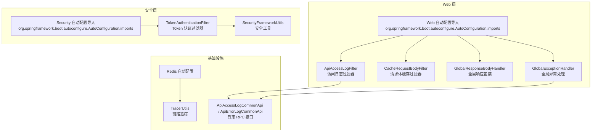
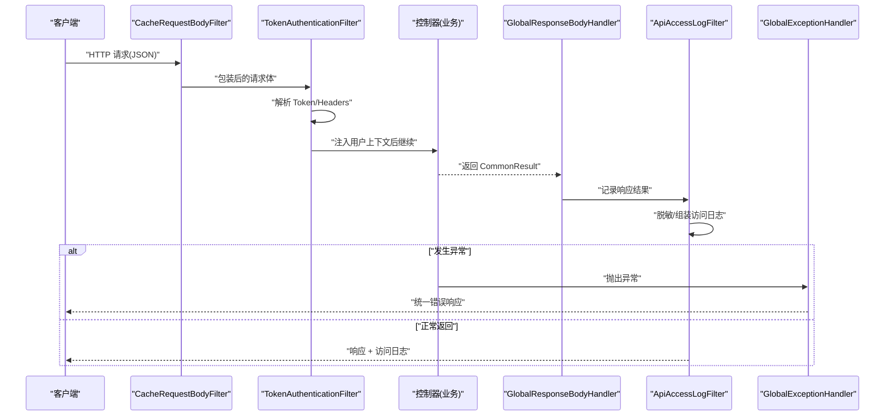
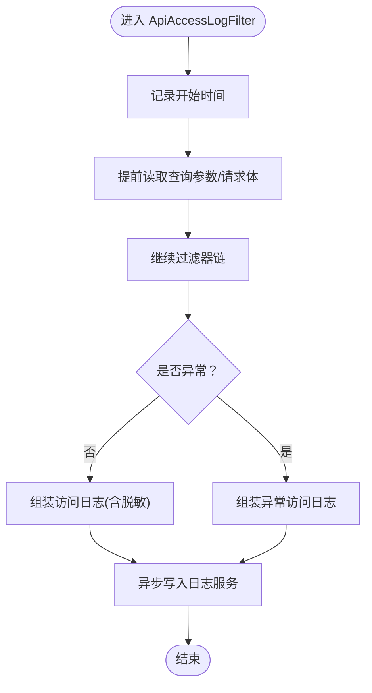
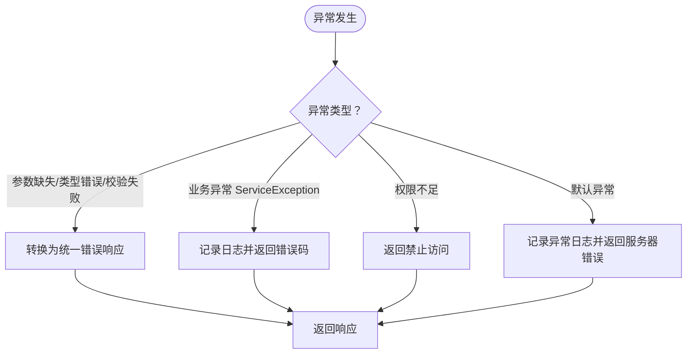
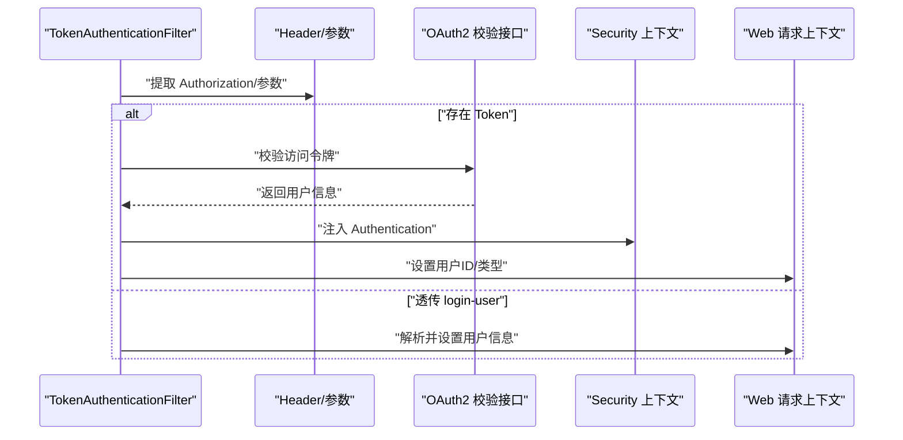
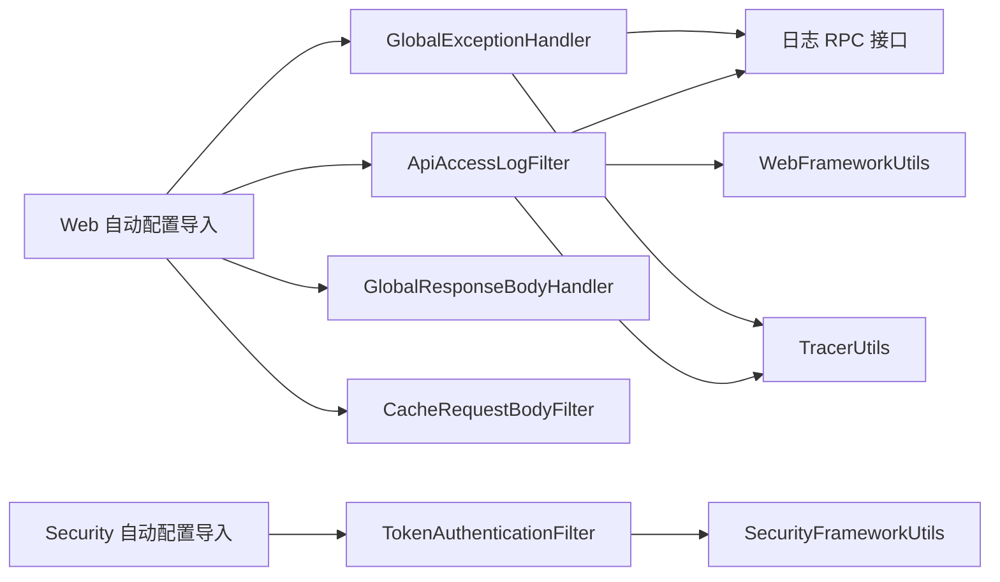

# 调试技巧

<cite>
**本文引用的文件**
- [README.md](file://README.md)
- [AutoTransable.java](file://pandora-framework/pandora-common/src/main/java/com/fhs/trans/service/AutoTransable.java)
- [ApiAccessLogCommonApi.java](file://pandora-framework/pandora-common/src/main/java/net/ittimeline/pandora/framework/common/biz/infra/logger/ApiAccessLogCommonApi.java)
- [ApiErrorLogCommonApi.java](file://pandora-framework/pandora-common/src/main/java/net/ittimeline/pandora/framework/common/biz/infra/logger/ApiErrorLogCommonApi.java)
- [TokenAuthenticationFilter.java](file://pandora-framework/pandora-spring-boot-starter-security/src/main/java/net/ittimeline/pandora/framework/security/core/filter/TokenAuthenticationFilter.java)
- [SecurityFrameworkUtils.java](file://pandora-framework/pandora-spring-boot-starter-security/src/main/java/net/ittimeline/pandora/framework/security/core/util/SecurityFrameworkUtils.java)
- [GlobalExceptionHandler.java](file://pandora-framework/pandora-spring-boot-starter-web/src/main/java/net/ittimeline/pandora/framework/web/core/handler/GlobalExceptionHandler.java)
- [ApiAccessLogFilter.java](file://pandora-framework/pandora-spring-boot-starter-web/src/main/java/net/ittimeline/pandora/framework/apilog/core/filter/ApiAccessLogFilter.java)
- [CacheRequestBodyFilter.java](file://pandora-framework/pandora-spring-boot-starter-web/src/main/java/net/ittimeline/pandora/framework/web/core/filter/CacheRequestBodyFilter.java)
- [GlobalResponseBodyHandler.java](file://pandora-framework/pandora-spring-boot-starter-web/src/main/java/net/ittimeline/pandora/framework/web/core/handler/GlobalResponseBodyHandler.java)
- [WebFrameworkUtils.java](file://pandora-framework/pandora-spring-boot-starter-web/src/main/java/net/ittimeline/pandora/framework/web/core/util/WebFrameworkUtils.java)
- [TracerUtils.java](file://pandora-framework/pandora-common/src/main/java/net/ittimeline/pandora/framework/common/util/web/monitor/TracerUtils.java)
- [PandoraRedisAutoConfiguration.java](file://pandora-framework/pandora-spring-boot-starter-redis/src/main/java/net/ittimeline/pandora/framework/redis/config/PandoraRedisAutoConfiguration.java)
- [org.springframework.boot.autoconfigure.AutoConfiguration.imports (web)](file://pandora-framework/pandora-spring-boot-starter-web/src/main/resources/META-INF/spring/org.springframework.boot.autoconfigure.AutoConfiguration.imports)
- [org.springframework.boot.autoconfigure.AutoConfiguration.imports (security)](file://pandora-framework/pandora-spring-boot-starter-security/src/main/resources/META-INF/spring/org.springframework.boot.autoconfigure.AutoConfiguration.imports)
</cite>

## 目录
1. [简介](#简介)
2. [项目结构](#项目结构)
3. [核心组件](#核心组件)
4. [架构总览](#架构总览)
5. [详细组件分析](#详细组件分析)
6. [依赖关系分析](#依赖关系分析)
7. [性能与可观测性](#性能与可观测性)
8. [故障排查指南](#故障排查指南)
9. [结论](#结论)
10. [附录](#附录)

## 简介
本指南面向使用 Pandora Cloud 框架的开发者与运维人员，聚焦开发与生产环境下的调试方法，覆盖日志分析、断点调试、性能分析、链路追踪、安全认证流程、缓存访问等关键路径。文档同时提供远程调试配置建议、IDE 调试设置要点、命令行工具使用方法、调试脚本与自动化流程设计思路，以及常见场景的操作步骤与最佳实践。

## 项目结构
Pandora Cloud 采用多模块分层组织，核心能力由 web、security、redis、common 等 starter 与公共模块组成。下图展示与调试相关的关键模块与入口：

图表来源
- [org.springframework.boot.autoconfigure.AutoConfiguration.imports (web):1-8](file://pandora-framework/pandora-spring-boot-starter-web/src/main/resources/META-INF/spring/org.springframework.boot.autoconfigure.AutoConfiguration.imports#L1-L8)
- [org.springframework.boot.autoconfigure.AutoConfiguration.imports (security):1-6](file://pandora-framework/pandora-spring-boot-starter-security/src/main/resources/META-INF/spring/org.springframework.boot.autoconfigure.AutoConfiguration.imports#L1-L6)
- [ApiAccessLogFilter.java:1-255](file://pandora-framework/pandora-spring-boot-starter-web/src/main/java/net/ittimeline/pandora/framework/apilog/core/filter/ApiAccessLogFilter.java#L1-L255)
- [CacheRequestBodyFilter.java:1-49](file://pandora-framework/pandora-spring-boot-starter-web/src/main/java/net/ittimeline/pandora/framework/web/core/filter/CacheRequestBodyFilter.java#L1-L49)
- [GlobalResponseBodyHandler.java:1-47](file://pandora-framework/pandora-spring-boot-starter-web/src/main/java/net/ittimeline/pandora/framework/web/core/handler/GlobalResponseBodyHandler.java#L1-L47)
- [GlobalExceptionHandler.java:1-454](file://pandora-framework/pandora-spring-boot-starter-web/src/main/java/net/ittimeline/pandora/framework/web/core/handler/GlobalExceptionHandler.java#L1-L454)
- [TokenAuthenticationFilter.java:1-157](file://pandora-framework/pandora-spring-boot-starter-security/src/main/java/net/ittimeline/pandora/framework/security/core/filter/TokenAuthenticationFilter.java#L1-L157)
- [SecurityFrameworkUtils.java:1-163](file://pandora-framework/pandora-spring-boot-starter-security/src/main/java/net/ittimeline/pandora/framework/security/core/util/SecurityFrameworkUtils.java#L1-L163)
- [PandoraRedisAutoConfiguration.java:1-50](file://pandora-framework/pandora-spring-boot-starter-redis/src/main/java/net/ittimeline/pandora/framework/redis/config/PandoraRedisAutoConfiguration.java#L1-L50)
- [TracerUtils.java:1-30](file://pandora-framework/pandora-common/src/main/java/net/ittimeline/pandora/framework/common/util/web/monitor/TracerUtils.java#L1-L30)
- [ApiAccessLogCommonApi.java:1-40](file://pandora-framework/pandora-common/src/main/java/net/ittimeline/pandora/framework/common/biz/infra/logger/ApiAccessLogCommonApi.java#L1-L40)
- [ApiErrorLogCommonApi.java:1-41](file://pandora-framework/pandora-common/src/main/java/net/ittimeline/pandora/framework/common/biz/infra/logger/ApiErrorLogCommonApi.java#L1-L41)

章节来源
- [README.md:1-15](file://README.md#L1-L15)

## 核心组件
- 访问日志链路：ApiAccessLogFilter 采集请求/响应参数与耗时，脱敏敏感字段，异步写入日志服务；配合 TracerUtils 提供 TraceId。
- 异常兜底链路：GlobalExceptionHandler 将各类异常转换为统一响应，并异步落盘异常日志。
- 安全认证链路：TokenAuthenticationFilter 解析 Authorization/参数中的 Token，调用 OAuth2 校验接口构建 LoginUser，注入 Spring Security 上下文与 Web 请求上下文。
- 响应包装链路：GlobalResponseBodyHandler 记录 Controller 返回的 CommonResult，供访问日志过滤器使用。
- 请求体缓存链路：CacheRequestBodyFilter 对 JSON 请求体进行缓存包装，支持重复读取，避免下游过滤器消费后无法再次读取。
- Redis 链路：PandoraRedisAutoConfiguration 提供 JSON 序列化的 RedisTemplate，便于调试缓存读写。
- 自动装配：各 starter 的 AutoConfiguration.imports 文件声明自动配置入口，便于定位启用的组件。

章节来源
- [ApiAccessLogFilter.java:1-255](file://pandora-framework/pandora-spring-boot-starter-web/src/main/java/net/ittimeline/pandora/framework/apilog/core/filter/ApiAccessLogFilter.java#L1-L255)
- [GlobalExceptionHandler.java:1-454](file://pandora-framework/pandora-spring-boot-starter-web/src/main/java/net/ittimeline/pandora/framework/web/core/handler/GlobalExceptionHandler.java#L1-L454)
- [TokenAuthenticationFilter.java:1-157](file://pandora-framework/pandora-spring-boot-starter-security/src/main/java/net/ittimeline/pandora/framework/security/core/filter/TokenAuthenticationFilter.java#L1-L157)
- [GlobalResponseBodyHandler.java:1-47](file://pandora-framework/pandora-spring-boot-starter-web/src/main/java/net/ittimeline/pandora/framework/web/core/handler/GlobalResponseBodyHandler.java#L1-L47)
- [CacheRequestBodyFilter.java:1-49](file://pandora-framework/pandora-spring-boot-starter-web/src/main/java/net/ittimeline/pandora/framework/web/core/filter/CacheRequestBodyFilter.java#L1-L49)
- [PandoraRedisAutoConfiguration.java:1-50](file://pandora-framework/pandora-spring-boot-starter-redis/src/main/java/net/ittimeline/pandora/framework/redis/config/PandoraRedisAutoConfiguration.java#L1-L50)
- [org.springframework.boot.autoconfigure.AutoConfiguration.imports (web):1-8](file://pandora-framework/pandora-spring-boot-starter-web/src/main/resources/META-INF/spring/org.springframework.boot.autoconfigure.AutoConfiguration.imports#L1-L8)
- [org.springframework.boot.autoconfigure.AutoConfiguration.imports (security):1-6](file://pandora-framework/pandora-spring-boot-starter-security/src/main/resources/META-INF/spring/org.springframework.boot.autoconfigure.AutoConfiguration.imports#L1-L6)

## 架构总览
以下序列图展示一次典型 Web 请求从进入过滤器到完成响应的关键调试节点与数据流转：

图表来源
- [CacheRequestBodyFilter.java:1-49](file://pandora-framework/pandora-spring-boot-starter-web/src/main/java/net/ittimeline/pandora/framework/web/core/filter/CacheRequestBodyFilter.java#L1-L49)
- [TokenAuthenticationFilter.java:1-157](file://pandora-framework/pandora-spring-boot-starter-security/src/main/java/net/ittimeline/pandora/framework/security/core/filter/TokenAuthenticationFilter.java#L1-L157)
- [GlobalResponseBodyHandler.java:1-47](file://pandora-framework/pandora-spring-boot-starter-web/src/main/java/net/ittimeline/pandora/framework/web/core/handler/GlobalResponseBodyHandler.java#L1-L47)
- [ApiAccessLogFilter.java:1-255](file://pandora-framework/pandora-spring-boot-starter-web/src/main/java/net/ittimeline/pandora/framework/apilog/core/filter/ApiAccessLogFilter.java#L1-L255)
- [GlobalExceptionHandler.java:1-454](file://pandora-framework/pandora-spring-boot-starter-web/src/main/java/net/ittimeline/pandora/framework/web/core/handler/GlobalExceptionHandler.java#L1-L454)

## 详细组件分析

### 访问日志过滤器（ApiAccessLogFilter）
- 关键职责
  - 记录请求/响应参数、耗时、TraceId、用户信息、操作模块与类型。
  - 支持注解控制是否记录请求/响应体与敏感字段脱敏。
  - 异步写入访问日志服务，避免阻塞主线程。
- 调试要点
  - 通过注解开关决定是否记录请求体与响应体，便于定位参数与返回数据。
  - 关注脱敏策略，确保敏感字段（如密码、token）不泄露。
  - 结合 TracerUtils 的 TraceId 进行链路关联。
- 影响范围
  - 依赖 WebFrameworkUtils 获取用户上下文。
  - 依赖 ApiAccessLogCommonApi 写入日志。
  - 与 CacheRequestBodyFilter 协作，确保请求体可重复读取。

图表来源
- [ApiAccessLogFilter.java:1-255](file://pandora-framework/pandora-spring-boot-starter-web/src/main/java/net/ittimeline/pandora/framework/apilog/core/filter/ApiAccessLogFilter.java#L1-L255)
- [WebFrameworkUtils.java:1-182](file://pandora-framework/pandora-spring-boot-starter-web/src/main/java/net/ittimeline/pandora/framework/web/core/util/WebFrameworkUtils.java#L1-L182)
- [ApiAccessLogCommonApi.java:1-40](file://pandora-framework/pandora-common/src/main/java/net/ittimeline/pandora/framework/common/biz/infra/logger/ApiAccessLogCommonApi.java#L1-L40)
- [TracerUtils.java:1-30](file://pandora-framework/pandora-common/src/main/java/net/ittimeline/pandora/framework/common/util/web/monitor/TracerUtils.java#L1-L30)

章节来源
- [ApiAccessLogFilter.java:1-255](file://pandora-framework/pandora-spring-boot-starter-web/src/main/java/net/ittimeline/pandora/framework/apilog/core/filter/ApiAccessLogFilter.java#L1-L255)

### 全局异常处理（GlobalExceptionHandler）
- 关键职责
  - 统一捕获并转换各类异常为 CommonResult。
  - 异步记录异常日志，包含堆栈、TraceId、请求参数、用户信息等。
  - 针对特定异常（如表不存在）给出模块化提示。
- 调试要点
  - 观察异常日志写入是否成功，关注异步调用失败的兜底处理。
  - 通过 TraceId 关联访问日志与异常日志。
  - 针对 ServiceException，关注是否被忽略打印或降噪处理。

图表来源
- [GlobalExceptionHandler.java:1-454](file://pandora-framework/pandora-spring-boot-starter-web/src/main/java/net/ittimeline/pandora/framework/web/core/handler/GlobalExceptionHandler.java#L1-L454)
- [ApiErrorLogCommonApi.java:1-41](file://pandora-framework/pandora-common/src/main/java/net/ittimeline/pandora/framework/common/biz/infra/logger/ApiErrorLogCommonApi.java#L1-L41)
- [TracerUtils.java:1-30](file://pandora-framework/pandora-common/src/main/java/net/ittimeline/pandora/framework/common/util/web/monitor/TracerUtils.java#L1-L30)

章节来源
- [GlobalExceptionHandler.java:1-454](file://pandora-framework/pandora-spring-boot-starter-web/src/main/java/net/ittimeline/pandora/framework/web/core/handler/GlobalExceptionHandler.java#L1-L454)

### 安全认证过滤器（TokenAuthenticationFilter）
- 关键职责
  - 从 Header/参数解析 Token，调用 OAuth2 校验接口，构建 LoginUser 并注入上下文。
  - 支持透传 Header 中的 login-user，便于网关或内部服务直连场景。
  - 提供开发调试用的“模拟登录”能力（需谨慎开启）。
- 调试要点
  - 关注 Token 解析顺序与前缀去除逻辑。
  - 校验用户类型与请求路径前缀是否匹配。
  - 生产环境务必关闭“模拟登录”开关。

图表来源
- [TokenAuthenticationFilter.java:1-157](file://pandora-framework/pandora-spring-boot-starter-security/src/main/java/net/ittimeline/pandora/framework/security/core/filter/TokenAuthenticationFilter.java#L1-L157)
- [SecurityFrameworkUtils.java:1-163](file://pandora-framework/pandora-spring-boot-starter-security/src/main/java/net/ittimeline/pandora/framework/security/core/util/SecurityFrameworkUtils.java#L1-L163)

章节来源
- [TokenAuthenticationFilter.java:1-157](file://pandora-framework/pandora-spring-boot-starter-security/src/main/java/net/ittimeline/pandora/framework/security/core/filter/TokenAuthenticationFilter.java#L1-L157)
- [SecurityFrameworkUtils.java:1-163](file://pandora-framework/pandora-spring-boot-starter-security/src/main/java/net/ittimeline/pandora/framework/security/core/util/SecurityFrameworkUtils.java#L1-L163)

### 响应包装与访问日志联动（GlobalResponseBodyHandler + ApiAccessLogFilter）
- 关键职责
  - GlobalResponseBodyHandler 记录返回的 CommonResult，供 ApiAccessLogFilter 在链路末尾写入访问日志。
- 调试要点
  - 确认返回值类型为 CommonResult，否则不会被记录。
  - 若出现“访问日志无返回体”，检查注解是否开启响应体记录。

章节来源
- [GlobalResponseBodyHandler.java:1-47](file://pandora-framework/pandora-spring-boot-starter-web/src/main/java/net/ittimeline/pandora/framework/web/core/handler/GlobalResponseBodyHandler.java#L1-L47)
- [ApiAccessLogFilter.java:1-255](file://pandora-framework/pandora-spring-boot-starter-web/src/main/java/net/ittimeline/pandora/framework/apilog/core/filter/ApiAccessLogFilter.java#L1-L255)

### 请求体缓存（CacheRequestBodyFilter）
- 关键职责
  - 对 JSON 请求进行缓存包装，支持重复读取，避免下游过滤器消费后无法再次读取。
- 调试要点
  - 非 JSON 请求会被排除，确认 Content-Type 是否正确。
  - 排除 /admin、/actuator 等管理端点，避免干扰。

章节来源
- [CacheRequestBodyFilter.java:1-49](file://pandora-framework/pandora-spring-boot-starter-web/src/main/java/net/ittimeline/pandora/framework/web/core/filter/CacheRequestBodyFilter.java#L1-L49)

### Redis 链路（PandoraRedisAutoConfiguration）
- 关键职责
  - 提供 JSON 序列化的 RedisTemplate，便于调试缓存读写。
- 调试要点
  - 关注键空间与序列化策略，避免跨语言/版本兼容问题。
  - 结合链路追踪 ID 定位缓存访问路径。

章节来源
- [PandoraRedisAutoConfiguration.java:1-50](file://pandora-framework/pandora-spring-boot-starter-redis/src/main/java/net/ittimeline/pandora/framework/redis/config/PandoraRedisAutoConfiguration.java#L1-L50)

## 依赖关系分析
- 自动装配导入
  - Web Starter 导入 Banner/Jackson/Web/ApiLog/Swagger/Xss/Encrypt 等自动配置。
  - Security Starter 导入 Security/WebSecurity/OperateLog 等自动配置。
- 组件耦合
  - 访问日志过滤器依赖 WebFrameworkUtils、TracerUtils、ApiAccessLogCommonApi。
  - 全局异常处理器依赖 ApiErrorLogCommonApi、TracerUtils、WebFrameworkUtils。
  - 安全过滤器依赖 SecurityFrameworkUtils、OAuth2 校验接口。

图表来源
- [org.springframework.boot.autoconfigure.AutoConfiguration.imports (web):1-8](file://pandora-framework/pandora-spring-boot-starter-web/src/main/resources/META-INF/spring/org.springframework.boot.autoconfigure.AutoConfiguration.imports#L1-L8)
- [org.springframework.boot.autoconfigure.AutoConfiguration.imports (security):1-6](file://pandora-framework/pandora-spring-boot-starter-security/src/main/resources/META-INF/spring/org.springframework.boot.autoconfigure.AutoConfiguration.imports#L1-L6)
- [ApiAccessLogFilter.java:1-255](file://pandora-framework/pandora-spring-boot-starter-web/src/main/java/net/ittimeline/pandora/framework/apilog/core/filter/ApiAccessLogFilter.java#L1-L255)
- [GlobalExceptionHandler.java:1-454](file://pandora-framework/pandora-spring-boot-starter-web/src/main/java/net/ittimeline/pandora/framework/web/core/handler/GlobalExceptionHandler.java#L1-L454)
- [TokenAuthenticationFilter.java:1-157](file://pandora-framework/pandora-spring-boot-starter-security/src/main/java/net/ittimeline/pandora/framework/security/core/filter/TokenAuthenticationFilter.java#L1-L157)
- [ApiAccessLogCommonApi.java:1-40](file://pandora-framework/pandora-common/src/main/java/net/ittimeline/pandora/framework/common/biz/infra/logger/ApiAccessLogCommonApi.java#L1-L40)
- [ApiErrorLogCommonApi.java:1-41](file://pandora-framework/pandora-common/src/main/java/net/ittimeline/pandora/framework/common/biz/infra/logger/ApiErrorLogCommonApi.java#L1-L41)
- [TracerUtils.java:1-30](file://pandora-framework/pandora-common/src/main/java/net/ittimeline/pandora/framework/common/util/web/monitor/TracerUtils.java#L1-L30)
- [WebFrameworkUtils.java:1-182](file://pandora-framework/pandora-spring-boot-starter-web/src/main/java/net/ittimeline/pandora/framework/web/core/util/WebFrameworkUtils.java#L1-L182)
- [SecurityFrameworkUtils.java:1-163](file://pandora-framework/pandora-spring-boot-starter-security/src/main/java/net/ittimeline/pandora/framework/security/core/util/SecurityFrameworkUtils.java#L1-L163)

## 性能与可观测性
- 链路追踪
  - 使用 TracerUtils 获取 TraceId，贯穿访问日志与异常日志，便于端到端排查。
- 日志采样与脱敏
  - 访问日志与异常日志均支持敏感字段脱敏，避免泄露。
- 异步写入
  - 访问日志与异常日志均采用异步写入，降低对主请求的影响。
- 缓存序列化
  - RedisTemplate 使用 JSON 序列化，便于调试与跨语言兼容。

章节来源
- [TracerUtils.java:1-30](file://pandora-framework/pandora-common/src/main/java/net/ittimeline/pandora/framework/common/util/web/monitor/TracerUtils.java#L1-L30)
- [ApiAccessLogFilter.java:1-255](file://pandora-framework/pandora-spring-boot-starter-web/src/main/java/net/ittimeline/pandora/framework/apilog/core/filter/ApiAccessLogFilter.java#L1-L255)
- [GlobalExceptionHandler.java:1-454](file://pandora-framework/pandora-spring-boot-starter-web/src/main/java/net/ittimeline/pandora/framework/web/core/handler/GlobalExceptionHandler.java#L1-L454)
- [PandoraRedisAutoConfiguration.java:1-50](file://pandora-framework/pandora-spring-boot-starter-redis/src/main/java/net/ittimeline/pandora/framework/redis/config/PandoraRedisAutoConfiguration.java#L1-L50)

## 故障排查指南

### Web 请求链路调试步骤
- 步骤
  - 使用浏览器/Postman/CLI 发送请求，观察响应状态码与消息。
  - 查看访问日志过滤器是否记录请求/响应体（可通过注解开关与脱敏策略确认）。
  - 若异常，查看全局异常处理器是否捕获并写入异常日志。
  - 使用 TraceId 关联访问日志与异常日志。
- 常见问题
  - 请求体为空：确认 Content-Type 为 JSON，且未被 CacheRequestBodyFilter 排除。
  - 无返回体：确认返回值类型为 CommonResult，且访问日志注解允许记录响应体。
  - 用户信息缺失：确认 TokenAuthenticationFilter 已正确注入用户上下文。

章节来源
- [ApiAccessLogFilter.java:1-255](file://pandora-framework/pandora-spring-boot-starter-web/src/main/java/net/ittimeline/pandora/framework/apilog/core/filter/ApiAccessLogFilter.java#L1-L255)
- [GlobalExceptionHandler.java:1-454](file://pandora-framework/pandora-spring-boot-starter-web/src/main/java/net/ittimeline/pandora/framework/web/core/handler/GlobalExceptionHandler.java#L1-L454)
- [CacheRequestBodyFilter.java:1-49](file://pandora-framework/pandora-spring-boot-starter-web/src/main/java/net/ittimeline/pandora/framework/web/core/filter/CacheRequestBodyFilter.java#L1-L49)
- [TokenAuthenticationFilter.java:1-157](file://pandora-framework/pandora-spring-boot-starter-security/src/main/java/net/ittimeline/pandora/framework/security/core/filter/TokenAuthenticationFilter.java#L1-L157)

### 安全认证流程调试步骤
- 步骤
  - 确认请求头或参数中携带正确的认证信息（支持 Bearer 前缀）。
  - 检查用户类型与请求路径前缀是否匹配。
  - 如需开发调试，可使用“模拟登录”能力（生产务必关闭）。
- 常见问题
  - 用户类型不匹配：检查请求路径前缀与用户类型约定。
  - Token 校验失败：确认 OAuth2 校验接口可用与返回信息正确。

章节来源
- [TokenAuthenticationFilter.java:1-157](file://pandora-framework/pandora-spring-boot-starter-security/src/main/java/net/ittimeline/pandora/framework/security/core/filter/TokenAuthenticationFilter.java#L1-L157)
- [SecurityFrameworkUtils.java:1-163](file://pandora-framework/pandora-spring-boot-starter-security/src/main/java/net/ittimeline/pandora/framework/security/core/util/SecurityFrameworkUtils.java#L1-L163)

### 缓存访问调试步骤
- 步骤
  - 使用 Redis 客户端连接实例，确认键空间与序列化策略。
  - 关注 TTL、过期策略与热点键。
- 常见问题
  - 反序列化失败：确认序列化/反序列化一致，避免跨语言差异。

章节来源
- [PandoraRedisAutoConfiguration.java:1-50](file://pandora-framework/pandora-spring-boot-starter-redis/src/main/java/net/ittimeline/pandora/framework/redis/config/PandoraRedisAutoConfiguration.java#L1-L50)

### 远程调试与 IDE 配置
- 远程调试
  - 在启动参数中添加 JVM 远程调试选项，允许 IDE 远程 attach。
  - 在 CI/CD 环境中，结合容器日志与链路追踪进行联合诊断。
- IDE 调试
  - 在关键过滤器与处理器处设置断点，逐步跟踪请求上下文与用户信息。
  - 使用条件断点过滤特定 TraceId 或用户 ID。

### 命令行调试工具
- curl/wget：构造最小可复现请求，观察响应与日志。
- jq：对 JSON 响应进行格式化输出，辅助定位问题。
- 浏览器开发者工具：抓包查看请求头、响应头与响应体。

### 调试脚本与自动化流程
- 脚本建议
  - 编写一键复现脚本，包含请求构造、参数准备、响应解析与日志采集。
  - 结合 TraceId 自动化关联访问日志与异常日志。
- 自动化流程
  - 将调试脚本集成至 CI/CD，触发回归测试与冒烟测试。
  - 对高风险变更建立自动化回归清单，覆盖认证、日志、缓存等关键路径。

## 结论
通过理解 Pandora Cloud 的过滤器链、异常处理机制、安全认证流程与日志链路，结合链路追踪与脱敏策略，可以在开发与生产环境中高效定位问题。建议在开发阶段充分利用注解开关与模拟登录能力，在生产阶段严格控制日志与异常的输出范围，并通过 TraceId 实现端到端关联分析。

## 附录
- 常用调试开关与位置
  - 访问日志：ApiAccessLogFilter 注解开关与脱敏策略。
  - 异常日志：GlobalExceptionHandler 异步写入与脱敏。
  - 安全认证：TokenAuthenticationFilter 的模拟登录开关。
- 参考文件
  - [README.md:1-15](file://README.md#L1-L15)
  - [AutoTransable.java:1-61](file://pandora-framework/pandora-common/src/main/java/com/fhs/trans/service/AutoTransable.java#L1-L61)