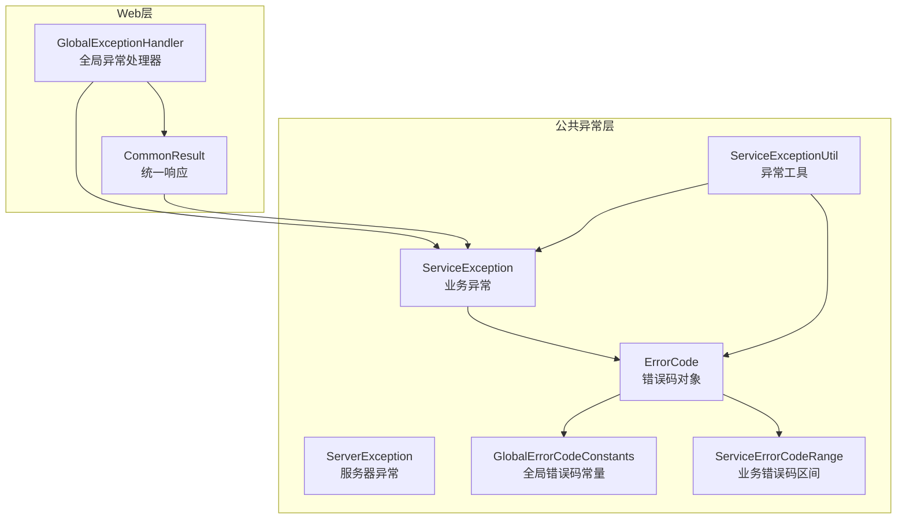
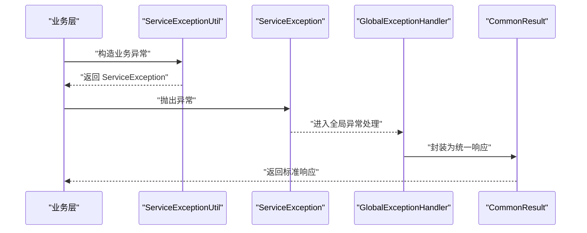
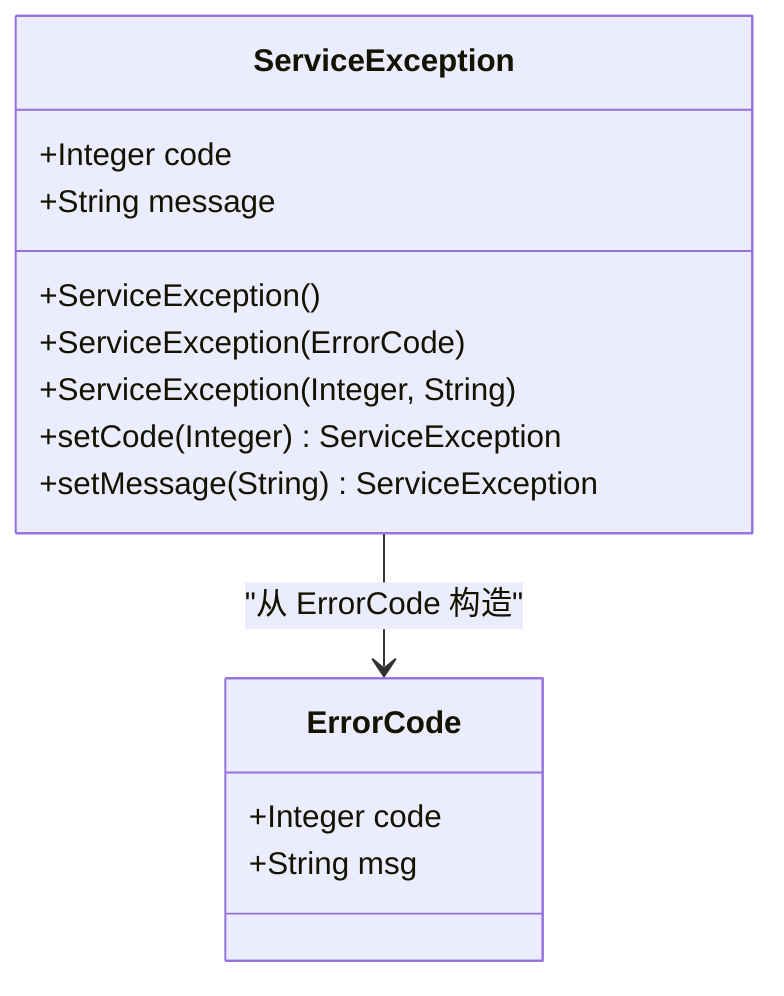
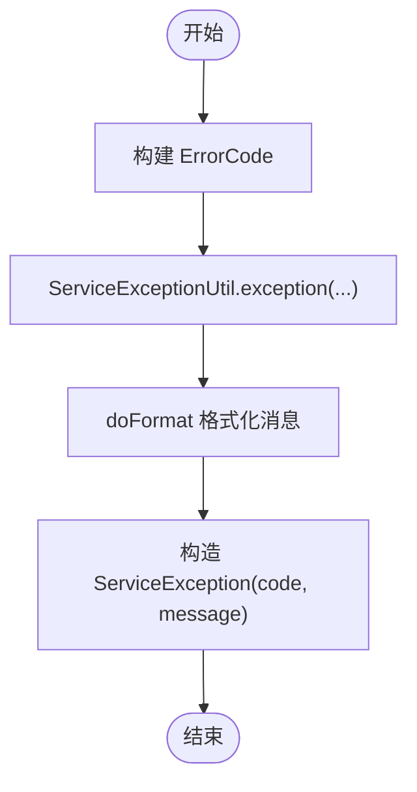
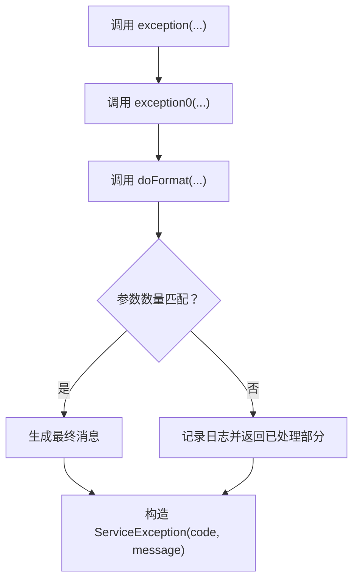
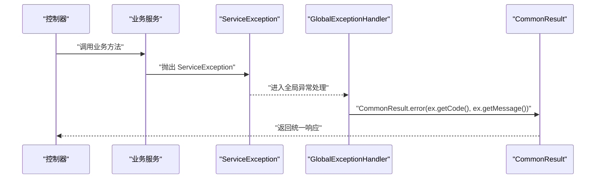
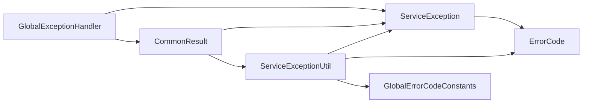

# 业务异常ServiceException

<cite>
**本文引用的文件**
- [ServiceException.java](file://pandora-framework/pandora-common/src/main/java/net/ittimeline/pandora/framework/common/exception/ServiceException.java)
- [ErrorCode.java](file://pandora-framework/pandora-common/src/main/java/net/ittimeline/pandora/framework/common/exception/ErrorCode.java)
- [GlobalErrorCodeConstants.java](file://pandora-framework/pandora-common/src/main/java/net/ittimeline/pandora/framework/common/exception/enums/GlobalErrorCodeConstants.java)
- [ServiceErrorCodeRange.java](file://pandora-framework/pandora-common/src/main/java/net/ittimeline/pandora/framework/common/exception/enums/ServiceErrorCodeRange.java)
- [ServiceExceptionUtil.java](file://pandora-framework/pandora-common/src/main/java/net/ittimeline/pandora/framework/common/exception/util/ServiceExceptionUtil.java)
- [ServerException.java](file://pandora-framework/pandora-common/src/main/java/net/ittimeline/pandora/framework/common/exception/ServerException.java)
- [CommonResult.java](file://pandora-framework/pandora-common/src/main/java/net/ittimeline/pandora/framework/common/pojo/CommonResult.java)
- [GlobalExceptionHandler.java](file://pandora-framework/pandora-spring-boot-starter-web/src/main/java/net/ittimeline/pandora/framework/web/core/handler/GlobalExceptionHandler.java)
</cite>

## 目录
1. [简介](#简介)
2. [项目结构](#项目结构)
3. [核心组件](#核心组件)
4. [架构总览](#架构总览)
5. [详细组件分析](#详细组件分析)
6. [依赖分析](#依赖分析)
7. [性能考虑](#性能考虑)
8. [故障排除指南](#故障排除指南)
9. [结论](#结论)
10. [附录](#附录)

## 简介
本文件围绕业务异常 ServiceException 提供系统化的故障排除文档，覆盖设计理念、错误码机制、使用场景、异常构造方法、错误码与消息的绑定关系、常见业务异常场景的诊断方法、异常捕获与转换最佳实践，以及在控制器层如何正确处理业务异常并返回标准响应格式。

## 项目结构
围绕 ServiceException 的相关代码主要分布在以下模块与包中：
- 异常定义与错误码：common.exception、common.exception.enums
- 异常工具：common.exception.util
- 标准响应：common.pojo
- 全局异常处理：web.core.handler

图表来源
- [ServiceException.java:1-64](file://pandora-framework/pandora-common/src/main/java/net/ittimeline/pandora/framework/common/exception/ServiceException.java#L1-L64)
- [ServerException.java:1-65](file://pandora-framework/pandora-common/src/main/java/net/ittimeline/pandora/framework/common/exception/ServerException.java#L1-L65)
- [ErrorCode.java:1-33](file://pandora-framework/pandora-common/src/main/java/net/ittimeline/pandora/framework/common/exception/ErrorCode.java#L1-L33)
- [GlobalErrorCodeConstants.java:1-42](file://pandora-framework/pandora-common/src/main/java/net/ittimeline/pandora/framework/common/exception/enums/GlobalErrorCodeConstants.java#L1-L42)
- [ServiceErrorCodeRange.java:1-48](file://pandora-framework/pandora-common/src/main/java/net/ittimeline/pandora/framework/common/exception/enums/ServiceErrorCodeRange.java#L1-L48)
- [ServiceExceptionUtil.java:1-85](file://pandora-framework/pandora-common/src/main/java/net/ittimeline/pandora/framework/common/exception/util/ServiceExceptionUtil.java#L1-L85)
- [CommonResult.java:1-123](file://pandora-framework/pandora-common/src/main/java/net/ittimeline/pandora/framework/common/pojo/CommonResult.java#L1-L123)
- [GlobalExceptionHandler.java:1-454](file://pandora-framework/pandora-spring-boot-starter-web/src/main/java/net/ittimeline/pandora/framework/web/core/handler/GlobalExceptionHandler.java#L1-L454)

章节来源
- [ServiceException.java:1-64](file://pandora-framework/pandora-common/src/main/java/net/ittimeline/pandora/framework/common/exception/ServiceException.java#L1-L64)
- [GlobalExceptionHandler.java:1-454](file://pandora-framework/pandora-spring-boot-starter-web/src/main/java/net/ittimeline/pandora/framework/web/core/handler/GlobalExceptionHandler.java#L1-L454)

## 核心组件
- ServiceException：业务异常类，承载业务错误码与错误消息，支持多种构造方式。
- ErrorCode：错误码对象，封装 code 与 msg，用于统一管理错误码与消息。
- GlobalErrorCodeConstants：全局错误码常量集合（0-999），覆盖客户端错误、服务端错误与自定义错误。
- ServiceErrorCodeRange：业务异常错误码区间规范（10 位编码，四段式），用于避免模块间冲突。
- ServiceExceptionUtil：异常工具类，提供基于占位符的格式化方法与便捷构造方法。
- CommonResult：统一响应对象，承载 code、msg、data，并提供与异常体系的互转。
- GlobalExceptionHandler：全局异常处理器，负责将各类异常转换为统一响应格式。

章节来源
- [ServiceException.java:1-64](file://pandora-framework/pandora-common/src/main/java/net/ittimeline/pandora/framework/common/exception/ServiceException.java#L1-L64)
- [ErrorCode.java:1-33](file://pandora-framework/pandora-common/src/main/java/net/ittimeline/pandora/framework/common/exception/ErrorCode.java#L1-L33)
- [GlobalErrorCodeConstants.java:1-42](file://pandora-framework/pandora-common/src/main/java/net/ittimeline/pandora/framework/common/exception/enums/GlobalErrorCodeConstants.java#L1-L42)
- [ServiceErrorCodeRange.java:1-48](file://pandora-framework/pandora-common/src/main/java/net/ittimeline/pandora/framework/common/exception/enums/ServiceErrorCodeRange.java#L1-L48)
- [ServiceExceptionUtil.java:1-85](file://pandora-framework/pandora-common/src/main/java/net/ittimeline/pandora/framework/common/exception/util/ServiceExceptionUtil.java#L1-L85)
- [CommonResult.java:1-123](file://pandora-framework/pandora-common/src/main/java/net/ittimeline/pandora/framework/common/pojo/CommonResult.java#L1-L123)
- [GlobalExceptionHandler.java:1-454](file://pandora-framework/pandora-spring-boot-starter-web/src/main/java/net/ittimeline/pandora/framework/web/core/handler/GlobalExceptionHandler.java#L1-L454)

## 架构总览
ServiceException 在整个系统中的职责链路如下：
- 业务层抛出 ServiceException 或使用 ServiceExceptionUtil 快速构造
- 全局异常处理器捕获 ServiceException，将其转换为 CommonResult 统一响应
- 控制器层无需感知具体异常类型，只需接收统一响应即可

图表来源
- [ServiceExceptionUtil.java:1-85](file://pandora-framework/pandora-common/src/main/java/net/ittimeline/pandora/framework/common/exception/util/ServiceExceptionUtil.java#L1-L85)
- [ServiceException.java:1-64](file://pandora-framework/pandora-common/src/main/java/net/ittimeline/pandora/framework/common/exception/ServiceException.java#L1-L64)
- [GlobalExceptionHandler.java:294-316](file://pandora-framework/pandora-spring-boot-starter-web/src/main/java/net/ittimeline/pandora/framework/web/core/handler/GlobalExceptionHandler.java#L294-L316)
- [CommonResult.java:1-123](file://pandora-framework/pandora-common/src/main/java/net/ittimeline/pandora/framework/common/pojo/CommonResult.java#L1-L123)

## 详细组件分析

### ServiceException 设计与构造
- 设计理念
  - 作为业务异常载体，提供 code 与 message 字段，便于前端与网关统一识别与展示。
  - 支持从 ErrorCode 构造，或直接传入 code 与 message，增强灵活性。
- 构造方法
  - 无参构造：避免反序列化问题。
  - 从 ErrorCode 构造：自动绑定 code 与 msg。
  - 从 code+message 构造：灵活指定业务错误码与提示。
- 关键点
  - 提供 setter 以便动态修改 code/message，便于在不同上下文中复用同一异常实例。
  - 与 ServiceExceptionUtil 配合，可先格式化消息再构造异常。

图表来源
- [ServiceException.java:1-64](file://pandora-framework/pandora-common/src/main/java/net/ittimeline/pandora/framework/common/exception/ServiceException.java#L1-L64)
- [ErrorCode.java:1-33](file://pandora-framework/pandora-common/src/main/java/net/ittimeline/pandora/framework/common/exception/ErrorCode.java#L1-L33)

章节来源
- [ServiceException.java:1-64](file://pandora-framework/pandora-common/src/main/java/net/ittimeline/pandora/framework/common/exception/ServiceException.java#L1-L64)

### 错误码机制与绑定关系
- 错误码对象
  - ErrorCode 封装 code 与 msg，作为错误码的最小单元。
- 全局错误码
  - GlobalErrorCodeConstants 定义 0-999 的全局错误码，覆盖客户端错误、服务端错误与自定义错误。
- 业务错误码区间
  - ServiceErrorCodeRange 规定业务异常错误码区间为 10 位四段式，避免模块冲突。
- 绑定关系
  - ServiceException 与 ErrorCode 的绑定：从 ErrorCode 构造时，code 与 msg 直接来自 ErrorCode。
  - ServiceExceptionUtil 的格式化：通过占位符 {} 与 doFormat 方法，将模板消息与参数组合生成最终提示。

图表来源
- [ErrorCode.java:1-33](file://pandora-framework/pandora-common/src/main/java/net/ittimeline/pandora/framework/common/exception/ErrorCode.java#L1-L33)
- [ServiceExceptionUtil.java:30-33](file://pandora-framework/pandora-common/src/main/java/net/ittimeline/pandora/framework/common/exception/util/ServiceExceptionUtil.java#L30-L33)
- [ServiceException.java:34-42](file://pandora-framework/pandora-common/src/main/java/net/ittimeline/pandora/framework/common/exception/ServiceException.java#L34-L42)

章节来源
- [GlobalErrorCodeConstants.java:1-42](file://pandora-framework/pandora-common/src/main/java/net/ittimeline/pandora/framework/common/exception/enums/GlobalErrorCodeConstants.java#L1-L42)
- [ServiceErrorCodeRange.java:1-48](file://pandora-framework/pandora-common/src/main/java/net/ittimeline/pandora/framework/common/exception/enums/ServiceErrorCodeRange.java#L1-L48)
- [ServiceExceptionUtil.java:1-85](file://pandora-framework/pandora-common/src/main/java/net/ittimeline/pandora/framework/common/exception/util/ServiceExceptionUtil.java#L1-L85)

### 异常工具 ServiceExceptionUtil
- 作用
  - 提供便捷的异常构造方法，支持带参数的消息模板与占位符格式化。
- 核心方法
  - exception(ErrorCode)：从错误码构造异常。
  - exception(ErrorCode, params)：带参数格式化构造异常。
  - exception0(code, messagePattern, params)：底层构造方法。
  - invalidParamException(messagePattern, params)：快速构造“请求参数不正确”异常。
  - doFormat(code, messagePattern, params)：占位符格式化，避免 String.format 的风险。
- 最佳实践
  - 使用 {} 作为占位符，确保参数数量与顺序正确。
  - 当参数不足或过多时，记录日志并返回已处理部分，避免异常传播。

图表来源
- [ServiceExceptionUtil.java:22-33](file://pandora-framework/pandora-common/src/main/java/net/ittimeline/pandora/framework/common/exception/util/ServiceExceptionUtil.java#L22-L33)
- [ServiceExceptionUtil.java:35-37](file://pandora-framework/pandora-common/src/main/java/net/ittimeline/pandora/framework/common/exception/util/ServiceExceptionUtil.java#L35-L37)
- [ServiceExceptionUtil.java:50-82](file://pandora-framework/pandora-common/src/main/java/net/ittimeline/pandora/framework/common/exception/util/ServiceExceptionUtil.java#L50-L82)

章节来源
- [ServiceExceptionUtil.java:1-85](file://pandora-framework/pandora-common/src/main/java/net/ittimeline/pandora/framework/common/exception/util/ServiceExceptionUtil.java#L1-L85)

### 统一响应与异常转换
- CommonResult
  - 统一承载 code、msg、data，提供 success/error/checkError 等方法。
  - 提供与 ServiceException 的互转：error(ServiceException) 直接映射。
- 异常转换
  - GlobalExceptionHandler 将 ServiceException 转换为 CommonResult，保证前端统一消费。
  - 对于非 ServiceException 的异常，进行兜底处理并返回统一错误码。

图表来源
- [CommonResult.java:119-121](file://pandora-framework/pandora-common/src/main/java/net/ittimeline/pandora/framework/common/pojo/CommonResult.java#L119-L121)
- [GlobalExceptionHandler.java:294-316](file://pandora-framework/pandora-spring-boot-starter-web/src/main/java/net/ittimeline/pandora/framework/web/core/handler/GlobalExceptionHandler.java#L294-L316)

章节来源
- [CommonResult.java:1-123](file://pandora-framework/pandora-common/src/main/java/net/ittimeline/pandora/framework/common/pojo/CommonResult.java#L1-L123)
- [GlobalExceptionHandler.java:1-454](file://pandora-framework/pandora-spring-boot-starter-web/src/main/java/net/ittimeline/pandora/framework/web/core/handler/GlobalExceptionHandler.java#L1-L454)

## 依赖分析
- ServiceException 依赖 ErrorCode 与 ServiceErrorCodeRange（通过构造与错误码区间规范）。
- ServiceExceptionUtil 依赖 ErrorCode、ServiceException、GlobalErrorCodeConstants，提供异常构造与格式化。
- CommonResult 依赖 ServiceException、ServiceExceptionUtil，提供异常与响应互转。
- GlobalExceptionHandler 依赖 ServiceException、CommonResult，负责异常到响应的转换与日志记录。

图表来源
- [ServiceException.java:1-64](file://pandora-framework/pandora-common/src/main/java/net/ittimeline/pandora/framework/common/exception/ServiceException.java#L1-L64)
- [ErrorCode.java:1-33](file://pandora-framework/pandora-common/src/main/java/net/ittimeline/pandora/framework/common/exception/ErrorCode.java#L1-L33)
- [ServiceExceptionUtil.java:1-85](file://pandora-framework/pandora-common/src/main/java/net/ittimeline/pandora/framework/common/exception/util/ServiceExceptionUtil.java#L1-L85)
- [CommonResult.java:1-123](file://pandora-framework/pandora-common/src/main/java/net/ittimeline/pandora/framework/common/pojo/CommonResult.java#L1-L123)
- [GlobalExceptionHandler.java:1-454](file://pandora-framework/pandora-spring-boot-starter-web/src/main/java/net/ittimeline/pandora/framework/web/core/handler/GlobalExceptionHandler.java#L1-L454)

章节来源
- [ServiceException.java:1-64](file://pandora-framework/pandora-common/src/main/java/net/ittimeline/pandora/framework/common/exception/ServiceException.java#L1-L64)
- [ServiceExceptionUtil.java:1-85](file://pandora-framework/pandora-common/src/main/java/net/ittimeline/pandora/framework/common/exception/util/ServiceExceptionUtil.java#L1-L85)
- [CommonResult.java:1-123](file://pandora-framework/pandora-common/src/main/java/net/ittimeline/pandora/framework/common/pojo/CommonResult.java#L1-L123)
- [GlobalExceptionHandler.java:1-454](file://pandora-framework/pandora-spring-boot-starter-web/src/main/java/net/ittimeline/pandora/framework/web/core/handler/GlobalExceptionHandler.java#L1-L454)

## 性能考虑
- 占位符格式化优化
  - doFormat 预分配 StringBuilder 容量，减少扩容开销，提升格式化性能。
- 日志输出控制
  - GlobalExceptionHandler 对 ServiceException 的堆栈进行精简输出，避免过多日志刷屏。
- 统一响应序列化
  - CommonResult 使用 Jackson 注解忽略部分计算字段，降低序列化成本。

章节来源
- [ServiceExceptionUtil.java:50-82](file://pandora-framework/pandora-common/src/main/java/net/ittimeline/pandora/framework/common/exception/util/ServiceExceptionUtil.java#L50-L82)
- [GlobalExceptionHandler.java:294-316](file://pandora-framework/pandora-spring-boot-starter-web/src/main/java/net/ittimeline/pandora/framework/web/core/handler/GlobalExceptionHandler.java#L294-L316)
- [CommonResult.java:86-94](file://pandora-framework/pandora-common/src/main/java/net/ittimeline/pandora/framework/common/pojo/CommonResult.java#L86-L94)

## 故障排除指南

### 1. 参数验证失败
- 现象
  - 控制器层收到“请求参数不正确”的统一响应。
- 诊断步骤
  - 查看 GlobalExceptionHandler 中对参数校验异常的处理分支，确认是否为参数缺失、类型不匹配、JSON 解析失败等。
  - 若使用 ServiceExceptionUtil.invalidParamException 构造，检查模板与参数数量是否一致。
- 处理建议
  - 在业务层优先使用参数校验注解（如 JSR-303），并在异常处理器中统一返回。
  - 对于复杂校验，使用 ServiceExceptionUtil.doFormat 提供可读性强的错误提示。

章节来源
- [GlobalExceptionHandler.java:127-197](file://pandora-framework/pandora-spring-boot-starter-web/src/main/java/net/ittimeline/pandora/framework/web/core/handler/GlobalExceptionHandler.java#L127-L197)
- [ServiceExceptionUtil.java:35-37](file://pandora-framework/pandora-common/src/main/java/net/ittimeline/pandora/framework/common/exception/util/ServiceExceptionUtil.java#L35-L37)

### 2. 业务规则违反
- 现象
  - 业务层抛出 ServiceException，统一响应返回业务错误码与提示。
- 诊断步骤
  - 检查 ServiceException 的 code 是否落在业务错误码区间（10 位四段式）。
  - 确认 ServiceExceptionUtil 的模板与参数是否正确，避免占位符数量不匹配。
- 处理建议
  - 为每个业务规则定义独立的错误码与模板，便于定位与统计。
  - 使用 ServiceExceptionUtil.exception(ErrorCode, params) 统一构造，避免手写消息。

章节来源
- [ServiceErrorCodeRange.java:1-48](file://pandora-framework/pandora-common/src/main/java/net/ittimeline/pandora/framework/common/exception/enums/ServiceErrorCodeRange.java#L1-L48)
- [ServiceExceptionUtil.java:22-28](file://pandora-framework/pandora-common/src/main/java/net/ittimeline/pandora/framework/common/exception/util/ServiceExceptionUtil.java#L22-L28)

### 3. 数据状态异常
- 现象
  - 业务状态与期望不符，抛出 ServiceException，统一响应返回业务错误。
- 诊断步骤
  - 确认业务前置条件是否满足（如幂等、并发控制、资源锁定等）。
  - 检查是否存在重复请求或锁冲突导致的状态异常。
- 处理建议
  - 在业务层尽早校验状态，必要时引入幂等与重试策略。
  - 使用 ServiceExceptionUtil 的格式化能力，将关键上下文（如 ID、状态）注入消息。

章节来源
- [GlobalErrorCodeConstants.java:20-28](file://pandora-framework/pandora-common/src/main/java/net/ittimeline/pandora/framework/common/exception/enums/GlobalErrorCodeConstants.java#L20-L28)
- [ServiceExceptionUtil.java:30-33](file://pandora-framework/pandora-common/src/main/java/net/ittimeline/pandora/framework/common/exception/util/ServiceExceptionUtil.java#L30-L33)

### 4. 异常捕获、转换与传递最佳实践
- 捕获与转换
  - 在业务层抛出 ServiceException；在全局异常处理器中统一转换为 CommonResult。
  - 对于非 ServiceException 的异常，进行兜底处理并返回统一错误码。
- 传递与日志
  - 控制器层无需感知异常类型，仅接收统一响应。
  - 全局异常处理器记录异常日志并异步上报，避免阻塞主流程。

章节来源
- [GlobalExceptionHandler.java:294-341](file://pandora-framework/pandora-spring-boot-starter-web/src/main/java/net/ittimeline/pandora/framework/web/core/handler/GlobalExceptionHandler.java#L294-L341)
- [CommonResult.java:119-121](file://pandora-framework/pandora-common/src/main/java/net/ittimeline/pandora/framework/common/pojo/CommonResult.java#L119-L121)

### 5. 控制器层正确处理业务异常
- 正确做法
  - 控制器方法直接返回业务结果，无需 try-catch 捕获 ServiceException。
  - 全局异常处理器自动拦截并转换为 CommonResult。
- 常见误区
  - 在控制器层手动捕获 ServiceException 并自行组装响应，破坏统一性。
  - 忽视参数校验与业务规则校验，导致异常分散。

章节来源
- [GlobalExceptionHandler.java:57-120](file://pandora-framework/pandora-spring-boot-starter-web/src/main/java/net/ittimeline/pandora/framework/web/core/handler/GlobalExceptionHandler.java#L57-L120)
- [CommonResult.java:74-89](file://pandora-framework/pandora-common/src/main/java/net/ittimeline/pandora/framework/common/pojo/CommonResult.java#L74-L89)

## 结论
ServiceException 通过统一的错误码与消息机制，结合 ServiceExceptionUtil 的格式化能力与 GlobalExceptionHandler 的异常转换，实现了业务异常的标准化处理。遵循本文提供的设计原则与故障排除方法，可在保证一致性的同时提升可观测性与可维护性。

## 附录

### A. 错误码区间与常量速查
- 全局错误码（0-999）
  - 客户端错误：如 400、401、403、404、405、423、429。
  - 服务端错误：如 500、501、502。
  - 自定义错误：如 900、901、999。
- 业务错误码区间（10 位四段式）
  - 类型段：1（业务级别异常）。
  - 系统类型段：如用户系统 001、商品系统 002、订单系统 003、支付系统 007 等。
  - 模块段：按模块划分，建议模块内自增。
  - 错误码段：按具体错误自增。

章节来源
- [GlobalErrorCodeConstants.java:16-41](file://pandora-framework/pandora-common/src/main/java/net/ittimeline/pandora/framework/common/exception/enums/GlobalErrorCodeConstants.java#L16-L41)
- [ServiceErrorCodeRange.java:31-47](file://pandora-framework/pandora-common/src/main/java/net/ittimeline/pandora/framework/common/exception/enums/ServiceErrorCodeRange.java#L31-L47)