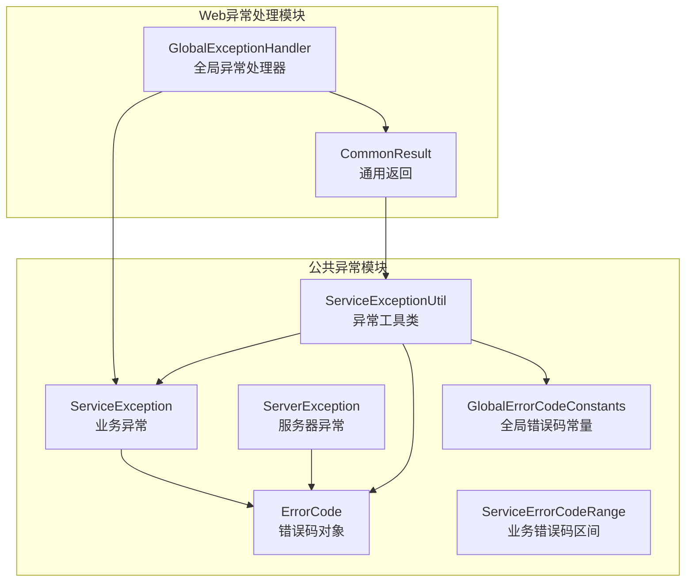
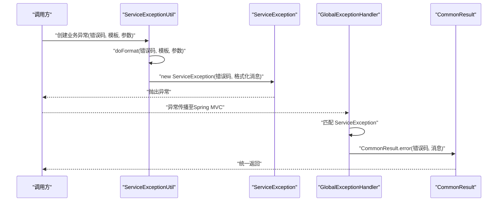
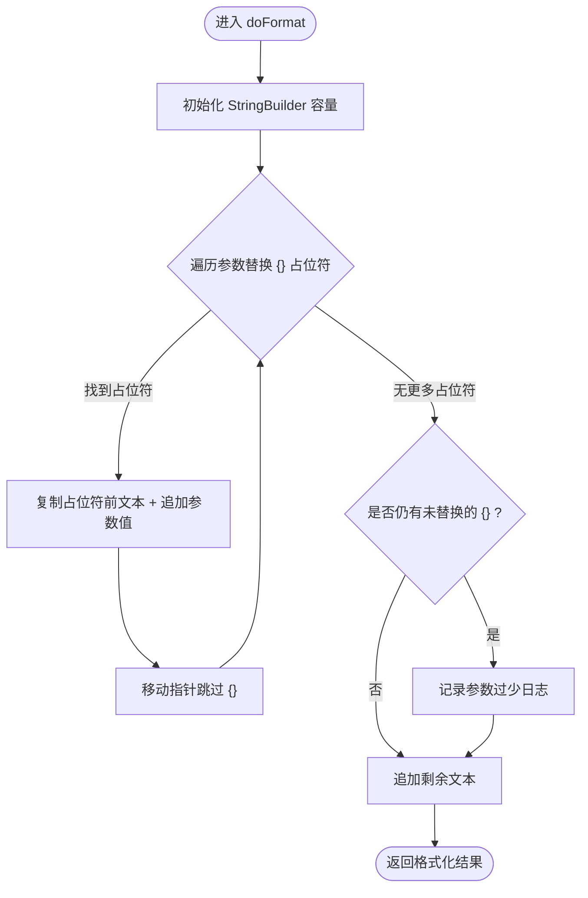
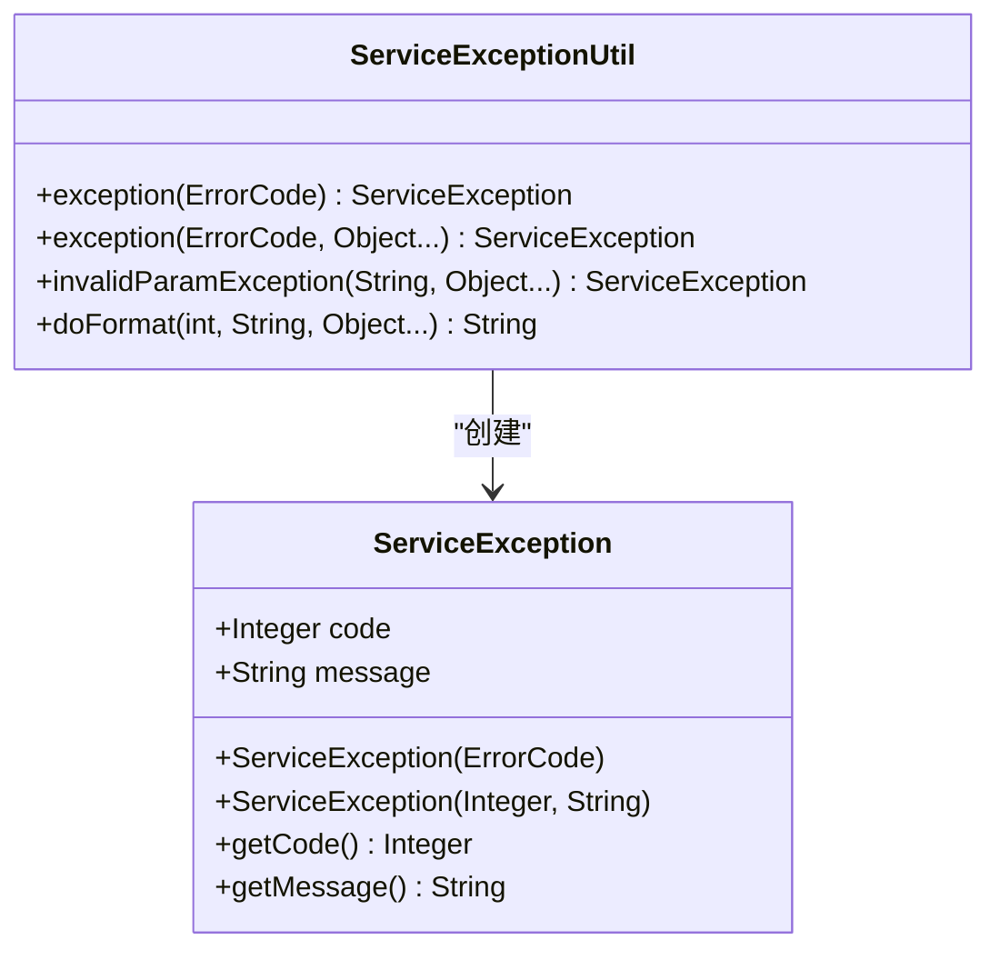
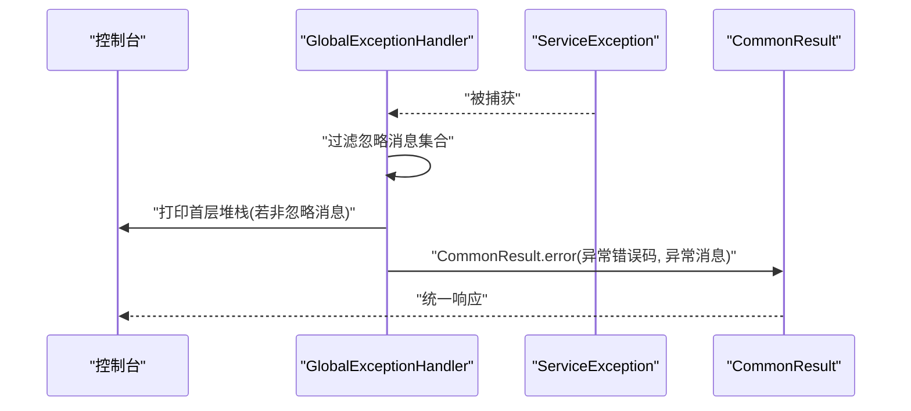
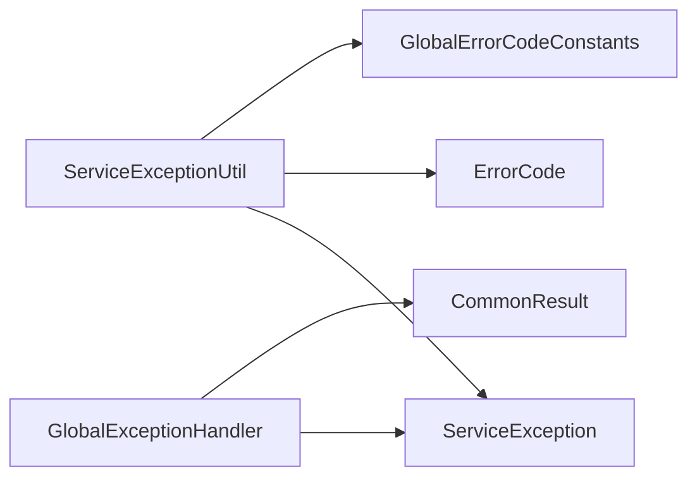

# 异常工具类

<cite>
**本文引用的文件**
- [ServiceExceptionUtil.java](file://pandora-framework/pandora-common/src/main/java/net/ittimeline/pandora/framework/common/exception/util/ServiceExceptionUtil.java)
- [ServiceException.java](file://pandora-framework/pandora-common/src/main/java/net/ittimeline/pandora/framework/common/exception/ServiceException.java)
- [ServerException.java](file://pandora-framework/pandora-common/src/main/java/net/ittimeline/pandora/framework/common/exception/ServerException.java)
- [ErrorCode.java](file://pandora-framework/pandora-common/src/main/java/net/ittimeline/pandora/framework/common/exception/ErrorCode.java)
- [GlobalErrorCodeConstants.java](file://pandora-framework/pandora-common/src/main/java/net/ittimeline/pandora/framework/common/exception/enums/GlobalErrorCodeConstants.java)
- [ServiceErrorCodeRange.java](file://pandora-framework/pandora-common/src/main/java/net/ittimeline/pandora/framework/common/exception/enums/ServiceErrorCodeRange.java)
- [GlobalExceptionHandler.java](file://pandora-framework/pandora-spring-boot-starter-web/src/main/java/net/ittimeline/pandora/framework/web/core/handler/GlobalExceptionHandler.java)
- [CommonResult.java](file://pandora-framework/pandora-common/src/main/java/net/ittimeline/pandora/framework/common/pojo/CommonResult.java)
</cite>

## 目录
1. [简介](#简介)
2. [项目结构](#项目结构)
3. [核心组件](#核心组件)
4. [架构总览](#架构总览)
5. [详细组件分析](#详细组件分析)
6. [依赖关系分析](#依赖关系分析)
7. [性能考量](#性能考量)
8. [故障排除指南](#故障排除指南)
9. [结论](#结论)
10. [附录](#附录)

## 简介
本指南围绕异常工具类 ServiceExceptionUtil 提供系统化的使用与故障排除说明，涵盖以下主题：
- 如何使用工具类快速创建标准格式的业务异常（含错误码与消息模板）
- 异常信息的格式化输出策略与占位符机制
- 异常链的维护与全局异常处理的配合方式
- 在不同场景下的最佳实践：批量异常处理、异常信息收集与统计分析思路

## 项目结构
ServiceExceptionUtil 位于公共模块的异常工具包中，与异常类型、错误码、全局异常处理器以及通用返回对象共同构成统一的异常处理体系。

**图表来源**
- [ServiceExceptionUtil.java:1-85](file://pandora-framework/pandora-common/src/main/java/net/ittimeline/pandora/framework/common/exception/util/ServiceExceptionUtil.java#L1-L85)
- [ServiceException.java:1-64](file://pandora-framework/pandora-common/src/main/java/net/ittimeline/pandora/framework/common/exception/ServiceException.java#L1-L64)
- [ServerException.java:1-65](file://pandora-framework/pandora-common/src/main/java/net/ittimeline/pandora/framework/common/exception/ServerException.java#L1-L65)
- [ErrorCode.java:1-33](file://pandora-framework/pandora-common/src/main/java/net/ittimeline/pandora/framework/common/exception/ErrorCode.java#L1-L33)
- [GlobalErrorCodeConstants.java:1-42](file://pandora-framework/pandora-common/src/main/java/net/ittimeline/pandora/framework/common/exception/enums/GlobalErrorCodeConstants.java#L1-L42)
- [ServiceErrorCodeRange.java:1-48](file://pandora-framework/pandora-common/src/main/java/net/ittimeline/pandora/framework/common/exception/enums/ServiceErrorCodeRange.java#L1-L48)
- [GlobalExceptionHandler.java:1-454](file://pandora-framework/pandora-spring-boot-starter-web/src/main/java/net/ittimeline/pandora/framework/web/core/handler/GlobalExceptionHandler.java#L1-L454)
- [CommonResult.java:1-52](file://pandora-framework/pandora-common/src/main/java/net/ittimeline/pandora/framework/common/pojo/CommonResult.java#L1-L52)

**章节来源**
- [ServiceExceptionUtil.java:1-85](file://pandora-framework/pandora-common/src/main/java/net/ittimeline/pandora/framework/common/exception/util/ServiceExceptionUtil.java#L1-L85)
- [GlobalExceptionHandler.java:1-454](file://pandora-framework/pandora-spring-boot-starter-web/src/main/java/net/ittimeline/pandora/framework/web/core/handler/GlobalExceptionHandler.java#L1-L454)

## 核心组件
- 异常工具类 ServiceExceptionUtil
  - 提供基于错误码对象与消息模板的异常创建方法
  - 提供参数化消息格式化方法，采用 {} 占位符，避免 String.format 的参数不匹配风险
  - 提供便捷的“参数不正确”异常构造方法
- 业务异常 ServiceException
  - 继承 RuntimeException，携带业务错误码与消息
  - 提供多种构造方式，便于从错误码对象或直接传入错误码与消息
- 错误码对象 ErrorCode
  - 封装错误码与消息文本，支持全局错误码与业务错误码区间
- 全局错误码常量 GlobalErrorCodeConstants
  - 定义客户端错误、服务端错误、自定义错误等常用错误码
- 业务错误码区间 ServiceErrorCodeRange
  - 规范业务异常错误码的区间划分，避免冲突
- 全局异常处理器 GlobalExceptionHandler
  - 捕获 ServiceException 并统一转换为 CommonResult 返回
  - 控制台仅打印首层堆栈，避免异常链冗余
- 通用返回 CommonResult
  - 统一对外响应结构，承载错误码与消息

**章节来源**
- [ServiceExceptionUtil.java:1-85](file://pandora-framework/pandora-common/src/main/java/net/ittimeline/pandora/framework/common/exception/util/ServiceExceptionUtil.java#L1-L85)
- [ServiceException.java:1-64](file://pandora-framework/pandora-common/src/main/java/net/ittimeline/pandora/framework/common/exception/ServiceException.java#L1-L64)
- [ErrorCode.java:1-33](file://pandora-framework/pandora-common/src/main/java/net/ittimeline/pandora/framework/common/exception/ErrorCode.java#L1-L33)
- [GlobalErrorCodeConstants.java:1-42](file://pandora-framework/pandora-common/src/main/java/net/ittimeline/pandora/framework/common/exception/enums/GlobalErrorCodeConstants.java#L1-L42)
- [ServiceErrorCodeRange.java:1-48](file://pandora-framework/pandora-common/src/main/java/net/ittimeline/pandora/framework/common/exception/enums/ServiceErrorCodeRange.java#L1-L48)
- [GlobalExceptionHandler.java:293-316](file://pandora-framework/pandora-spring-boot-starter-web/src/main/java/net/ittimeline/pandora/framework/web/core/handler/GlobalExceptionHandler.java#L293-L316)
- [CommonResult.java:1-52](file://pandora-framework/pandora-common/src/main/java/net/ittimeline/pandora/framework/common/pojo/CommonResult.java#L1-L52)

## 架构总览
ServiceExceptionUtil 与 ServiceException、ErrorCode、GlobalErrorCodeConstants 紧密协作，形成“错误码 + 模板消息 + 参数化格式化”的异常创建链路；GlobalExceptionHandler 则负责捕获 ServiceException 并统一返回。

**图表来源**
- [ServiceExceptionUtil.java:22-37](file://pandora-framework/pandora-common/src/main/java/net/ittimeline/pandora/framework/common/exception/util/ServiceExceptionUtil.java#L22-L37)
- [ServiceException.java:34-42](file://pandora-framework/pandora-common/src/main/java/net/ittimeline/pandora/framework/common/exception/ServiceException.java#L34-L42)
- [GlobalExceptionHandler.java:298-316](file://pandora-framework/pandora-spring-boot-starter-web/src/main/java/net/ittimeline/pandora/framework/web/core/handler/GlobalExceptionHandler.java#L298-L316)
- [CommonResult.java:50-52](file://pandora-framework/pandora-common/src/main/java/net/ittimeline/pandora/framework/common/pojo/CommonResult.java#L50-L52)

## 详细组件分析

### 异常工具类 ServiceExceptionUtil
- 设计目标
  - 以错误码对象与消息模板为基础，快速生成标准化业务异常
  - 采用 {} 占位符替代 String.format，避免参数数量不匹配导致的异常
- 关键方法
  - 基于错误码对象创建异常
  - 基于错误码与消息模板创建异常（支持可变参数）
  - 创建“参数不正确”类异常（复用全局错误码）
  - 内部格式化方法：预分配容量、顺序扫描占位符、参数不足/多余时的日志记录与安全返回
- 使用建议
  - 消息模板中使用 {} 作为占位符，按顺序传入参数
  - 参数过多或过少时，工具类会记录错误日志并返回已处理部分，确保不会因格式化失败而中断流程

**图表来源**
- [ServiceExceptionUtil.java:50-82](file://pandora-framework/pandora-common/src/main/java/net/ittimeline/pandora/framework/common/exception/util/ServiceExceptionUtil.java#L50-L82)

**章节来源**
- [ServiceExceptionUtil.java:1-85](file://pandora-framework/pandora-common/src/main/java/net/ittimeline/pandora/framework/common/exception/util/ServiceExceptionUtil.java#L1-L85)

### 业务异常 ServiceException
- 结构要点
  - 携带业务错误码与消息，便于前端识别与展示
  - 提供多种构造方式，兼容从错误码对象直接构建
- 与工具类的关系
  - 工具类通过格式化后的消息与错误码创建 ServiceException 实例
  - 全局异常处理器捕获 ServiceException 并统一返回

**图表来源**
- [ServiceException.java:15-42](file://pandora-framework/pandora-common/src/main/java/net/ittimeline/pandora/framework/common/exception/ServiceException.java#L15-L42)
- [ServiceExceptionUtil.java:22-37](file://pandora-framework/pandora-common/src/main/java/net/ittimeline/pandora/framework/common/exception/util/ServiceExceptionUtil.java#L22-L37)

**章节来源**
- [ServiceException.java:1-64](file://pandora-framework/pandora-common/src/main/java/net/ittimeline/pandora/framework/common/exception/ServiceException.java#L1-L64)
- [ServiceExceptionUtil.java:22-37](file://pandora-framework/pandora-common/src/main/java/net/ittimeline/pandora/framework/common/exception/util/ServiceExceptionUtil.java#L22-L37)

### 错误码与全局常量
- 错误码对象 ErrorCode
  - 封装 code 与 msg，支持全局错误码与业务错误码区间
- 全局错误码常量 GlobalErrorCodeConstants
  - 定义客户端错误（如 400、401、403）、服务端错误（如 500）与自定义错误（如 900、901）
- 业务错误码区间 ServiceErrorCodeRange
  - 为各业务模块预留错误码区间，避免冲突

**章节来源**
- [ErrorCode.java:1-33](file://pandora-framework/pandora-common/src/main/java/net/ittimeline/pandora/framework/common/exception/ErrorCode.java#L1-L33)
- [GlobalErrorCodeConstants.java:16-41](file://pandora-framework/pandora-common/src/main/java/net/ittimeline/pandora/framework/common/exception/enums/GlobalErrorCodeConstants.java#L16-L41)
- [ServiceErrorCodeRange.java:31-47](file://pandora-framework/pandora-common/src/main/java/net/ittimeline/pandora/framework/common/exception/enums/ServiceErrorCodeRange.java#L31-L47)

### 全局异常处理与统一返回
- GlobalExceptionHandler
  - 捕获 ServiceException 并转换为 CommonResult.error(code, message)
  - 控制台仅打印首层堆栈，避免异常链冗余
- CommonResult
  - 统一返回结构，承载 code、msg、data 字段

**图表来源**
- [GlobalExceptionHandler.java:298-316](file://pandora-framework/pandora-spring-boot-starter-web/src/main/java/net/ittimeline/pandora/framework/web/core/handler/GlobalExceptionHandler.java#L298-L316)
- [CommonResult.java:50-52](file://pandora-framework/pandora-common/src/main/java/net/ittimeline/pandora/framework/common/pojo/CommonResult.java#L50-L52)

**章节来源**
- [GlobalExceptionHandler.java:293-316](file://pandora-framework/pandora-spring-boot-starter-web/src/main/java/net/ittimeline/pandora/framework/web/core/handler/GlobalExceptionHandler.java#L293-L316)
- [CommonResult.java:1-52](file://pandora-framework/pandora-common/src/main/java/net/ittimeline/pandora/framework/common/pojo/CommonResult.java#L1-L52)

## 依赖关系分析
- ServiceExceptionUtil 依赖
  - 错误码对象与全局错误码常量，用于标准化错误码与消息
  - ServiceException，用于创建业务异常实例
- GlobalExceptionHandler 依赖
  - ServiceException，用于捕获并转换
  - CommonResult，用于统一返回

**图表来源**
- [ServiceExceptionUtil.java:5-7](file://pandora-framework/pandora-common/src/main/java/net/ittimeline/pandora/framework/common/exception/util/ServiceExceptionUtil.java#L5-L7)
- [ServiceException.java:1-6](file://pandora-framework/pandora-common/src/main/java/net/ittimeline/pandora/framework/common/exception/ServiceException.java#L1-L6)
- [GlobalExceptionHandler.java:18-20](file://pandora-framework/pandora-spring-boot-starter-web/src/main/java/net/ittimeline/pandora/framework/web/core/handler/GlobalExceptionHandler.java#L18-L20)

**章节来源**
- [ServiceExceptionUtil.java:1-85](file://pandora-framework/pandora-common/src/main/java/net/ittimeline/pandora/framework/common/exception/util/ServiceExceptionUtil.java#L1-L85)
- [GlobalExceptionHandler.java:1-454](file://pandora-framework/pandora-spring-boot-starter-web/src/main/java/net/ittimeline/pandora/framework/web/core/handler/GlobalExceptionHandler.java#L1-L454)

## 性能考量
- 格式化性能
  - doFormat 预分配 StringBuilder 容量，减少扩容开销
  - 顺序扫描占位符，避免正则匹配带来的额外成本
- 日志与异常链
  - 全局异常处理器仅打印首层堆栈，降低日志体积与排查成本
  - 忽略特定消息集合，避免重复或噪声信息刷屏

**章节来源**
- [ServiceExceptionUtil.java:50-82](file://pandora-framework/pandora-common/src/main/java/net/ittimeline/pandora/framework/common/exception/util/ServiceExceptionUtil.java#L50-L82)
- [GlobalExceptionHandler.java:298-316](file://pandora-framework/pandora-spring-boot-starter-web/src/main/java/net/ittimeline/pandora/framework/web/core/handler/GlobalExceptionHandler.java#L298-L316)

## 故障排除指南
- 症状：消息模板中的占位符未被替换或替换不完整
  - 可能原因：参数数量与 {} 数量不一致
  - 处理建议：检查模板与参数数量；工具类会在参数过少时记录日志，参数过多时记录日志并返回已处理部分
  - 参考路径：[doFormat:50-82](file://pandora-framework/pandora-common/src/main/java/net/ittimeline/pandora/framework/common/exception/util/ServiceExceptionUtil.java#L50-L82)
- 症状：异常未被统一返回或未触发全局异常处理
  - 可能原因：异常类型不是 ServiceException 或被其他处理器提前消费
  - 处理建议：确认异常创建使用了工具类或 ServiceException 构造；检查控制器或拦截器是否提前捕获
  - 参考路径：[GlobalExceptionHandler:113-115](file://pandora-framework/pandora-spring-boot-starter-web/src/main/java/net/ittimeline/pandora/framework/web/core/handler/GlobalExceptionHandler.java#L113-L115)
- 症状：控制台日志过多或异常链过长
  - 可能原因：未遵循“仅打印首层堆栈”的策略
  - 处理建议：利用全局异常处理器的首层堆栈打印逻辑；必要时将可忽略消息加入忽略集合
  - 参考路径：[GlobalExceptionHandler:298-316](file://pandora-framework/pandora-spring-boot-starter-web/src/main/java/net/ittimeline/pandora/framework/web/core/handler/GlobalExceptionHandler.java#L298-L316)
- 症状：业务异常返回结构不符合预期
  - 可能原因：未使用统一返回 CommonResult.error
  - 处理建议：确保异常最终由 GlobalExceptionHandler 转换为 CommonResult
  - 参考路径：[CommonResult:50-52](file://pandora-framework/pandora-common/src/main/java/net/ittimeline/pandora/framework/common/pojo/CommonResult.java#L50-L52)

**章节来源**
- [ServiceExceptionUtil.java:50-82](file://pandora-framework/pandora-common/src/main/java/net/ittimeline/pandora/framework/common/exception/util/ServiceExceptionUtil.java#L50-L82)
- [GlobalExceptionHandler.java:293-316](file://pandora-framework/pandora-spring-boot-starter-web/src/main/java/net/ittimeline/pandora/framework/web/core/handler/GlobalExceptionHandler.java#L293-L316)
- [CommonResult.java:1-52](file://pandora-framework/pandora-common/src/main/java/net/ittimeline/pandora/framework/common/pojo/CommonResult.java#L1-L52)

## 结论
ServiceExceptionUtil 通过“错误码 + 模板 + 参数化格式化”的方式，提供了稳定、易用的业务异常创建能力；结合 GlobalExceptionHandler 与 CommonResult，实现了异常的统一捕获、格式化输出与标准化返回。遵循本文的最佳实践与故障排除建议，可在不同场景下高效地进行批量异常处理、异常信息收集与统计分析。

## 附录

### 最佳使用实践
- 快速创建业务异常
  - 使用基于错误码对象的创建方法，确保错误码与消息的一致性
  - 使用参数化模板与 {} 占位符，避免硬编码消息
  - 参考路径：[exception(ErrorCode):22-28](file://pandora-framework/pandora-common/src/main/java/net/ittimeline/pandora/framework/common/exception/util/ServiceExceptionUtil.java#L22-L28)
- 参数不正确场景
  - 使用“参数不正确”便捷方法，自动绑定全局错误码
  - 参考路径：[invalidParamException:35-37](file://pandora-framework/pandora-common/src/main/java/net/ittimeline/pandora/framework/common/exception/util/ServiceExceptionUtil.java#L35-L37)
- 异常链维护
  - 优先抛出 ServiceException，避免丢失业务错误码
  - 全局异常处理器负责统一转换，保持异常链清晰
  - 参考路径：[GlobalExceptionHandler:298-316](file://pandora-framework/pandora-spring-boot-starter-web/src/main/java/net/ittimeline/pandora/framework/web/core/handler/GlobalExceptionHandler.java#L298-L316)
- 批量异常处理
  - 在循环或批处理中，使用工具类统一创建异常并记录上下文
  - 参考路径：[doFormat:50-82](file://pandora-framework/pandora-common/src/main/java/net/ittimeline/pandora/framework/common/exception/util/ServiceExceptionUtil.java#L50-L82)
- 异常信息收集与统计分析
  - 利用全局异常处理器的异常日志构建模块，采集异常名称、根因、堆栈等信息
  - 参考路径：[GlobalExceptionHandler 日志构建:343-384](file://pandora-framework/pandora-spring-boot-starter-web/src/main/java/net/ittimeline/pandora/framework/web/core/handler/GlobalExceptionHandler.java#L343-L384)