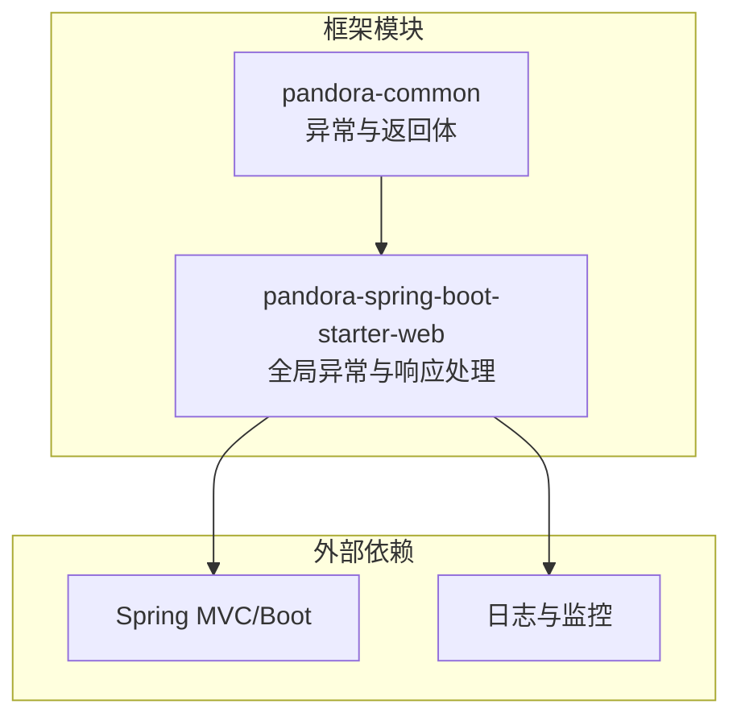
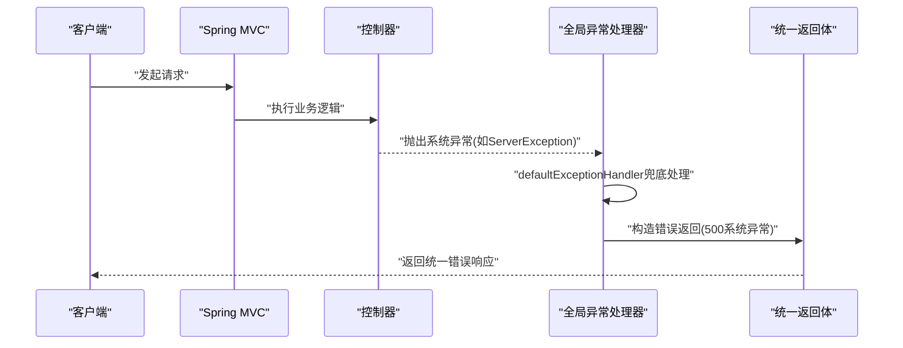
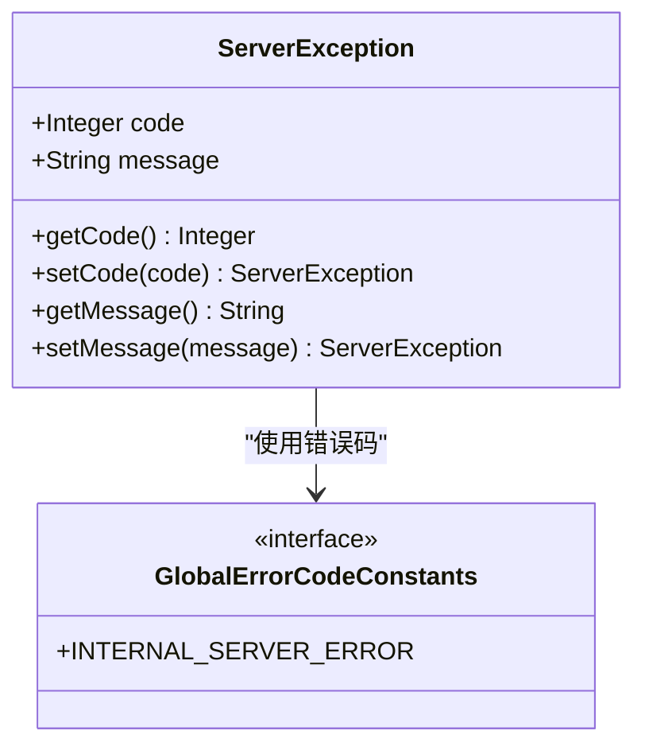
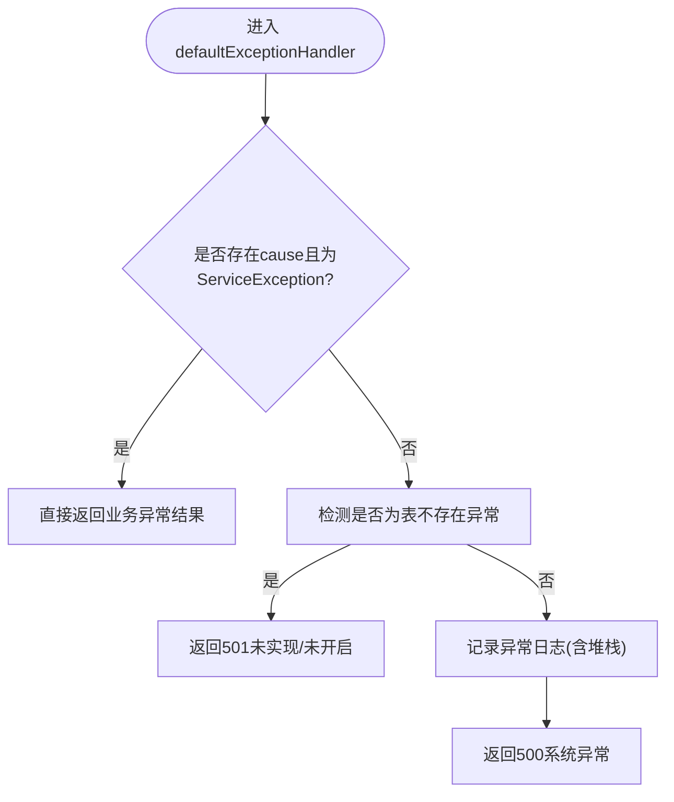
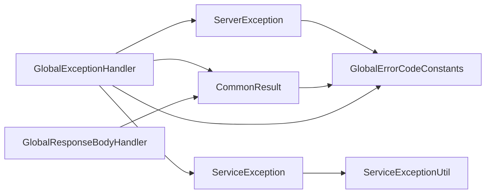

# 系统异常ServerException

<cite>
**本文引用的文件**
- [ServerException.java](file://pandora-framework/pandora-common/src/main/java/net/ittimeline/pandora/framework/common/exception/ServerException.java)
- [ServiceException.java](file://pandora-framework/pandora-common/src/main/java/net/ittimeline/pandora/framework/common/exception/ServiceException.java)
- [ErrorCode.java](file://pandora-framework/pandora-common/src/main/java/net/ittimeline/pandora/framework/common/exception/ErrorCode.java)
- [GlobalErrorCodeConstants.java](file://pandora-framework/pandora-common/src/main/java/net/ittimeline/pandora/framework/common/exception/enums/GlobalErrorCodeConstants.java)
- [ServiceErrorCodeRange.java](file://pandora-framework/pandora-common/src/main/java/net/ittimeline/pandora/framework/common/exception/enums/ServiceErrorCodeRange.java)
- [ServiceExceptionUtil.java](file://pandora-framework/pandora-common/src/main/java/net/ittimeline/pandora/framework/common/exception/util/ServiceExceptionUtil.java)
- [CommonResult.java](file://pandora-framework/pandora-common/src/main/java/net/ittimeline/pandora/framework/common/pojo/CommonResult.java)
- [GlobalExceptionHandler.java](file://pandora-framework/pandora-spring-boot-starter-web/src/main/java/net/ittimeline/pandora/framework/web/core/handler/GlobalExceptionHandler.java)
- [GlobalResponseBodyHandler.java](file://pandora-framework/pandora-spring-boot-starter-web/src/main/java/net/ittimeline/pandora/framework/web/core/handler/GlobalResponseBodyHandler.java)
- [ApiErrorLogCreateReqDTO.java](file://pandora-framework/pandora-common/src/main/java/net/ittimeline/pandora/framework/common/biz/infra/logger/dto/ApiErrorLogCreateReqDTO.java)
- [README.md](file://README.md)
</cite>

## 目录
1. [简介](#简介)
2. [项目结构](#项目结构)
3. [核心组件](#核心组件)
4. [架构总览](#架构总览)
5. [详细组件分析](#详细组件分析)
6. [依赖分析](#依赖分析)
7. [性能考虑](#性能考虑)
8. [故障排除指南](#故障排除指南)
9. [结论](#结论)
10. [附录](#附录)

## 简介
本指南围绕系统异常 ServerException 提供全面的故障排除与运维实践，覆盖异常触发条件、典型场景、诊断方法、堆栈分析技巧、系统资源监控与性能瓶颈定位、异常恢复与降级策略以及健康检查最佳实践。文档基于仓库中的异常体系与全局异常处理器实现，帮助开发者与运维人员快速定位与解决服务器内部错误、资源不可用、网络连接异常等系统级问题。

## 项目结构
本项目采用多模块结构，异常体系与全局异常处理集中在框架模块中：
- pandora-framework/pandora-common：异常定义、错误码、通用返回体、异常工具
- pandora-framework/pandora-spring-boot-starter-web：全局异常处理器、响应体处理器

图表来源
- [README.md:1-15](file://README.md#L1-L15)

章节来源
- [README.md:1-15](file://README.md#L1-L15)

## 核心组件
- ServerException：系统异常类型，承载全局错误码与错误提示，用于系统级异常兜底
- ServiceException：业务异常类型，用于业务逻辑错误的显式抛出
- ErrorCode：错误码对象，封装 code 与 msg
- GlobalErrorCodeConstants：全局错误码常量，包含 500 系统异常等
- CommonResult：统一返回体，承载 code、msg、data
- GlobalExceptionHandler：全局异常处理器，负责将各类异常翻译为统一返回
- GlobalResponseBodyHandler：统一响应体处理，记录返回结果便于审计与日志

章节来源
- [ServerException.java:1-65](file://pandora-framework/pandora-common/src/main/java/net/ittimeline/pandora/framework/common/exception/ServerException.java#L1-L65)
- [ServiceException.java:1-64](file://pandora-framework/pandora-common/src/main/java/net/ittimeline/pandora/framework/common/exception/ServiceException.java#L1-L64)
- [ErrorCode.java:1-33](file://pandora-framework/pandora-common/src/main/java/net/ittimeline/pandora/framework/common/exception/ErrorCode.java#L1-L33)
- [GlobalErrorCodeConstants.java:1-42](file://pandora-framework/pandora-common/src/main/java/net/ittimeline/pandora/framework/common/exception/enums/GlobalErrorCodeConstants.java#L1-L42)
- [CommonResult.java:1-123](file://pandora-framework/pandora-common/src/main/java/net/ittimeline/pandora/framework/common/pojo/CommonResult.java#L1-L123)
- [GlobalExceptionHandler.java:1-454](file://pandora-framework/pandora-spring-boot-starter-web/src/main/java/net/ittimeline/pandora/framework/web/core/handler/GlobalExceptionHandler.java#L1-L454)
- [GlobalResponseBodyHandler.java:1-47](file://pandora-framework/pandora-spring-boot-starter-web/src/main/java/net/ittimeline/pandora/framework/web/core/handler/GlobalResponseBodyHandler.java#L1-L47)

## 架构总览
系统异常从产生到统一返回的处理链路如下：

图表来源
- [GlobalExceptionHandler.java:321-341](file://pandora-framework/pandora-spring-boot-starter-web/src/main/java/net/ittimeline/pandora/framework/web/core/handler/GlobalExceptionHandler.java#L321-L341)
- [CommonResult.java:54-72](file://pandora-framework/pandora-common/src/main/java/net/ittimeline/pandora/framework/common/pojo/CommonResult.java#L54-L72)
- [GlobalErrorCodeConstants.java:32](file://pandora-framework/pandora-common/src/main/java/net/ittimeline/pandora/framework/common/exception/enums/GlobalErrorCodeConstants.java#L32)

## 详细组件分析

### ServerException 系统异常
- 角色：承载系统级异常的错误码与提示，通常由全局异常处理器兜底返回
- 关键属性：code、message
- 构造方式：支持使用 ErrorCode 或自定义 code/message
- 与全局错误码的关系：可结合 GlobalErrorCodeConstants 的 500 系统异常常量

图表来源
- [ServerException.java:16-64](file://pandora-framework/pandora-common/src/main/java/net/ittimeline/pandora/framework/common/exception/ServerException.java#L16-L64)
- [GlobalErrorCodeConstants.java:32](file://pandora-framework/pandora-common/src/main/java/net/ittimeline/pandora/framework/common/exception/enums/GlobalErrorCodeConstants.java#L32)

章节来源
- [ServerException.java:1-65](file://pandora-framework/pandora-common/src/main/java/net/ittimeline/pandora/framework/common/exception/ServerException.java#L1-L65)
- [GlobalErrorCodeConstants.java:30-41](file://pandora-framework/pandora-common/src/main/java/net/ittimeline/pandora/framework/common/exception/enums/GlobalErrorCodeConstants.java#L30-L41)

### ServiceException 业务异常
- 角色：用于业务逻辑显式错误，便于前端展示与用户理解
- 与 ServerException 区别：前者用于系统兜底，后者用于业务明确提示
- 与 ServiceExceptionUtil 配合：支持占位符格式化与参数校验

章节来源
- [ServiceException.java:1-64](file://pandora-framework/pandora-common/src/main/java/net/ittimeline/pandora/framework/common/exception/ServiceException.java#L1-L64)
- [ServiceExceptionUtil.java:22-37](file://pandora-framework/pandora-common/src/main/java/net/ittimeline/pandora/framework/common/exception/util/ServiceExceptionUtil.java#L22-L37)

### 全局异常处理器 GlobalExceptionHandler
- 职责：统一捕获异常，区分业务异常与系统异常，生成统一返回
- 关键点：
  - 对 ServiceException 进行业务友好处理
  - 对系统异常进行兜底处理，记录异常日志并返回 500
  - 特殊处理表不存在等场景，返回更具体的 501 未实现提示
  - 异步记录异常日志，包含堆栈、类名、方法、行号等

图表来源
- [GlobalExceptionHandler.java:321-341](file://pandora-framework/pandora-spring-boot-starter-web/src/main/java/net/ittimeline/pandora/framework/web/core/handler/GlobalExceptionHandler.java#L321-L341)
- [GlobalExceptionHandler.java:392-452](file://pandora-framework/pandora-spring-boot-starter-web/src/main/java/net/ittimeline/pandora/framework/web/core/handler/GlobalExceptionHandler.java#L392-L452)

章节来源
- [GlobalExceptionHandler.java:298-341](file://pandora-framework/pandora-spring-boot-starter-web/src/main/java/net/ittimeline/pandora/framework/web/core/handler/GlobalExceptionHandler.java#L298-L341)
- [GlobalExceptionHandler.java:343-384](file://pandora-framework/pandora-spring-boot-starter-web/src/main/java/net/ittimeline/pandora/framework/web/core/handler/GlobalExceptionHandler.java#L343-L384)

### 统一返回体 CommonResult
- 角色：统一对外返回结构，包含 code、msg、data
- 与异常体系集成：支持从 ServiceException 构建错误返回；提供 isSuccess/isError 辅助判断

章节来源
- [CommonResult.java:54-72](file://pandora-framework/pandora-common/src/main/java/net/ittimeline/pandora/framework/common/pojo/CommonResult.java#L54-L72)
- [CommonResult.java:119-122](file://pandora-framework/pandora-common/src/main/java/net/ittimeline/pandora/framework/common/pojo/CommonResult.java#L119-L122)

## 依赖分析
异常体系与全局异常处理之间的依赖关系如下：

图表来源
- [ServerException.java:5](file://pandora-framework/pandora-common/src/main/java/net/ittimeline/pandora/framework/common/exception/ServerException.java#L5)
- [ServiceExceptionUtil.java:5-7](file://pandora-framework/pandora-common/src/main/java/net/ittimeline/pandora/framework/common/exception/util/ServiceExceptionUtil.java#L5-L7)
- [CommonResult.java:6-9](file://pandora-framework/pandora-common/src/main/java/net/ittimeline/pandora/framework/common/pojo/CommonResult.java#L6-L9)
- [GlobalExceptionHandler.java:18-25](file://pandora-framework/pandora-spring-boot-starter-web/src/main/java/net/ittimeline/pandora/framework/web/core/handler/GlobalExceptionHandler.java#L18-L25)

章节来源
- [ServerException.java:1-65](file://pandora-framework/pandora-common/src/main/java/net/ittimeline/pandora/framework/common/exception/ServerException.java#L1-L65)
- [ServiceExceptionUtil.java:1-85](file://pandora-framework/pandora-common/src/main/java/net/ittimeline/pandora/framework/common/exception/util/ServiceExceptionUtil.java#L1-L85)
- [CommonResult.java:1-123](file://pandora-framework/pandora-common/src/main/java/net/ittimeline/pandora/framework/common/pojo/CommonResult.java#L1-L123)
- [GlobalExceptionHandler.java:1-454](file://pandora-framework/pandora-spring-boot-starter-web/src/main/java/net/ittimeline/pandora/framework/web/core/handler/GlobalExceptionHandler.java#L1-L454)
- [GlobalResponseBodyHandler.java:1-47](file://pandora-framework/pandora-spring-boot-starter-web/src/main/java/net/ittimeline/pandora/framework/web/core/handler/GlobalResponseBodyHandler.java#L1-L47)

## 性能考虑
- 异常日志异步化：全局异常处理器通过异步接口记录异常日志，避免阻塞主线程
- 堆栈截断与精简：对业务异常仅输出首层堆栈，降低日志体积与 IO 压力
- 占位符格式化：ServiceExceptionUtil 使用预分配容量与双指针替换策略，减少字符串拼接开销
- 统一返回体：CommonResult 统一结构，减少序列化与传输成本

章节来源
- [GlobalExceptionHandler.java:343-354](file://pandora-framework/pandora-spring-boot-starter-web/src/main/java/net/ittimeline/pandora/framework/web/core/handler/GlobalExceptionHandler.java#L343-L354)
- [GlobalExceptionHandler.java:300-314](file://pandora-framework/pandora-spring-boot-starter-web/src/main/java/net/ittimeline/pandora/framework/web/core/handler/GlobalExceptionHandler.java#L300-L314)
- [ServiceExceptionUtil.java:49-82](file://pandora-framework/pandora-common/src/main/java/net/ittimeline/pandora/framework/common/exception/util/ServiceExceptionUtil.java#L49-L82)
- [CommonResult.java:74-89](file://pandora-framework/pandora-common/src/main/java/net/ittimeline/pandora/framework/common/pojo/CommonResult.java#L74-L89)

## 故障排除指南

### 一、触发条件与典型场景
- 系统内部错误
  - 数据库连接异常、SQL 执行失败、表结构缺失
  - 缓存加载异常、线程池耗尽、内存溢出
  - 第三方服务不可用、超时或限流
- 资源不可用
  - 文件上传超过阈值、磁盘空间不足、临时文件不可写
  - 配置项错误、证书失效、鉴权失败
- 网络连接异常
  - DNS 解析失败、TCP 连接超时、TLS 握手失败
  - 网关/代理异常、防火墙阻断、带宽饱和

章节来源
- [GlobalExceptionHandler.java:392-452](file://pandora-framework/pandora-spring-boot-starter-web/src/main/java/net/ittimeline/pandora/framework/web/core/handler/GlobalExceptionHandler.java#L392-L452)
- [GlobalErrorCodeConstants.java:30-35](file://pandora-framework/pandora-common/src/main/java/net/ittimeline/pandora/framework/common/exception/enums/GlobalErrorCodeConstants.java#L30-L35)

### 二、诊断方法
- 查看统一返回体
  - 关注返回码是否为 500 系统异常；若为 501，则检查模块是否启用或表结构是否导入
- 分析异常日志
  - 全局异常处理器会记录异常名称、根因消息、完整堆栈、类名、方法、行号、请求 URL、参数、IP、UA、TraceId 等
  - 重点关注首次出现的异常类与堆栈，定位真实根因
- 校验错误码映射
  - 确认是否命中“表不存在”等特定场景分支，从而缩小排查范围

章节来源
- [GlobalExceptionHandler.java:343-384](file://pandora-framework/pandora-spring-boot-starter-web/src/main/java/net/ittimeline/pandora/framework/web/core/handler/GlobalExceptionHandler.java#L343-L384)
- [ApiErrorLogCreateReqDTO.java:46-73](file://pandora-framework/pandora-common/src/main/java/net/ittimeline/pandora/framework/common/biz/infra/logger/dto/ApiErrorLogCreateReqDTO.java#L46-L73)

### 三、异常堆栈分析技巧
- 优先关注非工具类的首层堆栈，避免被工具类包装干扰
- 通过异常根因消息快速定位模块与子系统
- 结合 TraceId 串联请求链路，配合网关/服务间追踪系统定位上下游

章节来源
- [GlobalExceptionHandler.java:300-314](file://pandora-framework/pandora-spring-boot-starter-web/src/main/java/net/ittimeline/pandora/framework/web/core/handler/GlobalExceptionHandler.java#L300-L314)

### 四、系统资源监控指标解读
- CPU/内存/GC
  - 高 GC 次数与长时间停顿：排查内存泄漏、大对象分配、并发峰值
  - 内存持续上涨：检查缓存/线程池/连接池配置与回收策略
- 磁盘与文件句柄
  - 磁盘空间不足：清理日志与临时文件，扩大分区
  - 文件句柄耗尽：检查文件上传、数据库连接、第三方 SDK 的资源释放
- 网络与连接
  - 连接池耗尽：增加最大连接数、优化超时与重试策略
  - 超时与重试：区分瞬时抖动与长期不稳定，必要时降级或熔断

### 五、性能瓶颈定位方法
- 接口维度
  - 通过统一返回体中的 TraceId 与请求参数，定位慢查询与热点接口
- 子系统维度
  - 数据库：慢 SQL、锁等待、索引缺失
  - 缓存：穿透、击穿、雪崩；检查缓存预热与淘汰策略
  - 网关/服务：限流、熔断、降级策略生效情况
- 资源维度
  - 线程池：队列长度、拒绝策略、任务耗时分布
  - I/O：磁盘吞吐、网络带宽、文件句柄上限

### 六、异常恢复策略
- 立即措施
  - 重启应用：针对内存泄漏、线程死锁等偶发问题
  - 清理缓存：针对缓存污染导致的异常
- 短期修复
  - 修复配置项、补全表结构、恢复第三方服务
  - 优化慢查询、补充索引、调整连接池参数
- 长期治理
  - 引入熔断与隔离：对不稳定依赖进行熔断与舱壁隔离
  - 增强重试与幂等：区分可重试与幂等性设计
  - 完善监控与告警：建立异常率、P95/P99 延迟、资源使用率阈值告警

### 七、降级处理方案
- 功能降级
  - 关闭非核心功能，保证核心链路可用
- 数据降级
  - 使用静态兜底数据或缓存数据，避免空值风暴
- 限流与熔断
  - 对下游依赖实施限流与熔断，防止级联故障
- 异步化与补偿
  - 将非关键路径异步化，失败时进行补偿或重试

### 八、系统健康检查最佳实践
- 接口健康
  - 定期探测关键接口，监控成功率与延迟
- 资源健康
  - 监控 CPU、内存、GC、磁盘、文件句柄、连接数
- 依赖健康
  - 对数据库、缓存、消息队列、第三方服务进行探活
- 日志与追踪
  - 异常日志落盘与索引，支持按 TraceId 快速检索
  - 与分布式追踪系统打通，形成端到端链路视图

## 结论
ServerException 作为系统级异常的兜底载体，配合全局异常处理器与统一返回体，实现了系统异常的标准化处理与可观测性。通过异常日志、错误码映射与资源监控，可快速定位系统内部错误、资源不可用与网络异常等场景。建议在生产环境中完善熔断、限流、降级与补偿机制，并持续优化慢查询与资源使用，确保系统的稳定性与可维护性。

## 附录
- 常用错误码参考
  - 500：系统异常
  - 501：功能未实现/未开启
  - 502：错误的配置项
- 关键实现路径
  - 系统异常类：[ServerException.java:1-65](file://pandora-framework/pandora-common/src/main/java/net/ittimeline/pandora/framework/common/exception/ServerException.java#L1-L65)
  - 全局异常处理器：[GlobalExceptionHandler.java:1-454](file://pandora-framework/pandora-spring-boot-starter-web/src/main/java/net/ittimeline/pandora/framework/web/core/handler/GlobalExceptionHandler.java#L1-L454)
  - 统一返回体：[CommonResult.java:1-123](file://pandora-framework/pandora-common/src/main/java/net/ittimeline/pandora/framework/common/pojo/CommonResult.java#L1-L123)
  - 异常日志结构：[ApiErrorLogCreateReqDTO.java:46-73](file://pandora-framework/pandora-common/src/main/java/net/ittimeline/pandora/framework/common/biz/infra/logger/dto/ApiErrorLogCreateReqDTO.java#L46-L73)