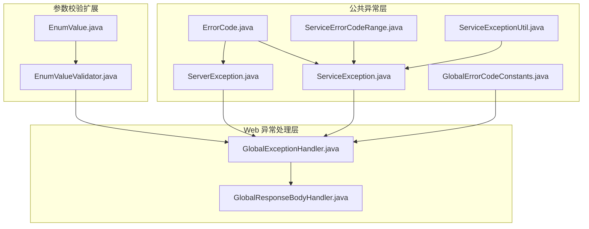
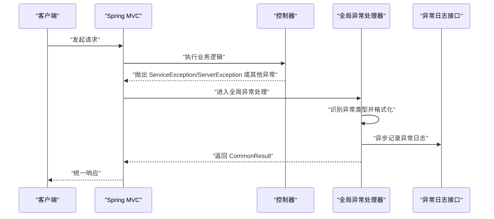
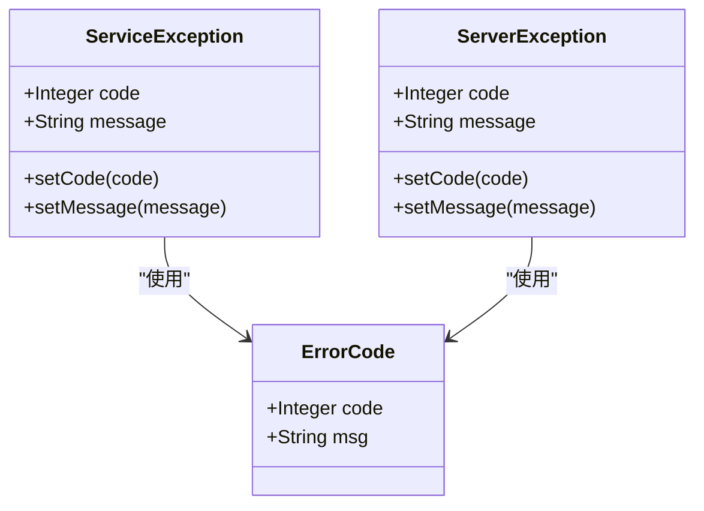
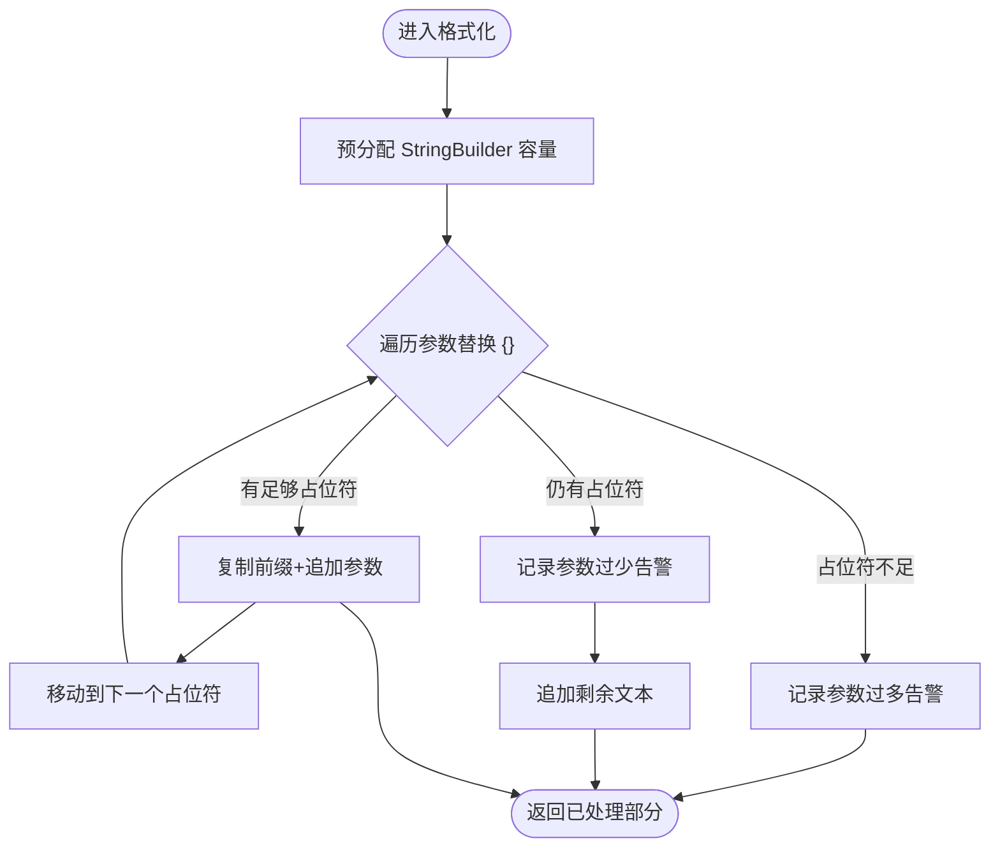
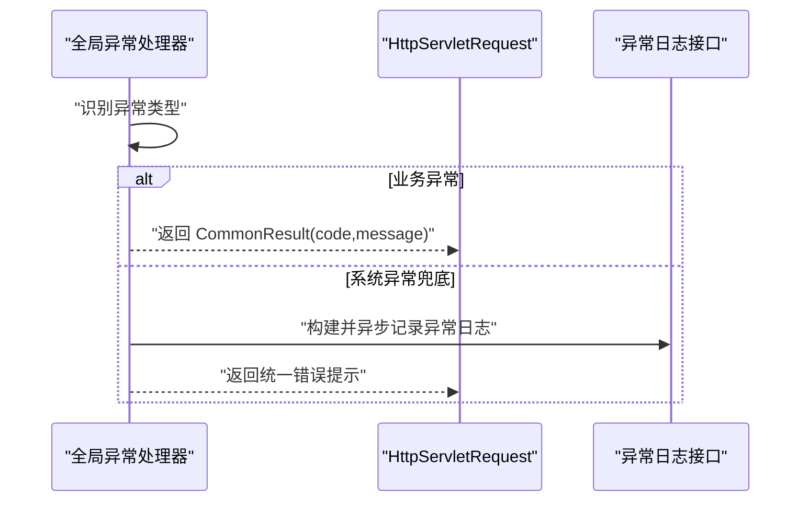
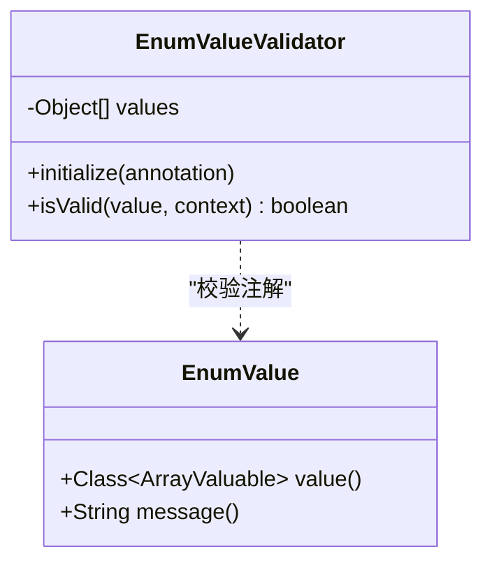
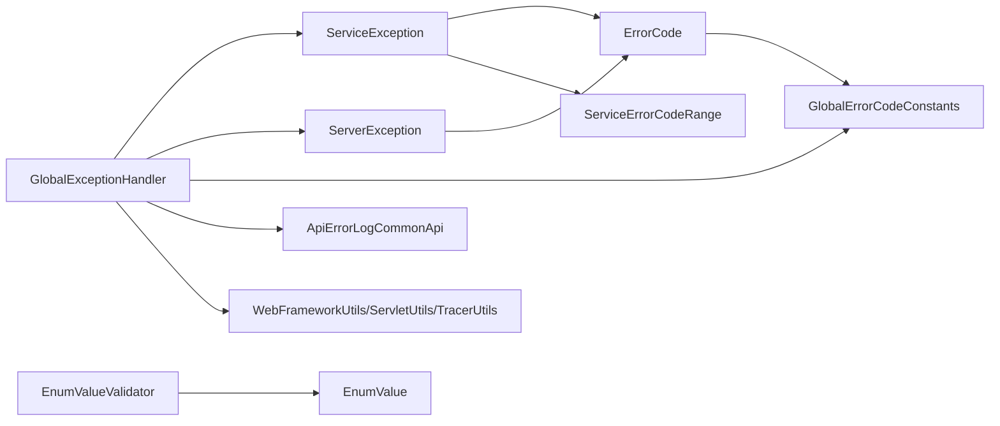

# 运行时异常

<cite>
**本文引用的文件**
- [ServiceException.java](file://pandora-framework/pandora-common/src/main/java/net/ittimeline/pandora/framework/common/exception/ServiceException.java)
- [ServerException.java](file://pandora-framework/pandora-common/src/main/java/net/ittimeline/pandora/framework/common/exception/ServerException.java)
- [ErrorCode.java](file://pandora-framework/pandora-common/src/main/java/net/ittimeline/pandora/framework/common/exception/ErrorCode.java)
- [GlobalErrorCodeConstants.java](file://pandora-framework/pandora-common/src/main/java/net/ittimeline/pandora/framework/common/exception/enums/GlobalErrorCodeConstants.java)
- [ServiceErrorCodeRange.java](file://pandora-framework/pandora-common/src/main/java/net/ittimeline/pandora/framework/common/exception/enums/ServiceErrorCodeRange.java)
- [ServiceExceptionUtil.java](file://pandora-framework/pandora-common/src/main/java/net/ittimeline/pandora/framework/common/exception/util/ServiceExceptionUtil.java)
- [GlobalExceptionHandler.java](file://pandora-framework/pandora-spring-boot-starter-web/src/main/java/net/ittimeline/pandora/framework/web/core/handler/GlobalExceptionHandler.java)
- [GlobalResponseBodyHandler.java](file://pandora-framework/pandora-spring-boot-starter-web/src/main/java/net/ittimeline/pandora/framework/web/core/handler/GlobalResponseBodyHandler.java)
- [EnumValue.java](file://pandora-framework/pandora-common/src/main/java/net/ittimeline/pandora/framework/common/validation/EnumValue.java)
- [EnumValueValidator.java](file://pandora-framework/pandora-common/src/main/java/net/ittimeline/pandora/framework/common/validation/EnumValueValidator.java)
</cite>

## 目录
1. [简介](#简介)
2. [项目结构](#项目结构)
3. [核心组件](#核心组件)
4. [架构总览](#架构总览)
5. [详细组件分析](#详细组件分析)
6. [依赖分析](#依赖分析)
7. [性能考虑](#性能考虑)
8. [故障排除指南](#故障排除指南)
9. [结论](#结论)
10. [附录](#附录)

## 简介
本指南面向 Pandora Cloud 框架的运行时异常，聚焦于业务异常 ServiceException 与系统异常 ServerException 的诊断与排障。文档覆盖异常类型特征、触发条件、错误码含义、堆栈分析技巧、参数校验与权限验证异常的排查步骤、异常日志采集与最佳实践，以及常见异常场景的处理方案。

## 项目结构
围绕异常体系的关键模块与文件：
- 异常定义与工具：ServiceException、ServerException、ErrorCode、错误码枚举、异常格式化工具
- Web 层异常处理：全局异常处理器、全局响应体处理器
- 参数校验扩展：自定义枚举值校验注解与校验器

图表来源
- [ServiceException.java:1-64](file://pandora-framework/pandora-common/src/main/java/net/ittimeline/pandora/framework/common/exception/ServiceException.java#L1-L64)
- [ServerException.java:1-65](file://pandora-framework/pandora-common/src/main/java/net/ittimeline/pandora/framework/common/exception/ServerException.java#L1-L65)
- [ErrorCode.java:1-33](file://pandora-framework/pandora-common/src/main/java/net/ittimeline/pandora/framework/common/exception/ErrorCode.java#L1-L33)
- [GlobalErrorCodeConstants.java:1-42](file://pandora-framework/pandora-common/src/main/java/net/ittimeline/pandora/framework/common/exception/enums/GlobalErrorCodeConstants.java#L1-L42)
- [ServiceErrorCodeRange.java:1-48](file://pandora-framework/pandora-common/src/main/java/net/ittimeline/pandora/framework/common/exception/enums/ServiceErrorCodeRange.java#L1-L48)
- [ServiceExceptionUtil.java:1-85](file://pandora-framework/pandora-common/src/main/java/net/ittimeline/pandora/framework/common/exception/util/ServiceExceptionUtil.java#L1-L85)
- [GlobalExceptionHandler.java:1-454](file://pandora-framework/pandora-spring-boot-starter-web/src/main/java/net/ittimeline/pandora/framework/web/core/handler/GlobalExceptionHandler.java#L1-L454)
- [GlobalResponseBodyHandler.java:1-47](file://pandora-framework/pandora-spring-boot-starter-web/src/main/java/net/ittimeline/pandora/framework/web/core/handler/GlobalResponseBodyHandler.java#L1-L47)
- [EnumValue.java:1-40](file://pandora-framework/pandora-common/src/main/java/net/ittimeline/pandora/framework/common/validation/EnumValue.java#L1-L40)
- [EnumValueValidator.java:1-49](file://pandora-framework/pandora-common/src/main/java/net/ittimeline/pandora/framework/common/validation/EnumValueValidator.java#L1-L49)

章节来源
- [GlobalExceptionHandler.java:1-454](file://pandora-framework/pandora-spring-boot-starter-web/src/main/java/net/ittimeline/pandora/framework/web/core/handler/GlobalExceptionHandler.java#L1-L454)
- [ServiceException.java:1-64](file://pandora-framework/pandora-common/src/main/java/net/ittimeline/pandora/framework/common/exception/ServiceException.java#L1-L64)
- [ServerException.java:1-65](file://pandora-framework/pandora-common/src/main/java/net/ittimeline/pandora/framework/common/exception/ServerException.java#L1-L65)

## 核心组件
- 业务异常 ServiceException
  - 用途：封装业务错误码与提示，便于前端统一处理
  - 关键属性：code、message；支持从 ErrorCode 构造
- 系统异常 ServerException
  - 用途：封装系统级错误码与提示，通常映射到 5xx 或全局错误码
  - 关键属性：code、message；支持从 ErrorCode 构造
- 错误码对象 ErrorCode
  - 用途：承载 code 与 msg，作为异常构造的基础
- 全局错误码 GlobalErrorCodeConstants
  - 用途：定义客户端错误（4xx）、服务端错误（5xx）、自定义错误等
- 业务错误码区间 ServiceErrorCodeRange
  - 用途：规范业务异常码段位，避免冲突
- 异常格式化工具 ServiceExceptionUtil
  - 用途：提供占位符格式化、参数过多/过少的告警日志
- 全局异常处理器 GlobalExceptionHandler
  - 用途：统一捕获各类异常，转换为 CommonResult，记录异常日志
- 全局响应体处理器 GlobalResponseBodyHandler
  - 用途：记录返回结果，供访问日志使用

章节来源
- [ServiceException.java:1-64](file://pandora-framework/pandora-common/src/main/java/net/ittimeline/pandora/framework/common/exception/ServiceException.java#L1-L64)
- [ServerException.java:1-65](file://pandora-framework/pandora-common/src/main/java/net/ittimeline/pandora/framework/common/exception/ServerException.java#L1-L65)
- [ErrorCode.java:1-33](file://pandora-framework/pandora-common/src/main/java/net/ittimeline/pandora/framework/common/exception/ErrorCode.java#L1-L33)
- [GlobalErrorCodeConstants.java:1-42](file://pandora-framework/pandora-common/src/main/java/net/ittimeline/pandora/framework/common/exception/enums/GlobalErrorCodeConstants.java#L1-L42)
- [ServiceErrorCodeRange.java:1-48](file://pandora-framework/pandora-common/src/main/java/net/ittimeline/pandora/framework/common/exception/enums/ServiceErrorCodeRange.java#L1-L48)
- [ServiceExceptionUtil.java:1-85](file://pandora-framework/pandora-common/src/main/java/net/ittimeline/pandora/framework/common/exception/util/ServiceExceptionUtil.java#L1-L85)
- [GlobalExceptionHandler.java:1-454](file://pandora-framework/pandora-spring-boot-starter-web/src/main/java/net/ittimeline/pandora/framework/web/core/handler/GlobalExceptionHandler.java#L1-L454)
- [GlobalResponseBodyHandler.java:1-47](file://pandora-framework/pandora-spring-boot-starter-web/src/main/java/net/ittimeline/pandora/framework/web/core/handler/GlobalResponseBodyHandler.java#L1-L47)

## 架构总览
异常处理在 Web 层统一收敛，按异常类型分类处理并落库记录，最终以 CommonResult 返回。

图表来源
- [GlobalExceptionHandler.java:113-119](file://pandora-framework/pandora-spring-boot-starter-web/src/main/java/net/ittimeline/pandora/framework/web/core/handler/GlobalExceptionHandler.java#L113-L119)
- [GlobalExceptionHandler.java:298-341](file://pandora-framework/pandora-spring-boot-starter-web/src/main/java/net/ittimeline/pandora/framework/web/core/handler/GlobalExceptionHandler.java#L298-L341)

## 详细组件分析

### 异常类与错误码
- ServiceException：业务异常，携带业务错误码与提示
- ServerException：系统异常，携带全局错误码与提示
- ErrorCode：错误码载体，支持从枚举构造
- GlobalErrorCodeConstants：全局错误码常量集合
- ServiceErrorCodeRange：业务错误码区间规范（模块化分段）

图表来源
- [ServiceException.java:1-64](file://pandora-framework/pandora-common/src/main/java/net/ittimeline/pandora/framework/common/exception/ServiceException.java#L1-L64)
- [ServerException.java:1-65](file://pandora-framework/pandora-common/src/main/java/net/ittimeline/pandora/framework/common/exception/ServerException.java#L1-L65)
- [ErrorCode.java:1-33](file://pandora-framework/pandora-common/src/main/java/net/ittimeline/pandora/framework/common/exception/ErrorCode.java#L1-L33)

章节来源
- [ServiceException.java:1-64](file://pandora-framework/pandora-common/src/main/java/net/ittimeline/pandora/framework/common/exception/ServiceException.java#L1-L64)
- [ServerException.java:1-65](file://pandora-framework/pandora-common/src/main/java/net/ittimeline/pandora/framework/common/exception/ServerException.java#L1-L65)
- [ErrorCode.java:1-33](file://pandora-framework/pandora-common/src/main/java/net/ittimeline/pandora/framework/common/exception/ErrorCode.java#L1-L33)
- [GlobalErrorCodeConstants.java:1-42](file://pandora-framework/pandora-common/src/main/java/net/ittimeline/pandora/framework/common/exception/enums/GlobalErrorCodeConstants.java#L1-L42)
- [ServiceErrorCodeRange.java:1-48](file://pandora-framework/pandora-common/src/main/java/net/ittimeline/pandora/framework/common/exception/enums/ServiceErrorCodeRange.java#L1-L48)

### 异常格式化工具
- 占位符格式化：使用 {} 作为占位符，避免 String.format 的参数不匹配风险
- 参数校验：参数过多/过少时记录告警日志，保证异常提示可读性

图表来源
- [ServiceExceptionUtil.java:50-82](file://pandora-framework/pandora-common/src/main/java/net/ittimeline/pandora/framework/common/exception/util/ServiceExceptionUtil.java#L50-L82)

章节来源
- [ServiceExceptionUtil.java:1-85](file://pandora-framework/pandora-common/src/main/java/net/ittimeline/pandora/framework/common/exception/util/ServiceExceptionUtil.java#L1-L85)

### 全局异常处理器
- 分类处理：参数缺失、类型不匹配、参数校验失败、上传超限、资源不存在、方法不支持、媒体类型不支持、权限不足、Guava 执行异常、业务异常、系统异常兜底
- 日志记录：构建异常日志 DTO，异步写入，包含堆栈首行、请求上下文、TraceId 等
- 特殊分支：表不存在异常的模块化提示（报表、工作流、微信公众号、商城、ERP、CRM、支付、AI、IoT）

图表来源
- [GlobalExceptionHandler.java:113-119](file://pandora-framework/pandora-spring-boot-starter-web/src/main/java/net/ittimeline/pandora/framework/web/core/handler/GlobalExceptionHandler.java#L113-L119)
- [GlobalExceptionHandler.java:298-341](file://pandora-framework/pandora-spring-boot-starter-web/src/main/java/net/ittimeline/pandora/framework/web/core/handler/GlobalExceptionHandler.java#L298-L341)
- [GlobalExceptionHandler.java:343-384](file://pandora-framework/pandora-spring-boot-starter-web/src/main/java/net/ittimeline/pandora/framework/web/core/handler/GlobalExceptionHandler.java#L343-L384)

章节来源
- [GlobalExceptionHandler.java:1-454](file://pandora-framework/pandora-spring-boot-starter-web/src/main/java/net/ittimeline/pandora/framework/web/core/handler/GlobalExceptionHandler.java#L1-L454)

### 参数校验扩展
- 自定义注解 EnumValue：限定字段值必须在指定枚举范围内
- 校验器 EnumValueValidator：空值跳过校验，否则检查是否包含于枚举数组，不通过时自定义提示模板

图表来源
- [EnumValue.java:1-40](file://pandora-framework/pandora-common/src/main/java/net/ittimeline/pandora/framework/common/validation/EnumValue.java#L1-L40)
- [EnumValueValidator.java:1-49](file://pandora-framework/pandora-common/src/main/java/net/ittimeline/pandora/framework/common/validation/EnumValueValidator.java#L1-L49)

章节来源
- [EnumValue.java:1-40](file://pandora-framework/pandora-common/src/main/java/net/ittimeline/pandora/framework/common/validation/EnumValue.java#L1-L40)
- [EnumValueValidator.java:1-49](file://pandora-framework/pandora-common/src/main/java/net/ittimeline/pandora/framework/common/validation/EnumValueValidator.java#L1-L49)

## 依赖分析
- 异常类依赖错误码对象与错误码枚举，确保 code/msg 一致性
- 全局异常处理器依赖 Web 工具、日志接口、监控 TraceId、Servlet 工具
- 参数校验扩展依赖注解与校验器，配合 Spring MVC 的 Bean 验证

图表来源
- [ServiceException.java:1-64](file://pandora-framework/pandora-common/src/main/java/net/ittimeline/pandora/framework/common/exception/ServiceException.java#L1-L64)
- [ServerException.java:1-65](file://pandora-framework/pandora-common/src/main/java/net/ittimeline/pandora/framework/common/exception/ServerException.java#L1-L65)
- [ErrorCode.java:1-33](file://pandora-framework/pandora-common/src/main/java/net/ittimeline/pandora/framework/common/exception/ErrorCode.java#L1-L33)
- [GlobalErrorCodeConstants.java:1-42](file://pandora-framework/pandora-common/src/main/java/net/ittimeline/pandora/framework/common/exception/enums/GlobalErrorCodeConstants.java#L1-L42)
- [ServiceErrorCodeRange.java:1-48](file://pandora-framework/pandora-common/src/main/java/net/ittimeline/pandora/framework/common/exception/enums/ServiceErrorCodeRange.java#L1-L48)
- [GlobalExceptionHandler.java:1-454](file://pandora-framework/pandora-spring-boot-starter-web/src/main/java/net/ittimeline/pandora/framework/web/core/handler/GlobalExceptionHandler.java#L1-L454)
- [EnumValueValidator.java:1-49](file://pandora-framework/pandora-common/src/main/java/net/ittimeline/pandora/framework/common/validation/EnumValueValidator.java#L1-L49)
- [EnumValue.java:1-40](file://pandora-framework/pandora-common/src/main/java/net/ittimeline/pandora/framework/common/validation/EnumValue.java#L1-L40)

## 性能考虑
- 异常日志异步化：通过异步接口写入，避免阻塞主线程
- 格式化优化：预分配 StringBuilder，减少扩容与字符串拼接开销
- 堆栈首行告警：仅打印首次非工具类堆栈，降低日志体积与 IO 压力
- 参数校验短路：空值快速通过，避免不必要的容器操作

## 故障排除指南

### 一、异常类型与特征
- ServiceException（业务异常）
  - 触发条件：业务规则校验失败、数据状态不满足、业务流程约束
  - 响应特征：返回 code 与 message，前端据此展示友好提示
  - 诊断要点：关注 code 的业务含义与 message 的可读性
- ServerException（系统异常）
  - 触发条件：框架内部错误、数据库连接异常、第三方服务不可用
  - 响应特征：返回全局错误码与统一提示，便于前端统一处理
  - 诊断要点：结合异常日志与 TraceId 追踪根因

章节来源
- [ServiceException.java:1-64](file://pandora-framework/pandora-common/src/main/java/net/ittimeline/pandora/framework/common/exception/ServiceException.java#L1-L64)
- [ServerException.java:1-65](file://pandora-framework/pandora-common/src/main/java/net/ittimeline/pandora/framework/common/exception/ServerException.java#L1-L65)

### 二、错误码含义与区间
- 全局错误码（0-999）
  - 成功、客户端错误（400/401/403/404/405/423/429）、服务端错误（500/501/502）、自定义错误（900/901）、未知错误（999）
- 业务错误码（≥10^9）
  - 采用 10 位编码，分段表示：类型（1 位）+ 系统类型（3 位）+ 模块（3 位）+ 错误码（3 位）
  - 各模块预留区间，避免冲突

章节来源
- [GlobalErrorCodeConstants.java:1-42](file://pandora-framework/pandora-common/src/main/java/net/ittimeline/pandora/framework/common/exception/enums/GlobalErrorCodeConstants.java#L1-L42)
- [ServiceErrorCodeRange.java:1-48](file://pandora-framework/pandora-common/src/main/java/net/ittimeline/pandora/framework/common/exception/enums/ServiceErrorCodeRange.java#L1-L48)

### 三、参数校验异常排查
- 缺失参数：MissingServletRequestParameterException
  - 现象：接口要求的 @RequestParam 未传
  - 处理：返回“请求参数缺失”提示
- 类型不匹配：MethodArgumentTypeMismatchException
  - 现象：参数类型与期望不一致
  - 处理：返回“请求参数类型错误”
- 参数校验失败：MethodArgumentNotValidException/BindException
  - 现象：JSR-303 校验失败或组合校验失败
  - 处理：提取首个错误消息，返回“请求参数不正确”
- Bean 校验：ConstraintViolationException
  - 现象：使用 Validator 校验实体失败
  - 处理：返回“请求参数不正确”
- JSON 解析：HttpMessageNotReadableException（含 InvalidFormatException）
  - 现象：JSON 字段类型不匹配或缺少 body
  - 处理：返回“请求参数类型错误”，必要时提示 body 缺失
- 自定义枚举校验：EnumValue
  - 现象：字段值不在指定枚举范围内
  - 处理：校验器自定义提示模板，包含允许值列表

章节来源
- [GlobalExceptionHandler.java:127-197](file://pandora-framework/pandora-spring-boot-starter-web/src/main/java/net/ittimeline/pandora/framework/web/core/handler/GlobalExceptionHandler.java#L127-L197)
- [EnumValue.java:1-40](file://pandora-framework/pandora-common/src/main/java/net/ittimeline/pandora/framework/common/validation/EnumValue.java#L1-L40)
- [EnumValueValidator.java:1-49](file://pandora-framework/pandora-common/src/main/java/net/ittimeline/pandora/framework/common/validation/EnumValueValidator.java#L1-L49)

### 四、权限验证异常排查
- 权限不足：AccessDeniedException
  - 现象：使用 @PreAuthorize 等注解进行权限拦截后拒绝访问
  - 处理：返回“没有该操作权限”，记录当前登录用户与请求 URL

章节来源
- [GlobalExceptionHandler.java:276-281](file://pandora-framework/pandora-spring-boot-starter-web/src/main/java/net/ittimeline/pandora/framework/web/core/handler/GlobalExceptionHandler.java#L276-L281)

### 五、数据访问异常排查
- 表不存在：数据库异常根因包含 “doesn't exist”
  - 现象：不同模块的表未导入或禁用
  - 处理：根据前缀匹配返回模块化提示（报表/工作流/微信公众号/商城/ERP/CRM/支付/AI/IoT）
- 兜底系统异常：Exception
  - 现象：未被上述分支覆盖的异常
  - 处理：记录异常日志，返回“系统异常”

章节来源
- [GlobalExceptionHandler.java:392-452](file://pandora-framework/pandora-spring-boot-starter-web/src/main/java/net/ittimeline/pandora/framework/web/core/handler/GlobalExceptionHandler.java#L392-L452)
- [GlobalExceptionHandler.java:321-341](file://pandora-framework/pandora-spring-boot-starter-web/src/main/java/net/ittimeline/pandora/framework/web/core/handler/GlobalExceptionHandler.java#L321-L341)

### 六、异常堆栈分析技巧
- 业务异常堆栈：优先查看首次非工具类堆栈，避免被格式化工具类堆栈干扰
- 系统异常堆栈：结合异常日志中的首行堆栈、根因消息、TraceId 追溯
- 参数校验异常：关注校验失败字段与默认消息，必要时启用更详细的校验日志

章节来源
- [GlobalExceptionHandler.java:303-314](file://pandora-framework/pandora-spring-boot-starter-web/src/main/java/net/ittimeline/pandora/framework/web/core/handler/GlobalExceptionHandler.java#L303-L314)

### 七、异常日志分析与最佳实践
- 日志字段：异常名称、消息、根因、堆栈、类名/文件/方法/行号、TraceId、应用名、请求 URL/方法/IP/User-Agent、请求参数快照
- 最佳实践：
  - 使用 TraceId 关联链路日志
  - 业务异常尽量提供明确的 code 与 message
  - 参数校验失败时，确保 message 可读且指向具体字段
  - 对高频异常进行聚合统计与告警

章节来源
- [GlobalExceptionHandler.java:356-384](file://pandora-framework/pandora-spring-boot-starter-web/src/main/java/net/ittimeline/pandora/framework/web/core/handler/GlobalExceptionHandler.java#L356-L384)

### 八、调试断点设置与问题定位
- 控制器入口：在业务方法入口设置断点，观察输入参数与业务状态
- 异常抛出点：在 ServiceException/ServerException 抛出处设置断点，确认 code/message 来源
- 全局异常处理：在 serviceExceptionHandler/defaultExceptionHandler 设置断点，验证异常转换与日志记录
- 参数校验：在校验注解生效处（如 @Validated）设置断点，观察校验失败路径

章节来源
- [GlobalExceptionHandler.java:298-341](file://pandora-framework/pandora-spring-boot-starter-web/src/main/java/net/ittimeline/pandora/framework/web/core/handler/GlobalExceptionHandler.java#L298-L341)
- [ServiceExceptionUtil.java:30-33](file://pandora-framework/pandora-common/src/main/java/net/ittimeline/pandora/framework/common/exception/util/ServiceExceptionUtil.java#L30-L33)

## 结论
Pandora Cloud 的异常体系通过 ServiceException/ServerException 与 ErrorCode 枚举实现统一的错误表达，结合全局异常处理器与日志记录，形成从捕获、转换到追踪的闭环。参数校验扩展进一步增强了对输入质量的保障。遵循本文提供的诊断流程与最佳实践，可高效定位与解决运行时异常问题。

## 附录
- 常见异常场景速查
  - 参数缺失/类型错误：检查请求参数与类型
  - JSR-303 校验失败：查看字段错误与组合校验错误
  - 枚举值非法：核对 EnumValue 注解的允许值范围
  - 权限不足：确认登录态与权限注解配置
  - 表不存在：根据模块提示导入对应表结构
  - 系统异常：结合异常日志与 TraceId 定位根因