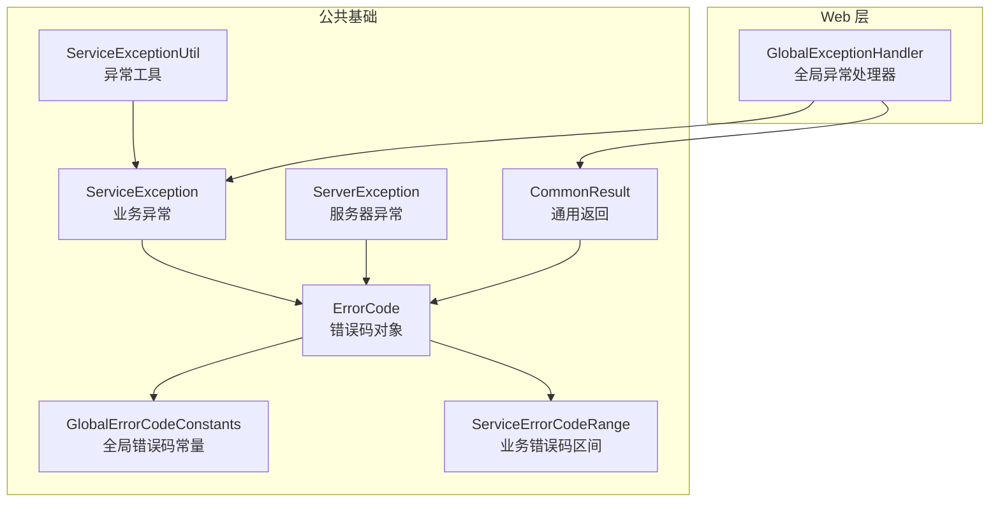
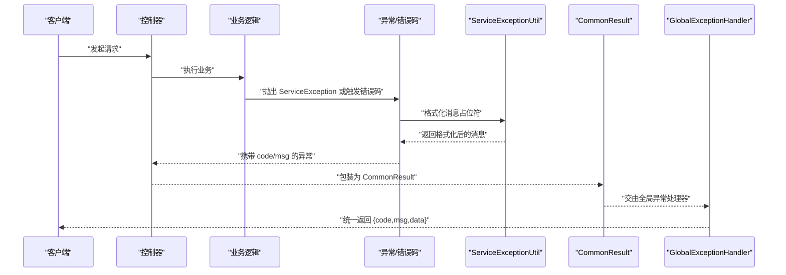
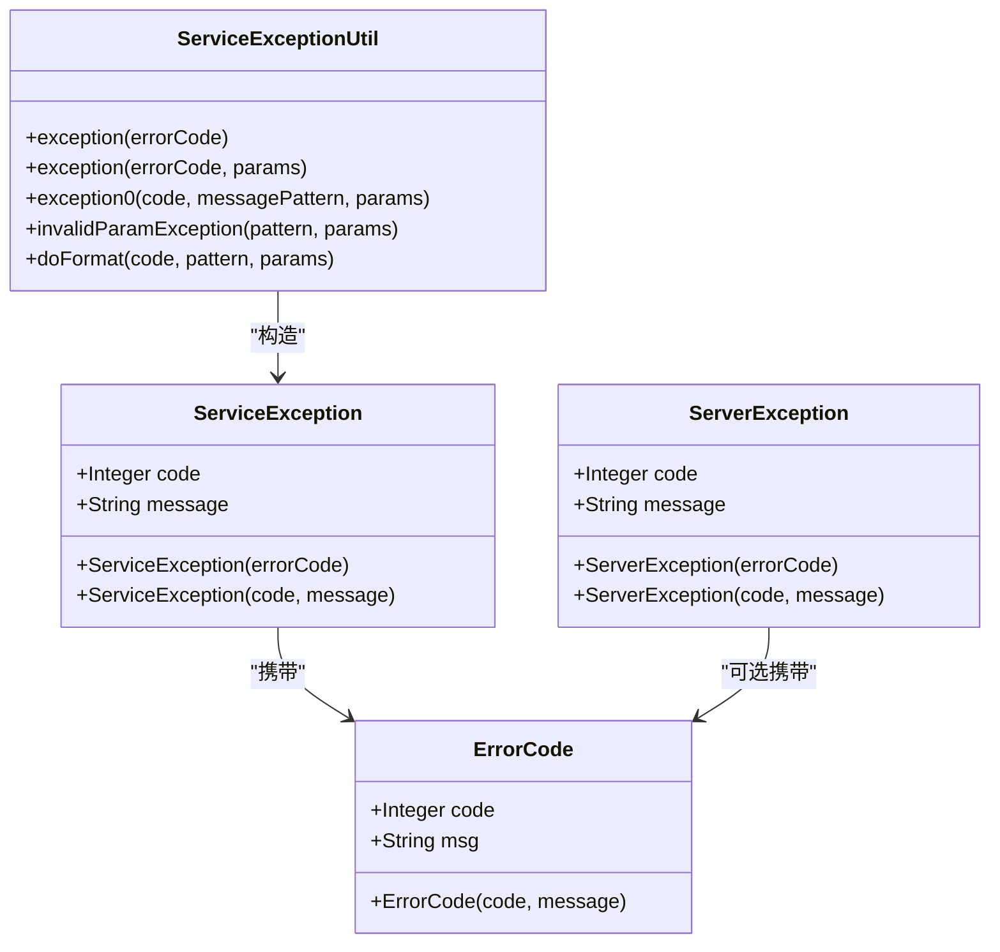
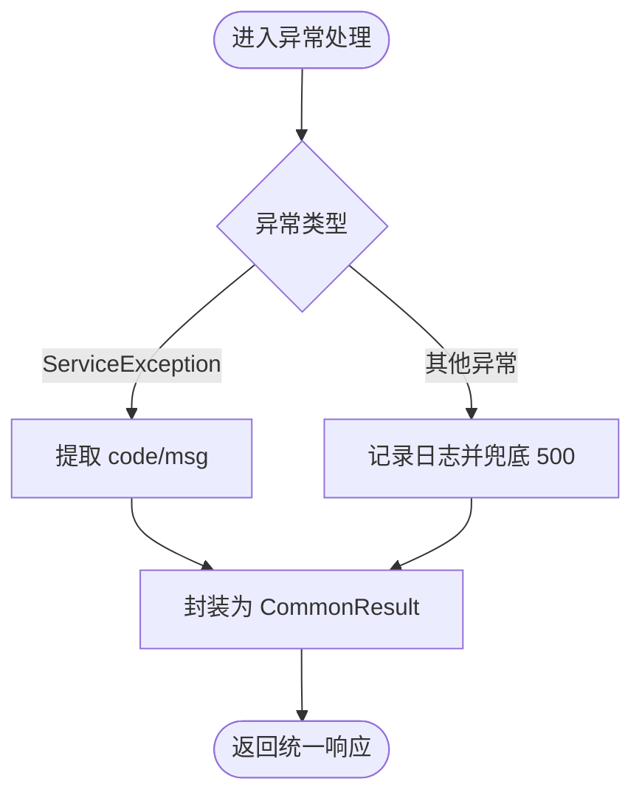
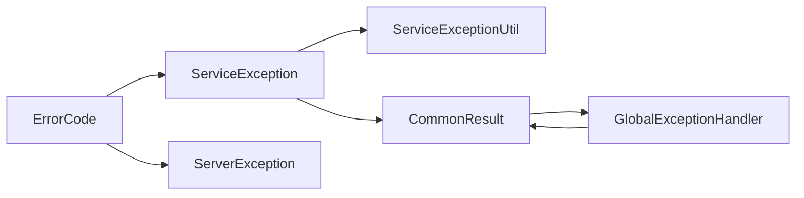

# 错误码管理

<cite>
**本文引用的文件**
- [GlobalErrorCodeConstants.java](file://pandora-framework/pandora-common/src/main/java/net/ittimeline/pandora/framework/common/exception/enums/GlobalErrorCodeConstants.java)
- [ServiceErrorCodeRange.java](file://pandora-framework/pandora-common/src/main/java/net/ittimeline/pandora/framework/common/exception/enums/ServiceErrorCodeRange.java)
- [ErrorCode.java](file://pandora-framework/pandora-common/src/main/java/net/ittimeline/pandora/framework/common/exception/ErrorCode.java)
- [ServiceException.java](file://pandora-framework/pandora-common/src/main/java/net/ittimeline/pandora/framework/common/exception/ServiceException.java)
- [ServerException.java](file://pandora-framework/pandora-common/src/main/java/net/ittimeline/pandora/framework/common/exception/ServerException.java)
- [ServiceExceptionUtil.java](file://pandora-framework/pandora-common/src/main/java/net/ittimeline/pandora/framework/common/exception/util/ServiceExceptionUtil.java)
- [CommonResult.java](file://pandora-framework/pandora-common/src/main/java/net/ittimeline/pandora/framework/common/pojo/CommonResult.java)
- [GlobalExceptionHandler.java](file://pandora-framework/pandora-spring-boot-starter-web/src/main/java/net/ittimeline/pandora/framework/web/core/handler/GlobalExceptionHandler.java)
- [pandora-common/README.md](file://pandora-framework/pandora-common/README.md)
</cite>

## 目录
1. [简介](#简介)
2. [项目结构](#项目结构)
3. [核心组件](#核心组件)
4. [架构总览](#架构总览)
5. [详细组件分析](#详细组件分析)
6. [依赖分析](#依赖分析)
7. [性能考虑](#性能考虑)
8. [故障排除指南](#故障排除指南)
9. [结论](#结论)
10. [附录](#附录)

## 简介
本文件面向 Pandora Cloud 框架的错误码管理体系，系统性阐述全局错误码常量定义、服务错误码范围划分与设计规范，以及错误码与异常处理、响应封装、国际化支持的关系。文档同时提供错误码冲突排查方法、新增错误码的标准流程与最佳实践，帮助开发者在保证一致性的同时提升用户体验与可观测性。

## 项目结构
围绕错误码管理的关键文件主要位于以下路径：
- 异常与错误码定义：pandora-framework/pandora-common/src/main/java/.../exception/*
- 业务异常工具：pandora-framework/pandora-common/src/main/java/.../exception/util/*
- 通用返回封装：pandora-framework/pandora-common/src/main/java/.../pojo/CommonResult.java
- 全局异常处理：pandora-framework/pandora-spring-boot-starter-web/src/main/java/.../web/core/handler/GlobalExceptionHandler.java

图表来源
- [ErrorCode.java:1-33](file://pandora-framework/pandora-common/src/main/java/net/ittimeline/pandora/framework/common/exception/ErrorCode.java#L1-L33)
- [GlobalErrorCodeConstants.java:1-42](file://pandora-framework/pandora-common/src/main/java/net/ittimeline/pandora/framework/common/exception/enums/GlobalErrorCodeConstants.java#L1-L42)
- [ServiceErrorCodeRange.java:1-48](file://pandora-framework/pandora-common/src/main/java/net/ittimeline/pandora/framework/common/exception/enums/ServiceErrorCodeRange.java#L1-L48)
- [ServiceException.java:1-64](file://pandora-framework/pandora-common/src/main/java/net/ittimeline/pandora/framework/common/exception/ServiceException.java#L1-L64)
- [ServerException.java:1-65](file://pandora-framework/pandora-common/src/main/java/net/ittimeline/pandora/framework/common/exception/ServerException.java#L1-L65)
- [ServiceExceptionUtil.java:1-85](file://pandora-framework/pandora-common/src/main/java/net/ittimeline/pandora/framework/common/exception/util/ServiceExceptionUtil.java#L1-L85)
- [CommonResult.java:1-123](file://pandora-framework/pandora-common/src/main/java/net/ittimeline/pandora/framework/common/pojo/CommonResult.java#L1-L123)
- [GlobalExceptionHandler.java:1-454](file://pandora-framework/pandora-spring-boot-starter-web/src/main/java/net/ittimeline/pandora/framework/web/core/handler/GlobalExceptionHandler.java#L1-L454)

章节来源
- [pandora-common/README.md:1-12](file://pandora-framework/pandora-common/README.md#L1-L12)

## 核心组件
- 错误码对象：统一承载错误编号与提示信息，区分全局与业务两类错误码域。
- 全局错误码常量：覆盖客户端错误、服务端错误与自定义错误，编号范围 0-999。
- 业务错误码区间：采用 10 位编号，按“类型-系统-模块-错误码”四段划分，避免冲突。
- 业务异常与服务器异常：分别用于业务场景与兜底系统异常。
- 异常工具：提供消息格式化能力，支持占位符替换与参数校验。
- 通用返回：封装 code/msg/data，统一对外输出。
- 全局异常处理器：将各类异常翻译为统一的 CommonResult 响应。

章节来源
- [ErrorCode.java:1-33](file://pandora-framework/pandora-common/src/main/java/net/ittimeline/pandora/framework/common/exception/ErrorCode.java#L1-L33)
- [GlobalErrorCodeConstants.java:1-42](file://pandora-framework/pandora-common/src/main/java/net/ittimeline/pandora/framework/common/exception/enums/GlobalErrorCodeConstants.java#L1-L42)
- [ServiceErrorCodeRange.java:1-48](file://pandora-framework/pandora-common/src/main/java/net/ittimeline/pandora/framework/common/exception/enums/ServiceErrorCodeRange.java#L1-L48)
- [ServiceException.java:1-64](file://pandora-framework/pandora-common/src/main/java/net/ittimeline/pandora/framework/common/exception/ServiceException.java#L1-L64)
- [ServerException.java:1-65](file://pandora-framework/pandora-common/src/main/java/net/ittimeline/pandora/framework/common/exception/ServerException.java#L1-L65)
- [ServiceExceptionUtil.java:1-85](file://pandora-framework/pandora-common/src/main/java/net/ittimeline/pandora/framework/common/exception/util/ServiceExceptionUtil.java#L1-L85)
- [CommonResult.java:1-123](file://pandora-framework/pandora-common/src/main/java/net/ittimeline/pandora/framework/common/pojo/CommonResult.java#L1-L123)
- [GlobalExceptionHandler.java:1-454](file://pandora-framework/pandora-spring-boot-starter-web/src/main/java/net/ittimeline/pandora/framework/web/core/handler/GlobalExceptionHandler.java#L1-L454)

## 架构总览
错误码从定义到响应的流转链路如下：

图表来源
- [ServiceExceptionUtil.java:1-85](file://pandora-framework/pandora-common/src/main/java/net/ittimeline/pandora/framework/common/exception/util/ServiceExceptionUtil.java#L1-L85)
- [CommonResult.java:1-123](file://pandora-framework/pandora-common/src/main/java/net/ittimeline/pandora/framework/common/pojo/CommonResult.java#L1-L123)
- [GlobalExceptionHandler.java:1-454](file://pandora-framework/pandora-spring-boot-starter-web/src/main/java/net/ittimeline/pandora/framework/web/core/handler/GlobalExceptionHandler.java#L1-L454)

## 详细组件分析

### 全局错误码常量定义（0-999）
- 设计原则
  - 成功：编号 0，提示“成功”
  - 客户端错误：400/401/403/404/405/423/429
  - 服务端错误：500/501/502
  - 自定义错误：900/901/999
- 命名约定
  - 采用全大写单词组合，语义清晰，便于检索与维护
- 编号规则
  - 严格限定在 0-999 区间，避免与业务错误码冲突
- 分类体系
  - 按 HTTP 状态语义划分，便于前端与网关层理解

章节来源
- [GlobalErrorCodeConstants.java:1-42](file://pandora-framework/pandora-common/src/main/java/net/ittimeline/pandora/framework/common/exception/enums/GlobalErrorCodeConstants.java#L1-L42)

### 业务错误码范围划分（≥10^9）
- 设计原则
  - 10 位编号，四段式结构：类型-系统-模块-错误码
  - 类型位固定为 1，表示业务级异常
  - 系统位：001 用户系统、002 商品系统、003 订单系统、004 支付系统、005 优惠券系统等
  - 模块位：同一系统内可细分模块
  - 错误码位：模块内自增
- 冲突规避
  - 通过区间注释明确各模块的编号范围，避免重叠
- 示例区间
  - infra/system/report/member/mp/pay/bpm/product/trade/promotion/crm/ai 等

章节来源
- [ServiceErrorCodeRange.java:1-48](file://pandora-framework/pandora-common/src/main/java/net/ittimeline/pandora/framework/common/exception/enums/ServiceErrorCodeRange.java#L1-L48)

### 错误码对象与异常体系
- 错误码对象
  - 承载 code/msg，区分全局与业务两类域
- 业务异常 ServiceException
  - 携带业务错误码与消息，用于业务分支的显式错误
- 服务器异常 ServerException
  - 用于系统级异常，不携带业务错误码
- 异常工具 ServiceExceptionUtil
  - 提供占位符格式化能力，避免 String.format 的参数不匹配风险
  - 对参数过多/过少进行日志告警，保障可观测性

图表来源
- [ErrorCode.java:1-33](file://pandora-framework/pandora-common/src/main/java/net/ittimeline/pandora/framework/common/exception/ErrorCode.java#L1-L33)
- [ServiceException.java:1-64](file://pandora-framework/pandora-common/src/main/java/net/ittimeline/pandora/framework/common/exception/ServiceException.java#L1-L64)
- [ServerException.java:1-65](file://pandora-framework/pandora-common/src/main/java/net/ittimeline/pandora/framework/common/exception/ServerException.java#L1-L65)
- [ServiceExceptionUtil.java:1-85](file://pandora-framework/pandora-common/src/main/java/net/ittimeline/pandora/framework/common/exception/util/ServiceExceptionUtil.java#L1-L85)

章节来源
- [ErrorCode.java:1-33](file://pandora-framework/pandora-common/src/main/java/net/ittimeline/pandora/framework/common/exception/ErrorCode.java#L1-L33)
- [ServiceException.java:1-64](file://pandora-framework/pandora-common/src/main/java/net/ittimeline/pandora/framework/common/exception/ServiceException.java#L1-L64)
- [ServerException.java:1-65](file://pandora-framework/pandora-common/src/main/java/net/ittimeline/pandora/framework/common/exception/ServerException.java#L1-L65)
- [ServiceExceptionUtil.java:1-85](file://pandora-framework/pandora-common/src/main/java/net/ittimeline/pandora/framework/common/exception/util/ServiceExceptionUtil.java#L1-L85)

### 通用返回与异常映射
- CommonResult
  - 统一返回结构 code/msg/data
  - 提供 success/error/checkError/getCheckedData 等便捷方法
- 全局异常处理器
  - 将各类异常映射为 CommonResult
  - 对 ServiceException 直接透传 code/msg
  - 对系统异常兜底为 500
  - 对特定数据库异常进行模块化提示

图表来源
- [CommonResult.java:1-123](file://pandora-framework/pandora-common/src/main/java/net/ittimeline/pandora/framework/common/pojo/CommonResult.java#L1-L123)
- [GlobalExceptionHandler.java:1-454](file://pandora-framework/pandora-spring-boot-starter-web/src/main/java/net/ittimeline/pandora/framework/web/core/handler/GlobalExceptionHandler.java#L1-L454)

章节来源
- [CommonResult.java:1-123](file://pandora-framework/pandora-common/src/main/java/net/ittimeline/pandora/framework/common/pojo/CommonResult.java#L1-L123)
- [GlobalExceptionHandler.java:1-454](file://pandora-framework/pandora-spring-boot-starter-web/src/main/java/net/ittimeline/pandora/framework/web/core/handler/GlobalExceptionHandler.java#L1-L454)

## 依赖分析
- 组件耦合
  - ServiceException/ServerException 依赖 ErrorCode
  - ServiceExceptionUtil 依赖 ServiceException 与全局错误常量
  - CommonResult 依赖 ServiceExceptionUtil 与全局错误常量
  - GlobalExceptionHandler 依赖 ServiceException 与 CommonResult
- 依赖方向
  - 上层（Web 层）依赖下层（异常与工具层）
  - 下层（异常与工具层）不反向依赖上层
- 冲突风险
  - 业务错误码通过区间注释约束，冲突概率低
  - 全局错误码严格限定 0-999，避免与业务码重叠

图表来源
- [ErrorCode.java:1-33](file://pandora-framework/pandora-common/src/main/java/net/ittimeline/pandora/framework/common/exception/ErrorCode.java#L1-L33)
- [ServiceException.java:1-64](file://pandora-framework/pandora-common/src/main/java/net/ittimeline/pandora/framework/common/exception/ServiceException.java#L1-L64)
- [ServerException.java:1-65](file://pandora-framework/pandora-common/src/main/java/net/ittimeline/pandora/framework/common/exception/ServerException.java#L1-L65)
- [ServiceExceptionUtil.java:1-85](file://pandora-framework/pandora-common/src/main/java/net/ittimeline/pandora/framework/common/exception/util/ServiceExceptionUtil.java#L1-L85)
- [CommonResult.java:1-123](file://pandora-framework/pandora-common/src/main/java/net/ittimeline/pandora/framework/common/pojo/CommonResult.java#L1-L123)
- [GlobalExceptionHandler.java:1-454](file://pandora-framework/pandora-spring-boot-starter-web/src/main/java/net/ittimeline/pandora/framework/web/core/handler/GlobalExceptionHandler.java#L1-L454)

## 性能考虑
- 错误码格式化
  - 使用预估容量的 StringBuilder，减少扩容开销
  - 对参数过多/过少进行日志告警，避免异常传播放大
- 统一返回
  - CommonResult 提供 isSuccess/isError 判定，降低重复判断成本
- 全局异常处理
  - 对常见异常进行快速映射，减少反射与复杂分支

## 故障排除指南

### 错误码冲突排查
- 业务错误码冲突
  - 检查区间注释与模块划分，确认是否越界或重叠
  - 建议在模块内按“模块自增”的策略维护错误码位
- 全局错误码冲突
  - 确认未在 0-999 区间内新增自定义编号
  - 如需扩展，评估是否可复用现有语义或申请新编号段

章节来源
- [ServiceErrorCodeRange.java:1-48](file://pandora-framework/pandora-common/src/main/java/net/ittimeline/pandora/framework/common/exception/enums/ServiceErrorCodeRange.java#L1-L48)
- [GlobalErrorCodeConstants.java:1-42](file://pandora-framework/pandora-common/src/main/java/net/ittimeline/pandora/framework/common/exception/enums/GlobalErrorCodeConstants.java#L1-L42)

### 新增错误码标准流程
- 全局错误码
  - 在全局常量中新增条目，遵循现有命名与编号风格
  - 说明用途与适用场景，便于团队共识
- 业务错误码
  - 明确所属系统/模块，选择合适区间
  - 在区间注释中标明范围，避免后续冲突
  - 在模块内按自增策略维护错误码位

章节来源
- [GlobalErrorCodeConstants.java:1-42](file://pandora-framework/pandora-common/src/main/java/net/ittimeline/pandora/framework/common/exception/enums/GlobalErrorCodeConstants.java#L1-L42)
- [ServiceErrorCodeRange.java:1-48](file://pandora-framework/pandora-common/src/main/java/net/ittimeline/pandora/framework/common/exception/enums/ServiceErrorCodeRange.java#L1-L48)

### 错误码国际化支持
- 消息格式化
  - 使用占位符与 ServiceExceptionUtil 的格式化方法，便于后续替换为多语言资源
- 建议
  - 将错误提示模板化，结合应用的国际化机制进行动态替换
  - 对用户可见的错误提示保持简洁一致，避免泄露内部细节

章节来源
- [ServiceExceptionUtil.java:1-85](file://pandora-framework/pandora-common/src/main/java/net/ittimeline/pandora/framework/common/exception/util/ServiceExceptionUtil.java#L1-L85)

### 错误码与异常处理映射
- ServiceException
  - 直接透传 code/msg，保持业务语义
- 其他异常
  - 兜底为系统错误码（如 500），并记录异常日志
- 统一返回
  - 通过 CommonResult 输出统一结构，便于前端消费

章节来源
- [GlobalExceptionHandler.java:1-454](file://pandora-framework/pandora-spring-boot-starter-web/src/main/java/net/ittimeline/pandora/framework/web/core/handler/GlobalExceptionHandler.java#L1-L454)
- [CommonResult.java:1-123](file://pandora-framework/pandora-common/src/main/java/net/ittimeline/pandora/framework/common/pojo/CommonResult.java#L1-L123)

### 用户体验优化最佳实践
- 明确错误语义
  - 使用全局错误码覆盖常见客户端/服务端错误，确保语义一致
- 友好提示
  - 通过格式化工具对错误提示进行参数化，避免硬编码
- 可观测性
  - 全局异常处理器记录关键上下文，便于定位问题

章节来源
- [GlobalExceptionHandler.java:1-454](file://pandora-framework/pandora-spring-boot-starter-web/src/main/java/net/ittimeline/pandora/framework/web/core/handler/GlobalExceptionHandler.java#L1-L454)
- [ServiceExceptionUtil.java:1-85](file://pandora-framework/pandora-common/src/main/java/net/ittimeline/pandora/framework/common/exception/util/ServiceExceptionUtil.java#L1-L85)

## 结论
Pandora Cloud 的错误码管理体系通过“全局错误码（0-999）+ 业务错误码区间（≥10^9）”实现了清晰的分层与强约束，配合 ServiceException/ServerException 与 ServiceExceptionUtil 的协同，形成了从定义、格式化到统一返回与异常映射的完整闭环。遵循本文提供的命名约定、编号规则、冲突排查与新增流程，可在保证一致性的同时提升系统的可观测性与用户体验。

## 附录

### 错误码设计规范速查
- 全局错误码（0-999）
  - 成功：0
  - 客户端错误：400/401/403/404/405/423/429
  - 服务端错误：500/501/502
  - 自定义错误：900/901/999
- 业务错误码（≥10^9）
  - 结构：1-XXX-XXX-XXX
  - 类型位：1（业务级）
  - 系统位：001 用户系统、002 商品系统、003 订单系统、004 支付系统、005 优惠券系统等
  - 模块位：模块内细分
  - 错误码位：模块内自增

章节来源
- [GlobalErrorCodeConstants.java:1-42](file://pandora-framework/pandora-common/src/main/java/net/ittimeline/pandora/framework/common/exception/enums/GlobalErrorCodeConstants.java#L1-L42)
- [ServiceErrorCodeRange.java:1-48](file://pandora-framework/pandora-common/src/main/java/net/ittimeline/pandora/framework/common/exception/enums/ServiceErrorCodeRange.java#L1-L48)