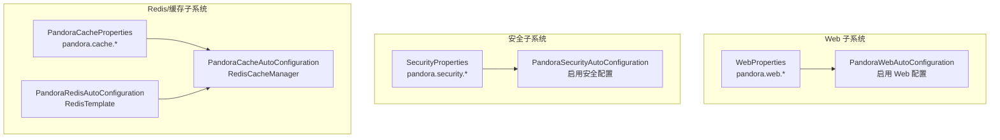
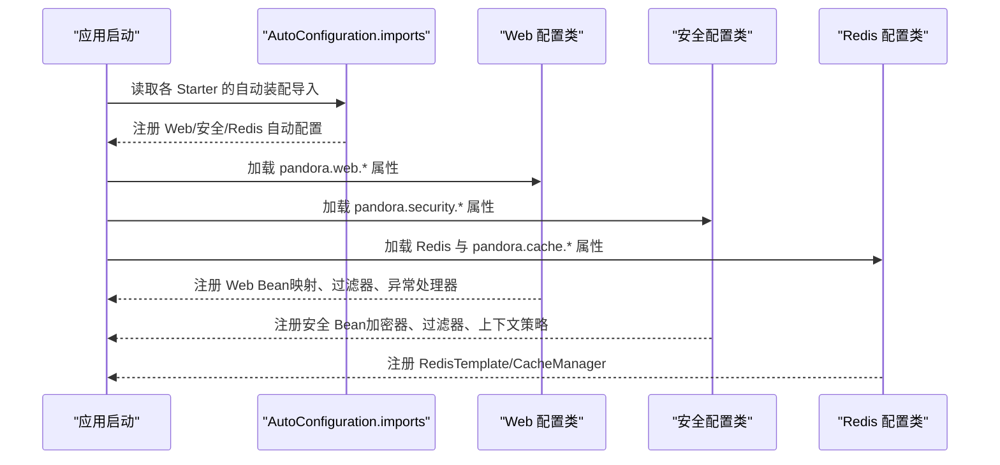
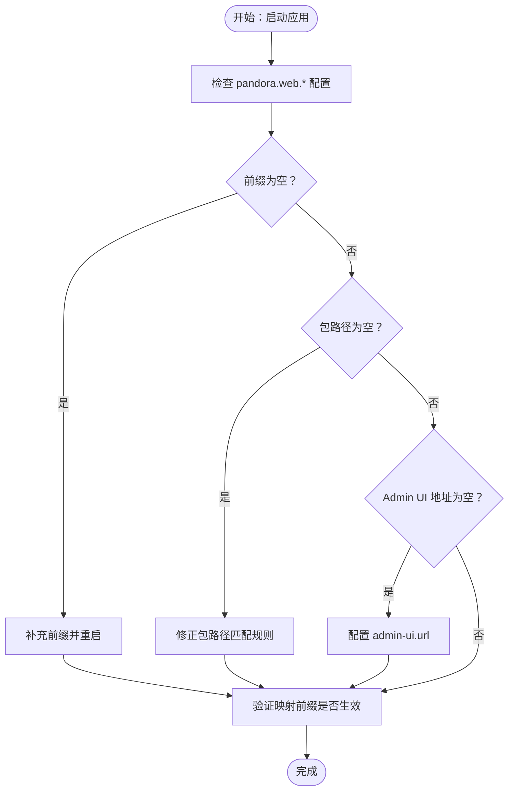
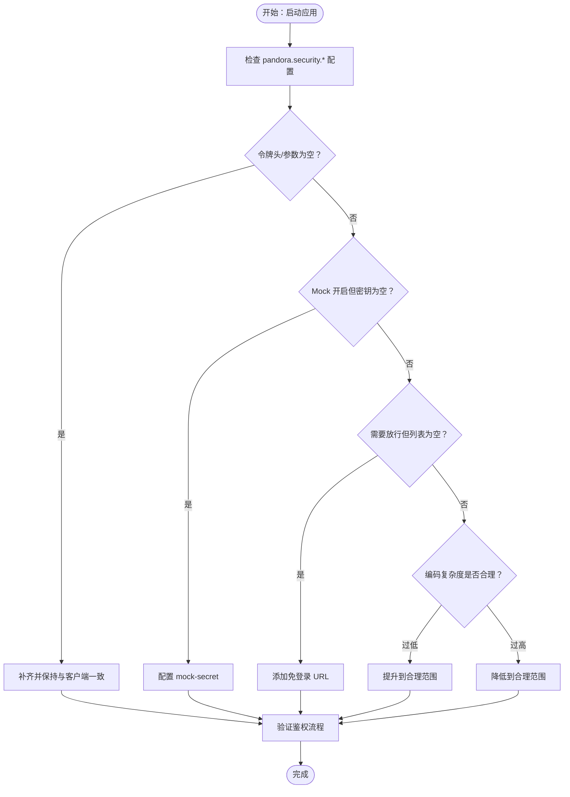
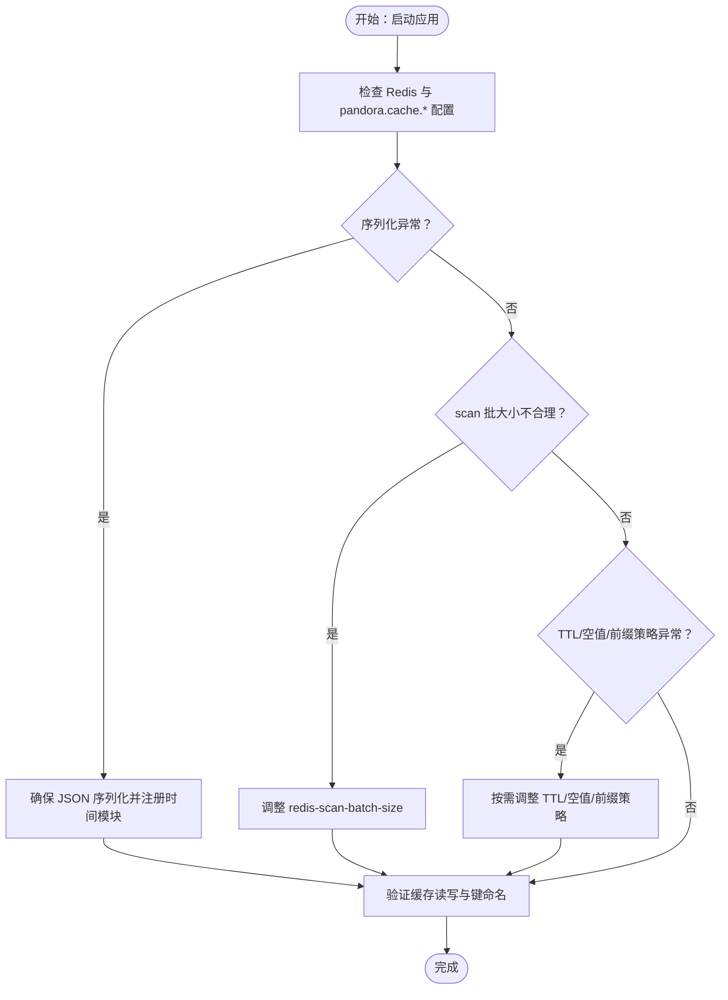
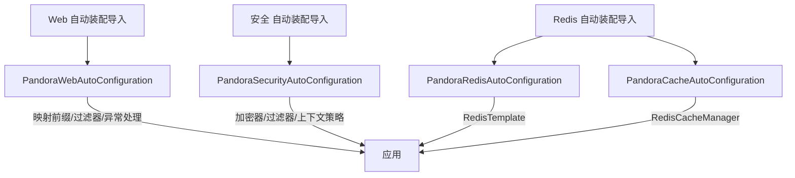

# 配置问题

<cite>
**本文引用的文件**
- [WebProperties.java](file://pandora-framework/pandora-spring-boot-starter-web/src/main/java/net/ittimeline/pandora/framework/web/config/WebProperties.java)
- [PandoraWebAutoConfiguration.java](file://pandora-framework/pandora-spring-boot-starter-web/src/main/java/net/ittimeline/pandora/framework/web/config/PandoraWebAutoConfiguration.java)
- [SecurityProperties.java](file://pandora-framework/pandora-spring-boot-starter-security/src/main/java/net/ittimeline/pandora/framework/security/config/SecurityProperties.java)
- [PandoraSecurityAutoConfiguration.java](file://pandora-framework/pandora-spring-boot-starter-security/src/main/java/net/ittimeline/pandora/framework/security/config/PandoraSecurityAutoConfiguration.java)
- [PandoraRedisAutoConfiguration.java](file://pandora-framework/pandora-spring-boot-starter-redis/src/main/java/net/ittimeline/pandora/framework/redis/config/PandoraRedisAutoConfiguration.java)
- [PandoraCacheAutoConfiguration.java](file://pandora-framework/pandora-spring-boot-starter-redis/src/main/java/net/ittimeline/pandora/framework/redis/config/PandoraCacheAutoConfiguration.java)
- [PandoraCacheProperties.java](file://pandora-framework/pandora-spring-boot-starter-redis/src/main/java/net/ittimeline/pandora/framework/redis/config/PandoraCacheProperties.java)
- [GlobalExceptionHandler.java](file://pandora-framework/pandora-spring-boot-starter-web/src/main/java/net/ittimeline/pandora/framework/web/core/handler/GlobalExceptionHandler.java)
- [org.springframework.boot.autoconfigure.AutoConfiguration.imports（web）](file://pandora-framework/pandora-spring-boot-starter-web/src/main/resources/META-INF/spring/org.springframework.boot.autoconfigure.AutoConfiguration.imports)
- [org.springframework.boot.autoconfigure.AutoConfiguration.imports（security）](file://pandora-framework/pandora-spring-boot-starter-security/src/main/resources/META-INF/spring/org.springframework.boot.autoconfigure.AutoConfiguration.imports)
- [org.springframework.boot.autoconfigure.AutoConfiguration.imports（redis）](file://pandora-framework/pandora-spring-boot-starter-redis/src/main/resources/META-INF/spring/org.springframework.boot.autoconfigure.AutoConfiguration.imports)
</cite>

## 目录
1. [简介](#简介)
2. [项目结构与配置入口](#项目结构与配置入口)
3. [核心配置组件总览](#核心配置组件总览)
4. [架构概览与配置加载顺序](#架构概览与配置加载顺序)
5. [详细组件与故障排除指南](#详细组件与故障排除指南)
6. [依赖关系与冲突诊断](#依赖关系与冲突诊断)
7. [性能与稳定性考量](#性能与稳定性考量)
8. [常见症状与排查清单](#常见症状与排查清单)
9. [结论](#结论)
10. [附录：配置模板与最佳实践](#附录配置模板与最佳实践)

## 简介
本指南聚焦于 Pandora Cloud 框架在实际运行中常见的“配置问题”，覆盖以下方面：
- 如何识别配置问题的症状（如启动失败、功能异常、鉴权失败、缓存不可用等）
- 针对 Web 配置、安全配置、Redis/缓存配置的验证方法与修复步骤
- 配置优先级与加载顺序的解析技巧
- 配置冲突的诊断与规避
- 提供可直接套用的配置模板与最佳实践

## 项目结构与配置入口
Pandora Cloud 将配置能力以“自动装配 + 属性对象”的方式注入到应用中：
- Web 配置：通过 WebProperties 与 PandoraWebAutoConfiguration 绑定
- 安全配置：通过 SecurityProperties 与 PandoraSecurityAutoConfiguration 绑定
- Redis/缓存配置：通过 Redis 配置类与 CacheProperties 绑定，形成 RedisTemplate 与 RedisCacheManager

图表来源
- [WebProperties.java:18-25](file://pandora-framework/pandora-spring-boot-starter-web/src/main/java/net/ittimeline/pandora/framework/web/config/WebProperties.java#L18-L25)
- [PandoraWebAutoConfiguration.java:46](file://pandora-framework/pandora-spring-boot-starter-web/src/main/java/net/ittimeline/pandora/framework/web/config/PandoraWebAutoConfiguration.java#L46)
- [SecurityProperties.java:19-27](file://pandora-framework/pandora-spring-boot-starter-security/src/main/java/net/ittimeline/pandora/framework/security/config/SecurityProperties.java#L19-L27)
- [PandoraSecurityAutoConfiguration.java:38](file://pandora-framework/pandora-spring-boot-starter-security/src/main/java/net/ittimeline/pandora/framework/security/config/PandoraSecurityAutoConfiguration.java#L38)
- [PandoraRedisAutoConfiguration.java:19](file://pandora-framework/pandora-spring-boot-starter-redis/src/main/java/net/ittimeline/pandora/framework/redis/config/PandoraRedisAutoConfiguration.java#L19)
- [PandoraCacheAutoConfiguration.java:32](file://pandora-framework/pandora-spring-boot-starter-redis/src/main/java/net/ittimeline/pandora/framework/redis/config/PandoraCacheAutoConfiguration.java#L32)
- [PandoraCacheProperties.java:14](file://pandora-framework/pandora-spring-boot-starter-redis/src/main/java/net/ittimeline/pandora/framework/redis/config/PandoraCacheProperties.java#L14)

章节来源
- [org.springframework.boot.autoconfigure.AutoConfiguration.imports（web）:1-8](file://pandora-framework/pandora-spring-boot-starter-web/src/main/resources/META-INF/spring/org.springframework.boot.autoconfigure.AutoConfiguration.imports#L1-L8)
- [org.springframework.boot.autoconfigure.AutoConfiguration.imports（security）:1-6](file://pandora-framework/pandora-spring-boot-starter-security/src/main/resources/META-INF/spring/org.springframework.boot.autoconfigure.AutoConfiguration.imports#L1-L6)
- [org.springframework.boot.autoconfigure.AutoConfiguration.imports（redis）:1-2](file://pandora-framework/pandora-spring-boot-starter-redis/src/main/resources/META-INF/spring/org.springframework.boot.autoconfigure.AutoConfiguration.imports#L1-L2)

## 核心配置组件总览
- Web 配置（pandora.web.*）
  - 关键点：API 前缀与控制器包匹配规则；UI 地址
  - 校验：前缀与包路径均不能为空
- 安全配置（pandora.security.*）
  - 关键点：令牌请求头/参数、Mock 开关与密钥、免登录 URL 列表、密码编码复杂度
  - 校验：令牌头与参数不能为空；Mock 开关与密钥需配合使用
- Redis/缓存配置（pandora.cache.* 与 Redis 配置）
  - 关键点：RedisTemplate 序列化策略、RedisCacheManager TTL/空值缓存/前缀策略、scan 批大小
  - 校验：序列化器需兼容时间类型；scan 批大小需合理

章节来源
- [WebProperties.java:22-28](file://pandora-framework/pandora-spring-boot-starter-web/src/main/java/net/ittimeline/pandora/framework/web/config/WebProperties.java#L22-L28)
- [SecurityProperties.java:26-46](file://pandora-framework/pandora-spring-boot-starter-security/src/main/java/net/ittimeline/pandora/framework/security/config/SecurityProperties.java#L26-L46)
- [PandoraCacheProperties.java:17-26](file://pandora-framework/pandora-spring-boot-starter-redis/src/main/java/net/ittimeline/pandora/framework/redis/config/PandoraCacheProperties.java#L17-L26)

## 架构概览与配置加载顺序
- 自动装配导入顺序
  - Web：PandoraWebAutoConfiguration 等
  - 安全：PandoraSecurityAutoConfiguration 等
  - Redis：PandoraRedisAutoConfiguration 与 PandoraCacheAutoConfiguration
- 配置加载顺序（Spring Boot 与 Starter 的典型行为）
  1) 启动类与应用入口
  2) 读取 application.yml/.properties
  3) 触发 @EnableConfigurationProperties 与 @AutoConfiguration 导入
  4) 实例化配置类 Bean（如 RedisTemplate、RedisCacheManager、全局异常处理器等）
  5) 初始化 Web MVC 映射与过滤器链
  6) 完成启动

图表来源
- [org.springframework.boot.autoconfigure.AutoConfiguration.imports（web）:1-8](file://pandora-framework/pandora-spring-boot-starter-web/src/main/resources/META-INF/spring/org.springframework.boot.autoconfigure.AutoConfiguration.imports#L1-L8)
- [org.springframework.boot.autoconfigure.AutoConfiguration.imports（security）:1-6](file://pandora-framework/pandora-spring-boot-starter-security/src/main/resources/META-INF/spring/org.springframework.boot.autoconfigure.AutoConfiguration.imports#L1-L6)
- [org.springframework.boot.autoconfigure.AutoConfiguration.imports（redis）:1-2](file://pandora-framework/pandora-spring-boot-starter-redis/src/main/resources/META-INF/spring/org.springframework.boot.autoconfigure.AutoConfiguration.imports#L1-L2)

## 详细组件与故障排除指南

### Web 配置（pandora.web.*）
- 常见问题
  - API 前缀为空或未设置：导致映射不生效，请求 404
  - 控制器包路径为空或不匹配：导致前缀不应用到目标 Controller
  - Admin UI 地址缺失：前端访问路径异常
- 诊断步骤
  - 检查配置文件是否包含 pandora.web.app-api.prefix/controller、pandora.web.admin-api.prefix/controller、pandora.web.admin-ui.url
  - 启动后观察映射前缀是否生效（可通过请求路径验证）
  - 若出现 404，确认 Controller 是否位于声明的包路径下
- 修复建议
  - 确保 app-api/admin-api 的 prefix 与 controller 均非空
  - 确认 controller 包路径使用 Ant 语法正确匹配
  - 配置 admin-ui.url 以便前端正确访问

图表来源
- [WebProperties.java:22-28](file://pandora-framework/pandora-spring-boot-starter-web/src/main/java/net/ittimeline/pandora/framework/web/config/WebProperties.java#L22-L28)
- [PandoraWebAutoConfiguration.java:56-91](file://pandora-framework/pandora-spring-boot-starter-web/src/main/java/net/ittimeline/pandora/framework/web/config/PandoraWebAutoConfiguration.java#L56-L91)

章节来源
- [WebProperties.java:22-28](file://pandora-framework/pandora-spring-boot-starter-web/src/main/java/net/ittimeline/pandora/framework/web/config/WebProperties.java#L22-L28)
- [PandoraWebAutoConfiguration.java:56-91](file://pandora-framework/pandora-spring-boot-starter-web/src/main/java/net/ittimeline/pandora/framework/web/config/PandoraWebAutoConfiguration.java#L56-L91)

### 安全配置（pandora.security.*）
- 常见问题
  - 令牌请求头/参数为空：导致鉴权失败
  - Mock 开关开启但密钥未配置：导致认证绕过或异常
  - 免登录 URL 列表为空但业务需要放行：导致登录拦截
  - 密码编码复杂度过低或过高：影响性能与安全
- 诊断步骤
  - 检查 pandora.security.token-header/token-parameter/mock-enable/mock-secret/permit-all-urls/password-encoder-length
  - 通过接口访问测试鉴权是否按预期工作
  - 若 Mock 开启，确保 mock-secret 正确配置
- 修复建议
  - 令牌头与参数必须同时配置且与前端/客户端一致
  - 若启用 Mock，务必设置强密钥
  - permit-all-urls 按需添加白名单
  - password-encoder-length 根据性能需求调整至合理范围（如 10~15）

图表来源
- [SecurityProperties.java:26-46](file://pandora-framework/pandora-spring-boot-starter-security/src/main/java/net/ittimeline/pandora/framework/security/config/SecurityProperties.java#L26-L46)
- [PandoraSecurityAutoConfiguration.java:66-69](file://pandora-framework/pandora-spring-boot-starter-security/src/main/java/net/ittimeline/pandora/framework/security/config/PandoraSecurityAutoConfiguration.java#L66-L69)

章节来源
- [SecurityProperties.java:26-46](file://pandora-framework/pandora-spring-boot-starter-security/src/main/java/net/ittimeline/pandora/framework/security/config/SecurityProperties.java#L26-L46)
- [PandoraSecurityAutoConfiguration.java:66-69](file://pandora-framework/pandora-spring-boot-starter-security/src/main/java/net/ittimeline/pandora/framework/security/config/PandoraSecurityAutoConfiguration.java#L66-L69)

### Redis/缓存配置（pandora.cache.* 与 Redis）
- 常见问题
  - RedisTemplate 序列化异常：时间类型未正确序列化
  - scan 批大小不合理：导致内存占用或查询效率低
  - TTL/空值缓存/前缀策略未按预期：导致键冲突或命中率低
- 诊断步骤
  - 检查 pandora.cache.redis-scan-batch-size、spring.redis.*、spring.cache.redis.*
  - 通过缓存读写验证序列化与 TTL 生效
  - 观察 Redis 键命名是否符合预期前缀策略
- 修复建议
  - 保持 RedisTemplate 使用 JSON 序列化并注册时间模块
  - 合理设置 redis-scan-batch-size（默认值可参考实现）
  - 按需开启/关闭空值缓存与 key 前缀

图表来源
- [PandoraRedisAutoConfiguration.java:25-46](file://pandora-framework/pandora-spring-boot-starter-redis/src/main/java/net/ittimeline/pandora/framework/redis/config/PandoraRedisAutoConfiguration.java#L25-L46)
- [PandoraCacheAutoConfiguration.java:40-83](file://pandora-framework/pandora-spring-boot-starter-redis/src/main/java/net/ittimeline/pandora/framework/redis/config/PandoraCacheAutoConfiguration.java#L40-L83)
- [PandoraCacheProperties.java:17-26](file://pandora-framework/pandora-spring-boot-starter-redis/src/main/java/net/ittimeline/pandora/framework/redis/config/PandoraCacheProperties.java#L17-L26)

章节来源
- [PandoraRedisAutoConfiguration.java:25-46](file://pandora-framework/pandora-spring-boot-starter-redis/src/main/java/net/ittimeline/pandora/framework/redis/config/PandoraRedisAutoConfiguration.java#L25-L46)
- [PandoraCacheAutoConfiguration.java:40-83](file://pandora-framework/pandora-spring-boot-starter-redis/src/main/java/net/ittimeline/pandora/framework/redis/config/PandoraCacheAutoConfiguration.java#L40-L83)
- [PandoraCacheProperties.java:17-26](file://pandora-framework/pandora-spring-boot-starter-redis/src/main/java/net/ittimeline/pandora/framework/redis/config/PandoraCacheProperties.java#L17-L26)

## 依赖关系与冲突诊断
- 自动装配导入
  - Web：PandoraWebAutoConfiguration 等
  - 安全：PandoraSecurityAutoConfiguration 等
  - Redis：PandoraRedisAutoConfiguration 与 PandoraCacheAutoConfiguration
- 冲突与优先级
  - Web 自动配置在特定阶段前置，避免与其他组件初始化冲突
  - 安全自动配置优先级靠前，确保上下文策略先于 Spring Security 初始化
  - Redis 自动配置在 Redisson 之前，确保自定义 RedisTemplate 生效

图表来源
- [org.springframework.boot.autoconfigure.AutoConfiguration.imports（web）:1-8](file://pandora-framework/pandora-spring-boot-starter-web/src/main/resources/META-INF/spring/org.springframework.boot.autoconfigure.AutoConfiguration.imports#L1-L8)
- [org.springframework.boot.autoconfigure.AutoConfiguration.imports（security）:1-6](file://pandora-framework/pandora-spring-boot-starter-security/src/main/resources/META-INF/spring/org.springframework.boot.autoconfigure.AutoConfiguration.imports#L1-L6)
- [org.springframework.boot.autoconfigure.AutoConfiguration.imports（redis）:1-2](file://pandora-framework/pandora-spring-boot-starter-redis/src/main/resources/META-INF/spring/org.springframework.boot.autoconfigure.AutoConfiguration.imports#L1-L2)

章节来源
- [PandoraWebAutoConfiguration.java:43-45](file://pandora-framework/pandora-spring-boot-starter-web/src/main/java/net/ittimeline/pandora/framework/web/config/PandoraWebAutoConfiguration.java#L43-L45)
- [PandoraSecurityAutoConfiguration.java:37](file://pandora-framework/pandora-spring-boot-starter-security/src/main/java/net/ittimeline/pandora/framework/security/config/PandoraSecurityAutoConfiguration.java#L37)
- [PandoraRedisAutoConfiguration.java:19](file://pandora-framework/pandora-spring-boot-starter-redis/src/main/java/net/ittimeline/pandora/framework/redis/config/PandoraRedisAutoConfiguration.java#L19)

## 性能与稳定性考量
- Web
  - 合理设置映射前缀与包匹配，避免过度扫描
  - 全局异常处理器会记录异常日志，注意日志量与存储成本
- 安全
  - 密码编码复杂度与性能平衡，建议在 10~15 之间
  - Mock 模式仅用于开发/联调，生产务必关闭
- Redis/缓存
  - scan 批大小影响内存与 CPU，结合数据规模调优
  - TTL 与空值缓存策略影响命中率与存储，按业务场景选择

## 常见症状与排查清单
- 启动失败
  - 检查各配置类的 @ConfigurationProperties 前缀是否正确
  - 确认自动装配导入文件是否存在且路径正确
- 功能异常（鉴权失败/接口 404/缓存不可用）
  - 按照上述组件逐一核对配置项与默认值
  - 通过最小化配置快速定位问题
- 日志与可观测性
  - 全局异常处理器会记录异常堆栈与请求上下文，便于定位

章节来源
- [GlobalExceptionHandler.java:79-120](file://pandora-framework/pandora-spring-boot-starter-web/src/main/java/net/ittimeline/pandora/framework/web/core/handler/GlobalExceptionHandler.java#L79-L120)

## 结论
- 配置问题多源于属性缺失、格式错误或与默认值不一致
- 通过分组件逐项校验、最小化复现与日志辅助，可高效定位并修复
- 合理设置优先级与加载顺序，有助于避免初始化冲突

## 附录：配置模板与最佳实践
- Web 配置模板（示例键名）
  - pandora.web.app-api.prefix
  - pandora.web.app-api.controller
  - pandora.web.admin-api.prefix
  - pandora.web.admin-api.controller
  - pandora.web.admin-ui.url
- 安全配置模板（示例键名）
  - pandora.security.token-header
  - pandora.security.token-parameter
  - pandora.security.mock-enable
  - pandora.security.mock-secret
  - pandora.security.permit-all-urls
  - pandora.security.password-encoder-length
- Redis/缓存配置模板（示例键名）
  - pandora.cache.redis-scan-batch-size
  - spring.redis.*
  - spring.cache.redis.*

最佳实践
- 为每个环境维护独立配置文件，避免硬编码
- 对关键配置（如安全、缓存）增加默认值与校验注解
- 在 CI 中加入配置校验步骤（如属性存在性检查）
- 生产环境关闭开发特性（如 Mock）