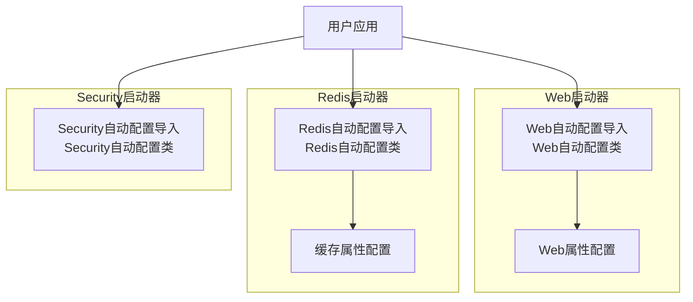
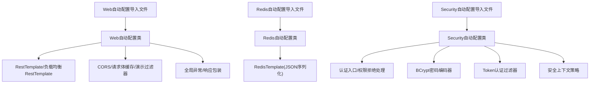
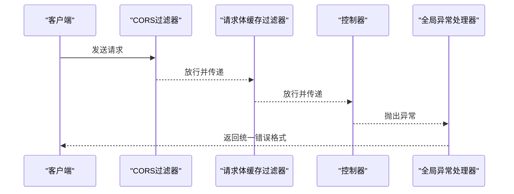
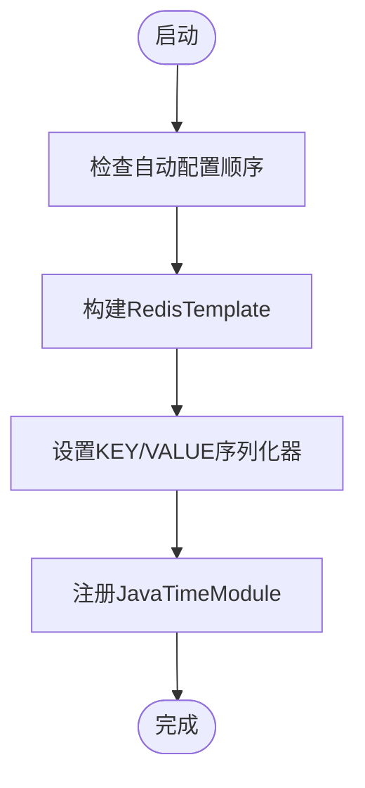
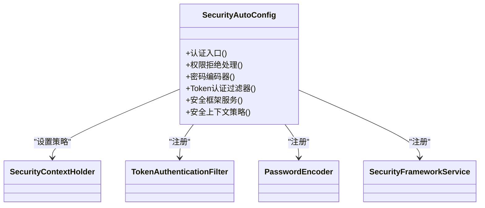
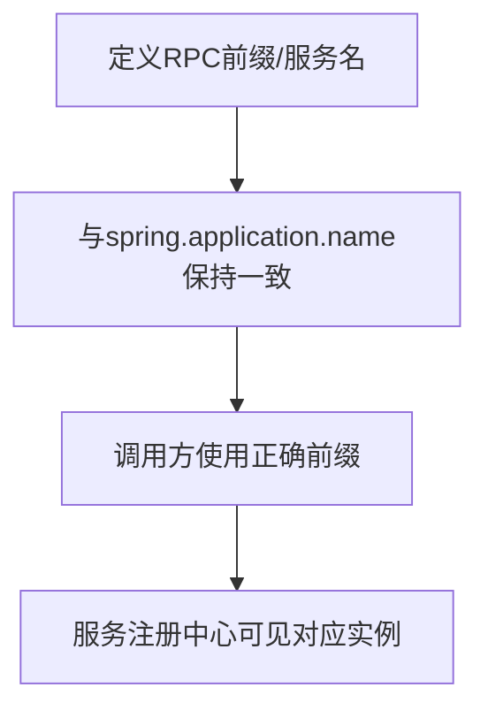
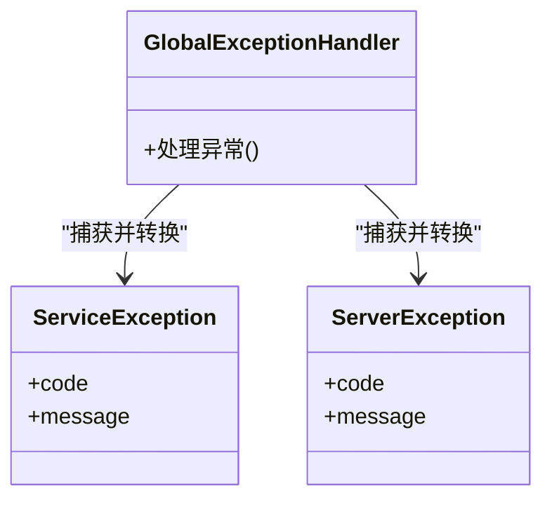
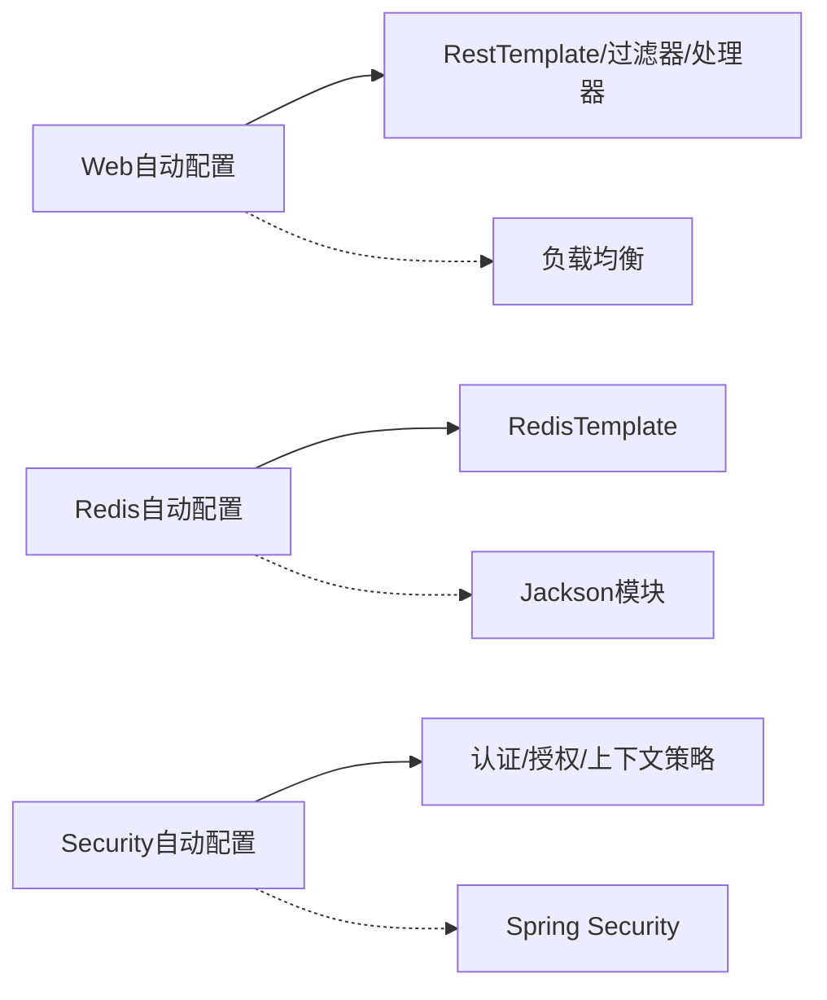

# 集成问题

<cite>
**本文引用的文件**
- [pandora-framework/pandora-spring-boot-starter-web/src/main/resources/META-INF/spring/org.springframework.boot.autoconfigure.AutoConfiguration.imports](file://pandora-framework/pandora-spring-boot-starter-web/src/main/resources/META-INF/spring/org.springframework.boot.autoconfigure.AutoConfiguration.imports)
- [pandora-framework/pandora-spring-boot-starter-redis/src/main/resources/META-INF/spring/org.springframework.boot.autoconfigure.AutoConfiguration.imports](file://pandora-framework/pandora-spring-boot-starter-redis/src/main/resources/META-INF/spring/org.springframework.boot.autoconfigure.AutoConfiguration.imports)
- [pandora-framework/pandora-spring-boot-starter-security/src/main/resources/META-INF/spring/org.springframework.boot.autoconfigure.AutoConfiguration.imports](file://pandora-framework/pandora-spring-boot-starter-security/src/main/resources/META-INF/spring/org.springframework.boot.autoconfigure.AutoConfiguration.imports)
- [pandora-framework/pandora-spring-boot-starter-web/src/main/java/net/ittimeline/pandora/framework/web/config/PandoraWebAutoConfiguration.java](file://pandora-framework/pandora-spring-boot-starter-web/src/main/java/net/ittimeline/pandora/framework/web/config/PandoraWebAutoConfiguration.java)
- [pandora-framework/pandora-spring-boot-starter-web/src/main/java/net/ittimeline/pandora/framework/web/config/WebProperties.java](file://pandora-framework/pandora-spring-boot-starter-web/src/main/java/net/ittimeline/pandora/framework/web/config/WebProperties.java)
- [pandora-framework/pandora-spring-boot-starter-redis/src/main/java/net/ittimeline/pandora/framework/redis/config/PandoraRedisAutoConfiguration.java](file://pandora-framework/pandora-spring-boot-starter-redis/src/main/java/net/ittimeline/pandora/framework/redis/config/PandoraRedisAutoConfiguration.java)
- [pandora-framework/pandora-spring-boot-starter-redis/src/main/java/net/ittimeline/pandora/framework/redis/config/PandoraCacheProperties.java](file://pandora-framework/pandora-spring-boot-starter-redis/src/main/java/net/ittimeline/pandora/framework/redis/config/PandoraCacheProperties.java)
- [pandora-framework/pandora-spring-boot-starter-security/src/main/java/net/ittimeline/pandora/framework/security/config/PandoraSecurityAutoConfiguration.java](file://pandora-framework/pandora-spring-boot-starter-security/src/main/java/net/ittimeline/pandora/framework/security/config/PandoraSecurityAutoConfiguration.java)
- [pandora-framework/pandora-common/src/main/java/net/ittimeline/pandora/framework/common/constants/RpcConstants.java](file://pandora-framework/pandora-common/src/main/java/net/ittimeline/pandora/framework/common/constants/RpcConstants.java)
- [pandora-framework/pandora-common/src/main/java/net/ittimeline/pandora/framework/common/exception/ServiceException.java](file://pandora-framework/pandora-common/src/main/java/net/ittimeline/pandora/framework/common/exception/ServiceException.java)
- [pandora-framework/pandora-common/src/main/java/net/ittimeline/pandora/framework/common/exception/ServerException.java](file://pandora-framework/pandora-common/src/main/java/net/ittimeline/pandora/framework/common/exception/ServerException.java)
- [pandora-framework/pandora-common/src/main/java/com/fhs/trans/service/AutoTransable.java](file://pandora-framework/pandora-common/src/main/java/com/fhs/trans/service/AutoTransable.java)
</cite>

## 目录
1. [简介](#简介)
2. [项目结构](#项目结构)
3. [核心组件](#核心组件)
4. [架构总览](#架构总览)
5. [详细组件分析](#详细组件分析)
6. [依赖分析](#依赖分析)
7. [性能考虑](#性能考虑)
8. [故障排除指南](#故障排除指南)
9. [结论](#结论)
10. [附录](#附录)

## 简介
本指南聚焦于Pandora Cloud框架在与Spring Cloud、数据库、缓存、消息队列等外部系统集成时常见的问题与排障路径。文档覆盖自动配置失败、依赖注入异常、服务注册发现、RPC调用失败、服务间通信异常、负载均衡问题、配置导入文件问题、版本兼容性冲突、依赖冲突等场景，并提供集成测试与联调过程中的定位技巧。

## 项目结构
Pandora Cloud以“模块化启动器”为核心，通过Spring Boot的自动配置机制按需装配Web、安全、Redis、RPC等能力。各启动器通过META-INF/spring目录下的自动配置导入文件声明其自动配置类，确保在应用启动时被正确加载。

**图表来源**
- [pandora-framework/pandora-spring-boot-starter-web/src/main/resources/META-INF/spring/org.springframework.boot.autoconfigure.AutoConfiguration.imports:1-8](file://pandora-framework/pandora-spring-boot-starter-web/src/main/resources/META-INF/spring/org.springframework.boot.autoconfigure.AutoConfiguration.imports#L1-L8)
- [pandora-framework/pandora-spring-boot-starter-redis/src/main/resources/META-INF/spring/org.springframework.boot.autoconfigure.AutoConfiguration.imports:1-2](file://pandora-framework/pandora-spring-boot-starter-redis/src/main/resources/META-INF/spring/org.springframework.boot.autoconfigure.AutoConfiguration.imports#L1-L2)
- [pandora-framework/pandora-spring-boot-starter-security/src/main/resources/META-INF/spring/org.springframework.boot.autoconfigure.AutoConfiguration.imports:1-6](file://pandora-framework/pandora-spring-boot-starter-security/src/main/resources/META-INF/spring/org.springframework.boot.autoconfigure.AutoConfiguration.imports#L1-L6)

**章节来源**
- [pandora-framework/pandora-spring-boot-starter-web/src/main/resources/META-INF/spring/org.springframework.boot.autoconfigure.AutoConfiguration.imports:1-8](file://pandora-framework/pandora-spring-boot-starter-web/src/main/resources/META-INF/spring/org.springframework.boot.autoconfigure.AutoConfiguration.imports#L1-L8)
- [pandora-framework/pandora-spring-boot-starter-redis/src/main/resources/META-INF/spring/org.springframework.boot.autoconfigure.AutoConfiguration.imports:1-2](file://pandora-framework/pandora-spring-boot-starter-redis/src/main/resources/META-INF/spring/org.springframework.boot.autoconfigure.AutoConfiguration.imports#L1-L2)
- [pandora-framework/pandora-spring-boot-starter-security/src/main/resources/META-INF/spring/org.springframework.boot.autoconfigure.AutoConfiguration.imports:1-6](file://pandora-framework/pandora-spring-boot-starter-security/src/main/resources/META-INF/spring/org.springframework.boot.autoconfigure.AutoConfiguration.imports#L1-L6)

## 核心组件
- Web自动配置与过滤链：提供跨域、请求体缓存、演示模式过滤器、全局异常处理、响应包装、RestTemplate（含负载均衡）等能力。
- Redis自动配置：定制JSON序列化的RedisTemplate，适配时间类型序列化。
- Security自动配置：提供认证入口、权限拒绝处理、密码编码器、Token认证过滤器、安全上下文策略等。
- RPC常量：定义RPC前缀、服务名及前缀，用于服务间调用约定。
- 异常模型：业务异常与服务器异常，统一错误码与消息封装。

**章节来源**
- [pandora-framework/pandora-spring-boot-starter-web/src/main/java/net/ittimeline/pandora/framework/web/config/PandoraWebAutoConfiguration.java:43-176](file://pandora-framework/pandora-spring-boot-starter-web/src/main/java/net/ittimeline/pandora/framework/web/config/PandoraWebAutoConfiguration.java#L43-L176)
- [pandora-framework/pandora-spring-boot-starter-redis/src/main/java/net/ittimeline/pandora/framework/redis/config/PandoraRedisAutoConfiguration.java:19-46](file://pandora-framework/pandora-spring-boot-starter-redis/src/main/java/net/ittimeline/pandora/framework/redis/config/PandoraRedisAutoConfiguration.java#L19-L46)
- [pandora-framework/pandora-spring-boot-starter-security/src/main/java/net/ittimeline/pandora/framework/security/config/PandoraSecurityAutoConfiguration.java:36-96](file://pandora-framework/pandora-spring-boot-starter-security/src/main/java/net/ittimeline/pandora/framework/security/config/PandoraSecurityAutoConfiguration.java#L36-L96)
- [pandora-framework/pandora-common/src/main/java/net/ittimeline/pandora/framework/common/constants/RpcConstants.java:12-41](file://pandora-framework/pandora-common/src/main/java/net/ittimeline/pandora/framework/common/constants/RpcConstants.java#L12-L41)
- [pandora-framework/pandora-common/src/main/java/net/ittimeline/pandora/framework/common/exception/ServiceException.java:13-63](file://pandora-framework/pandora-common/src/main/java/net/ittimeline/pandora/framework/common/exception/ServiceException.java#L13-L63)
- [pandora-framework/pandora-common/src/main/java/net/ittimeline/pandora/framework/common/exception/ServerException.java:14-64](file://pandora-framework/pandora-common/src/main/java/net/ittimeline/pandora/framework/common/exception/ServerException.java#L14-L64)

## 架构总览
下图展示应用启动时，Web、Redis、Security三大启动器如何通过自动配置导入文件被加载，并注册相应Bean与过滤器，形成统一的Web层、缓存层与安全层。

**图表来源**
- [pandora-framework/pandora-spring-boot-starter-web/src/main/resources/META-INF/spring/org.springframework.boot.autoconfigure.AutoConfiguration.imports:1-8](file://pandora-framework/pandora-spring-boot-starter-web/src/main/resources/META-INF/spring/org.springframework.boot.autoconfigure.AutoConfiguration.imports#L1-L8)
- [pandora-framework/pandora-spring-boot-starter-redis/src/main/resources/META-INF/spring/org.springframework.boot.autoconfigure.AutoConfiguration.imports:1-2](file://pandora-framework/pandora-spring-boot-starter-redis/src/main/resources/META-INF/spring/org.springframework.boot.autoconfigure.AutoConfiguration.imports#L1-L2)
- [pandora-framework/pandora-spring-boot-starter-security/src/main/resources/META-INF/spring/org.springframework.boot.autoconfigure.AutoConfiguration.imports:1-6](file://pandora-framework/pandora-spring-boot-starter-security/src/main/resources/META-INF/spring/org.springframework.boot.autoconfigure.AutoConfiguration.imports#L1-L6)
- [pandora-framework/pandora-spring-boot-starter-web/src/main/java/net/ittimeline/pandora/framework/web/config/PandoraWebAutoConfiguration.java:159-175](file://pandora-framework/pandora-spring-boot-starter-web/src/main/java/net/ittimeline/pandora/framework/web/config/PandoraWebAutoConfiguration.java#L159-L175)
- [pandora-framework/pandora-spring-boot-starter-redis/src/main/java/net/ittimeline/pandora/framework/redis/config/PandoraRedisAutoConfiguration.java:24-38](file://pandora-framework/pandora-spring-boot-starter-redis/src/main/java/net/ittimeline/pandora/framework/redis/config/PandoraRedisAutoConfiguration.java#L24-L38)
- [pandora-framework/pandora-spring-boot-starter-security/src/main/java/net/ittimeline/pandora/framework/security/config/PandoraSecurityAutoConfiguration.java:47-96](file://pandora-framework/pandora-spring-boot-starter-security/src/main/java/net/ittimeline/pandora/framework/security/config/PandoraSecurityAutoConfiguration.java#L47-L96)

## 详细组件分析

### Web自动配置与过滤链
- 关键点
  - 通过前置顺序避免与第三方组件（如一键改包后的RestTemplate初始化）冲突。
  - 统一API前缀，基于包路径匹配，减少暴露面。
  - 注册跨域、请求体缓存、演示模式过滤器，控制执行顺序。
  - 提供非负载均衡与负载均衡两种RestTemplate Bean，便于服务间调用。
- 排障要点
  - 若出现控制器未带前缀或路由不生效，检查WebProperties中前缀与包匹配规则。
  - 跨域不生效通常与过滤器顺序有关，确认CORS过滤器顺序是否正确。
  - 负载均衡RestTemplate需配合@EnableLoadBalancer或Spring Cloud使用，否则LB注解无效。

**图表来源**
- [pandora-framework/pandora-spring-boot-starter-web/src/main/java/net/ittimeline/pandora/framework/web/config/PandoraWebAutoConfiguration.java:116-152](file://pandora-framework/pandora-spring-boot-starter-web/src/main/java/net/ittimeline/pandora/framework/web/config/PandoraWebAutoConfiguration.java#L116-L152)
- [pandora-framework/pandora-spring-boot-starter-web/src/main/java/net/ittimeline/pandora/framework/web/config/PandoraWebAutoConfiguration.java:93-102](file://pandora-framework/pandora-spring-boot-starter-web/src/main/java/net/ittimeline/pandora/framework/web/config/PandoraWebAutoConfiguration.java#L93-L102)

**章节来源**
- [pandora-framework/pandora-spring-boot-starter-web/src/main/java/net/ittimeline/pandora/framework/web/config/PandoraWebAutoConfiguration.java:43-176](file://pandora-framework/pandora-spring-boot-starter-web/src/main/java/net/ittimeline/pandora/framework/web/config/PandoraWebAutoConfiguration.java#L43-L176)
- [pandora-framework/pandora-spring-boot-starter-web/src/main/java/net/ittimeline/pandora/framework/web/config/WebProperties.java:18-67](file://pandora-framework/pandora-spring-boot-starter-web/src/main/java/net/ittimeline/pandora/framework/web/config/WebProperties.java#L18-L67)

### Redis自动配置与缓存属性
- 关键点
  - 自定义RedisTemplate，KEY使用字符串序列化，VALUE使用JSON序列化，并注册JavaTimeModule以支持时间类型。
  - 在Redisson自动配置之前执行，确保自定义模板优先。
  - 提供缓存扫描批大小等属性，便于调优。
- 排障要点
  - 若出现反序列化异常或时间类型丢失，检查RedisTemplate序列化配置与ObjectMapper模块注册。
  - 若与其他Redis自动配置冲突，确认自动配置顺序与自定义Bean覆盖行为。

**图表来源**
- [pandora-framework/pandora-spring-boot-starter-redis/src/main/java/net/ittimeline/pandora/framework/redis/config/PandoraRedisAutoConfiguration.java:19-46](file://pandora-framework/pandora-spring-boot-starter-redis/src/main/java/net/ittimeline/pandora/framework/redis/config/PandoraRedisAutoConfiguration.java#L19-L46)
- [pandora-framework/pandora-spring-boot-starter-redis/src/main/java/net/ittimeline/pandora/framework/redis/config/PandoraCacheProperties.java:14-29](file://pandora-framework/pandora-spring-boot-starter-redis/src/main/java/net/ittimeline/pandora/framework/redis/config/PandoraCacheProperties.java#L14-L29)

**章节来源**
- [pandora-framework/pandora-spring-boot-starter-redis/src/main/java/net/ittimeline/pandora/framework/redis/config/PandoraRedisAutoConfiguration.java:19-46](file://pandora-framework/pandora-spring-boot-starter-redis/src/main/java/net/ittimeline/pandora/framework/redis/config/PandoraRedisAutoConfiguration.java#L19-L46)
- [pandora-framework/pandora-spring-boot-starter-redis/src/main/java/net/ittimeline/pandora/framework/redis/config/PandoraCacheProperties.java:14-29](file://pandora-framework/pandora-spring-boot-starter-redis/src/main/java/net/ittimeline/pandora/framework/redis/config/PandoraCacheProperties.java#L14-L29)

### Security自动配置与上下文策略
- 关键点
  - 提供认证入口、权限拒绝处理、BCrypt密码编码器、Token认证过滤器、安全框架服务。
  - 通过MethodInvokingFactoryBean设置安全上下文策略，支持线程本地上下文传递。
  - 与Web自动配置顺序相关，避免初始化阶段的委托构建器为空问题。
- 排障要点
  - 若认证/授权异常或上下文丢失，检查安全上下文策略Bean是否正确注册。
  - 若与Spring Security默认配置冲突，调整自动配置顺序或禁用冲突的默认配置。

**图表来源**
- [pandora-framework/pandora-spring-boot-starter-security/src/main/java/net/ittimeline/pandora/framework/security/config/PandoraSecurityAutoConfiguration.java:36-96](file://pandora-framework/pandora-spring-boot-starter-security/src/main/java/net/ittimeline/pandora/framework/security/config/PandoraSecurityAutoConfiguration.java#L36-L96)

**章节来源**
- [pandora-framework/pandora-spring-boot-starter-security/src/main/java/net/ittimeline/pandora/framework/security/config/PandoraSecurityAutoConfiguration.java:36-96](file://pandora-framework/pandora-spring-boot-starter-security/src/main/java/net/ittimeline/pandora/framework/security/config/PandoraSecurityAutoConfiguration.java#L36-L96)

### RPC常量与服务命名约定
- 关键点
  - 定义RPC前缀、系统服务与基础设施服务的服务名与前缀，要求与spring.application.name保持一致。
- 排障要点
  - 若RPC调用404或找不到服务，检查服务名与applicationName是否一致，以及调用前缀是否正确。

**图表来源**
- [pandora-framework/pandora-common/src/main/java/net/ittimeline/pandora/framework/common/constants/RpcConstants.java:12-41](file://pandora-framework/pandora-common/src/main/java/net/ittimeline/pandora/framework/common/constants/RpcConstants.java#L12-L41)

**章节来源**
- [pandora-framework/pandora-common/src/main/java/net/ittimeline/pandora/framework/common/constants/RpcConstants.java:12-41](file://pandora-framework/pandora-common/src/main/java/net/ittimeline/pandora/framework/common/constants/RpcConstants.java#L12-L41)

### 异常模型与统一处理
- 关键点
  - 业务异常与服务器异常分别承载业务错误码与全局错误码，便于统一返回。
  - Web自动配置提供全局异常处理器，结合异常模型输出标准化响应。
- 排障要点
  - 若返回格式不符合预期，检查全局异常处理器是否生效，以及异常模型字段是否正确填充。

**图表来源**
- [pandora-framework/pandora-common/src/main/java/net/ittimeline/pandora/framework/common/exception/ServiceException.java:13-63](file://pandora-framework/pandora-common/src/main/java/net/ittimeline/pandora/framework/common/exception/ServiceException.java#L13-L63)
- [pandora-framework/pandora-common/src/main/java/net/ittimeline/pandora/framework/common/exception/ServerException.java:14-64](file://pandora-framework/pandora-common/src/main/java/net/ittimeline/pandora/framework/common/exception/ServerException.java#L14-L64)
- [pandora-framework/pandora-spring-boot-starter-web/src/main/java/net/ittimeline/pandora/framework/web/config/PandoraWebAutoConfiguration.java:93-102](file://pandora-framework/pandora-spring-boot-starter-web/src/main/java/net/ittimeline/pandora/framework/web/config/PandoraWebAutoConfiguration.java#L93-L102)

**章节来源**
- [pandora-framework/pandora-common/src/main/java/net/ittimeline/pandora/framework/common/exception/ServiceException.java:13-63](file://pandora-framework/pandora-common/src/main/java/net/ittimeline/pandora/framework/common/exception/ServiceException.java#L13-L63)
- [pandora-framework/pandora-common/src/main/java/net/ittimeline/pandora/framework/common/exception/ServerException.java:14-64](file://pandora-framework/pandora-common/src/main/java/net/ittimeline/pandora/framework/common/exception/ServerException.java#L14-L64)
- [pandora-framework/pandora-spring-boot-starter-web/src/main/java/net/ittimeline/pandora/framework/web/config/PandoraWebAutoConfiguration.java:93-102](file://pandora-framework/pandora-spring-boot-starter-web/src/main/java/net/ittimeline/pandora/framework/web/config/PandoraWebAutoConfiguration.java#L93-L102)

## 依赖分析
- 启动器与自动配置导入
  - Web、Redis、Security启动器均通过AutoConfiguration.imports声明其自动配置类，确保被Spring Boot加载。
- 组件耦合与顺序
  - Web自动配置存在前置顺序，避免与第三方组件初始化冲突；Security自动配置设置较低顺序，优先于Spring Security默认配置。
- 外部依赖
  - Web层依赖RestTemplate与负载均衡；Redis层依赖RedisConnectionFactory与Jackson模块；Security层依赖Spring Security与加密算法。

**图表来源**
- [pandora-framework/pandora-spring-boot-starter-web/src/main/resources/META-INF/spring/org.springframework.boot.autoconfigure.AutoConfiguration.imports:1-8](file://pandora-framework/pandora-spring-boot-starter-web/src/main/resources/META-INF/spring/org.springframework.boot.autoconfigure.AutoConfiguration.imports#L1-L8)
- [pandora-framework/pandora-spring-boot-starter-redis/src/main/resources/META-INF/spring/org.springframework.boot.autoconfigure.AutoConfiguration.imports:1-2](file://pandora-framework/pandora-spring-boot-starter-redis/src/main/resources/META-INF/spring/org.springframework.boot.autoconfigure.AutoConfiguration.imports#L1-L2)
- [pandora-framework/pandora-spring-boot-starter-security/src/main/resources/META-INF/spring/org.springframework.boot.autoconfigure.AutoConfiguration.imports:1-6](file://pandora-framework/pandora-spring-boot-starter-security/src/main/resources/META-INF/spring/org.springframework.boot.autoconfigure.AutoConfiguration.imports#L1-L6)

**章节来源**
- [pandora-framework/pandora-spring-boot-starter-web/src/main/java/net/ittimeline/pandora/framework/web/config/PandoraWebAutoConfiguration.java:43-45](file://pandora-framework/pandora-spring-boot-starter-web/src/main/java/net/ittimeline/pandora/framework/web/config/PandoraWebAutoConfiguration.java#L43-L45)
- [pandora-framework/pandora-spring-boot-starter-security/src/main/java/net/ittimeline/pandora/framework/security/config/PandoraSecurityAutoConfiguration.java:36-38](file://pandora-framework/pandora-spring-boot-starter-security/src/main/java/net/ittimeline/pandora/framework/security/config/PandoraSecurityAutoConfiguration.java#L36-L38)

## 性能考虑
- Redis序列化
  - 使用JSON序列化VALUE，建议控制对象大小与层级，避免过大对象导致序列化/反序列化开销。
  - 时间类型序列化已内置，注意避免重复注册模块。
- RestTemplate
  - 负载均衡RestTemplate需配合服务发现与健康检查，避免对不可用实例发起请求。
- 过滤器链
  - 过滤器顺序影响性能与功能，建议仅启用必要过滤器，避免重复读取请求体。

[本节为通用指导，无需列出章节来源]

## 故障排除指南

### 自动配置失败
- 症状
  - 某启动器未生效，对应Bean不存在或配置未加载。
- 排查步骤
  - 检查META-INF/spring自动配置导入文件是否存在且无拼写错误。
  - 确认应用依赖了对应启动器坐标，且版本兼容。
  - 查看自动配置类是否被条件注解排除（如@ConditionalOnProperty）。
- 相关文件
  - [Web自动配置导入:1-8](file://pandora-framework/pandora-spring-boot-starter-web/src/main/resources/META-INF/spring/org.springframework.boot.autoconfigure.AutoConfiguration.imports#L1-L8)
  - [Redis自动配置导入:1-2](file://pandora-framework/pandora-spring-boot-starter-redis/src/main/resources/META-INF/spring/org.springframework.boot.autoconfigure.AutoConfiguration.imports#L1-L2)
  - [Security自动配置导入:1-6](file://pandora-framework/pandora-spring-boot-starter-security/src/main/resources/META-INF/spring/org.springframework.boot.autoconfigure.AutoConfiguration.imports#L1-L6)

**章节来源**
- [pandora-framework/pandora-spring-boot-starter-web/src/main/resources/META-INF/spring/org.springframework.boot.autoconfigure.AutoConfiguration.imports:1-8](file://pandora-framework/pandora-spring-boot-starter-web/src/main/resources/META-INF/spring/org.springframework.boot.autoconfigure.AutoConfiguration.imports#L1-L8)
- [pandora-framework/pandora-spring-boot-starter-redis/src/main/resources/META-INF/spring/org.springframework.boot.autoconfigure.AutoConfiguration.imports:1-2](file://pandora-framework/pandora-spring-boot-starter-redis/src/main/resources/META-INF/spring/org.springframework.boot.autoconfigure.AutoConfiguration.imports#L1-L2)
- [pandora-framework/pandora-spring-boot-starter-security/src/main/resources/META-INF/spring/org.springframework.boot.autoconfigure.AutoConfiguration.imports:1-6](file://pandora-framework/pandora-spring-boot-starter-security/src/main/resources/META-INF/spring/org.springframework.boot.autoconfigure.AutoConfiguration.imports#L1-L6)

### 依赖注入异常
- 症状
  - @Autowired或@Resource注入失败，提示找不到匹配Bean。
- 排查步骤
  - 确认目标Bean已被自动配置注册（如RestTemplate、RedisTemplate、Security相关Bean）。
  - 检查条件注解（@ConditionalOnMissingBean、@ConditionalOnProperty）是否导致Bean未注册。
  - 若涉及多数据源或多Redis连接，确认Bean名称唯一性与@Qualifier使用。
- 相关文件
  - [Web自动配置注册RestTemplate:159-175](file://pandora-framework/pandora-spring-boot-starter-web/src/main/java/net/ittimeline/pandora/framework/web/config/PandoraWebAutoConfiguration.java#L159-L175)
  - [Redis自动配置注册RedisTemplate:24-38](file://pandora-framework/pandora-spring-boot-starter-redis/src/main/java/net/ittimeline/pandora/framework/redis/config/PandoraRedisAutoConfiguration.java#L24-L38)
  - [Security自动配置注册Bean:47-96](file://pandora-framework/pandora-spring-boot-starter-security/src/main/java/net/ittimeline/pandora/framework/security/config/PandoraSecurityAutoConfiguration.java#L47-L96)

**章节来源**
- [pandora-framework/pandora-spring-boot-starter-web/src/main/java/net/ittimeline/pandora/framework/web/config/PandoraWebAutoConfiguration.java:159-175](file://pandora-framework/pandora-spring-boot-starter-web/src/main/java/net/ittimeline/pandora/framework/web/config/PandoraWebAutoConfiguration.java#L159-L175)
- [pandora-framework/pandora-spring-boot-starter-redis/src/main/java/net/ittimeline/pandora/framework/redis/config/PandoraRedisAutoConfiguration.java:24-38](file://pandora-framework/pandora-spring-boot-starter-redis/src/main/java/net/ittimeline/pandora/framework/redis/config/PandoraRedisAutoConfiguration.java#L24-L38)
- [pandora-framework/pandora-spring-boot-starter-security/src/main/java/net/ittimeline/pandora/framework/security/config/PandoraSecurityAutoConfiguration.java:47-96](file://pandora-framework/pandora-spring-boot-starter-security/src/main/java/net/ittimeline/pandora/framework/security/config/PandoraSecurityAutoConfiguration.java#L47-L96)

### 服务注册发现与负载均衡
- 症状
  - 调用其他服务时报错或超时，服务列表为空。
- 排查步骤
  - 确认服务名与spring.application.name一致，符合RPC常量约定。
  - 检查服务注册中心可用性与健康状态。
  - 确认使用了带@LoadBalanced的RestTemplate或Feign客户端。
- 相关文件
  - [RPC常量与服务名:12-41](file://pandora-framework/pandora-common/src/main/java/net/ittimeline/pandora/framework/common/constants/RpcConstants.java#L12-L41)
  - [Web自动配置的负载均衡RestTemplate:166-175](file://pandora-framework/pandora-spring-boot-starter-web/src/main/java/net/ittimeline/pandora/framework/web/config/PandoraWebAutoConfiguration.java#L166-L175)

**章节来源**
- [pandora-framework/pandora-common/src/main/java/net/ittimeline/pandora/framework/common/constants/RpcConstants.java:12-41](file://pandora-framework/pandora-common/src/main/java/net/ittimeline/pandora/framework/common/constants/RpcConstants.java#L12-L41)
- [pandora-framework/pandora-spring-boot-starter-web/src/main/java/net/ittimeline/pandora/framework/web/config/PandoraWebAutoConfiguration.java:166-175](file://pandora-framework/pandora-spring-boot-starter-web/src/main/java/net/ittimeline/pandora/framework/web/config/PandoraWebAutoConfiguration.java#L166-L175)

### RPC调用失败与服务间通信异常
- 症状
  - RPC接口404、500或超时。
- 排查步骤
  - 核对RPC前缀与服务名是否与服务端一致。
  - 检查全局异常处理是否拦截并返回标准错误。
  - 结合日志与追踪ID定位具体异常来源。
- 相关文件
  - [RPC常量:12-41](file://pandora-framework/pandora-common/src/main/java/net/ittimeline/pandora/framework/common/constants/RpcConstants.java#L12-L41)
  - [全局异常处理器:93-102](file://pandora-framework/pandora-spring-boot-starter-web/src/main/java/net/ittimeline/pandora/framework/web/config/PandoraWebAutoConfiguration.java#L93-L102)
  - [异常模型:13-63](file://pandora-framework/pandora-common/src/main/java/net/ittimeline/pandora/framework/common/exception/ServiceException.java#L13-L63)

**章节来源**
- [pandora-framework/pandora-common/src/main/java/net/ittimeline/pandora/framework/common/constants/RpcConstants.java:12-41](file://pandora-framework/pandora-common/src/main/java/net/ittimeline/pandora/framework/common/constants/RpcConstants.java#L12-L41)
- [pandora-framework/pandora-spring-boot-starter-web/src/main/java/net/ittimeline/pandora/framework/web/config/PandoraWebAutoConfiguration.java:93-102](file://pandora-framework/pandora-spring-boot-starter-web/src/main/java/net/ittimeline/pandora/framework/web/config/PandoraWebAutoConfiguration.java#L93-L102)
- [pandora-framework/pandora-common/src/main/java/net/ittimeline/pandora/framework/common/exception/ServiceException.java:13-63](file://pandora-framework/pandora-common/src/main/java/net/ittimeline/pandora/framework/common/exception/ServiceException.java#L13-L63)

### 配置导入文件问题
- 症状
  - 启动时找不到自动配置类或配置未生效。
- 排查步骤
  - 确认AutoConfiguration.imports文件位于正确的META-INF/spring目录。
  - 检查文件编码与换行符，避免IDE自动修改导致的路径不匹配。
  - 清理Maven/Gradle缓存并重新编译打包。
- 相关文件
  - [Web自动配置导入:1-8](file://pandora-framework/pandora-spring-boot-starter-web/src/main/resources/META-INF/spring/org.springframework.boot.autoconfigure.AutoConfiguration.imports#L1-L8)
  - [Redis自动配置导入:1-2](file://pandora-framework/pandora-spring-boot-starter-redis/src/main/resources/META-INF/spring/org.springframework.boot.autoconfigure.AutoConfiguration.imports#L1-L2)
  - [Security自动配置导入:1-6](file://pandora-framework/pandora-spring-boot-starter-security/src/main/resources/META-INF/spring/org.springframework.boot.autoconfigure.AutoConfiguration.imports#L1-L6)

**章节来源**
- [pandora-framework/pandora-spring-boot-starter-web/src/main/resources/META-INF/spring/org.springframework.boot.autoconfigure.AutoConfiguration.imports:1-8](file://pandora-framework/pandora-spring-boot-starter-web/src/main/resources/META-INF/spring/org.springframework.boot.autoconfigure.AutoConfiguration.imports#L1-L8)
- [pandora-framework/pandora-spring-boot-starter-redis/src/main/resources/META-INF/spring/org.springframework.boot.autoconfigure.AutoConfiguration.imports:1-2](file://pandora-framework/pandora-spring-boot-starter-redis/src/main/resources/META-INF/spring/org.springframework.boot.autoconfigure.AutoConfiguration.imports#L1-L2)
- [pandora-framework/pandora-spring-boot-starter-security/src/main/resources/META-INF/spring/org.springframework.boot.autoconfigure.AutoConfiguration.imports:1-6](file://pandora-framework/pandora-spring-boot-starter-security/src/main/resources/META-INF/spring/org.springframework.boot.autoconfigure.AutoConfiguration.imports#L1-L6)

### 版本兼容性与依赖冲突
- 症状
  - 启动报错或运行时行为异常，疑似版本不兼容。
- 排查步骤
  - 统一Spring Boot、Spring Cloud、Spring Security与Jackson版本。
  - 使用依赖树命令查看冲突依赖，排除传递依赖或升级到兼容版本。
  - Web自动配置中存在前置顺序，避免与第三方一键改包后的RestTemplate初始化冲突。
- 相关文件
  - [Web自动配置前置顺序:43-45](file://pandora-framework/pandora-spring-boot-starter-web/src/main/java/net/ittimeline/pandora/framework/web/config/PandoraWebAutoConfiguration.java#L43-L45)

**章节来源**
- [pandora-framework/pandora-spring-boot-starter-web/src/main/java/net/ittimeline/pandora/framework/web/config/PandoraWebAutoConfiguration.java:43-45](file://pandora-framework/pandora-spring-boot-starter-web/src/main/java/net/ittimeline/pandora/framework/web/config/PandoraWebAutoConfiguration.java#L43-L45)

### 集成测试与联调定位技巧
- 测试建议
  - 使用最小化启动器组合进行集成测试，逐步引入外部系统（注册中心、数据库、缓存）。
  - 针对RPC调用编写端到端测试，覆盖成功与异常分支。
  - 使用Mock或容器化环境模拟下游服务，验证重试、熔断与降级策略。
- 联调技巧
  - 通过全局异常处理器与统一返回模型快速定位业务异常与服务器异常。
  - 利用过滤器链顺序与WebProperties前缀配置，隔离不同模块的路由。
  - 结合RedisTemplate序列化配置与缓存属性，验证缓存读写一致性。

[本节为通用指导，无需列出章节来源]

## 结论
Pandora Cloud通过启动器与自动配置导入文件实现模块化集成，围绕Web、Redis、Security三大能力提供了完善的自动装配与排障线索。实际集成中应重点关注自动配置导入文件、Bean注册顺序、服务命名与前缀约定、序列化配置与异常统一处理等方面，结合本文提供的流程图与定位步骤，可高效解决Spring Cloud、数据库、缓存、消息队列等外部系统集成中的常见问题。

## 附录
- 相关接口与约定
  - [AutoTransable接口:18-60](file://pandora-framework/pandora-common/src/main/java/com/fhs/trans/service/AutoTransable.java#L18-L60)

**章节来源**
- [pandora-framework/pandora-common/src/main/java/com/fhs/trans/service/AutoTransable.java:18-60](file://pandora-framework/pandora-common/src/main/java/com/fhs/trans/service/AutoTransable.java#L18-L60)