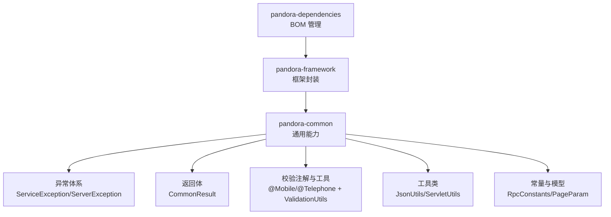
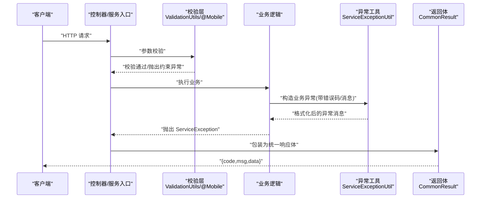
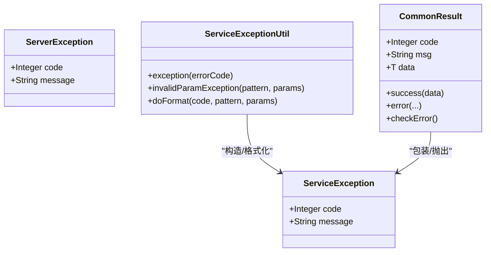
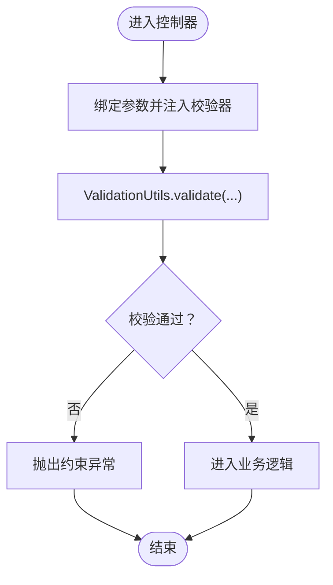
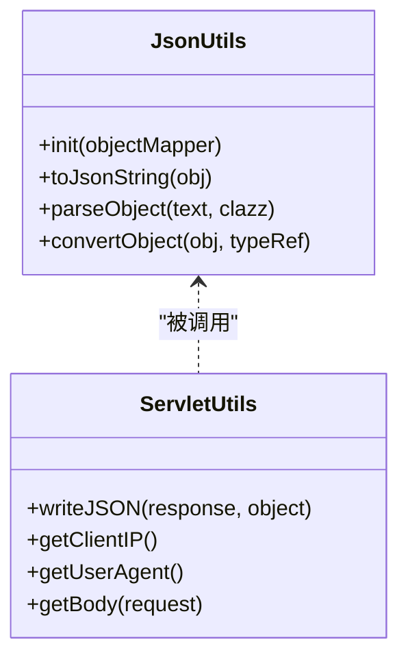
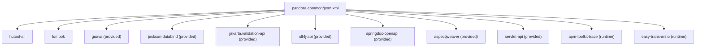

# 最佳实践

<cite>
**本文引用的文件**
- [README.md](file://README.md)
- [pandora-common/pom.xml](file://pandora-framework/pandora-common/pom.xml)
- [AutoTransable.java](file://pandora-framework/pandora-common/src/main/java/com/fhs/trans/service/AutoTransable.java)
- [ServerException.java](file://pandora-framework/pandora-common/src/main/java/net/ittimeline/pandora/framework/common/exception/ServerException.java)
- [ServiceException.java](file://pandora-framework/pandora-common/src/main/java/net/ittimeline/pandora/framework/common/exception/ServiceException.java)
- [ServiceExceptionUtil.java](file://pandora-framework/pandora-common/src/main/java/net/ittimeline/pandora/framework/common/exception/util/ServiceExceptionUtil.java)
- [CommonResult.java](file://pandora-framework/pandora-common/src/main/java/net/ittimeline/pandora/framework/common/pojo/CommonResult.java)
- [Mobile.java](file://pandora-framework/pandora-common/src/main/java/net/ittimeline/pandora/framework/common/validation/Mobile.java)
- [ValidationUtils.java](file://pandora-framework/pandora-common/src/main/java/net/ittimeline/pandora/framework/common/util/web/validation/ValidationUtils.java)
- [UserTypeEnum.java](file://pandora-framework/pandora-common/src/main/java/net/ittimeline/pandora/framework/common/enums/UserTypeEnum.java)
- [ServletUtils.java](file://pandora-framework/pandora-common/src/main/java/net/ittimeline/pandora/framework/common/util/web/servlet/ServletUtils.java)
- [JsonUtils.java](file://pandora-framework/pandora-common/src/main/java/net/ittimeline/pandora/framework/common/util/web/json/JsonUtils.java)
- [RpcConstants.java](file://pandora-framework/pandora-common/src/main/java/net/ittimeline/pandora/framework/common/constants/RpcConstants.java)
- [PageParam.java](file://pandora-framework/pandora-common/src/main/java/net/ittimeline/pandora/framework/common/pojo/PageParam.java)
</cite>

## 目录
1. [简介](#简介)
2. [项目结构](#项目结构)
3. [核心组件](#核心组件)
4. [架构总览](#架构总览)
5. [组件详解与最佳实践](#组件详解与最佳实践)
6. [依赖关系分析](#依赖关系分析)
7. [性能优化建议](#性能优化建议)
8. [安全考虑与调试技巧](#安全考虑与调试技巧)
9. [常见问题与故障排除](#常见问题与故障排除)
10. [结论](#结论)
11. [附录](#附录)

## 简介
本指南面向在微服务架构中使用 Pandora Cloud 的开发者，围绕项目结构、代码规范、开发流程、统一异常处理、工具类库与校验注解、性能与安全、调试与排障等方面，提供系统化的最佳实践。文档以仓库中的 pandora-common 模块为核心，结合实际业务场景，帮助团队在一致性、可维护性与可扩展性之间取得平衡。

## 项目结构
- 顶层模块
  - pandora-dependencies：BOM 管理依赖版本与范围
  - pandora-framework：框架封装
    - pandora-common：通用 POJO、枚举、异常、工具类与校验注解
- 本指南聚焦 pandora-common 模块，涵盖异常体系、返回体、校验注解与工具类、RPC 常量、分页参数等

图表来源
- [README.md:1-15](file://README.md#L1-L15)
- [pandora-common/pom.xml:1-101](file://pandora-framework/pandora-common/pom.xml#L1-L101)

章节来源
- [README.md:1-15](file://README.md#L1-L15)
- [pandora-common/pom.xml:1-101](file://pandora-framework/pandora-common/pom.xml#L1-L101)

## 核心组件
- 统一异常处理
  - ServiceException：业务异常，携带业务错误码与消息
  - ServerException：服务器异常，用于系统级错误
  - ServiceExceptionUtil：异常消息格式化工具，支持占位符与日志记录
  - CommonResult：统一响应体，内含 code/msg/data，并提供 isSuccess/checkError 等便捷方法
- 校验注解与工具
  - @Mobile：手机号格式校验注解
  - ValidationUtils：基于 Jakarta Validation 的校验工具，支持正则与 Bean 校验
- 工具类
  - JsonUtils：Jackson ObjectMapper 配置与常用序列化/反序列化方法
  - ServletUtils：Web 请求上下文、JSON 输出、UA/IP/请求体读取等
- 常量与模型
  - RpcConstants：RPC 接口前缀与服务名常量
  - PageParam：分页参数模型，含默认值与校验约束

章节来源
- [ServiceException.java:1-64](file://pandora-framework/pandora-common/src/main/java/net/ittimeline/pandora/framework/common/exception/ServiceException.java#L1-L64)
- [ServerException.java:1-65](file://pandora-framework/pandora-common/src/main/java/net/ittimeline/pandora/framework/common/exception/ServerException.java#L1-L65)
- [ServiceExceptionUtil.java:1-85](file://pandora-framework/pandora-common/src/main/java/net/ittimeline/pandora/framework/common/exception/util/ServiceExceptionUtil.java#L1-L85)
- [CommonResult.java:1-123](file://pandora-framework/pandora-common/src/main/java/net/ittimeline/pandora/framework/common/pojo/CommonResult.java#L1-L123)
- [Mobile.java:1-35](file://pandora-framework/pandora-common/src/main/java/net/ittimeline/pandora/framework/common/validation/Mobile.java#L1-L35)
- [ValidationUtils.java:1-56](file://pandora-framework/pandora-common/src/main/java/net/ittimeline/pandora/framework/common/util/web/validation/ValidationUtils.java#L1-L56)
- [JsonUtils.java:1-305](file://pandora-framework/pandora-common/src/main/java/net/ittimeline/pandora/framework/common/util/web/json/JsonUtils.java#L1-L305)
- [ServletUtils.java:1-105](file://pandora-framework/pandora-common/src/main/java/net/ittimeline/pandora/framework/common/util/web/servlet/ServletUtils.java#L1-L105)
- [RpcConstants.java:1-42](file://pandora-framework/pandora-common/src/main/java/net/ittimeline/pandora/framework/common/constants/RpcConstants.java#L1-L42)
- [PageParam.java:1-43](file://pandora-framework/pandora-common/src/main/java/net/ittimeline/pandora/framework/common/pojo/PageParam.java#L1-L43)

## 架构总览
下图展示了微服务中“请求—校验—业务—异常—返回”的典型链路，以及工具类在其中的作用点。

图表来源
- [ValidationUtils.java:43-54](file://pandora-framework/pandora-common/src/main/java/net/ittimeline/pandora/framework/common/util/web/validation/ValidationUtils.java#L43-L54)
- [ServiceExceptionUtil.java:22-37](file://pandora-framework/pandora-common/src/main/java/net/ittimeline/pandora/framework/common/exception/util/ServiceExceptionUtil.java#L22-L37)
- [CommonResult.java:74-89](file://pandora-framework/pandora-common/src/main/java/net/ittimeline/pandora/framework/common/pojo/CommonResult.java#L74-L89)

## 组件详解与最佳实践

### 统一异常处理机制
- 设计原则
  - 业务异常 ServiceException：由业务规则触发，携带业务错误码与可读消息
  - 服务器异常 ServerException：由系统或基础设施问题触发
  - 异常消息格式化：ServiceExceptionUtil 提供占位符与日志记录，避免 String.format 的脆弱性
  - 统一返回体：CommonResult 提供 success/error/checkError 等方法，便于链路快速判断与抛出
- 实践要点
  - 在业务层捕获异常后，优先使用 ServiceExceptionUtil 构造带参数的消息，确保国际化与可维护性
  - 控制器层统一捕获 ServiceException 并映射为 CommonResult，避免分散处理
  - 对外暴露的错误码建议集中在 ErrorCode/GlobalErrorCodeConstants 中定义，便于治理

图表来源
- [ServiceException.java:13-64](file://pandora-framework/pandora-common/src/main/java/net/ittimeline/pandora/framework/common/exception/ServiceException.java#L13-L64)
- [ServerException.java:14-65](file://pandora-framework/pandora-common/src/main/java/net/ittimeline/pandora/framework/common/exception/ServerException.java#L14-L65)
- [ServiceExceptionUtil.java:18-85](file://pandora-framework/pandora-common/src/main/java/net/ittimeline/pandora/framework/common/exception/util/ServiceExceptionUtil.java#L18-L85)
- [CommonResult.java:21-123](file://pandora-framework/pandora-common/src/main/java/net/ittimeline/pandora/framework/common/pojo/CommonResult.java#L21-L123)

章节来源
- [ServiceException.java:1-64](file://pandora-framework/pandora-common/src/main/java/net/ittimeline/pandora/framework/common/exception/ServiceException.java#L1-L64)
- [ServerException.java:1-65](file://pandora-framework/pandora-common/src/main/java/net/ittimeline/pandora/framework/common/exception/ServerException.java#L1-L65)
- [ServiceExceptionUtil.java:1-85](file://pandora-framework/pandora-common/src/main/java/net/ittimeline/pandora/framework/common/exception/util/ServiceExceptionUtil.java#L1-L85)
- [CommonResult.java:1-123](file://pandora-framework/pandora-common/src/main/java/net/ittimeline/pandora/framework/common/pojo/CommonResult.java#L1-L123)

### 校验注解与工具类
- 注解
  - @Mobile：对手机号字段进行格式校验，默认消息可覆盖
  - @Telephone：预留电话号码校验注解（如需）
- 工具类
  - ValidationUtils：提供正则校验与 Bean 校验入口，统一抛出 ConstraintViolationException
- 实践要点
  - 在 DTO/参数类上使用 Jakarta Validation 注解进行声明式校验
  - 在控制器层调用 ValidationUtils.validate 或直接使用 Spring 的校验机制
  - 对复杂校验场景，可在自定义注解的校验器中复用 ValidationUtils 的正则能力

图表来源
- [ValidationUtils.java:43-54](file://pandora-framework/pandora-common/src/main/java/net/ittimeline/pandora/framework/common/util/web/validation/ValidationUtils.java#L43-L54)
- [Mobile.java:24-35](file://pandora-framework/pandora-common/src/main/java/net/ittimeline/pandora/framework/common/validation/Mobile.java#L24-L35)

章节来源
- [Mobile.java:1-35](file://pandora-framework/pandora-common/src/main/java/net/ittimeline/pandora/framework/common/validation/Mobile.java#L1-L35)
- [ValidationUtils.java:1-56](file://pandora-framework/pandora-common/src/main/java/net/ittimeline/pandora/framework/common/util/web/validation/ValidationUtils.java#L1-L56)

### 工具类库与 JSON 处理
- JsonUtils
  - ObjectMapper 初始化与配置（忽略空值、时间模块注册、序列化特性）
  - 提供多种 parse/convert 方法，兼顾性能与易用性
- ServletUtils
  - 统一输出 JSON、获取 UA/IP、读取请求体、获取请求上下文
- 实践要点
  - 优先使用 JsonUtils.toJsonString/parseObject，避免重复初始化 ObjectMapper
  - 在 Web 场景统一通过 ServletUtils.writeJSON 输出响应，确保字符集一致
  - 对于大对象序列化，注意避免不必要的字段序列化，减少网络开销

图表来源
- [JsonUtils.java:33-305](file://pandora-framework/pandora-common/src/main/java/net/ittimeline/pandora/framework/common/util/web/json/JsonUtils.java#L33-L305)
- [ServletUtils.java:22-105](file://pandora-framework/pandora-common/src/main/java/net/ittimeline/pandora/framework/common/util/web/servlet/ServletUtils.java#L22-L105)

章节来源
- [JsonUtils.java:1-305](file://pandora-framework/pandora-common/src/main/java/net/ittimeline/pandora/framework/common/util/web/json/JsonUtils.java#L1-L305)
- [ServletUtils.java:1-105](file://pandora-framework/pandora-common/src/main/java/net/ittimeline/pandora/framework/common/util/web/servlet/ServletUtils.java#L1-L105)

### 分页参数与 RPC 常量
- PageParam
  - 默认页码与页大小、最大页大小限制、不分页标记
- RpcConstants
  - RPC 接口前缀、服务名与前缀常量
- 实践要点
  - 导出等场景使用 PAGE_SIZE_NONE 实现不分页
  - RPC 接口统一使用 RPC_API_PREFIX 与各服务前缀，便于网关与路由治理

章节来源
- [PageParam.java:1-43](file://pandora-framework/pandora-common/src/main/java/net/ittimeline/pandora/framework/common/pojo/PageParam.java#L1-L43)
- [RpcConstants.java:1-42](file://pandora-framework/pandora-common/src/main/java/net/ittimeline/pandora/framework/common/constants/RpcConstants.java#L1-L42)

### 自动翻译接口 AutoTransable
- 作用
  - 为 VO 翻译提供统一查询接口，支持按主键、批量 ID 查询与全量查询
- 实践要点
  - 在模块 API 层复用 AutoTransable，避免重复实现查询逻辑
  - 与 VO 翻译框架配合，提升数据展示的一致性与性能

章节来源
- [AutoTransable.java:1-61](file://pandora-framework/pandora-common/src/main/java/com/fhs/trans/service/AutoTransable.java#L1-L61)

## 依赖关系分析
- 依赖范围策略
  - provided：如 Guava、Jackson、Validation API、Servlet API、AspectJ、OpenAPI 等，仅在工具类使用时生效，避免对业务模块造成额外依赖
  - runtime：如 SkyWalking Toolkit、easy-trans-anno 等，用于监控与翻译能力
- 依赖耦合度
  - pandora-common 作为通用模块，尽量保持低耦合，通过工具类与注解对外提供能力
  - 业务模块仅依赖 pandora-common 的公开 API，避免直接依赖第三方库

图表来源
- [pandora-common/pom.xml:26-98](file://pandora-framework/pandora-common/pom.xml#L26-L98)

章节来源
- [pandora-common/pom.xml:1-101](file://pandora-framework/pandora-common/pom.xml#L1-L101)

## 性能优化建议
- JSON 处理
  - 使用 JsonUtils 的 ObjectMapper 配置，避免重复初始化；对大对象序列化时利用 NON_NULL 与时间模块，减少冗余字段与格式转换开销
  - 优先使用 convertObject/convertList 避免中间字符串序列化
- 校验与异常
  - 在控制器层集中校验，减少无效调用；异常消息格式化采用 ServiceExceptionUtil 的预分配策略，避免频繁扩容
- Web 输出
  - 统一通过 ServletUtils.writeJSON 输出，确保 UTF-8 与 JSON 媒体类型，避免二次编码导致的性能与乱码问题
- 分页与 RPC
  - 合理设置 PageParam 的最大页大小，防止超大数据量查询；RPC 接口统一前缀，便于缓存与限流策略落地

章节来源
- [JsonUtils.java:33-305](file://pandora-framework/pandora-common/src/main/java/net/ittimeline/pandora/framework/common/util/web/json/JsonUtils.java#L33-L305)
- [ServiceExceptionUtil.java:49-82](file://pandora-framework/pandora-common/src/main/java/net/ittimeline/pandora/framework/common/exception/util/ServiceExceptionUtil.java#L49-L82)
- [ServletUtils.java:22-105](file://pandora-framework/pandora-common/src/main/java/net/ittimeline/pandora/framework/common/util/web/servlet/ServletUtils.java#L22-L105)
- [PageParam.java:18-43](file://pandora-framework/pandora-common/src/main/java/net/ittimeline/pandora/framework/common/pojo/PageParam.java#L18-L43)
- [RpcConstants.java:12-42](file://pandora-framework/pandora-common/src/main/java/net/ittimeline/pandora/framework/common/constants/RpcConstants.java#L12-L42)

## 安全考虑与调试技巧
- 安全
  - 输入校验：优先使用 @Mobile/@Telephone 与 ValidationUtils 的正则校验，避免 SQL 注入与命令注入
  - 日志与脱敏：异常消息格式化时避免泄露敏感信息；统一通过 ServiceExceptionUtil 输出用户可读提示
  - IP/UA：通过 ServletUtils 获取客户端 IP 与 UA，便于审计与风控
- 调试
  - 统一响应体：使用 CommonResult.isSuccess/checkError 快速定位错误分支
  - 异常链路：在业务层捕获 ServiceException 并记录上下文，最终统一包装为 CommonResult
  - JSON 解析：遇到解析异常时，优先查看 JsonUtils 的日志输出，确认输入格式与字段类型

章节来源
- [ValidationUtils.java:21-56](file://pandora-framework/pandora-common/src/main/java/net/ittimeline/pandora/framework/common/util/web/validation/ValidationUtils.java#L21-L56)
- [ServletUtils.java:22-105](file://pandora-framework/pandora-common/src/main/java/net/ittimeline/pandora/framework/common/util/web/servlet/ServletUtils.java#L22-L105)
- [CommonResult.java:74-123](file://pandora-framework/pandora-common/src/main/java/net/ittimeline/pandora/framework/common/pojo/CommonResult.java#L74-L123)
- [JsonUtils.java:75-102](file://pandora-framework/pandora-common/src/main/java/net/ittimeline/pandora/framework/common/util/web/json/JsonUtils.java#L75-L102)

## 常见问题与故障排除
- 参数过多/过少导致消息格式化异常
  - 现象：日志记录参数过多或过少，返回消息不完整
  - 处理：核对占位符数量与传入参数数量；使用 ServiceExceptionUtil.doFormat 的返回值进行兜底
- JSON 解析失败
  - 现象：parseObject 抛出运行时异常
  - 处理：使用 parseObjectQuietly 进行静默解析；检查输入文本是否为合法 JSON
- 控制器未捕获校验异常
  - 现象：ConstraintViolationException 未被统一处理
  - 处理：在全局异常处理器中捕获并转换为 CommonResult
- 导出接口不分页
  - 现象：分页参数无效或性能问题
  - 处理：使用 PageParam.PAGE_SIZE_NONE 实现不分页导出，同时控制单次导出量

章节来源
- [ServiceExceptionUtil.java:49-82](file://pandora-framework/pandora-common/src/main/java/net/ittimeline/pandora/framework/common/exception/util/ServiceExceptionUtil.java#L49-L82)
- [JsonUtils.java:172-196](file://pandora-framework/pandora-common/src/main/java/net/ittimeline/pandora/framework/common/util/web/json/JsonUtils.java#L172-L196)
- [PageParam.java:20-43](file://pandora-framework/pandora-common/src/main/java/net/ittimeline/pandora/framework/common/pojo/PageParam.java#L20-L43)

## 结论
通过统一异常处理、标准化返回体、强健的校验注解与工具类、合理的 JSON/Servlet 处理策略，以及清晰的分页与 RPC 常量约定，Pandora Cloud 为微服务提供了高内聚、低耦合的通用能力。遵循本文最佳实践，可显著提升开发效率、系统稳定性与可维护性。

## 附录
- 项目模块概览
  - pandora-dependencies：统一依赖版本与范围
  - pandora-framework/pandora-common：通用能力与工具库
- 关键文件清单
  - 异常与返回体：ServiceException、ServerException、ServiceExceptionUtil、CommonResult
  - 校验：@Mobile、ValidationUtils
  - 工具：JsonUtils、ServletUtils
  - 常量与模型：RpcConstants、PageParam
  - 自动翻译：AutoTransable

章节来源
- [README.md:1-15](file://README.md#L1-L15)
- [pandora-common/pom.xml:1-101](file://pandora-framework/pandora-common/pom.xml#L1-L101)