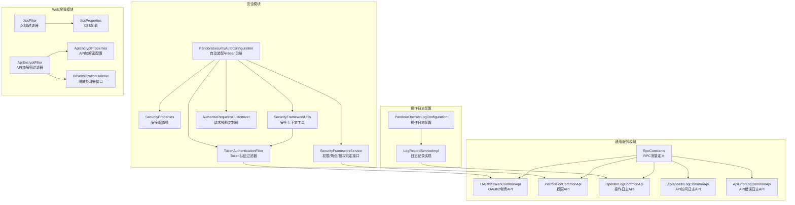
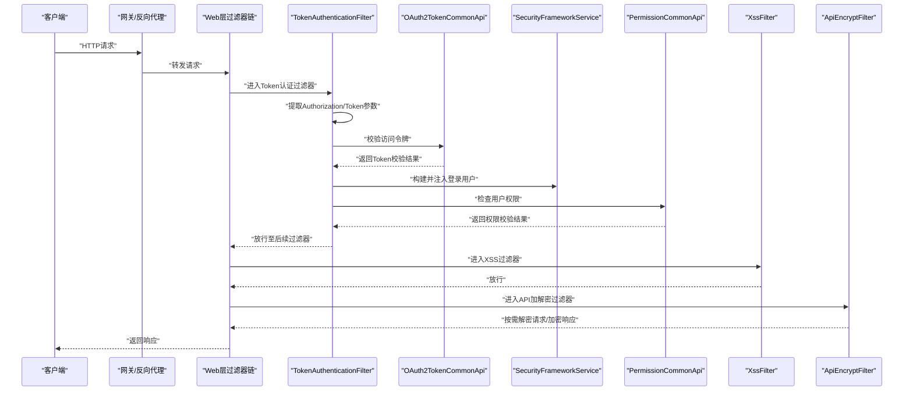
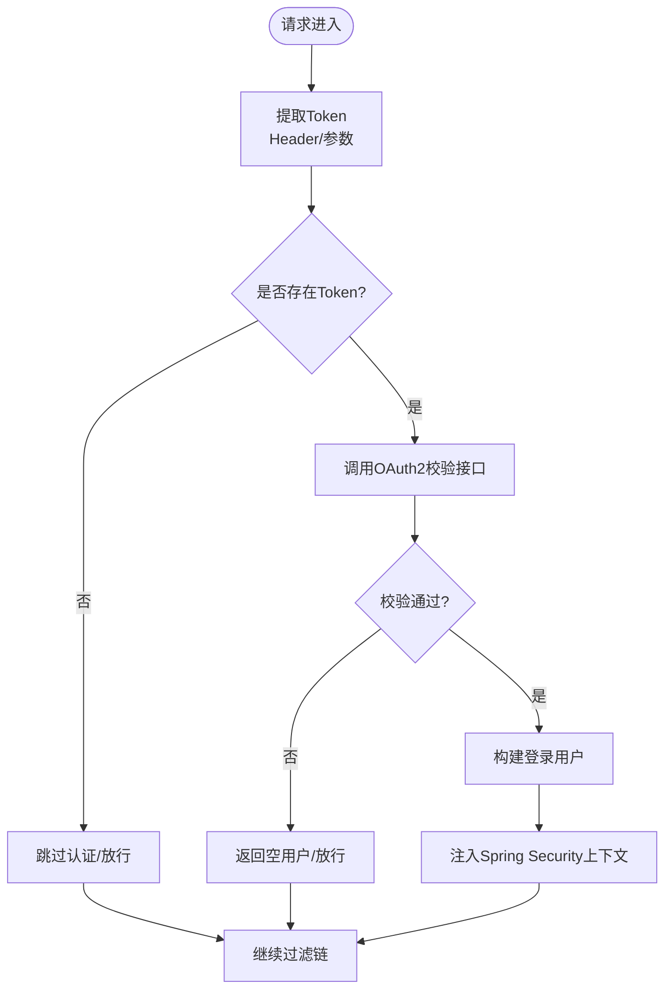
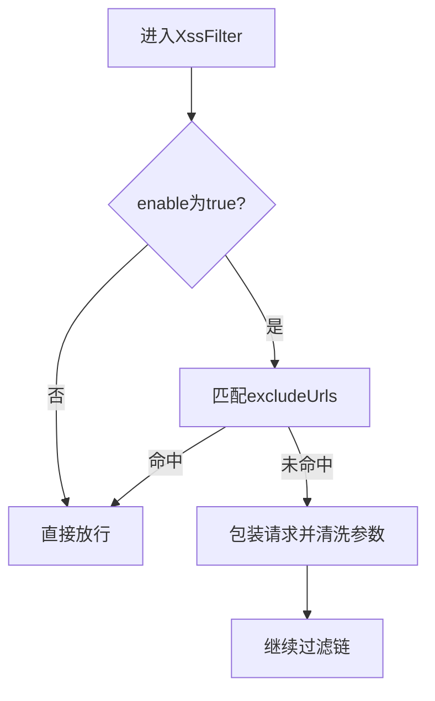
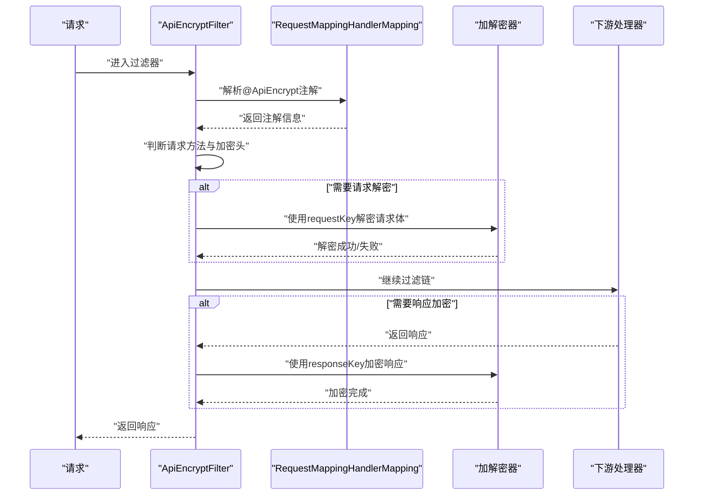
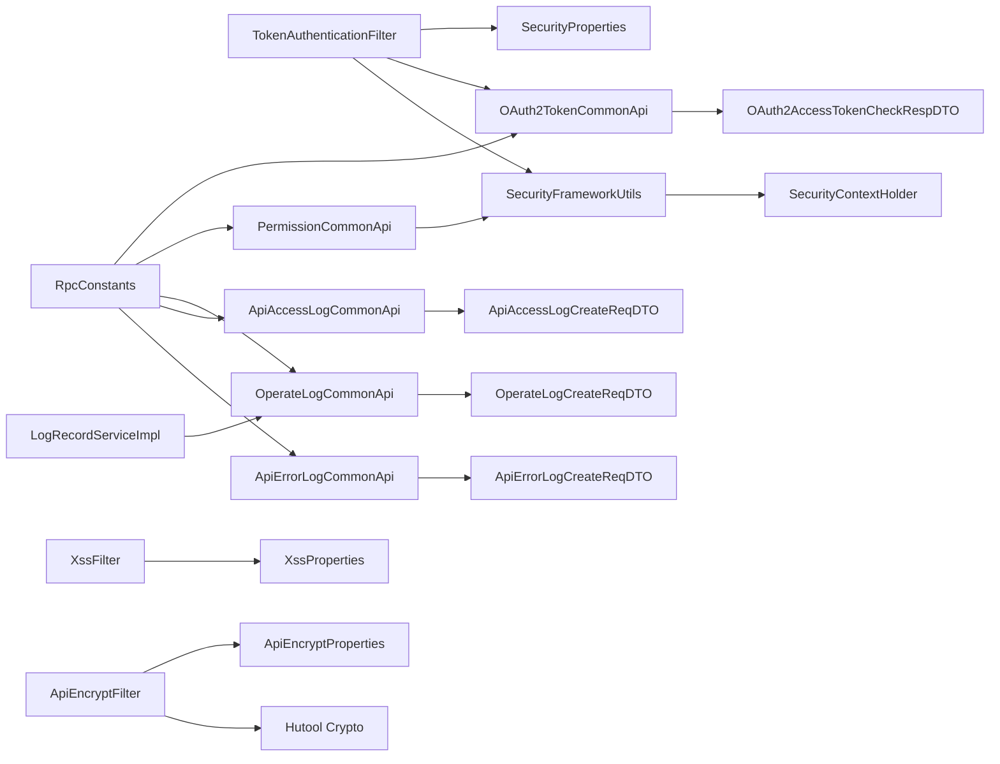

# 安全实践

<cite>
**本文引用的文件**
- [PandoraSecurityAutoConfiguration.java](file://pandora-framework/pandora-spring-boot-starter-security/src/main/java/net/ittimeline/pandora/framework/security/config/PandoraSecurityAutoConfiguration.java)
- [SecurityProperties.java](file://pandora-framework/pandora-spring-boot-starter-security/src/main/java/net/ittimeline/pandora/framework/security/config/SecurityProperties.java)
- [TokenAuthenticationFilter.java](file://pandora-framework/pandora-spring-boot-starter-security/src/main/java/net/ittimeline/pandora/framework/security/core/filter/TokenAuthenticationFilter.java)
- [SecurityFrameworkService.java](file://pandora-framework/pandora-spring-boot-starter-security/src/main/java/net/ittimeline/pandora/framework/security/core/service/SecurityFrameworkService.java)
- [SecurityFrameworkUtils.java](file://pandora-framework/pandora-spring-boot-starter-security/src/main/java/net/ittimeline/pandora/framework/security/core/util/SecurityFrameworkUtils.java)
- [OAuth2TokenCommonApi.java](file://pandora-framework/pandora-common/src/main/java/net/ittimeline/pandora/framework/common/biz/system/oauth2/OAuth2TokenCommonApi.java)
- [OAuth2AccessTokenCheckRespDTO.java](file://pandora-framework/pandora-common/src/main/java/net/ittimeline/pandora/framework/common/biz/system/oauth2/dto/OAuth2AccessTokenCheckRespDTO.java)
- [PermissionCommonApi.java](file://pandora-framework/pandora-common/src/main/java/net/ittimeline/pandora/framework/common/biz/system/permission/PermissionCommonApi.java)
- [OperateLogCommonApi.java](file://pandora-framework/pandora-common/src/main/java/net/ittimeline/pandora/framework/common/biz/system/logger/OperateLogCommonApi.java)
- [ApiAccessLogCommonApi.java](file://pandora-framework/pandora-common/src/main/java/net/ittimeline/pandora/framework/common/biz/infra/logger/ApiAccessLogCommonApi.java)
- [ApiErrorLogCommonApi.java](file://pandora-framework/pandora-common/src/main/java/net/ittimeline/pandora/framework/common/biz/infra/logger/ApiErrorLogCommonApi.java)
- [OperateLogCreateReqDTO.java](file://pandora-framework/pandora-common/src/main/java/net/ittimeline/pandora/framework/common/biz/system/logger/dto/OperateLogCreateReqDTO.java)
- [ApiAccessLogCreateReqDTO.java](file://pandora-framework/pandora-common/src/main/java/net/ittimeline/pandora/framework/common/biz/infra/logger/dto/ApiAccessLogCreateReqDTO.java)
- [ApiErrorLogCreateReqDTO.java](file://pandora-framework/pandora-common/src/main/java/net/ittimeline/pandora/framework/common/biz/infra/logger/dto/ApiErrorLogCreateReqDTO.java)
- [RpcConstants.java](file://pandora-framework/pandora-common/src/main/java/net/ittimeline/pandora/framework/common/constants/RpcConstants.java)
- [PandoraOperateLogConfiguration.java](file://pandora-framework/pandora-spring-boot-starter-security/src/main/java/net/ittimeline/pandora/framework/operatelog/config/PandoraOperateLogConfiguration.java)
- [LogRecordServiceImpl.java](file://pandora-framework/pandora-spring-boot-starter-security/src/main/java/net/ittimeline/pandora/framework/operatelog/core/service/LogRecordServiceImpl.java)
- [XssProperties.java](file://pandora-framework/pandora-spring-boot-starter-web/src/main/java/net/ittimeline/pandora/framework/xss/config/XssProperties.java)
- [XssFilter.java](file://pandora-framework/pandora-spring-boot-starter-web/src/main/java/net/ittimeline/pandora/framework/xss/core/filter/XssFilter.java)
- [ApiEncryptProperties.java](file://pandora-framework/pandora-spring-boot-starter-web/src/main/java/net/ittimeline/pandora/framework/encrypt/config/ApiEncryptProperties.java)
- [ApiEncryptFilter.java](file://pandora-framework/pandora-spring-boot-starter-web/src/main/java/net/ittimeline/pandora/framework/encrypt/core/filter/ApiEncryptFilter.java)
- [DesensitizationHandler.java](file://pandora-framework/pandora-spring-boot-starter-web/src/main/java/net/ittimeline/pandora/framework/desensitize/core/base/handler/DesensitizationHandler.java)
</cite>

## 更新摘要
**所做更改**
- 新增企业级安全实践指南章节，涵盖令牌管理、权限控制、操作日志等最佳实践
- 扩展OAuth2.0认证与Token管理章节，增加令牌校验响应DTO说明
- 新增权限控制最佳实践章节，详细说明权限API的使用方法
- 新增操作日志与安全审计章节，介绍日志记录的完整流程
- 更新安全漏洞扫描与渗透测试章节，增加企业级安全实践建议
- 完善生产环境安全加固建议，增加合规性要求说明

## 目录
1. [简介](#简介)
2. [项目结构](#项目结构)
3. [核心组件](#核心组件)
4. [架构总览](#架构总览)
5. [详细组件分析](#详细组件分析)
6. [企业级安全实践指南](#企业级安全实践指南)
7. [依赖分析](#依赖分析)
8. [性能考虑](#性能考虑)
9. [故障排查指南](#故障排查指南)
10. [结论](#结论)
11. [附录](#附录)

## 简介
本指南面向Pandora Cloud框架的企业级安全实践，聚焦以下主题：
- OAuth2.0认证与Token管理策略
- 权限控制最佳实践
- XSS防护机制配置与使用
- API加密过滤器配置与加解密流程
- 数据脱敏的实施方法
- 密码安全存储、会话管理、CSRF防护与输入验证
- 敏感数据保护、日志脱敏与安全审计
- 操作日志记录与追踪机制
- 安全漏洞扫描、渗透测试与安全事件响应流程
- 生产环境安全加固与合规性要求

## 项目结构
围绕安全相关能力，Pandora Cloud在多个模块中提供了关键能力：
- 安全模块（Spring Security集成与Token认证）
- 通用服务模块（OAuth2、权限、日志记录）
- Web增强模块（XSS防护、API加解密、数据脱敏）

**图表来源**
- [PandoraSecurityAutoConfiguration.java:1-99](file://pandora-framework/pandora-spring-boot-starter-security/src/main/java/net/ittimeline/pandora/framework/security/config/PandoraSecurityAutoConfiguration.java#L1-L99)
- [OAuth2TokenCommonApi.java:1-34](file://pandora-framework/pandora-common/src/main/java/net/ittimeline/pandora/framework/common/biz/system/oauth2/OAuth2TokenCommonApi.java#L1-L34)
- [PermissionCommonApi.java:1-46](file://pandora-framework/pandora-common/src/main/java/net/ittimeline/pandora/framework/common/biz/system/permission/PermissionCommonApi.java#L1-L46)
- [OperateLogCommonApi.java:1-41](file://pandora-framework/pandora-common/src/main/java/net/ittimeline/pandora/framework/common/biz/system/logger/OperateLogCommonApi.java#L1-L41)
- [ApiAccessLogCommonApi.java:1-40](file://pandora-framework/pandora-common/src/main/java/net/ittimeline/pandora/framework/common/biz/infra/logger/ApiAccessLogCommonApi.java#L1-L40)
- [ApiErrorLogCommonApi.java:1-41](file://pandora-framework/pandora-common/src/main/java/net/ittimeline/pandora/framework/common/biz/infra/logger/ApiErrorLogCommonApi.java#L1-L41)
- [PandoraOperateLogConfiguration.java:1-28](file://pandora-framework/pandora-spring-boot-starter-security/src/main/java/net/ittimeline/pandora/framework/operatelog/config/PandoraOperateLogConfiguration.java#L1-L28)
- [LogRecordServiceImpl.java:1-94](file://pandora-framework/pandora-spring-boot-starter-security/src/main/java/net/ittimeline/pandora/framework/operatelog/core/service/LogRecordServiceImpl.java#L1-L94)

**章节来源**
- [PandoraSecurityAutoConfiguration.java:1-99](file://pandora-framework/pandora-spring-boot-starter-security/src/main/java/net/ittimeline/pandora/framework/security/config/PandoraSecurityAutoConfiguration.java#L1-L99)
- [OAuth2TokenCommonApi.java:1-34](file://pandora-framework/pandora-common/src/main/java/net/ittimeline/pandora/framework/common/biz/system/oauth2/OAuth2TokenCommonApi.java#L1-L34)
- [PermissionCommonApi.java:1-46](file://pandora-framework/pandora-common/src/main/java/net/ittimeline/pandora/framework/common/biz/system/permission/PermissionCommonApi.java#L1-L46)
- [OperateLogCommonApi.java:1-41](file://pandora-framework/pandora-common/src/main/java/net/ittimeline/pandora/framework/common/biz/system/logger/OperateLogCommonApi.java#L1-L41)
- [ApiAccessLogCommonApi.java:1-40](file://pandora-framework/pandora-common/src/main/java/net/ittimeline/pandora/framework/common/biz/infra/logger/ApiAccessLogCommonApi.java#L1-L40)
- [ApiErrorLogCommonApi.java:1-41](file://pandora-framework/pandora-common/src/main/java/net/ittimeline/pandora/framework/common/biz/infra/logger/ApiErrorLogCommonApi.java#L1-L41)
- [PandoraOperateLogConfiguration.java:1-28](file://pandora-framework/pandora-spring-boot-starter-security/src/main/java/net/ittimeline/pandora/framework/operatelog/config/PandoraOperateLogConfiguration.java#L1-L28)
- [LogRecordServiceImpl.java:1-94](file://pandora-framework/pandora-spring-boot-starter-security/src/main/java/net/ittimeline/pandora/framework/operatelog/core/service/LogRecordServiceImpl.java#L1-L94)

## 核心组件
- 安全自动装配与Bean注册：负责注册认证入口点、权限不足处理器、BCrypt密码编码器、Token认证过滤器、安全框架服务以及线程本地上下文策略。
- 安全配置项：定义Token请求头、参数名、免登录URL列表、Mock模式开关与密钥、密码编码复杂度等。
- Token认证过滤器：从请求头或参数提取Token，调用OAuth2校验接口构建登录用户，注入Spring Security上下文；支持基于Header透传的登录用户与Mock登录。
- 安全上下文工具：提供从请求提取Token、获取当前认证信息与用户、设置登录用户、跨租户权限跳过判断等。
- 权限判定接口：统一抽象权限、角色、授权范围的判定方法，供业务层调用。
- OAuth2令牌API：提供令牌校验功能，返回用户信息、租户信息、授权范围等。
- 权限API：提供权限与角色的校验接口，支持批量权限检查。
- 操作日志API：记录用户操作行为，包含用户信息、操作模块、业务编号、操作内容等。
- API访问日志API：记录API调用的详细信息，包括请求参数、响应结果、执行时长等。
- API错误日志API：记录API调用过程中的异常信息，便于问题追踪与分析。
- 操作日志配置：集成LogRecord框架，提供统一的操作日志记录机制。
- XSS配置与过滤器：支持全局开关、排除URL列表，对请求参数进行清洗。
- API加解密配置与过滤器：支持对称/AES与非对称/RSA加解密，按接口注解启用请求解密与响应加密。
- 脱敏处理器接口：定义脱敏逻辑与禁用表达式，支撑多种脱敏策略。

**章节来源**
- [PandoraSecurityAutoConfiguration.java:36-98](file://pandora-framework/pandora-spring-boot-starter-security/src/main/java/net/ittimeline/pandora/framework/security/config/PandoraSecurityAutoConfiguration.java#L36-L98)
- [SecurityProperties.java:22-57](file://pandora-framework/pandora-spring-boot-starter-security/src/main/java/net/ittimeline/pandora/framework/security/config/SecurityProperties.java#L22-L57)
- [TokenAuthenticationFilter.java:47-157](file://pandora-framework/pandora-spring-boot-starter-security/src/main/java/net/ittimeline/pandora/framework/security/core/filter/TokenAuthenticationFilter.java#L47-L157)
- [SecurityFrameworkUtils.java:44-163](file://pandora-framework/pandora-spring-boot-starter-security/src/main/java/net/ittimeline/pandora/framework/security/core/util/SecurityFrameworkUtils.java#L44-L163)
- [SecurityFrameworkService.java:10-60](file://pandora-framework/pandora-spring-boot-starter-security/src/main/java/net/ittimeline/pandora/framework/security/core/service/SecurityFrameworkService.java#L10-L60)
- [OAuth2TokenCommonApi.java:20-34](file://pandora-framework/pandora-common/src/main/java/net/ittimeline/pandora/framework/common/biz/system/oauth2/OAuth2TokenCommonApi.java#L20-L34)
- [PermissionCommonApi.java:20-46](file://pandora-framework/pandora-common/src/main/java/net/ittimeline/pandora/framework/common/biz/system/permission/PermissionCommonApi.java#L20-L46)
- [OperateLogCommonApi.java:21-41](file://pandora-framework/pandora-common/src/main/java/net/ittimeline/pandora/framework/common/biz/system/logger/OperateLogCommonApi.java#L21-L41)
- [ApiAccessLogCommonApi.java:21-40](file://pandora-framework/pandora-common/src/main/java/net/ittimeline/pandora/framework/common/biz/infra/logger/ApiAccessLogCommonApi.java#L21-L40)
- [ApiErrorLogCommonApi.java:21-41](file://pandora-framework/pandora-common/src/main/java/net/ittimeline/pandora/framework/common/biz/infra/logger/ApiErrorLogCommonApi.java#L21-L41)
- [PandoraOperateLogConfiguration.java:18-27](file://pandora-framework/pandora-spring-boot-starter-security/src/main/java/net/ittimeline/pandora/framework/operatelog/config/PandoraOperateLogConfiguration.java#L18-L27)
- [LogRecordServiceImpl.java:26-94](file://pandora-framework/pandora-spring-boot-starter-security/src/main/java/net/ittimeline/pandora/framework/operatelog/core/service/LogRecordServiceImpl.java#L26-L94)

## 架构总览
下图展示从请求进入系统到完成认证与鉴权的关键路径，以及与XSS、API加解密、脱敏的关系。

**图表来源**
- [TokenAuthenticationFilter.java:47-107](file://pandora-framework/pandora-spring-boot-starter-security/src/main/java/net/ittimeline/pandora/framework/security/core/filter/TokenAuthenticationFilter.java#L47-L107)
- [SecurityFrameworkUtils.java:125-136](file://pandora-framework/pandora-spring-boot-starter-security/src/main/java/net/ittimeline/pandora/framework/security/core/util/SecurityFrameworkUtils.java#L125-L136)
- [OAuth2TokenCommonApi.java:27-30](file://pandora-framework/pandora-common/src/main/java/net/ittimeline/pandora/framework/common/biz/system/oauth2/OAuth2TokenCommonApi.java#L27-L30)
- [PermissionCommonApi.java:26-42](file://pandora-framework/pandora-common/src/main/java/net/ittimeline/pandora/framework/common/biz/system/permission/PermissionCommonApi.java#L26-L42)
- [XssFilter.java:36-52](file://pandora-framework/pandora-spring-boot-starter-web/src/main/java/net/ittimeline/pandora/framework/xss/core/filter/XssFilter.java#L36-L52)
- [ApiEncryptFilter.java:78-121](file://pandora-framework/pandora-spring-boot-starter-web/src/main/java/net/ittimeline/pandora/framework/encrypt/core/filter/ApiEncryptFilter.java#L78-L121)

## 详细组件分析

### OAuth2.0认证与Token管理
- 认证入口与上下文策略
  - 自动装配注册认证失败入口点、权限不足入口点、BCrypt密码编码器、Token认证过滤器、安全框架服务与线程本地上下文策略。
  - 线程本地上下文策略确保跨线程传递安全上下文，提升分布式场景下的安全性与一致性。
- Token提取与认证
  - 优先从请求头提取，其次从查询参数提取；支持"Bearer "前缀去除。
  - 调用OAuth2校验接口获取Token校验结果，构建登录用户对象并注入Spring Security上下文。
  - 支持Header透传登录用户与Mock登录（开发调试），生产务必关闭Mock。
- 令牌校验响应
  - 返回包含用户ID、用户类型、用户信息、租户ID、授权范围、过期时间等关键信息。
  - 用于业务层进行权限控制与用户信息获取。

**图表来源**
- [TokenAuthenticationFilter.java:47-107](file://pandora-framework/pandora-spring-boot-starter-security/src/main/java/net/ittimeline/pandora/framework/security/core/filter/TokenAuthenticationFilter.java#L47-L107)
- [SecurityFrameworkUtils.java:44-57](file://pandora-framework/pandora-spring-boot-starter-security/src/main/java/net/ittimeline/pandora/framework/security/core/util/SecurityFrameworkUtils.java#L44-L57)
- [SecurityFrameworkUtils.java:125-136](file://pandora-framework/pandora-spring-boot-starter-security/src/main/java/net/ittimeline/pandora/framework/security/core/util/SecurityFrameworkUtils.java#L125-L136)
- [OAuth2AccessTokenCheckRespDTO.java:20-39](file://pandora-framework/pandora-common/src/main/java/net/ittimeline/pandora/framework/common/biz/system/oauth2/dto/OAuth2AccessTokenCheckRespDTO.java#L20-L39)

**章节来源**
- [PandoraSecurityAutoConfiguration.java:47-96](file://pandora-framework/pandora-spring-boot-starter-security/src/main/java/net/ittimeline/pandora/framework/security/config/PandoraSecurityAutoConfiguration.java#L47-L96)
- [SecurityProperties.java:22-46](file://pandora-framework/pandora-spring-boot-starter-security/src/main/java/net/ittimeline/pandora/framework/security/config/SecurityProperties.java#L22-L46)
- [TokenAuthenticationFilter.java:47-131](file://pandora-framework/pandora-spring-boot-starter-security/src/main/java/net/ittimeline/pandora/framework/security/core/filter/TokenAuthenticationFilter.java#L47-L131)
- [SecurityFrameworkUtils.java:44-136](file://pandora-framework/pandora-spring-boot-starter-security/src/main/java/net/ittimeline/pandora/framework/security/core/util/SecurityFrameworkUtils.java#L44-L136)
- [SecurityFrameworkService.java:10-60](file://pandora-framework/pandora-spring-boot-starter-security/src/main/java/net/ittimeline/pandora/framework/security/core/service/SecurityFrameworkService.java#L10-L60)
- [OAuth2TokenCommonApi.java:27-30](file://pandora-framework/pandora-common/src/main/java/net/ittimeline/pandora/framework/common/biz/system/oauth2/OAuth2TokenCommonApi.java#L27-L30)
- [OAuth2AccessTokenCheckRespDTO.java:18-39](file://pandora-framework/pandora-common/src/main/java/net/ittimeline/pandora/framework/common/biz/system/oauth2/dto/OAuth2AccessTokenCheckRespDTO.java#L18-L39)

### 权限控制最佳实践
- 统一接口：通过SecurityFrameworkService提供的hasPermission/hasRole/hasScope及其"任一"变体，实现权限/角色/授权范围的判定。
- 权限API使用：通过PermissionCommonApi的hasAnyPermissions和hasAnyRoles方法，支持批量权限检查，提高系统性能。
- 跨租户场景：当访问租户与当前租户不一致时，自动跳过权限校验，避免误判。
- 免登录URL：通过配置免登录URL列表，减少对公开接口的认证负担。
- 权限细化：支持基于用户ID、权限字符串数组、角色数组的灵活权限控制。

**章节来源**
- [SecurityFrameworkService.java:10-60](file://pandora-framework/pandora-spring-boot-starter-security/src/main/java/net/ittimeline/pandora/framework/security/core/service/SecurityFrameworkService.java#L10-L60)
- [SecurityFrameworkUtils.java:151-161](file://pandora-framework/pandora-spring-boot-starter-security/src/main/java/net/ittimeline/pandora/framework/security/core/util/SecurityFrameworkUtils.java#L151-L161)
- [SecurityProperties.java:51](file://pandora-framework/pandora-spring-boot-starter-security/src/main/java/net/ittimeline/pandora/framework/security/config/SecurityProperties.java#L51)
- [PermissionCommonApi.java:26-42](file://pandora-framework/pandora-common/src/main/java/net/ittimeline/pandora/framework/common/biz/system/permission/PermissionCommonApi.java#L26-L42)

### XSS防护机制
- 配置项
  - enable：全局开关，默认开启。
  - excludeUrls：排除URL列表，支持通配符匹配。
- 工作原理
  - 过滤器在请求进入时包装请求对象，对参数进行清洗；若关闭或命中排除规则则直接放行。

**图表来源**
- [XssFilter.java:36-52](file://pandora-framework/pandora-spring-boot-starter-web/src/main/java/net/ittimeline/pandora/framework/xss/core/filter/XssFilter.java#L36-L52)
- [XssProperties.java:24-28](file://pandora-framework/pandora-spring-boot-starter-web/src/main/java/net/ittimeline/pandora/framework/xss/config/XssProperties.java#L24-L28)

**章节来源**
- [XssProperties.java:16-30](file://pandora-framework/pandora-spring-boot-starter-web/src/main/java/net/ittimeline/pandora/framework/xss/config/XssProperties.java#L16-L30)
- [XssFilter.java:22-55](file://pandora-framework/pandora-spring-boot-starter-web/src/main/java/net/ittimeline/pandora/framework/xss/core/filter/XssFilter.java#L22-L55)

### API加密过滤器
- 配置项
  - enable：是否开启API加解密。
  - header：加解密标识请求头名称。
  - algorithm：对称（如AES）或非对称（如RSA）算法。
  - requestKey/responseKey：请求解密密钥/响应加密密钥（对称与非对称含义不同）。
- 工作流程
  - 仅对POST/PUT/DELETE进行请求解密；通过注解控制响应加密。
  - 若请求携带加密头则解密请求体；若接口声明启用请求解密但未携带加密头则返回参数无效错误。
  - 响应加密在过滤器链结束后执行，确保能读取完整响应内容。

**图表来源**
- [ApiEncryptFilter.java:78-121](file://pandora-framework/pandora-spring-boot-starter-web/src/main/java/net/ittimeline/pandora/framework/encrypt/core/filter/ApiEncryptFilter.java#L78-L121)
- [ApiEncryptProperties.java:24-70](file://pandora-framework/pandora-spring-boot-starter-web/src/main/java/net/ittimeline/pandora/framework/encrypt/config/ApiEncryptProperties.java#L24-L70)

**章节来源**
- [ApiEncryptProperties.java:16-73](file://pandora-framework/pandora-spring-boot-starter-web/src/main/java/net/ittimeline/pandora/framework/encrypt/config/ApiEncryptProperties.java#L16-L73)
- [ApiEncryptFilter.java:39-158](file://pandora-framework/pandora-spring-boot-starter-web/src/main/java/net/ittimeline/pandora/framework/encrypt/core/filter/ApiEncryptFilter.java#L39-L158)

### 数据脱敏
- 处理器接口
  - 定义脱敏方法与禁用表达式（默认读取enable/disable属性）。
- 实施要点
  - 通过注解驱动的方式在序列化阶段对敏感字段进行脱敏。
  - 可结合Spring EL表达式动态控制脱敏开关，便于灰度与回滚。

**章节来源**
- [DesensitizationHandler.java:14-41](file://pandora-framework/pandora-spring-boot-starter-web/src/main/java/net/ittimeline/pandora/framework/desensitize/core/base/handler/DesensitizationHandler.java#L14-L41)

### 密码安全存储、会话管理、CSRF防护与输入验证
- 密码安全存储
  - 使用BCryptPasswordEncoder进行密码哈希存储，支持配置编码复杂度。
- 会话管理
  - 采用无状态Token模型，不依赖服务器端会话；通过线程本地上下文策略保障跨线程传递。
- CSRF防护
  - 由于采用Token无状态认证，天然规避CSRF风险；如需额外防护，可在前端侧配合SameSite Cookie与Token刷新策略。
- 输入验证
  - 结合Spring Validation与框架内置校验工具，对入参与业务参数进行严格校验。

**章节来源**
- [PandoraSecurityAutoConfiguration.java:66-69](file://pandora-framework/pandora-spring-boot-starter-security/src/main/java/net/ittimeline/pandora/framework/security/config/PandoraSecurityAutoConfiguration.java#L66-L69)
- [PandoraSecurityAutoConfiguration.java:90-96](file://pandora-framework/pandora-spring-boot-starter-security/src/main/java/net/ittimeline/pandora/framework/security/config/PandoraSecurityAutoConfiguration.java#L90-L96)
- [SecurityProperties.java:55-56](file://pandora-framework/pandora-spring-boot-starter-security/src/main/java/net/ittimeline/pandora/framework/security/config/SecurityProperties.java#L55-L56)

## 企业级安全实践指南

### 令牌管理最佳实践
- 令牌生命周期管理
  - 设置合理的过期时间，建议使用短有效期令牌配合刷新令牌机制。
  - 实施令牌撤销机制，支持管理员主动撤销特定用户的令牌。
  - 监控令牌使用情况，建立异常使用检测告警。
- 令牌安全存储
  - 前端使用HttpOnly Cookie存储令牌，避免JavaScript访问。
  - 后端使用内存或Redis存储令牌，设置合适的过期时间。
  - 令牌传输过程中使用HTTPS加密，防止中间人攻击。
- 令牌刷新策略
  - 实施双令牌机制：访问令牌短期有效，刷新令牌长期有效但权限较低。
  - 刷新令牌单独存储和传输，定期轮换刷新令牌。
  - 建立令牌刷新的审计日志，监控异常刷新行为。

### 权限控制深度实践
- 最小权限原则
  - 为每个用户分配完成工作所需的最小权限集合。
  - 定期审查和清理不再使用的权限，避免权限累积。
  - 实施权限继承机制，通过角色组合实现灵活的权限管理。
- 动态权限控制
  - 支持基于时间、地点、设备等上下文信息的动态权限决策。
  - 实施权限缓存机制，提高权限检查性能。
  - 建立权限变更的实时同步机制，确保多节点权限一致性。
- 权限审计与监控
  - 记录所有权限变更操作，包括添加、删除、修改权限。
  - 监控异常权限使用行为，如越权访问、权限滥用等。
  - 定期生成权限使用报告，评估权限策略的有效性。

### 操作日志与安全审计
- 日志记录策略
  - 记录所有关键操作，包括用户登录、权限变更、数据修改等。
  - 实施分级日志策略，重要操作强制记录，一般操作按比例记录。
  - 确保日志的完整性、不可否认性和可追溯性。
- 日志内容规范
  - 操作日志包含用户信息、操作类型、业务数据、时间戳、IP地址等。
  - 访问日志记录请求参数、响应结果、执行时长、错误信息等。
  - 错误日志包含异常堆栈、根因分析、影响范围等详细信息。
- 日志存储与检索
  - 实施日志分层存储，热数据存储在高性能介质，冷数据归档到低成本存储。
  - 建立日志检索和分析平台，支持全文检索和统计分析。
  - 设置日志保留期限，平衡合规要求和存储成本。

### 安全事件响应机制
- 事件分类与分级
  - 按照影响程度分为轻微、一般、严重、特别严重四个级别。
  - 建立事件响应团队，明确各级别响应时间和责任人。
  - 制定标准化的事件响应流程和处置标准。
- 快速响应与处置
  - 建立7×24小时监控和响应机制，确保及时发现和处置安全事件。
  - 实施自动化响应措施，如IP封禁、访问限制、服务降级等。
  - 做好事件取证和溯源，保留完整的证据链。
- 事后分析与改进
  - 进行事件复盘，分析根本原因和暴露的问题。
  - 制定改进措施，完善安全策略和技术防护。
  - 更新应急预案，提升整体安全防护水平。

### 生产环境安全加固
- 网络安全加固
  - 实施网络分段和隔离，限制横向移动。
  - 部署WAF和入侵检测系统，实时监控和阻断攻击。
  - 配置防火墙规则，只开放必要的端口和服务。
- 应用安全加固
  - 启用所有可用的安全防护措施，包括CSP、HSTS、X-Frame-Options等。
  - 实施API限流和熔断机制，防止DDoS和滥用攻击。
  - 定期进行安全扫描和渗透测试，及时发现和修复漏洞。
- 数据安全保护
  - 对敏感数据进行分类分级，实施差异化保护。
  - 建立数据备份和恢复机制，确保业务连续性。
  - 实施数据脱敏和匿名化处理，保护个人隐私信息。

### 合规性要求与标准
- 法律法规遵循
  - 遵循《网络安全法》、《数据安全法》、《个人信息保护法》等相关法律法规。
  - 满足行业监管要求，如金融行业的PCI DSS、银行业的监管要求等。
  - 建立合规管理体系，定期进行合规性评估和审计。
- 安全标准符合
  - 符合ISO 27001信息安全管理体系标准。
  - 达到等级保护三级要求，满足关键信息基础设施保护标准。
  - 实施零信任安全架构，建立持续的安全监控和评估机制。
- 文档与培训
  - 建立完善的安全管理制度和操作规程。
  - 定期开展安全意识培训和技能提升培训。
  - 编写和维护安全相关的技术文档和操作手册。

**章节来源**
- [PandoraOperateLogConfiguration.java:18-27](file://pandora-framework/pandora-spring-boot-starter-security/src/main/java/net/ittimeline/pandora/framework/operatelog/config/PandoraOperateLogConfiguration.java#L18-L27)
- [LogRecordServiceImpl.java:32-50](file://pandora-framework/pandora-spring-boot-starter-security/src/main/java/net/ittimeline/pandora/framework/operatelog/core/service/LogRecordServiceImpl.java#L32-L50)
- [OperateLogCreateReqDTO.java:15-57](file://pandora-framework/pandora-common/src/main/java/net/ittimeline/pandora/framework/common/biz/system/logger/dto/OperateLogCreateReqDTO.java#L15-L57)
- [ApiAccessLogCreateReqDTO.java:15-105](file://pandora-framework/pandora-common/src/main/java/net/ittimeline/pandora/framework/common/biz/infra/logger/dto/ApiAccessLogCreateReqDTO.java#L15-L105)
- [ApiErrorLogCreateReqDTO.java:16-73](file://pandora-framework/pandora-common/src/main/java/net/ittimeline/pandora/framework/common/biz/infra/logger/dto/ApiErrorLogCreateReqDTO.java#L16-L73)

## 依赖分析
- 组件内聚与耦合
  - TokenAuthenticationFilter依赖SecurityProperties、GlobalExceptionHandler与OAuth2TokenCommonApi，职责清晰。
  - SecurityFrameworkUtils与SecurityFrameworkService形成"工具+接口"的协作，降低上层耦合。
  - OAuth2TokenCommonApi、PermissionCommonApi、OperateLogCommonApi等RPC接口通过RpcConstants统一管理服务名和前缀。
  - LogRecordServiceImpl通过OperateLogCommonApi实现操作日志记录，支持异步处理。
  - XSS与API加解密过滤器均通过配置类与工具类解耦，便于独立启用/禁用与扩展。
- 外部依赖
  - 加解密依赖Hutool Crypto；XSS依赖Jsoup清理器；Spring Security上下文策略可替换为线程本地实现。
  - LogRecord框架提供统一的日志记录接口，支持多种存储后端。

**图表来源**
- [TokenAuthenticationFilter.java:41-45](file://pandora-framework/pandora-spring-boot-starter-security/src/main/java/net/ittimeline/pandora/framework/security/core/filter/TokenAuthenticationFilter.java#L41-L45)
- [OAuth2TokenCommonApi.java:20-30](file://pandora-framework/pandora-common/src/main/java/net/ittimeline/pandora/framework/common/biz/system/oauth2/OAuth2TokenCommonApi.java#L20-L30)
- [OAuth2AccessTokenCheckRespDTO.java:18-39](file://pandora-framework/pandora-common/src/main/java/net/ittimeline/pandora/framework/common/biz/system/oauth2/dto/OAuth2AccessTokenCheckRespDTO.java#L18-L39)
- [PermissionCommonApi.java:20-42](file://pandora-framework/pandora-common/src/main/java/net/ittimeline/pandora/framework/common/biz/system/permission/PermissionCommonApi.java#L20-L42)
- [OperateLogCommonApi.java:21-39](file://pandora-framework/pandora-common/src/main/java/net/ittimeline/pandora/framework/common/biz/system/logger/OperateLogCommonApi.java#L21-L39)
- [OperateLogCreateReqDTO.java:15-57](file://pandora-framework/pandora-common/src/main/java/net/ittimeline/pandora/framework/common/biz/system/logger/dto/OperateLogCreateReqDTO.java#L15-L57)
- [ApiAccessLogCommonApi.java:21-39](file://pandora-framework/pandora-common/src/main/java/net/ittimeline/pandora/framework/common/biz/infra/logger/ApiAccessLogCommonApi.java#L21-L39)
- [ApiAccessLogCreateReqDTO.java:15-105](file://pandora-framework/pandora-common/src/main/java/net/ittimeline/pandora/framework/common/biz/infra/logger/dto/ApiAccessLogCreateReqDTO.java#L15-L105)
- [ApiErrorLogCommonApi.java:21-39](file://pandora-framework/pandora-common/src/main/java/net/ittimeline/pandora/framework/common/biz/infra/logger/ApiErrorLogCommonApi.java#L21-L39)
- [ApiErrorLogCreateReqDTO.java:16-73](file://pandora-framework/pandora-common/src/main/java/net/ittimeline/pandora/framework/common/biz/infra/logger/dto/ApiErrorLogCreateReqDTO.java#L16-L73)
- [RpcConstants.java:12-41](file://pandora-framework/pandora-common/src/main/java/net/ittimeline/pandora/framework/common/constants/RpcConstants.java#L12-L41)
- [XssFilter.java:28-34](file://pandora-framework/pandora-spring-boot-starter-web/src/main/java/net/ittimeline/pandora/framework/xss/core/filter/XssFilter.java#L28-L34)
- [ApiEncryptFilter.java:48-52](file://pandora-framework/pandora-spring-boot-starter-web/src/main/java/net/ittimeline/pandora/framework/encrypt/core/filter/ApiEncryptFilter.java#L48-L52)

**章节来源**
- [TokenAuthenticationFilter.java:41-45](file://pandora-framework/pandora-spring-boot-starter-security/src/main/java/net/ittimeline/pandora/framework/security/core/filter/TokenAuthenticationFilter.java#L41-L45)
- [OAuth2TokenCommonApi.java:20-30](file://pandora-framework/pandora-common/src/main/java/net/ittimeline/pandora/framework/common/biz/system/oauth2/OAuth2TokenCommonApi.java#L20-L30)
- [PermissionCommonApi.java:20-42](file://pandora-framework/pandora-common/src/main/java/net/ittimeline/pandora/framework/common/biz/system/permission/PermissionCommonApi.java#L20-L42)
- [OperateLogCommonApi.java:21-39](file://pandora-framework/pandora-common/src/main/java/net/ittimeline/pandora/framework/common/biz/system/logger/OperateLogCommonApi.java#L21-L39)
- [ApiAccessLogCommonApi.java:21-39](file://pandora-framework/pandora-common/src/main/java/net/ittimeline/pandora/framework/common/biz/infra/logger/ApiAccessLogCommonApi.java#L21-L39)
- [ApiErrorLogCommonApi.java:21-39](file://pandora-framework/pandora-common/src/main/java/net/ittimeline/pandora/framework/common/biz/infra/logger/ApiErrorLogCommonApi.java#L21-L39)
- [RpcConstants.java:12-41](file://pandora-framework/pandora-common/src/main/java/net/ittimeline/pandora/framework/common/constants/RpcConstants.java#L12-L41)
- [XssFilter.java:28-34](file://pandora-framework/pandora-spring-boot-starter-web/src/main/java/net/ittimeline/pandora/framework/xss/core/filter/XssFilter.java#L28-L34)
- [ApiEncryptFilter.java:48-52](file://pandora-framework/pandora-spring-boot-starter-web/src/main/java/net/ittimeline/pandora/framework/encrypt/core/filter/ApiEncryptFilter.java#L48-L52)

## 性能考虑
- Token校验与上下文注入
  - 将Token校验与上下文注入放在过滤器链前端，避免重复计算；合理设置免登录URL，减少不必要的认证。
  - 实施Token缓存机制，减少频繁的远程令牌校验调用。
- 加解密性能
  - 对称加密（如AES）性能优于非对称加密（如RSA），高频接口建议对称加密；注意密钥长度与算法选择。
  - 实施加解密结果缓存，对于相同输入的重复加解密操作可直接复用结果。
- XSS与脱敏
  - 在排除列表中精准配置白名单，避免对静态资源与公开接口重复处理。
  - 实施脱敏策略的延迟加载，仅在需要序列化时才进行脱敏处理。
- 日志性能优化
  - 操作日志采用异步记录，避免阻塞主业务流程。
  - 实施日志缓冲和批量写入，减少IO操作次数。
  - 设置日志级别和采样率，平衡日志完整性和系统性能。

## 故障排查指南
- Token认证失败
  - 检查请求头与参数名配置是否一致；确认"Bearer "前缀处理逻辑；核对OAuth2校验接口返回。
  - 验证令牌格式是否正确，是否过期，是否被撤销。
  - 检查系统时间同步，确保令牌过期时间计算准确。
- Mock登录未生效
  - 确认mockEnable为true且token以mockSecret开头；生产环境务必关闭。
  - 检查Mock模式的配置优先级，确保不会被其他配置覆盖。
- XSS未生效
  - 检查enable开关与excludeUrls配置；确认过滤器顺序在日志之前。
  - 验证Jsoup版本兼容性，确保清理规则正确应用。
- API加解密异常
  - 确认@ApiOperation注解与请求方法匹配；核对加密头与密钥配置；查看全局异常处理器返回的错误信息。
  - 检查加解密算法兼容性，确保请求方和响应方使用相同的算法。
- 权限控制失效
  - 验证PermissionCommonApi的调用是否正确，检查用户权限缓存是否过期。
  - 确认权限检查的上下文环境，确保在正确的线程和安全上下文中执行。
- 日志记录异常
  - 检查OperateLogCommonApi的调用是否成功，确认异步日志记录的配置。
  - 验证日志数据的格式和大小，确保符合API要求。

**章节来源**
- [TokenAuthenticationFilter.java:57-74](file://pandora-framework/pandora-spring-boot-starter-security/src/main/java/net/ittimeline/pandora/framework/security/core/filter/TokenAuthenticationFilter.java#L57-L74)
- [TokenAuthenticationFilter.java:119-131](file://pandora-framework/pandora-spring-boot-starter-security/src/main/java/net/ittimeline/pandora/framework/security/core/filter/TokenAuthenticationFilter.java#L119-L131)
- [OAuth2TokenCommonApi.java:27-30](file://pandora-framework/pandora-common/src/main/java/net/ittimeline/pandora/framework/common/biz/system/oauth2/OAuth2TokenCommonApi.java#L27-L30)
- [PermissionCommonApi.java:26-42](file://pandora-framework/pandora-common/src/main/java/net/ittimeline/pandora/framework/common/biz/system/permission/PermissionCommonApi.java#L26-L42)
- [XssFilter.java:43-52](file://pandora-framework/pandora-spring-boot-starter-web/src/main/java/net/ittimeline/pandora/framework/xss/core/filter/XssFilter.java#L43-L52)
- [ApiEncryptFilter.java:95-107](file://pandora-framework/pandora-spring-boot-starter-web/src/main/java/net/ittimeline/pandora/framework/encrypt/core/filter/ApiEncryptFilter.java#L95-L107)
- [OperateLogCommonApi.java:35-39](file://pandora-framework/pandora-common/src/main/java/net/ittimeline/pandora/framework/common/biz/system/logger/OperateLogCommonApi.java#L35-L39)

## 结论
Pandora Cloud框架通过无状态Token认证、统一权限判定接口、XSS防护、API加解密与数据脱敏等能力，构建了完整的安全体系。新增的企业级安全实践指南进一步强化了系统的安全防护能力，包括：

- **令牌管理**：通过合理的令牌生命周期管理、安全存储和刷新策略，确保身份认证的安全性。
- **权限控制**：实施最小权限原则、动态权限控制和完善的权限审计机制，提供细粒度的访问控制。
- **操作日志**：建立全面的日志记录策略，包括操作日志、访问日志和错误日志，支持完整的安全审计。
- **安全事件响应**：制定标准化的事件分类、分级和响应流程，提升安全事件的处置效率。
- **生产环境加固**：提供网络、应用、数据等全方位的安全加固建议，确保生产环境的安全稳定。

建议在生产环境中：
- 关闭Mock模式，严格启用免登录白名单
- 对高频接口采用对称加密，对关键接口采用非对称加密
- 强化输入验证与日志脱敏，完善安全审计
- 建立持续的安全扫描与渗透测试机制，制定安全事件响应预案
- 遵循相关法律法规和行业标准，确保合规性要求

## 附录
- 配置清单（示例）
  - 安全配置：Token请求头、参数名、免登录URL、Mock开关与密钥、密码编码复杂度
  - XSS配置：enable、excludeUrls
  - API加解密：enable、header、algorithm、requestKey、responseKey
  - 操作日志：日志记录策略、存储配置、检索方式
  - 权限控制：权限API使用、权限缓存、审计配置

**章节来源**
- [SecurityProperties.java:22-57](file://pandora-framework/pandora-spring-boot-starter-security/src/main/java/net/ittimeline/pandora/framework/security/config/SecurityProperties.java#L22-L57)
- [XssProperties.java:24-28](file://pandora-framework/pandora-spring-boot-starter-web/src/main/java/net/ittimeline/pandora/framework/xss/config/XssProperties.java#L24-L28)
- [ApiEncryptProperties.java:24-70](file://pandora-framework/pandora-spring-boot-starter-web/src/main/java/net/ittimeline/pandora/framework/encrypt/config/ApiEncryptProperties.java#L24-L70)
- [PandoraOperateLogConfiguration.java:18-27](file://pandora-framework/pandora-spring-boot-starter-security/src/main/java/net/ittimeline/pandora/framework/operatelog/config/PandoraOperateLogConfiguration.java#L18-L27)
- [LogRecordServiceImpl.java:32-50](file://pandora-framework/pandora-spring-boot-starter-security/src/main/java/net/ittimeline/pandora/framework/operatelog/core/service/LogRecordServiceImpl.java#L32-L50)