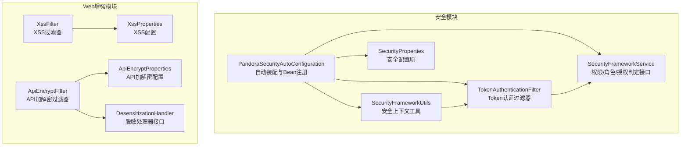
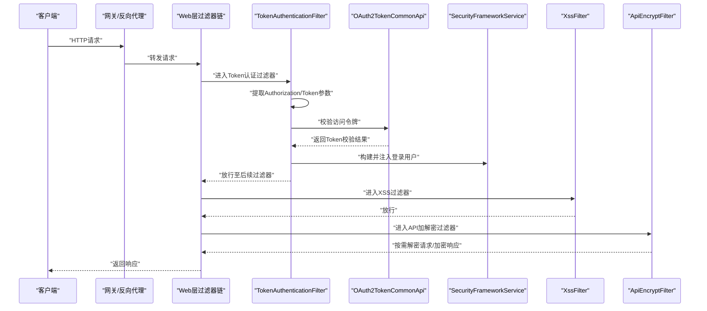
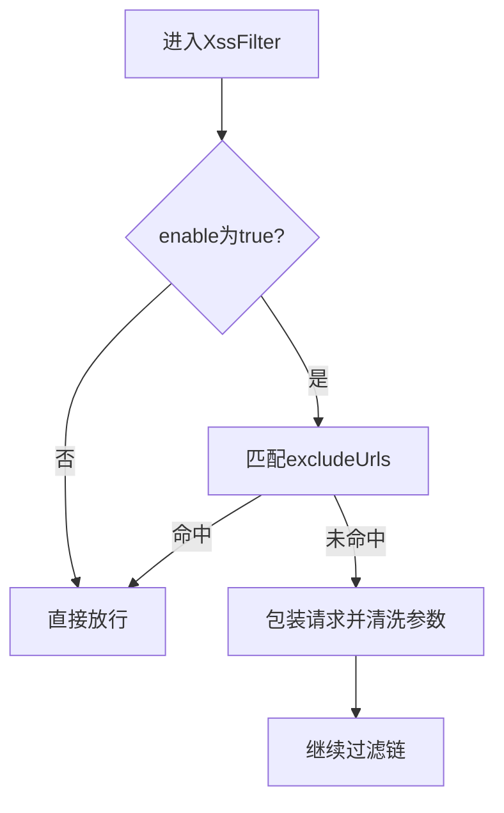
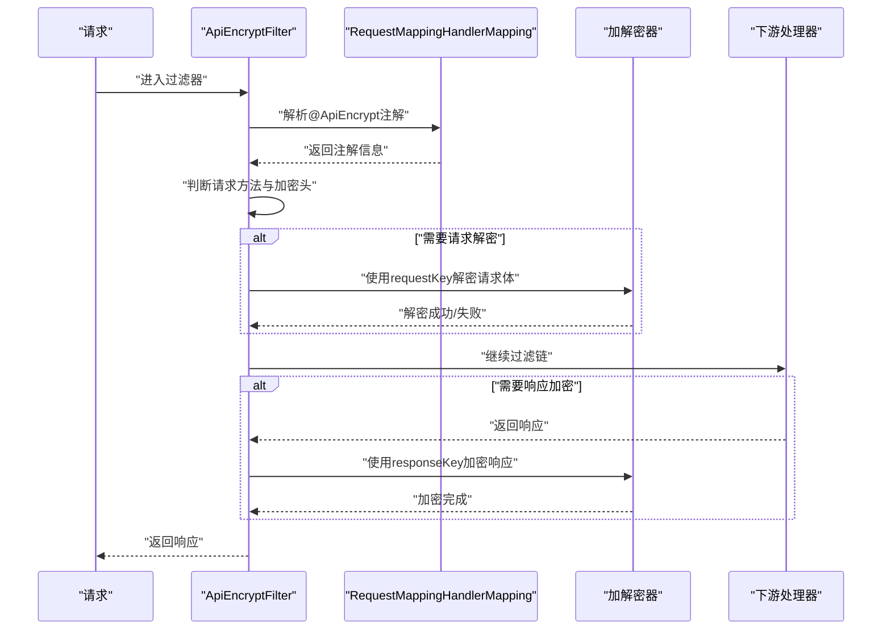
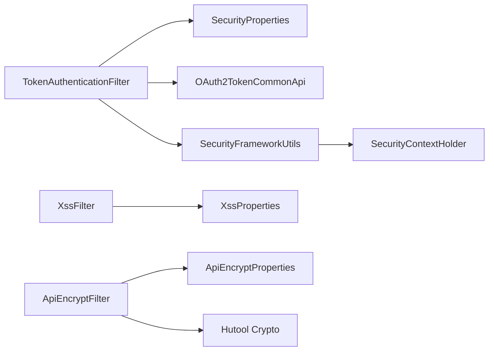

# 安全实践

<cite>
**本文引用的文件**
- [PandoraSecurityAutoConfiguration.java](file://pandora-framework/pandora-spring-boot-starter-security/src/main/java/net/ittimeline/pandora/framework/security/config/PandoraSecurityAutoConfiguration.java)
- [SecurityProperties.java](file://pandora-framework/pandora-spring-boot-starter-security/src/main/java/net/ittimeline/pandora/framework/security/config/SecurityProperties.java)
- [TokenAuthenticationFilter.java](file://pandora-framework/pandora-spring-boot-starter-security/src/main/java/net/ittimeline/pandora/framework/security/core/filter/TokenAuthenticationFilter.java)
- [SecurityFrameworkService.java](file://pandora-framework/pandora-spring-boot-starter-security/src/main/java/net/ittimeline/pandora/framework/security/core/service/SecurityFrameworkService.java)
- [SecurityFrameworkUtils.java](file://pandora-framework/pandora-spring-boot-starter-security/src/main/java/net/ittimeline/pandora/framework/security/core/util/SecurityFrameworkUtils.java)
- [XssProperties.java](file://pandora-framework/pandora-spring-boot-starter-web/src/main/java/net/ittimeline/pandora/framework/xss/config/XssProperties.java)
- [XssFilter.java](file://pandora-framework/pandora-spring-boot-starter-web/src/main/java/net/ittimeline/pandora/framework/xss/core/filter/XssFilter.java)
- [ApiEncryptProperties.java](file://pandora-framework/pandora-spring-boot-starter-web/src/main/java/net/ittimeline/pandora/framework/encrypt/config/ApiEncryptProperties.java)
- [ApiEncryptFilter.java](file://pandora-framework/pandora-spring-boot-starter-web/src/main/java/net/ittimeline/pandora/framework/encrypt/core/filter/ApiEncryptFilter.java)
- [DesensitizationHandler.java](file://pandora-framework/pandora-spring-boot-starter-web/src/main/java/net/ittimeline/pandora/framework/desensitize/core/base/handler/DesensitizationHandler.java)
</cite>

## 目录
1. [简介](#简介)
2. [项目结构](#项目结构)
3. [核心组件](#核心组件)
4. [架构总览](#架构总览)
5. [详细组件分析](#详细组件分析)
6. [依赖分析](#依赖分析)
7. [性能考虑](#性能考虑)
8. [故障排查指南](#故障排查指南)
9. [结论](#结论)
10. [附录](#附录)

## 简介
本指南面向Pandora Cloud框架的安全实践，聚焦以下主题：
- OAuth2.0认证与Token管理策略
- 权限控制最佳实践
- XSS防护机制配置与使用
- API加密过滤器配置与加解密流程
- 数据脱敏的实施方法
- 密码安全存储、会话管理、CSRF防护与输入验证
- 敏感数据保护、日志脱敏与安全审计
- 安全漏洞扫描、渗透测试与安全事件响应流程
- 生产环境安全加固与合规性要求

## 项目结构
围绕安全相关能力，Pandora Cloud在两个模块中提供了关键能力：
- 安全模块（Spring Security集成与Token认证）
- Web增强模块（XSS防护、API加解密、数据脱敏）

图表来源
- [PandoraSecurityAutoConfiguration.java:1-99](file://pandora-framework/pandora-spring-boot-starter-security/src/main/java/net/ittimeline/pandora/framework/security/config/PandoraSecurityAutoConfiguration.java#L1-L99)
- [SecurityProperties.java:1-58](file://pandora-framework/pandora-spring-boot-starter-security/src/main/java/net/ittimeline/pandora/framework/security/config/SecurityProperties.java#L1-L58)
- [TokenAuthenticationFilter.java:1-157](file://pandora-framework/pandora-spring-boot-starter-security/src/main/java/net/ittimeline/pandora/framework/security/core/filter/TokenAuthenticationFilter.java#L1-L157)
- [SecurityFrameworkUtils.java:1-163](file://pandora-framework/pandora-spring-boot-starter-security/src/main/java/net/ittimeline/pandora/framework/security/core/util/SecurityFrameworkUtils.java#L1-L163)
- [SecurityFrameworkService.java:1-61](file://pandora-framework/pandora-spring-boot-starter-security/src/main/java/net/ittimeline/pandora/framework/security/core/service/SecurityFrameworkService.java#L1-L61)
- [XssProperties.java:1-30](file://pandora-framework/pandora-spring-boot-starter-web/src/main/java/net/ittimeline/pandora/framework/xss/config/XssProperties.java#L1-L30)
- [XssFilter.java:1-55](file://pandora-framework/pandora-spring-boot-starter-web/src/main/java/net/ittimeline/pandora/framework/xss/core/filter/XssFilter.java#L1-L55)
- [ApiEncryptProperties.java:1-73](file://pandora-framework/pandora-spring-boot-starter-web/src/main/java/net/ittimeline/pandora/framework/encrypt/config/ApiEncryptProperties.java#L1-L73)
- [ApiEncryptFilter.java:1-158](file://pandora-framework/pandora-spring-boot-starter-web/src/main/java/net/ittimeline/pandora/framework/encrypt/core/filter/ApiEncryptFilter.java#L1-L158)
- [DesensitizationHandler.java:1-41](file://pandora-framework/pandora-spring-boot-starter-web/src/main/java/net/ittimeline/pandora/framework/desensitize/core/base/handler/DesensitizationHandler.java#L1-L41)

章节来源
- [PandoraSecurityAutoConfiguration.java:1-99](file://pandora-framework/pandora-spring-boot-starter-security/src/main/java/net/ittimeline/pandora/framework/security/config/PandoraSecurityAutoConfiguration.java#L1-L99)
- [PandoraSecurityAutoConfiguration.java:36-98](file://pandora-framework/pandora-spring-boot-starter-security/src/main/java/net/ittimeline/pandora/framework/security/config/PandoraSecurityAutoConfiguration.java#L36-L98)
- [SecurityProperties.java:19-57](file://pandora-framework/pandora-spring-boot-starter-security/src/main/java/net/ittimeline/pandora/framework/security/config/SecurityProperties.java#L19-L57)
- [TokenAuthenticationFilter.java:37-157](file://pandora-framework/pandora-spring-boot-starter-security/src/main/java/net/ittimeline/pandora/framework/security/core/filter/TokenAuthenticationFilter.java#L37-L157)
- [SecurityFrameworkUtils.java:26-163](file://pandora-framework/pandora-spring-boot-starter-security/src/main/java/net/ittimeline/pandora/framework/security/core/util/SecurityFrameworkUtils.java#L26-L163)
- [SecurityFrameworkService.java:10-60](file://pandora-framework/pandora-spring-boot-starter-security/src/main/java/net/ittimeline/pandora/framework/security/core/service/SecurityFrameworkService.java#L10-L60)
- [XssProperties.java:16-30](file://pandora-framework/pandora-spring-boot-starter-web/src/main/java/net/ittimeline/pandora/framework/xss/config/XssProperties.java#L16-L30)
- [XssFilter.java:22-55](file://pandora-framework/pandora-spring-boot-starter-web/src/main/java/net/ittimeline/pandora/framework/xss/core/filter/XssFilter.java#L22-L55)
- [ApiEncryptProperties.java:16-73](file://pandora-framework/pandora-spring-boot-starter-web/src/main/java/net/ittimeline/pandora/framework/encrypt/config/ApiEncryptProperties.java#L16-L73)
- [ApiEncryptFilter.java:39-158](file://pandora-framework/pandora-spring-boot-starter-web/src/main/java/net/ittimeline/pandora/framework/encrypt/core/filter/ApiEncryptFilter.java#L39-L158)
- [DesensitizationHandler.java:14-41](file://pandora-framework/pandora-spring-boot-starter-web/src/main/java/net/ittimeline/pandora/framework/desensitize/core/base/handler/DesensitizationHandler.java#L14-L41)

## 核心组件
- 安全自动装配与Bean注册：负责注册认证入口点、权限不足处理器、BCrypt密码编码器、Token认证过滤器、安全框架服务以及线程本地上下文策略。
- 安全配置项：定义Token请求头、参数名、免登录URL列表、Mock模式开关与密钥、密码编码复杂度等。
- Token认证过滤器：从请求头或参数提取Token，调用OAuth2校验接口构建登录用户，注入Spring Security上下文；支持基于Header透传的登录用户与Mock登录。
- 安全上下文工具：提供从请求提取Token、获取当前认证信息与用户、设置登录用户、跨租户权限跳过判断等。
- 权限判定接口：统一抽象权限、角色、授权范围的判定方法，供业务层调用。
- XSS配置与过滤器：支持全局开关、排除URL列表，对请求参数进行清洗。
- API加解密配置与过滤器：支持对称/AES与非对称/RSA加解密，按接口注解启用请求解密与响应加密。
- 脱敏处理器接口：定义脱敏逻辑与禁用表达式，支撑多种脱敏策略。

章节来源
- [PandoraSecurityAutoConfiguration.java:36-98](file://pandora-framework/pandora-spring-boot-starter-security/src/main/java/net/ittimeline/pandora/framework/security/config/PandoraSecurityAutoConfiguration.java#L36-L98)
- [SecurityProperties.java:22-57](file://pandora-framework/pandora-spring-boot-starter-security/src/main/java/net/ittimeline/pandora/framework/security/config/SecurityProperties.java#L22-L57)
- [TokenAuthenticationFilter.java:47-157](file://pandora-framework/pandora-spring-boot-starter-security/src/main/java/net/ittimeline/pandora/framework/security/core/filter/TokenAuthenticationFilter.java#L47-L157)
- [SecurityFrameworkUtils.java:44-163](file://pandora-framework/pandora-spring-boot-starter-security/src/main/java/net/ittimeline/pandora/framework/security/core/util/SecurityFrameworkUtils.java#L44-L163)
- [SecurityFrameworkService.java:10-60](file://pandora-framework/pandora-spring-boot-starter-security/src/main/java/net/ittimeline/pandora/framework/security/core/service/SecurityFrameworkService.java#L10-L60)
- [XssProperties.java:16-30](file://pandora-framework/pandora-spring-boot-starter-web/src/main/java/net/ittimeline/pandora/framework/xss/config/XssProperties.java#L16-L30)
- [XssFilter.java:22-55](file://pandora-framework/pandora-spring-boot-starter-web/src/main/java/net/ittimeline/pandora/framework/xss/core/filter/XssFilter.java#L22-L55)
- [ApiEncryptProperties.java:16-73](file://pandora-framework/pandora-spring-boot-starter-web/src/main/java/net/ittimeline/pandora/framework/encrypt/config/ApiEncryptProperties.java#L16-L73)
- [ApiEncryptFilter.java:39-158](file://pandora-framework/pandora-spring-boot-starter-web/src/main/java/net/ittimeline/pandora/framework/encrypt/core/filter/ApiEncryptFilter.java#L39-L158)
- [DesensitizationHandler.java:14-41](file://pandora-framework/pandora-spring-boot-starter-web/src/main/java/net/ittimeline/pandora/framework/desensitize/core/base/handler/DesensitizationHandler.java#L14-L41)

## 架构总览
下图展示从请求进入系统到完成认证与鉴权的关键路径，以及与XSS、API加解密、脱敏的关系。

图表来源
- [TokenAuthenticationFilter.java:47-107](file://pandora-framework/pandora-spring-boot-starter-security/src/main/java/net/ittimeline/pandora/framework/security/core/filter/TokenAuthenticationFilter.java#L47-L107)
- [SecurityFrameworkUtils.java:125-136](file://pandora-framework/pandora-spring-boot-starter-security/src/main/java/net/ittimeline/pandora/framework/security/core/util/SecurityFrameworkUtils.java#L125-L136)
- [XssFilter.java:36-52](file://pandora-framework/pandora-spring-boot-starter-web/src/main/java/net/ittimeline/pandora/framework/xss/core/filter/XssFilter.java#L36-L52)
- [ApiEncryptFilter.java:78-121](file://pandora-framework/pandora-spring-boot-starter-web/src/main/java/net/ittimeline/pandora/framework/encrypt/core/filter/ApiEncryptFilter.java#L78-L121)

## 详细组件分析

### OAuth2.0认证与Token管理
- 认证入口与上下文策略
  - 自动装配注册认证失败入口点、权限不足入口点、BCrypt密码编码器、Token认证过滤器、安全框架服务与线程本地上下文策略。
  - 线程本地上下文策略确保跨线程传递安全上下文，提升分布式场景下的安全性与一致性。
- Token提取与认证
  - 优先从请求头提取，其次从查询参数提取；支持“Bearer ”前缀去除。
  - 调用OAuth2校验接口获取Token校验结果，构建登录用户对象并注入Spring Security上下文。
  - 支持Header透传登录用户与Mock登录（开发调试），生产务必关闭Mock。
- 权限控制
  - 提供统一的权限/角色/授权范围判定接口，业务层可直接调用进行细粒度控制。

图表来源
- [TokenAuthenticationFilter.java:47-107](file://pandora-framework/pandora-spring-boot-starter-security/src/main/java/net/ittimeline/pandora/framework/security/core/filter/TokenAuthenticationFilter.java#L47-L107)
- [SecurityFrameworkUtils.java:44-57](file://pandora-framework/pandora-spring-boot-starter-security/src/main/java/net/ittimeline/pandora/framework/security/core/util/SecurityFrameworkUtils.java#L44-L57)
- [SecurityFrameworkUtils.java:125-136](file://pandora-framework/pandora-spring-boot-starter-security/src/main/java/net/ittimeline/pandora/framework/security/core/util/SecurityFrameworkUtils.java#L125-L136)

章节来源
- [PandoraSecurityAutoConfiguration.java:47-96](file://pandora-framework/pandora-spring-boot-starter-security/src/main/java/net/ittimeline/pandora/framework/security/config/PandoraSecurityAutoConfiguration.java#L47-L96)
- [SecurityProperties.java:22-46](file://pandora-framework/pandora-spring-boot-starter-security/src/main/java/net/ittimeline/pandora/framework/security/config/SecurityProperties.java#L22-L46)
- [TokenAuthenticationFilter.java:47-131](file://pandora-framework/pandora-spring-boot-starter-security/src/main/java/net/ittimeline/pandora/framework/security/core/filter/TokenAuthenticationFilter.java#L47-L131)
- [SecurityFrameworkUtils.java:44-136](file://pandora-framework/pandora-spring-boot-starter-security/src/main/java/net/ittimeline/pandora/framework/security/core/util/SecurityFrameworkUtils.java#L44-L136)
- [SecurityFrameworkService.java:10-60](file://pandora-framework/pandora-spring-boot-starter-security/src/main/java/net/ittimeline/pandora/framework/security/core/service/SecurityFrameworkService.java#L10-L60)

### 权限控制最佳实践
- 统一接口：通过SecurityFrameworkService提供的hasPermission/hasRole/hasScope及其“任一”变体，实现权限/角色/授权范围的判定。
- 跨租户场景：当访问租户与当前租户不一致时，自动跳过权限校验，避免误判。
- 免登录URL：通过配置免登录URL列表，减少对公开接口的认证负担。

章节来源
- [SecurityFrameworkService.java:10-60](file://pandora-framework/pandora-spring-boot-starter-security/src/main/java/net/ittimeline/pandora/framework/security/core/service/SecurityFrameworkService.java#L10-L60)
- [SecurityFrameworkUtils.java:151-161](file://pandora-framework/pandora-spring-boot-starter-security/src/main/java/net/ittimeline/pandora/framework/security/core/util/SecurityFrameworkUtils.java#L151-L161)
- [SecurityProperties.java:51](file://pandora-framework/pandora-spring-boot-starter-security/src/main/java/net/ittimeline/pandora/framework/security/config/SecurityProperties.java#L51)

### XSS防护机制
- 配置项
  - enable：全局开关，默认开启。
  - excludeUrls：排除URL列表，支持通配符匹配。
- 工作原理
  - 过滤器在请求进入时包装请求对象，对参数进行清洗；若关闭或命中排除规则则直接放行。

图表来源
- [XssFilter.java:36-52](file://pandora-framework/pandora-spring-boot-starter-web/src/main/java/net/ittimeline/pandora/framework/xss/core/filter/XssFilter.java#L36-L52)
- [XssProperties.java:24-28](file://pandora-framework/pandora-spring-boot-starter-web/src/main/java/net/ittimeline/pandora/framework/xss/config/XssProperties.java#L24-L28)

章节来源
- [XssProperties.java:16-30](file://pandora-framework/pandora-spring-boot-starter-web/src/main/java/net/ittimeline/pandora/framework/xss/config/XssProperties.java#L16-L30)
- [XssFilter.java:22-55](file://pandora-framework/pandora-spring-boot-starter-web/src/main/java/net/ittimeline/pandora/framework/xss/core/filter/XssFilter.java#L22-L55)

### API加密过滤器
- 配置项
  - enable：是否开启API加解密。
  - header：加解密标识请求头名称。
  - algorithm：对称（如AES）或非对称（如RSA）算法。
  - requestKey/responseKey：请求解密密钥/响应加密密钥（对称与非对称含义不同）。
- 工作流程
  - 仅对POST/PUT/DELETE进行请求解密；通过注解控制响应加密。
  - 若请求携带加密头则解密请求体；若接口声明启用请求解密但未携带加密头则返回参数无效错误。
  - 响应加密在过滤器链结束后执行，确保能读取完整响应内容。

图表来源
- [ApiEncryptFilter.java:78-121](file://pandora-framework/pandora-spring-boot-starter-web/src/main/java/net/ittimeline/pandora/framework/encrypt/core/filter/ApiEncryptFilter.java#L78-L121)
- [ApiEncryptProperties.java:24-70](file://pandora-framework/pandora-spring-boot-starter-web/src/main/java/net/ittimeline/pandora/framework/encrypt/config/ApiEncryptProperties.java#L24-L70)

章节来源
- [ApiEncryptProperties.java:16-73](file://pandora-framework/pandora-spring-boot-starter-web/src/main/java/net/ittimeline/pandora/framework/encrypt/config/ApiEncryptProperties.java#L16-L73)
- [ApiEncryptFilter.java:39-158](file://pandora-framework/pandora-spring-boot-starter-web/src/main/java/net/ittimeline/pandora/framework/encrypt/core/filter/ApiEncryptFilter.java#L39-L158)

### 数据脱敏
- 处理器接口
  - 定义脱敏方法与禁用表达式（默认读取enable/disable属性）。
- 实施要点
  - 通过注解驱动的方式在序列化阶段对敏感字段进行脱敏。
  - 可结合Spring EL表达式动态控制脱敏开关，便于灰度与回滚。

章节来源
- [DesensitizationHandler.java:14-41](file://pandora-framework/pandora-spring-boot-starter-web/src/main/java/net/ittimeline/pandora/framework/desensitize/core/base/handler/DesensitizationHandler.java#L14-L41)

### 密码安全存储、会话管理、CSRF防护与输入验证
- 密码安全存储
  - 使用BCryptPasswordEncoder进行密码哈希存储，支持配置编码复杂度。
- 会话管理
  - 采用无状态Token模型，不依赖服务器端会话；通过线程本地上下文策略保障跨线程传递。
- CSRF防护
  - 由于采用Token无状态认证，天然规避CSRF风险；如需额外防护，可在前端侧配合SameSite Cookie与Token刷新策略。
- 输入验证
  - 结合Spring Validation与框架内置校验工具，对入参与业务参数进行严格校验。

章节来源
- [PandoraSecurityAutoConfiguration.java:66-69](file://pandora-framework/pandora-spring-boot-starter-security/src/main/java/net/ittimeline/pandora/framework/security/config/PandoraSecurityAutoConfiguration.java#L66-L69)
- [PandoraSecurityAutoConfiguration.java:90-96](file://pandora-framework/pandora-spring-boot-starter-security/src/main/java/net/ittimeline/pandora/framework/security/config/PandoraSecurityAutoConfiguration.java#L90-L96)
- [SecurityProperties.java:55-56](file://pandora-framework/pandora-spring-boot-starter-security/src/main/java/net/ittimeline/pandora/framework/security/config/SecurityProperties.java#L55-L56)

### 敏感数据保护、日志脱敏与安全审计
- 敏感数据保护
  - API加解密：对传输中的敏感数据进行对称或非对称加密。
  - 数据脱敏：在序列化输出前对敏感字段进行脱敏处理。
- 日志脱敏
  - 建议在日志采集与输出环节屏蔽Token、密码、身份证、银行卡等字段。
- 安全审计
  - 通过访问日志与操作日志记录关键行为，结合脱敏策略避免敏感信息泄露。

章节来源
- [ApiEncryptFilter.java:110-120](file://pandora-framework/pandora-spring-boot-starter-web/src/main/java/net/ittimeline/pandora/framework/encrypt/core/filter/ApiEncryptFilter.java#L110-L120)
- [DesensitizationHandler.java:22-39](file://pandora-framework/pandora-spring-boot-starter-web/src/main/java/net/ittimeline/pandora/framework/desensitize/core/base/handler/DesensitizationHandler.java#L22-L39)

### 安全漏洞扫描、渗透测试与安全事件响应
- 安全漏洞扫描
  - 代码静态分析：SpotBugs、SonarQube等。
  - 依赖漏洞扫描：OWASP Dependency-Check、Snyk等。
- 渗透测试
  - 定期对生产环境进行红蓝对抗与渗透测试，覆盖认证、授权、输入验证、敏感数据保护等。
- 安全事件响应
  - 建立事件分级与处置流程，快速定位、阻断与恢复；完善日志与审计留痕。

（本节为通用指导，不直接分析具体文件）

## 依赖分析
- 组件内聚与耦合
  - TokenAuthenticationFilter依赖SecurityProperties、GlobalExceptionHandler与OAuth2TokenCommonApi，职责清晰。
  - SecurityFrameworkUtils与SecurityFrameworkService形成“工具+接口”的协作，降低上层耦合。
  - XSS与API加解密过滤器均通过配置类与工具类解耦，便于独立启用/禁用与扩展。
- 外部依赖
  - 加解密依赖Hutool Crypto；XSS依赖Jsoup清理器；Spring Security上下文策略可替换为线程本地实现。

图表来源
- [TokenAuthenticationFilter.java:41-45](file://pandora-framework/pandora-spring-boot-starter-security/src/main/java/net/ittimeline/pandora/framework/security/core/filter/TokenAuthenticationFilter.java#L41-L45)
- [SecurityProperties.java:22-46](file://pandora-framework/pandora-spring-boot-starter-security/src/main/java/net/ittimeline/pandora/framework/security/config/SecurityProperties.java#L22-L46)
- [XssFilter.java:28-34](file://pandora-framework/pandora-spring-boot-starter-web/src/main/java/net/ittimeline/pandora/framework/xss/core/filter/XssFilter.java#L28-L34)
- [ApiEncryptFilter.java:48-52](file://pandora-framework/pandora-spring-boot-starter-web/src/main/java/net/ittimeline/pandora/framework/encrypt/core/filter/ApiEncryptFilter.java#L48-L52)

章节来源
- [TokenAuthenticationFilter.java:41-45](file://pandora-framework/pandora-spring-boot-starter-security/src/main/java/net/ittimeline/pandora/framework/security/core/filter/TokenAuthenticationFilter.java#L41-L45)
- [XssFilter.java:28-34](file://pandora-framework/pandora-spring-boot-starter-web/src/main/java/net/ittimeline/pandora/framework/xss/core/filter/XssFilter.java#L28-L34)
- [ApiEncryptFilter.java:48-52](file://pandora-framework/pandora-spring-boot-starter-web/src/main/java/net/ittimeline/pandora/framework/encrypt/core/filter/ApiEncryptFilter.java#L48-L52)

## 性能考虑
- Token校验与上下文注入
  - 将Token校验与上下文注入放在过滤器链前端，避免重复计算；合理设置免登录URL，减少不必要的认证。
- 加解密性能
  - 对称加密（如AES）性能优于非对称加密（如RSA），高频接口建议对称加密；注意密钥长度与算法选择。
- XSS与脱敏
  - 在排除列表中精准配置白名单，避免对静态资源与公开接口重复处理。

（本节提供通用建议，不直接分析具体文件）

## 故障排查指南
- Token认证失败
  - 检查请求头与参数名配置是否一致；确认“Bearer ”前缀处理逻辑；核对OAuth2校验接口返回。
- Mock登录未生效
  - 确认mockEnable为true且token以mockSecret开头；生产环境务必关闭。
- XSS未生效
  - 检查enable开关与excludeUrls配置；确认过滤器顺序在日志之前。
- API加解密异常
  - 确认@ApiOperation注解与请求方法匹配；核对加密头与密钥配置；查看全局异常处理器返回的错误信息。

章节来源
- [TokenAuthenticationFilter.java:57-74](file://pandora-framework/pandora-spring-boot-starter-security/src/main/java/net/ittimeline/pandora/framework/security/core/filter/TokenAuthenticationFilter.java#L57-L74)
- [TokenAuthenticationFilter.java:119-131](file://pandora-framework/pandora-spring-boot-starter-security/src/main/java/net/ittimeline/pandora/framework/security/core/filter/TokenAuthenticationFilter.java#L119-L131)
- [XssFilter.java:43-52](file://pandora-framework/pandora-spring-boot-starter-web/src/main/java/net/ittimeline/pandora/framework/xss/core/filter/XssFilter.java#L43-L52)
- [ApiEncryptFilter.java:95-107](file://pandora-framework/pandora-spring-boot-starter-web/src/main/java/net/ittimeline/pandora/framework/encrypt/core/filter/ApiEncryptFilter.java#L95-L107)

## 结论
Pandora Cloud框架通过无状态Token认证、统一权限判定接口、XSS防护、API加解密与数据脱敏等能力，构建了完整的安全体系。建议在生产环境中：
- 关闭Mock模式，严格启用免登录白名单
- 对高频接口采用对称加密，对关键接口采用非对称加密
- 强化输入验证与日志脱敏，完善安全审计
- 建立持续的安全扫描与渗透测试机制，制定安全事件响应预案

（本节为总结性内容，不直接分析具体文件）

## 附录
- 配置清单（示例）
  - 安全配置：Token请求头、参数名、免登录URL、Mock开关与密钥、密码编码复杂度
  - XSS配置：enable、excludeUrls
  - API加解密：enable、header、algorithm、requestKey、responseKey

章节来源
- [SecurityProperties.java:22-57](file://pandora-framework/pandora-spring-boot-starter-security/src/main/java/net/ittimeline/pandora/framework/security/config/SecurityProperties.java#L22-L57)
- [XssProperties.java:24-28](file://pandora-framework/pandora-spring-boot-starter-web/src/main/java/net/ittimeline/pandora/framework/xss/config/XssProperties.java#L24-L28)
- [ApiEncryptProperties.java:24-70](file://pandora-framework/pandora-spring-boot-starter-web/src/main/java/net/ittimeline/pandora/framework/encrypt/config/ApiEncryptProperties.java#L24-L70)