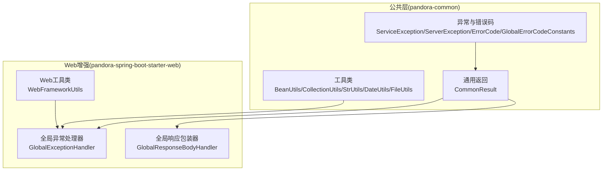
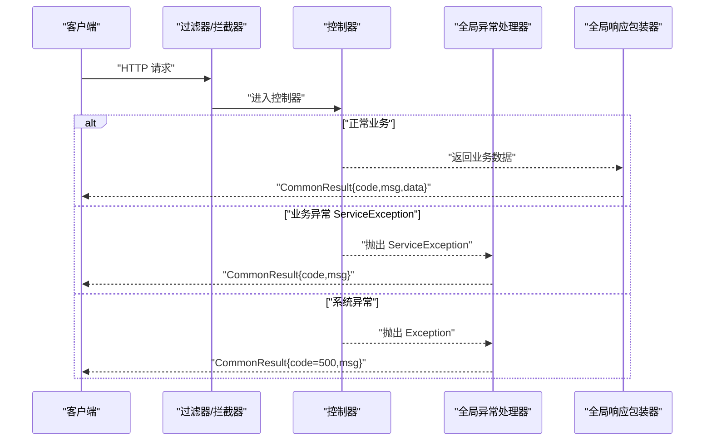
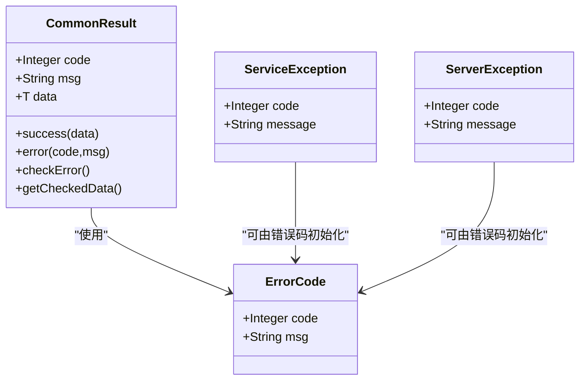
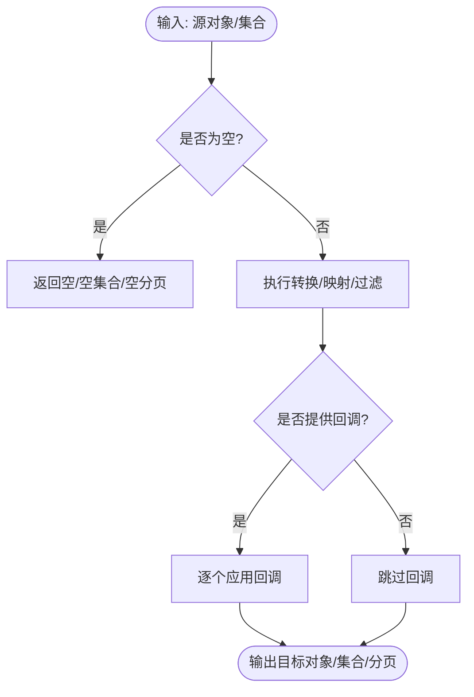
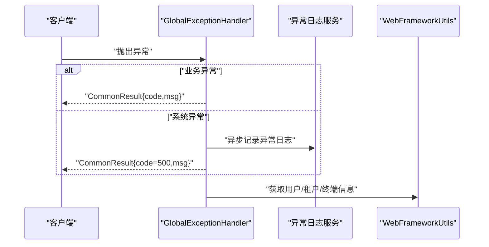
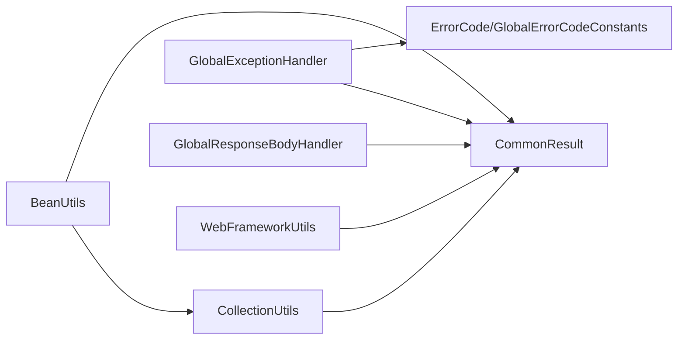

# 开发实践

<cite>
**本文引用的文件**
- [AutoTransable.java](file://pandora-framework/pandora-common/src/main/java/com/fhs/trans/service/AutoTransable.java)
- [BeanUtils.java](file://pandora-framework/pandora-common/src/main/java/net/ittimeline/pandora/framework/common/util/foundational/object/BeanUtils.java)
- [CollectionUtils.java](file://pandora-framework/pandora-common/src/main/java/net/ittimeline/pandora/framework/common/util/foundational/collection/CollectionUtils.java)
- [StrUtils.java](file://pandora-framework/pandora-common/src/main/java/net/ittimeline/pandora/framework/common/util/foundational/string/StrUtils.java)
- [ServiceException.java](file://pandora-framework/pandora-common/src/main/java/net/ittimeline/pandora/framework/common/exception/ServiceException.java)
- [ServerException.java](file://pandora-framework/pandora-common/src/main/java/net/ittimeline/pandora/framework/common/exception/ServerException.java)
- [ErrorCode.java](file://pandora-framework/pandora-common/src/main/java/net/ittimeline/pandora/framework/common/exception/ErrorCode.java)
- [GlobalErrorCodeConstants.java](file://pandora-framework/pandora-common/src/main/java/net/ittimeline/pandora/framework/common/exception/enums/GlobalErrorCodeConstants.java)
- [CommonResult.java](file://pandora-framework/pandora-common/src/main/java/net/ittimeline/pandora/framework/common/pojo/CommonResult.java)
- [GlobalExceptionHandler.java](file://pandora-framework/pandora-spring-boot-starter-web/src/main/java/net/ittimeline/pandora/framework/web/core/handler/GlobalExceptionHandler.java)
- [GlobalResponseBodyHandler.java](file://pandora-framework/pandora-spring-boot-starter-web/src/main/java/net/ittimeline/pandora/framework/web/core/handler/GlobalResponseBodyHandler.java)
- [WebFrameworkUtils.java](file://pandora-framework/pandora-spring-boot-starter-web/src/main/java/net/ittimeline/pandora/framework/web/core/util/WebFrameworkUtils.java)
- [DateUtils.java](file://pandora-framework/pandora-common/src/main/java/net/ittimeline/pandora/framework/common/util/foundational/date/DateUtils.java)
- [FileUtils.java](file://pandora-framework/pandora-common/src/main/java/net/ittimeline/pandora/framework/common/util/foundational/io/FileUtils.java)
</cite>

## 目录
1. [引言](#引言)
2. [项目结构](#项目结构)
3. [核心组件](#核心组件)
4. [架构总览](#架构总览)
5. [组件详解](#组件详解)
6. [依赖关系分析](#依赖关系分析)
7. [性能与可维护性](#性能与可维护性)
8. [故障排查指南](#故障排查指南)
9. [结论](#结论)
10. [附录：编码规范与工具使用](#附录编码规范与工具使用)

## 引言
本指南面向在 Pandora Cloud 框架上进行微服务开发的工程师，聚焦于代码编写规范、命名约定、项目结构组织原则，以及工具类的正确使用方法（如 BeanUtils、CollectionUtils、StrUtils 等）。同时覆盖异常处理的统一模式与最佳实践、代码复用策略、设计模式应用、单元测试编写方法、微服务架构下的接口设计规范与 DTO 使用建议，以及 IDE 配置、代码格式化与静态分析工具的使用建议。

## 项目结构
Pandora Cloud 采用多模块分层组织：
- pandora-common：公共能力与基础设施（异常、通用返回、工具类、枚举）
- pandora-spring-boot-starter-web：Web 层增强（全局异常、全局响应包装、安全与日志等）
- pandora-spring-boot-starter-security：安全与鉴权
- pandora-spring-boot-starter-redis：缓存与分布式锁
- pandora-spring-boot-starter-rpc：RPC 能力（待完善）

图表来源
- [GlobalExceptionHandler.java:50-454](file://pandora-framework/pandora-spring-boot-starter-web/src/main/java/net/ittimeline/pandora/framework/web/core/handler/GlobalExceptionHandler.java#L50-L454)
- [CommonResult.java:14-123](file://pandora-framework/pandora-common/src/main/java/net/ittimeline/pandora/framework/common/pojo/CommonResult.java#L14-L123)
- [BeanUtils.java:10-69](file://pandora-framework/pandora-common/src/main/java/net/ittimeline/pandora/framework/common/util/foundational/object/BeanUtils.java#L10-L69)
- [CollectionUtils.java:17-375](file://pandora-framework/pandora-common/src/main/java/net/ittimeline/pandora/framework/common/util/foundational/collection/CollectionUtils.java#L17-L375)
- [StrUtils.java:14-108](file://pandora-framework/pandora-common/src/main/java/net/ittimeline/pandora/framework/common/util/foundational/string/StrUtils.java#L14-L108)
- [DateUtils.java:9-151](file://pandora-framework/pandora-common/src/main/java/net/ittimeline/pandora/framework/common/util/foundational/date/DateUtils.java#L9-L151)
- [FileUtils.java:9-61](file://pandora-framework/pandora-common/src/main/java/net/ittimeline/pandora/framework/common/util/foundational/io/FileUtils.java#L9-L61)
- [GlobalResponseBodyHandler.java:12-47](file://pandora-framework/pandora-spring-boot-starter-web/src/main/java/net/ittimeline/pandora/framework/web/core/handler/GlobalResponseBodyHandler.java#L12-L47)
- [WebFrameworkUtils.java:15-182](file://pandora-framework/pandora-spring-boot-starter-web/src/main/java/net/ittimeline/pandora/framework/web/core/util/WebFrameworkUtils.java#L15-L182)

章节来源
- [GlobalExceptionHandler.java:50-454](file://pandora-framework/pandora-spring-boot-starter-web/src/main/java/net/ittimeline/pandora/framework/web/core/handler/GlobalExceptionHandler.java#L50-L454)
- [CommonResult.java:14-123](file://pandora-framework/pandora-common/src/main/java/net/ittimeline/pandora/framework/common/pojo/CommonResult.java#L14-L123)

## 核心组件
- 通用返回与异常体系：统一返回结构、业务异常与系统异常分类、全局错误码常量
- 工具类库：Bean/集合/字符串/日期/IO 等常用工具，封装第三方库并提供一致的空值与边界处理
- Web 增强：全局异常兜底、统一响应包装、Web 上下文工具
- RPC/安全/日志：通过 starter 模块按需装配

章节来源
- [ServiceException.java:7-64](file://pandora-framework/pandora-common/src/main/java/net/ittimeline/pandora/framework/common/exception/ServiceException.java#L7-L64)
- [ServerException.java:7-65](file://pandora-framework/pandora-common/src/main/java/net/ittimeline/pandora/framework/common/exception/ServerException.java#L7-L65)
- [ErrorCode.java:7-33](file://pandora-framework/pandora-common/src/main/java/net/ittimeline/pandora/framework/common/exception/ErrorCode.java#L7-L33)
- [GlobalErrorCodeConstants.java:5-42](file://pandora-framework/pandora-common/src/main/java/net/ittimeline/pandora/framework/common/exception/enums/GlobalErrorCodeConstants.java#L5-L42)
- [CommonResult.java:14-123](file://pandora-framework/pandora-common/src/main/java/net/ittimeline/pandora/framework/common/pojo/CommonResult.java#L14-L123)
- [BeanUtils.java:10-69](file://pandora-framework/pandora-common/src/main/java/net/ittimeline/pandora/framework/common/util/foundational/object/BeanUtils.java#L10-L69)
- [CollectionUtils.java:17-375](file://pandora-framework/pandora-common/src/main/java/net/ittimeline/pandora/framework/common/util/foundational/collection/CollectionUtils.java#L17-L375)
- [StrUtils.java:14-108](file://pandora-framework/pandora-common/src/main/java/net/ittimeline/pandora/framework/common/util/foundational/string/StrUtils.java#L14-L108)
- [DateUtils.java:9-151](file://pandora-framework/pandora-common/src/main/java/net/ittimeline/pandora/framework/common/util/foundational/date/DateUtils.java#L9-L151)
- [FileUtils.java:9-61](file://pandora-framework/pandora-common/src/main/java/net/ittimeline/pandora/framework/common/util/foundational/io/FileUtils.java#L9-L61)
- [GlobalExceptionHandler.java:50-454](file://pandora-framework/pandora-spring-boot-starter-web/src/main/java/net/ittimeline/pandora/framework/web/core/handler/GlobalExceptionHandler.java#L50-L454)
- [GlobalResponseBodyHandler.java:12-47](file://pandora-framework/pandora-spring-boot-starter-web/src/main/java/net/ittimeline/pandora/framework/web/core/handler/GlobalResponseBodyHandler.java#L12-L47)
- [WebFrameworkUtils.java:15-182](file://pandora-framework/pandora-spring-boot-starter-web/src/main/java/net/ittimeline/pandora/framework/web/core/util/WebFrameworkUtils.java#L15-L182)

## 架构总览
Pandora Cloud 在 Web 层通过全局异常处理器与全局响应包装器，将业务异常与系统异常统一为通用返回结构，配合工具类完成数据转换与上下文提取，形成“统一入口、统一返回”的微服务交互范式。

图表来源
- [GlobalExceptionHandler.java:79-120](file://pandora-framework/pandora-spring-boot-starter-web/src/main/java/net/ittimeline/pandora/framework/web/core/handler/GlobalExceptionHandler.java#L79-L120)
- [GlobalResponseBodyHandler.java:25-47](file://pandora-framework/pandora-spring-boot-starter-web/src/main/java/net/ittimeline/pandora/framework/web/core/handler/GlobalResponseBodyHandler.java#L25-L47)
- [CommonResult.java:74-122](file://pandora-framework/pandora-common/src/main/java/net/ittimeline/pandora/framework/common/pojo/CommonResult.java#L74-L122)

## 组件详解

### 通用返回与异常体系
- 通用返回结构：统一 code/msg/data，提供 success/error/checkError/getCheckedData 等便捷方法
- 业务异常 ServiceException：携带业务错误码与消息，用于语义化错误
- 系统异常 ServerException：用于兜底或系统级错误
- 全局错误码常量：HTTP 语义化错误码区间与自定义错误码区间划分清晰

图表来源
- [CommonResult.java:21-123](file://pandora-framework/pandora-common/src/main/java/net/ittimeline/pandora/framework/common/pojo/CommonResult.java#L21-L123)
- [ServiceException.java:13-64](file://pandora-framework/pandora-common/src/main/java/net/ittimeline/pandora/framework/common/exception/ServiceException.java#L13-L64)
- [ServerException.java:14-65](file://pandora-framework/pandora-common/src/main/java/net/ittimeline/pandora/framework/common/exception/ServerException.java#L14-L65)
- [ErrorCode.java:17-33](file://pandora-framework/pandora-common/src/main/java/net/ittimeline/pandora/framework/common/exception/ErrorCode.java#L17-L33)

章节来源
- [CommonResult.java:14-123](file://pandora-framework/pandora-common/src/main/java/net/ittimeline/pandora/framework/common/pojo/CommonResult.java#L14-L123)
- [ServiceException.java:7-64](file://pandora-framework/pandora-common/src/main/java/net/ittimeline/pandora/framework/common/exception/ServiceException.java#L7-L64)
- [ServerException.java:7-65](file://pandora-framework/pandora-common/src/main/java/net/ittimeline/pandora/framework/common/exception/ServerException.java#L7-L65)
- [ErrorCode.java:7-33](file://pandora-framework/pandora-common/src/main/java/net/ittimeline/pandora/framework/common/exception/ErrorCode.java#L7-L33)
- [GlobalErrorCodeConstants.java:5-42](file://pandora-framework/pandora-common/src/main/java/net/ittimeline/pandora/framework/common/exception/enums/GlobalErrorCodeConstants.java#L5-L42)

### 工具类库
- BeanUtils：对象/列表/分页转换，支持 peek 回调与属性拷贝
- CollectionUtils：集合/映射/分页转换、去重、扁平化、差异对比、最大最小/求和等
- StrUtils：字符串截断、前缀匹配、拆分转数字集合、连接方法参数（排除 Servlet/文件类型）
- DateUtils：LocalDateTime<Date>互转、时区、时间比较、构建指定时间
- FileUtils：临时文件创建与清理

图表来源
- [BeanUtils.java:19-69](file://pandora-framework/pandora-common/src/main/java/net/ittimeline/pandora/framework/common/util/foundational/object/BeanUtils.java#L19-L69)
- [CollectionUtils.java:23-375](file://pandora-framework/pandora-common/src/main/java/net/ittimeline/pandora/framework/common/util/foundational/collection/CollectionUtils.java#L23-L375)
- [StrUtils.java:20-108](file://pandora-framework/pandora-common/src/main/java/net/ittimeline/pandora/framework/common/util/foundational/string/StrUtils.java#L20-L108)
- [DateUtils.java:16-151](file://pandora-framework/pandora-common/src/main/java/net/ittimeline/pandora/framework/common/util/foundational/date/DateUtils.java#L16-L151)
- [FileUtils.java:15-61](file://pandora-framework/pandora-common/src/main/java/net/ittimeline/pandora/framework/common/util/foundational/io/FileUtils.java#L15-L61)

章节来源
- [BeanUtils.java:10-69](file://pandora-framework/pandora-common/src/main/java/net/ittimeline/pandora/framework/common/util/foundational/object/BeanUtils.java#L10-L69)
- [CollectionUtils.java:17-375](file://pandora-framework/pandora-common/src/main/java/net/ittimeline/pandora/framework/common/util/foundational/collection/CollectionUtils.java#L17-L375)
- [StrUtils.java:14-108](file://pandora-framework/pandora-common/src/main/java/net/ittimeline/pandora/framework/common/util/foundational/string/StrUtils.java#L14-L108)
- [DateUtils.java:9-151](file://pandora-framework/pandora-common/src/main/java/net/ittimeline/pandora/framework/common/util/foundational/date/DateUtils.java#L9-L151)
- [FileUtils.java:9-61](file://pandora-framework/pandora-common/src/main/java/net/ittimeline/pandora/framework/common/util/foundational/io/FileUtils.java#L9-L61)

### Web 增强：全局异常与响应包装
- 全局异常处理器：覆盖参数缺失/类型错误/校验失败/资源不存在/方法/媒体类型不支持/权限不足/业务异常/系统异常等，统一转为 CommonResult
- 全局响应包装器：仅对返回类型为 CommonResult 的接口进行拦截，记录返回结果供访问日志使用，不改变业务返回结构
- Web 工具类：提供租户、终端、用户上下文、RPC 请求识别、请求属性存取等

图表来源
- [GlobalExceptionHandler.java:79-120](file://pandora-framework/pandora-spring-boot-starter-web/src/main/java/net/ittimeline/pandora/framework/web/core/handler/GlobalExceptionHandler.java#L79-L120)
- [GlobalExceptionHandler.java:321-341](file://pandora-framework/pandora-spring-boot-starter-web/src/main/java/net/ittimeline/pandora/framework/web/core/handler/GlobalExceptionHandler.java#L321-L341)
- [WebFrameworkUtils.java:22-182](file://pandora-framework/pandora-spring-boot-starter-web/src/main/java/net/ittimeline/pandora/framework/web/core/util/WebFrameworkUtils.java#L22-L182)

章节来源
- [GlobalExceptionHandler.java:50-454](file://pandora-framework/pandora-spring-boot-starter-web/src/main/java/net/ittimeline/pandora/framework/web/core/handler/GlobalExceptionHandler.java#L50-L454)
- [GlobalResponseBodyHandler.java:12-47](file://pandora-framework/pandora-spring-boot-starter-web/src/main/java/net/ittimeline/pandora/framework/web/core/handler/GlobalResponseBodyHandler.java#L12-L47)
- [WebFrameworkUtils.java:15-182](file://pandora-framework/pandora-spring-boot-starter-web/src/main/java/net/ittimeline/pandora/framework/web/core/util/WebFrameworkUtils.java#L15-L182)

### 翻译能力接口（AutoTransable）
- 为自动翻译场景提供统一接口，支持按 ID 列表查询、全量查询、单条查询等默认实现，便于扩展

章节来源
- [AutoTransable.java:18-61](file://pandora-framework/pandora-common/src/main/java/com/fhs/trans/service/AutoTransable.java#L18-L61)

## 依赖关系分析
- 工具类之间低耦合：集合/字符串/日期/IO 工具各自独立，BeanUtils 依赖集合工具进行批量转换
- Web 增强依赖公共层：异常处理器依赖通用返回与错误码，响应包装器依赖通用返回
- Web 工具类依赖配置与枚举：用于提取用户/租户/终端信息

图表来源
- [BeanUtils.java:19-69](file://pandora-framework/pandora-common/src/main/java/net/ittimeline/pandora/framework/common/util/foundational/object/BeanUtils.java#L19-L69)
- [CollectionUtils.java:23-375](file://pandora-framework/pandora-common/src/main/java/net/ittimeline/pandora/framework/common/util/foundational/collection/CollectionUtils.java#L23-L375)
- [CommonResult.java:21-123](file://pandora-framework/pandora-common/src/main/java/net/ittimeline/pandora/framework/common/pojo/CommonResult.java#L21-L123)
- [GlobalExceptionHandler.java:50-454](file://pandora-framework/pandora-spring-boot-starter-web/src/main/java/net/ittimeline/pandora/framework/web/core/handler/GlobalExceptionHandler.java#L50-L454)
- [GlobalResponseBodyHandler.java:25-47](file://pandora-framework/pandora-spring-boot-starter-web/src/main/java/net/ittimeline/pandora/framework/web/core/handler/GlobalResponseBodyHandler.java#L25-L47)
- [WebFrameworkUtils.java:22-182](file://pandora-framework/pandora-spring-boot-starter-web/src/main/java/net/ittimeline/pandora/framework/web/core/util/WebFrameworkUtils.java#L22-L182)

## 性能与可维护性
- 工具类空值与边界处理：集合/字符串/日期工具均对空值进行显式判空，避免 NPE 并返回空集合或空分页，提升健壮性
- 流式与函数式：集合工具广泛使用 Stream 与函数式接口，兼顾可读性与性能
- 分页转换：统一 PageResult 转换，避免重复样板代码
- 异常日志异步化：异常处理器在记录日志时采用异步方式，降低对主流程的影响

章节来源
- [CollectionUtils.java:37-83](file://pandora-framework/pandora-common/src/main/java/net/ittimeline/pandora/framework/common/util/foundational/collection/CollectionUtils.java#L37-L83)
- [StrUtils.java:20-108](file://pandora-framework/pandora-common/src/main/java/net/ittimeline/pandora/framework/common/util/foundational/string/StrUtils.java#L20-L108)
- [GlobalExceptionHandler.java:343-354](file://pandora-framework/pandora-spring-boot-starter-web/src/main/java/net/ittimeline/pandora/framework/web/core/handler/GlobalExceptionHandler.java#L343-L354)

## 故障排查指南
- 业务异常 ServiceException：检查 code/message 是否符合预期，必要时在异常处理器中增加忽略列表或日志级别
- 系统异常兜底：查看异常日志记录是否成功，确认异步落库是否触发
- 参数校验失败：关注 MethodArgumentNotValidException/ConstraintViolationException 的具体字段与提示
- 资源不存在：确认 NoHandlerFoundException/NoResourceFoundException 的路径与静态资源配置
- 权限不足：确认 AccessDeniedException 的用户上下文与终端信息

章节来源
- [GlobalExceptionHandler.java:127-281](file://pandora-framework/pandora-spring-boot-starter-web/src/main/java/net/ittimeline/pandora/framework/web/core/handler/GlobalExceptionHandler.java#L127-L281)
- [GlobalExceptionHandler.java:321-341](file://pandora-framework/pandora-spring-boot-starter-web/src/main/java/net/ittimeline/pandora/framework/web/core/handler/GlobalExceptionHandler.java#L321-L341)
- [WebFrameworkUtils.java:88-120](file://pandora-framework/pandora-spring-boot-starter-web/src/main/java/net/ittimeline/pandora/framework/web/core/util/WebFrameworkUtils.java#L88-L120)

## 结论
Pandora Cloud 通过统一的异常与返回体系、丰富的工具类库以及 Web 增强模块，为微服务开发提供了高内聚、低耦合的基础能力。遵循本文的编码规范与最佳实践，可在保证一致性的同时显著提升开发效率与系统稳定性。

## 附录：编码规范与工具使用

### 代码编写规范与命名约定
- 包命名：按功能域分包，如 util、pojo、enums、exception、biz 等
- 类命名：名词短语，首字母大写；工具类以 Utils 结尾；异常类以 Exception 结尾；DTO 以 DTO 结尾
- 方法命名：动词短语，小驼峰；布尔方法以 is/has/can 前缀
- 常量命名：全大写，单词以下划线分隔
- 接口命名：抽象能力描述，如 AutoTransable

### 项目结构组织原则
- 分层清晰：common/web/security/redis/rpc 各自独立模块
- 低耦合：工具类与业务解耦，异常与返回独立于业务
- 可扩展：通过 Starter 自动装配扩展能力

### 工具类正确使用方法
- BeanUtils
  - 对象/列表/分页转换：提供空值保护与回调
  - 属性拷贝：避免手动复制字段
- CollectionUtils
  - 列表/映射/分页转换：支持过滤、去重、扁平化
  - 差异对比：diffList 支持自定义 same 函数
- StrUtils
  - 字符串截断、前缀匹配、拆分转数字集合
  - 方法参数拼接：自动排除 Servlet/文件类型参数
- DateUtils
  - LocalDateTime<Date> 互转、时区、时间比较、构建指定时间
- FileUtils
  - 临时文件创建与 JVM 退出清理

章节来源
- [BeanUtils.java:19-69](file://pandora-framework/pandora-common/src/main/java/net/ittimeline/pandora/framework/common/util/foundational/object/BeanUtils.java#L19-L69)
- [CollectionUtils.java:23-375](file://pandora-framework/pandora-common/src/main/java/net/ittimeline/pandora/framework/common/util/foundational/collection/CollectionUtils.java#L23-L375)
- [StrUtils.java:20-108](file://pandora-framework/pandora-common/src/main/java/net/ittimeline/pandora/framework/common/util/foundational/string/StrUtils.java#L20-L108)
- [DateUtils.java:16-151](file://pandora-framework/pandora-common/src/main/java/net/ittimeline/pandora/framework/common/util/foundational/date/DateUtils.java#L16-L151)
- [FileUtils.java:15-61](file://pandora-framework/pandora-common/src/main/java/net/ittimeline/pandora/framework/common/util/foundational/io/FileUtils.java#L15-L61)

### 异常处理统一模式与最佳实践
- 业务异常 ServiceException：明确 code/msg，避免使用系统异常承载业务错误
- 系统异常 ServerException：用于兜底或系统级错误
- 全局异常处理器：覆盖常见异常类型，统一返回 CommonResult
- 异常日志：异步记录，包含 traceId、用户信息、请求参数等
- 校验异常：优先使用参数校验与 Bean 验证，减少手工判断

章节来源
- [ServiceException.java:13-64](file://pandora-framework/pandora-common/src/main/java/net/ittimeline/pandora/framework/common/exception/ServiceException.java#L13-L64)
- [ServerException.java:14-65](file://pandora-framework/pandora-common/src/main/java/net/ittimeline/pandora/framework/common/exception/ServerException.java#L14-L65)
- [GlobalExceptionHandler.java:50-454](file://pandora-framework/pandora-spring-boot-starter-web/src/main/java/net/ittimeline/pandora/framework/web/core/handler/GlobalExceptionHandler.java#L50-L454)
- [CommonResult.java:74-122](file://pandora-framework/pandora-common/src/main/java/net/ittimeline/pandora/framework/common/pojo/CommonResult.java#L74-L122)

### 代码复用策略与设计模式
- 工具类复用：将通用逻辑下沉至工具类，避免重复代码
- 模板方法：异常处理器对常见异常类型采用模板化处理
- 策略模式：根据异常类型选择不同的处理策略（业务/系统/资源/权限）

### 单元测试编写方法
- 针对工具类：提供空值、边界值、异常分支的测试用例
- 针对异常处理：模拟不同异常类型，验证返回结构与日志记录
- 针对 Web 工具：模拟请求上下文，验证用户/租户/终端信息提取

### 微服务架构下的开发原则与接口设计规范
- 接口设计：统一返回 CommonResult，明确 code/msg/data
- DTO 使用：请求 DTO 与响应 DTO 明确职责，避免跨层污染
- RPC 识别：通过路径或类名约定区分 RPC 接口
- 跨域与安全：结合安全 starter 进行统一鉴权与防护

章节来源
- [CommonResult.java:21-123](file://pandora-framework/pandora-common/src/main/java/net/ittimeline/pandora/framework/common/pojo/CommonResult.java#L21-L123)
- [WebFrameworkUtils.java:165-180](file://pandora-framework/pandora-spring-boot-starter-web/src/main/java/net/ittimeline/pandora/framework/web/core/util/WebFrameworkUtils.java#L165-L180)

### IDE 配置、代码格式化与静态分析
- 代码格式化：统一使用项目根目录的 Lombok 配置与 Maven 插件
- 静态分析：引入 SpotBugs/PMD/Checkstyle 等插件，结合 Git Hooks 在提交前扫描
- IDE 插件：推荐安装 Lombok、MyBatis Log、Jackson JSON Viewer 等插件提升开发体验