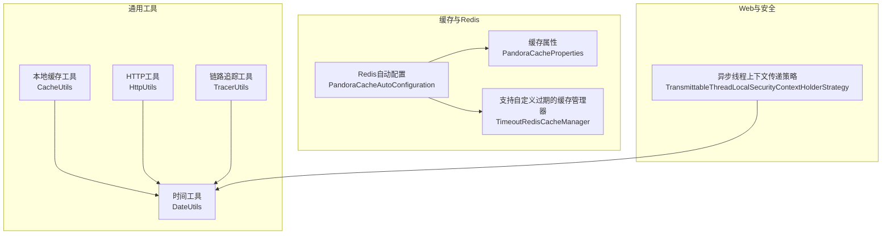
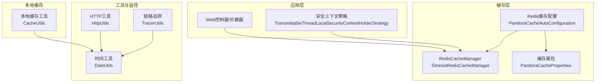
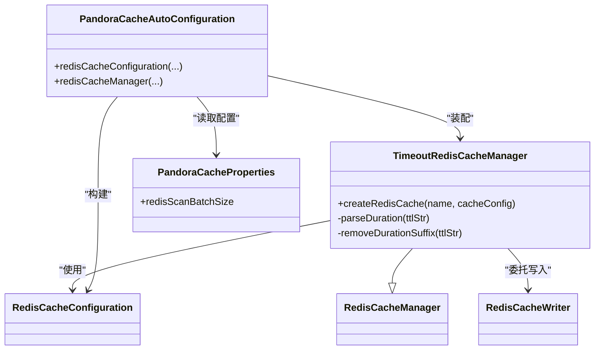
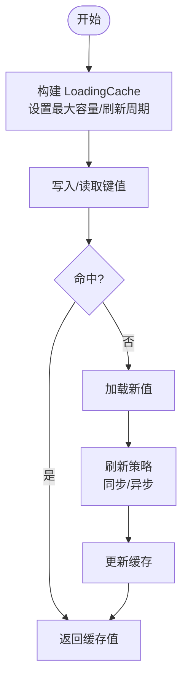
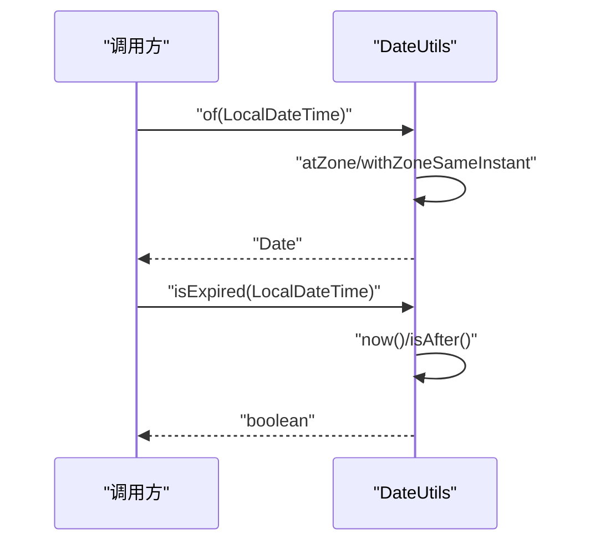
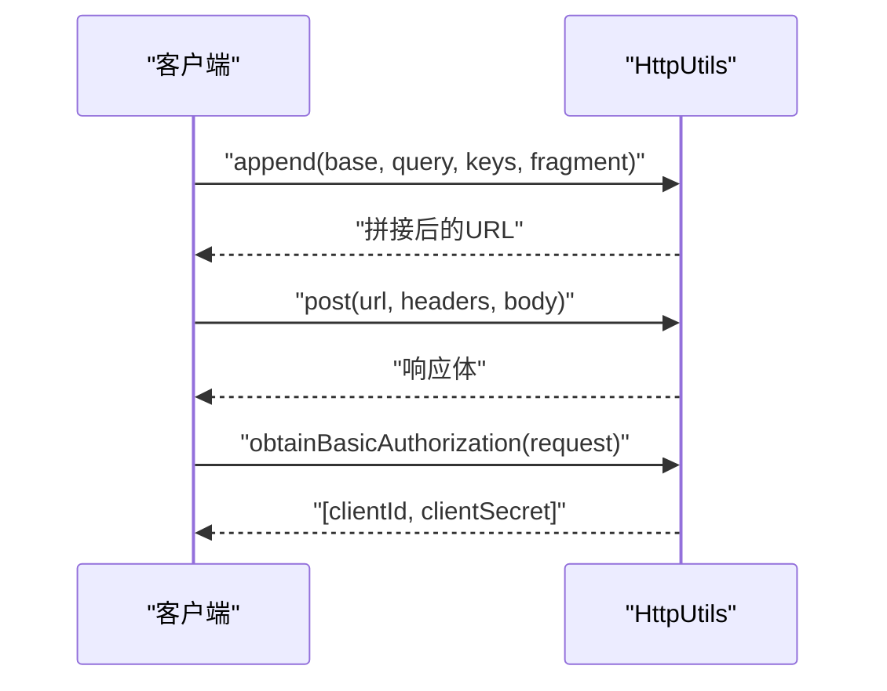
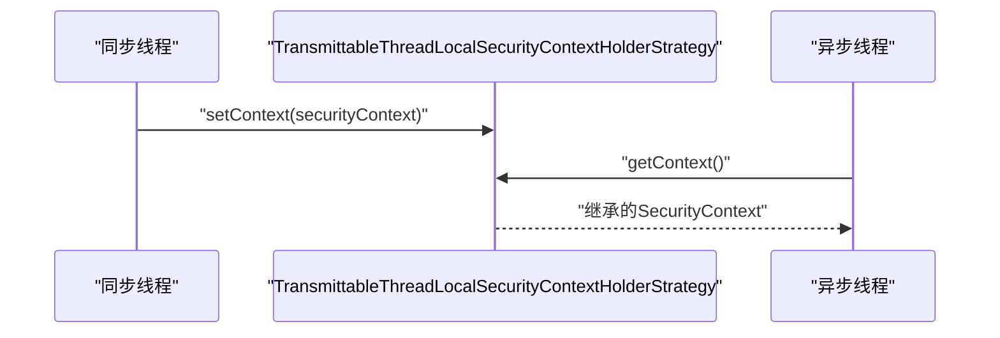
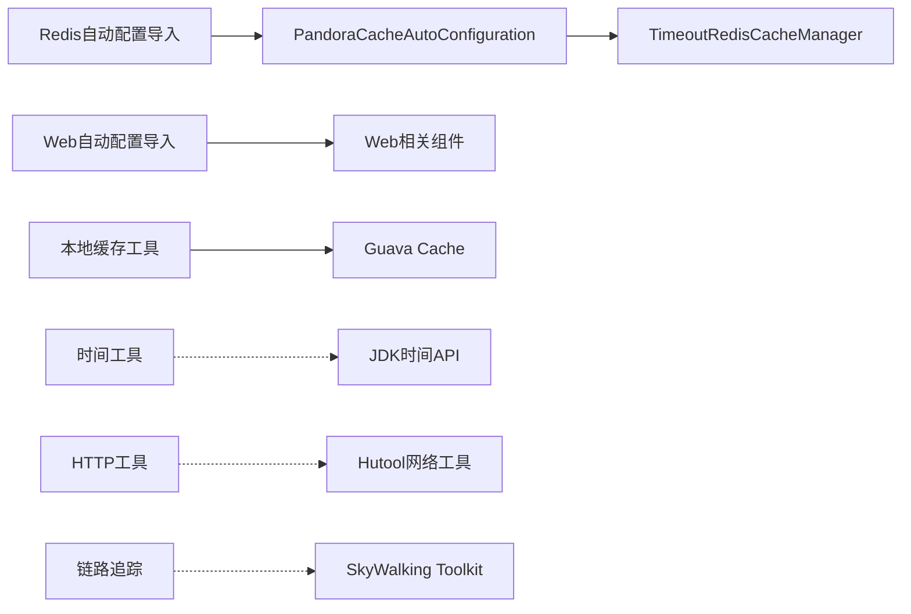

# 性能优化

<cite>
**本文引用的文件**
- [TimeoutRedisCacheManager.java](file://pandora-framework/pandora-spring-boot-starter-redis/src/main/java/net/ittimeline/pandora/framework/redis/core/TimeoutRedisCacheManager.java)
- [PandoraCacheAutoConfiguration.java](file://pandora-framework/pandora-spring-boot-starter-redis/src/main/java/net/ittimeline/pandora/framework/redis/config/PandoraCacheAutoConfiguration.java)
- [PandoraCacheProperties.java](file://pandora-framework/pandora-spring-boot-starter-redis/src/main/java/net/ittimeline/pandora/framework/redis/config/PandoraCacheProperties.java)
- [CacheUtils.java](file://pandora-framework/pandora-common/src/main/java/net/ittimeline/pandora/framework/common/util/web/cache/CacheUtils.java)
- [DateUtils.java](file://pandora-framework/pandora-common/src/main/java/net/ittimeline/pandora/framework/common/util/foundational/date/DateUtils.java)
- [HttpUtils.java](file://pandora-framework/pandora-common/src/main/java/net/ittimeline/pandora/framework/common/util/web/http/HttpUtils.java)
- [TracerUtils.java](file://pandora-framework/pandora-common/src/main/java/net/ittimeline/pandora/framework/common/util/web/monitor/TracerUtils.java)
- [TransmittableThreadLocalSecurityContextHolderStrategy.java](file://pandora-framework/pandora-spring-boot-starter-security/src/main/java/net/ittimeline/pandora/framework/security/core/context/TransmittableThreadLocalSecurityContextHolderStrategy.java)
- [org.springframework.boot.autoconfigure.AutoConfiguration.imports（Redis）](file://pandora-framework/pandora-spring-boot-starter-redis/src/main/resources/META-INF/spring/org.springframework.boot.autoconfigure.AutoConfiguration.imports)
- [org.springframework.boot.autoconfigure.AutoConfiguration.imports（Web）](file://pandora-framework/pandora-spring-boot-starter-web/src/main/resources/META-INF/spring/org.springframework.boot.autoconfigure.AutoConfiguration.imports)
</cite>

## 目录
1. [简介](#简介)
2. [项目结构](#项目结构)
3. [核心组件](#核心组件)
4. [架构总览](#架构总览)
5. [详细组件分析](#详细组件分析)
6. [依赖分析](#依赖分析)
7. [性能考虑](#性能考虑)
8. [故障排查指南](#故障排查指南)
9. [结论](#结论)
10. [附录](#附录)

## 简介
本指南面向Pandora Cloud框架的性能优化，聚焦以下方面：
- 缓存策略：重点讲解TimeoutRedisCacheManager的配置与使用、Redis扫描批大小、序列化策略与键前缀计算。
- 数据库查询优化：结合分页与排序工具、避免N+1、合理使用索引与投影。
- 内存管理最佳实践：Guava本地缓存的容量与刷新策略、线程安全与异步刷新。
- 时间处理优化：DateUtils高效使用与时区处理。
- 网络请求优化：HTTP工具类的URL构建、编码/解码与请求封装。
- 资源池配置：线程池与连接池的建议与注意事项。
- 性能监控：链路追踪与可观测性指标采集。
- 高并发设计：异步处理、线程上下文传递、负载均衡与限流。
- JVM参数与GC优化：JVM参数建议与GC调优思路。

## 项目结构
Pandora Cloud框架采用多模块划分，性能相关能力主要分布在：
- 缓存与Redis：pandora-spring-boot-starter-redis
- 通用工具与监控：pandora-common
- Web与安全：pandora-spring-boot-starter-web、pandora-spring-boot-starter-security

图表来源
- [PandoraCacheAutoConfiguration.java:31-84](file://pandora-framework/pandora-spring-boot-starter-redis/src/main/java/net/ittimeline/pandora/framework/redis/config/PandoraCacheAutoConfiguration.java#L31-L84)
- [PandoraCacheProperties.java:14-29](file://pandora-framework/pandora-spring-boot-starter-redis/src/main/java/net/ittimeline/pandora/framework/redis/config/PandoraCacheProperties.java#L14-L29)
- [TimeoutRedisCacheManager.java:19-85](file://pandora-framework/pandora-spring-boot-starter-redis/src/main/java/net/ittimeline/pandora/framework/redis/core/TimeoutRedisCacheManager.java#L19-L85)
- [CacheUtils.java:16-60](file://pandora-framework/pandora-common/src/main/java/net/ittimeline/pandora/framework/common/util/web/cache/CacheUtils.java#L16-L60)
- [DateUtils.java:16-150](file://pandora-framework/pandora-common/src/main/java/net/ittimeline/pandora/framework/common/util/foundational/date/DateUtils.java#L16-L150)
- [HttpUtils.java:26-203](file://pandora-framework/pandora-common/src/main/java/net/ittimeline/pandora/framework/common/util/web/http/HttpUtils.java#L26-L203)
- [TracerUtils.java:12-29](file://pandora-framework/pandora-common/src/main/java/net/ittimeline/pandora/framework/common/util/web/monitor/TracerUtils.java#L12-L29)
- [TransmittableThreadLocalSecurityContextHolderStrategy.java:17-50](file://pandora-framework/pandora-spring-boot-starter-security/src/main/java/net/ittimeline/pandora/framework/security/core/context/TransmittableThreadLocalSecurityContextHolderStrategy.java#L17-L50)

章节来源
- [org.springframework.boot.autoconfigure.AutoConfiguration.imports（Redis）:1-2](file://pandora-framework/pandora-spring-boot-starter-redis/src/main/resources/META-INF/spring/org.springframework.boot.autoconfigure.AutoConfiguration.imports#L1-L2)
- [org.springframework.boot.autoconfigure.AutoConfiguration.imports（Web）:1-8](file://pandora-framework/pandora-spring-boot-starter-web/src/main/resources/META-INF/spring/org.springframework.boot.autoconfigure.AutoConfiguration.imports#L1-L8)

## 核心组件
- TimeoutRedisCacheManager：在默认RedisCacheManager基础上扩展“按缓存名动态设置TTL”的能力，支持在缓存名中通过特定分隔符携带过期时间。
- Redis缓存自动配置：负责RedisCacheConfiguration的定制（键前缀、序列化、TTL、是否缓存null等），并注入TimeoutRedisCacheManager。
- 本地缓存工具：提供基于Guava的LoadingCache构建方法，支持同步与异步刷新，限制最大容量。
- 时间工具：提供Date与LocalDateTime互转、时间比较、构建指定时间、当日/昨日判断等常用方法。
- HTTP工具：提供URL编码/解码、参数拼接、Basic鉴权提取、GET/POST请求封装。
- 链路追踪：基于SkyWalking Toolkit获取TraceId，便于跨服务定位性能瓶颈。
- 异步线程上下文传递：基于TransmittableThreadLocal保障@Async等异步场景下的安全上下文传递。

章节来源
- [TimeoutRedisCacheManager.java:19-85](file://pandora-framework/pandora-spring-boot-starter-redis/src/main/java/net/ittimeline/pandora/framework/redis/core/TimeoutRedisCacheManager.java#L19-L85)
- [PandoraCacheAutoConfiguration.java:31-84](file://pandora-framework/pandora-spring-boot-starter-redis/src/main/java/net/ittimeline/pandora/framework/redis/config/PandoraCacheAutoConfiguration.java#L31-L84)
- [PandoraCacheProperties.java:14-29](file://pandora-framework/pandora-spring-boot-starter-redis/src/main/java/net/ittimeline/pandora/framework/redis/config/PandoraCacheProperties.java#L14-L29)
- [CacheUtils.java:16-60](file://pandora-framework/pandora-common/src/main/java/net/ittimeline/pandora/framework/common/util/web/cache/CacheUtils.java#L16-L60)
- [DateUtils.java:16-150](file://pandora-framework/pandora-common/src/main/java/net/ittimeline/pandora/framework/common/util/foundational/date/DateUtils.java#L16-L150)
- [HttpUtils.java:26-203](file://pandora-framework/pandora-common/src/main/java/net/ittimeline/pandora/framework/common/util/web/http/HttpUtils.java#L26-L203)
- [TracerUtils.java:12-29](file://pandora-framework/pandora-common/src/main/java/net/ittimeline/pandora/framework/common/util/web/monitor/TracerUtils.java#L12-L29)
- [TransmittableThreadLocalSecurityContextHolderStrategy.java:17-50](file://pandora-framework/pandora-spring-boot-starter-security/src/main/java/net/ittimeline/pandora/framework/security/core/context/TransmittableThreadLocalSecurityContextHolderStrategy.java#L17-L50)

## 架构总览
下图展示缓存层、本地缓存与Web/安全层之间的交互关系，以及性能相关的关键配置点。

图表来源
- [PandoraCacheAutoConfiguration.java:31-84](file://pandora-framework/pandora-spring-boot-starter-redis/src/main/java/net/ittimeline/pandora/framework/redis/config/PandoraCacheAutoConfiguration.java#L31-L84)
- [PandoraCacheProperties.java:14-29](file://pandora-framework/pandora-spring-boot-starter-redis/src/main/java/net/ittimeline/pandora/framework/redis/config/PandoraCacheProperties.java#L14-L29)
- [TimeoutRedisCacheManager.java:19-85](file://pandora-framework/pandora-spring-boot-starter-redis/src/main/java/net/ittimeline/pandora/framework/redis/core/TimeoutRedisCacheManager.java#L19-L85)
- [CacheUtils.java:16-60](file://pandora-framework/pandora-common/src/main/java/net/ittimeline/pandora/framework/common/util/web/cache/CacheUtils.java#L16-L60)
- [DateUtils.java:16-150](file://pandora-framework/pandora-common/src/main/java/net/ittimeline/pandora/framework/common/util/foundational/date/DateUtils.java#L16-L150)
- [HttpUtils.java:26-203](file://pandora-framework/pandora-common/src/main/java/net/ittimeline/pandora/framework/common/util/web/http/HttpUtils.java#L26-L203)
- [TracerUtils.java:12-29](file://pandora-framework/pandora-common/src/main/java/net/ittimeline/pandora/framework/common/util/web/monitor/TracerUtils.java#L12-L29)
- [TransmittableThreadLocalSecurityContextHolderStrategy.java:17-50](file://pandora-framework/pandora-spring-boot-starter-security/src/main/java/net/ittimeline/pandora/framework/security/core/context/TransmittableThreadLocalSecurityContextHolderStrategy.java#L17-L50)

## 详细组件分析

### 缓存策略与TimeoutRedisCacheManager
- 动态TTL机制：通过在缓存名中使用特定分隔符携带过期时间字符串，解析后动态设置entryTtl，从而实现不同缓存项差异化过期。
- 键前缀与序列化：自动配置统一设置键前缀与JSON序列化，减少客户端差异带来的兼容问题；同时支持禁用null缓存与键前缀。
- 批量扫描：通过PandoraCacheProperties控制SCAN批大小，平衡CPU与网络开销。
- 与Spring Cache集成：作为@Cacheable/@CacheEvict等注解的底层实现，提升缓存命中率与生命周期可控性。

图表来源
- [TimeoutRedisCacheManager.java:19-85](file://pandora-framework/pandora-spring-boot-starter-redis/src/main/java/net/ittimeline/pandora/framework/redis/core/TimeoutRedisCacheManager.java#L19-L85)
- [PandoraCacheAutoConfiguration.java:31-84](file://pandora-framework/pandora-spring-boot-starter-redis/src/main/java/net/ittimeline/pandora/framework/redis/config/PandoraCacheAutoConfiguration.java#L31-L84)
- [PandoraCacheProperties.java:14-29](file://pandora-framework/pandora-spring-boot-starter-redis/src/main/java/net/ittimeline/pandora/framework/redis/config/PandoraCacheProperties.java#L14-L29)

章节来源
- [TimeoutRedisCacheManager.java:27-50](file://pandora-framework/pandora-spring-boot-starter-redis/src/main/java/net/ittimeline/pandora/framework/redis/core/TimeoutRedisCacheManager.java#L27-L50)
- [PandoraCacheAutoConfiguration.java:40-83](file://pandora-framework/pandora-spring-boot-starter-redis/src/main/java/net/ittimeline/pandora/framework/redis/config/PandoraCacheAutoConfiguration.java#L40-L83)
- [PandoraCacheProperties.java:17-29](file://pandora-framework/pandora-spring-boot-starter-redis/src/main/java/net/ittimeline/pandora/framework/redis/config/PandoraCacheProperties.java#L17-L29)

### 本地缓存与内存管理（Guava LoadingCache）
- 容量与刷新：默认最大容量限制，支持refreshAfterWrite与异步刷新，避免阻塞主请求线程。
- 异步刷新：通过CacheLoader.asyncReloading与线程池实现全异步加载，适合热点数据的平滑更新。
- 使用建议：与ThreadLocal相关场景优先使用同步刷新版本，避免上下文丢失；全局/系统级缓存可采用异步刷新。

图表来源
- [CacheUtils.java:37-59](file://pandora-framework/pandora-common/src/main/java/net/ittimeline/pandora/framework/common/util/web/cache/CacheUtils.java#L37-L59)

章节来源
- [CacheUtils.java:16-60](file://pandora-framework/pandora-common/src/main/java/net/ittimeline/pandora/framework/common/util/web/cache/CacheUtils.java#L16-L60)

### 时间处理优化（DateUtils）
- 统一时区与格式：提供默认时区常量与常用格式常量，避免重复创建格式化器与TimeZone实例。
- 高效转换：基于ZonedDateTime/Instant进行Date与LocalDateTime互转，减少时区转换成本。
- 便捷判断：提供isToday/isYesterday等方法，减少重复逻辑与边界错误。

图表来源
- [DateUtils.java:37-72](file://pandora-framework/pandora-common/src/main/java/net/ittimeline/pandora/framework/common/util/foundational/date/DateUtils.java#L37-L72)

章节来源
- [DateUtils.java:16-150](file://pandora-framework/pandora-common/src/main/java/net/ittimeline/pandora/framework/common/util/foundational/date/DateUtils.java#L16-L150)

### 网络请求优化（HttpUtils）
- URL构建与编码：提供URL拼接、参数替换、移除query/fragment与fragment编码，确保URI合法与安全。
- Basic认证：从Header或参数中提取client_id/client_secret，支持Base64解码。
- GET/POST封装：支持传入headers与请求体，简化外部HTTP调用。

图表来源
- [HttpUtils.java:93-141](file://pandora-framework/pandora-common/src/main/java/net/ittimeline/pandora/framework/common/util/web/http/HttpUtils.java#L93-L141)
- [HttpUtils.java:177-201](file://pandora-framework/pandora-common/src/main/java/net/ittimeline/pandora/framework/common/util/web/http/HttpUtils.java#L177-L201)
- [HttpUtils.java:144-165](file://pandora-framework/pandora-common/src/main/java/net/ittimeline/pandora/framework/common/util/web/http/HttpUtils.java#L144-L165)

章节来源
- [HttpUtils.java:26-203](file://pandora-framework/pandora-common/src/main/java/net/ittimeline/pandora/framework/common/util/web/http/HttpUtils.java#L26-L203)

### 异步处理与线程上下文传递
- 线程上下文传递：基于TransmittableThreadLocal保证@Async等异步场景下的SecurityContext可用，避免上下文丢失导致的权限失效。
- 适用场景：异步任务、定时任务、消息消费等。

图表来源
- [TransmittableThreadLocalSecurityContextHolderStrategy.java:17-50](file://pandora-framework/pandora-spring-boot-starter-security/src/main/java/net/ittimeline/pandora/framework/security/core/context/TransmittableThreadLocalSecurityContextHolderStrategy.java#L17-L50)

章节来源
- [TransmittableThreadLocalSecurityContextHolderStrategy.java:17-50](file://pandora-framework/pandora-spring-boot-starter-security/src/main/java/net/ittimeline/pandora/framework/security/core/context/TransmittableThreadLocalSecurityContextHolderStrategy.java#L17-L50)

### 链路追踪与性能监控
- TraceId获取：通过TracerUtils.getTraceId获取SkyWalking TraceId，便于跨服务定位慢调用与异常。
- 建议指标：QPS、P99延迟、错误率、缓存命中率、Redis命令耗时、线程池队列长度、GC时间占比。

章节来源
- [TracerUtils.java:12-29](file://pandora-framework/pandora-common/src/main/java/net/ittimeline/pandora/framework/common/util/web/monitor/TracerUtils.java#L12-L29)

## 依赖分析
- 自动配置导入：Redis与Web模块分别声明了各自的AutoConfiguration，确保缓存与Web功能按需启用。
- 组件耦合：TimeoutRedisCacheManager依赖RedisCacheConfiguration与RedisCacheWriter；CacheUtils独立于Spring上下文，仅依赖Guava；DateUtils/HttpUtils/TracerUtils均为纯工具类，低耦合高内聚。

图表来源
- [org.springframework.boot.autoconfigure.AutoConfiguration.imports（Redis）:1-2](file://pandora-framework/pandora-spring-boot-starter-redis/src/main/resources/META-INF/spring/org.springframework.boot.autoconfigure.AutoConfiguration.imports#L1-L2)
- [org.springframework.boot.autoconfigure.AutoConfiguration.imports（Web）:1-8](file://pandora-framework/pandora-spring-boot-starter-web/src/main/resources/META-INF/spring/org.springframework.boot.autoconfigure.AutoConfiguration.imports#L1-L8)
- [CacheUtils.java:3-8](file://pandora-framework/pandora-common/src/main/java/net/ittimeline/pandora/framework/common/util/web/cache/CacheUtils.java#L3-L8)
- [DateUtils.java:3-7](file://pandora-framework/pandora-common/src/main/java/net/ittimeline/pandora/framework/common/util/foundational/date/DateUtils.java#L3-L7)
- [HttpUtils.java:3-11](file://pandora-framework/pandora-common/src/main/java/net/ittimeline/pandora/framework/common/util/web/http/HttpUtils.java#L3-L11)
- [TracerUtils.java](file://pandora-framework/pandora-common/src/main/java/net/ittimeline/pandora/framework/common/util/web/monitor/TracerUtils.java#L3)

章节来源
- [org.springframework.boot.autoconfigure.AutoConfiguration.imports（Redis）:1-2](file://pandora-framework/pandora-spring-boot-starter-redis/src/main/resources/META-INF/spring/org.springframework.boot.autoconfigure.AutoConfiguration.imports#L1-L2)
- [org.springframework.boot.autoconfigure.AutoConfiguration.imports（Web）:1-8](file://pandora-framework/pandora-spring-boot-starter-web/src/main/resources/META-INF/spring/org.springframework.boot.autoconfigure.AutoConfiguration.imports#L1-L8)

## 性能考虑
- 缓存策略
  - 使用TimeoutRedisCacheManager在缓存名中携带TTL，实现差异化过期；避免全局统一TTL导致的热点失效。
  - 控制Redis SCAN批大小，平衡CPU与网络占用；在高并发场景下适当增大批大小降低遍历次数。
  - 键前缀与JSON序列化：统一键前缀避免冲突，JSON序列化减少反序列化开销。
- 本地缓存
  - 限制最大容量，防止内存膨胀；对热点数据采用异步刷新，降低主请求路径阻塞。
- 时间处理
  - 复用格式化器与时区常量，避免频繁创建对象；使用isToday/isYesterday等方法减少边界判断复杂度。
- 网络请求
  - 使用HttpUtils的URL拼接与编码方法，避免手动拼接导致的URI错误；统一headers传递，减少重复代码。
- 异步与线程上下文
  - 在@Async等异步场景使用TransmittableThreadLocal策略，避免上下文丢失引发的鉴权失败。
- 监控与指标
  - 结合TracerUtils获取TraceId，定位慢调用；关注QPS、P99、错误率、缓存命中率、GC时间占比等关键指标。

[本节为通用指导，无需列出具体文件来源]

## 故障排查指南
- 缓存相关
  - TTL未生效：检查缓存名是否包含正确的分隔符与TTL字符串；确认parseDuration逻辑是否匹配后缀单位。
  - 键冲突：检查键前缀生成逻辑与命名规范；避免使用特殊字符导致的键解析异常。
  - Redis扫描慢：调整PandoraCacheProperties中的redisScanBatchSize，观察CPU与网络占用变化。
- 本地缓存
  - OOM风险：核对最大容量配置与数据规模；对大对象谨慎放入本地缓存。
  - 刷新阻塞：若出现主线程等待，切换为异步刷新或缩短刷新周期。
- 时间处理
  - 时区偏差：确认系统默认时区与业务期望一致；使用DateUtils提供的默认时区常量。
- 网络请求
  - URL非法：使用HttpUtils的append方法进行参数拼接；避免手动拼接导致的编码问题。
  - 认证失败：检查Basic认证提取逻辑，确保Header或参数中存在client_id/client_secret。
- 异步上下文
  - 权限丢失：确认是否使用TransmittableThreadLocalSecurityContextHolderStrategy；在异步任务中显式传递上下文。

章节来源
- [TimeoutRedisCacheManager.java:27-82](file://pandora-framework/pandora-spring-boot-starter-redis/src/main/java/net/ittimeline/pandora/framework/redis/core/TimeoutRedisCacheManager.java#L27-L82)
- [PandoraCacheAutoConfiguration.java:40-83](file://pandora-framework/pandora-spring-boot-starter-redis/src/main/java/net/ittimeline/pandora/framework/redis/config/PandoraCacheAutoConfiguration.java#L40-L83)
- [PandoraCacheProperties.java:17-29](file://pandora-framework/pandora-spring-boot-starter-redis/src/main/java/net/ittimeline/pandora/framework/redis/config/PandoraCacheProperties.java#L17-L29)
- [CacheUtils.java:37-59](file://pandora-framework/pandora-common/src/main/java/net/ittimeline/pandora/framework/common/util/web/cache/CacheUtils.java#L37-L59)
- [DateUtils.java:18-30](file://pandora-framework/pandora-common/src/main/java/net/ittimeline/pandora/framework/common/util/foundational/date/DateUtils.java#L18-L30)
- [HttpUtils.java:93-141](file://pandora-framework/pandora-common/src/main/java/net/ittimeline/pandora/framework/common/util/web/http/HttpUtils.java#L93-L141)
- [TransmittableThreadLocalSecurityContextHolderStrategy.java:17-50](file://pandora-framework/pandora-spring-boot-starter-security/src/main/java/net/ittimeline/pandora/framework/security/core/context/TransmittableThreadLocalSecurityContextHolderStrategy.java#L17-L50)

## 结论
通过合理配置TimeoutRedisCacheManager、优化本地缓存策略、规范时间与网络处理、强化异步上下文传递与链路追踪，可在Pandora Cloud框架上实现稳定高效的高并发系统。建议在生产环境持续监控关键指标，结合TraceId快速定位瓶颈，并根据业务特征动态调整缓存与资源池参数。

[本节为总结性内容，无需列出具体文件来源]

## 附录
- 高并发设计原则
  - 读多写少场景优先使用缓存；写多场景采用分布式锁与削峰填谷。
  - 异步化非核心流程，保留同步链路最小化。
  - 负载均衡与限流：前置网关/反向代理层做流量治理，服务端结合线程池与信号量限流。
- JVM参数与GC优化
  - 建议开启G1GC并设置合适的堆大小；关注Full GC频率与停顿时间。
  - 通过JFR/JMX采集GC日志，结合业务峰值QPS与响应时间评估堆大小与GC策略。
- 系统资源监控建议
  - CPU：核心线程数、队列长度、阻塞比例。
  - 内存：堆/元空间使用率、GC时间占比、对象晋升速率。
  - 网络：连接数、RTT、丢包率。
  - 存储：磁盘IO、文件句柄数、临时文件清理。

[本节为通用指导，无需列出具体文件来源]