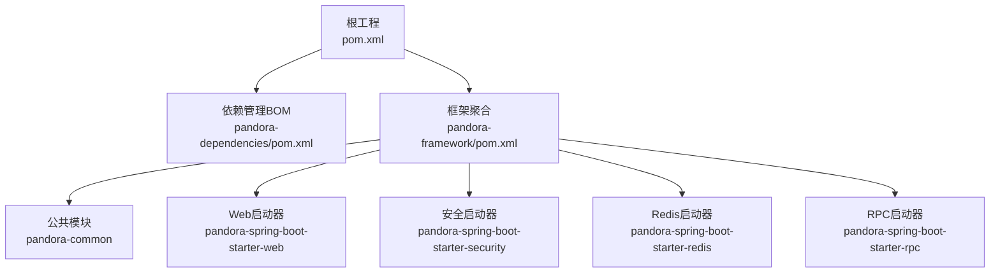
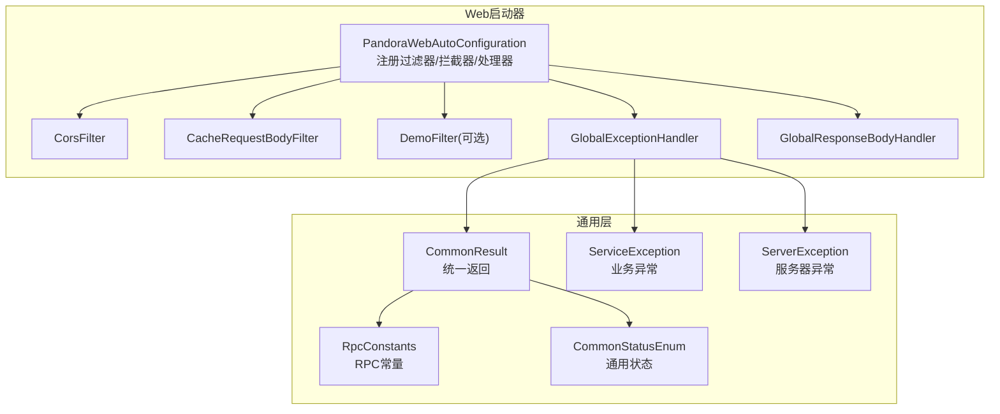
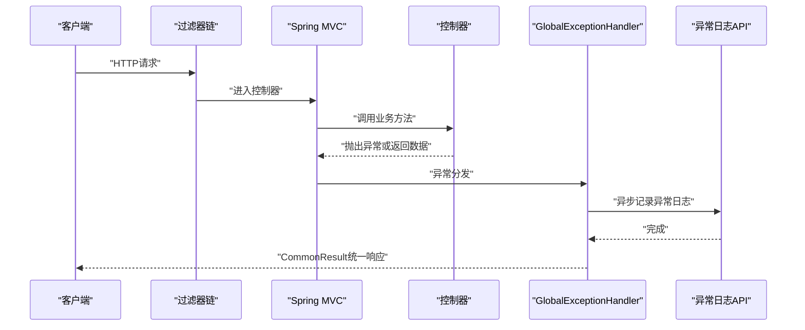
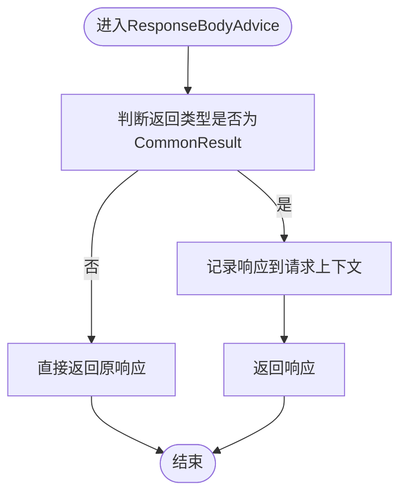
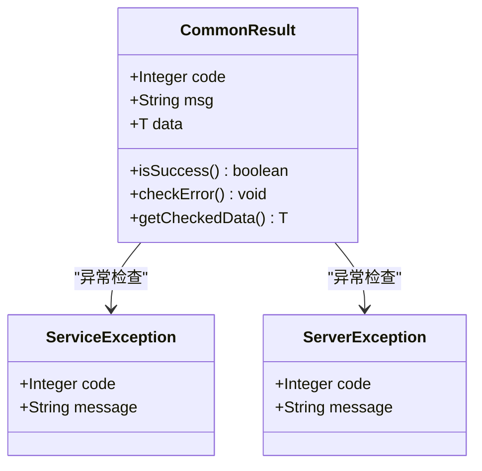
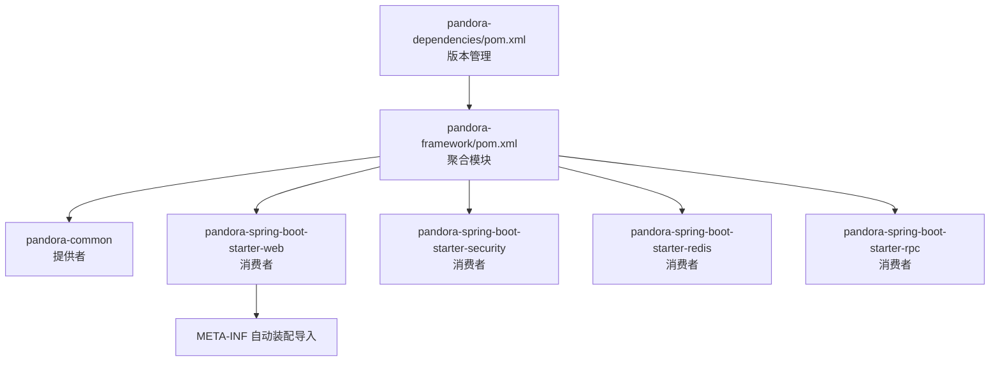

# 最佳实践

<cite>
**本文引用的文件**
- [README.md](file://README.md)
- [根POM](file://pom.xml)
- [框架聚合POM](file://pandora-framework/pom.xml)
- [公共模块POM](file://pandora-framework/pandora-common/pom.xml)
- [Web启动器自动装配](file://pandora-framework/pandora-spring-boot-starter-web/src/main/java/net/ittimeline/pandora/framework/web/config/PandoraWebAutoConfiguration.java)
- [全局异常处理器](file://pandora-framework/pandora-spring-boot-starter-web/src/main/java/net/ittimeline/pandora/framework/web/core/handler/GlobalExceptionHandler.java)
- [全局响应处理器](file://pandora-framework/pandora-spring-boot-starter-web/src/main/java/net/ittimeline/pandora/framework/web/core/handler/GlobalResponseBodyHandler.java)
- [通用返回对象](file://pandora-framework/pandora-common/src/main/java/net/ittimeline/pandora/framework/common/pojo/CommonResult.java)
- [业务异常](file://pandora-framework/pandora-common/src/main/java/net/ittimeline/pandora/framework/common/exception/ServiceException.java)
- [服务器异常](file://pandora-framework/pandora-common/src/main/java/net/ittimeline/pandora/framework/common/exception/ServerException.java)
- [RPC常量](file://pandora-framework/pandora-common/src/main/java/net/ittimeline/pandora/framework/common/constants/RpcConstants.java)
- [通用状态枚举](file://pandora-framework/pandora-common/src/main/java/net/ittimeline/pandora/framework/common/enums/CommonStatusEnum.java)
- [自动翻译接口](file://pandora-framework/pandora-common/src/main/java/com/fhs/trans/service/AutoTransable.java)
- [Web自动装配导入清单](file://pandora-framework/pandora-spring-boot-starter-web/src/main/resources/META-INF/spring/org.springframework.boot.autoconfigure.AutoConfiguration.imports)
- [依赖管理BOM](file://pandora-dependencies/pom.xml)
</cite>

## 目录
1. [引言](#引言)
2. [项目结构](#项目结构)
3. [核心组件](#核心组件)
4. [架构总览](#架构总览)
5. [详细组件分析](#详细组件分析)
6. [依赖分析](#依赖分析)
7. [性能考虑](#性能考虑)
8. [故障排查指南](#故障排查指南)
9. [结论](#结论)
10. [附录](#附录)

## 引言
本最佳实践文档面向在微服务架构下使用 Pandora Cloud 框架的团队，目标是帮助团队建立统一的项目结构、代码规范、开发标准与工程化实践。内容覆盖：
- 项目结构与模块职责
- 代码规范与开发标准
- 性能优化策略与安全考虑
- 错误处理模式与日志记录最佳实践
- 工具类使用方法与异常统一模式
- 配置管理规范
- 微服务设计原则与代码复用策略
- 测试驱动开发方法
- 团队协作、代码审查与持续集成最佳实践

## 项目结构
Pandora Cloud 采用多模块聚合结构，以 Maven BOM 管理版本，核心模块包括：
- pandora-dependencies：统一依赖版本管理
- pandora-framework：框架组件聚合
  - pandora-common：通用POJO、枚举、异常、工具类
  - pandora-spring-boot-starter-web：Web层组件（过滤器、拦截器、全局异常、响应包装）
  - pandora-spring-boot-starter-security：安全组件（认证、授权、上下文传递）
  - pandora-spring-boot-starter-redis：缓存组件（自动装配、超时缓存管理器）
  - pandora-spring-boot-starter-rpc：RPC组件（预留）

图表来源
- [根POM](file://pom.xml)
- [框架聚合POM](file://pandora-framework/pom.xml)
- [依赖管理BOM](file://pandora-dependencies/pom.xml)

章节来源
- [README.md](file://README.md)
- [框架聚合POM](file://pandora-framework/pom.xml)

## 核心组件
- 通用返回对象：统一对外响应结构，内含错误码、消息与数据体，提供成功/失败判断与异常检查能力。
- 业务异常与服务器异常：区分业务异常与系统异常，便于前端与网关统一处理。
- Web全局异常处理：覆盖参数校验、类型转换、资源不存在、权限不足、系统异常等场景，统一返回格式并异步记录异常日志。
- Web全局响应处理：仅记录返回为通用结果类型的响应，用于访问日志采集。
- RPC常量与通用状态枚举：统一RPC服务命名与状态枚举，便于跨模块一致性。

章节来源
- [通用返回对象](file://pandora-framework/pandora-common/src/main/java/net/ittimeline/pandora/framework/common/pojo/CommonResult.java)
- [业务异常](file://pandora-framework/pandora-common/src/main/java/net/ittimeline/pandora/framework/common/exception/ServiceException.java)
- [服务器异常](file://pandora-framework/pandora-common/src/main/java/net/ittimeline/pandora/framework/common/exception/ServerException.java)
- [全局异常处理器](file://pandora-framework/pandora-spring-boot-starter-web/src/main/java/net/ittimeline/pandora/framework/web/core/handler/GlobalExceptionHandler.java)
- [全局响应处理器](file://pandora-framework/pandora-spring-boot-starter-web/src/main/java/net/ittimeline/pandora/framework/web/core/handler/GlobalResponseBodyHandler.java)
- [RPC常量](file://pandora-framework/pandora-common/src/main/java/net/ittimeline/pandora/framework/common/constants/RpcConstants.java)
- [通用状态枚举](file://pandora-framework/pandora-common/src/main/java/net/ittimeline/pandora/framework/common/enums/CommonStatusEnum.java)

## 架构总览
Web 启动器通过自动装配注册过滤器、拦截器、全局异常处理器与响应处理器；同时根据配置动态添加路径前缀与跨域支持；异常处理器负责将各类异常转换为统一的通用返回结构，并异步记录异常日志。

图表来源
- [Web启动器自动装配](file://pandora-framework/pandora-spring-boot-starter-web/src/main/java/net/ittimeline/pandora/framework/web/config/PandoraWebAutoConfiguration.java)
- [全局异常处理器](file://pandora-framework/pandora-spring-boot-starter-web/src/main/java/net/ittimeline/pandora/framework/web/core/handler/GlobalExceptionHandler.java)
- [全局响应处理器](file://pandora-framework/pandora-spring-boot-starter-web/src/main/java/net/ittimeline/pandora/framework/web/core/handler/GlobalResponseBodyHandler.java)
- [通用返回对象](file://pandora-framework/pandora-common/src/main/java/net/ittimeline/pandora/framework/common/pojo/CommonResult.java)
- [业务异常](file://pandora-framework/pandora-common/src/main/java/net/ittimeline/pandora/framework/common/exception/ServiceException.java)
- [服务器异常](file://pandora-framework/pandora-common/src/main/java/net/ittimeline/pandora/framework/common/exception/ServerException.java)
- [RPC常量](file://pandora-framework/pandora-common/src/main/java/net/ittimeline/pandora/framework/common/constants/RpcConstants.java)
- [通用状态枚举](file://pandora-framework/pandora-common/src/main/java/net/ittimeline/pandora/framework/common/enums/CommonStatusEnum.java)

## 详细组件分析

### 组件A：Web全局异常处理流程
- 覆盖范围：参数缺失/类型不匹配、参数校验失败、消息不可读、资源不存在、请求方法/媒体类型不支持、权限不足、业务异常、系统异常兜底、缓存加载异常穿透等。
- 处理策略：统一转为通用返回；业务异常按需忽略特定提示防止刷屏；系统异常记录异常日志并返回通用错误码。
- 异步记录：通过API异步写入错误日志，避免阻塞主线程。

图表来源
- [全局异常处理器](file://pandora-framework/pandora-spring-boot-starter-web/src/main/java/net/ittimeline/pandora/framework/web/core/handler/GlobalExceptionHandler.java)
- [通用返回对象](file://pandora-framework/pandora-common/src/main/java/net/ittimeline/pandora/framework/common/pojo/CommonResult.java)

章节来源
- [全局异常处理器](file://pandora-framework/pandora-spring-boot-starter-web/src/main/java/net/ittimeline/pandora/framework/web/core/handler/GlobalExceptionHandler.java)

### 组件B：Web全局响应处理流程
- 作用：仅对返回类型为通用结果的响应进行“记录”，用于后续访问日志采集。
- 设计原则：不改变控制器返回结构，避免AOP侵入业务返回值。

图表来源
- [全局响应处理器](file://pandora-framework/pandora-spring-boot-starter-web/src/main/java/net/ittimeline/pandora/framework/web/core/handler/GlobalResponseBodyHandler.java)
- [通用返回对象](file://pandora-framework/pandora-common/src/main/java/net/ittimeline/pandora/framework/common/pojo/CommonResult.java)

章节来源
- [全局响应处理器](file://pandora-framework/pandora-spring-boot-starter-web/src/main/java/net/ittimeline/pandora/framework/web/core/handler/GlobalResponseBodyHandler.java)

### 组件C：异常与返回对象关系
- 通用返回对象提供成功/失败判断与异常检查方法，便于在业务层快速断言与抛出业务异常。
- 业务异常与服务器异常分别承载业务错误与系统错误，便于前端与网关统一处理。

图表来源
- [通用返回对象](file://pandora-framework/pandora-common/src/main/java/net/ittimeline/pandora/framework/common/pojo/CommonResult.java)
- [业务异常](file://pandora-framework/pandora-common/src/main/java/net/ittimeline/pandora/framework/common/exception/ServiceException.java)
- [服务器异常](file://pandora-framework/pandora-common/src/main/java/net/ittimeline/pandora/framework/common/exception/ServerException.java)

章节来源
- [通用返回对象](file://pandora-framework/pandora-common/src/main/java/net/ittimeline/pandora/framework/common/pojo/CommonResult.java)
- [业务异常](file://pandora-framework/pandora-common/src/main/java/net/ittimeline/pandora/framework/common/exception/ServiceException.java)
- [服务器异常](file://pandora-framework/pandora-common/src/main/java/net/ittimeline/pandora/framework/common/exception/ServerException.java)

### 组件D：RPC常量与通用状态枚举
- RPC常量：统一RPC服务命名与前缀，确保跨模块一致性。
- 通用状态枚举：提供启用/禁用状态的统一判断与数组化，便于数据库存储与校验。

章节来源
- [RPC常量](file://pandora-framework/pandora-common/src/main/java/net/ittimeline/pandora/framework/common/constants/RpcConstants.java)
- [通用状态枚举](file://pandora-framework/pandora-common/src/main/java/net/ittimeline/pandora/framework/common/enums/CommonStatusEnum.java)

### 组件E：自动翻译接口
- AutoTransable：为VO自动翻译提供统一入口，支持按ID集合查询与全量查询，默认方法兼容旧实现。
- 设计要点：接口下沉至公共模块，便于API模块复用。

章节来源
- [自动翻译接口](file://pandora-framework/pandora-common/src/main/java/com/fhs/trans/service/AutoTransable.java)

## 依赖分析
- 依赖管理：通过BOM集中管理Spring Boot、Spring Cloud、Spring Cloud Alibaba以及各类生态组件版本，确保版本一致性与升级可控。
- Web启动器自动装配：通过META-INF导入清单自动装配Web相关组件，减少手动配置。
- 提供者与消费者：公共模块作为提供者，各启动器作为消费者，遵循“提供者稳定、消费者灵活”的依赖原则。

图表来源
- [依赖管理BOM](file://pandora-dependencies/pom.xml)
- [框架聚合POM](file://pandora-framework/pom.xml)
- [Web自动装配导入清单](file://pandora-framework/pandora-spring-boot-starter-web/src/main/resources/META-INF/spring/org.springframework.boot.autoconfigure.AutoConfiguration.imports)

章节来源
- [依赖管理BOM](file://pandora-dependencies/pom.xml)
- [Web自动装配导入清单](file://pandora-framework/pandora-spring-boot-starter-web/src/main/resources/META-INF/spring/org.springframework.boot.autoconfigure.AutoConfiguration.imports)

## 性能考虑
- 异常处理异步化：全局异常处理器在记录异常日志时采用异步方式，避免阻塞请求主线程。
- 过滤器顺序：跨域过滤器具有固定顺序，确保跨域配置生效，减少不必要的重试与错误。
- 响应处理最小侵入：全局响应处理器仅记录通用结果类型，避免对非统一返回结构造成额外开销。
- 依赖版本统一：通过BOM锁定版本，减少因版本不一致导致的性能回退与兼容性问题。

## 故障排查指南
- 参数校验失败：检查控制器参数注解与校验规则，确认异常处理器已捕获并返回统一格式。
- 资源不存在：确认NoHandlerFound/NoResourceFound异常已被处理并返回对应错误码。
- 权限不足：检查权限注解与拦截器链，确认AccessDeniedException被转换为统一错误码。
- 业务异常：通过业务异常对象携带的错误码与消息定位问题，必要时在异常处理器中调整忽略策略。
- 系统异常：查看异常日志记录，结合跟踪ID定位具体调用链路。

章节来源
- [全局异常处理器](file://pandora-framework/pandora-spring-boot-starter-web/src/main/java/net/ittimeline/pandora/framework/web/core/handler/GlobalExceptionHandler.java)

## 结论
Pandora Cloud 框架通过统一的异常处理、响应包装与配置自动装配，为微服务应用提供了标准化的基础设施。遵循本文的最佳实践，可在保证一致性的同时提升开发效率与系统稳定性。

## 附录

### 项目结构建议
- 模块划分：以功能域或业务域为单位拆分模块，公共能力下沉至公共模块，启动器模块提供自动装配能力。
- 依赖管理：统一使用BOM管理版本，避免版本漂移。
- 配置分离：环境配置与业务配置分离，启动器提供默认配置，业务模块按需覆盖。

### 代码规范与开发标准
- 异常分类：业务异常与系统异常明确分离，统一使用通用返回对象。
- 返回约定：控制器返回统一包装，避免直接返回原始对象。
- 日志规范：异常日志异步记录，避免影响请求性能。

### 性能优化策略
- 异步化：异常日志与耗时操作异步化。
- 过滤器顺序：合理设置过滤器顺序，减少重复处理。
- 依赖版本：通过BOM统一版本，降低兼容性成本。

### 安全考虑
- 权限控制：使用安全启动器提供的拦截与上下文传递机制。
- 输入校验：在控制器与服务层均进行输入校验，异常统一处理。
- 跨域配置：通过自动装配启用跨域，避免手动配置遗漏。

### 错误处理模式与日志记录最佳实践
- 统一异常处理：全局异常处理器覆盖常见异常类型，返回统一格式。
- 异步日志：异常日志异步写入，避免阻塞请求。
- 错误码规范：使用全局错误码常量，便于前端与网关统一处理。

### 工具类的正确使用方法
- AutoTransable：在VO翻译场景中实现该接口，提供按ID集合查询能力。
- 通用状态枚举：在状态字段中使用统一枚举，便于校验与展示。
- RPC常量：在RPC调用中使用统一前缀与服务名，避免硬编码。

### 配置管理规范做法
- BOM版本管理：通过依赖管理BOM集中管理版本。
- 自动装配：通过META-INF导入清单自动装配组件，减少手动配置。
- 启动器属性：启动器提供默认属性，业务模块按需覆盖。

### 微服务架构下的设计原则与代码复用策略
- 单一职责：公共模块提供通用能力，启动器提供自动装配。
- 低耦合：通过接口与抽象类实现能力复用，避免直接依赖具体实现。
- 可替换性：通过自动装配与SPI机制，支持不同实现的替换。

### 测试驱动开发方法
- 单元测试：针对异常处理与返回对象进行单元测试，验证统一格式。
- 集成测试：通过Mock异常场景，验证全局异常处理器行为。
- 性能测试：对异步日志与过滤器链进行性能压测，确保在高并发下的稳定性。

### 团队协作、代码审查与持续集成最佳实践
- 规范先行：制定统一的代码规范与目录结构，确保新成员快速上手。
- 代码审查：重点审查异常处理、返回对象使用与自动装配配置。
- 持续集成：在CI中加入静态检查、单元测试与集成测试，确保变更质量。