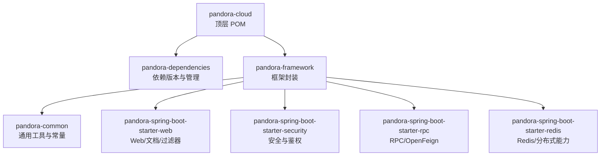
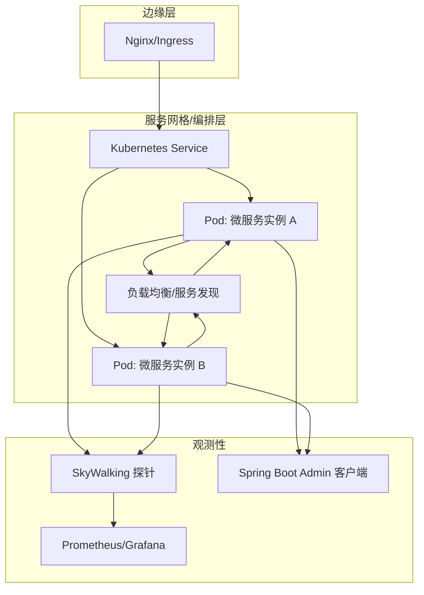
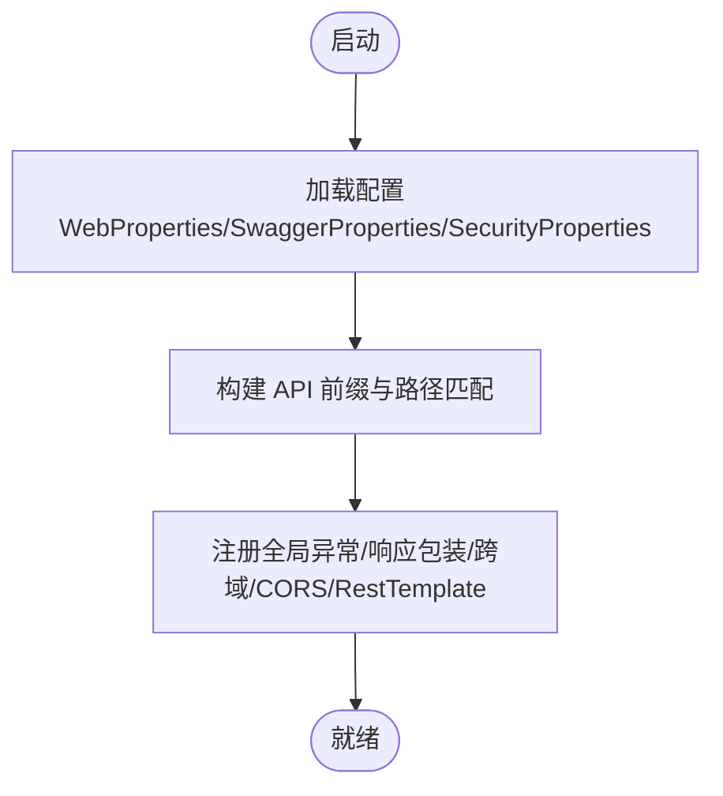
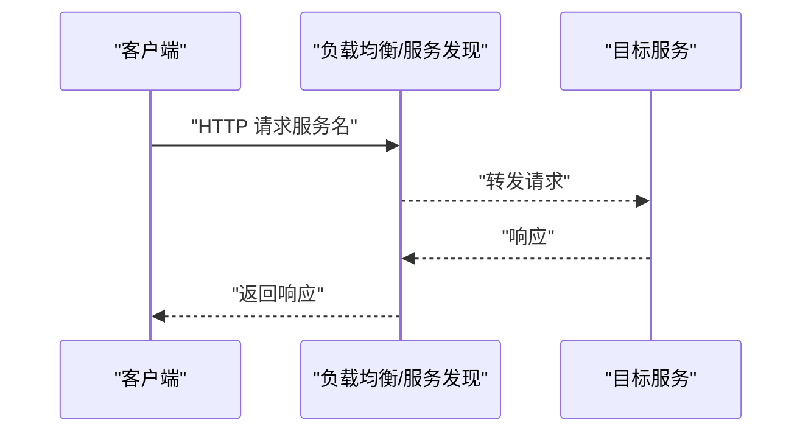
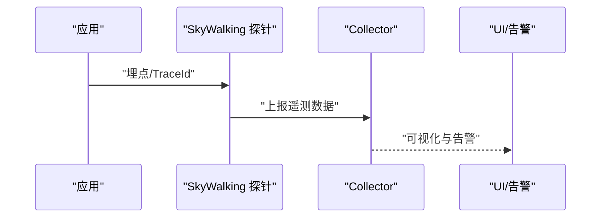
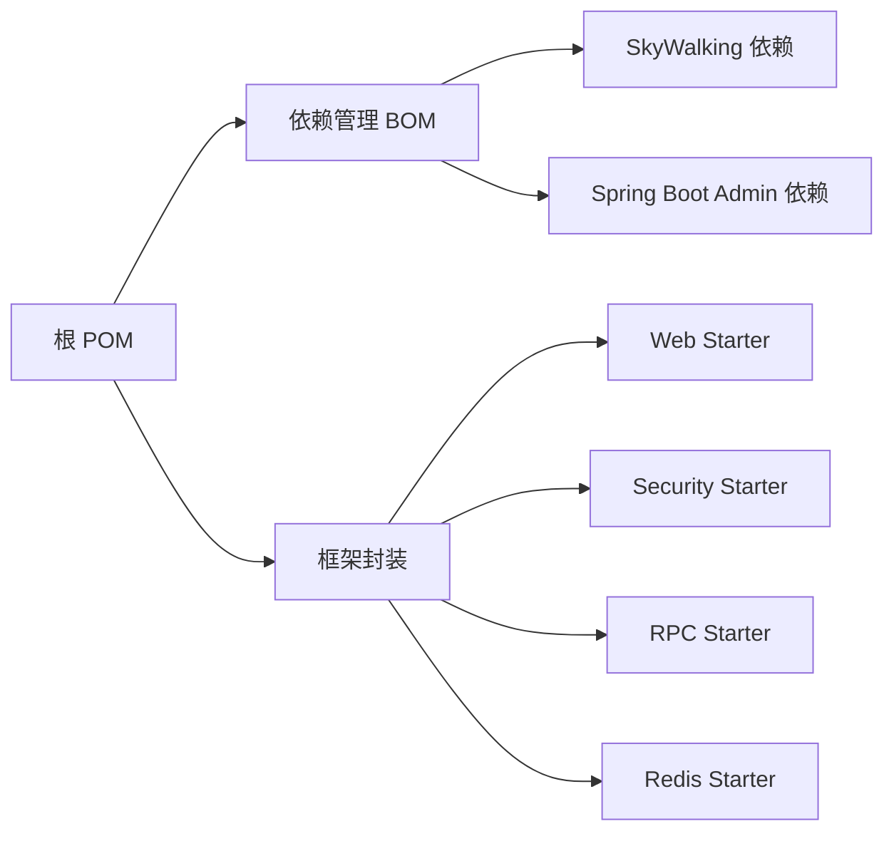

# 部署实践

<cite>
**本文引用的文件**
- [README.md](file://README.md)
- [pom.xml](file://pom.xml)
- [pandora-dependencies/pom.xml](file://pandora-dependencies/pom.xml)
- [pandora-framework/pandora-common/pom.xml](file://pandora-framework/pandora-common/pom.xml)
- [pandora-framework/pandora-spring-boot-starter-web/src/main/resources/META-INF/spring/org.springframework.boot.autoconfigure.AutoConfiguration.imports](file://pandora-framework/pandora-spring-boot-starter-web/src/main/resources/META-INF/spring/org.springframework.boot.autoconfigure.AutoConfiguration.imports)
- [pandora-framework/pandora-spring-boot-starter-web/src/main/java/net/ittimeline/pandora/framework/web/config/WebProperties.java](file://pandora-framework/pandora-spring-boot-starter-web/src/main/java/net/ittimeline/pandora/framework/web/config/WebProperties.java)
- [pandora-framework/pandora-spring-boot-starter-web/src/main/java/net/ittimeline/pandora/framework/web/config/PandoraWebAutoConfiguration.java](file://pandora-framework/pandora-spring-boot-starter-web/src/main/java/net/ittimeline/pandora/framework/web/config/PandoraWebAutoConfiguration.java)
- [pandora-framework/pandora-spring-boot-starter-web/src/main/java/net/ittimeline/pandora/framework/swagger/config/SwaggerProperties.java](file://pandora-framework/pandora-spring-boot-starter-web/src/main/java/net/ittimeline/pandora/framework/swagger/config/SwaggerProperties.java)
- [pandora-framework/pandora-spring-boot-starter-web/src/main/java/net/ittimeline/pandora/framework/swagger/config/PandoraSwaggerAutoConfiguration.java](file://pandora-framework/pandora-spring-boot-starter-web/src/main/java/net/ittimeline/pandora/framework/swagger/config/PandoraSwaggerAutoConfiguration.java)
- [pandora-framework/pandora-spring-boot-starter-security/src/main/java/net/ittimeline/pandora/framework/security/config/PandoraSecurityAutoConfiguration.java](file://pandora-framework/pandora-spring-boot-starter-security/src/main/java/net/ittimeline/pandora/framework/security/config/PandoraSecurityAutoConfiguration.java)
- [pandora-framework/pandora-spring-boot-starter-redis/src/main/java/net/ittimeline/pandora/framework/redis/config/PandoraRedisAutoConfiguration.java](file://pandora-framework/pandora-spring-boot-starter-redis/src/main/java/net/ittimeline/pandora/framework/redis/config/PandoraRedisAutoConfiguration.java)
- [pandora-framework/pandora-common/src/main/java/net/ittimeline/pandora/framework/common/util/web/monitor/TracerUtils.java](file://pandora-framework/pandora-common/src/main/java/net/ittimeline/pandora/framework/common/util/web/monitor/TracerUtils.java)
</cite>

## 目录
1. [简介](#简介)
2. [项目结构](#项目结构)
3. [核心组件](#核心组件)
4. [架构总览](#架构总览)
5. [详细组件分析](#详细组件分析)
6. [依赖关系分析](#依赖关系分析)
7. [性能考虑](#性能考虑)
8. [故障排查指南](#故障排查指南)
9. [结论](#结论)
10. [附录](#附录)

## 简介
本指南面向使用 Pandora Cloud 框架进行微服务部署的工程团队，围绕容器化与 Kubernetes 编排、环境变量与配置管理、动态配置更新、负载均衡与服务发现、熔断与降级、监控告警与日志链路追踪、以及蓝绿/灰度/滚动发布等主题，提供系统化的落地建议。文档中的技术要点均来自仓库中已存在的模块与自动配置，确保实践与代码实现保持一致。

## 项目结构
- 顶层采用多模块 Maven 结构，核心由“依赖管理”和“框架封装”两大模块组成。
- 框架封装内含多个 Spring Boot Starter，覆盖 Web、安全、RPC、缓存等能力，并通过 Spring Boot 的自动装配机制对外暴露。

图表来源
- [pom.xml:11-14](file://pom.xml#L11-L14)
- [pandora-dependencies/pom.xml:142-171](file://pandora-dependencies/pom.xml#L142-L171)

章节来源
- [README.md:1-15](file://README.md#L1-L15)
- [pom.xml:1-150](file://pom.xml#L1-L150)

## 核心组件
- Web 层：统一 API 前缀、跨域、全局异常、响应包装、负载均衡 RestTemplate、Knife4j/SpringDoc 文档。
- 安全层：基于 Token 的认证过滤器、权限处理、BCrypt 密码编码器、线程上下文策略。
- RPC 层：OpenFeign 客户端集成，便于服务间调用。
- 缓存层：RedisTemplate JSON 序列化定制，适配时间类型。
- 监控链路：SkyWalking 工具包与 Tracer 工具类，便于采集 TraceId。

章节来源
- [pandora-framework/pandora-spring-boot-starter-web/src/main/java/net/ittimeline/pandora/framework/web/config/PandoraWebAutoConfiguration.java:43-177](file://pandora-framework/pandora-spring-boot-starter-web/src/main/java/net/ittimeline/pandora/framework/web/config/PandoraWebAutoConfiguration.java#L43-L177)
- [pandora-framework/pandora-spring-boot-starter-web/src/main/java/net/ittimeline/pandora/framework/swagger/config/PandoraSwaggerAutoConfiguration.java:1-190](file://pandora-framework/pandora-spring-boot-starter-web/src/main/java/net/ittimeline/pandora/framework/swagger/config/PandoraSwaggerAutoConfiguration.java#L1-L190)
- [pandora-framework/pandora-spring-boot-starter-security/src/main/java/net/ittimeline/pandora/framework/security/config/PandoraSecurityAutoConfiguration.java:1-99](file://pandora-framework/pandora-spring-boot-starter-security/src/main/java/net/ittimeline/pandora/framework/security/config/PandoraSecurityAutoConfiguration.java#L1-L99)
- [pandora-framework/pandora-spring-boot-starter-redis/src/main/java/net/ittimeline/pandora/framework/redis/config/PandoraRedisAutoConfiguration.java:1-50](file://pandora-framework/pandora-spring-boot-starter-redis/src/main/java/net/ittimeline/pandora/framework/redis/config/PandoraRedisAutoConfiguration.java#L1-L50)
- [pandora-framework/pandora-common/src/main/java/net/ittimeline/pandora/framework/common/util/web/monitor/TracerUtils.java:1-29](file://pandora-framework/pandora-common/src/main/java/net/ittimeline/pandora/framework/common/util/web/monitor/TracerUtils.java#L1-L29)

## 架构总览
下图展示微服务在容器与 Kubernetes 中的典型部署形态：前端/网关通过 Ingress/Nginx 暴露服务；后端服务通过 Service 暴露；服务间调用通过负载均衡与 OpenFeign；链路追踪由 SkyWalking 探针采集；监控与告警由 Spring Boot Admin 与外部 APM 平台配合完成。

图表来源
- [pandora-framework/pandora-spring-boot-starter-web/src/main/java/net/ittimeline/pandora/framework/web/config/PandoraWebAutoConfiguration.java:171-175](file://pandora-framework/pandora-spring-boot-starter-web/src/main/java/net/ittimeline/pandora/framework/web/config/PandoraWebAutoConfiguration.java#L171-L175)
- [pandora-dependencies/pom.xml:299-339](file://pandora-dependencies/pom.xml#L299-L339)

## 详细组件分析

### 容器化与镜像构建策略
- 基础镜像选择：建议使用官方 OpenJDK 或 Amazon Corretto 基础镜像，确保运行时稳定。
- 多阶段构建：利用 Maven 编译产物，第一阶段构建，第二阶段仅复制运行时依赖与产物，减小镜像体积。
- 健康检查：在容器中暴露 Actuator 健康端点，结合 readiness/liveness 探针。
- 运行参数：通过 JVM 参数控制 GC、堆大小、线程栈等；通过环境变量注入配置（见“环境变量与配置管理”）。

### Kubernetes 编排配置要点
- Deployment：副本数、滚动更新策略（maxUnavailable / maxSurge）、资源请求与限制。
- Service：ClusterIP/NodePort/LoadBalancer，端口映射与会话亲和。
- ConfigMap/Secret：分离配置与敏感信息，支持热更新。
- HPA：基于 CPU/内存或自定义指标弹性扩缩容。
- Ingress：路径路由、TLS 终止、限流与重试策略。

### 环境变量与配置管理
- Web 前缀与 API 分组：通过 WebProperties 的前缀与包匹配，统一对外 API 前缀，避免文档与监控意外暴露。
- Swagger 文档：通过 SwaggerProperties 注入标题、描述、版本、联系人与许可证信息，便于自动化文档生成。
- 安全与密码：SecurityProperties 控制加密长度与策略，结合 Token 认证过滤器实现鉴权。
- Redis 序列化：RedisTemplate 使用 JSON 序列化，兼容时间类型，减少序列化问题。

图表来源
- [pandora-framework/pandora-spring-boot-starter-web/src/main/java/net/ittimeline/pandora/framework/web/config/WebProperties.java:18-45](file://pandora-framework/pandora-spring-boot-starter-web/src/main/java/net/ittimeline/pandora/framework/web/config/WebProperties.java#L18-L45)
- [pandora-framework/pandora-spring-boot-starter-web/src/main/java/net/ittimeline/pandora/framework/swagger/config/SwaggerProperties.java:14-59](file://pandora-framework/pandora-spring-boot-starter-web/src/main/java/net/ittimeline/pandora/framework/swagger/config/SwaggerProperties.java#L14-L59)
- [pandora-framework/pandora-spring-boot-starter-security/src/main/java/net/ittimeline/pandora/framework/security/config/PandoraSecurityAutoConfiguration.java:41-69](file://pandora-framework/pandora-spring-boot-starter-security/src/main/java/net/ittimeline/pandora/framework/security/config/PandoraSecurityAutoConfiguration.java#L41-L69)
- [pandora-framework/pandora-spring-boot-starter-redis/src/main/java/net/ittimeline/pandora/framework/redis/config/PandoraRedisAutoConfiguration.java:25-46](file://pandora-framework/pandora-spring-boot-starter-redis/src/main/java/net/ittimeline/pandora/framework/redis/config/PandoraRedisAutoConfiguration.java#L25-L46)

章节来源
- [pandora-framework/pandora-spring-boot-starter-web/src/main/java/net/ittimeline/pandora/framework/web/config/WebProperties.java:18-45](file://pandora-framework/pandora-spring-boot-starter-web/src/main/java/net/ittimeline/pandora/framework/web/config/WebProperties.java#L18-L45)
- [pandora-framework/pandora-spring-boot-starter-web/src/main/java/net/ittimeline/pandora/framework/swagger/config/SwaggerProperties.java:14-59](file://pandora-framework/pandora-spring-boot-starter-web/src/main/java/net/ittimeline/pandora/framework/swagger/config/SwaggerProperties.java#L14-L59)
- [pandora-framework/pandora-spring-boot-starter-security/src/main/java/net/ittimeline/pandora/framework/security/config/PandoraSecurityAutoConfiguration.java:41-69](file://pandora-framework/pandora-spring-boot-starter-security/src/main/java/net/ittimeline/pandora/framework/security/config/PandoraSecurityAutoConfiguration.java#L41-L69)
- [pandora-framework/pandora-spring-boot-starter-redis/src/main/java/net/ittimeline/pandora/framework/redis/config/PandoraRedisAutoConfiguration.java:25-46](file://pandora-framework/pandora-spring-boot-starter-redis/src/main/java/net/ittimeline/pandora/framework/redis/config/PandoraRedisAutoConfiguration.java#L25-L46)

### 动态配置更新
- ConfigMap/Secret 热更新：Kubernetes 支持挂载为卷并在键变更时触发 Pod 内部刷新（需应用支持）。对于 Spring Boot，可通过 RefreshScope 或重启 Pod 实现。
- 服务端点：启用 Actuator 的 refresh 端点，结合外部配置中心（如 Spring Cloud Config）实现集中管理与推送。
- 环境变量优先：容器环境变量可覆盖默认配置，便于不同环境快速切换。

### 负载均衡与服务发现
- 服务发现：通过 Kubernetes Service 实现服务名解析与 DNS 发现。
- 客户端负载均衡：在 RestTemplate 上标注 @LoadBalanced，结合服务名进行调用，自动轮询与重试。
- 熔断与降级：结合 Spring Cloud CircuitBreaker 与 Resilience4j，在调用失败时快速失败并返回降级结果。

图表来源
- [pandora-framework/pandora-spring-boot-starter-web/src/main/java/net/ittimeline/pandora/framework/web/config/PandoraWebAutoConfiguration.java:171-175](file://pandora-framework/pandora-spring-boot-starter-web/src/main/java/net/ittimeline/pandora/framework/web/config/PandoraWebAutoConfiguration.java#L171-L175)

章节来源
- [pandora-framework/pandora-spring-boot-starter-web/src/main/java/net/ittimeline/pandora/framework/web/config/PandoraWebAutoConfiguration.java:171-175](file://pandora-framework/pandora-spring-boot-starter-web/src/main/java/net/ittimeline/pandora/framework/web/config/PandoraWebAutoConfiguration.java#L171-L175)

### 熔断与降级策略
- 在调用链路中对下游服务增加超时与重试策略，避免级联故障。
- 对关键路径开启熔断器，当错误率超过阈值时快速失败，保护上游系统。
- 降级逻辑应明确返回兜底数据或空结果，避免长时间等待。

### 监控告警与日志链路追踪
- 链路追踪：引入 SkyWalking 工具包，使用 Tracer 工具类获取 TraceId，便于跨服务串联日志与指标。
- 监控面板：结合 Spring Boot Admin 客户端与 Prometheus/Grafana，建立健康状态与性能指标看板。
- 告警策略：基于错误率、延迟、线程池饱和度、GC 次数等指标设置阈值告警。

图表来源
- [pandora-framework/pandora-common/src/main/java/net/ittimeline/pandora/framework/common/util/web/monitor/TracerUtils.java:26-28](file://pandora-framework/pandora-common/src/main/java/net/ittimeline/pandora/framework/common/util/web/monitor/TracerUtils.java#L26-L28)
- [pandora-dependencies/pom.xml:299-339](file://pandora-dependencies/pom.xml#L299-L339)

章节来源
- [pandora-framework/pandora-common/src/main/java/net/ittimeline/pandora/framework/common/util/web/monitor/TracerUtils.java:26-28](file://pandora-framework/pandora-common/src/main/java/net/ittimeline/pandora/framework/common/util/web/monitor/TracerUtils.java#L26-L28)
- [pandora-dependencies/pom.xml:299-339](file://pandora-dependencies/pom.xml#L299-L339)

### 蓝绿部署、灰度发布与滚动更新
- 滚动更新：通过 Deployment 的滚动策略逐步替换 Pod，确保流量平滑切换。
- 蓝绿发布：维护两套完全相同的基础设施，切换流量至新版本，失败时回切。
- 灰度发布：基于标签与 Ingress 规则，按百分比或用户维度引流至新版本，结合监控指标评估风险。

### 生产环境性能调优与资源限制
- JVM 参数：合理设置堆大小、GC 算法、线程栈大小，结合容器资源限制避免 OOM。
- 连接池与线程池：根据 QPS 与 RT 调整线程池大小与连接池容量，避免阻塞。
- 缓存优化：Redis 序列化策略与过期策略，避免热点 Key 与雪崩。
- 网络与 IO：启用压缩、长连接与合理的超时策略，降低网络开销。

## 依赖关系分析
- 顶层 POM 管理模块与插件；pandora-dependencies 作为 BOM 导入 Spring Boot、Spring Cloud 与 Spring Cloud Alibaba 版本。
- 各 Starter 通过 AutoConfiguration.imports 自动装配，简化接入成本。
- 监控与链路追踪依赖集中在依赖管理中，便于统一升级与一致性。

图表来源
- [pom.xml:40-50](file://pom.xml#L40-L50)
- [pandora-dependencies/pom.xml:142-171](file://pandora-dependencies/pom.xml#L142-L171)
- [pandora-framework/pandora-spring-boot-starter-web/src/main/resources/META-INF/spring/org.springframework.boot.autoconfigure.AutoConfiguration.imports:1-8](file://pandora-framework/pandora-spring-boot-starter-web/src/main/resources/META-INF/spring/org.springframework.boot.autoconfigure.AutoConfiguration.imports#L1-L8)

章节来源
- [pandora-dependencies/pom.xml:142-171](file://pandora-dependencies/pom.xml#L142-L171)
- [pandora-framework/pandora-spring-boot-starter-web/src/main/resources/META-INF/spring/org.springframework.boot.autoconfigure.AutoConfiguration.imports:1-8](file://pandora-framework/pandora-spring-boot-starter-web/src/main/resources/META-INF/spring/org.springframework.boot.autoconfigure.AutoConfiguration.imports#L1-L8)

## 性能考虑
- 启动与冷启动：精简自动配置、延迟初始化非关键 Bean，缩短启动时间。
- 线程模型：合理设置 Web 线程池与异步任务线程池，避免阻塞。
- 缓存与序列化：Redis 使用 JSON 序列化并注册时间模块，减少反序列化开销。
- 网络与超时：统一设置超时与重试，避免慢调用拖垮整体。

## 故障排查指南
- 文档与 API 前缀：若文档路径异常或暴露不当，检查 WebProperties 的前缀与包匹配是否正确。
- 跨域问题：确认 CORS 配置顺序与允许范围，避免因顺序导致不生效。
- 鉴权失败：核对 SecurityProperties 与 Token 认证过滤器配置，确保 Header 名称与格式一致。
- 链路追踪缺失：确认 SkyWalking 探针与 Tracer 工具类使用是否正确，检查 TraceId 是否透传。

章节来源
- [pandora-framework/pandora-spring-boot-starter-web/src/main/java/net/ittimeline/pandora/framework/web/config/PandoraWebAutoConfiguration.java:116-129](file://pandora-framework/pandora-spring-boot-starter-web/src/main/java/net/ittimeline/pandora/framework/web/config/PandoraWebAutoConfiguration.java#L116-L129)
- [pandora-framework/pandora-spring-boot-starter-security/src/main/java/net/ittimeline/pandora/framework/security/config/PandoraSecurityAutoConfiguration.java:74-78](file://pandora-framework/pandora-spring-boot-starter-security/src/main/java/net/ittimeline/pandora/framework/security/config/PandoraSecurityAutoConfiguration.java#L74-L78)
- [pandora-framework/pandora-common/src/main/java/net/ittimeline/pandora/framework/common/util/web/monitor/TracerUtils.java:26-28](file://pandora-framework/pandora-common/src/main/java/net/ittimeline/pandora/framework/common/util/web/monitor/TracerUtils.java#L26-L28)

## 结论
通过将 Pandora Cloud 框架的自动配置与 Spring 生态能力（Web、Security、RPC、Redis）与容器/Kubernetes 编排相结合，可实现高可用、可观测、易扩展的微服务部署体系。建议在生产环境中配套完善的监控告警、动态配置与灰度发布流程，持续优化 JVM 与线程池参数，确保系统稳定与性能达标。

## 附录
- 依赖版本与生态：Spring Boot 3.x、Spring Cloud 2025.x、Spring Cloud Alibaba 2025.x、SkyWalking 9.x、Spring Boot Admin 3.x。
- 文档与自动装配：Knife4j/SpringDoc 文档、AutoConfiguration.imports 自动装配清单。

章节来源
- [pandora-dependencies/pom.xml:20-54](file://pandora-dependencies/pom.xml#L20-L54)
- [pandora-framework/pandora-spring-boot-starter-web/src/main/resources/META-INF/spring/org.springframework.boot.autoconfigure.AutoConfiguration.imports:1-8](file://pandora-framework/pandora-spring-boot-starter-web/src/main/resources/META-INF/spring/org.springframework.boot.autoconfigure.AutoConfiguration.imports#L1-L8)