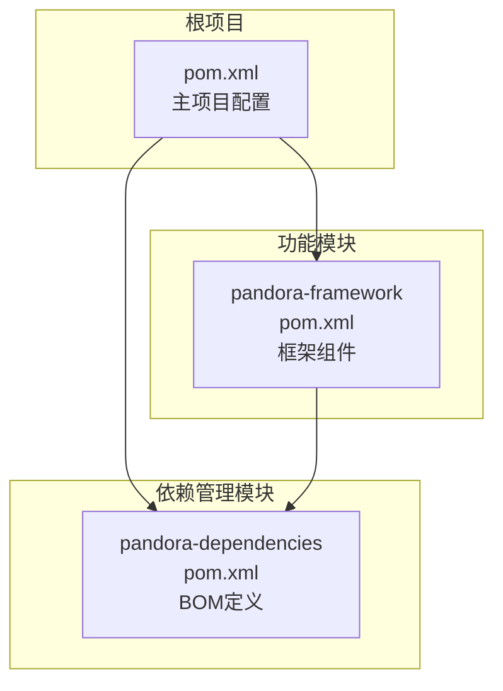
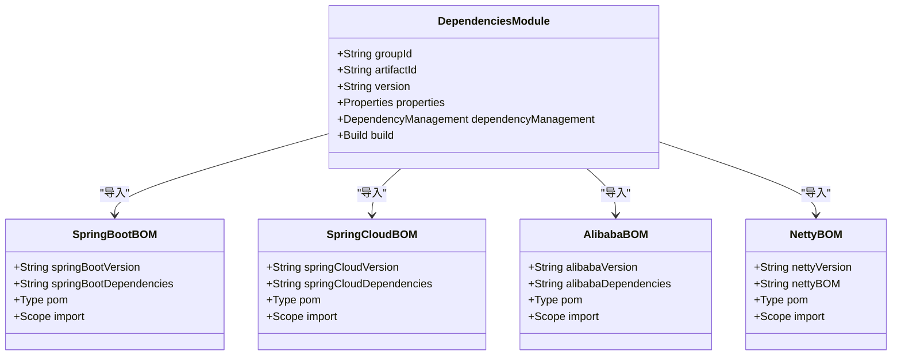
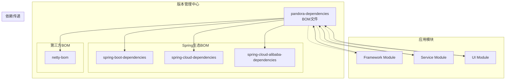
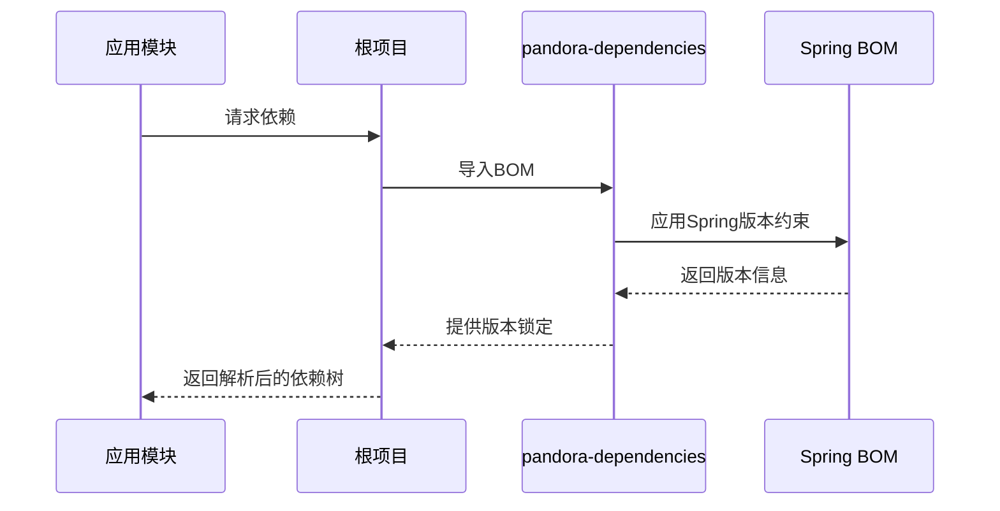
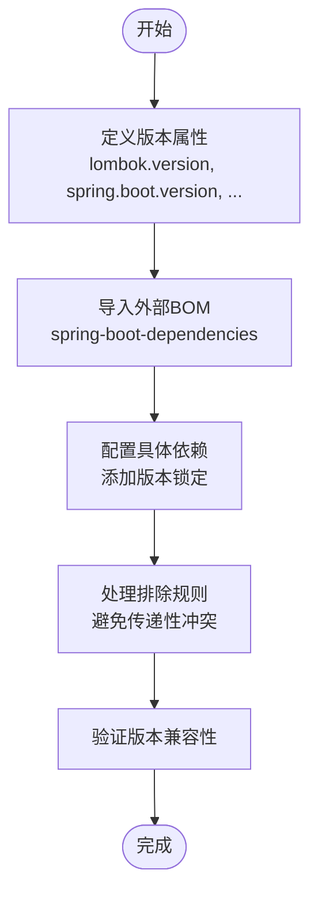
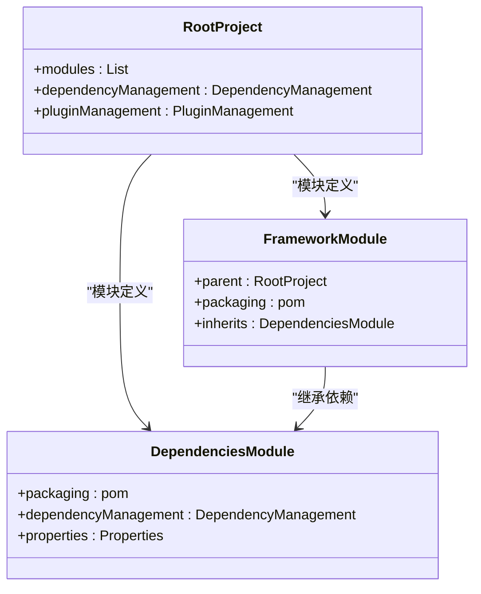
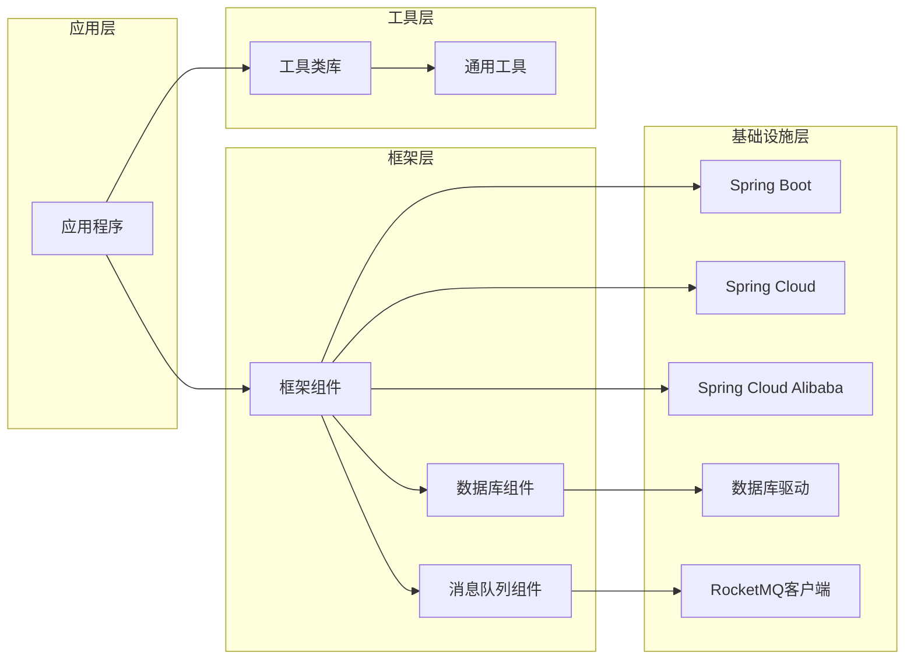
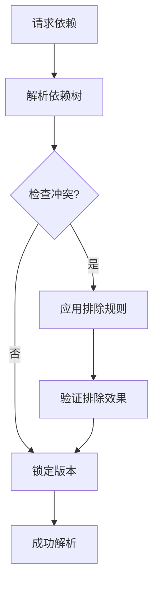

# 依赖管理架构

<cite>
**本文档引用的文件**
- [pom.xml](file://pom.xml)
- [pandora-dependencies/pom.xml](file://pandora-dependencies/pom.xml)
- [pandora-framework/pom.xml](file://pandora-framework/pom.xml)
- [README.md](file://README.md)
</cite>

## 目录
1. [简介](#简介)
2. [项目结构](#项目结构)
3. [核心组件](#核心组件)
4. [架构概览](#架构概览)
5. [详细组件分析](#详细组件分析)
6. [依赖关系分析](#依赖关系分析)
7. [性能考虑](#性能考虑)
8. [故障排除指南](#故障排除指南)
9. [最佳实践](#最佳实践)
10. [结论](#结论)

## 简介

Pandora Cloud 是一个基于 Spring Boot 3.5.14 构建的企业级云平台基础脚手架项目。该项目采用了现代化的依赖管理架构，通过 BOM (Bill of Materials) 模式实现了统一的依赖版本控制，有效避免了版本冲突问题，确保了各子模块之间的兼容性。

该项目的核心设计理念是通过 `pandora-dependencies` 模块作为单一事实来源，集中管理所有依赖版本，为整个项目提供标准化的依赖配置。这种设计模式不仅简化了版本管理，还提高了项目的可维护性和一致性。

## 项目结构

Pandora Cloud 项目采用多模块架构，主要包含以下核心模块：

**图表来源**
- [pom.xml:11-14](file://pom.xml#L11-L14)
- [pandora-dependencies/pom.xml:1-10](file://pandora-dependencies/pom.xml#L1-L10)
- [pandora-framework/pom.xml:1-25](file://pandora-framework/pom.xml#L1-L25)

项目结构特点：
- **根项目**：定义全局属性、插件管理和模块组织
- **依赖管理模块**：专门负责版本管理的BOM文件
- **功能模块**：实际的功能实现模块，继承并使用依赖管理

**章节来源**
- [pom.xml:1-150](file://pom.xml#L1-L150)
- [pandora-dependencies/pom.xml:1-658](file://pandora-dependencies/pom.xml#L1-L658)
- [pandora-framework/pom.xml:1-34](file://pandora-framework/pom.xml#L1-L34)

## 核心组件

### 根项目配置

根项目 `pom.xml` 作为整个项目的入口点，承担着以下关键职责：

1. **模块组织**：定义了两个主要模块 - `pandora-dependencies` 和 `pandora-framework`
2. **全局属性管理**：设置了Java版本、编码格式等基础配置
3. **依赖导入机制**：通过 `dependencyManagement` 导入BOM文件

### pandora-dependencies 模块

这是整个依赖管理架构的核心，采用了完整的BOM模式：

**图表来源**
- [pandora-dependencies/pom.xml:109-140](file://pandora-dependencies/pom.xml#L109-L140)

**章节来源**
- [pandora-dependencies/pom.xml:1-658](file://pandora-dependencies/pom.xml#L1-L658)

### pandora-framework 模块

框架模块作为功能实现的基础，具有以下特征：

- **继承父项目**：从根项目继承配置
- **模块化设计**：采用技术组件和业务组件的双重分类
- **Spring集成**：基于Spring框架的配置扩展

**章节来源**
- [pandora-framework/pom.xml:1-34](file://pandora-framework/pom.xml#L1-L34)

## 架构概览

Pandora Cloud 的依赖管理架构采用了经典的分层设计模式：

**图表来源**
- [pom.xml:40-50](file://pom.xml#L40-L50)
- [pandora-dependencies/pom.xml:109-140](file://pandora-dependencies/pom.xml#L109-L140)

### 核心设计原则

1. **单一事实来源**：所有版本信息集中在 `pandora-dependencies` 模块中
2. **版本锁定**：通过BOM机制确保依赖版本的一致性
3. **继承关系**：子模块通过继承获得版本控制
4. **模块化管理**：按功能领域划分不同的依赖组

## 详细组件分析

### BOM 模式实现

#### Spring 生态系统集成

项目深度集成了Spring生态系统，通过多个官方BOM确保版本兼容性：

**图表来源**
- [pom.xml:40-50](file://pom.xml#L40-L50)
- [pandora-dependencies/pom.xml:121-140](file://pandora-dependencies/pom.xml#L121-L140)

#### 第三方库版本管理

项目对第三方库进行了全面的版本管理，涵盖以下主要类别：

| 依赖类别 | 关键组件 | 版本策略 |
|---------|---------|----------|
| 工具类库 | Lombok, MapStruct, Hutool | 统一管理，避免重复版本 |
| 数据库相关 | MyBatis, MyBatis-Plus, Druid | 版本锁定，防止冲突 |
| 缓存组件 | Redisson | 单一版本控制 |
| 消息队列 | RocketMQ | 版本统一 |
| 监控追踪 | SkyWalking, OpenTracing | 兼容性保证 |

**章节来源**
- [pandora-dependencies/pom.xml:20-105](file://pandora-dependencies/pom.xml#L20-L105)

### 依赖版本锁定机制

#### 属性驱动的版本管理

项目采用属性驱动的方式管理版本，所有版本信息都定义在 `pandora-dependencies/pom.xml` 中：

**图表来源**
- [pandora-dependencies/pom.xml:15-106](file://pandora-dependencies/pom.xml#L15-L106)

#### 版本锁定策略

1. **直接版本指定**：对于关键依赖，直接指定版本号
2. **BOM继承**：通过导入官方BOM获取版本信息
3. **排除规则**：使用 `<exclusions>` 避免不必要的传递依赖
4. **版本范围**：在某些情况下允许版本范围，但需谨慎使用

**章节来源**
- [pandora-dependencies/pom.xml:147-153](file://pandora-dependencies/pom.xml#L147-L153)
- [pandora-dependencies/pom.xml:232-242](file://pandora-dependencies/pom.xml#L232-L242)

### 继承关系设计

#### 父子模块关系

**图表来源**
- [pom.xml:11-14](file://pom.xml#L11-L14)
- [pandora-framework/pom.xml:6-10](file://pandora-framework/pom.xml#L6-L10)

#### 继承层次结构

1. **根项目继承**：子模块继承根项目的配置
2. **依赖继承**：子模块继承依赖管理配置
3. **版本继承**：子模块使用继承的版本信息
4. **覆盖机制**：子模块可以覆盖特定的版本

**章节来源**
- [pom.xml:40-50](file://pom.xml#L40-L50)
- [pandora-framework/pom.xml:6-10](file://pandora-framework/pom.xml#L6-L10)

## 依赖关系分析

### 依赖传递关系

项目中的依赖传递遵循以下规则：

**图表来源**
- [pandora-dependencies/pom.xml:121-140](file://pandora-dependencies/pom.xml#L121-L140)

### 版本冲突避免机制

#### 排除策略

项目通过多种方式避免版本冲突：

1. **显式排除**：使用 `<exclusions>` 明确排除不需要的传递依赖
2. **版本锁定**：通过BOM机制锁定关键依赖版本
3. **依赖优先级**：利用Maven的依赖解析规则

#### 具体实现示例

**图表来源**
- [pandora-dependencies/pom.xml:147-153](file://pandora-dependencies/pom.xml#L147-L153)

**章节来源**
- [pandora-dependencies/pom.xml:147-153](file://pandora-dependencies/pom.xml#L147-L153)
- [pandora-dependencies/pom.xml:232-242](file://pandora-dependencies/pom.xml#L232-L242)

## 性能考虑

### 构建性能优化

项目在构建性能方面采取了多项优化措施：

1. **源码仓库优化**：配置了阿里云和华为云的Maven镜像源，提升依赖下载速度
2. **插件版本管理**：统一管理Maven插件版本，确保构建一致性
3. **编译参数优化**：配置了针对Spring Boot 3.2的参数设置

### 依赖解析性能

通过BOM模式和版本锁定机制，项目显著提升了依赖解析的性能：

- 减少了依赖解析时间
- 避免了版本冲突导致的重试
- 简化了依赖树结构

## 故障排除指南

### 常见依赖问题

#### 版本冲突问题

**症状**：构建过程中出现版本冲突警告或错误

**解决方案**：
1. 检查 `pandora-dependencies/pom.xml` 中的版本定义
2. 使用 `<exclusions>` 排除冲突的传递依赖
3. 调整依赖顺序，利用Maven的依赖解析规则

#### 依赖缺失问题

**症状**：运行时出现类找不到的异常

**解决方案**：
1. 确认依赖是否正确导入到 `dependencyManagement`
2. 检查依赖的作用域设置
3. 验证依赖的类型是否正确

#### 构建失败问题

**症状**：Maven构建过程中出现错误

**解决方案**：
1. 检查Java版本兼容性
2. 验证Maven版本要求
3. 确认网络连接和镜像源配置

**章节来源**
- [pom.xml:134-147](file://pom.xml#L134-L147)

## 最佳实践

### 依赖管理最佳实践

#### 版本管理策略

1. **集中管理**：所有版本信息集中在单一位置
2. **定期更新**：建立定期更新机制，保持依赖最新
3. **向后兼容**：在升级时考虑向后兼容性
4. **安全审计**：定期进行安全漏洞扫描

#### 依赖选择原则

1. **稳定性优先**：优先选择稳定版本
2. **社区活跃度**：考虑项目的维护活跃度
3. **文档完整性**：选择文档完善的依赖
4. **许可证兼容**：确保许可证符合项目要求

#### 依赖优化建议

1. **移除冗余依赖**：定期清理不再使用的依赖
2. **合并相似功能**：避免功能重复的依赖
3. **使用BOM**：优先使用官方BOM管理版本
4. **监控依赖健康**：建立依赖健康监控机制

### 团队协作最佳实践

1. **变更审批流程**：建立依赖变更的审批流程
2. **知识共享**：定期分享依赖管理经验
3. **文档维护**：保持依赖文档的及时更新
4. **培训计划**：提供依赖管理相关的培训

## 结论

Pandora Cloud 的依赖管理架构通过BOM模式实现了高度的版本控制和一致性管理。该架构的主要优势包括：

1. **版本一致性**：通过BOM机制确保所有模块使用相同的依赖版本
2. **冲突避免**：通过版本锁定和排除规则有效避免版本冲突
3. **维护简便**：集中化的版本管理大大简化了维护工作
4. **扩展性强**：模块化的架构便于新功能的添加和现有功能的修改

该架构为大型企业级项目的依赖管理提供了优秀的参考模板，特别适合需要严格版本控制和长期维护的项目。通过遵循本文档中介绍的最佳实践，团队可以有效地管理复杂的依赖关系，确保项目的稳定性和可维护性。