# 技术栈集成

<cite>
**本文档引用的文件**
- [pom.xml](file://pom.xml)
- [README.md](file://README.md)
- [pandora-dependencies/pom.xml](file://pandora-dependencies/pom.xml)
- [pandora-framework/pom.xml](file://pandora-framework/pom.xml)
</cite>

## 目录
1. [项目概述](#项目概述)
2. [项目结构](#项目结构)
3. [核心技术栈](#核心技术栈)
4. [Spring Boot 集成方案](#spring-boot-集成方案)
5. [Spring Cloud 集成方案](#spring-cloud-集成方案)
6. [Spring Cloud Alibaba 集成方案](#spring-cloud-alibaba-集成方案)
7. [数据库技术栈集成](#数据库技术栈集成)
8. [缓存技术栈集成](#缓存技术栈集成)
9. [消息队列技术栈集成](#消息队列技术栈集成)
10. [自动配置与启动流程](#自动配置与启动流程)
11. [依赖注入机制](#依赖注入机制)
12. [性能优化建议](#性能优化建议)
13. [故障排除指南](#故障排除指南)
14. [总结](#总结)

## 项目概述

Pandora Cloud 是一个基于 Spring 生态系统的企业级微服务开发框架，旨在为企业提供完整的云原生解决方案。该项目采用 Maven 多模块架构设计，通过统一的依赖管理和模块化组织，实现了 Spring Boot、Spring Cloud 和 Spring Cloud Alibaba 的深度集成。

项目的核心目标是：
- 提供标准化的微服务开发模板
- 集成主流的企业级技术栈
- 支持快速开发和部署
- 确保系统的可扩展性和可维护性

## 项目结构

项目采用标准的 Maven 多模块架构，包含三个核心模块：

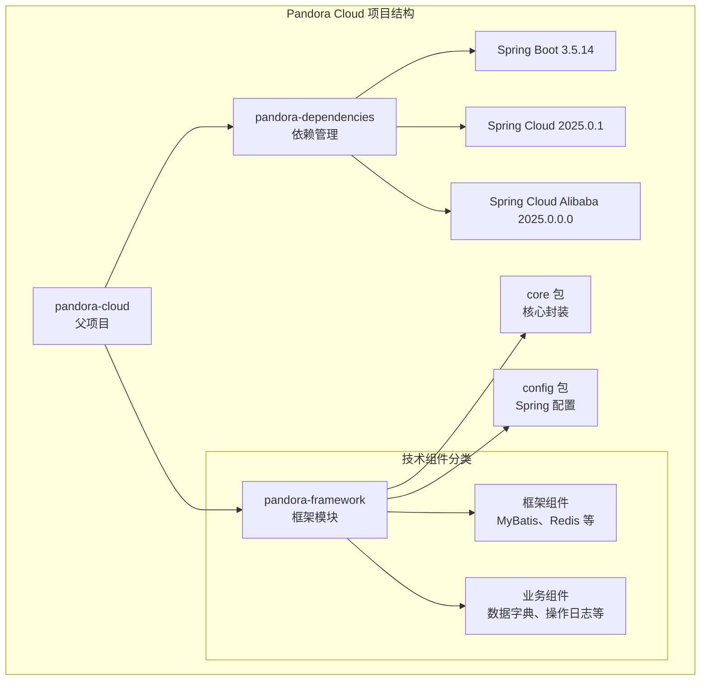

**图表来源**
- [pom.xml:11-14](file://pom.xml#L11-L14)
- [pandora-framework/pom.xml:15-24](file://pandora-framework/pom.xml#L15-L24)

**章节来源**
- [pom.xml:1-150](file://pom.xml#L1-150)
- [pandora-framework/pom.xml:1-34](file://pandora-framework/pom.xml#L1-L34)

## 核心技术栈

### 版本选择策略

项目采用了精心设计的版本管理体系，确保各组件之间的兼容性和稳定性：

| 组件类别 | 核心版本 | 选择理由 |
|---------|---------|----------|
| Java | 25 | 最新 LTS 版本，提供最佳性能和安全性 |
| Spring Boot | 3.5.14 | 稳定版本，长期支持，功能完整 |
| Spring Cloud | 2025.0.1 | 最新版本，支持最新特性 |
| Spring Cloud Alibaba | 2025.0.0.0 | 与 Spring Cloud 版本完全匹配 |

### 依赖管理架构

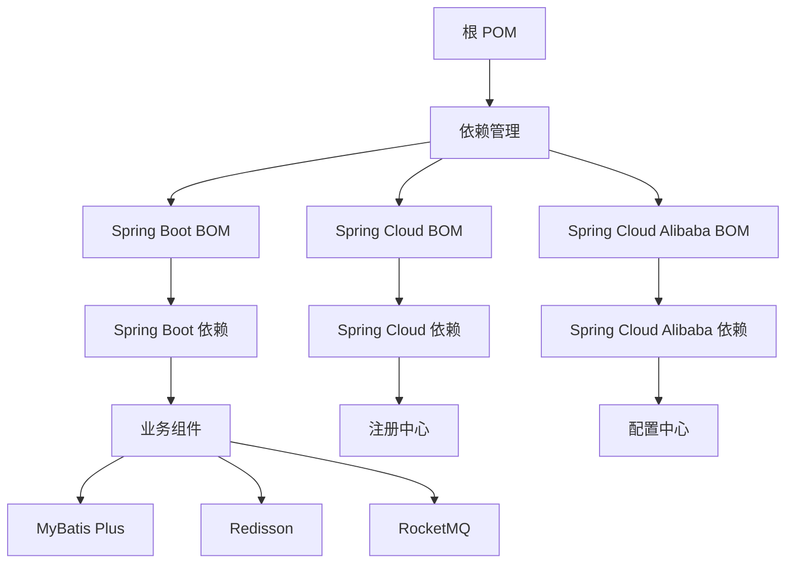

**图表来源**
- [pandora-dependencies/pom.xml:109-140](file://pandora-dependencies/pom.xml#L109-L140)

**章节来源**
- [pandora-dependencies/pom.xml:15-106](file://pandora-dependencies/pom.xml#L15-L106)

## Spring Boot 集成方案

### 自动配置机制

Spring Boot 通过其强大的自动配置机制，为 Pandora Cloud 提供了开箱即用的功能支持：

#### 核心配置特性

1. **条件注解驱动**：基于 @ConditionalOnClass、@ConditionalOnMissingBean 等注解实现智能配置
2. **属性绑定**：通过 @ConfigurationProperties 绑定外部配置
3. **组件扫描**：自动发现和注册组件
4. **Web MVC 集成**：内置 Tomcat、WebFlux 支持

#### 构建配置优化

项目在构建层面进行了多项优化：

- **编译器配置**：启用 -parameters 参数以支持 Spring Boot 3.2 的参数名称发现
- **注解处理器**：正确配置 Lombok、MapStruct 的注解处理链
- **插件管理**：统一管理 Maven 插件版本

**章节来源**
- [pom.xml:62-99](file://pom.xml#L62-L99)

### 启动流程分析

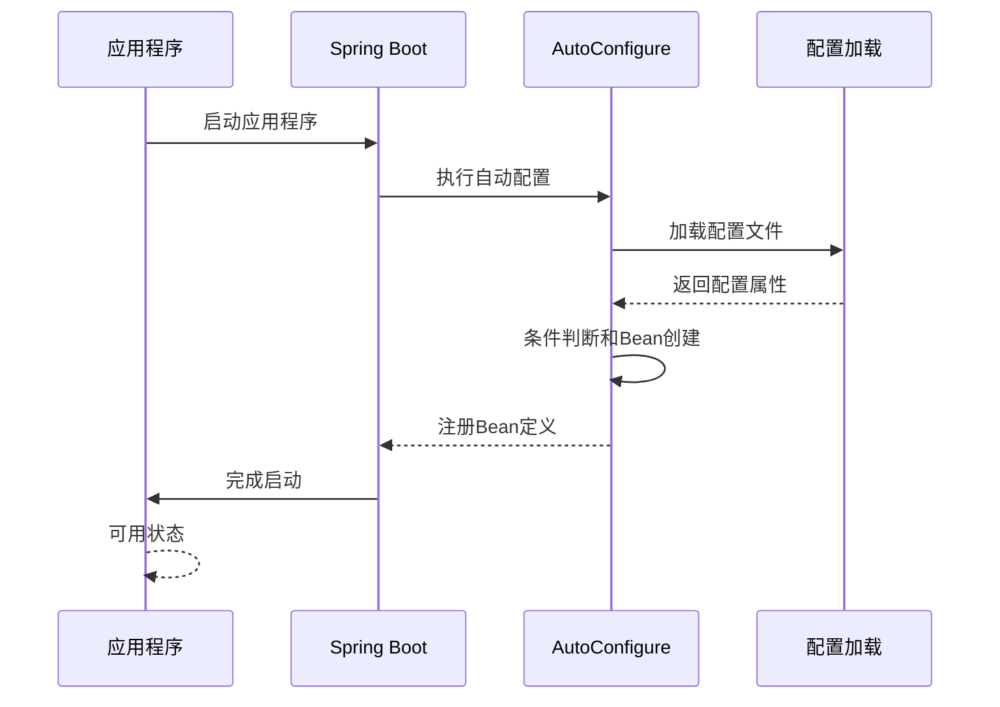

**图表来源**
- [pom.xml:20-35](file://pom.xml#L20-L35)

## Spring Cloud 集成方案

### 服务发现与注册

Spring Cloud 为 Pandora Cloud 提供了完整的微服务基础设施：

#### 核心组件集成

| 组件 | 版本 | 功能描述 |
|------|------|----------|
| Eureka | 1.9.13 | 服务注册与发现 |
| Ribbon | 2.4.7 | 客户端负载均衡 |
| Feign | 11.8.0 | 声明式 HTTP 客户端 |
| Hystrix | 1.5.18 | 断路器模式 |
| Gateway | 4.1.1 | API 网关 |

#### 配置管理

Spring Cloud Config 为分布式系统提供了统一的配置管理中心：

- **配置服务器**：集中管理所有微服务的配置
- **客户端集成**：自动从配置服务器拉取配置
- **动态刷新**：支持配置的热更新

**章节来源**
- [pandora-dependencies/pom.xml:127-140](file://pandora-dependencies/pom.xml#L127-L140)

### 服务治理

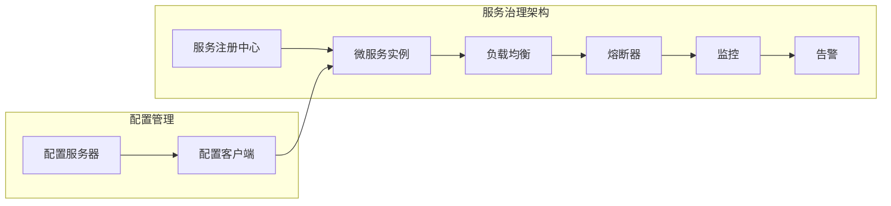

## Spring Cloud Alibaba 集成方案

### Nacos 集成

Spring Cloud Alibaba 将阿里巴巴的优秀开源项目集成到 Spring Cloud 生态中：

#### Nacos 作为配置中心

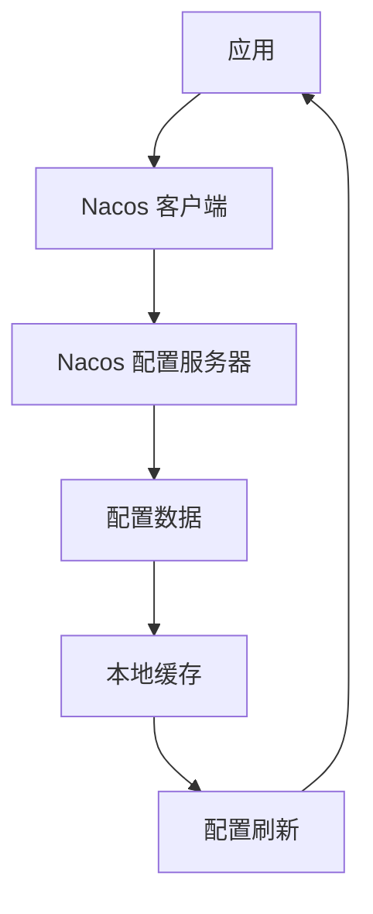

#### Nacos 作为注册中心

| 组件 | 版本 | 功能 |
|------|------|------|
| Nacos Client | 2.3.2 | 客户端 SDK |
| Nacos Server | 2.3.2 | 服务端 |
| Sentinel | 1.8.6 | 流量控制和熔断降级 |
| Seata | 1.7.0 | 分布式事务 |

**章节来源**
- [pandora-dependencies/pom.xml:134-140](file://pandora-dependencies/pom.xml#L134-L140)

### 分布式事务支持

Seata 为微服务架构提供了高性能的分布式事务解决方案：

- **AT 模式**：无侵入性，基于本地事务
- **TCC 模式**：补偿事务
- **Saga 模式**：长事务协调

## 数据库技术栈集成

### MyBatis Plus 集成

MyBatis Plus 为 MyBatis 提供了增强功能，简化了数据库操作：

#### 核心特性

1. **代码生成器**：自动生成 Mapper、Model、Service 层代码
2. **条件构造器**：链式编程风格的查询构建
3. **分页插件**：内置分页功能
4. **乐观锁**：支持数据库级别的乐观锁

#### 配置要点

- **版本兼容**：确保与 Spring Boot 3.x 完全兼容
- **代码生成**：配置表结构解析和代码模板
- **性能优化**：合理使用缓存和批量操作

**章节来源**
- [pandora-dependencies/pom.xml:202-216](file://pandora-dependencies/pom.xml#L202-L216)

### Dynamic DataSource 集成

Dynamic DataSource 为多数据源场景提供了优雅的解决方案：

#### 多数据源配置

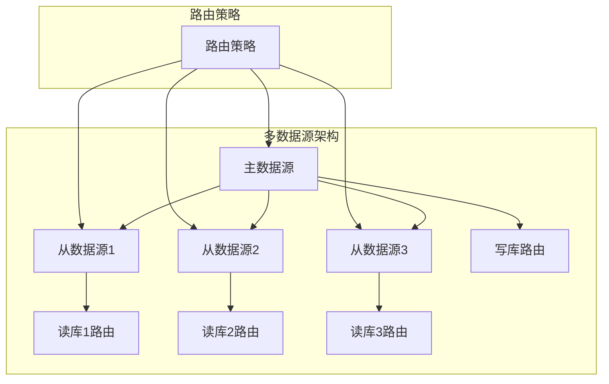

#### 配置模式

- **注解驱动**：@DS 注解切换数据源
- **方法级别**：基于方法名的自动路由
- **线程级别**：基于线程上下文的数据源切换

**章节来源**
- [pandora-dependencies/pom.xml:218-226](file://pandora-dependencies/pom.xml#L218-L226)

### Easy Trans 集成

Easy Trans 提供了强大的数据翻译功能：

#### 功能特性

1. **注解驱动**：@Trans 注解自动翻译
2. **多数据源**：支持多种翻译源（字典、用户、角色等）
3. **缓存机制**：内置缓存提高性能
4. **异步加载**：支持异步翻译提高响应速度

## 缓存技术栈集成

### Redisson 集成

Redisson 为 Redis 提供了高级的 Java 客户端功能：

#### 核心功能

1. **分布式对象**：分布式集合、映射、队列等
2. **分布式锁**：支持公平锁、读写锁、联锁
3. **分布式服务**：远程服务调用
4. **分布式任务**：任务调度和执行

#### 配置策略

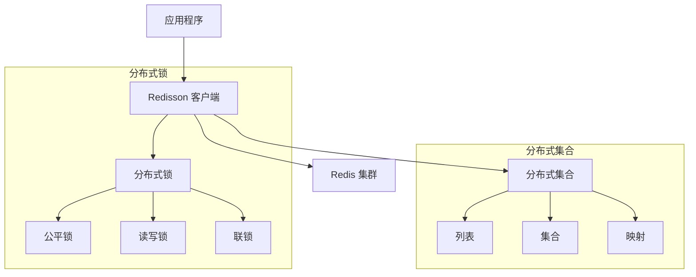

**章节来源**
- [pandora-dependencies/pom.xml:255-259](file://pandora-dependencies/pom.xml#L255-L259)

### 分布式锁实现

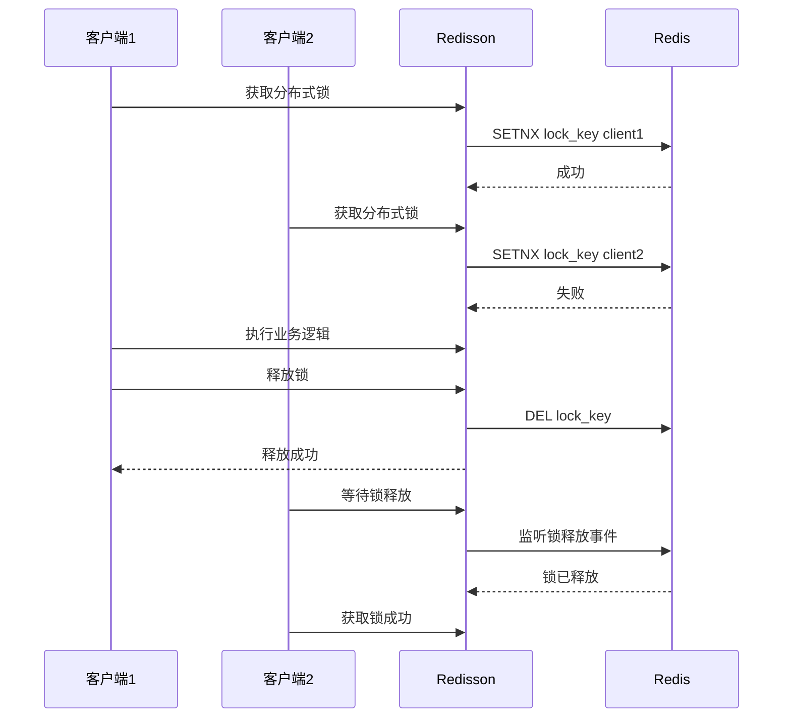

**图表来源**
- [pandora-dependencies/pom.xml:286-295](file://pandora-dependencies/pom.xml#L286-L295)

## 消息队列技术栈集成

### RocketMQ 集成

RocketMQ 为高吞吐量的消息传递提供了可靠的技术支持：

#### 核心特性

1. **高可用性**：主从复制，容错机制
2. **高性能**：顺序消息，批量发送
3. **可扩展性**：水平扩展，集群部署
4. **可靠性**：持久化存储，ACK 机制

#### 配置模式

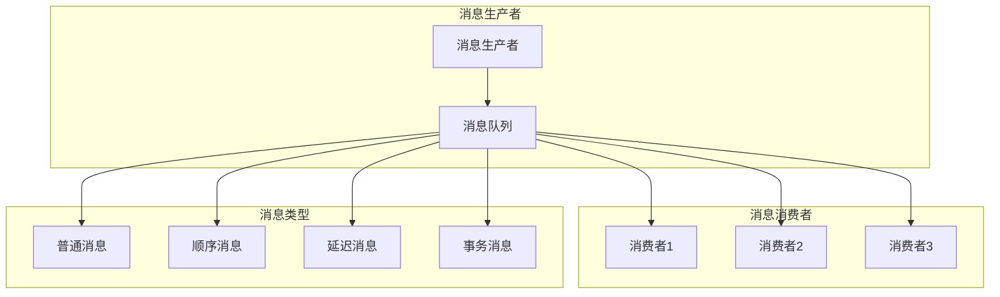

**章节来源**
- [pandora-dependencies/pom.xml:277-282](file://pandora-dependencies/pom.xml#L277-L282)

### 消息处理流程

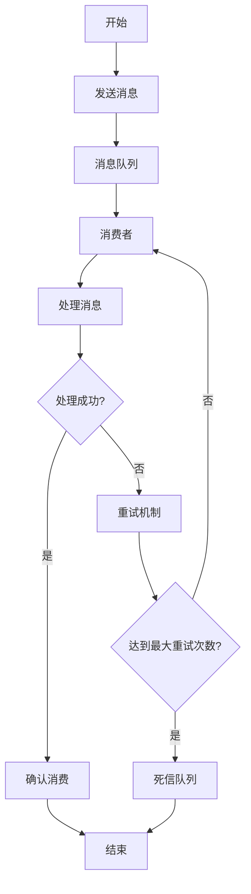

## 自动配置与启动流程

### 启动流程详解

Spring Boot 的启动流程遵循严格的顺序：

1. **环境准备**：创建和配置 Environment
2. **BeanDefinition 加载**：扫描和注册 BeanDefinition
3. **BeanFactory 后处理**：应用 BeanFactoryPostProcessor
4. **Bean 实例化**：创建和初始化 Bean
5. **生命周期回调**：执行各种生命周期回调

### 自动配置触发机制

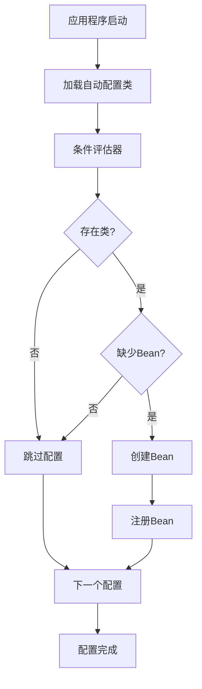

**图表来源**
- [pom.xml:20-35](file://pom.xml#L20-L35)

## 依赖注入机制

### DI 容器架构

Spring 的依赖注入容器提供了强大的组件管理能力：

#### Bean 生命周期

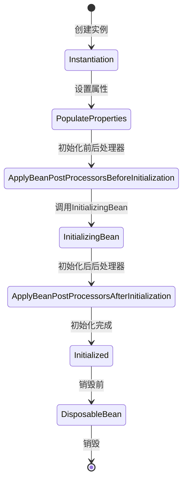

#### 注解驱动的 DI

- **@Component**：通用组件注解
- **@Service**：业务层组件
- **@Repository**：数据访问层组件
- **@Controller**：控制层组件
- **@Autowired**：自动注入
- **@Qualifier**：限定符注入

## 性能优化建议

### JVM 性能调优

基于 Java 25 的特性，建议采用以下优化策略：

1. **垃圾收集器选择**：G1GC 或 ZGC
2. **堆内存配置**：根据应用需求合理设置
3. **JIT 编译优化**：启用适当的编译参数
4. **类卸载策略**：避免类加载器泄漏

### Spring Boot 优化

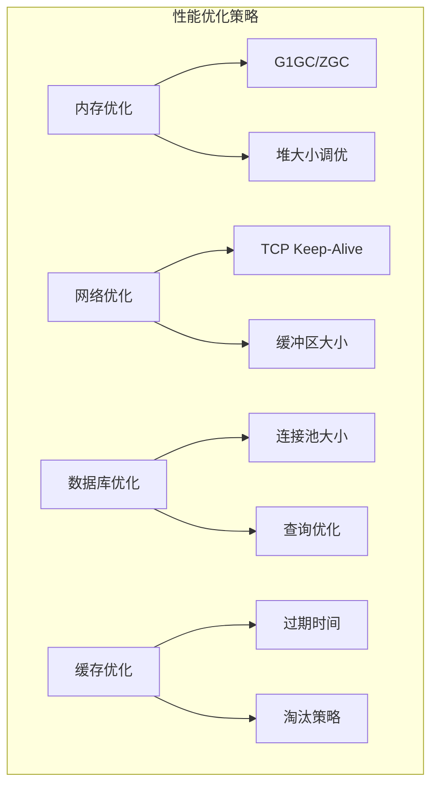

### 数据库性能优化

1. **连接池配置**：合理设置最大连接数和超时时间
2. **SQL 优化**：使用索引和合适的查询语句
3. **批量操作**：减少网络往返次数
4. **读写分离**：分担数据库压力

### 缓存策略优化

1. **多级缓存**：本地缓存 + 分布式缓存
2. **预热机制**：启动时预加载热点数据
3. **缓存穿透防护**：空值缓存和布隆过滤器
4. **缓存雪崩防护**：过期时间随机化

## 故障排除指南

### 常见问题诊断

#### 启动失败排查

1. **端口冲突**：检查应用端口配置
2. **依赖冲突**：使用 mvn dependency:tree 分析
3. **配置错误**：验证 application.yml 配置
4. **JVM 参数**：检查内存和 GC 参数

#### 性能问题排查

1. **内存泄漏**：使用 jmap 和 jconsole 分析
2. **CPU 占用高**：使用 jstack 分析线程状态
3. **数据库慢查询**：启用慢查询日志
4. **网络延迟**：使用 netstat 和 tcpdump 分析

### 监控和诊断工具

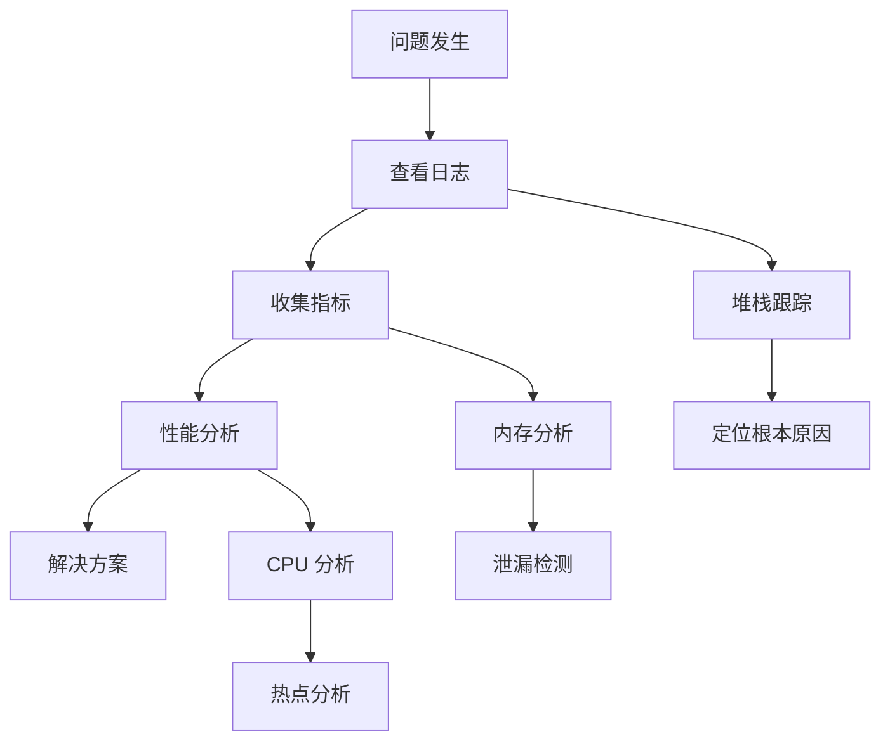

## 总结

Pandora Cloud 项目通过精心设计的多模块架构和完整的依赖管理体系，成功集成了 Spring Boot、Spring Cloud 和 Spring Cloud Alibaba 生态系统。项目的主要优势包括：

### 技术优势

1. **版本一致性**：通过统一的依赖管理确保各组件版本兼容
2. **模块化设计**：清晰的模块划分便于维护和扩展
3. **开箱即用**：完善的自动配置减少开发工作量
4. **企业级特性**：支持分布式事务、限流熔断、配置中心等

### 架构优势

1. **微服务友好**：天然支持微服务架构模式
2. **可扩展性强**：易于添加新的技术组件
3. **运维友好**：完善的监控和诊断能力
4. **开发效率高**：丰富的 starter 和自动化配置

### 发展建议

1. **持续升级**：关注 Spring 生态的最新版本
2. **性能优化**：定期进行性能基准测试
3. **安全加固**：完善安全配置和漏洞扫描
4. **文档完善**：补充详细的使用文档和最佳实践

通过以上技术栈的集成，Pandora Cloud 为企业级应用开发提供了一个强大而灵活的基础设施，能够满足现代企业对高性能、高可用、易维护的应用系统需求。