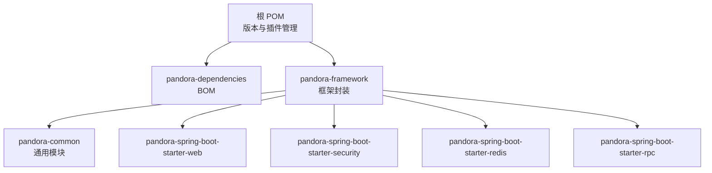
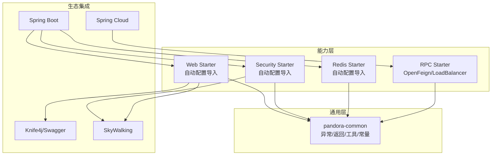
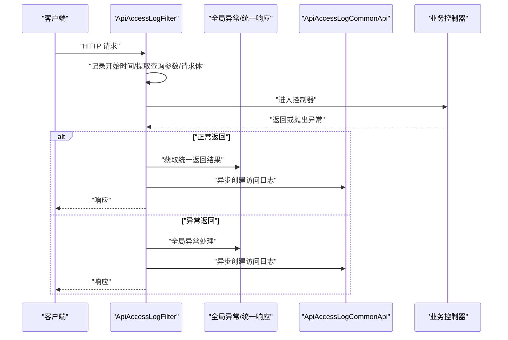
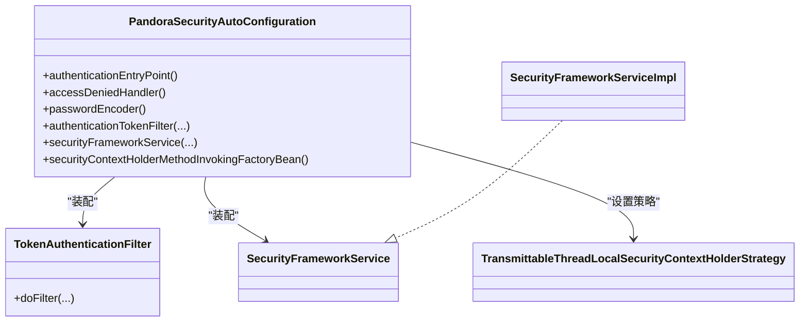
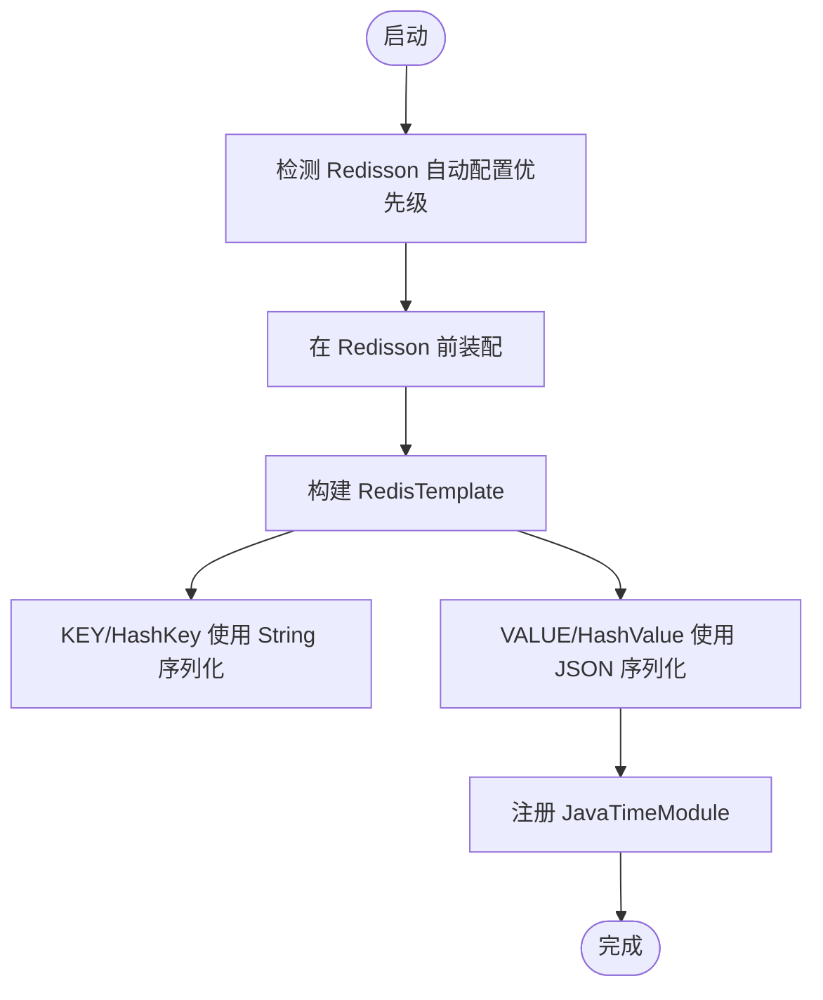
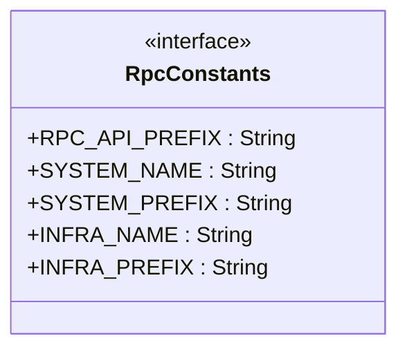
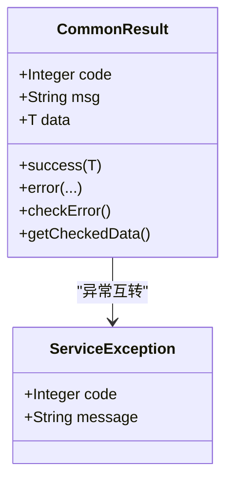
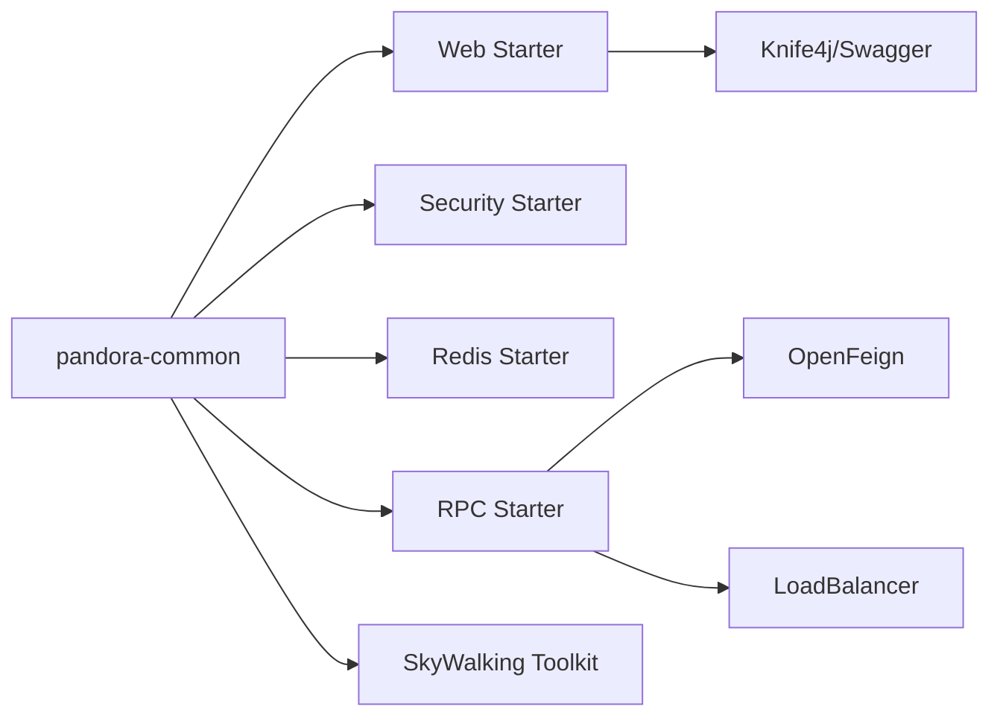

# 整体架构

<cite>
**本文引用的文件**
- [根 POM](file://pom.xml)
- [框架 README](file://README.md)
- [公共模块 POM](file://pandora-framework/pandora-common/pom.xml)
- [公共模块 README](file://pandora-framework/pandora-common/README.md)
- [Web Starter 自动配置导入](file://pandora-framework/pandora-spring-boot-starter-web/src/main/resources/META-INF/spring/org.springframework.boot.autoconfigure.AutoConfiguration.imports)
- [安全 Starter 自动配置导入](file://pandora-framework/pandora-spring-boot-starter-security/src/main/resources/META-INF/spring/org.springframework.boot.autoconfigure.AutoConfiguration.imports)
- [Redis Starter 自动配置导入](file://pandora-framework/pandora-spring-boot-starter-redis/src/main/resources/META-INF/spring/org.springframework.boot.autoconfigure.AutoConfiguration.imports)
- [RPC Starter POM](file://pandora-framework/pandora-spring-boot-starter-rpc/pom.xml)
- [Web 自动配置](file://pandora-framework/pandora-spring-boot-starter-web/src/main/java/net/ittimeline/pandora/framework/web/config/PandoraWebAutoConfiguration.java)
- [安全自动配置](file://pandora-framework/pandora-spring-boot-starter-security/src/main/java/net/ittimeline/pandora/framework/security/config/PandoraSecurityAutoConfiguration.java)
- [Redis 自动配置](file://pandora-framework/pandora-spring-boot-starter-redis/src/main/java/net/ittimeline/pandora/framework/redis/config/PandoraRedisAutoConfiguration.java)
- [API 访问日志过滤器](file://pandora-framework/pandora-spring-boot-starter-web/src/main/java/net/ittimeline/pandora/framework/apilog/core/filter/ApiAccessLogFilter.java)
- [业务异常类](file://pandora-framework/pandora-common/src/main/java/net/ittimeline/pandora/framework/common/exception/ServiceException.java)
- [通用返回封装](file://pandora-framework/pandora-common/src/main/java/net/ittimeline/pandora/framework/common/pojo/CommonResult.java)
- [JSON 工具类](file://pandora-framework/pandora-common/src/main/java/net/ittimeline/pandora/framework/common/util/web/json/JsonUtils.java)
- [RPC 常量](file://pandora-framework/pandora-common/src/main/java/net/ittimeline/pandora/framework/common/constants/RpcConstants.java)
</cite>

## 目录
1. [引言](#引言)
2. [项目结构](#项目结构)
3. [核心组件](#核心组件)
4. [架构总览](#架构总览)
5. [详细组件分析](#详细组件分析)
6. [依赖分析](#依赖分析)
7. [性能考虑](#性能考虑)
8. [故障排查指南](#故障排查指南)
9. [结论](#结论)
10. [附录](#附录)

## 引言
本架构文档面向 Pandora Cloud 框架，系统性阐述其高层设计思路、核心理念与系统边界划分；解释模块化组织方式（pandora-common 通用模块与各 Spring Boot Starter 组件）；说明 Spring Boot Starter 模式与自动配置机制如何实现“开箱即用”；梳理与 Spring Boot、Spring Cloud 生态的集成方式；给出技术栈选择、版本兼容性与架构演进方向，并对关键架构决策进行技术背景与权衡分析。

## 项目结构
仓库采用多模块聚合结构，顶层通过父 POM 管理版本与插件，核心模块包括：
- pandora-dependencies：BOM 管理依赖版本
- pandora-framework：框架封装与 Starter 组件
  - pandora-common：通用 POJO、枚举、异常、工具类与常量
  - pandora-spring-boot-starter-web：Web 基础能力（跨域、全局异常、统一响应、日志、XSS、加解密、Swagger、Banner 等）
  - pandora-spring-boot-starter-security：安全框架（认证、授权、权限、线程本地上下文策略、RPC 登录透传拦截器等）
  - pandora-spring-boot-starter-redis：Redis 配置（自定义 RedisTemplate、Jackson 时间模块）
  - pandora-spring-boot-starter-rpc：RPC 能力（OpenFeign、负载均衡、工具依赖）

图表来源
- [根 POM:1-150](file://pom.xml#L1-L150)
- [框架 README:1-15](file://README.md#L1-L15)

章节来源
- [根 POM:1-150](file://pom.xml#L1-L150)
- [框架 README:1-15](file://README.md#L1-L15)

## 核心组件
- pandora-common：提供统一的异常模型（业务异常、全局异常）、通用返回封装、分页/排序参数、常用工具类（JSON、日期、集合、IO、表达式、Web 工具等），并包含 RPC 常量与线程本地上下文策略所需的依赖。
- Web Starter：基于自动配置导入 SPI，装配跨域、请求体缓存、全局异常、统一响应、API 访问日志、XSS、加解密、Swagger、Banner 等能力。
- Security Starter：装配 Spring Security 上下文策略、密码编码器、认证过滤器、权限服务、RPC 登录透传拦截器等。
- Redis Starter：装配自定义 RedisTemplate（JSON 序列化 + JavaTimeModule），确保 LocalDateTime 正确序列化。
- RPC Starter：装配 OpenFeign、负载均衡与必要工具依赖，支撑微服务间远程调用。

章节来源
- [公共模块 POM:1-114](file://pandora-framework/pandora-common/pom.xml#L1-L114)
- [公共模块 README:1-33](file://pandora-framework/pandora-common/README.md#L1-L33)
- [Web Starter 自动配置导入:1-8](file://pandora-framework/pandora-spring-boot-starter-web/src/main/resources/META-INF/spring/org.springframework.boot.autoconfigure.AutoConfiguration.imports#L1-L8)
- [安全 Starter 自动配置导入:1-6](file://pandora-framework/pandora-spring-boot-starter-security/src/main/resources/META-INF/spring/org.springframework.boot.autoconfigure.AutoConfiguration.imports#L1-L6)
- [Redis Starter 自动配置导入:1-2](file://pandora-framework/pandora-spring-boot-starter-redis/src/main/resources/META-INF/spring/org.springframework.boot.autoconfigure.AutoConfiguration.imports#L1-L2)
- [RPC Starter POM:1-60](file://pandora-framework/pandora-spring-boot-starter-rpc/pom.xml#L1-L60)

## 架构总览
Pandora Cloud 以“通用模块 + Starter 组件”的分层架构组织，遵循 Spring Boot 自动配置约定，通过 META-INF/spring 的自动配置导入文件声明启用的配置类，实现按需装配与“开箱即用”。核心边界如下：
- 通用边界：pandora-common 提供跨模块复用的基础能力与契约（异常、返回、工具、常量）
- 能力边界：各 Starter 在自身命名空间内完成自动配置与装配，彼此通过依赖与 SPI 协作
- 集成边界：与 Spring Boot、Spring Cloud（OpenFeign、LoadBalancer、SkyWalking、Knife4j 等）协作，形成统一的 Web、安全、RPC、监控与可观测性能力

图表来源
- [Web Starter 自动配置导入:1-8](file://pandora-framework/pandora-spring-boot-starter-web/src/main/resources/META-INF/spring/org.springframework.boot.autoconfigure.AutoConfiguration.imports#L1-L8)
- [安全 Starter 自动配置导入:1-6](file://pandora-framework/pandora-spring-boot-starter-security/src/main/resources/META-INF/spring/org.springframework.boot.autoconfigure.AutoConfiguration.imports#L1-L6)
- [Redis Starter 自动配置导入:1-2](file://pandora-framework/pandora-spring-boot-starter-redis/src/main/resources/META-INF/spring/org.springframework.boot.autoconfigure.AutoConfiguration.imports#L1-L2)
- [RPC Starter POM:22-60](file://pandora-framework/pandora-spring-boot-starter-rpc/pom.xml#L22-L60)

## 详细组件分析

### Web 自动配置与 API 访问日志链路
Web Starter 通过自动配置导入 SPI 启用多项能力，其中 API 访问日志链路由过滤器实现，贯穿请求生命周期，支持请求/响应脱敏、操作类型推断、异步落库等。

图表来源
- [Web 自动配置:1-177](file://pandora-framework/pandora-spring-boot-starter-web/src/main/java/net/ittimeline/pandora/framework/web/config/PandoraWebAutoConfiguration.java#L1-L177)
- [API 访问日志过滤器:1-255](file://pandora-framework/pandora-spring-boot-starter-web/src/main/java/net/ittimeline/pandora/framework/apilog/core/filter/ApiAccessLogFilter.java#L1-L255)

章节来源
- [Web 自动配置:1-177](file://pandora-framework/pandora-spring-boot-starter-web/src/main/java/net/ittimeline/pandora/framework/web/config/PandoraWebAutoConfiguration.java#L1-L177)
- [API 访问日志过滤器:1-255](file://pandora-framework/pandora-spring-boot-starter-web/src/main/java/net/ittimeline/pandora/framework/apilog/core/filter/ApiAccessLogFilter.java#L1-L255)

### 安全自动配置与线程本地上下文策略
安全自动配置负责装配认证入口、权限不足处理器、BCrypt 密码编码器、Token 认证过滤器、权限服务与 Spring Security 上下文策略（TransmittableThreadLocal）。该策略确保在分布式链路中安全上下文可正确传递。

图表来源
- [安全自动配置:1-99](file://pandora-framework/pandora-spring-boot-starter-security/src/main/java/net/ittimeline/pandora/framework/security/config/PandoraSecurityAutoConfiguration.java#L1-L99)

章节来源
- [安全自动配置:1-99](file://pandora-framework/pandora-spring-boot-starter-security/src/main/java/net/ittimeline/pandora/framework/security/config/PandoraSecurityAutoConfiguration.java#L1-L99)

### Redis 自动配置与序列化策略
Redis 自动配置在 Redisson 自动配置之前装配，确保使用自定义的 RedisTemplate，采用 JSON 序列化并注册 JavaTimeModule，解决 LocalDateTime 序列化问题。

图表来源
- [Redis 自动配置:1-50](file://pandora-framework/pandora-spring-boot-starter-redis/src/main/java/net/ittimeline/pandora/framework/redis/config/PandoraRedisAutoConfiguration.java#L1-L50)

章节来源
- [Redis 自动配置:1-50](file://pandora-framework/pandora-spring-boot-starter-redis/src/main/java/net/ittimeline/pandora/framework/redis/config/PandoraRedisAutoConfiguration.java#L1-L50)

### RPC 常量与服务前缀
RPC 常量定义了 RPC API 前缀与服务名/前缀规范，便于跨模块统一约定与 Feign 调用路径管理。

图表来源
- [RPC 常量:1-42](file://pandora-framework/pandora-common/src/main/java/net/ittimeline/pandora/framework/common/constants/RpcConstants.java#L1-L42)

章节来源
- [RPC 常量:1-42](file://pandora-framework/pandora-common/src/main/java/net/ittimeline/pandora/framework/common/constants/RpcConstants.java#L1-L42)

### 通用返回与异常模型
- 通用返回封装提供成功/错误的静态构造方法、与异常体系的互转能力，简化控制器返回与异常处理
- 业务异常类承载业务错误码与消息，配合通用返回实现统一的错误语义

图表来源
- [通用返回封装:1-123](file://pandora-framework/pandora-common/src/main/java/net/ittimeline/pandora/framework/common/pojo/CommonResult.java#L1-L123)
- [业务异常类:1-64](file://pandora-framework/pandora-common/src/main/java/net/ittimeline/pandora/framework/common/exception/ServiceException.java#L1-L64)

章节来源
- [通用返回封装:1-123](file://pandora-framework/pandora-common/src/main/java/net/ittimeline/pandora/framework/common/pojo/CommonResult.java#L1-L123)
- [业务异常类:1-64](file://pandora-framework/pandora-common/src/main/java/net/ittimeline/pandora/framework/common/exception/ServiceException.java#L1-L64)

## 依赖分析
- 技术栈与版本
  - Java 25，Spring Boot 3.5.14，Lombok 1.18.46，MapStruct 1.6.3
  - 依赖管理通过 pandora-dependencies 引入，统一版本与插件配置
- Starter 间耦合
  - 各 Starter 通过自动配置导入文件声明启用，彼此低耦合
  - Web/Security/Redis Starter 均依赖 pandora-common 提供的异常、返回、工具与常量
  - RPC Starter 依赖 Spring Cloud 生态（OpenFeign、LoadBalancer），并通过工具依赖增强校验与验证能力
- 外部生态集成
  - Knife4j/Swagger：Web Starter 中的 Swagger 自动配置
  - SkyWalking：公共模块引入 apm-toolkit-trace，Web/Security Starter 可结合使用
  - Hutool、Guava、Jackson、Validation API、Servlet API、AspectJ 等作为通用工具与 API 规范支撑

图表来源
- [根 POM:40-50](file://pom.xml#L40-L50)
- [公共模块 POM:26-114](file://pandora-framework/pandora-common/pom.xml#L26-L114)
- [RPC Starter POM:22-60](file://pandora-framework/pandora-spring-boot-starter-rpc/pom.xml#L22-L60)
- [Web Starter 自动配置导入:1-8](file://pandora-framework/pandora-spring-boot-starter-web/src/main/resources/META-INF/spring/org.springframework.boot.autoconfigure.AutoConfiguration.imports#L1-L8)
- [安全 Starter 自动配置导入:1-6](file://pandora-framework/pandora-spring-boot-starter-security/src/main/resources/META-INF/spring/org.springframework.boot.autoconfigure.AutoConfiguration.imports#L1-L6)
- [Redis Starter 自动配置导入:1-2](file://pandora-framework/pandora-spring-boot-starter-redis/src/main/resources/META-INF/spring/org.springframework.boot.autoconfigure.AutoConfiguration.imports#L1-L2)

章节来源
- [根 POM:20-150](file://pom.xml#L20-L150)
- [公共模块 POM:1-114](file://pandora-framework/pandora-common/pom.xml#L1-L114)
- [RPC Starter POM:1-60](file://pandora-framework/pandora-spring-boot-starter-rpc/pom.xml#L1-L60)

## 性能考虑
- JSON 序列化与反序列化
  - Web/Redis Starter 中均采用 Jackson，Web Starter 注册 JavaTimeModule 与自定义序列化器，减少 LocalDateTime 序列化开销与异常
  - JSON 工具类提供多种解析与转换方法，避免中间字符串化带来的性能损耗
- 过滤器链与执行顺序
  - Web Starter 显式设置过滤器顺序，确保跨域配置生效与请求体可重复读取
- 异步日志
  - API 访问日志通过异步接口提交，降低对主请求路径的影响
- 负载均衡与 RPC
  - 提供带负载均衡的 RestTemplate 与 OpenFeign，结合 LoadBalancer 优化服务发现与调用性能

章节来源
- [Web 自动配置:1-177](file://pandora-framework/pandora-spring-boot-starter-web/src/main/java/net/ittimeline/pandora/framework/web/config/PandoraWebAutoConfiguration.java#L1-L177)
- [Redis 自动配置:1-50](file://pandora-framework/pandora-spring-boot-starter-redis/src/main/java/net/ittimeline/pandora/framework/redis/config/PandoraRedisAutoConfiguration.java#L1-L50)
- [API 访问日志过滤器:1-255](file://pandora-framework/pandora-spring-boot-starter-web/src/main/java/net/ittimeline/pandora/framework/apilog/core/filter/ApiAccessLogFilter.java#L1-L255)
- [JSON 工具类:1-305](file://pandora-framework/pandora-common/src/main/java/net/ittimeline/pandora/framework/common/util/web/json/JsonUtils.java#L1-L305)

## 故障排查指南
- 跨域不生效
  - 检查 CORS 过滤器顺序是否正确，Web Starter 已设置固定顺序以确保配置生效
- 请求体不可重复读取
  - 确认 CacheRequestBodyFilter 是否注册并处于合理顺序
- API 访问日志未记录
  - 检查 ApiAccessLogFilter 是否启用，以及注解开关与脱敏配置是否覆盖默认行为
- 统一异常未生效
  - 确认 GlobalExceptionHandler 是否注册，以及 Web 自动配置导入是否加载
- 安全上下文丢失
  - 检查 TransmittableThreadLocalSecurityContextHolderStrategy 是否正确设置
- JSON 序列化异常（LocalDateTime）
  - 确认 RedisTemplate 或 Web Jackson 配置已注册 JavaTimeModule
- RPC 调用失败
  - 检查服务名与前缀是否符合 RpcConstants 约定，确认 Feign 客户端与 LoadBalancer 配置

章节来源
- [Web 自动配置:1-177](file://pandora-framework/pandora-spring-boot-starter-web/src/main/java/net/ittimeline/pandora/framework/web/config/PandoraWebAutoConfiguration.java#L1-L177)
- [API 访问日志过滤器:1-255](file://pandora-framework/pandora-spring-boot-starter-web/src/main/java/net/ittimeline/pandora/framework/apilog/core/filter/ApiAccessLogFilter.java#L1-L255)
- [安全自动配置:1-99](file://pandora-framework/pandora-spring-boot-starter-security/src/main/java/net/ittimeline/pandora/framework/security/config/PandoraSecurityAutoConfiguration.java#L1-L99)
- [Redis 自动配置:1-50](file://pandora-framework/pandora-spring-boot-starter-redis/src/main/java/net/ittimeline/pandora/framework/redis/config/PandoraRedisAutoConfiguration.java#L1-L50)
- [RPC 常量:1-42](file://pandora-framework/pandora-common/src/main/java/net/ittimeline/pandora/framework/common/constants/RpcConstants.java#L1-L42)

## 结论
Pandora Cloud 通过“通用模块 + Starter 组件”的模块化架构，结合 Spring Boot 自动配置与 Spring Cloud 生态，实现了 Web、安全、RPC、缓存与可观测性的统一能力沉淀。其设计强调：
- 开箱即用：通过自动配置导入与属性驱动，快速启用所需能力
- 低耦合高内聚：Starter 间通过依赖与 SPI 协作，公共能力集中于 pandora-common
- 可扩展与可维护：清晰的边界与统一的异常/返回模型，便于二次开发与演进

## 附录
- 版本与兼容性
  - Java 25，Spring Boot 3.5.14，Lombok 1.18.46，MapStruct 1.6.3
  - 通过 pandora-dependencies 管理依赖版本，确保模块间一致性
- 架构演进方向
  - 持续完善 Starter 能力矩阵，增强可观测性与治理能力
  - 逐步引入 Spring Cloud Alibaba 生态（如 Nacos、Sentinel），并与现有 OpenFeign/LB 协同
  - 优化异步日志与监控埋点，提升可观测性与性能分析能力

章节来源
- [根 POM:20-150](file://pom.xml#L20-L150)
- [公共模块 POM:1-114](file://pandora-framework/pandora-common/pom.xml#L1-L114)
- [RPC Starter POM:1-60](file://pandora-framework/pandora-spring-boot-starter-rpc/pom.xml#L1-L60)