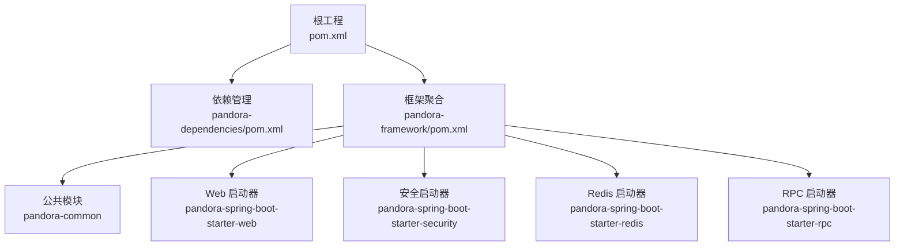
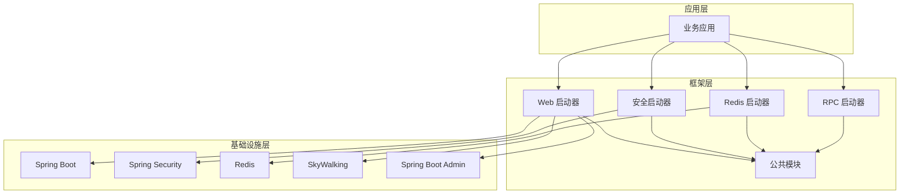
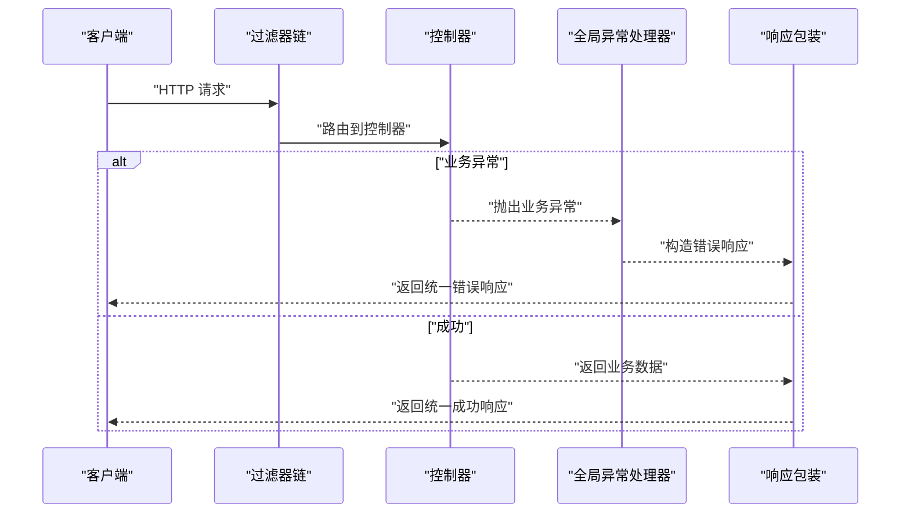
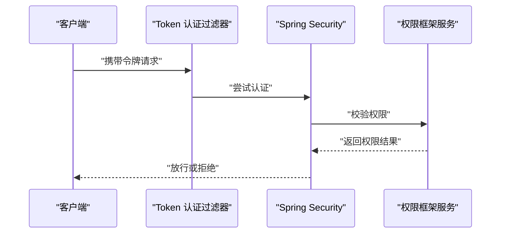
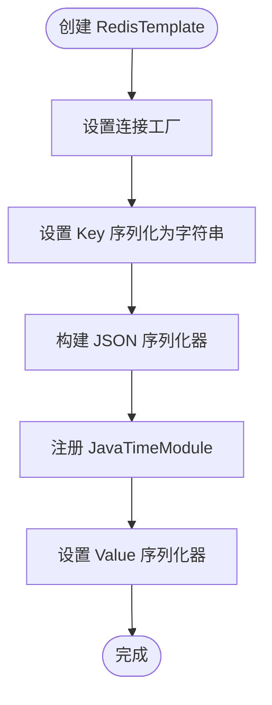
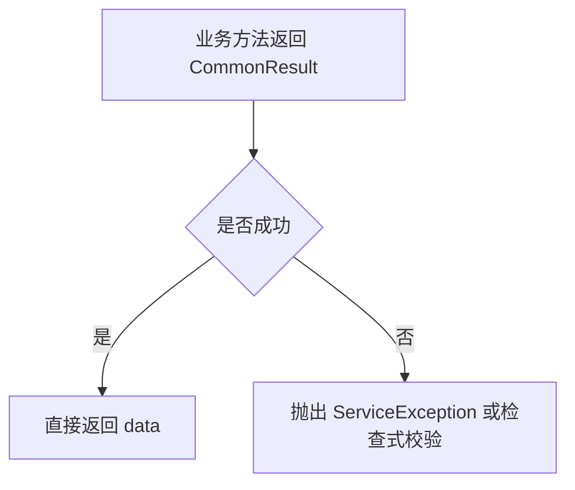
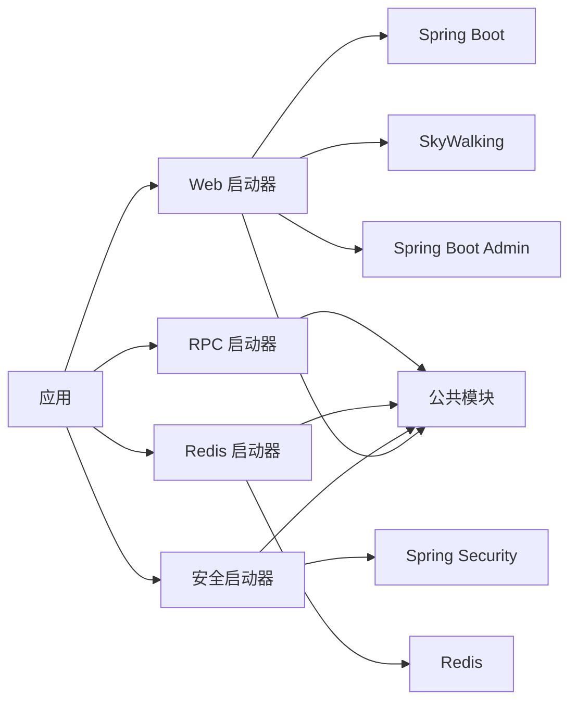

# 架构设计

<cite>
**本文引用的文件**
- [根 POM](file://pom.xml)
- [依赖管理 POM](file://pandora-dependencies/pom.xml)
- [框架聚合 POM](file://pandora-framework/pom.xml)
- [Web 启动器自动配置清单](file://pandora-framework/pandora-spring-boot-starter-web/src/main/resources/META-INF/spring/org.springframework.boot.autoconfigure.AutoConfiguration.imports)
- [安全启动器自动配置清单](file://pandora-framework/pandora-spring-boot-starter-security/src/main/resources/META-INF/spring/org.springframework.boot.autoconfigure.AutoConfiguration.imports)
- [Redis 启动器自动配置清单](file://pandora-framework/pandora-spring-boot-starter-redis/src/main/resources/META-INF/spring/org.springframework.boot.autoconfigure.AutoConfiguration.imports)
- [Web 自动配置类](file://pandora-framework/pandora-spring-boot-starter-web/src/main/java/net/ittimeline/pandora/framework/web/config/PandoraWebAutoConfiguration.java)
- [Web 配置属性类](file://pandora-framework/pandora-spring-boot-starter-web/src/main/java/net/ittimeline/pandora/framework/web/config/WebProperties.java)
- [安全自动配置类](file://pandora-framework/pandora-spring-boot-starter-security/src/main/java/net/ittimeline/pandora/framework/security/config/PandoraSecurityAutoConfiguration.java)
- [安全配置属性类](file://pandora-framework/pandora-spring-boot-starter-security/src/main/java/net/ittimeline/pandora/framework/security/config/SecurityProperties.java)
- [Redis 自动配置类](file://pandora-framework/pandora-spring-boot-starter-redis/src/main/java/net/ittimeline/pandora/framework/redis/config/PandoraRedisAutoConfiguration.java)
- [缓存配置属性类](file://pandora-framework/pandora-spring-boot-starter-redis/src/main/java/net/ittimeline/pandora/framework/redis/config/PandoraCacheProperties.java)
- [通用响应模型](file://pandora-framework/pandora-common/src/main/java/net/ittimeline/pandora/framework/common/pojo/CommonResult.java)
- [README](file://README.md)
</cite>

## 目录
1. [引言](#引言)
2. [项目结构](#项目结构)
3. [核心组件](#核心组件)
4. [架构总览](#架构总览)
5. [详细组件分析](#详细组件分析)
6. [依赖关系分析](#依赖关系分析)
7. [性能考量](#性能考量)
8. [故障排查指南](#故障排查指南)
9. [结论](#结论)
10. [附录](#附录)

## 引言
本架构设计文档面向 Pandora Cloud 框架，系统性阐述高层设计、架构模式与系统边界；解释模块化设计原理、组件交互与数据流；总结技术决策、权衡与约束；给出基础设施要求、可扩展性与部署拓扑建议；覆盖横切关注点（安全、监控、链路追踪、灾难恢复）；记录技术栈、第三方依赖与版本兼容性；并深入解析 Spring Boot Starter 模式与自动配置机制。

## 项目结构
Pandora Cloud 采用多模块分层组织：
- 顶层聚合工程：统一版本与构建配置，管理依赖范围与仓库镜像。
- 依赖管理模块：集中管理第三方依赖版本，形成 BOM，确保版本一致性。
- 框架模块：聚合各功能启动器与公共模块，按“技术组件/业务组件”划分。
- 启动器模块：以 Spring Boot Starter 形式提供自动配置与能力装配。
- 公共模块：提供通用工具、异常体系、常量、枚举与通用响应模型。

图表来源
- [根 POM:1-150](file://pom.xml#L1-L150)
- [依赖管理 POM:1-637](file://pandora-dependencies/pom.xml#L1-L637)
- [框架聚合 POM:1-41](file://pandora-framework/pom.xml#L1-L41)

章节来源
- [根 POM:1-150](file://pom.xml#L1-L150)
- [依赖管理 POM:1-637](file://pandora-dependencies/pom.xml#L1-L637)
- [框架聚合 POM:1-41](file://pandora-framework/pom.xml#L1-L41)
- [README:1-15](file://README.md#L1-L15)

## 核心组件
- Web 启动器：提供全局异常处理、统一响应包装、跨域、请求体缓存、RestTemplate、路径前缀、XSS 过滤、加密解密、Swagger/OpenAPI、Banner 等能力。
- 安全启动器：提供认证入口、权限拒绝处理、BCrypt 密码编码器、Token 认证过滤器、线程上下文传递策略、权限框架服务等。
- Redis 启动器：提供自定义 RedisTemplate（JSON 序列化）、Redisson 自动配置前置、缓存扫描批大小等。
- 公共模块：提供统一响应模型、异常体系、工具类、常量与枚举，支撑上层组件复用。

章节来源
- [Web 自动配置类:1-177](file://pandora-framework/pandora-spring-boot-starter-web/src/main/java/net/ittimeline/pandora/framework/web/config/PandoraWebAutoConfiguration.java#L1-L177)
- [Web 配置属性类:1-68](file://pandora-framework/pandora-spring-boot-starter-web/src/main/java/net/ittimeline/pandora/framework/web/config/WebProperties.java#L1-L68)
- [安全自动配置类:1-99](file://pandora-framework/pandora-spring-boot-starter-security/src/main/java/net/ittimeline/pandora/framework/security/config/PandoraSecurityAutoConfiguration.java#L1-L99)
- [安全配置属性类:1-58](file://pandora-framework/pandora-spring-boot-starter-security/src/main/java/net/ittimeline/pandora/framework/security/config/SecurityProperties.java#L1-L58)
- [Redis 自动配置类:1-50](file://pandora-framework/pandora-spring-boot-starter-redis/src/main/java/net/ittimeline/pandora/framework/redis/config/PandoraRedisAutoConfiguration.java#L1-L50)
- [缓存配置属性类:1-30](file://pandora-framework/pandora-spring-boot-starter-redis/src/main/java/net/ittimeline/pandora/framework/redis/config/PandoraCacheProperties.java#L1-L30)
- [通用响应模型:1-123](file://pandora-framework/pandora-common/src/main/java/net/ittimeline/pandora/framework/common/pojo/CommonResult.java#L1-L123)

## 架构总览
Pandora Cloud 采用“模块化 + Starter 自动装配”的架构模式，围绕 Spring Boot 生态进行能力封装与扩展。系统边界清晰：上层业务应用仅需引入对应 Starter 即可获得所需能力；底层通过依赖管理模块统一版本，确保一致性与可维护性。

图表来源
- [Web 启动器自动配置清单:1-8](file://pandora-framework/pandora-spring-boot-starter-web/src/main/resources/META-INF/spring/org.springframework.boot.autoconfigure.AutoConfiguration.imports#L1-L8)
- [安全启动器自动配置清单:1-6](file://pandora-framework/pandora-spring-boot-starter-security/src/main/resources/META-INF/spring/org.springframework.boot.autoconfigure.AutoConfiguration.imports#L1-L6)
- [Redis 启动器自动配置清单:1-2](file://pandora-framework/pandora-spring-boot-starter-redis/src/main/resources/META-INF/spring/org.springframework.boot.autoconfigure.AutoConfiguration.imports#L1-L2)
- [根 POM:1-150](file://pom.xml#L1-L150)
- [依赖管理 POM:1-637](file://pandora-dependencies/pom.xml#L1-L637)

## 详细组件分析

### Web 启动器
- 设计要点
  - 通过自动配置类装配全局异常处理、统一响应包装、跨域、请求体缓存、RestTemplate、路径前缀等。
  - 通过配置属性类支持 Admin/App API 前缀与包匹配规则，避免非预期暴露。
  - 通过过滤器注册 Bean 控制执行顺序，确保跨域优先生效。
- 关键流程（统一响应与异常处理）

图表来源
- [Web 自动配置类:93-102](file://pandora-framework/pandora-spring-boot-starter-web/src/main/java/net/ittimeline/pandora/framework/web/config/PandoraWebAutoConfiguration.java#L93-L102)
- [通用响应模型:74-84](file://pandora-framework/pandora-common/src/main/java/net/ittimeline/pandora/framework/common/pojo/CommonResult.java#L74-L84)

- 配置与扩展
  - 路径前缀与包匹配：通过 WebProperties 配置 Admin/App API 前缀与控制器包规则。
  - 跨域策略：通过 CorsFilter 注册与顺序控制，确保跨域配置生效。
  - RestTemplate：提供带负载均衡与无负载均衡实例，便于微服务间调用。

章节来源
- [Web 自动配置类:1-177](file://pandora-framework/pandora-spring-boot-starter-web/src/main/java/net/ittimeline/pandora/framework/web/config/PandoraWebAutoConfiguration.java#L1-L177)
- [Web 配置属性类:1-68](file://pandora-framework/pandora-spring-boot-starter-web/src/main/java/net/ittimeline/pandora/framework/web/config/WebProperties.java#L1-L68)

### 安全启动器
- 设计要点
  - 提供认证入口、权限不足处理、BCrypt 密码编码器、Token 认证过滤器。
  - 通过线程上下文传递策略，支持跨线程传递安全上下文。
  - 通过权限框架服务抽象，屏蔽具体权限实现细节。
- 关键流程（认证与权限）

图表来源
- [安全自动配置类:74-83](file://pandora-framework/pandora-spring-boot-starter-security/src/main/java/net/ittimeline/pandora/framework/security/config/PandoraSecurityAutoConfiguration.java#L74-L83)

- 配置与扩展
  - 令牌头与参数：通过 SecurityProperties 配置 Authorization 头与 token 参数。
  - 免登录白名单：permitAllUrls 支持配置无需登录的 URL 列表。
  - Mock 模式：支持开启 mock 模式与密钥配置，便于测试环境快速验证。

章节来源
- [安全自动配置类:1-99](file://pandora-framework/pandora-spring-boot-starter-security/src/main/java/net/ittimeline/pandora/framework/security/config/PandoraSecurityAutoConfiguration.java#L1-L99)
- [安全配置属性类:1-58](file://pandora-framework/pandora-spring-boot-starter-security/src/main/java/net/ittimeline/pandora/framework/security/config/SecurityProperties.java#L1-L58)

### Redis 启动器
- 设计要点
  - 自定义 RedisTemplate，使用 JSON 序列化，解决时间类型序列化问题。
  - 在 Redisson 自动配置之前装配，确保使用自定义模板。
  - 提供缓存扫描批大小配置，优化 keys 扫描性能。
- 关键流程（RedisTemplate 序列化）

图表来源
- [Redis 自动配置类:25-46](file://pandora-framework/pandora-spring-boot-starter-redis/src/main/java/net/ittimeline/pandora/framework/redis/config/PandoraRedisAutoConfiguration.java#L25-L46)

章节来源
- [Redis 自动配置类:1-50](file://pandora-framework/pandora-spring-boot-starter-redis/src/main/java/net/ittimeline/pandora/framework/redis/config/PandoraRedisAutoConfiguration.java#L1-L50)
- [缓存配置属性类:1-30](file://pandora-framework/pandora-spring-boot-starter-redis/src/main/java/net/ittimeline/pandora/framework/redis/config/PandoraCacheProperties.java#L1-L30)

### 公共模块
- 设计要点
  - 统一响应模型：提供 success/error 多种静态工厂方法，简化控制器返回。
  - 异常体系：与统一响应模型联动，支持检查式异常抛出与数据获取。
- 关键流程（统一响应模型）

图表来源
- [通用响应模型:74-122](file://pandora-framework/pandora-common/src/main/java/net/ittimeline/pandora/framework/common/pojo/CommonResult.java#L74-L122)

章节来源
- [通用响应模型:1-123](file://pandora-framework/pandora-common/src/main/java/net/ittimeline/pandora/framework/common/pojo/CommonResult.java#L1-L123)

## 依赖关系分析
- 版本管理
  - 通过依赖管理 POM 集中管理 Spring Boot、Spring Cloud、Spring Cloud Alibaba、Netty、Knife4j、MyBatis-Plus、Redisson、RocketMQ、SkyWalking、OkHttp、Vert.x、Flowable、Hutool、Guava、FastJSON、JustAuth、WeChat/Alipay SDK 等版本。
- 模块耦合
  - 启动器模块依赖公共模块，提供自动配置与能力装配。
  - 应用层仅依赖所需启动器，降低侵入性。
- 外部依赖
  - Web 启动器依赖 Spring MVC、Spring Security、Knife4j、SkyWalking、SBA 等。
  - 安全启动器依赖 Spring Security、线程上下文传递组件。
  - Redis 启动器依赖 Redis、Redisson。

图表来源
- [根 POM:1-150](file://pom.xml#L1-L150)
- [依赖管理 POM:1-637](file://pandora-dependencies/pom.xml#L1-L637)
- [Web 启动器自动配置清单:1-8](file://pandora-framework/pandora-spring-boot-starter-web/src/main/resources/META-INF/spring/org.springframework.boot.autoconfigure.AutoConfiguration.imports#L1-L8)
- [安全启动器自动配置清单:1-6](file://pandora-framework/pandora-spring-boot-starter-security/src/main/resources/META-INF/spring/org.springframework.boot.autoconfigure.AutoConfiguration.imports#L1-L6)
- [Redis 启动器自动配置清单:1-2](file://pandora-framework/pandora-spring-boot-starter-redis/src/main/resources/META-INF/spring/org.springframework.boot.autoconfigure.AutoConfiguration.imports#L1-L2)

章节来源
- [根 POM:1-150](file://pom.xml#L1-L150)
- [依赖管理 POM:1-637](file://pandora-dependencies/pom.xml#L1-L637)

## 性能考量
- 序列化与缓存
  - Redis 使用 JSON 序列化，注册 JavaTimeModule，兼顾时间类型与可读性；可通过缓存扫描批大小参数优化 keys 扫描性能。
- Web 层
  - 请求体缓存过滤器支持可重复读取，避免流被消费导致后续处理失败；跨域过滤器优先级确保配置生效。
- 并发与上下文
  - 安全上下文采用线程本地传递策略，减少跨线程数据丢失风险；RestTemplate 提供带负载均衡实例，便于微服务调用。
- 监控与可观测性
  - 集成 SkyWalking 与 Spring Boot Admin，便于链路追踪与运行状态监控。

## 故障排查指南
- 统一响应与异常
  - 使用统一响应模型的检查方法，快速定位业务异常并抛出 ServiceException。
- 跨域问题
  - 确认跨域过滤器顺序优先于其他过滤器，且允许的源、头、方法配置正确。
- 安全上下文丢失
  - 检查线程上下文传递策略是否正确装配，确保跨线程场景下安全信息可用。
- Redis 序列化异常
  - 确认 RedisTemplate 使用 JSON 序列化，并已注册 JavaTimeModule。

章节来源
- [通用响应模型:96-122](file://pandora-framework/pandora-common/src/main/java/net/ittimeline/pandora/framework/common/pojo/CommonResult.java#L96-L122)
- [Web 自动配置类:116-129](file://pandora-framework/pandora-spring-boot-starter-web/src/main/java/net/ittimeline/pandora/framework/web/config/PandoraWebAutoConfiguration.java#L116-L129)
- [安全自动配置类:89-96](file://pandora-framework/pandora-spring-boot-starter-security/src/main/java/net/ittimeline/pandora/framework/security/config/PandoraSecurityAutoConfiguration.java#L89-L96)
- [Redis 自动配置类:40-46](file://pandora-framework/pandora-spring-boot-starter-redis/src/main/java/net/ittimeline/pandora/framework/redis/config/PandoraRedisAutoConfiguration.java#L40-L46)

## 结论
Pandora Cloud 通过模块化与 Starter 自动装配，实现了对 Spring Boot 生态的深度封装与扩展。公共模块提供统一契约，启动器模块聚焦能力装配，既降低了应用层的复杂度，又提升了可维护性与可扩展性。结合依赖管理模块，确保了版本一致性与升级可控。在安全、监控、链路追踪与缓存等方面提供了开箱即用的能力，适合构建企业级微服务应用。

## 附录

### 技术栈与版本兼容性
- Java 语言：25
- Spring Boot：3.5.14
- Spring Cloud：2025.0.1
- Spring Cloud Alibaba：2025.0.0.0
- Netty：4.2.13.Final
- Knife4j：4.5.0
- MyBatis-Plus：3.5.16
- Redisson：4.4.0
- RocketMQ：2.3.5
- SkyWalking：9.6.0
- OkHttp：5.3.2
- Vert.x：5.0.12
- Flowable：8.0.0
- Hutool：5.8.44
- Guava：33.6.0-jre
- FastJSON2：2.0.62
- JustAuth：1.16.7
- WeChat/Alipay SDK：4.8.2 / 4.40.771.ALL

章节来源
- [根 POM:20-38](file://pom.xml#L20-L38)
- [依赖管理 POM:20-103](file://pandora-dependencies/pom.xml#L20-L103)

### Spring Boot Starter 模式与自动配置机制
- 自动配置清单
  - Web 启动器：注册 Banner、Jackson、Web、API 日志、Swagger、XSS、加密等自动配置。
  - 安全启动器：注册安全、Web 安全、操作日志等自动配置。
  - Redis 启动器：注册 Redis 与缓存自动配置。
- 自动配置要点
  - 通过 @AutoConfiguration 标注，配合 AutoConfiguration.imports 清单，实现零 XML 配置。
  - 通过 @EnableConfigurationProperties 与 @ConfigurationProperties 绑定配置，支持默认值与校验。
  - 通过 @ConditionalOnMissingBean、@ConditionalOnProperty 等条件注解，保证装配灵活性与可覆盖性。
  - 通过 before/after 顺序控制，避免与第三方自动配置冲突（如 Web 启动器前置 TransServiceConfig）。

章节来源
- [Web 启动器自动配置清单:1-8](file://pandora-framework/pandora-spring-boot-starter-web/src/main/resources/META-INF/spring/org.springframework.boot.autoconfigure.AutoConfiguration.imports#L1-L8)
- [安全启动器自动配置清单:1-6](file://pandora-framework/pandora-spring-boot-starter-security/src/main/resources/META-INF/spring/org.springframework.boot.autoconfigure.AutoConfiguration.imports#L1-L6)
- [Redis 启动器自动配置清单:1-2](file://pandora-framework/pandora-spring-boot-starter-redis/src/main/resources/META-INF/spring/org.springframework.boot.autoconfigure.AutoConfiguration.imports#L1-L2)
- [Web 自动配置类:43-45](file://pandora-framework/pandora-spring-boot-starter-web/src/main/java/net/ittimeline/pandora/framework/web/config/PandoraWebAutoConfiguration.java#L43-L45)
- [Web 配置属性类:18-25](file://pandora-framework/pandora-spring-boot-starter-web/src/main/java/net/ittimeline/pandora/framework/web/config/WebProperties.java#L18-L25)
- [安全配置属性类:19-57](file://pandora-framework/pandora-spring-boot-starter-security/src/main/java/net/ittimeline/pandora/framework/security/config/SecurityProperties.java#L19-L57)
- [缓存配置属性类:14-26](file://pandora-framework/pandora-spring-boot-starter-redis/src/main/java/net/ittimeline/pandora/framework/redis/config/PandoraCacheProperties.java#L14-L26)