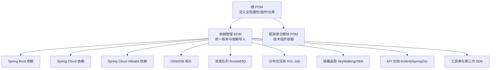
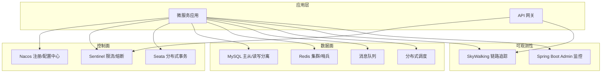
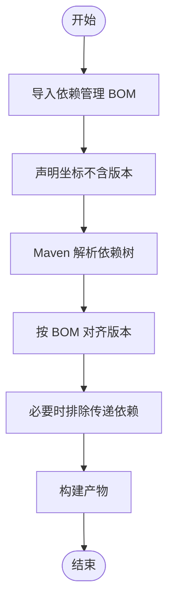
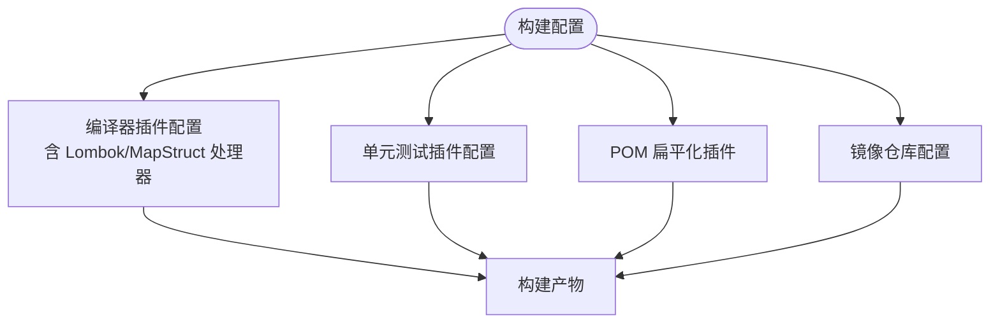
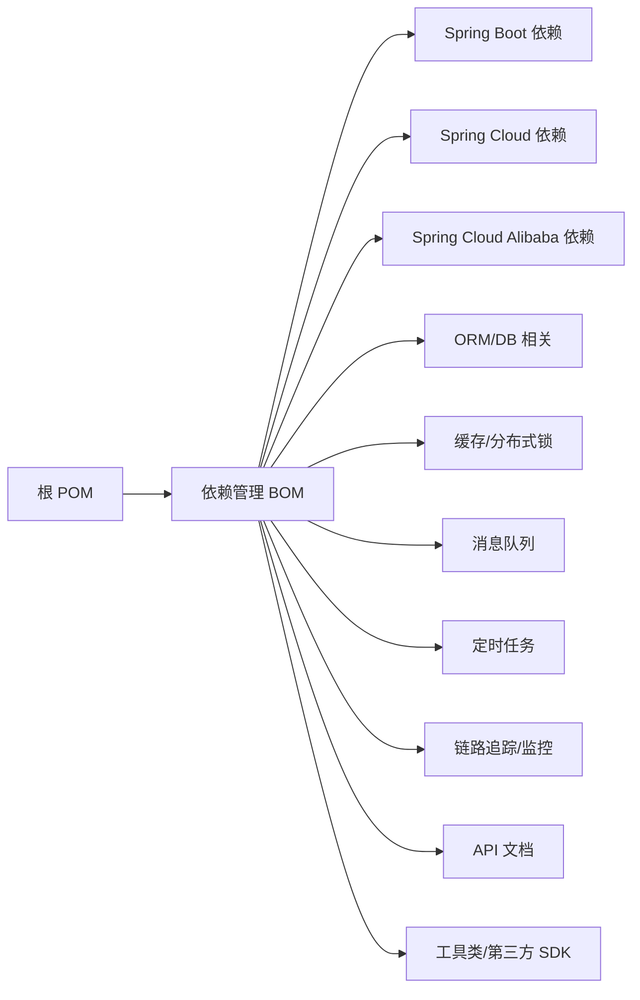

# 架构设计

<cite>
**本文引用的文件**
- [根 POM](file://pom.xml)
- [依赖管理 BOM](file://pandora-dependencies/pom.xml)
- [框架聚合模块 POM](file://pandora-framework/pom.xml)
- [项目说明](file://README.md)
</cite>

## 目录
1. [引言](#引言)
2. [项目结构](#项目结构)
3. [核心组件](#核心组件)
4. [架构总览](#架构总览)
5. [详细组件分析](#详细组件分析)
6. [依赖分析](#依赖分析)
7. [性能考虑](#性能考虑)
8. [故障排查指南](#故障排查指南)
9. [结论](#结论)
10. [附录](#附录)

## 引言
本项目为“Pandora Cloud”（潘多拉云平台）的基础脚手架，旨在提供一套可扩展、可维护且遵循现代微服务架构的设计与实现方案。项目采用 Maven 多模块结构，通过 BOM（Bill of Materials）统一管理依赖版本，并结合 Spring Boot、Spring Cloud 与 Spring Cloud Alibaba 生态体系，构建高可用、可观测、易扩展的企业级云平台基础设施。

项目目标与范围：
- 提供统一的依赖版本管理与构建工具链配置
- 明确模块划分与职责边界，支持按需组合与扩展
- 基于 Spring Cloud Alibaba 生态集成注册发现、配置中心、消息与定时任务等能力
- 覆盖安全、监控、容错等横切关注点，确保系统稳定性与可运维性

章节来源
- [项目说明:1-2](file://README.md#L1-L2)

## 项目结构
项目采用分层清晰的多模块组织方式：
- 根 POM：定义全局属性、插件管理、仓库镜像与模块聚合
- 依赖管理 BOM：集中管理第三方组件版本，作为 dependencyManagement 导入
- 框架聚合模块：作为技术组件的容器，进一步细分为 core 与 config 子模块，支撑框架与业务组件的复用

图表来源
- [根 POM:1-150](file://pom.xml#L1-L150)
- [依赖管理 BOM:1-658](file://pandora-dependencies/pom.xml#L1-L658)

章节来源
- [根 POM:1-150](file://pom.xml#L1-L150)
- [依赖管理 BOM:1-658](file://pandora-dependencies/pom.xml#L1-L658)
- [框架聚合模块 POM:1-34](file://pandora-framework/pom.xml#L1-L34)

## 核心组件
围绕微服务架构与 Spring Cloud Alibaba 生态，项目在 BOM 中集中引入以下关键组件族：
- Spring 生态：Spring Boot、Spring Cloud、Spring Cloud Alibaba
- ORM 与数据库：MyBatis、MyBatis-Plus、动态数据源、联表查询扩展
- 缓存与分布式锁：Redisson
- 消息队列：RocketMQ
- 定时任务：XXL-Job
- 链路追踪与监控：SkyWalking、Spring Boot Admin
- API 文档：Knife4j、SpringDoc OpenAPI
- 工具类与第三方 SDK：Hutool、FastJSON、OkHttp、WeChat/Alipay SDK、JustAuth 社交登录、报表组件等

这些组件通过 dependencyManagement 在 BOM 中统一版本，确保各模块在依赖解析阶段的一致性与可预测性，降低版本冲突风险。

章节来源
- [依赖管理 BOM:109-624](file://pandora-dependencies/pom.xml#L109-L624)

## 架构总览
从系统边界看，Pandora Cloud 以“统一依赖管理 + 模块化组件”为核心设计，向上支撑业务微服务，向下提供基础设施与中间件能力。整体架构强调：
- 依赖治理：通过 BOM 统一版本，避免“版本漂移”
- 模块解耦：框架与业务组件分离，便于复用与替换
- 生态集成：Spring Cloud Alibaba 一站式接入注册、配置、网关、限流等能力
- 可观测性：链路追踪与监控告警贯穿全链路
- 性能与扩展：缓存、消息、分布式任务与多数据源等能力按需启用

（本图为概念性架构示意，用于说明系统边界与关键组件）

## 详细组件分析

### 依赖管理策略（BOM）
- 版本集中管理：BOM 通过 dependencyManagement 统一声明各生态组件版本，子模块仅需声明坐标即可继承版本
- 生态对齐：Spring Boot、Spring Cloud、Spring Cloud Alibaba 三者版本号在同一层级，确保兼容性
- 第三方 SDK：覆盖支付、社交登录、报表、物联网通信等场景，便于快速集成
- 排除传递依赖：针对潜在冲突的传递依赖进行显式排除，减少冲突与体积

图表来源
- [依赖管理 BOM:109-624](file://pandora-dependencies/pom.xml#L109-L624)

章节来源
- [依赖管理 BOM:109-624](file://pandora-dependencies/pom.xml#L109-L624)

### 构建与工具链
- 编译与测试：统一 Java 版本、Surefire 插件、MapStruct/Lombok 组合注解处理器配置
- POM 扁平化：使用 flatten-maven-plugin 生成可发布的稳定 POM，避免版本号膨胀
- 仓库加速：内置阿里云与华为云镜像，提升依赖下载效率

图表来源
- [根 POM:52-132](file://pom.xml#L52-L132)

章节来源
- [根 POM:52-132](file://pom.xml#L52-L132)

### 模块化设计理念
- 框架组件与业务组件分离：框架组件聚焦通用能力（如 ORM 扩展、缓存、分布式锁），业务组件聚焦领域模型与流程封装
- 模块命名规范：业务组件命名包含 biz 前缀，便于识别与检索
- 配置与核心分离：每个组件拆分为 core 与 config 两部分，分别承担“能力封装”与“Spring 配置”，提升可测试性与可替换性

章节来源
- [框架聚合模块 POM:15-24](file://pandora-framework/pom.xml#L15-L24)

### Spring Cloud Alibaba 生态集成
- 注册与配置：通过 Spring Cloud Alibaba 依赖导入，统一接入 Nacos 注册与配置中心
- 网关与限流：结合 Sentinel 实现网关限流与熔断降级
- 分布式事务：Seata 作为分布式事务解决方案
- 服务网格与灰度：可选接入 Spring Cloud Gateway 与 Spring Cloud Alibaba 的灰度发布能力

章节来源
- [依赖管理 BOM:127-140](file://pandora-dependencies/pom.xml#L127-L140)

### ORM 与数据库扩展
- MyBatis 与 MyBatis-Plus：提供增强的 CRUD 与联表查询能力，配合动态数据源实现多数据源切换
- 易翻译（easy-trans）：提供字段值翻译能力，简化字典与枚举展示
- 代码生成器：基于 MyBatis-Plus Generator 快速生成实体与 Mapper

章节来源
- [依赖管理 BOM:190-227](file://pandora-dependencies/pom.xml#L190-L227)
- [依赖管理 BOM:228-252](file://pandora-dependencies/pom.xml#L228-L252)

### 缓存与分布式锁
- Redisson：提供 Redis 客户端、分布式对象、分布式锁、限流等能力，简化分布式场景开发

章节来源
- [依赖管理 BOM:255-259](file://pandora-dependencies/pom.xml#L255-L259)

### 消息队列与定时任务
- RocketMQ：提供高性能消息发送与消费能力，适配异步解耦与削峰填谷
- XXL-Job：提供分布式调度能力，支持任务分片与失败重试

章节来源
- [依赖管理 BOM:276-282](file://pandora-dependencies/pom.xml#L276-L282)
- [依赖管理 BOM:268-274](file://pandora-dependencies/pom.xml#L268-L274)

### 链路追踪与监控
- SkyWalking：提供链路追踪、指标采集与可视化，支持 OpenTracing 兼容
- Spring Boot Admin：提供服务端与客户端，实现健康检查、指标暴露与告警

章节来源
- [依赖管理 BOM:298-338](file://pandora-dependencies/pom.xml#L298-L338)

### API 文档与测试
- Knife4j 与 SpringDoc：提供 OpenAPI 文档与交互式接口调试界面
- 测试工具：Mockito Inline、Jedis Mock、Podam 等，提升单元测试质量与覆盖率

章节来源
- [依赖管理 BOM:165-187](file://pandora-dependencies/pom.xml#L165-L187)
- [依赖管理 BOM:340-375](file://pandora-dependencies/pom.xml#L340-L375)

## 依赖分析
从依赖导入与版本对齐角度，项目形成如下依赖关系图：

图表来源
- [根 POM:40-50](file://pom.xml#L40-L50)
- [依赖管理 BOM:109-140](file://pandora-dependencies/pom.xml#L109-L140)

章节来源
- [根 POM:40-50](file://pom.xml#L40-L50)
- [依赖管理 BOM:109-140](file://pandora-dependencies/pom.xml#L109-L140)

## 性能考虑
- 依赖扁平化：通过 flatten-maven-plugin 生成稳定 POM，减少解析层级与构建时间
- 仓库镜像：使用国内镜像源，显著提升依赖下载速度
- 编译参数优化：开启参数名发现与注解处理器路径，提升编译与类型安全
- 缓存与异步：Redisson 与 RocketMQ 提供高性能缓存与异步解耦，降低请求延迟
- 多数据源与联表查询：动态数据源与 MyBatis-Plus Join 扩展，减少跨库查询复杂度

章节来源
- [根 POM:134-147](file://pom.xml#L134-L147)
- [根 POM:64-99](file://pom.xml#L64-L99)
- [依赖管理 BOM:190-227](file://pandora-dependencies/pom.xml#L190-L227)

## 故障排查指南
- 版本冲突：优先检查 BOM 中是否已对齐版本；若仍冲突，使用 Maven Dependency 插件定位冲突来源并进行排除
- 注解处理器异常：确认 Lombok 与 MapStruct 处理器路径配置正确，避免编译期缺失生成类
- 依赖解析失败：检查本地仓库与镜像配置，必要时清理本地缓存后重试
- 监控与链路追踪：确认 SkyWalking Agent 与 Spring Boot Admin 客户端配置正确，确保探针与端点可达

章节来源
- [根 POM:64-99](file://pom.xml#L64-L99)
- [依赖管理 BOM:109-140](file://pandora-dependencies/pom.xml#L109-L140)

## 结论
Pandora Cloud 通过“BOM + 多模块”的架构设计，实现了依赖治理、模块解耦与生态集成的平衡。依托 Spring Cloud Alibaba 生态，项目具备了注册发现、配置中心、网关限流、分布式事务与可观测性的完整能力矩阵。结合缓存、消息、定时任务与 ORM 扩展，能够满足企业级云平台对性能、稳定性与扩展性的综合要求。建议在后续演进中持续完善安全加固、灰度发布与自动化运维能力，以进一步提升系统的韧性与交付效率。

## 附录
- 术语
  - BOM：Bill of Materials，用于统一管理依赖版本
  - 生态：指 Spring Boot、Spring Cloud、Spring Cloud Alibaba 及其配套组件
  - 横切关注点：安全、监控、容错等跨越多个模块的关注点
- 最佳实践
  - 严格遵循 BOM 版本对齐，避免手动指定版本
  - 将配置与核心逻辑分离，提升可测试性
  - 按需启用中间件能力，避免过度设计
  - 强化链路追踪与监控告警，保障线上问题快速定位