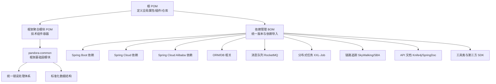
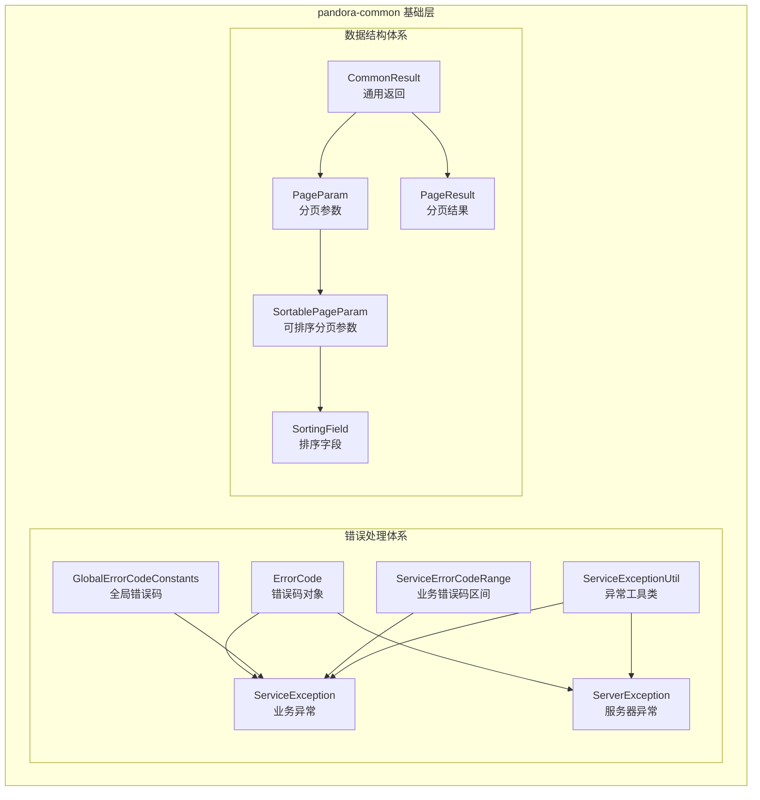
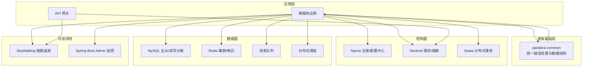
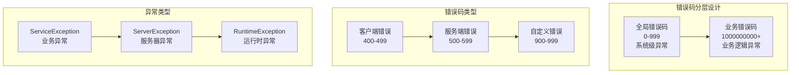
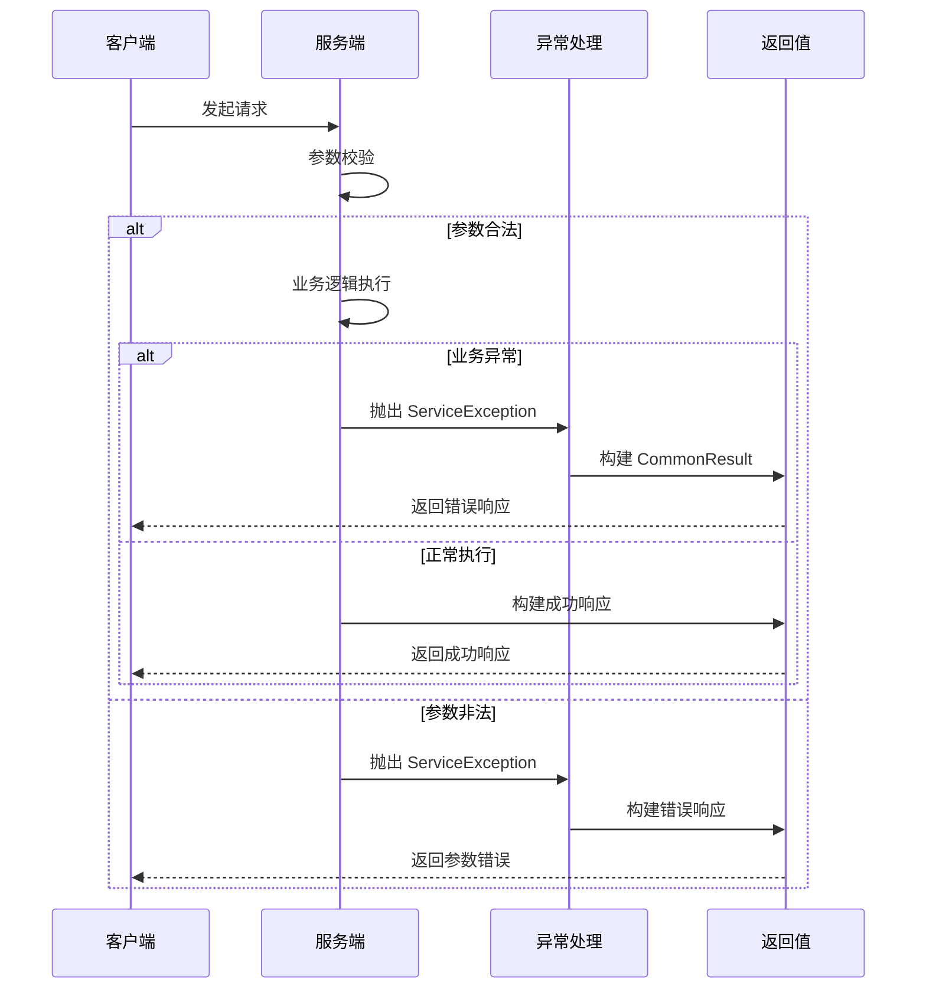
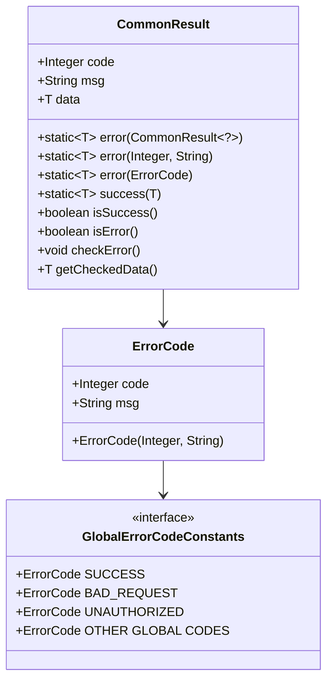
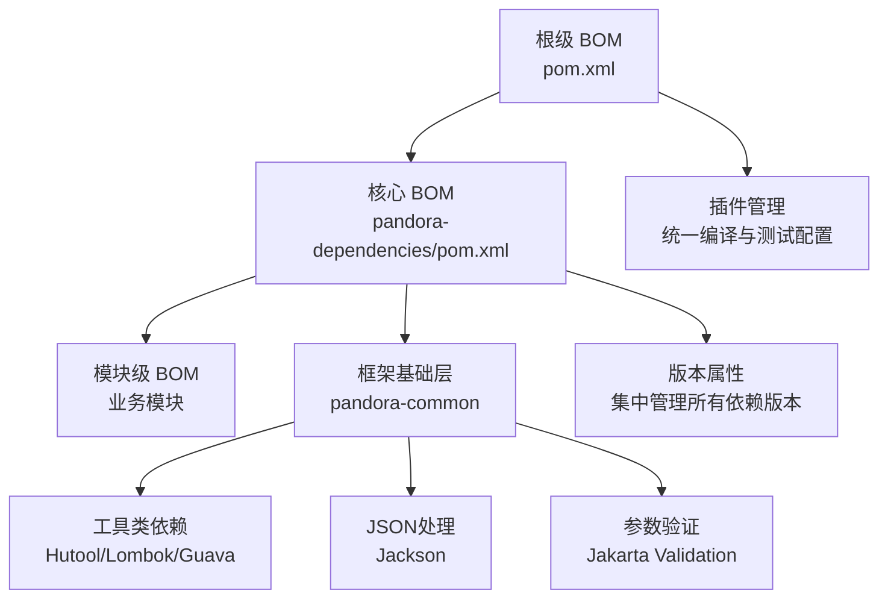
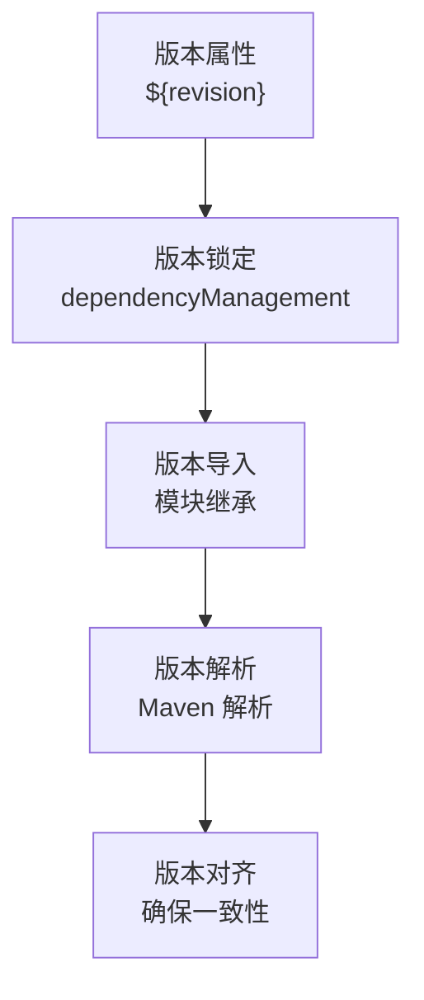
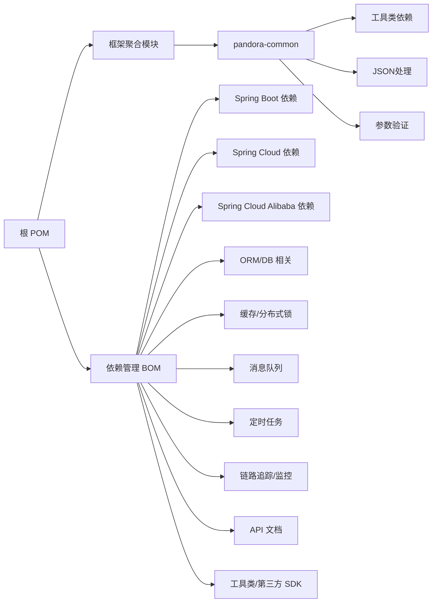

# 架构设计

<cite>
**本文引用的文件**
- [根 POM](file://pom.xml)
- [依赖管理 BOM](file://pandora-dependencies/pom.xml)
- [框架聚合模块 POM](file://pandora-framework/pom.xml)
- [pandora-common 模块 POM](file://pandora-framework/pandora-common/pom.xml)
- [ErrorCode 错误码对象](file://pandora-framework/pandora-common/src/main/java/net/ittimeline/pandora/framework/common/exception/ErrorCode.java)
- [ServiceException 业务异常](file://pandora-framework/pandora-common/src/main/java/net/ittimeline/pandora/framework/common/exception/ServiceException.java)
- [ServerException 服务器异常](file://pandora-framework/pandora-common/src/main/java/net/ittimeline/pandora/framework/common/exception/ServerException.java)
- [GlobalErrorCodeConstants 全局错误码](file://pandora-framework/pandora-common/src/main/java/net/ittimeline/pandora/framework/common/exception/enums/GlobalErrorCodeConstants.java)
- [ServiceErrorCodeRange 业务错误码区间](file://pandora-framework/pandora-common/src/main/java/net/ittimeline/pandora/framework/common/exception/enums/ServiceErrorCodeRange.java)
- [ServiceExceptionUtil 异常工具类](file://pandora-framework/pandora-common/src/main/java/net/ittimeline/pandora/framework/common/exception/util/ServiceExceptionUtil.java)
- [CommonResult 通用返回](file://pandora-framework/pandora-common/src/main/java/net/ittimeline/pandora/framework/common/pojo/CommonResult.java)
- [PageParam 分页参数](file://pandora-framework/pandora-common/src/main/java/net/ittimeline/pandora/framework/common/pojo/PageParam.java)
- [PageResult 分页结果](file://pandora-framework/pandora-common/src/main/java/net/ittimeline/pandora/framework/common/pojo/PageResult.java)
- [SortablePageParam 可排序分页参数](file://pandora-framework/pandora-common/src/main/java/net/ittimeline/pandora/framework/common/pojo/SortablePageParam.java)
- [SortingField 排序字段](file://pandora-framework/pandora-common/src/main/java/net/ittimeline/pandora/framework/common/pojo/SortingField.java)
- [pandora-common 模块说明](file://pandora-framework/pandora-common/README.md)
- [项目说明](file://README.md)
</cite>

## 更新摘要
**所做更改**
- 新增"框架基础层架构"章节，详细介绍 pandora-common 模块作为统一错误处理体系和标准化数据结构的核心作用
- 更新"核心组件"章节，增加 pandora-common 模块的详细说明和组件关系
- 更新"模块化设计理念"章节，反映框架基础层的引入对模块组织的影响
- 新增"统一错误处理体系"和"标准化数据结构"两个专门章节
- 更新架构图示，体现 pandora-common 在整体架构中的基础地位

## 目录
1. [引言](#引言)
2. [项目结构](#项目结构)
3. [框架基础层架构](#框架基础层架构)
4. [核心组件](#核心组件)
5. [架构总览](#架构总览)
6. [详细组件分析](#详细组件分析)
7. [统一错误处理体系](#统一错误处理体系)
8. [标准化数据结构](#标准化数据结构)
9. [依赖管理架构](#依赖管理架构)
10. [依赖分析](#依赖分析)
11. [性能考虑](#性能考虑)
12. [故障排查指南](#故障排查指南)
13. [结论](#结论)
14. [附录](#附录)

## 引言
本项目为"Panodora Cloud"（潘多拉云平台）的基础脚手架，旨在提供一套可扩展、可维护且遵循现代微服务架构的设计与实现方案。项目采用 Maven 多模块结构，通过 BOM（Bill of Materials）统一管理依赖版本，并结合 Spring Boot、Spring Cloud 与 Spring Cloud Alibaba 生态体系，构建高可用、可观测、易扩展的企业级云平台基础设施。

**更新** 新增 pandora-common 框架基础层模块，建立统一的错误处理体系和标准化数据结构，为整个微服务架构提供坚实的基础支撑。

项目目标与范围：
- 提供统一的依赖版本管理与构建工具链配置
- 明确模块划分与职责边界，支持按需组合与扩展
- 建立统一的错误处理标准和数据交换格式
- 基于 Spring Cloud Alibaba 生态集成注册发现、配置中心、消息与定时任务等能力
- 覆盖安全、监控、容错等横切关注点，确保系统稳定性与可运维性

**章节来源**
- [项目说明:1-2](file://README.md#L1-L2)

## 项目结构
项目采用分层清晰的多模块组织方式，新增 pandora-common 框架基础层模块：
- 根 POM：定义全局属性、插件管理、仓库镜像与模块聚合
- 依赖管理 BOM：集中管理第三方组件版本，作为 dependencyManagement 导入
- 框架聚合模块：作为技术组件的容器，包含 pandora-common 基础层模块
- 框架基础层（新增）：提供统一的错误处理体系和标准化数据结构

**图表来源**
- [根 POM:1-151](file://pom.xml#L1-L151)
- [依赖管理 BOM:1-604](file://pandora-dependencies/pom.xml#L1-L604)
- [框架聚合模块 POM:26-28](file://pandora-framework/pom.xml#L26-L28)
- [pandora-common 模块 POM:1-74](file://pandora-framework/pandora-common/pom.xml#L1-L74)

**章节来源**
- [根 POM:1-151](file://pom.xml#L1-L151)
- [依赖管理 BOM:1-604](file://pandora-dependencies/pom.xml#L1-L604)
- [框架聚合模块 POM:26-28](file://pandora-framework/pom.xml#L26-L28)
- [pandora-common 模块 POM:1-74](file://pandora-framework/pandora-common/pom.xml#L1-L74)

## 框架基础层架构

### pandora-common 模块定位
pandora-common 作为 Panodora Cloud 框架的最基础层，承担着统一标准和规范的重要职责。该模块专注于提供：
- 统一的错误处理机制，确保系统异常的标准化管理
- 标准化的数据传输格式，简化前后端交互
- 通用的业务异常工具类，提升开发效率
- 规范化的分页和排序参数，统一查询接口设计

### 核心架构设计
框架基础层采用"错误码 + 异常 + 返回值"三位一体的设计理念：

**图表来源**
- [ErrorCode 错误码对象:1-33](file://pandora-framework/pandora-common/src/main/java/net/ittimeline/pandora/framework/common/exception/ErrorCode.java#L1-L33)
- [ServiceException 业务异常:1-64](file://pandora-framework/pandora-common/src/main/java/net/ittimeline/pandora/framework/common/exception/ServiceException.java#L1-L64)
- [ServerException 服务器异常:1-65](file://pandora-framework/pandora-common/src/main/java/net/ittimeline/pandora/framework/common/exception/ServerException.java#L1-L65)
- [GlobalErrorCodeConstants 全局错误码:1-42](file://pandora-framework/pandora-common/src/main/java/net/ittimeline/pandora/framework/common/exception/enums/GlobalErrorCodeConstants.java#L1-L42)
- [ServiceErrorCodeRange 业务错误码区间:1-48](file://pandora-framework/pandora-common/src/main/java/net/ittimeline/pandora/framework/common/exception/enums/ServiceErrorCodeRange.java#L1-L48)
- [ServiceExceptionUtil 异常工具类:1-85](file://pandora-framework/pandora-common/src/main/java/net/ittimeline/pandora/framework/common/exception/util/ServiceExceptionUtil.java#L1-L85)
- [CommonResult 通用返回:1-123](file://pandora-framework/pandora-common/src/main/java/net/ittimeline/pandora/framework/common/pojo/CommonResult.java#L1-L123)
- [PageParam 分页参数:1-43](file://pandora-framework/pandora-common/src/main/java/net/ittimeline/pandora/framework/common/pojo/PageParam.java#L1-L43)
- [PageResult 分页结果:1-49](file://pandora-framework/pandora-common/src/main/java/net/ittimeline/pandora/framework/common/pojo/PageResult.java#L1-L49)
- [SortablePageParam 可排序分页参数:1-26](file://pandora-framework/pandora-common/src/main/java/net/ittimeline/pandora/framework/common/pojo/SortablePageParam.java#L1-L26)
- [SortingField 排序字段:1-39](file://pandora-framework/pandora-common/src/main/java/net/ittimeline/pandora/framework/common/pojo/SortingField.java#L1-L39)

**章节来源**
- [pandora-common 模块 POM:15-16](file://pandora-framework/pandora-common/pom.xml#L15-L16)
- [pandora-common 模块说明:1-33](file://pandora-framework/pandora-common/README.md#L1-L33)

## 核心组件
围绕微服务架构与 Spring Cloud Alibaba 生态，项目在 BOM 中集中引入以下关键组件族，新增框架基础层支持：

### 框架基础层组件
- **统一错误处理**：ErrorCode、ServiceException、ServerException、GlobalErrorCodeConstants、ServiceErrorCodeRange、ServiceExceptionUtil
- **标准化数据结构**：CommonResult、PageParam、PageResult、SortablePageParam、SortingField

### 业务组件
- **Spring 生态**：Spring Boot、Spring Cloud、Spring Cloud Alibaba
- **ORM 与数据库**：MyBatis、MyBatis-Plus、动态数据源、联表查询扩展
- **缓存与分布式锁**：Redisson
- **消息队列**：RocketMQ
- **定时任务**：XXL-Job
- **链路追踪与监控**：SkyWalking、Spring Boot Admin
- **API 文档**：Knife4j、SpringDoc OpenAPI
- **工具类与第三方 SDK**：Hutool、FastJSON、OkHttp、WeChat/Alipay SDK、JustAuth 社交登录、报表组件等

**章节来源**
- [依赖管理 BOM:109-604](file://pandora-dependencies/pom.xml#L109-L604)
- [pandora-common 模块 POM:26-71](file://pandora-framework/pandora-common/pom.xml#L26-L71)

## 架构总览
从系统边界看，Panodora Cloud 以"统一依赖管理 + 框架基础层 + 模块化组件"为核心设计，向上支撑业务微服务，向下提供基础设施与中间件能力。整体架构强调：
- 依赖治理：通过 BOM 统一版本，避免"版本漂移"
- 框架基础：pandora-common 提供统一的标准和规范
- 模块解耦：框架与业务组件分离，便于复用与替换
- 生态集成：Spring Cloud Alibaba 一站式接入注册、配置、网关、限流等能力
- 可观测性：链路追踪与监控告警贯穿全链路
- 性能与扩展：缓存、消息、分布式任务与多数据源等能力按需启用

（本图为概念性架构示意，用于说明系统边界与关键组件）

## 详细组件分析

### 依赖管理策略（BOM）
- 版本集中管理：BOM 通过 dependencyManagement 统一声明各生态组件版本，子模块仅需声明坐标即可继承版本
- 生态对齐：Spring Boot、Spring Cloud、Spring Cloud Alibaba 三者版本号在同一层级，确保兼容性
- 第三方 SDK：覆盖支付、社交登录、报表、物联网通信等场景，便于快速集成
- 排除传递依赖：针对潜在冲突的传递依赖进行显式排除，减少冲突与体积

**图表来源**
- [依赖管理 BOM:109-604](file://pandora-dependencies/pom.xml#L109-L604)

**章节来源**
- [依赖管理 BOM:109-604](file://pandora-dependencies/pom.xml#L109-L604)

### 构建与工具链
- 编译与测试：统一 Java 版本、Surefire 插件、MapStruct/Lombok 组合注解处理器配置
- POM 扁平化：使用 flatten-maven-plugin 生成可发布的稳定 POM，避免版本号膨胀
- 仓库加速：内置阿里云与华为云镜像，提升依赖下载效率

**图表来源**
- [根 POM:53-131](file://pom.xml#L53-L131)

**章节来源**
- [根 POM:53-131](file://pom.xml#L53-L131)

### 模块化设计理念
- **框架基础层**：pandora-common 作为最底层模块，提供统一的错误处理和数据结构标准
- **框架组件与业务组件分离**：框架组件聚焦通用能力（如 ORM 扩展、缓存、分布式锁），业务组件聚焦领域模型与流程封装
- **模块命名规范**：业务组件命名包含 biz 前缀，便于识别与检索
- **配置与核心分离**：每个组件拆分为 core 与 config 两部分，分别承担"能力封装"与"Spring 配置"，提升可测试性与可替换性

**章节来源**
- [框架聚合模块 POM:15-24](file://pandora-framework/pom.xml#L15-L24)
- [pandora-common 模块 POM:15-16](file://pandora-framework/pandora-common/pom.xml#L15-L16)

### Spring Cloud Alibaba 生态集成
- 注册与配置：通过 Spring Cloud Alibaba 依赖导入，统一接入 Nacos 注册与配置中心
- 网关与限流：结合 Sentinel 实现网关限流与熔断降级
- 分布式事务：Seata 作为分布式事务解决方案
- 服务网格与灰度：可选接入 Spring Cloud Gateway 与 Spring Cloud Alibaba 的灰度发布能力

**章节来源**
- [依赖管理 BOM:124-130](file://pandora-dependencies/pom.xml#L124-L130)

### ORM 与数据库扩展
- MyBatis 与 MyBatis-Plus：提供增强的 CRUD 与联表查询能力，配合动态数据源实现多数据源切换
- 易翻译（easy-trans）：提供字段值翻译能力，简化字典与枚举展示
- 代码生成器：基于 MyBatis-Plus Generator 快速生成实体与 Mapper

**章节来源**
- [依赖管理 BOM:175-229](file://pandora-dependencies/pom.xml#L175-L229)

### 缓存与分布式锁
- Redisson：提供 Redis 客户端、分布式对象、分布式锁、限流等能力，简化分布式场景开发

**章节来源**
- [依赖管理 BOM:231-236](file://pandora-dependencies/pom.xml#L231-L236)

### 消息队列与定时任务
- RocketMQ：提供高性能消息发送与消费能力，适配异步解耦与削峰填谷
- XXL-Job：提供分布式调度能力，支持任务分片与失败重试

**章节来源**
- [依赖管理 BOM:238-251](file://pandora-dependencies/pom.xml#L238-L251)

### 链路追踪与监控
- SkyWalking：提供链路追踪、指标采集与可视化，支持 OpenTracing 兼容
- Spring Boot Admin：提供服务端与客户端，实现健康检查、指标暴露与告警

**章节来源**
- [依赖管理 BOM:266-306](file://pandora-dependencies/pom.xml#L266-L306)

### API 文档与测试
- Knife4j 与 SpringDoc：提供 OpenAPI 文档与交互式接口调试界面
- 测试工具：Mockito Inline、Jedis Mock、Podam 等，提升单元测试质量与覆盖率

**章节来源**
- [依赖管理 BOM:146-167](file://pandora-dependencies/pom.xml#L146-L167)
- [依赖管理 BOM:468-498](file://pandora-dependencies/pom.xml#L468-L498)

## 统一错误处理体系

### 错误码设计原则
pandora-common 建立了完整的错误码体系，采用分层设计确保错误信息的标准化和可维护性：

**图表来源**
- [GlobalErrorCodeConstants 全局错误码:16-41](file://pandora-framework/pandora-common/src/main/java/net/ittimeline/pandora/framework/common/exception/enums/GlobalErrorCodeConstants.java#L16-L41)
- [ServiceErrorCodeRange 业务错误码区间:31-47](file://pandora-framework/pandora-common/src/main/java/net/ittimeline/pandora/framework/common/exception/enums/ServiceErrorCodeRange.java#L31-L47)
- [ServiceException 业务异常:14-63](file://pandora-framework/pandora-common/src/main/java/net/ittimeline/pandora/framework/common/exception/ServiceException.java#L14-L63)
- [ServerException 服务器异常:14-64](file://pandora-framework/pandora-common/src/main/java/net/ittimeline/pandora/framework/common/exception/ServerException.java#L14-L64)

### 异常处理流程
统一的异常处理流程确保了系统在各种异常情况下的稳定性和一致性：

**图表来源**
- [ServiceExceptionUtil 异常工具类:20-37](file://pandora-framework/pandora-common/src/main/java/net/ittimeline/pandora/framework/common/exception/util/ServiceExceptionUtil.java#L20-L37)
- [CommonResult 通用返回:54-89](file://pandora-framework/pandora-common/src/main/java/net/ittimeline/pandora/framework/common/pojo/CommonResult.java#L54-L89)

### 错误信息格式化
ServiceExceptionUtil 提供了灵活的错误信息格式化机制，支持参数化错误消息：

**章节来源**
- [ErrorCode 错误码对象:17-32](file://pandora-framework/pandora-common/src/main/java/net/ittimeline/pandora/framework/common/exception/ErrorCode.java#L17-L32)
- [ServiceExceptionUtil 异常工具类:49-82](file://pandora-framework/pandora-common/src/main/java/net/ittimeline/pandora/framework/common/exception/util/ServiceExceptionUtil.java#L49-L82)
- [ServiceException 业务异常:34-42](file://pandora-framework/pandora-common/src/main/java/net/ittimeline/pandora/framework/common/exception/ServiceException.java#L34-L42)
- [ServerException 服务器异常:35-43](file://pandora-framework/pandora-common/src/main/java/net/ittimeline/pandora/framework/common/exception/ServerException.java#L35-L43)

## 标准化数据结构

### 通用返回格式
CommonResult 作为统一的响应格式，确保了前后端交互的一致性和可预测性：

**图表来源**
- [CommonResult 通用返回:21-122](file://pandora-framework/pandora-common/src/main/java/net/ittimeline/pandora/framework/common/pojo/CommonResult.java#L21-L122)
- [ErrorCode 错误码对象:18-32](file://pandora-framework/pandora-common/src/main/java/net/ittimeline/pandora/framework/common/exception/ErrorCode.java#L18-32)
- [GlobalErrorCodeConstants 全局错误码:16-41](file://pandora-framework/pandora-common/src/main/java/net/ittimeline/pandora/framework/common/exception/enums/GlobalErrorCodeConstants.java#L16-L41)

### 分页查询标准
标准化的分页查询参数确保了不同接口之间的一致性体验：

**分页参数设计**：
- 默认页码：1（从1开始计数）
- 默认页大小：10条记录
- 最大页大小：200条记录
- 不分页模式：pageSize = -1

**可排序分页参数**：
- 继承基础分页参数
- 支持多字段排序
- 排序方向：asc（升序）、desc（降序）

**章节来源**
- [PageParam 分页参数:20-42](file://pandora-framework/pandora-common/src/main/java/net/ittimeline/pandora/framework/common/pojo/PageParam.java#L20-L42)
- [SortablePageParam 可排序分页参数:21-24](file://pandora-framework/pandora-common/src/main/java/net/ittimeline/pandora/framework/common/pojo/SortablePageParam.java#L21-L24)
- [SortingField 排序字段:19-38](file://pandora-framework/pandora-common/src/main/java/net/ittimeline/pandora/framework/common/pojo/SortingField.java#L19-L38)
- [PageResult 分页结果:19-48](file://pandora-framework/pandora-common/src/main/java/net/ittimeline/pandora/framework/common/pojo/PageResult.java#L19-L48)

## 依赖管理架构

### BOM 结构设计
项目采用三层依赖管理架构：
- **根级 BOM**：定义全局版本属性和插件配置
- **核心 BOM**：集中管理第三方组件版本
- **模块级 BOM**：各业务模块继承核心 BOM

**图表来源**
- [根 POM:41-51](file://pom.xml#L41-L51)
- [依赖管理 BOM:15-103](file://pandora-dependencies/pom.xml#L15-L103)
- [pandora-common 模块 POM:26-71](file://pandora-framework/pandora-common/pom.xml#L26-L71)

### 依赖分类体系
项目将依赖按照功能域进行分类管理，新增框架基础层依赖：

#### 核心框架依赖
- **Spring 生态**：Spring Boot、Spring Cloud、Spring Cloud Alibaba
- **网络通信**：Netty BOM、OkHttp、Vert.x
- **数据库**：Druid、MyBatis、MyBatis-Plus

#### 框架基础层依赖（新增）
- **工具类**：Hutool、Lombok、Guava
- **JSON处理**：Jackson Databind
- **参数验证**：Jakarta Validation API
- **API文档**：SpringDoc OpenAPI（provided作用域）

#### 业务能力依赖
- **缓存与分布式**：Redisson、Lock4j
- **消息与任务**：RocketMQ、XXL-Job
- **监控与追踪**：SkyWalking、Spring Boot Admin

#### 工具与集成依赖
- **基础工具**：Lombok、MapStruct、Hutool、Guava
- **API 文档**：Knife4j、SpringDoc
- **第三方集成**：AWS SDK、微信/支付宝 SDK、JustAuth

**章节来源**
- [依赖管理 BOM:106-568](file://pandora-dependencies/pom.xml#L106-L568)
- [pandora-common 模块 POM:26-71](file://pandora-framework/pandora-common/pom.xml#L26-L71)

### 版本控制策略
- **统一版本号**：使用 `${revision}` 属性统一管理项目版本
- **CI 友好版本**：通过 flatten-maven-plugin 生成稳定的版本信息
- **语义化版本**：采用 `YYYY.MM-MAJOR.MINOR.SNAPSHOT` 格式
- **版本锁定**：通过 dependencyManagement 锁定所有传递依赖版本

**图表来源**
- [根 POM:22](file://pom.xml#L22)
- [依赖管理 BOM:17](file://pandora-dependencies/pom.xml#L17)

**章节来源**
- [根 POM:22](file://pom.xml#L22)
- [依赖管理 BOM:17](file://pandora-dependencies/pom.xml#L17)

## 依赖分析
从依赖导入与版本对齐角度，项目形成如下依赖关系图，新增框架基础层：

**图表来源**
- [根 POM:41-51](file://pom.xml#L41-L51)
- [依赖管理 BOM:109-137](file://pandora-dependencies/pom.xml#L109-L137)
- [框架聚合模块 POM:26-28](file://pandora-framework/pom.xml#L26-L28)
- [pandora-common 模块 POM:26-71](file://pandora-framework/pandora-common/pom.xml#L26-L71)

**章节来源**
- [根 POM:41-51](file://pom.xml#L41-L51)
- [依赖管理 BOM:109-137](file://pandora-dependencies/pom.xml#L109-L137)
- [框架聚合模块 POM:26-28](file://pandora-framework/pom.xml#L26-L28)
- [pandora-common 模块 POM:26-71](file://pandora-framework/pandora-common/pom.xml#L26-L71)

## 性能考虑
- 依赖扁平化：通过 flatten-maven-plugin 生成稳定 POM，减少解析层级与构建时间
- 仓库镜像：使用国内镜像源，显著提升依赖下载速度
- 编译参数优化：开启参数名发现与注解处理器路径，提升编译与类型安全
- 缓存与异步：Redisson 与 RocketMQ 提供高性能缓存与异步解耦，降低请求延迟
- 多数据源与联表查询：动态数据源与 MyBatis-Plus Join 扩展，减少跨库查询复杂度
- **框架基础层优化**：统一的错误处理和数据结构减少了重复代码，提升了系统整体性能

**章节来源**
- [根 POM:104-129](file://pom.xml#L104-L129)
- [根 POM:135-148](file://pom.xml#L135-L148)
- [依赖管理 BOM:175-229](file://pandora-dependencies/pom.xml#L175-L229)
- [pandora-common 模块 POM:20-23](file://pandora-framework/pandora-common/pom.xml#L20-L23)

## 故障排查指南
- 版本冲突：优先检查 BOM 中是否已对齐版本；若仍冲突，使用 Maven Dependency 插件定位冲突来源并进行排除
- 注解处理器异常：确认 Lombok 与 MapStruct 处理器路径配置正确，避免编译期缺失生成类
- 依赖解析失败：检查本地仓库与镜像配置，必要时清理本地缓存后重试
- 监控与链路追踪：确认 SkyWalking Agent 与 Spring Boot Admin 客户端配置正确，确保探针与端点可达
- **框架基础层问题**：检查 pandora-common 模块的依赖注入和异常处理是否正常工作

**章节来源**
- [根 POM:63-99](file://pom.xml#L63-L99)
- [依赖管理 BOM:109-137](file://pandora-dependencies/pom.xml#L109-L137)

## 结论
Panodora Cloud 通过"BOM + 框架基础层 + 多模块"的架构设计，实现了依赖治理、统一标准与模块解耦的平衡。新增的 pandora-common 框架基础层模块，建立了统一的错误处理体系和标准化数据结构，为整个微服务架构提供了坚实的基础支撑。

依托 Spring Cloud Alibaba 生态，项目具备了注册发现、配置中心、网关限流、分布式事务与可观测性的完整能力矩阵。结合缓存、消息、定时任务与 ORM 扩展，以及统一的错误处理和数据结构标准，能够满足企业级云平台对性能、稳定性、可维护性和扩展性的综合要求。

**更新要点** 框架基础层的引入显著提升了系统的标准化程度和开发效率，通过统一的错误码、异常处理和数据结构，减少了重复代码和沟通成本，为后续的功能扩展和团队协作奠定了良好基础。

## 附录
- 术语
  - BOM：Bill of Materials，用于统一管理依赖版本
  - 生态：指 Spring Boot、Spring Cloud、Spring Cloud Alibaba 及其配套组件
  - 横切关注点：安全、监控、容错等跨越多个模块的关注点
  - **框架基础层**：pandora-common 模块，提供统一的错误处理和数据结构标准
- 最佳实践
  - 严格遵循 BOM 版本对齐，避免手动指定版本
  - 将配置与核心逻辑分离，提升可测试性
  - 按需启用中间件能力，避免过度设计
  - 强化链路追踪与监控告警，保障线上问题快速定位
  - 定期审查和更新依赖版本，保持技术栈的现代化
  - **充分利用框架基础层提供的统一标准，确保代码风格和接口一致**