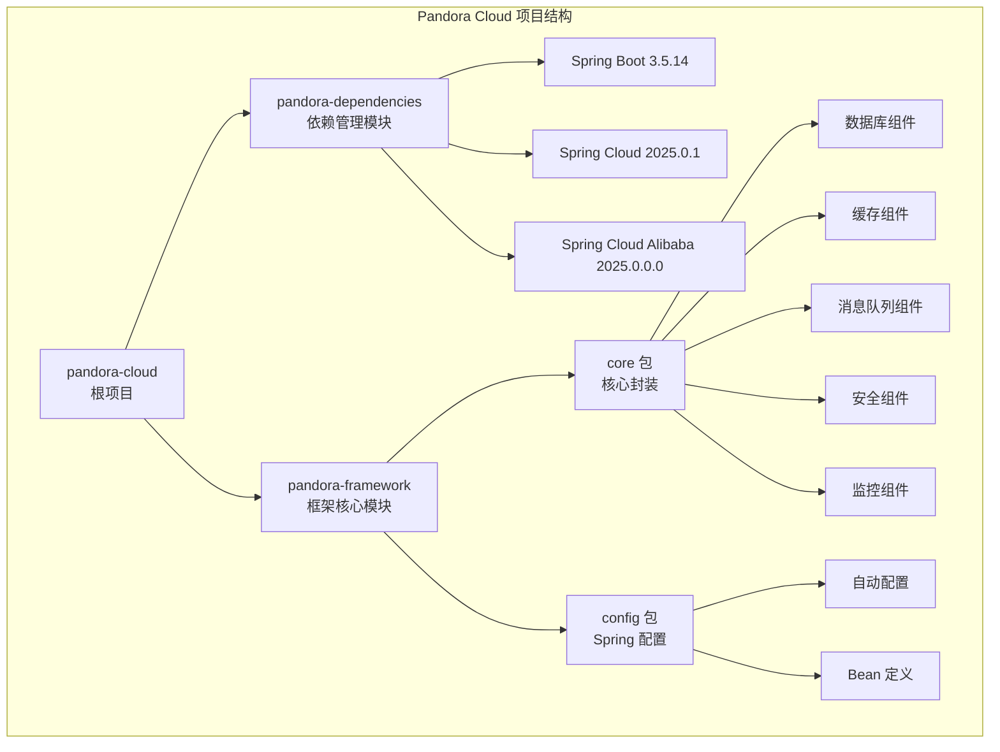
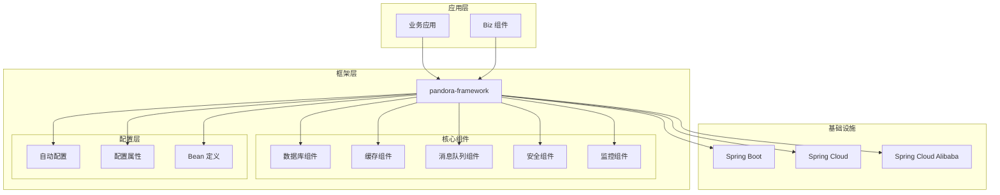
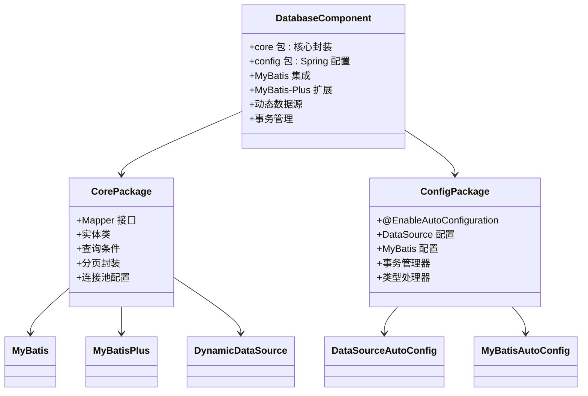
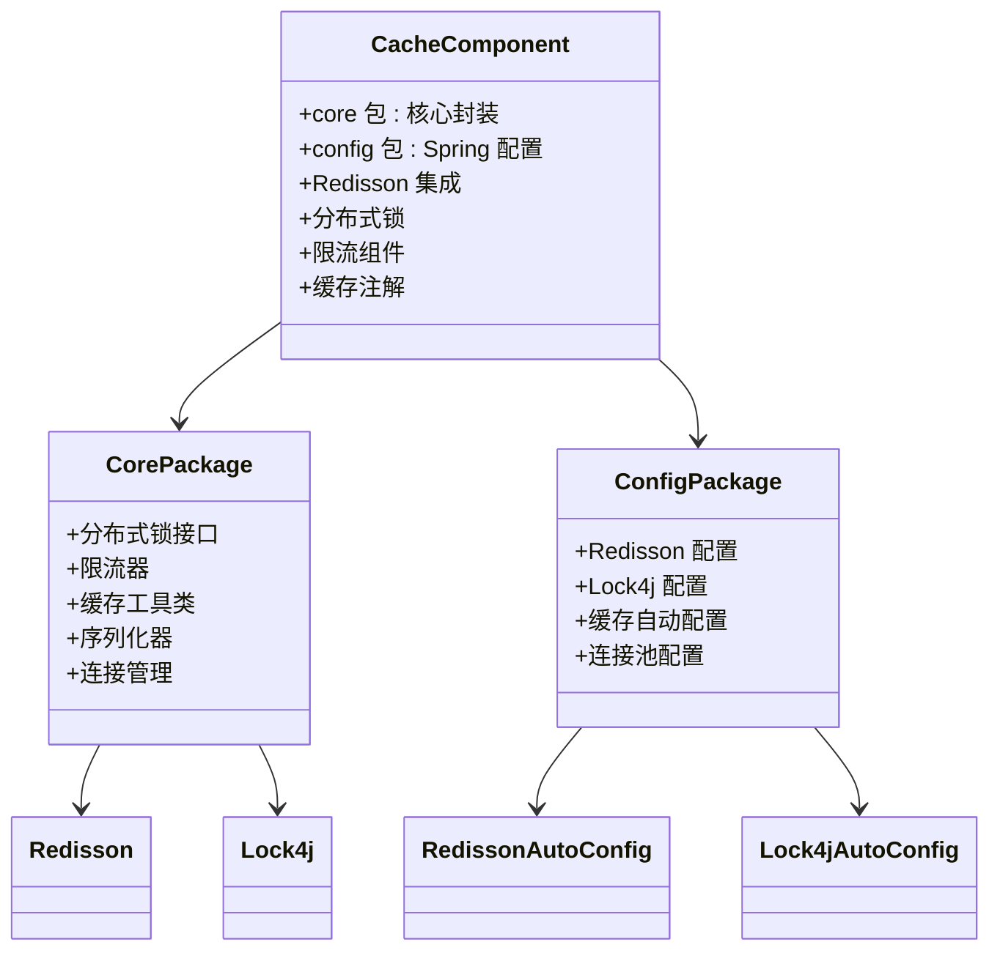
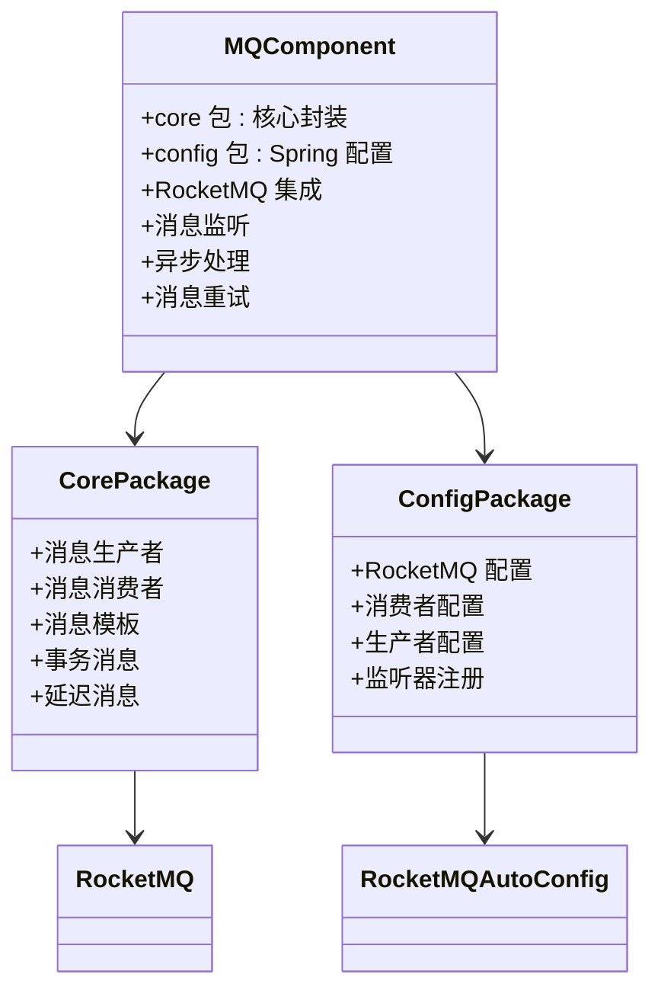
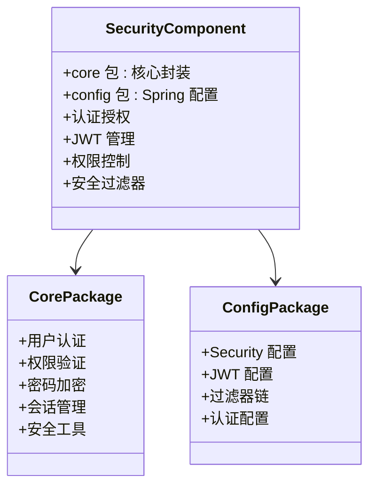
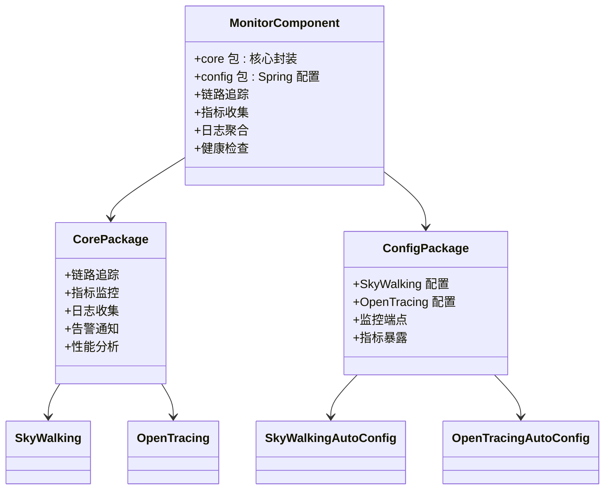
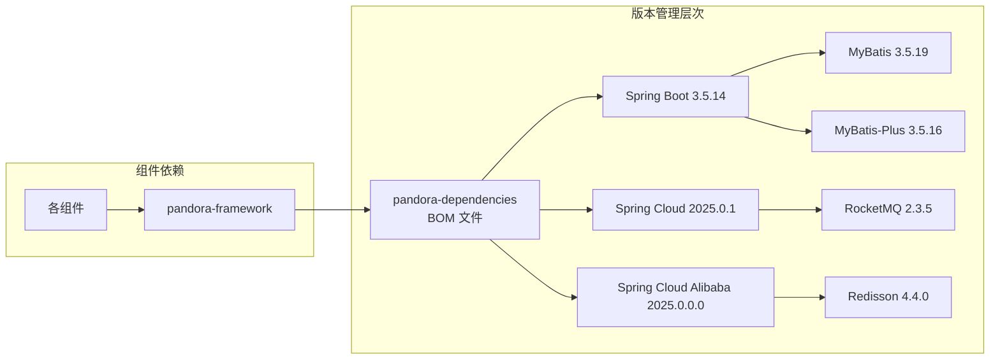
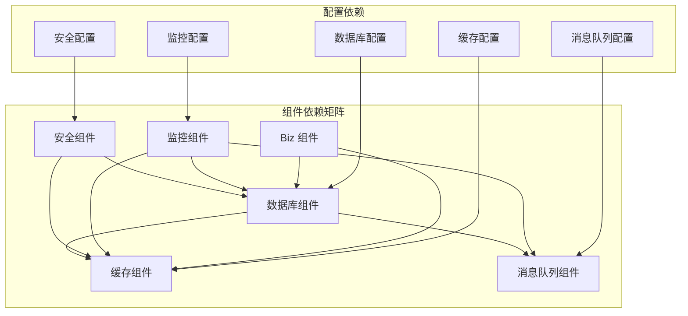

# 框架组件架构

<cite>
**本文档引用的文件**
- [pandora-framework/pom.xml](file://pandora-framework/pom.xml)
- [pandora-dependencies/pom.xml](file://pandora-dependencies/pom.xml)
- [pom.xml](file://pom.xml)
- [README.md](file://README.md)
</cite>

## 目录
1. [简介](#简介)
2. [项目结构](#项目结构)
3. [核心组件](#核心组件)
4. [架构概览](#架构概览)
5. [详细组件分析](#详细组件分析)
6. [依赖关系分析](#依赖关系分析)
7. [性能考虑](#性能考虑)
8. [故障排除指南](#故障排除指南)
9. [结论](#结论)

## 简介

Pandora Cloud 是一个基于 Spring Boot 3.5.14 构建的企业级云平台基础脚手架项目。该项目旨在为企业应用开发提供一套完整的框架组件架构，通过模块化设计实现功能的可插拔性和高度的可扩展性。

根据项目描述，pandora-framework 模块作为技术组件的核心，采用"core + config"的双包设计模式，每个组件都包含两个主要部分：
- **core 包**：组件的核心封装和核心功能实现
- **config 包**：基于 Spring 的自动配置和依赖注入

## 项目结构

当前仓库采用 Maven 多模块架构，主要包含以下核心模块：

**图表来源**
- [pandora-framework/pom.xml:15-24](file://pandora-framework/pom.xml#L15-L24)
- [pom.xml:11-14](file://pom.xml#L11-L14)

**章节来源**
- [pandora-framework/pom.xml:15-24](file://pandora-framework/pom.xml#L15-L24)
- [pom.xml:11-14](file://pom.xml#L11-L14)

## 核心组件

### 组件分类体系

根据项目设计，技术组件分为两大类：

#### 框架组件
框架组件是对现有流行技术框架的增强和扩展，主要包括：
- **数据库层**：MyBatis、MyBatis-Plus、动态数据源
- **缓存层**：Redisson 分布式缓存
- **消息队列**：RocketMQ 消息中间件
- **定时任务**：XXL-Job 分布式任务调度
- **分布式锁**：Lock4j + Redisson
- **链路追踪**：SkyWalking + OpenTracing
- **监控管理**：Spring Boot Admin

#### 业务组件
业务组件专注于业务领域的功能封装，如数据字典、操作日志等，命名中包含 "biz" 字样。

### 设计理念

框架采用"约定优于配置"的设计原则，通过以下方式实现模块化：

1. **双包架构**：每个组件都包含 core 和 config 两个包
2. **自动配置**：通过 Spring Boot 自动配置实现零样板代码
3. **可插拔性**：组件间松耦合，支持按需启用
4. **版本统一**：通过 BOM 文件统一管理依赖版本

**章节来源**
- [pandora-framework/pom.xml:15-24](file://pandora-framework/pom.xml#L15-L24)

## 架构概览

**图表来源**
- [pandora-dependencies/pom.xml:65-91](file://pandora-dependencies/pom.xml#L65-L91)
- [pandora-dependencies/pom.xml:109-140](file://pandora-dependencies/pom.xml#L109-L140)

## 详细组件分析

### 数据库组件架构

**图表来源**
- [pandora-dependencies/pom.xml:189-227](file://pandora-dependencies/pom.xml#L189-L227)

### 缓存组件架构

**图表来源**
- [pandora-dependencies/pom.xml:255-259](file://pandora-dependencies/pom.xml#L255-L259)
- [pandora-dependencies/pom.xml:286-295](file://pandora-dependencies/pom.xml#L286-L295)

### 消息队列组件架构

**图表来源**
- [pandora-dependencies/pom.xml:277-282](file://pandora-dependencies/pom.xml#L277-L282)

### 安全组件架构

### 监控组件架构

**图表来源**
- [pandora-dependencies/pom.xml:298-327](file://pandora-dependencies/pom.xml#L298-L327)

## 依赖关系分析

### 版本管理策略

**图表来源**
- [pandora-dependencies/pom.xml:109-140](file://pandora-dependencies/pom.xml#L109-L140)
- [pom.xml:40-50](file://pom.xml#L40-L50)

### 组件间依赖关系

**章节来源**
- [pandora-dependencies/pom.xml:109-621](file://pandora-dependencies/pom.xml#L109-L621)

## 性能考虑

### 架构性能特性

1. **模块化设计**：通过独立的组件模块，可以按需加载，减少不必要的内存占用
2. **连接池优化**：统一的连接池配置和管理，提高资源利用率
3. **异步处理**：消息队列组件支持异步处理，提升系统吞吐量
4. **缓存策略**：多级缓存架构，减少数据库访问压力
5. **监控集成**：内置监控组件，便于性能调优和问题定位

### 扩展性设计

- **SPI 机制**：通过 Spring Boot 的自动配置机制实现插件化扩展
- **配置驱动**：通过配置文件实现功能开关和行为定制
- **接口抽象**：清晰的接口定义，便于第三方实现替换

## 故障排除指南

### 常见问题诊断

1. **组件启动失败**
   - 检查对应组件的依赖是否正确引入
   - 验证配置文件中的相关配置项
   - 查看组件的自动配置类是否被正确加载

2. **版本冲突问题**
   - 使用 Maven Dependency Plugin 检查依赖树
   - 确认 pandora-dependencies 中的版本管理
   - 检查是否有手动指定的版本覆盖

3. **配置不生效**
   - 验证 @EnableAutoConfiguration 注解
   - 检查配置类的条件注解
   - 确认配置文件的加载顺序

**章节来源**
- [pandora-dependencies/pom.xml:109-621](file://pandora-dependencies/pom.xml#L109-L621)

## 结论

Pandora Cloud 框架组件架构展现了现代企业级应用开发的最佳实践。通过精心设计的模块化架构、完善的依赖管理体系和灵活的扩展机制，为开发者提供了一个功能完整、易于维护、具有良好性能表现的开发基础。

该架构的主要优势包括：

1. **清晰的职责分离**：core 和 config 包的分离实现了关注点的清晰划分
2. **强大的生态集成**：与 Spring 生态系统的深度集成，提供了丰富的功能扩展能力
3. **统一的版本管理**：通过 BOM 文件确保了依赖版本的一致性
4. **良好的可扩展性**：模块化设计使得新功能的添加变得简单直观

随着项目的进一步发展，建议重点关注以下方面：
- 完善各组件的具体实现代码
- 增加详细的使用示例和最佳实践
- 提供更完善的测试覆盖
- 优化性能监控和诊断工具