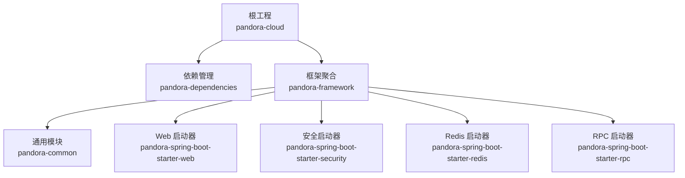
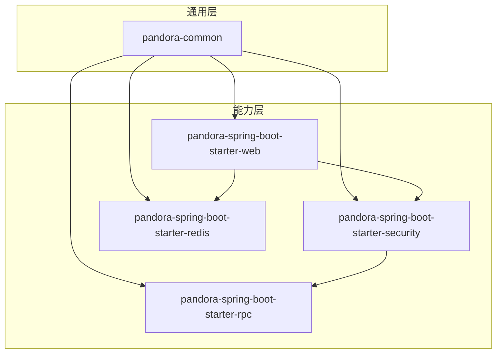
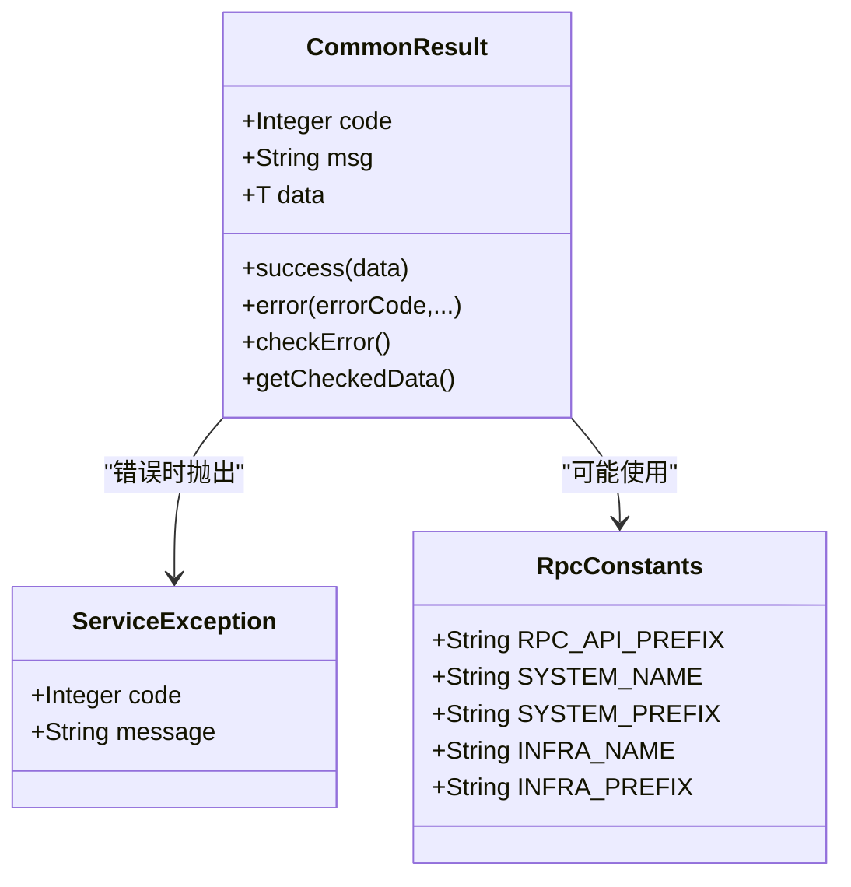
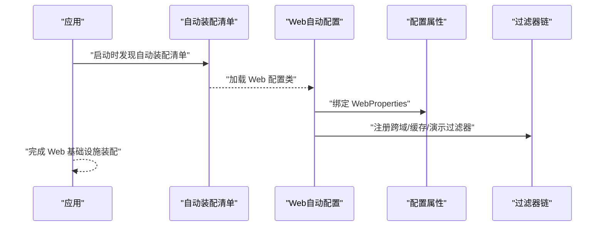
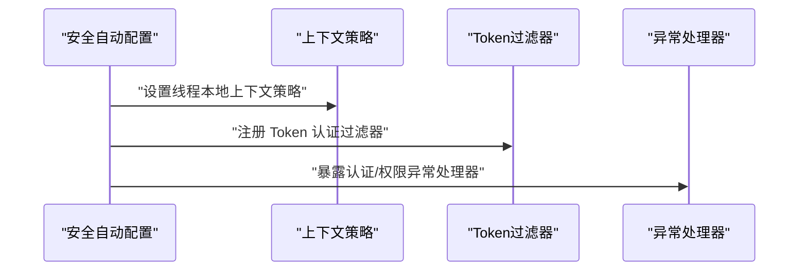
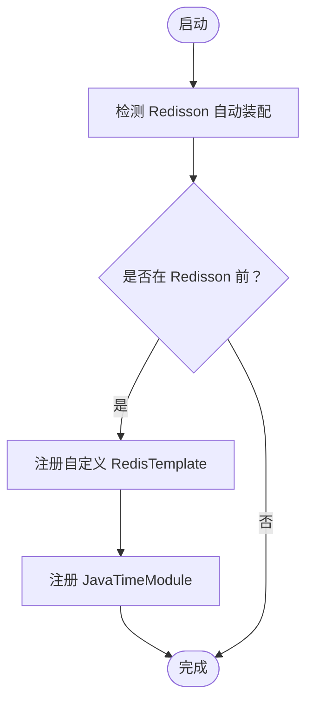
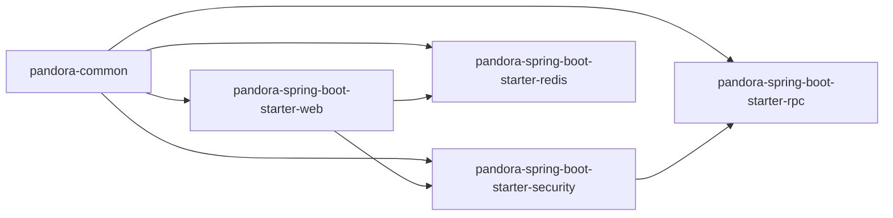

# 模块化设计

<cite>
**本文引用的文件**
- [根 POM](file://pom.xml)
- [框架聚合 POM](file://pandora-framework/pom.xml)
- [依赖管理 POM](file://pandora-dependencies/pom.xml)
- [通用模块 POM](file://pandora-framework/pandora-common/pom.xml)
- [Web 启动器 POM](file://pandora-framework/pandora-spring-boot-starter-web/pom.xml)
- [安全启动器 POM](file://pandora-framework/pandora-spring-boot-starter-security/pom.xml)
- [Redis 启动器 POM](file://pandora-framework/pandora-spring-boot-starter-redis/pom.xml)
- [RPC 启动器 POM](file://pandora-framework/pandora-spring-boot-starter-rpc/pom.xml)
- [通用常量：RpcConstants](file://pandora-framework/pandora-common/src/main/java/net/ittimeline/pandora/framework/common/constants/RpcConstants.java)
- [通用返回：CommonResult](file://pandora-framework/pandora-common/src/main/java/net/ittimeline/pandora/framework/common/pojo/CommonResult.java)
- [Web 自动配置：PandoraWebAutoConfiguration](file://pandora-framework/pandora-spring-boot-starter-web/src/main/java/net/ittimeline/pandora/framework/web/config/PandoraWebAutoConfiguration.java)
- [安全自动配置：PandoraSecurityAutoConfiguration](file://pandora-framework/pandora-spring-boot-starter-security/src/main/java/net/ittimeline/pandora/framework/security/config/PandoraSecurityAutoConfiguration.java)
- [Redis 自动配置：PandoraRedisAutoConfiguration](file://pandora-framework/pandora-spring-boot-starter-redis/src/main/java/net/ittimeline/pandora/framework/redis/config/PandoraRedisAutoConfiguration.java)
- [Web 自动装配导入清单](file://pandora-framework/pandora-spring-boot-starter-web/src/main/resources/META-INF/spring/org.springframework.boot.autoconfigure.AutoConfiguration.imports)
- [安全自动装配导入清单](file://pandora-framework/pandora-spring-boot-starter-security/src/main/resources/META-INF/spring/org.springframework.boot.autoconfigure.AutoConfiguration.imports)
- [Redis 自动装配导入清单](file://pandora-framework/pandora-spring-boot-starter-redis/src/main/resources/META-INF/spring/org.springframework.boot.autoconfigure.AutoConfiguration.imports)
- [README](file://README.md)
</cite>

## 目录
1. [引言](#引言)
2. [项目结构](#项目结构)
3. [核心组件](#核心组件)
4. [架构总览](#架构总览)
5. [详细组件分析](#详细组件分析)
6. [依赖分析](#依赖分析)
7. [性能考虑](#性能考虑)
8. [故障排查指南](#故障排查指南)
9. [结论](#结论)
10. [附录](#附录)

## 引言
本设计文档面向 Pandora Cloud 框架的 Maven 多模块架构，系统性阐述模块划分策略、职责边界、依赖关系与接口契约，并给出命名规范、包结构设计与版本管理策略。通过模块化实现功能解耦与复用，降低耦合度、提升可维护性与可扩展性。

## 项目结构
- 顶层聚合工程负责版本与插件统一管理，框架模块作为子模块进行分层组织。
- 框架模块进一步细分为通用模块与若干 Spring Boot Starter 组件，分别承担基础能力与特定领域的自动装配。
- 依赖管理模块集中管理第三方与内部模块版本，确保一致性与可演进性。

图表来源
- [根 POM:11-14](file://pom.xml#L11-L14)
- [框架聚合 POM:26-32](file://pandora-framework/pom.xml#L26-L32)

章节来源
- [根 POM:1-150](file://pom.xml#L1-L150)
- [框架聚合 POM:1-41](file://pandora-framework/pom.xml#L1-L41)
- [README:1-15](file://README.md#L1-L15)

## 核心组件
- 通用模块（pandora-common）
  - 职责：提供基础 POJO、枚举、异常体系、工具类与通用常量，作为所有业务与功能模块的基石。
  - 关键点：异常与返回体抽象、RPC 常量定义、通用工具集。
- Web 启动器（pandora-spring-boot-starter-web）
  - 职责：提供 Web 层基础设施，包括全局异常、响应包装、API 日志、脱敏、XSS 过滤、加密、Swagger/OpenAPI、跨域、请求缓存等。
  - 关键点：自动装配入口与过滤器链顺序控制。
- 安全启动器（pandora-spring-boot-starter-security）
  - 职责：提供认证授权、权限校验、操作日志记录、线程上下文传递策略等。
  - 关键点：自动配置顺序、密码编码器、自定义上下文策略。
- Redis 启动器（pandora-spring-boot-starter-redis）
  - 职责：提供 Redis 自动装配、JSON 序列化、RedisTemplate 定制与缓存管理。
  - 关键点：与 Redisson 的装配顺序与 JSON 时间模块注册。
- RPC 启动器（pandora-spring-boot-starter-rpc）
  - 职责：提供 RPC 相关的通用能力与自动装配（当前目录结构中暂无具体实现，保留扩展空间）。

章节来源
- [通用模块 POM:1-114](file://pandora-framework/pandora-common/pom.xml#L1-L114)
- [Web 启动器 POM:1-91](file://pandora-framework/pandora-spring-boot-starter-web/pom.xml#L1-L91)
- [安全启动器 POM:1-73](file://pandora-framework/pandora-spring-boot-starter-security/pom.xml#L1-L73)
- [Redis 启动器 POM:1-43](file://pandora-framework/pandora-spring-boot-starter-redis/pom.xml#L1-L43)
- [RPC 启动器 POM:1-20](file://pandora-framework/pandora-spring-boot-starter-rpc/pom.xml#L1-L20)

## 架构总览
模块化遵循“通用能力下沉、领域能力上浮”的原则：
- 通用模块承载跨领域公共能力，避免重复造轮子。
- 各启动器模块基于 Spring Boot 自动装配机制，按需启用对应能力。
- 依赖管理模块统一版本，减少冲突与升级成本。

图表来源
- [框架聚合 POM:26-32](file://pandora-framework/pom.xml#L26-L32)
- [Web 启动器 POM:20-29](file://pandora-framework/pandora-spring-boot-starter-web/pom.xml#L20-L29)
- [安全启动器 POM:23-39](file://pandora-framework/pandora-spring-boot-starter-security/pom.xml#L23-L39)
- [Redis 启动器 POM:19-24](file://pandora-framework/pandora-spring-boot-starter-redis/pom.xml#L19-L24)

## 详细组件分析

### 通用模块（pandora-common）
- 设计意图
  - 提供统一的异常模型、返回体、常用工具与常量，支撑上层业务与各启动器模块。
- 关键类与职责
  - 通用返回体：统一对外响应格式与错误检查。
  - RPC 常量：统一 RPC 接口前缀与服务命名约定，便于跨模块协作。
  - 异常体系：业务异常封装，与返回体联动。
- 包结构建议
  - constants、enums、pojo、exception、util、validation 等分层清晰，避免交叉依赖。

图表来源
- [通用返回：CommonResult:21-123](file://pandora-framework/pandora-common/src/main/java/net/ittimeline/pandora/framework/common/pojo/CommonResult.java#L21-L123)
- [通用常量：RpcConstants:12-41](file://pandora-framework/pandora-common/src/main/java/net/ittimeline/pandora/framework/common/constants/RpcConstants.java#L12-L41)
- [异常类：ServiceException:13-64](file://pandora-framework/pandora-common/src/main/java/net/ittimeline/pandora/framework/common/exception/ServiceException.java#L13-L64)

章节来源
- [通用模块 POM:19-114](file://pandora-framework/pandora-common/pom.xml#L19-L114)
- [通用返回：CommonResult:1-123](file://pandora-framework/pandora-common/src/main/java/net/ittimeline/pandora/framework/common/pojo/CommonResult.java#L1-L123)
- [通用常量：RpcConstants:1-42](file://pandora-framework/pandora-common/src/main/java/net/ittimeline/pandora/framework/common/constants/RpcConstants.java#L1-L42)
- [异常类：ServiceException:1-64](file://pandora-framework/pandora-common/src/main/java/net/ittimeline/pandora/framework/common/exception/ServiceException.java#L1-L64)

### Web 启动器（pandora-spring-boot-starter-web）
- 设计意图
  - 以自动装配为核心，快速提供 Web 层通用能力，屏蔽复杂配置细节。
- 关键点
  - 自动装配入口：通过 META-INF/spring 自动装配清单加载多个配置类。
  - 过滤器链：跨域、请求体缓存、演示模式等过滤器按序执行。
  - 全局处理：统一异常、响应包装、RestTemplate 定制。
- 依赖关系
  - 依赖通用模块与 RPC 启动器，形成 Web 能力闭环。

图表来源
- [Web 自动装配导入清单:1-8](file://pandora-framework/pandora-spring-boot-starter-web/src/main/resources/META-INF/spring/org.springframework.boot.autoconfigure.AutoConfiguration.imports#L1-L8)
- [Web 自动配置：PandoraWebAutoConfiguration:43-177](file://pandora-framework/pandora-spring-boot-starter-web/src/main/java/net/ittimeline/pandora/framework/web/config/PandoraWebAutoConfiguration.java#L43-L177)

章节来源
- [Web 启动器 POM:19-91](file://pandora-framework/pandora-spring-boot-starter-web/pom.xml#L19-L91)
- [Web 自动装配导入清单:1-8](file://pandora-framework/pandora-spring-boot-starter-web/src/main/resources/META-INF/spring/org.springframework.boot.autoconfigure.AutoConfiguration.imports#L1-L8)
- [Web 自动配置：PandoraWebAutoConfiguration:1-177](file://pandora-framework/pandora-spring-boot-starter-web/src/main/java/net/ittimeline/pandora/framework/web/config/PandoraWebAutoConfiguration.java#L1-L177)

### 安全启动器（pandora-spring-boot-starter-security）
- 设计意图
  - 提供认证授权、权限校验与操作日志能力，统一安全上下文策略。
- 关键点
  - 自动装配顺序靠前，避免与 Spring Security 默认配置冲突。
  - 密码编码器、Token 过滤器、安全服务接口与上下文策略注入。
- 依赖关系
  - 依赖通用模块与 Web 启动器，形成“安全增强”的 Web 能力。

图表来源
- [安全自动装配导入清单:1-6](file://pandora-framework/pandora-spring-boot-starter-security/src/main/resources/META-INF/spring/org.springframework.boot.autoconfigure.AutoConfiguration.imports#L1-L6)
- [安全自动配置：PandoraSecurityAutoConfiguration:36-99](file://pandora-framework/pandora-spring-boot-starter-security/src/main/java/net/ittimeline/pandora/framework/security/config/PandoraSecurityAutoConfiguration.java#L36-L99)

章节来源
- [安全启动器 POM:23-73](file://pandora-framework/pandora-spring-boot-starter-security/pom.xml#L23-L73)
- [安全自动装配导入清单:1-6](file://pandora-framework/pandora-spring-boot-starter-security/src/main/resources/META-INF/spring/org.springframework.boot.autoconfigure.AutoConfiguration.imports#L1-L6)
- [安全自动配置：PandoraSecurityAutoConfiguration:1-99](file://pandora-framework/pandora-spring-boot-starter-security/src/main/java/net/ittimeline/pandora/framework/security/config/PandoraSecurityAutoConfiguration.java#L1-L99)

### Redis 启动器（pandora-spring-boot-starter-redis）
- 设计意图
  - 提供 Redis 自动装配与 JSON 序列化定制，统一 RedisTemplate 使用体验。
- 关键点
  - 在 Redisson 自动装配之前注册自定义 RedisTemplate，确保序列化策略生效。
  - 注册 JavaTimeModule，解决 LocalDateTime 序列化问题。
- 依赖关系
  - 依赖通用模块，提供缓存与分布式能力基础。

图表来源
- [Redis 自动装配导入清单:1-2](file://pandora-framework/pandora-spring-boot-starter-redis/src/main/resources/META-INF/spring/org.springframework.boot.autoconfigure.AutoConfiguration.imports#L1-L2)
- [Redis 自动配置：PandoraRedisAutoConfiguration:19-50](file://pandora-framework/pandora-spring-boot-starter-redis/src/main/java/net/ittimeline/pandora/framework/redis/config/PandoraRedisAutoConfiguration.java#L19-L50)

章节来源
- [Redis 启动器 POM:19-43](file://pandora-framework/pandora-spring-boot-starter-redis/pom.xml#L19-L43)
- [Redis 自动装配导入清单:1-2](file://pandora-framework/pandora-spring-boot-starter-redis/src/main/resources/META-INF/spring/org.springframework.boot.autoconfigure.AutoConfiguration.imports#L1-L2)
- [Redis 自动配置：PandoraRedisAutoConfiguration:1-50](file://pandora-framework/pandora-spring-boot-starter-redis/src/main/java/net/ittimeline/pandora/framework/redis/config/PandoraRedisAutoConfiguration.java#L1-L50)

### RPC 启动器（pandora-spring-boot-starter-rpc）
- 设计意图
  - 为微服务间调用提供通用能力与自动装配，当前仓库中保留模块结构，具体实现可在后续迭代中完善。
- 建议
  - 与通用模块共享常量与返回体，确保跨服务交互的一致性。

章节来源
- [RPC 启动器 POM:1-20](file://pandora-framework/pandora-spring-boot-starter-rpc/pom.xml#L1-L20)

## 依赖分析
- 依赖方向
  - 通用模块为所有启动器模块的上游依赖。
  - Web 启动器依赖安全与 Redis 启动器，体现“Web 增强”特性。
  - 安全启动器依赖通用模块与 RPC 启动器，强调“安全增强”。
- 版本管理
  - 通过依赖管理模块集中管理版本，避免版本漂移与冲突。
- 循环依赖
  - 当前结构未见循环依赖；若新增模块需严格遵守“单向依赖”原则。

图表来源
- [框架聚合 POM:26-32](file://pandora-framework/pom.xml#L26-L32)
- [Web 启动器 POM:20-29](file://pandora-framework/pandora-spring-boot-starter-web/pom.xml#L20-L29)
- [安全启动器 POM:23-39](file://pandora-framework/pandora-spring-boot-starter-security/pom.xml#L23-L39)
- [Redis 启动器 POM:19-24](file://pandora-framework/pandora-spring-boot-starter-redis/pom.xml#L19-L24)

章节来源
- [依赖管理 POM:106-601](file://pandora-dependencies/pom.xml#L106-L601)

## 性能考虑
- 自动装配顺序
  - 通过 AutoConfigureOrder 与 before/after 策略，确保关键 Bean（如 RedisTemplate、上下文策略）优先注册，避免二次装配带来的性能损耗。
- 序列化与缓存
  - Redis 使用 JSON 序列化并注册时间模块，减少反序列化开销与兼容性问题。
- 过滤器链
  - 明确过滤器顺序，避免跨域配置失效或重复读取请求体导致的额外 IO。

## 故障排查指南
- 自动装配未生效
  - 检查 META-INF/spring 自动装配清单是否存在且路径正确。
  - 确认模块坐标与版本一致，避免依赖解析异常。
- 过滤器顺序问题
  - 跨域配置不生效时，确认过滤器注册顺序是否覆盖默认值。
- Redis 序列化异常
  - 确认 JavaTimeModule 是否注册，避免 LocalDateTime 序列化失败。
- 安全上下文丢失
  - 检查是否正确设置了线程本地上下文策略，确保认证信息在异步场景可用。

章节来源
- [Web 自动配置：PandoraWebAutoConfiguration:116-152](file://pandora-framework/pandora-spring-boot-starter-web/src/main/java/net/ittimeline/pandora/framework/web/config/PandoraWebAutoConfiguration.java#L116-L152)
- [Redis 自动配置：PandoraRedisAutoConfiguration:40-46](file://pandora-framework/pandora-spring-boot-starter-redis/src/main/java/net/ittimeline/pandora/framework/redis/config/PandoraRedisAutoConfiguration.java#L40-L46)
- [安全自动配置：PandoraSecurityAutoConfiguration:89-96](file://pandora-framework/pandora-spring-boot-starter-security/src/main/java/net/ittimeline/pandora/framework/security/config/PandoraSecurityAutoConfiguration.java#L89-L96)

## 结论
Pandora Cloud 通过“通用模块 + 多启动器”的 Maven 多模块架构，实现了能力解耦与复用。通用模块沉淀公共能力，启动器模块聚焦领域特性并通过自动装配降低使用门槛。配合统一的依赖管理与版本策略，整体具备良好的可维护性与可扩展性。

## 附录

### 命名规范与包结构建议
- 模块命名
  - 通用模块：pandora-common
  - 启动器模块：pandora-spring-boot-starter-<feature>
- 包结构
  - config：自动装配与配置类
  - core：核心实现与工具
  - biz 或 infra：业务/基础设施相关封装（视模块定位）

### 版本管理策略
- 使用依赖管理模块集中管理版本，主工程仅声明坐标，避免版本漂移。
- 通过 flatten-maven-plugin 生成可部署的 POM，确保 CI/CD 环境一致性。

章节来源
- [根 POM:40-130](file://pom.xml#L40-L130)
- [依赖管理 POM:106-601](file://pandora-dependencies/pom.xml#L106-L601)