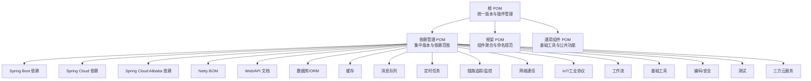
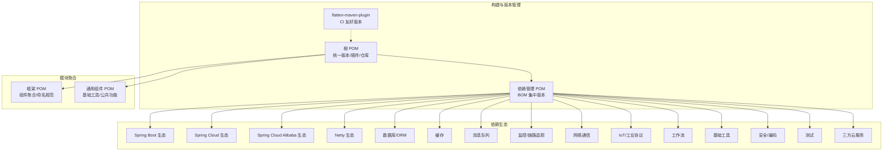
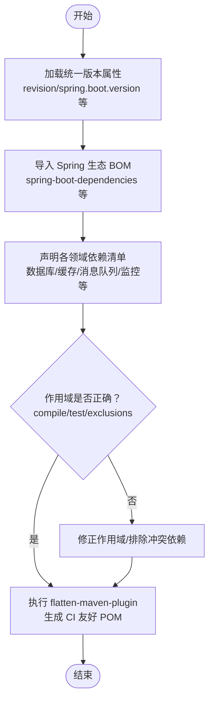
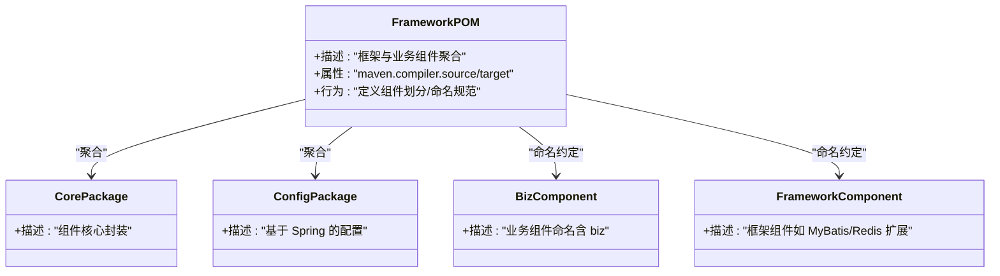
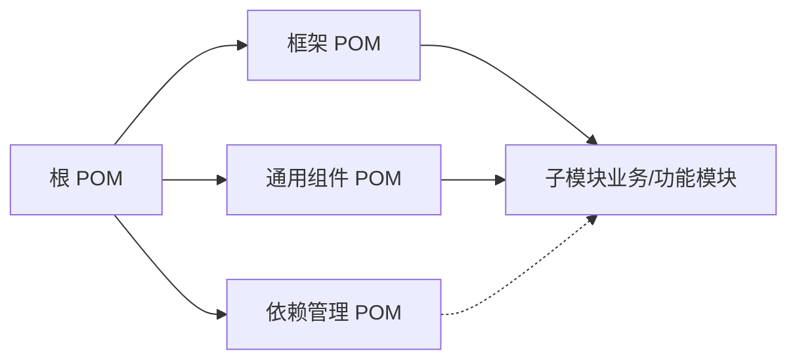
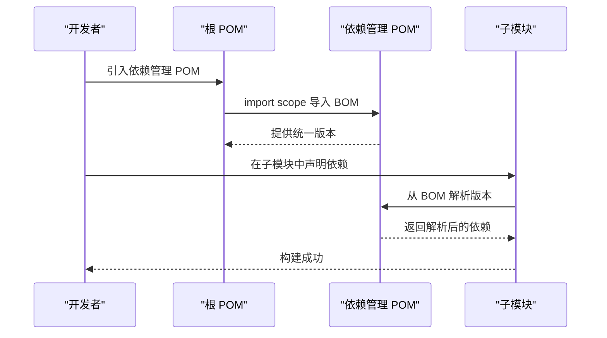

# 模块化设计模式

<cite>
**本文引用的文件**
- [根 POM](file://pom.xml)
- [依赖管理 POM](file://pandora-dependencies/pom.xml)
- [框架 POM](file://pandora-framework/pom.xml)
- [Lombok 配置](file://lombok.config)
</cite>

## 更新摘要
**所做更改**
- 更新了依赖管理 POM 的深度解析，反映了新的依赖分类与范围体系
- 新增了作用域检查机制的详细说明
- 增强了 CI 友好发布配置的实现细节
- 完善了模块化架构的依赖分析与性能考虑

## 目录
1. [引言](#引言)
2. [项目结构](#项目结构)
3. [核心组件](#核心组件)
4. [架构总览](#架构总览)
5. [详细组件分析](#详细组件分析)
6. [依赖分析](#依赖分析)
7. [性能考虑](#性能考虑)
8. [故障排除指南](#故障排除指南)
9. [结论](#结论)

## 引言
本文件系统性阐述 Pandora Cloud 的模块化设计模式，聚焦于模块化架构的设计原则、职责分离、接口定义与依赖方向，以及父子模块关系的设计理念。通过对项目中已实现的模块化基础设施（依赖管理 BOM、框架聚合模块）进行深入分析，总结可扩展性与可维护性的实现路径，并给出模块化开发最佳实践与重构演进建议。

**更新** 本次更新重点关注 pandora-dependencies 模块的深度解析，包括新的依赖分类体系、作用域检查机制和 CI 友好发布配置的实现细节。

## 项目结构
Pandora Cloud 采用 Maven 多模块聚合结构，以父 POM 作为统一入口，通过模块化拆分实现"依赖集中管理 + 功能模块聚合"的双层架构。当前仓库包含三个核心模块：
- pandora-dependencies：集中管理第三方依赖版本与依赖范围，形成 BOM（Bill of Materials）
- pandora-framework：框架与业务组件的聚合模块，定义组件划分与命名规范
- pandora-common：通用组件模块，提供基础工具和公共功能

**图表来源**
- [根 POM:11-15](file://pom.xml#L11-L15)
- [依赖管理 POM:106-604](file://pandora-dependencies/pom.xml#L106-L604)

**章节来源**
- [根 POM:1-151](file://pom.xml#L1-L151)
- [依赖管理 POM:1-604](file://pandora-dependencies/pom.xml#L1-L604)
- [框架 POM:1-34](file://pandora-framework/pom.xml#L1-L34)

## 核心组件
本节从模块化视角解析三个关键组件及其职责边界与依赖方向。

- **依赖管理 POM（pandora-dependencies）**
  - **职责**：集中管理第三方依赖版本与依赖范围，形成 BOM；统一导入 Spring Boot、Spring Cloud、Spring Cloud Alibaba、Netty 等生态依赖；提供各领域组件的依赖清单（数据库、缓存、消息队列、监控、网络通信、IoT、工作流、工具库、安全、测试、云服务等）。
  - **依赖方向**：向上被根 POM 导入，向下被子模块按需引用；通过 import scope 将依赖版本固化到子模块，避免版本漂移。
  - **版本控制**：使用统一 revision 变量与 flatten-maven-plugin，确保版本一致性与 CI 友好发布。

- **框架 POM（pandora-framework）**
  - **职责**：作为框架与业务组件的聚合模块，定义组件划分与命名规范；明确"core 包"与"config 包"的职责边界；区分"框架组件"与"业务组件"，并通过命名约定体现。
  - **依赖方向**：作为父模块，聚合子模块；子模块通过继承父 POM 获取统一的编译参数、编码规范与 Lombok 配置。
  - **设计理念**：通过"组件化"实现功能的可扩展性与可维护性，每个组件独立演进，降低耦合度。

- **通用组件 POM（pandora-common）**
  - **职责**：提供基础工具类、公共配置和通用功能模块，为其他模块提供共享能力。
  - **依赖方向**：向下提供通用功能，向上被业务模块引用。

**章节来源**
- [依赖管理 POM:106-604](file://pandora-dependencies/pom.xml#L106-L604)
- [框架 POM:15-24](file://pandora-framework/pom.xml#L15-L24)

## 架构总览
下图展示模块化架构中的依赖关系与控制流，强调"集中版本管理 + 聚合模块"的双层设计如何支撑上层业务模块的稳定演进。

**图表来源**
- [根 POM:39-50](file://pom.xml#L39-L50)
- [依赖管理 POM:106-137](file://pandora-dependencies/pom.xml#L106-L137)

**章节来源**
- [根 POM:39-50](file://pom.xml#L39-L50)
- [依赖管理 POM:106-137](file://pandora-dependencies/pom.xml#L106-L137)

## 详细组件分析

### 依赖管理 POM（pandora-dependencies）深度解析
**更新** 本次更新重点分析了新的依赖分类体系、作用域检查机制和 CI 友好发布配置。

- **版本与插件管理**
  - 使用统一 revision 变量与 flatten-maven-plugin，确保版本一致性与 CI 友好发布。
  - 通过 dependencyManagement 集中声明依赖版本，避免子模块重复指定版本。

- **依赖生态导入**
  - 通过 import scope 导入 Spring Boot、Spring Cloud、Spring Cloud Alibaba、Netty 的 BOM，确保生态内版本对齐。

- **依赖分类与范围**
  - **微服务框架**：Spring Boot、Spring Cloud、Spring Cloud Alibaba、Netty BOM
  - **Web/API 文档**：Knife4j、SpringDoc OpenAPI
  - **数据库/ORM**：Druid、MyBatis、MyBatis-Plus、动态数据源、EasyTrans
  - **缓存**：Redisson
  - **消息队列**：RocketMQ
  - **定时任务**：XXL-Job
  - **服务保障**：Lock4j
  - **链路追踪/监控**：SkyWalking、Spring Boot Admin、OpenTracing
  - **网络通信**：Netty、OkHttp、Vert.x、CoAP、MQTT、SSH/SFTP
  - **IoT/工业协议**：J2Mod
  - **BPM 工作流**：Flowable
  - **基础工具**：Lombok、MapStruct、Hutool、Guava、FastJSON、FastExcel、Apache Commons
  - **模板/文档**：Velocity、Tika、Jsoup
  - **编码/安全**：验证码、线程上下文传递、IP归属地查询、业务日志SDK
  - **测试**：Spring Boot Test、Mockito Inline、Jedis Mock、Podam
  - **三方云服务**：AWS SDK、JustAuth、微信支付、支付宝SDK、积木报表

- **作用域检查机制**
  - **compile 作用域**：默认作用域，适用于运行时必需的依赖
  - **test 作用域**：仅在测试阶段使用，如 OkHttp Mock、Jedis Mock
  - **import 作用域**：用于导入 BOM 文件，如 Spring 生态的 BOM
  - **exclusions**：排除冲突依赖，如 EasyTrans、Spring Boot Admin、JustAuth、Alipay SDK 等的内部依赖冲突

- **Lombok 与 MapStruct 配置**
  - 在根 POM 中配置 annotationProcessorPaths，确保 Lombok 与 MapStruct 的正确处理，避免编译期问题。

**图表来源**
- [根 POM:20-37](file://pom.xml#L20-L37)
- [根 POM:102-128](file://pom.xml#L102-L128)
- [依赖管理 POM:106-137](file://pandora-dependencies/pom.xml#L106-L137)
- [依赖管理 POM:139-604](file://pandora-dependencies/pom.xml#L139-L604)

**章节来源**
- [根 POM:20-37](file://pom.xml#L20-L37)
- [根 POM:102-128](file://pom.xml#L102-L128)
- [依赖管理 POM:106-137](file://pandora-dependencies/pom.xml#L106-L137)
- [依赖管理 POM:139-604](file://pandora-dependencies/pom.xml#L139-L604)

### 框架 POM（pandora-framework）设计要点
- **组件划分与命名规范**
  - 明确"core 包"为核心封装，"config 包"为基于 Spring 的配置；区分"框架组件"与"业务组件"，并通过命名约定体现（如包含 biz 的业务组件）。

- **聚合与继承**
  - 作为父模块，聚合子模块；子模块通过继承父 POM 获取统一的编译参数、编码规范与 Lombok 配置。

- **可扩展性与可维护性**
  - 通过组件化实现功能的可扩展性与可维护性，每个组件独立演进，降低耦合度。

**图表来源**
- [框架 POM:15-24](file://pandora-framework/pom.xml#L15-L24)

**章节来源**
- [框架 POM:15-24](file://pandora-framework/pom.xml#L15-L24)

### 父子模块关系与职责分离
- **父子关系**
  - 根 POM 为顶层父模块，pandora-dependencies、pandora-framework、pandora-common 为其子模块；框架 POM 继承自根 POM。

- **职责分离**
  - 依赖管理 POM 仅负责版本与依赖范围，不包含具体业务逻辑；框架 POM 负责组件划分与命名规范，不直接引入具体依赖。

- **依赖方向**
  - 子模块通过 import scope 从依赖管理 POM 获取版本；框架 POM 通过继承从根 POM 获取统一配置。

**图表来源**
- [根 POM:11-15](file://pom.xml#L11-L15)
- [框架 POM:6-10](file://pandora-framework/pom.xml#L6-L10)

**章节来源**
- [根 POM:11-15](file://pom.xml#L11-L15)
- [框架 POM:6-10](file://pandora-framework/pom.xml#L6-L10)

## 依赖分析
**更新** 增强了对新依赖分类体系和作用域检查机制的分析。

- **依赖导入策略**
  - 通过 dependencyManagement 与 import scope，确保依赖版本由依赖管理 POM 统一控制，子模块无需重复声明版本。

- **依赖范围与排除**
  - 明确 compile/test 等作用域，避免运行时污染；对存在版本冲突的依赖进行排除（如某些 SDK 的内部依赖）。

- **版本一致性**
  - 使用统一 revision 变量与 flatten-maven-plugin，确保版本一致性与 CI 友好发布。

- **依赖分类管理**
  - 按功能领域进行分类管理，便于按需启用和维护；每个分类都有明确的版本控制和兼容性保证。

**图表来源**
- [根 POM:39-50](file://pom.xml#L39-L50)
- [依赖管理 POM:106-137](file://pandora-dependencies/pom.xml#L106-L137)

**章节来源**
- [根 POM:39-50](file://pom.xml#L39-L50)
- [依赖管理 POM:106-137](file://pandora-dependencies/pom.xml#L106-L137)

## 性能考虑
**更新** 增加了对新依赖分类体系和 CI 友好发布配置的性能影响分析。

- **版本解析与构建性能**
  - 使用 flatten-maven-plugin 生成 CI 友好 POM，减少版本解析开销，提升 CI 构建效率。
  - 通过依赖分类管理，减少不必要的依赖加载，优化启动性能。

- **依赖范围优化**
  - 合理设置 compile/test 等作用域，避免不必要的依赖进入运行时，降低启动时间与内存占用。
  - 通过作用域检查机制，确保依赖的合理使用，减少运行时负担。

- **依赖排除策略**
  - 对存在版本冲突或冗余的依赖进行排除，减少打包体积与潜在冲突。
  - 通过 exclusions 机制，避免传递性依赖带来的性能问题。

- **模块化性能优势**
  - 通过模块化拆分，实现按需加载，减少应用启动时间和内存占用。
  - 依赖分类管理使得模块间依赖关系更加清晰，有利于性能优化。

## 故障排除指南
**更新** 增强了对新依赖分类体系和作用域检查机制的故障排除指导。

- **Lombok 与 MapStruct 编译问题**
  - 在根 POM 中配置 annotationProcessorPaths，确保 Lombok 与 MapStruct 的正确处理，避免编译期错误。

- **版本冲突与作用域错误**
  - 通过 dependencyManagement 与 import scope 固定版本；对存在冲突的依赖进行排除，确保依赖树清晰。
  - 使用作用域检查机制，及时发现并修复作用域配置错误。

- **CI 发布失败**
  - 确认 flatten-maven-plugin 已正确执行，revision 变量生效，避免版本不一致导致的发布失败。
  - 检查依赖分类配置，确保所有依赖都正确归类到相应的功能领域。

- **依赖分类问题**
  - 如果发现某个依赖应该属于特定分类但未正确分类，需要更新依赖管理 POM 中的分类配置。
  - 检查依赖的作用域设置，确保符合预期的使用场景。

- **模块间依赖问题**
  - 通过模块化架构，可以更容易定位模块间依赖问题。
  - 利用依赖分类体系，快速识别和解决依赖冲突。

**章节来源**
- [根 POM:64-99](file://pom.xml#L64-L99)
- [依赖管理 POM:106-137](file://pandora-dependencies/pom.xml#L106-L137)
- [根 POM:102-128](file://pom.xml#L102-L128)

## 结论
Pandora Cloud 的模块化设计以"依赖集中管理 + 组件聚合"为核心，通过依赖管理 POM 提供统一版本与依赖范围，通过框架 POM 明确组件划分与命名规范，从而实现功能的可扩展性与可维护性。

**更新** 本次更新强化了对依赖分类体系、作用域检查机制和 CI 友好发布配置的理解，这些改进显著提升了模块化架构的实用性和可维护性。

建议在后续演进中继续坚持以下原则：
- 严格遵循模块边界与职责分离，避免跨模块耦合。
- 保持依赖管理 POM 的完整性与稳定性，定期审查与更新依赖清单。
- 在新增模块时，优先复用现有组件与配置，减少重复造轮子。
- 通过命名约定与文档规范，持续提升团队协作效率与知识沉淀。
- 利用新的依赖分类体系，更好地组织和管理复杂的依赖关系。
- 严格执行作用域检查机制，确保依赖的合理使用和性能优化。
- 持续改进 CI 友好发布配置，提升构建效率和发布可靠性。