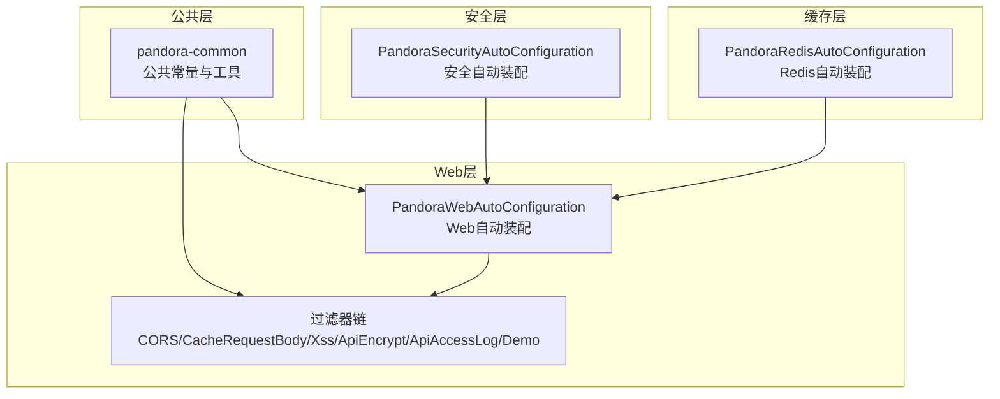
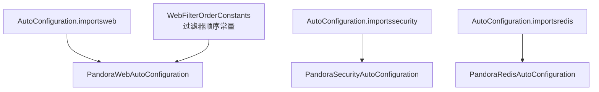
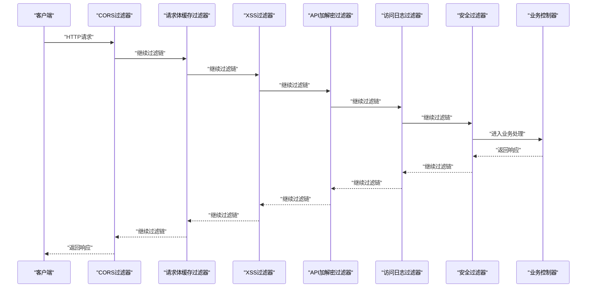
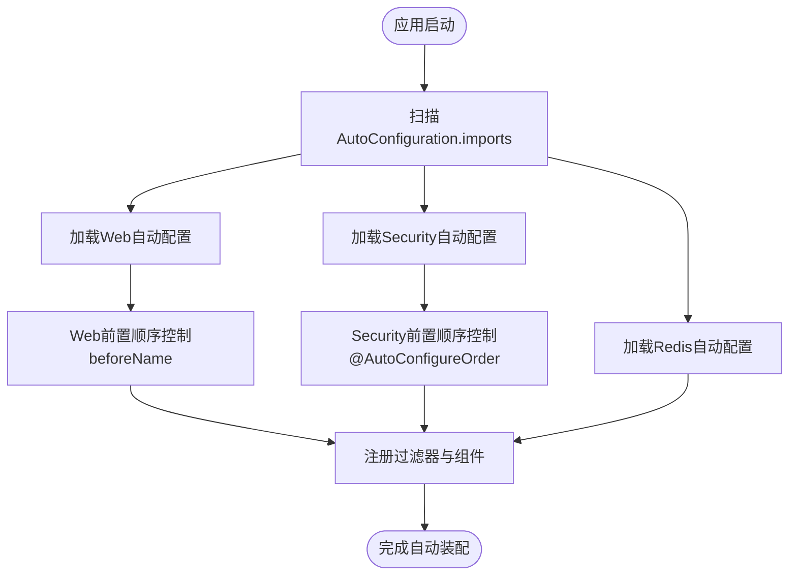
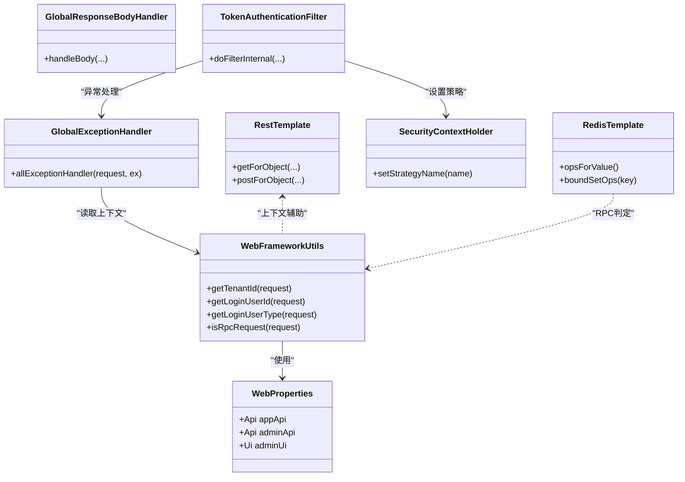
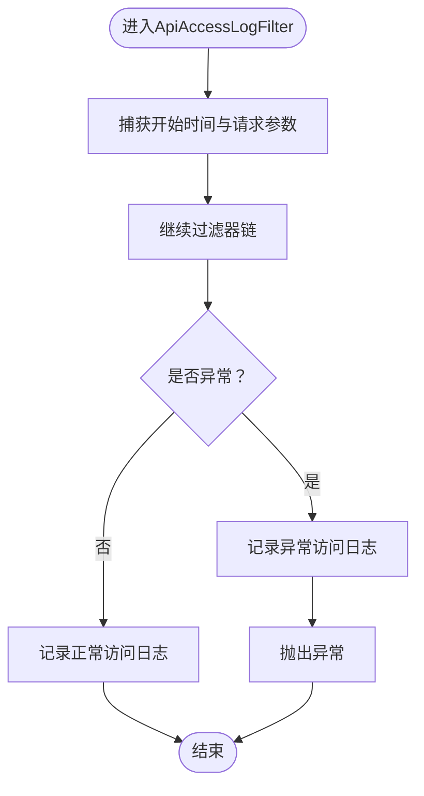
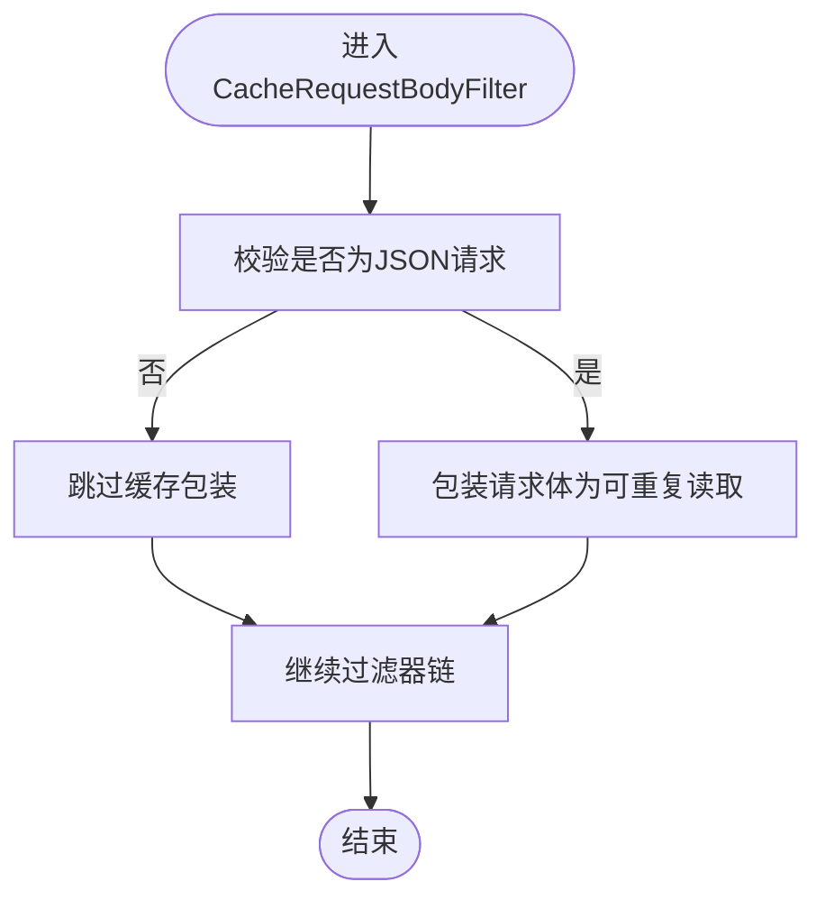
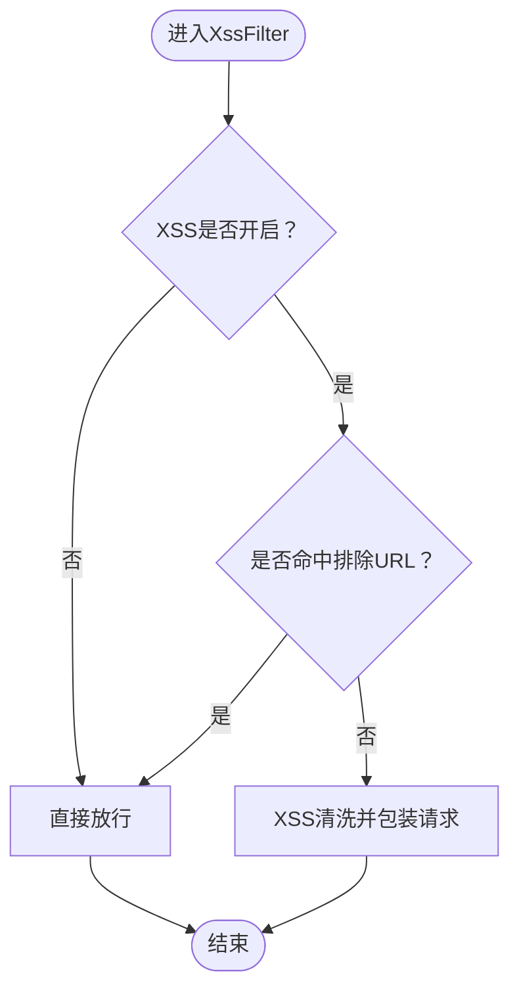
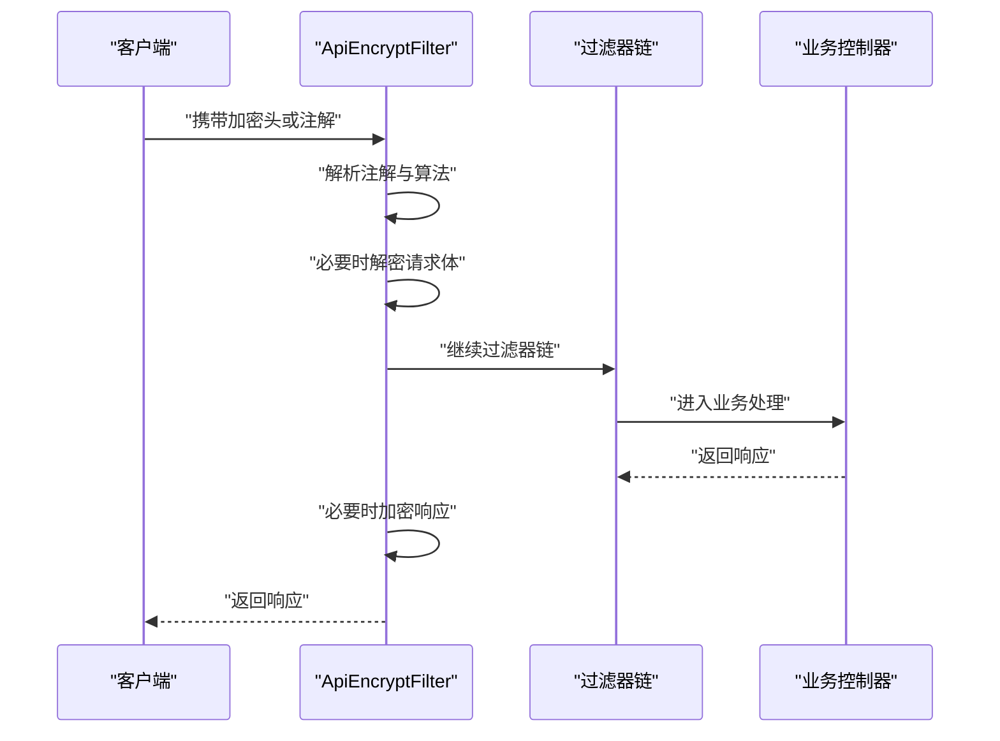
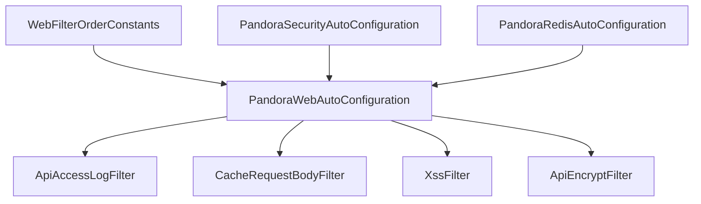

# 组件交互机制

<cite>
**本文引用的文件**
- [WebFilterOrderConstants.java](file://pandora-framework/pandora-common/src/main/java/net/ittimeline/pandora/framework/common/constants/WebFilterOrderConstants.java)
- [PandoraWebAutoConfiguration.java](file://pandora-framework/pandora-spring-boot-starter-web/src/main/java/net/ittimeline/pandora/framework/web/config/PandoraWebAutoConfiguration.java)
- [PandoraSecurityAutoConfiguration.java](file://pandora-framework/pandora-spring-boot-starter-security/src/main/java/net/ittimeline/pandora/framework/security/config/PandoraSecurityAutoConfiguration.java)
- [PandoraRedisAutoConfiguration.java](file://pandora-framework/pandora-spring-boot-starter-redis/src/main/java/net/ittimeline/pandora/framework/redis/config/PandoraRedisAutoConfiguration.java)
- [ApiAccessLogFilter.java](file://pandora-framework/pandora-spring-boot-starter-web/src/main/java/net/ittimeline/pandora/framework/apilog/core/filter/ApiAccessLogFilter.java)
- [CacheRequestBodyFilter.java](file://pandora-framework/pandora-spring-boot-starter-web/src/main/java/net/ittimeline/pandora/framework/web/core/filter/CacheRequestBodyFilter.java)
- [XssFilter.java](file://pandora-framework/pandora-spring-boot-starter-web/src/main/java/net/ittimeline/pandora/framework/xss/core/filter/XssFilter.java)
- [ApiEncryptFilter.java](file://pandora-framework/pandora-spring-boot-starter-web/src/main/java/net/ittimeline/pandora/framework/encrypt/core/filter/ApiEncryptFilter.java)
- [ApiRequestFilter.java](file://pandora-framework/pandora-spring-boot-starter-web/src/main/java/net/ittimeline/pandora/framework/web/core/filter/ApiRequestFilter.java)
- [WebFrameworkUtils.java](file://pandora-framework/pandora-spring-boot-starter-web/src/main/java/net/ittimeline/pandora/framework/web/core/util/WebFrameworkUtils.java)
- [WebProperties.java](file://pandora-framework/pandora-spring-boot-starter-web/src/main/java/net/ittimeline/pandora/framework/web/config/WebProperties.java)
- [AutoConfiguration.imports（web）](file://pandora-framework/pandora-spring-boot-starter-web/src/main/resources/META-INF/spring/org.springframework.boot.autoconfigure.AutoConfiguration.imports)
- [AutoConfiguration.imports（security）](file://pandora-framework/pandora-spring-boot-starter-security/src/main/resources/META-INF/spring/org.springframework.boot.autoconfigure.AutoConfiguration.imports)
- [AutoConfiguration.imports（redis）](file://pandora-framework/pandora-spring-boot-starter-redis/src/main/resources/META-INF/spring/org.springframework.boot.autoconfigure.AutoConfiguration.imports)
</cite>

## 目录
1. [引言](#引言)
2. [项目结构](#项目结构)
3. [核心组件](#核心组件)
4. [架构总览](#架构总览)
5. [详细组件分析](#详细组件分析)
6. [依赖分析](#依赖分析)
7. [性能考虑](#性能考虑)
8. [故障排查指南](#故障排查指南)
9. [结论](#结论)
10. [附录](#附录)

## 引言
本文件面向Pandora Cloud框架的使用者与维护者，系统性阐述组件间的通信方式与交互流程，重点覆盖以下主题：
- 过滤器链的执行顺序与优先级控制机制，以及WebFilterOrderConstants的作用与过滤器协作关系
- Spring Boot自动配置的加载机制，AutoConfiguration.imports文件如何实现组件的自动装配
- 组件间的依赖注入关系与生命周期管理，包括初始化顺序、配置合并策略与冲突处理
- 提供组件交互的时序图与数据流图，帮助开发者快速理解复杂组件协作过程

## 项目结构
Pandora Cloud采用多模块分层设计，核心能力由多个Spring Boot Starter模块组合而成：
- pandora-common：公共常量与工具（如WebFilterOrderConstants）
- pandora-spring-boot-starter-web：Web层自动装配与过滤器链
- pandora-spring-boot-starter-security：安全与鉴权相关自动装配
- pandora-spring-boot-starter-redis：Redis与缓存相关自动装配

图表来源
- [PandoraWebAutoConfiguration.java:43-46](file://pandora-framework/pandora-spring-boot-starter-web/src/main/java/net/ittimeline/pandora/framework/web/config/PandoraWebAutoConfiguration.java#L43-L46)
- [WebFilterOrderConstants.java:11-37](file://pandora-framework/pandora-common/src/main/java/net/ittimeline/pandora/framework/common/constants/WebFilterOrderConstants.java#L11-L37)
- [PandoraSecurityAutoConfiguration.java:36-38](file://pandora-framework/pandora-spring-boot-starter-security/src/main/java/net/ittimeline/pandora/framework/security/config/PandoraSecurityAutoConfiguration.java#L36-L38)
- [PandoraRedisAutoConfiguration.java](file://pandora-framework/pandora-spring-boot-starter-redis/src/main/java/net/ittimeline/pandora/framework/redis/config/PandoraRedisAutoConfiguration.java#L19)

章节来源
- [PandoraWebAutoConfiguration.java:43-46](file://pandora-framework/pandora-spring-boot-starter-web/src/main/java/net/ittimeline/pandora/framework/web/config/PandoraWebAutoConfiguration.java#L43-L46)
- [PandoraSecurityAutoConfiguration.java:36-38](file://pandora-framework/pandora-spring-boot-starter-security/src/main/java/net/ittimeline/pandora/framework/security/config/PandoraSecurityAutoConfiguration.java#L36-L38)
- [PandoraRedisAutoConfiguration.java](file://pandora-framework/pandora-spring-boot-starter-redis/src/main/java/net/ittimeline/pandora/framework/redis/config/PandoraRedisAutoConfiguration.java#L19)

## 核心组件
- WebFilterOrderConstants：定义过滤器链的执行顺序常量，确保跨域、请求体缓存、XSS、加密、访问日志、安全等过滤器按预期顺序执行
- PandoraWebAutoConfiguration：负责Web层自动装配，注册过滤器、全局异常处理器、全局响应处理器、RestTemplate等，并通过FilterRegistrationBean设置过滤器顺序
- PandoraSecurityAutoConfiguration：负责安全相关自动装配，包括认证入口、权限不足处理器、密码编码器、Token认证过滤器、安全上下文策略等
- PandoraRedisAutoConfiguration：负责Redis自动装配，自定义RedisTemplate与JSON序列化配置
- 过滤器链：CORS、请求体缓存、XSS、API加解密、访问日志、安全过滤器、演示过滤器等，通过WebFilterOrderConstants进行排序

章节来源
- [WebFilterOrderConstants.java:11-37](file://pandora-framework/pandora-common/src/main/java/net/ittimeline/pandora/framework/common/constants/WebFilterOrderConstants.java#L11-L37)
- [PandoraWebAutoConfiguration.java:116-152](file://pandora-framework/pandora-spring-boot-starter-web/src/main/java/net/ittimeline/pandora/framework/web/config/PandoraWebAutoConfiguration.java#L116-L152)
- [PandoraSecurityAutoConfiguration.java:47-96](file://pandora-framework/pandora-spring-boot-starter-security/src/main/java/net/ittimeline/pandora/framework/security/config/PandoraSecurityAutoConfiguration.java#L47-L96)
- [PandoraRedisAutoConfiguration.java:25-46](file://pandora-framework/pandora-spring-boot-starter-redis/src/main/java/net/ittimeline/pandora/framework/redis/config/PandoraRedisAutoConfiguration.java#L25-L46)

## 架构总览
Pandora Cloud通过AutoConfiguration.imports文件声明自动装配入口，结合WebFilterOrderConstants对过滤器链进行精确排序，形成“跨域—请求体缓存—XSS—加解密—访问日志—安全—业务”的稳定执行序列。

图表来源
- [AutoConfiguration.imports（web）:1-8](file://pandora-framework/pandora-spring-boot-starter-web/src/main/resources/META-INF/spring/org.springframework.boot.autoconfigure.AutoConfiguration.imports#L1-L8)
- [AutoConfiguration.imports（security）:1-6](file://pandora-framework/pandora-spring-boot-starter-security/src/main/resources/META-INF/spring/org.springframework.boot.autoconfigure.AutoConfiguration.imports#L1-L6)
- [AutoConfiguration.imports（redis）:1-2](file://pandora-framework/pandora-spring-boot-starter-redis/src/main/resources/META-INF/spring/org.springframework.boot.autoconfigure.AutoConfiguration.imports#L1-L2)
- [WebFilterOrderConstants.java:11-37](file://pandora-framework/pandora-common/src/main/java/net/ittimeline/pandora/framework/common/constants/WebFilterOrderConstants.java#L11-L37)

## 详细组件分析

### 过滤器链与优先级控制机制
- 顺序定义：WebFilterOrderConstants为每个过滤器分配固定顺序值，确保跨域、请求体缓存、XSS、加解密、访问日志、安全等过滤器按预期顺序执行
- 注册方式：PandoraWebAutoConfiguration通过FilterRegistrationBean注册各过滤器，并设置order值
- 协作关系：
  - CacheRequestBodyFilter需在XSS与加解密之前，以便后续组件读取原始请求体
  - ApiAccessLogFilter需在XSS之后，避免XSS处理后的参数被二次清洗
  - Spring Security过滤器默认顺序位于特定区间，Pandora通过顺序常量保证其前后关系
  - DemoFilter作为演示用途，置于链路末尾

图表来源
- [PandoraWebAutoConfiguration.java:116-152](file://pandora-framework/pandora-spring-boot-starter-web/src/main/java/net/ittimeline/pandora/framework/web/config/PandoraWebAutoConfiguration.java#L116-L152)
- [WebFilterOrderConstants.java:11-37](file://pandora-framework/pandora-common/src/main/java/net/ittimeline/pandora/framework/common/constants/WebFilterOrderConstants.java#L11-L37)
- [ApiAccessLogFilter.java:66-86](file://pandora-framework/pandora-spring-boot-starter-web/src/main/java/net/ittimeline/pandora/framework/apilog/core/filter/ApiAccessLogFilter.java#L66-L86)
- [CacheRequestBodyFilter.java:30-46](file://pandora-framework/pandora-spring-boot-starter-web/src/main/java/net/ittimeline/pandora/framework/web/core/filter/CacheRequestBodyFilter.java#L30-L46)
- [XssFilter.java:36-52](file://pandora-framework/pandora-spring-boot-starter-web/src/main/java/net/ittimeline/pandora/framework/xss/core/filter/XssFilter.java#L36-L52)
- [ApiEncryptFilter.java:78-121](file://pandora-framework/pandora-spring-boot-starter-web/src/main/java/net/ittimeline/pandora/framework/encrypt/core/filter/ApiEncryptFilter.java#L78-L121)

章节来源
- [WebFilterOrderConstants.java:11-37](file://pandora-framework/pandora-common/src/main/java/net/ittimeline/pandora/framework/common/constants/WebFilterOrderConstants.java#L11-L37)
- [PandoraWebAutoConfiguration.java:116-152](file://pandora-framework/pandora-spring-boot-starter-web/src/main/java/net/ittimeline/pandora/framework/web/config/PandoraWebAutoConfiguration.java#L116-L152)
- [ApiAccessLogFilter.java:66-86](file://pandora-framework/pandora-spring-boot-starter-web/src/main/java/net/ittimeline/pandora/framework/apilog/core/filter/ApiAccessLogFilter.java#L66-L86)
- [CacheRequestBodyFilter.java:30-46](file://pandora-framework/pandora-spring-boot-starter-web/src/main/java/net/ittimeline/pandora/framework/web/core/filter/CacheRequestBodyFilter.java#L30-L46)
- [XssFilter.java:36-52](file://pandora-framework/pandora-spring-boot-starter-web/src/main/java/net/ittimeline/pandora/framework/xss/core/filter/XssFilter.java#L36-L52)
- [ApiEncryptFilter.java:78-121](file://pandora-framework/pandora-spring-boot-starter-web/src/main/java/net/ittimeline/pandora/framework/encrypt/core/filter/ApiEncryptFilter.java#L78-L121)

### Spring Boot自动配置加载机制
- AutoConfiguration.imports文件：每个Starter模块在META-INF/spring目录下提供AutoConfiguration.imports文件，声明需要启用的自动配置类
- 加载顺序：
  - web：声明Banner、Jackson、Web、API日志、RPC日志、Swagger、XSS、加解密等自动配置
  - security：声明安全、RPC安全、Web安全、操作日志、RPC操作日志等自动配置
  - redis：声明Redis与缓存自动配置
- 优先级控制：
  - web：通过@AutoConfiguration(beforeName=...)在特定第三方配置之前完成初始化，避免RestTemplate初始化冲突
  - security：通过@AutoConfigureOrder(-1)确保早于Spring Security默认配置，避免包名改写后基础包无法生效

图表来源
- [AutoConfiguration.imports（web）:1-8](file://pandora-framework/pandora-spring-boot-starter-web/src/main/resources/META-INF/spring/org.springframework.boot.autoconfigure.AutoConfiguration.imports#L1-L8)
- [AutoConfiguration.imports（security）:1-6](file://pandora-framework/pandora-spring-boot-starter-security/src/main/resources/META-INF/spring/org.springframework.boot.autoconfigure.AutoConfiguration.imports#L1-L6)
- [AutoConfiguration.imports（redis）:1-2](file://pandora-framework/pandora-spring-boot-starter-redis/src/main/resources/META-INF/spring/org.springframework.boot.autoconfigure.AutoConfiguration.imports#L1-L2)
- [PandoraWebAutoConfiguration.java:43-46](file://pandora-framework/pandora-spring-boot-starter-web/src/main/java/net/ittimeline/pandora/framework/web/config/PandoraWebAutoConfiguration.java#L43-L46)
- [PandoraSecurityAutoConfiguration.java:36-38](file://pandora-framework/pandora-spring-boot-starter-security/src/main/java/net/ittimeline/pandora/framework/security/config/PandoraSecurityAutoConfiguration.java#L36-L38)

章节来源
- [AutoConfiguration.imports（web）:1-8](file://pandora-framework/pandora-spring-boot-starter-web/src/main/resources/META-INF/spring/org.springframework.boot.autoconfigure.AutoConfiguration.imports#L1-L8)
- [AutoConfiguration.imports（security）:1-6](file://pandora-framework/pandora-spring-boot-starter-security/src/main/resources/META-INF/spring/org.springframework.boot.autoconfigure.AutoConfiguration.imports#L1-L6)
- [AutoConfiguration.imports（redis）:1-2](file://pandora-framework/pandora-spring-boot-starter-redis/src/main/resources/META-INF/spring/org.springframework.boot.autoconfigure.AutoConfiguration.imports#L1-L2)
- [PandoraWebAutoConfiguration.java:43-46](file://pandora-framework/pandora-spring-boot-starter-web/src/main/java/net/ittimeline/pandora/framework/web/config/PandoraWebAutoConfiguration.java#L43-L46)
- [PandoraSecurityAutoConfiguration.java:36-38](file://pandora-framework/pandora-spring-boot-starter-security/src/main/java/net/ittimeline/pandora/framework/security/config/PandoraSecurityAutoConfiguration.java#L36-L38)

### 组件间的依赖注入与生命周期管理
- Web层：
  - WebFrameworkUtils持有WebProperties，用于解析租户、终端、用户类型等上下文信息
  - GlobalExceptionHandler与GlobalResponseBodyHandler作为全局处理组件，统一异常与响应封装
  - RestTemplate与LoadBalanced RestTemplate通过条件化Bean避免重复定义
- 安全层：
  - TokenAuthenticationFilter依赖全局异常处理器与OAuth2令牌API
  - SecurityContextHolder策略通过MethodInvokingFactoryBean动态设置
- 缓存层：
  - RedisTemplate自定义JSON序列化，包含JavaTimeModule以支持时间类型

图表来源
- [WebProperties.java:18-68](file://pandora-framework/pandora-spring-boot-starter-web/src/main/java/net/ittimeline/pandora/framework/web/config/WebProperties.java#L18-L68)
- [WebFrameworkUtils.java:40-182](file://pandora-framework/pandora-spring-boot-starter-web/src/main/java/net/ittimeline/pandora/framework/web/core/util/WebFrameworkUtils.java#L40-L182)
- [PandoraWebAutoConfiguration.java:95-102](file://pandora-framework/pandora-spring-boot-starter-web/src/main/java/net/ittimeline/pandora/framework/web/config/PandoraWebAutoConfiguration.java#L95-L102)
- [PandoraSecurityAutoConfiguration.java:74-96](file://pandora-framework/pandora-spring-boot-starter-security/src/main/java/net/ittimeline/pandora/framework/security/config/PandoraSecurityAutoConfiguration.java#L74-L96)
- [PandoraRedisAutoConfiguration.java:25-46](file://pandora-framework/pandora-spring-boot-starter-redis/src/main/java/net/ittimeline/pandora/framework/redis/config/PandoraRedisAutoConfiguration.java#L25-L46)

章节来源
- [WebFrameworkUtils.java:40-182](file://pandora-framework/pandora-spring-boot-starter-web/src/main/java/net/ittimeline/pandora/framework/web/core/util/WebFrameworkUtils.java#L40-L182)
- [PandoraWebAutoConfiguration.java:95-102](file://pandora-framework/pandora-spring-boot-starter-web/src/main/java/net/ittimeline/pandora/framework/web/config/PandoraWebAutoConfiguration.java#L95-L102)
- [PandoraSecurityAutoConfiguration.java:74-96](file://pandora-framework/pandora-spring-boot-starter-security/src/main/java/net/ittimeline/pandora/framework/security/config/PandoraSecurityAutoConfiguration.java#L74-L96)
- [PandoraRedisAutoConfiguration.java:25-46](file://pandora-framework/pandora-spring-boot-starter-redis/src/main/java/net/ittimeline/pandora/framework/redis/config/PandoraRedisAutoConfiguration.java#L25-L46)

### 初始化顺序、配置合并与冲突处理
- 初始化顺序：
  - web自动配置通过beforeName在特定第三方配置之前完成，避免RestTemplate初始化冲突
  - security自动配置通过@AutoConfigureOrder(-1)确保早于Spring Security默认配置
- 配置合并：
  - WebProperties提供API前缀与包路径规则，结合RequestMappingHandlerMapping实现路径前缀绑定
  - WebFrameworkUtils提供静态方法读取请求上下文，减少跨模块依赖
- 冲突处理：
  - 通过明确的过滤器顺序常量避免XSS与访问日志的相互覆盖
  - 通过条件化Bean（如@ConditionalOnMissingBean）避免重复定义

章节来源
- [PandoraWebAutoConfiguration.java:43-46](file://pandora-framework/pandora-spring-boot-starter-web/src/main/java/net/ittimeline/pandora/framework/web/config/PandoraWebAutoConfiguration.java#L43-L46)
- [PandoraSecurityAutoConfiguration.java:36-38](file://pandora-framework/pandora-spring-boot-starter-security/src/main/java/net/ittimeline/pandora/framework/security/config/PandoraSecurityAutoConfiguration.java#L36-L38)
- [WebProperties.java:56-91](file://pandora-framework/pandora-spring-boot-starter-web/src/main/java/net/ittimeline/pandora/framework/web/config/WebProperties.java#L56-L91)
- [WebFrameworkUtils.java:149-182](file://pandora-framework/pandora-spring-boot-starter-web/src/main/java/net/ittimeline/pandora/framework/web/core/util/WebFrameworkUtils.java#L149-L182)

### 关键过滤器工作流

#### 访问日志过滤器（ApiAccessLogFilter）
- 在过滤器链中处于XSS之后，记录请求参数、响应结果、耗时、操作类型等
- 支持注解驱动的开关与字段脱敏

图表来源
- [ApiAccessLogFilter.java:66-100](file://pandora-framework/pandora-spring-boot-starter-web/src/main/java/net/ittimeline/pandora/framework/apilog/core/filter/ApiAccessLogFilter.java#L66-L100)

章节来源
- [ApiAccessLogFilter.java:66-100](file://pandora-framework/pandora-spring-boot-starter-web/src/main/java/net/ittimeline/pandora/framework/apilog/core/filter/ApiAccessLogFilter.java#L66-L100)

#### 请求体缓存过滤器（CacheRequestBodyFilter）
- 仅对JSON请求进行缓存包装，避免对非JSON或监控URL进行额外开销

图表来源
- [CacheRequestBodyFilter.java:30-46](file://pandora-framework/pandora-spring-boot-starter-web/src/main/java/net/ittimeline/pandora/framework/web/core/filter/CacheRequestBodyFilter.java#L30-L46)

章节来源
- [CacheRequestBodyFilter.java:30-46](file://pandora-framework/pandora-spring-boot-starter-web/src/main/java/net/ittimeline/pandora/framework/web/core/filter/CacheRequestBodyFilter.java#L30-L46)

#### XSS过滤器（XssFilter）
- 基于配置开关与排除URL列表决定是否进行XSS清洗

图表来源
- [XssFilter.java:36-52](file://pandora-framework/pandora-spring-boot-starter-web/src/main/java/net/ittimeline/pandora/framework/xss/core/filter/XssFilter.java#L36-L52)

章节来源
- [XssFilter.java:36-52](file://pandora-framework/pandora-spring-boot-starter-web/src/main/java/net/ittimeline/pandora/framework/xss/core/filter/XssFilter.java#L36-L52)

#### API加解密过滤器（ApiEncryptFilter）
- 动态解析方法上的@ApiEncrypt注解，按需对请求解密与响应加密
- 支持对称与非对称算法

图表来源
- [ApiEncryptFilter.java:78-121](file://pandora-framework/pandora-spring-boot-starter-web/src/main/java/net/ittimeline/pandora/framework/encrypt/core/filter/ApiEncryptFilter.java#L78-L121)

章节来源
- [ApiEncryptFilter.java:78-121](file://pandora-framework/pandora-spring-boot-starter-web/src/main/java/net/ittimeline/pandora/framework/encrypt/core/filter/ApiEncryptFilter.java#L78-L121)

## 依赖分析
- 组件耦合：
  - Web层组件强依赖WebFilterOrderConstants的顺序常量，确保过滤器链稳定
  - 安全层组件依赖Web层的全局异常处理与上下文工具
  - 缓存层组件与Web层存在RPC判定依赖
- 外部依赖：
  - web自动配置引入Jackson、Swagger、XSS、加解密等第三方能力
  - security自动配置引入Spring Security与加密器
  - redis自动配置引入Redisson与RedisTemplate

图表来源
- [WebFilterOrderConstants.java:11-37](file://pandora-framework/pandora-common/src/main/java/net/ittimeline/pandora/framework/common/constants/WebFilterOrderConstants.java#L11-L37)
- [PandoraWebAutoConfiguration.java:116-152](file://pandora-framework/pandora-spring-boot-starter-web/src/main/java/net/ittimeline/pandora/framework/web/config/PandoraWebAutoConfiguration.java#L116-L152)
- [ApiAccessLogFilter.java:66-86](file://pandora-framework/pandora-spring-boot-starter-web/src/main/java/net/ittimeline/pandora/framework/apilog/core/filter/ApiAccessLogFilter.java#L66-L86)
- [CacheRequestBodyFilter.java:30-46](file://pandora-framework/pandora-spring-boot-starter-web/src/main/java/net/ittimeline/pandora/framework/web/core/filter/CacheRequestBodyFilter.java#L30-L46)
- [XssFilter.java:36-52](file://pandora-framework/pandora-spring-boot-starter-web/src/main/java/net/ittimeline/pandora/framework/xss/core/filter/XssFilter.java#L36-L52)
- [ApiEncryptFilter.java:78-121](file://pandora-framework/pandora-spring-boot-starter-web/src/main/java/net/ittimeline/pandora/framework/encrypt/core/filter/ApiEncryptFilter.java#L78-L121)
- [PandoraSecurityAutoConfiguration.java:36-38](file://pandora-framework/pandora-spring-boot-starter-security/src/main/java/net/ittimeline/pandora/framework/security/config/PandoraSecurityAutoConfiguration.java#L36-L38)
- [PandoraRedisAutoConfiguration.java](file://pandora-framework/pandora-spring-boot-starter-redis/src/main/java/net/ittimeline/pandora/framework/redis/config/PandoraRedisAutoConfiguration.java#L19)

章节来源
- [WebFilterOrderConstants.java:11-37](file://pandora-framework/pandora-common/src/main/java/net/ittimeline/pandora/framework/common/constants/WebFilterOrderConstants.java#L11-L37)
- [PandoraWebAutoConfiguration.java:116-152](file://pandora-framework/pandora-spring-boot-starter-web/src/main/java/net/ittimeline/pandora/framework/web/config/PandoraWebAutoConfiguration.java#L116-L152)
- [PandoraSecurityAutoConfiguration.java:36-38](file://pandora-framework/pandora-spring-boot-starter-security/src/main/java/net/ittimeline/pandora/framework/security/config/PandoraSecurityAutoConfiguration.java#L36-L38)
- [PandoraRedisAutoConfiguration.java](file://pandora-framework/pandora-spring-boot-starter-redis/src/main/java/net/ittimeline/pandora/framework/redis/config/PandoraRedisAutoConfiguration.java#L19)

## 性能考虑
- 过滤器链顺序优化：通过WebFilterOrderConstants避免不必要的重复处理（如对非JSON请求不缓存）
- 条件化装配：@ConditionalOnProperty与@ConditionalOnMissingBean减少无效Bean创建
- 序列化优化：RedisTemplate使用JSON序列化并注册JavaTimeModule，降低时间类型序列化成本
- 异常处理：全局异常处理器集中处理，避免重复try-catch带来的性能损耗

## 故障排查指南
- 过滤器顺序异常：
  - 检查WebFilterOrderConstants中的顺序值是否与实际需求一致
  - 确认PandoraWebAutoConfiguration中FilterRegistrationBean的order设置
- XSS或加解密异常：
  - 检查XssFilter与ApiEncryptFilter的shouldNotFilter逻辑与配置
  - 确认@ApiEncrypt注解是否正确标注在方法或类上
- 安全上下文丢失：
  - 检查SecurityContextHolder策略是否通过MethodInvokingFactoryBean正确设置
- Redis序列化异常：
  - 确认RedisTemplate的序列化器与ObjectMapper模块注册

章节来源
- [WebFilterOrderConstants.java:11-37](file://pandora-framework/pandora-common/src/main/java/net/ittimeline/pandora/framework/common/constants/WebFilterOrderConstants.java#L11-L37)
- [PandoraWebAutoConfiguration.java:116-152](file://pandora-framework/pandora-spring-boot-starter-web/src/main/java/net/ittimeline/pandora/framework/web/config/PandoraWebAutoConfiguration.java#L116-L152)
- [XssFilter.java:36-52](file://pandora-framework/pandora-spring-boot-starter-web/src/main/java/net/ittimeline/pandora/framework/xss/core/filter/XssFilter.java#L36-L52)
- [ApiEncryptFilter.java:78-121](file://pandora-framework/pandora-spring-boot-starter-web/src/main/java/net/ittimeline/pandora/framework/encrypt/core/filter/ApiEncryptFilter.java#L78-L121)
- [PandoraSecurityAutoConfiguration.java:89-96](file://pandora-framework/pandora-spring-boot-starter-security/src/main/java/net/ittimeline/pandora/framework/security/config/PandoraSecurityAutoConfiguration.java#L89-L96)
- [PandoraRedisAutoConfiguration.java:25-46](file://pandora-framework/pandora-spring-boot-starter-redis/src/main/java/net/ittimeline/pandora/framework/redis/config/PandoraRedisAutoConfiguration.java#L25-L46)

## 结论
Pandora Cloud通过AutoConfiguration.imports实现模块化自动装配，借助WebFilterOrderConstants精确控制过滤器链顺序，结合全局异常与响应处理器、安全上下文策略与Redis序列化配置，构建了高内聚、低耦合且易于扩展的Web基础设施。开发者可通过本文档快速理解组件交互机制，并据此进行定制与排障。

## 附录
- 配置项参考：WebProperties提供API前缀与包路径规则；SecurityProperties与ApiEncryptProperties分别控制安全与加解密行为
- 建议实践：
  - 新增过滤器时，遵循WebFilterOrderConstants的顺序常量进行排序
  - 使用条件化Bean避免重复装配
  - 对于第三方组件冲突，优先通过beforeName或@AutoConfigureOrder进行顺序调整