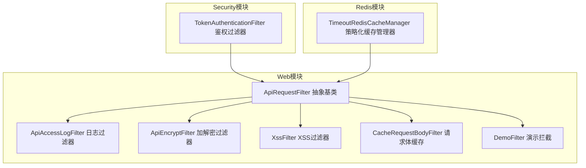
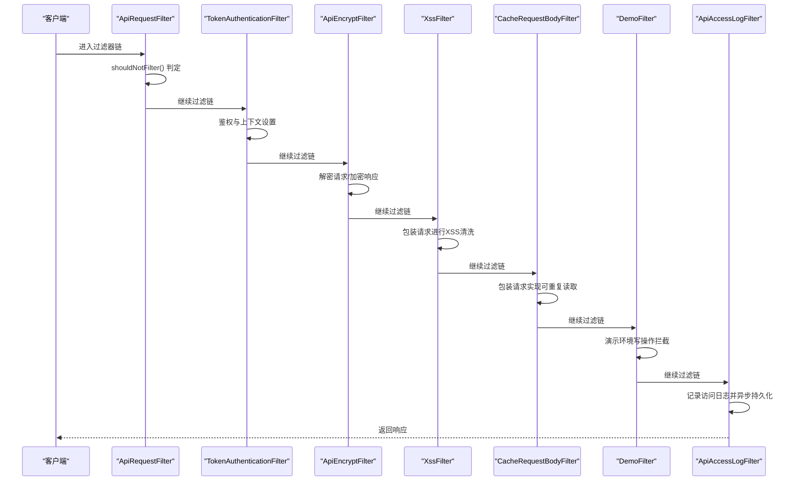
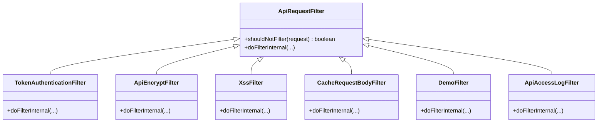
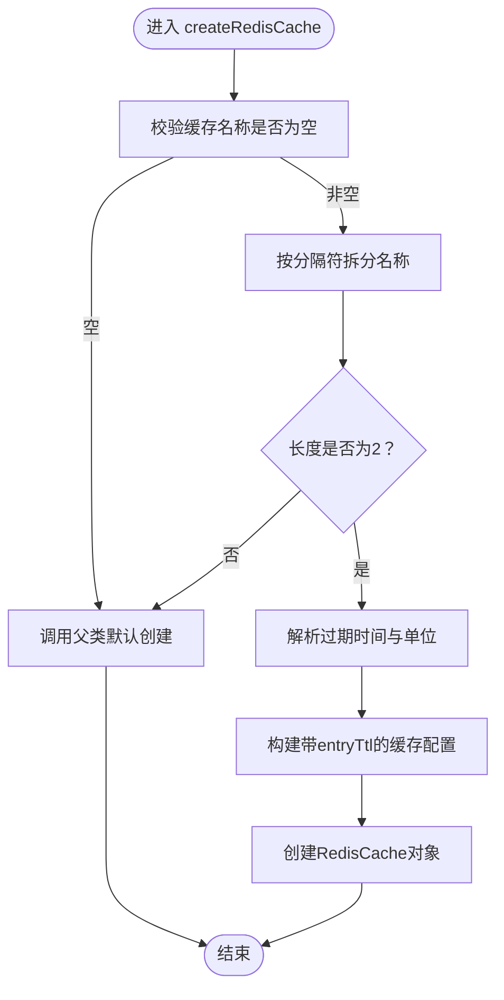
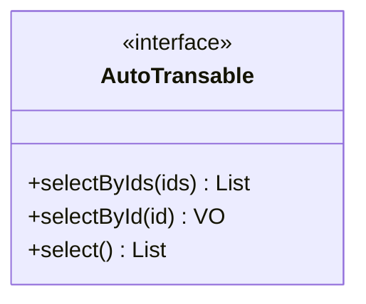
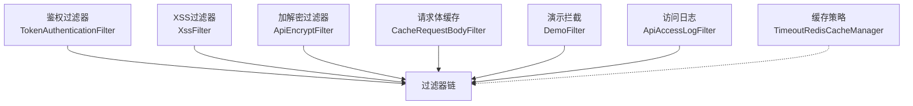
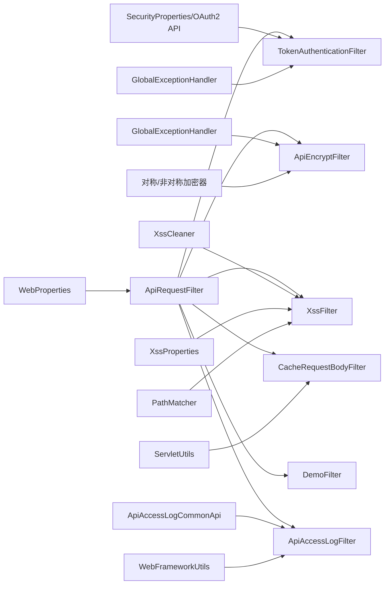

# 设计模式应用

<cite>
**本文引用的文件**
- [AutoTransable.java](file://pandora-framework/pandora-common/src/main/java/com/fhs/trans/service/AutoTransable.java)
- [ApiRequestFilter.java](file://pandora-framework/pandora-spring-boot-starter-web/src/main/java/net/ittimeline/pandora/framework/web/core/filter/ApiRequestFilter.java)
- [TokenAuthenticationFilter.java](file://pandora-framework/pandora-spring-boot-starter-security/src/main/java/net/ittimeline/pandora/framework/security/core/filter/TokenAuthenticationFilter.java)
- [ApiAccessLogFilter.java](file://pandora-framework/pandora-spring-boot-starter-web/src/main/java/net/ittimeline/pandora/framework/apilog/core/filter/ApiAccessLogFilter.java)
- [ApiEncryptFilter.java](file://pandora-framework/pandora-spring-boot-starter-web/src/main/java/net/ittimeline/pandora/framework/encrypt/core/filter/ApiEncryptFilter.java)
- [XssFilter.java](file://pandora-framework/pandora-spring-boot-starter-web/src/main/java/net/ittimeline/pandora/framework/xss/core/filter/XssFilter.java)
- [CacheRequestBodyFilter.java](file://pandora-framework/pandora-spring-boot-starter-web/src/main/java/net/ittimeline/pandora/framework/web/core/filter/CacheRequestBodyFilter.java)
- [DemoFilter.java](file://pandora-framework/pandora-spring-boot-starter-web/src/main/java/net/ittimeline/pandora/framework/web/core/filter/DemoFilter.java)
- [WebFrameworkUtils.java](file://pandora-framework/pandora-spring-boot-starter-web/src/main/java/net/ittimeline/pandora/framework/web/core/util/WebFrameworkUtils.java)
- [TimeoutRedisCacheManager.java](file://pandora-framework/pandora-spring-boot-starter-redis/src/main/java/net/ittimeline/pandora/framework/redis/core/TimeoutRedisCacheManager.java)
</cite>

## 目录
1. [引言](#引言)
2. [项目结构](#项目结构)
3. [核心组件](#核心组件)
4. [架构总览](#架构总览)
5. [详细组件分析](#详细组件分析)
6. [依赖分析](#依赖分析)
7. [性能考虑](#性能考虑)
8. [故障排查指南](#故障排查指南)
9. [结论](#结论)
10. [附录](#附录)

## 引言
本文件聚焦于Pandora Cloud框架中设计模式的应用与实践，围绕以下主题展开：
- 装饰器模式在过滤器链中的应用：通过抽象基类与包装器实现横切能力叠加（如请求体缓存、XSS清洗、加解密、演示拦截、鉴权等）。
- 策略模式在缓存管理中的使用：通过自定义缓存管理器按命名规则动态选择过期策略，实现灵活的缓存生命周期控制。
- 接口隔离模式在服务接口中的体现：通过最小职责接口约束实现类能力，降低耦合并提升可维护性。

同时，文档解释各设计模式的选择原因、实现细节、带来的好处，以及它们之间的协作关系与组合使用场景，并提供扩展开发建议。

## 项目结构
Pandora Cloud采用多模块分层组织，web、security、redis、common等模块分别承担HTTP请求处理、安全认证、缓存与通用能力。本文关注的模式主要分布在web与security模块的过滤器链，以及redis模块的缓存管理器。

图表来源
- [ApiRequestFilter.java:15-27](file://pandora-framework/pandora-spring-boot-starter-web/src/main/java/net/ittimeline/pandora/framework/web/core/filter/ApiRequestFilter.java#L15-L27)
- [ApiAccessLogFilter.java:52-64](file://pandora-framework/pandora-spring-boot-starter-web/src/main/java/net/ittimeline/pandora/framework/apilog/core/filter/ApiAccessLogFilter.java#L52-L64)
- [ApiEncryptFilter.java:40-76](file://pandora-framework/pandora-spring-boot-starter-web/src/main/java/net/ittimeline/pandora/framework/encrypt/core/filter/ApiEncryptFilter.java#L40-L76)
- [XssFilter.java:22-54](file://pandora-framework/pandora-spring-boot-starter-web/src/main/java/net/ittimeline/pandora/framework/xss/core/filter/XssFilter.java#L22-L54)
- [CacheRequestBodyFilter.java:20-48](file://pandora-framework/pandora-spring-boot-starter-web/src/main/java/net/ittimeline/pandora/framework/web/core/filter/CacheRequestBodyFilter.java#L20-L48)
- [DemoFilter.java:21-36](file://pandora-framework/pandora-spring-boot-starter-web/src/main/java/net/ittimeline/pandora/framework/web/core/filter/DemoFilter.java#L21-L36)
- [TokenAuthenticationFilter.java:39-82](file://pandora-framework/pandora-spring-boot-starter-security/src/main/java/net/ittimeline/pandora/framework/security/core/filter/TokenAuthenticationFilter.java#L39-L82)
- [TimeoutRedisCacheManager.java:19-50](file://pandora-framework/pandora-spring-boot-starter-redis/src/main/java/net/ittimeline/pandora/framework/redis/core/TimeoutRedisCacheManager.java#L19-L50)

章节来源
- [ApiRequestFilter.java:15-27](file://pandora-framework/pandora-spring-boot-starter-web/src/main/java/net/ittimeline/pandora/framework/web/core/filter/ApiRequestFilter.java#L15-L27)
- [ApiAccessLogFilter.java:52-64](file://pandora-framework/pandora-spring-boot-starter-web/src/main/java/net/ittimeline/pandora/framework/apilog/core/filter/ApiAccessLogFilter.java#L52-L64)
- [ApiEncryptFilter.java:40-76](file://pandora-framework/pandora-spring-boot-starter-web/src/main/java/net/ittimeline/pandora/framework/encrypt/core/filter/ApiEncryptFilter.java#L40-L76)
- [XssFilter.java:22-54](file://pandora-framework/pandora-spring-boot-starter-web/src/main/java/net/ittimeline/pandora/framework/xss/core/filter/XssFilter.java#L22-L54)
- [CacheRequestBodyFilter.java:20-48](file://pandora-framework/pandora-spring-boot-starter-web/src/main/java/net/ittimeline/pandora/framework/web/core/filter/CacheRequestBodyFilter.java#L20-L48)
- [DemoFilter.java:21-36](file://pandora-framework/pandora-spring-boot-starter-web/src/main/java/net/ittimeline/pandora/framework/web/core/filter/DemoFilter.java#L21-L36)
- [TokenAuthenticationFilter.java:39-82](file://pandora-framework/pandora-spring-boot-starter-security/src/main/java/net/ittimeline/pandora/framework/security/core/filter/TokenAuthenticationFilter.java#L39-L82)
- [TimeoutRedisCacheManager.java:19-50](file://pandora-framework/pandora-spring-boot-starter-redis/src/main/java/net/ittimeline/pandora/framework/redis/core/TimeoutRedisCacheManager.java#L19-L50)

## 核心组件
- 抽象过滤器基类：统一过滤器链入口与条件判定，便于子类复用与扩展。
- 具体过滤器：按职责实现不同横切能力，如鉴权、日志、加解密、XSS、请求体缓存、演示拦截。
- 缓存管理器：根据命名规则动态选择过期策略，实现策略模式。
- 服务接口：最小职责接口约束实现类能力，体现接口隔离。

章节来源
- [ApiRequestFilter.java:15-27](file://pandora-framework/pandora-spring-boot-starter-web/src/main/java/net/ittimeline/pandora/framework/web/core/filter/ApiRequestFilter.java#L15-L27)
- [TokenAuthenticationFilter.java:39-82](file://pandora-framework/pandora-spring-boot-starter-security/src/main/java/net/ittimeline/pandora/framework/security/core/filter/TokenAuthenticationFilter.java#L39-L82)
- [ApiAccessLogFilter.java:52-64](file://pandora-framework/pandora-spring-boot-starter-web/src/main/java/net/ittimeline/pandora/framework/apilog/core/filter/ApiAccessLogFilter.java#L52-L64)
- [ApiEncryptFilter.java:40-76](file://pandora-framework/pandora-spring-boot-starter-web/src/main/java/net/ittimeline/pandora/framework/encrypt/core/filter/ApiEncryptFilter.java#L40-L76)
- [XssFilter.java:22-54](file://pandora-framework/pandora-spring-boot-starter-web/src/main/java/net/ittimeline/pandora/framework/xss/core/filter/XssFilter.java#L22-L54)
- [CacheRequestBodyFilter.java:20-48](file://pandora-framework/pandora-spring-boot-starter-web/src/main/java/net/ittimeline/pandora/framework/web/core/filter/CacheRequestBodyFilter.java#L20-L48)
- [DemoFilter.java:21-36](file://pandora-framework/pandora-spring-boot-starter-web/src/main/java/net/ittimeline/pandora/framework/web/core/filter/DemoFilter.java#L21-L36)
- [TimeoutRedisCacheManager.java:19-50](file://pandora-framework/pandora-spring-boot-starter-redis/src/main/java/net/ittimeline/pandora/framework/redis/core/TimeoutRedisCacheManager.java#L19-L50)
- [AutoTransable.java:18-60](file://pandora-framework/pandora-common/src/main/java/com/fhs/trans/service/AutoTransable.java#L18-L60)

## 架构总览
过滤器链以抽象基类为骨架，子类通过装饰器模式叠加各自能力；缓存管理器通过策略模式按命名规则选择过期策略；服务接口通过最小职责约束实现类能力，降低耦合。

图表来源
- [ApiRequestFilter.java:15-27](file://pandora-framework/pandora-spring-boot-starter-web/src/main/java/net/ittimeline/pandora/framework/web/core/filter/ApiRequestFilter.java#L15-L27)
- [TokenAuthenticationFilter.java:47-82](file://pandora-framework/pandora-spring-boot-starter-security/src/main/java/net/ittimeline/pandora/framework/security/core/filter/TokenAuthenticationFilter.java#L47-L82)
- [ApiEncryptFilter.java:78-121](file://pandora-framework/pandora-spring-boot-starter-web/src/main/java/net/ittimeline/pandora/framework/encrypt/core/filter/ApiEncryptFilter.java#L78-L121)
- [XssFilter.java:36-40](file://pandora-framework/pandora-spring-boot-starter-web/src/main/java/net/ittimeline/pandora/framework/xss/core/filter/XssFilter.java#L36-L40)
- [CacheRequestBodyFilter.java:30-34](file://pandora-framework/pandora-spring-boot-starter-web/src/main/java/net/ittimeline/pandora/framework/web/core/filter/CacheRequestBodyFilter.java#L30-L34)
- [DemoFilter.java:23-34](file://pandora-framework/pandora-spring-boot-starter-web/src/main/java/net/ittimeline/pandora/framework/web/core/filter/DemoFilter.java#L23-L34)
- [ApiAccessLogFilter.java:66-86](file://pandora-framework/pandora-spring-boot-starter-web/src/main/java/net/ittimeline/pandora/framework/apilog/core/filter/ApiAccessLogFilter.java#L66-L86)

## 详细组件分析

### 装饰器模式：过滤器链中的横切能力叠加
- 抽象基类 ApiRequestFilter：统一过滤器入口，提供shouldNotFilter()判定是否进入API域，避免对静态资源或非API路径的无效处理。
- 子类装饰器：
  - TokenAuthenticationFilter：在链路早期完成鉴权与上下文注入，确保后续组件可见登录用户信息。
  - ApiEncryptFilter：按注解与配置决定是否解密请求与加密响应，包装请求/响应以支持重复读取。
  - XssFilter：包装请求进行XSS清洗，支持白名单路径排除与开关控制。
  - CacheRequestBodyFilter：包装请求实现Body可重复读取，避免流被消费后无法再次读取。
  - DemoFilter：在演示环境拦截写操作，保护测试数据。
  - ApiAccessLogFilter：在链路末尾收集请求/响应信息并异步落库，支持脱敏与操作类型推断。

图表来源
- [ApiRequestFilter.java:15-27](file://pandora-framework/pandora-spring-boot-starter-web/src/main/java/net/ittimeline/pandora/framework/web/core/filter/ApiRequestFilter.java#L15-L27)
- [TokenAuthenticationFilter.java:39-82](file://pandora-framework/pandora-spring-boot-starter-security/src/main/java/net/ittimeline/pandora/framework/security/core/filter/TokenAuthenticationFilter.java#L39-L82)
- [ApiEncryptFilter.java:40-76](file://pandora-framework/pandora-spring-boot-starter-web/src/main/java/net/ittimeline/pandora/framework/encrypt/core/filter/ApiEncryptFilter.java#L40-L76)
- [XssFilter.java:22-54](file://pandora-framework/pandora-spring-boot-starter-web/src/main/java/net/ittimeline/pandora/framework/xss/core/filter/XssFilter.java#L22-L54)
- [CacheRequestBodyFilter.java:20-48](file://pandora-framework/pandora-spring-boot-starter-web/src/main/java/net/ittimeline/pandora/framework/web/core/filter/CacheRequestBodyFilter.java#L20-L48)
- [DemoFilter.java:21-36](file://pandora-framework/pandora-spring-boot-starter-web/src/main/java/net/ittimeline/pandora/framework/web/core/filter/DemoFilter.java#L21-L36)
- [ApiAccessLogFilter.java:52-64](file://pandora-framework/pandora-spring-boot-starter-web/src/main/java/net/ittimeline/pandora/framework/apilog/core/filter/ApiAccessLogFilter.java#L52-L64)

实现细节与好处
- 统一入口与条件判定：避免重复逻辑，提升可维护性。
- 可插拔横切能力：通过继承与包装实现功能叠加，符合开闭原则。
- 明确职责边界：每个过滤器只做一件事，降低复杂度。
- 与WebFrameworkUtils协作：通过请求属性传递登录用户、租户、终端等上下文，减少跨模块耦合。

章节来源
- [ApiRequestFilter.java:15-27](file://pandora-framework/pandora-spring-boot-starter-web/src/main/java/net/ittimeline/pandora/framework/web/core/filter/ApiRequestFilter.java#L15-L27)
- [TokenAuthenticationFilter.java:47-82](file://pandora-framework/pandora-spring-boot-starter-security/src/main/java/net/ittimeline/pandora/framework/security/core/filter/TokenAuthenticationFilter.java#L47-L82)
- [ApiEncryptFilter.java:78-121](file://pandora-framework/pandora-spring-boot-starter-web/src/main/java/net/ittimeline/pandora/framework/encrypt/core/filter/ApiEncryptFilter.java#L78-L121)
- [XssFilter.java:36-40](file://pandora-framework/pandora-spring-boot-starter-web/src/main/java/net/ittimeline/pandora/framework/xss/core/filter/XssFilter.java#L36-L40)
- [CacheRequestBodyFilter.java:30-34](file://pandora-framework/pandora-spring-boot-starter-web/src/main/java/net/ittimeline/pandora/framework/web/core/filter/CacheRequestBodyFilter.java#L30-L34)
- [DemoFilter.java:23-34](file://pandora-framework/pandora-spring-boot-starter-web/src/main/java/net/ittimeline/pandora/framework/web/core/filter/DemoFilter.java#L23-L34)
- [ApiAccessLogFilter.java:66-86](file://pandora-framework/pandora-spring-boot-starter-web/src/main/java/net/ittimeline/pandora/framework/apilog/core/filter/ApiAccessLogFilter.java#L66-L86)
- [WebFrameworkUtils.java:22-181](file://pandora-framework/pandora-spring-boot-starter-web/src/main/java/net/ittimeline/pandora/framework/web/core/util/WebFrameworkUtils.java#L22-L181)

### 策略模式：缓存管理中的过期策略选择
- TimeoutRedisCacheManager：通过解析缓存名称中的特殊分隔符与单位后缀，动态计算entryTtl，实现“按命名策略”定制过期时间。
- 策略要点：
  - 名称格式约定：name#ttl[unit]，其中unit支持s/m/h/d，默认秒。
  - 解析流程：提取时间与单位，构造Duration并设置到缓存配置。
  - 兼容性：不满足格式时回退默认行为。

图表来源
- [TimeoutRedisCacheManager.java:27-50](file://pandora-framework/pandora-spring-boot-starter-redis/src/main/java/net/ittimeline/pandora/framework/redis/core/TimeoutRedisCacheManager.java#L27-L50)
- [TimeoutRedisCacheManager.java:58-82](file://pandora-framework/pandora-spring-boot-starter-redis/src/main/java/net/ittimeline/pandora/framework/redis/core/TimeoutRedisCacheManager.java#L58-L82)

实现细节与好处
- 灵活的过期策略：无需硬编码，通过命名约定即可切换策略，便于运维与测试。
- 低侵入扩展：对上层调用透明，只需遵循命名规范即可生效。
- 可读性强：名称即策略，便于团队约定与维护。

章节来源
- [TimeoutRedisCacheManager.java:19-86](file://pandora-framework/pandora-spring-boot-starter-redis/src/main/java/net/ittimeline/pandora/framework/redis/core/TimeoutRedisCacheManager.java#L19-L86)

### 接口隔离模式：服务接口的最小职责约束
- AutoTransable：定义自动翻译所需的最小能力集合（查询、分页、主键查询等），默认方法提供向后兼容与简化实现。
- 设计意义：
  - 将“可自动翻译”的能力限定在必要接口内，避免把无关方法强加给实现类。
  - 通过默认方法提供兼容性与简化，降低实现成本。

图表来源
- [AutoTransable.java:18-60](file://pandora-framework/pandora-common/src/main/java/com/fhs/trans/service/AutoTransable.java#L18-L60)

实现细节与好处
- 降低接口膨胀：只暴露必要方法，避免“胖接口”。
- 提升可测试性：接口越小，mock与单元测试越简单。
- 易于演进：新增方法可通过默认实现平滑过渡。

章节来源
- [AutoTransable.java:18-60](file://pandora-framework/pandora-common/src/main/java/com/fhs/trans/service/AutoTransable.java#L18-L60)

### 设计模式之间的协作关系与组合使用场景
- 过滤器链内部协作：
  - 鉴权前置：TokenAuthenticationFilter在链首完成用户上下文注入，使后续过滤器（如ApiAccessLogFilter、ApiEncryptFilter）可直接读取登录信息。
  - 安全与合规：XssFilter与ApiEncryptFilter分别负责输入清洗与传输安全，两者可与鉴权并行叠加。
  - 可靠性保障：CacheRequestBodyFilter确保请求体可重复读取，避免下游组件（如日志、加解密）因流被消费而失败。
  - 环境控制：DemoFilter在演示环境拦截写操作，保护测试数据。
- 缓存策略与过滤器链协作：
  - 缓存过期策略由TimeoutRedisCacheManager按命名策略动态选择，与过滤器链中的业务逻辑解耦，便于独立演进。

图表来源
- [TokenAuthenticationFilter.java:39-82](file://pandora-framework/pandora-spring-boot-starter-security/src/main/java/net/ittimeline/pandora/framework/security/core/filter/TokenAuthenticationFilter.java#L39-L82)
- [XssFilter.java:22-54](file://pandora-framework/pandora-spring-boot-starter-web/src/main/java/net/ittimeline/pandora/framework/xss/core/filter/XssFilter.java#L22-L54)
- [ApiEncryptFilter.java:40-76](file://pandora-framework/pandora-spring-boot-starter-web/src/main/java/net/ittimeline/pandora/framework/encrypt/core/filter/ApiEncryptFilter.java#L40-L76)
- [CacheRequestBodyFilter.java:20-48](file://pandora-framework/pandora-spring-boot-starter-web/src/main/java/net/ittimeline/pandora/framework/web/core/filter/CacheRequestBodyFilter.java#L20-L48)
- [DemoFilter.java:21-36](file://pandora-framework/pandora-spring-boot-starter-web/src/main/java/net/ittimeline/pandora/framework/web/core/filter/DemoFilter.java#L21-L36)
- [ApiAccessLogFilter.java:52-64](file://pandora-framework/pandora-spring-boot-starter-web/src/main/java/net/ittimeline/pandora/framework/apilog/core/filter/ApiAccessLogFilter.java#L52-L64)
- [TimeoutRedisCacheManager.java:19-50](file://pandora-framework/pandora-spring-boot-starter-redis/src/main/java/net/ittimeline/pandora/framework/redis/core/TimeoutRedisCacheManager.java#L19-L50)

## 依赖分析
- 过滤器链依赖关系：
  - ApiRequestFilter为所有Web过滤器的抽象基类，子类均依赖其shouldNotFilter()与OncePerRequestFilter机制。
  - TokenAuthenticationFilter依赖安全属性、OAuth2接口与全局异常处理器，用于鉴权与错误响应。
  - ApiAccessLogFilter依赖Web属性、日志API与WebFrameworkUtils，用于收集上下文与结果。
  - ApiEncryptFilter依赖加密配置、请求映射与全局异常处理器，用于加解密与包装响应。
  - XssFilter依赖XSS属性、路径匹配器与清洗器，用于XSS防护。
  - CacheRequestBodyFilter依赖ServletUtils，用于识别JSON请求并包装请求体。
  - DemoFilter依赖WebFrameworkUtils与全局错误码，用于演示环境拦截。
- 缓存管理器依赖：
  - TimeoutRedisCacheManager依赖RedisCacheWriter与RedisCacheConfiguration，通过名称解析实现策略化过期。

图表来源
- [ApiRequestFilter.java:15-27](file://pandora-framework/pandora-spring-boot-starter-web/src/main/java/net/ittimeline/pandora/framework/web/core/filter/ApiRequestFilter.java#L15-L27)
- [TokenAuthenticationFilter.java:41-46](file://pandora-framework/pandora-spring-boot-starter-security/src/main/java/net/ittimeline/pandora/framework/security/core/filter/TokenAuthenticationFilter.java#L41-L46)
- [ApiAccessLogFilter.java:56-64](file://pandora-framework/pandora-spring-boot-starter-web/src/main/java/net/ittimeline/pandora/framework/apilog/core/filter/ApiAccessLogFilter.java#L56-L64)
- [ApiEncryptFilter.java:54-76](file://pandora-framework/pandora-spring-boot-starter-web/src/main/java/net/ittimeline/pandora/framework/encrypt/core/filter/ApiEncryptFilter.java#L54-L76)
- [XssFilter.java:28-34](file://pandora-framework/pandora-spring-boot-starter-web/src/main/java/net/ittimeline/pandora/framework/xss/core/filter/XssFilter.java#L28-L34)
- [CacheRequestBodyFilter.java:20-48](file://pandora-framework/pandora-spring-boot-starter-web/src/main/java/net/ittimeline/pandora/framework/web/core/filter/CacheRequestBodyFilter.java#L20-L48)
- [WebFrameworkUtils.java:22-181](file://pandora-framework/pandora-spring-boot-starter-web/src/main/java/net/ittimeline/pandora/framework/web/core/util/WebFrameworkUtils.java#L22-L181)

章节来源
- [TokenAuthenticationFilter.java:41-46](file://pandora-framework/pandora-spring-boot-starter-security/src/main/java/net/ittimeline/pandora/framework/security/core/filter/TokenAuthenticationFilter.java#L41-L46)
- [ApiAccessLogFilter.java:56-64](file://pandora-framework/pandora-spring-boot-starter-web/src/main/java/net/ittimeline/pandora/framework/apilog/core/filter/ApiAccessLogFilter.java#L56-L64)
- [ApiEncryptFilter.java:54-76](file://pandora-framework/pandora-spring-boot-starter-web/src/main/java/net/ittimeline/pandora/framework/encrypt/core/filter/ApiEncryptFilter.java#L54-L76)
- [XssFilter.java:28-34](file://pandora-framework/pandora-spring-boot-starter-web/src/main/java/net/ittimeline/pandora/framework/xss/core/filter/XssFilter.java#L28-L34)
- [CacheRequestBodyFilter.java:20-48](file://pandora-framework/pandora-spring-boot-starter-web/src/main/java/net/ittimeline/pandora/framework/web/core/filter/CacheRequestBodyFilter.java#L20-L48)
- [WebFrameworkUtils.java:22-181](file://pandora-framework/pandora-spring-boot-starter-web/src/main/java/net/ittimeline/pandora/framework/web/core/util/WebFrameworkUtils.java#L22-L181)

## 性能考虑
- 过滤器链顺序优化：将轻量且高频的过滤器（如shouldNotFilter判定、XSS清洗）置于链首，减少无效处理与对象创建。
- 包装器的代价：ApiDecryptRequestWrapper、ApiEncryptResponseWrapper、XssRequestWrapper、CacheRequestBodyWrapper均引入额外对象与I/O，应避免对非必要请求启用。
- 异步日志：ApiAccessLogFilter通过异步持久化避免阻塞主链路，但需关注队列积压与失败重试。
- 缓存策略：TimeoutRedisCacheManager按命名策略动态设置TTL，建议结合业务热点与SLA选择合适单位与时长，避免频繁重建缓存。

## 故障排查指南
- 鉴权失败或上下文缺失：
  - 检查TokenAuthenticationFilter的shouldNotFilter与header参数配置，确认用户类型与URL前缀匹配。
  - 关注全局异常处理器返回的错误码与消息，定位OAuth2校验失败原因。
- 加解密异常：
  - 确认ApiEncryptFilter的算法配置与密钥，检查请求头与注解使用是否一致。
  - 若响应加密开启，注意ApiEncryptResponseWrapper的延迟执行时机。
- XSS清洗无效：
  - 检查XssFilter的开关与排除URL配置，确认PathMatcher匹配规则。
- 请求体不可重复读取：
  - 确认CacheRequestBodyFilter对JSON请求的识别与包装生效。
- 演示环境误拦截：
  - 检查DemoFilter的shouldNotFilter逻辑与登录状态，避免对GET等只读请求误伤。
- 缓存过期不符合预期：
  - 检查缓存名称格式与单位后缀，确认parseDuration逻辑是否正确解析。

章节来源
- [TokenAuthenticationFilter.java:47-82](file://pandora-framework/pandora-spring-boot-starter-security/src/main/java/net/ittimeline/pandora/framework/security/core/filter/TokenAuthenticationFilter.java#L47-L82)
- [ApiEncryptFilter.java:78-121](file://pandora-framework/pandora-spring-boot-starter-web/src/main/java/net/ittimeline/pandora/framework/encrypt/core/filter/ApiEncryptFilter.java#L78-L121)
- [XssFilter.java:36-54](file://pandora-framework/pandora-spring-boot-starter-web/src/main/java/net/ittimeline/pandora/framework/xss/core/filter/XssFilter.java#L36-L54)
- [CacheRequestBodyFilter.java:30-48](file://pandora-framework/pandora-spring-boot-starter-web/src/main/java/net/ittimeline/pandora/framework/web/core/filter/CacheRequestBodyFilter.java#L30-L48)
- [DemoFilter.java:23-34](file://pandora-framework/pandora-spring-boot-starter-web/src/main/java/net/ittimeline/pandora/framework/web/core/filter/DemoFilter.java#L23-L34)
- [ApiAccessLogFilter.java:66-86](file://pandora-framework/pandora-spring-boot-starter-web/src/main/java/net/ittimeline/pandora/framework/apilog/core/filter/ApiAccessLogFilter.java#L66-L86)
- [TimeoutRedisCacheManager.java:27-50](file://pandora-framework/pandora-spring-boot-starter-redis/src/main/java/net/ittimeline/pandora/framework/redis/core/TimeoutRedisCacheManager.java#L27-L50)

## 结论
Pandora Cloud通过装饰器模式构建了高内聚、低耦合的过滤器链，借助抽象基类统一入口与条件判定，子类按需叠加横切能力；通过策略模式在缓存管理中实现灵活的过期策略；通过接口隔离模式约束服务接口的最小职责，提升可维护性与可测试性。这些设计模式协同工作，既保证了核心业务的稳定性，也为扩展开发提供了清晰的范式与最佳实践。

## 附录
- 扩展开发建议：
  - 新增过滤器：继承ApiRequestFilter，实现shouldNotFilter与doFilterInternal，遵循单一职责。
  - 自定义缓存策略：遵循“名称#TTL单位”约定，确保parseDuration可解析。
  - 接口设计：优先定义最小职责接口，通过默认方法提供兼容性与简化实现。
  - 配置与开关：为关键能力提供开关与白名单，便于灰度与回滚。