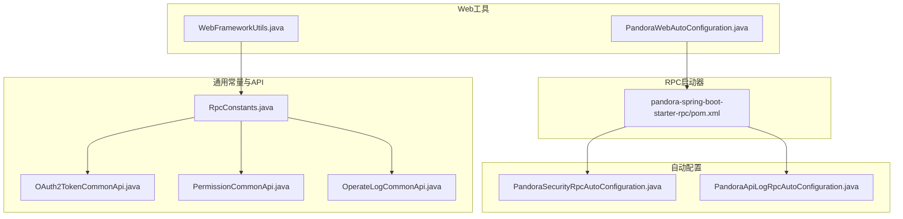
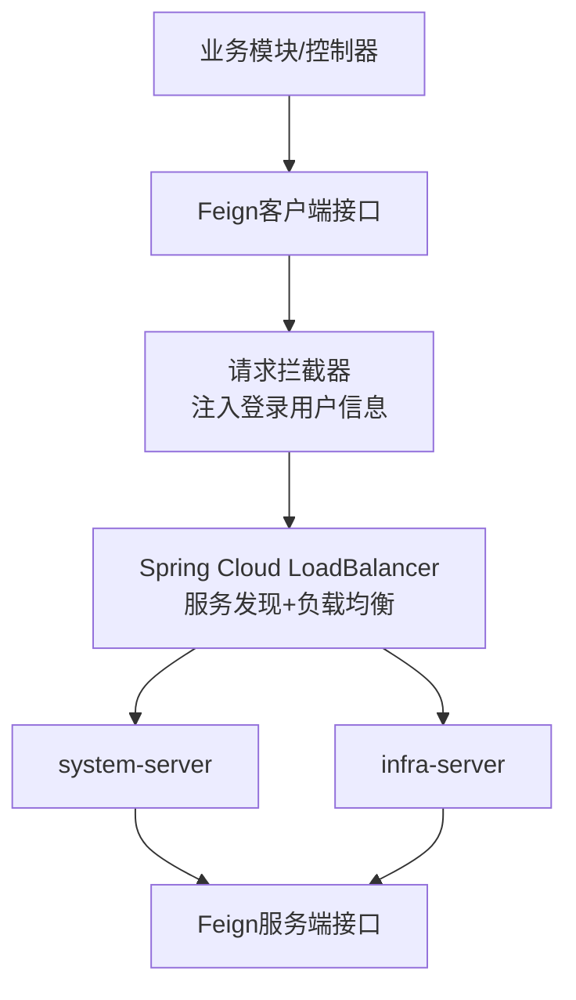
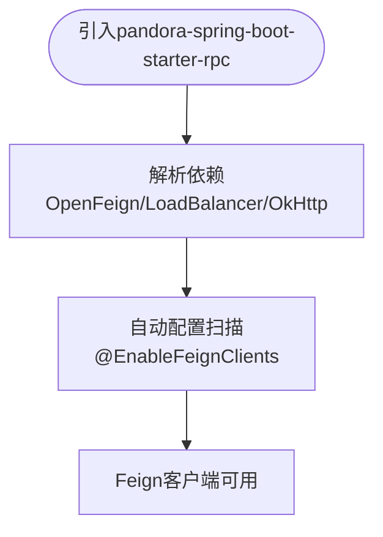
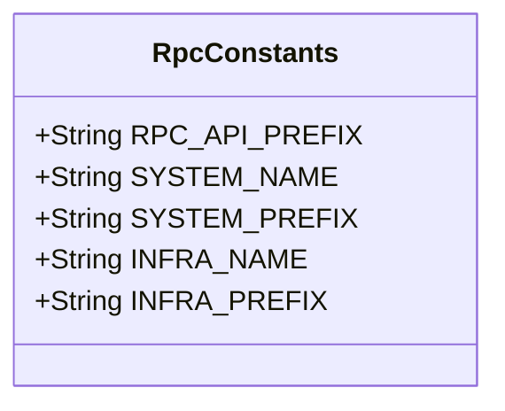
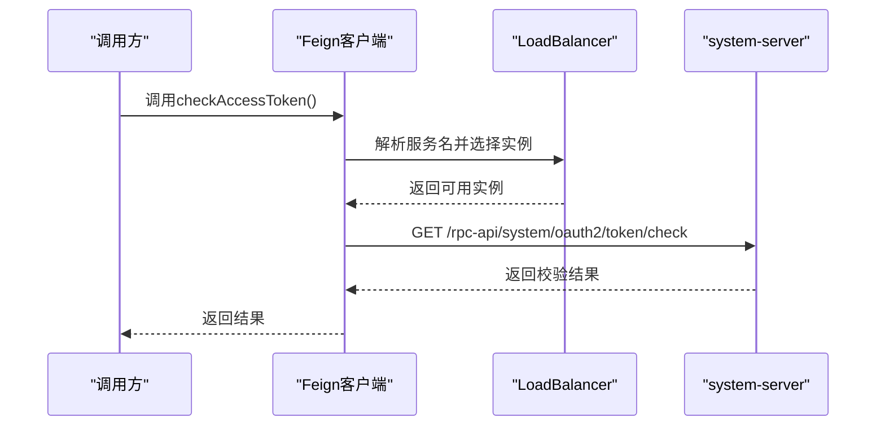
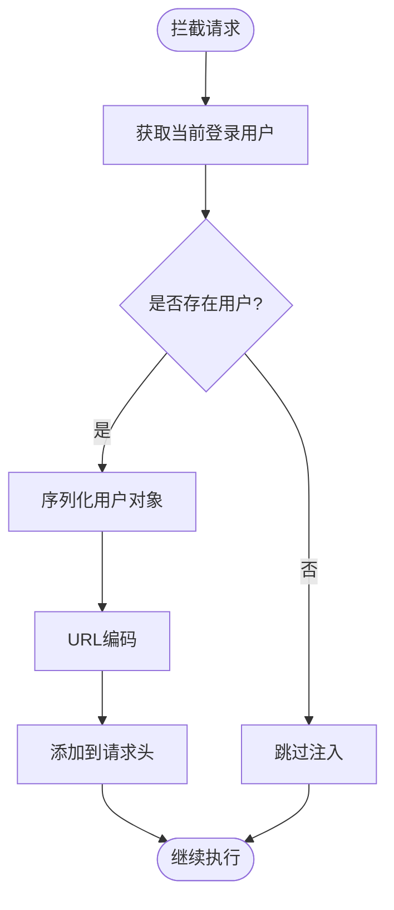
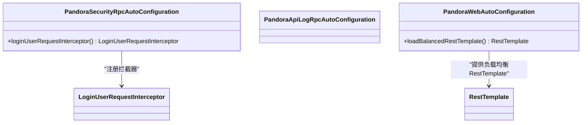
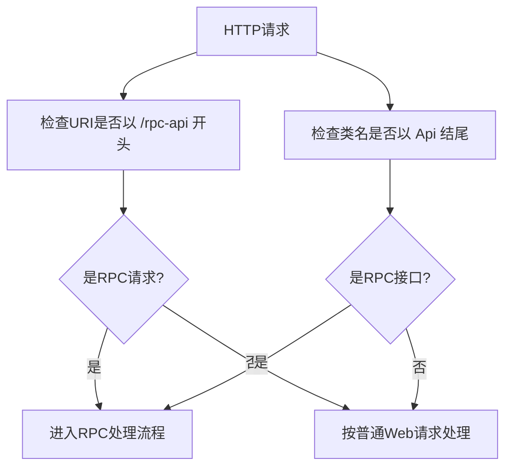
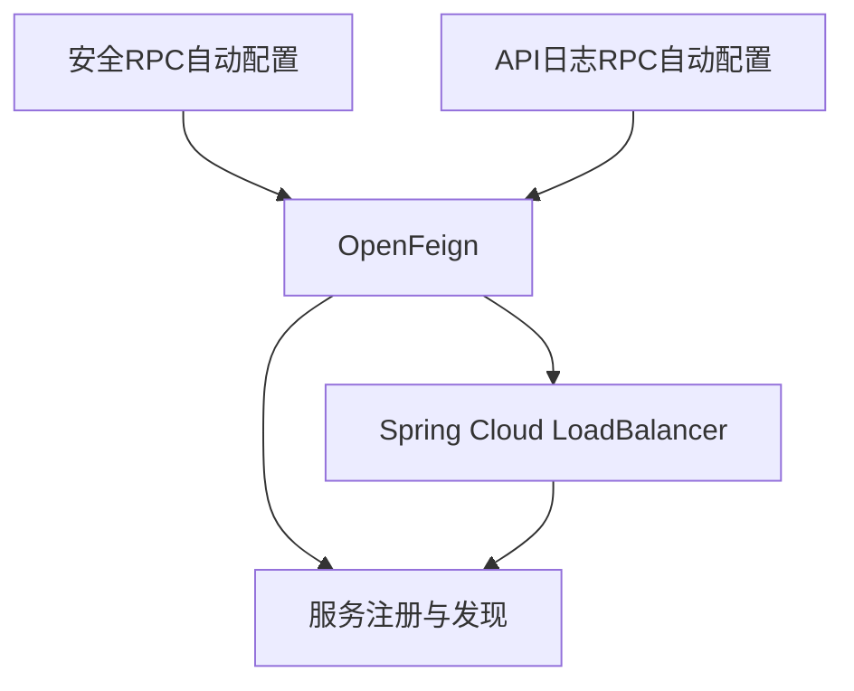
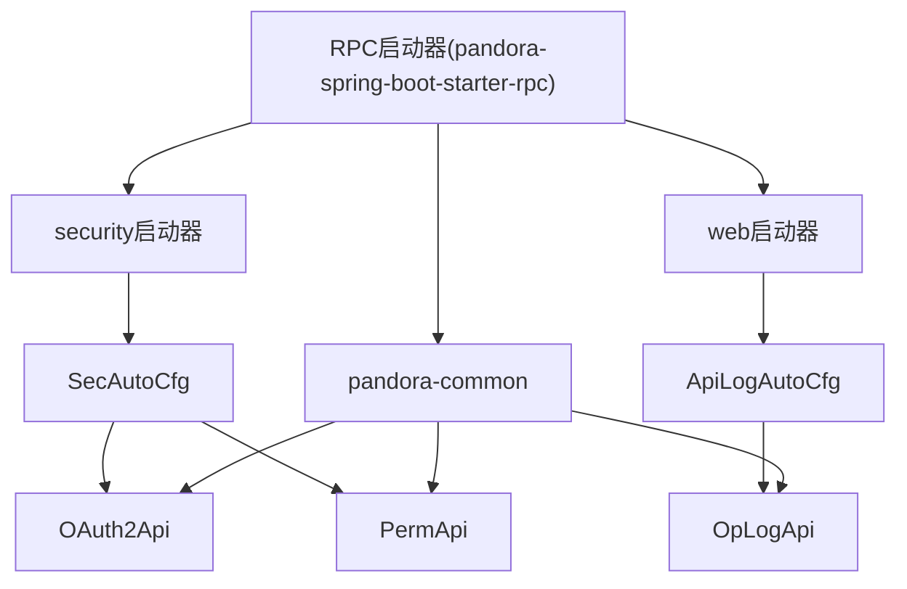

# RPC通信模块

<cite>
**本文档引用的文件**
- [pandora-spring-boot-starter-rpc/pom.xml](file://pandora-framework/pandora-spring-boot-starter-rpc/pom.xml)
- [pandora-common/src/main/java/net/ittimeline/pandora/framework/common/constants/RpcConstants.java](file://pandora-framework/pandora-common/src/main/java/net/ittimeline/pandora/framework/common/constants/RpcConstants.java)
- [pandora-common/src/main/java/net/ittimeline/pandora/framework/common/biz/system/oauth2/OAuth2TokenCommonApi.java](file://pandora-framework/pandora-common/src/main/java/net/ittimeline/pandora/framework/common/biz/system/oauth2/OAuth2TokenCommonApi.java)
- [pandora-common/src/main/java/net/ittimeline/pandora/framework/common/biz/system/permission/PermissionCommonApi.java](file://pandora-framework/pandora-common/src/main/java/net/ittimeline/pandora/framework/common/biz/system/permission/PermissionCommonApi.java)
- [pandora-common/src/main/java/net/ittimeline/pandora/framework/common/biz/system/logger/OperateLogCommonApi.java](file://pandora-framework/pandora-common/src/main/java/net/ittimeline/pandora/framework/common/biz/system/logger/OperateLogCommonApi.java)
- [pandora-spring-boot-starter-security/src/main/java/net/ittimeline/pandora/framework/security/config/PandoraSecurityRpcAutoConfiguration.java](file://pandora-framework/pandora-spring-boot-starter-security/src/main/java/net/ittimeline/pandora/framework/security/config/PandoraSecurityRpcAutoConfiguration.java)
- [pandora-spring-boot-starter-security/src/main/java/net/ittimeline/pandora/framework/security/core/rpc/LoginUserRequestInterceptor.java](file://pandora-framework/pandora-spring-boot-starter-security/src/main/java/net/ittimeline/pandora/framework/security/core/rpc/LoginUserRequestInterceptor.java)
- [pandora-spring-boot-starter-web/src/main/java/net/ittimeline/pandora/framework/apilog/config/PandoraApiLogRpcAutoConfiguration.java](file://pandora-framework/pandora-spring-boot-starter-web/src/main/java/net/ittimeline/pandora/framework/apilog/config/PandoraApiLogRpcAutoConfiguration.java)
- [pandora-spring-boot-starter-web/src/main/java/net/ittimeline/pandora/framework/web/core/util/WebFrameworkUtils.java](file://pandora-framework/pandora-spring-boot-starter-web/src/main/java/net/ittimeline/pandora/framework/web/core/util/WebFrameworkUtils.java)
- [pandora-spring-boot-starter-web/src/main/java/net/ittimeline/pandora/framework/web/config/PandoraWebAutoConfiguration.java](file://pandora-framework/pandora-spring-boot-starter-web/src/main/java/net/ittimeline/pandora/framework/web/config/PandoraWebAutoConfiguration.java)
- [pandora-common/src/main/java/com/fhs/trans/service/AutoTransable.java](file://pandora-framework/pandora-common/src/main/java/com/fhs/trans/service/AutoTransable.java)
</cite>

## 目录
1. [简介](#简介)
2. [项目结构](#项目结构)
3. [核心组件](#核心组件)
4. [架构总览](#架构总览)
5. [详细组件分析](#详细组件分析)
6. [依赖分析](#依赖分析)
7. [性能考虑](#性能考虑)
8. [故障排查指南](#故障排查指南)
9. [结论](#结论)
10. [附录](#附录)

## 简介
本文件面向Pandora Cloud框架的RPC通信模块，系统性阐述RPC启动器的设计目标、应用场景与实现机制。RPC模块基于Spring Cloud OpenFeign构建，提供声明式的HTTP远程调用能力，并通过负载均衡、请求拦截、服务发现等机制，支撑微服务间的高效通信。文档覆盖服务间通信原理、RPC配置方法、服务发现与负载均衡集成、使用示例、与Spring Cloud生态的集成关系，以及扩展自定义RPC功能的方法。

## 项目结构
RPC模块位于pandora-framework/pandora-spring-boot-starter-rpc目录，主要职责是聚合OpenFeign、Spring Cloud LoadBalancer与相关工具依赖，形成可复用的RPC启动器。同时，pandora-common模块提供RPC常量与各类通用API接口，供各业务模块通过Feign客户端进行远程调用。

**图表来源**
- [pandora-spring-boot-starter-rpc/pom.xml:22-58](file://pandora-framework/pandora-spring-boot-starter-rpc/pom.xml#L22-L58)
- [pandora-common/src/main/java/net/ittimeline/pandora/framework/common/constants/RpcConstants.java:12-41](file://pandora-framework/pandora-common/src/main/java/net/ittimeline/pandora/framework/common/constants/RpcConstants.java#L12-L41)
- [pandora-common/src/main/java/net/ittimeline/pandora/framework/common/biz/system/oauth2/OAuth2TokenCommonApi.java:13-33](file://pandora-framework/pandora-common/src/main/java/net/ittimeline/pandora/framework/common/biz/system/oauth2/OAuth2TokenCommonApi.java#L13-L33)
- [pandora-common/src/main/java/net/ittimeline/pandora/framework/common/biz/system/permission/PermissionCommonApi.java:13-45](file://pandora-framework/pandora-common/src/main/java/net/ittimeline/pandora/framework/common/biz/system/permission/PermissionCommonApi.java#L13-L45)
- [pandora-common/src/main/java/net/ittimeline/pandora/framework/common/biz/system/logger/OperateLogCommonApi.java:14-40](file://pandora-framework/pandora-common/src/main/java/net/ittimeline/pandora/framework/common/biz/system/logger/OperateLogCommonApi.java#L14-L40)
- [pandora-spring-boot-starter-security/src/main/java/net/ittimeline/pandora/framework/security/config/PandoraSecurityRpcAutoConfiguration.java:17-26](file://pandora-framework/pandora-spring-boot-starter-security/src/main/java/net/ittimeline/pandora/framework/security/config/PandoraSecurityRpcAutoConfiguration.java#L17-L26)
- [pandora-spring-boot-starter-web/src/main/java/net/ittimeline/pandora/framework/apilog/config/PandoraApiLogRpcAutoConfiguration.java:15-17](file://pandora-framework/pandora-spring-boot-starter-web/src/main/java/net/ittimeline/pandora/framework/apilog/config/PandoraApiLogRpcAutoConfiguration.java#L15-L17)
- [pandora-spring-boot-starter-web/src/main/java/net/ittimeline/pandora/framework/web/core/util/WebFrameworkUtils.java:159-181](file://pandora-framework/pandora-spring-boot-starter-web/src/main/java/net/ittimeline/pandora/framework/web/core/util/WebFrameworkUtils.java#L159-L181)
- [pandora-spring-boot-starter-web/src/main/java/net/ittimeline/pandora/framework/web/config/PandoraWebAutoConfiguration.java:22-176](file://pandora-framework/pandora-spring-boot-starter-web/src/main/java/net/ittimeline/pandora/framework/web/config/PandoraWebAutoConfiguration.java#L22-L176)

**章节来源**
- [pandora-spring-boot-starter-rpc/pom.xml:1-60](file://pandora-framework/pandora-spring-boot-starter-rpc/pom.xml#L1-L60)
- [pandora-common/src/main/java/net/ittimeline/pandora/framework/common/constants/RpcConstants.java:1-42](file://pandora-framework/pandora-common/src/main/java/net/ittimeline/pandora/framework/common/constants/RpcConstants.java#L1-L42)

## 核心组件
- RPC启动器依赖管理：统一引入OpenFeign、Spring Cloud LoadBalancer、OkHttp适配器及必要的兼容依赖，确保RPC调用具备声明式、可负载均衡的特性。
- RPC常量：集中定义RPC API前缀、服务名与前缀规范，保证跨模块一致性。
- Feign客户端接口：在pandora-common中定义多个通用API接口，如OAuth2令牌校验、权限判断、操作日志创建等，均通过@FeignClient标注并绑定具体服务名。
- 自动配置：在安全、日志等启动器中启用@EnableFeignClients，自动扫描并注册Feign客户端，简化使用方配置。
- 请求拦截：登录用户信息通过RequestInterceptor注入到请求头，保障RPC链路中的鉴权上下文传递。
- Web工具：提供RPC请求识别逻辑，便于在网关或过滤器中区分RPC流量。

**章节来源**
- [pandora-spring-boot-starter-rpc/pom.xml:22-58](file://pandora-framework/pandora-spring-boot-starter-rpc/pom.xml#L22-L58)
- [pandora-common/src/main/java/net/ittimeline/pandora/framework/common/constants/RpcConstants.java:12-41](file://pandora-framework/pandora-common/src/main/java/net/ittimeline/pandora/framework/common/constants/RpcConstants.java#L12-L41)
- [pandora-common/src/main/java/net/ittimeline/pandora/framework/common/biz/system/oauth2/OAuth2TokenCommonApi.java:13-33](file://pandora-framework/pandora-common/src/main/java/net/ittimeline/pandora/framework/common/biz/system/oauth2/OAuth2TokenCommonApi.java#L13-L33)
- [pandora-common/src/main/java/net/ittimeline/pandora/framework/common/biz/system/permission/PermissionCommonApi.java:13-45](file://pandora-framework/pandora-common/src/main/java/net/ittimeline/pandora/framework/common/biz/system/permission/PermissionCommonApi.java#L13-L45)
- [pandora-common/src/main/java/net/ittimeline/pandora/framework/common/biz/system/logger/OperateLogCommonApi.java:14-40](file://pandora-framework/pandora-common/src/main/java/net/ittimeline/pandora/framework/common/biz/system/logger/OperateLogCommonApi.java#L14-L40)
- [pandora-spring-boot-starter-security/src/main/java/net/ittimeline/pandora/framework/security/config/PandoraSecurityRpcAutoConfiguration.java:17-26](file://pandora-framework/pandora-spring-boot-starter-security/src/main/java/net/ittimeline/pandora/framework/security/config/PandoraSecurityRpcAutoConfiguration.java#L17-L26)
- [pandora-spring-boot-starter-web/src/main/java/net/ittimeline/pandora/framework/web/core/util/WebFrameworkUtils.java:159-181](file://pandora-framework/pandora-spring-boot-starter-web/src/main/java/net/ittimeline/pandora/framework/web/core/util/WebFrameworkUtils.java#L159-L181)

## 架构总览
RPC模块在整体架构中的定位是“声明式HTTP远程调用层”，向上为业务模块提供简洁的API接口，向下与服务发现、负载均衡、安全拦截等基础设施协同工作。

**图表来源**
- [pandora-common/src/main/java/net/ittimeline/pandora/framework/common/biz/system/oauth2/OAuth2TokenCommonApi.java:13-33](file://pandora-framework/pandora-common/src/main/java/net/ittimeline/pandora/framework/common/biz/system/oauth2/OAuth2TokenCommonApi.java#L13-L33)
- [pandora-spring-boot-starter-security/src/main/java/net/ittimeline/pandora/framework/security/core/rpc/LoginUserRequestInterceptor.java:20-39](file://pandora-framework/pandora-spring-boot-starter-security/src/main/java/net/ittimeline/pandora/framework/security/core/rpc/LoginUserRequestInterceptor.java#L20-L39)
- [pandora-spring-boot-starter-web/src/main/java/net/ittimeline/pandora/framework/web/config/PandoraWebAutoConfiguration.java:171-175](file://pandora-framework/pandora-spring-boot-starter-web/src/main/java/net/ittimeline/pandora/framework/web/config/PandoraWebAutoConfiguration.java#L171-L175)

## 详细组件分析

### 组件A：RPC启动器与依赖管理
- 设计目标：提供开箱即用的RPC能力，屏蔽底层细节，降低接入成本。
- 关键依赖：OpenFeign用于声明式HTTP调用；Spring Cloud LoadBalancer用于客户端负载均衡；OkHttp适配器提升网络性能；兼容性依赖确保与第三方库的版本冲突最小化。
- 适用场景：微服务间调用、跨服务数据查询、鉴权与权限校验、异步日志上报等。

**图表来源**
- [pandora-spring-boot-starter-rpc/pom.xml:22-58](file://pandora-framework/pandora-spring-boot-starter-rpc/pom.xml#L22-L58)
- [pandora-spring-boot-starter-security/src/main/java/net/ittimeline/pandora/framework/security/config/PandoraSecurityRpcAutoConfiguration.java:17-26](file://pandora-framework/pandora-spring-boot-starter-security/src/main/java/net/ittimeline/pandora/framework/security/config/PandoraSecurityRpcAutoConfiguration.java#L17-L26)

**章节来源**
- [pandora-spring-boot-starter-rpc/pom.xml:1-60](file://pandora-framework/pandora-spring-boot-starter-rpc/pom.xml#L1-L60)

### 组件B：RPC常量与命名规范
- RPC_API_PREFIX：统一RPC接口前缀，便于路由与识别。
- 服务名与前缀：SYSTEM_NAME、INFRA_NAME及其前缀，确保不同域的服务调用边界清晰。
- 规范意义：跨模块共享常量，避免硬编码，减少配置漂移带来的问题。

**图表来源**
- [pandora-common/src/main/java/net/ittimeline/pandora/framework/common/constants/RpcConstants.java:12-41](file://pandora-framework/pandora-common/src/main/java/net/ittimeline/pandora/framework/common/constants/RpcConstants.java#L12-L41)

**章节来源**
- [pandora-common/src/main/java/net/ittimeline/pandora/framework/common/constants/RpcConstants.java:1-42](file://pandora-framework/pandora-common/src/main/java/net/ittimeline/pandora/framework/common/constants/RpcConstants.java#L1-L42)

### 组件C：Feign客户端接口与服务发现
- OAuth2令牌校验接口：通过@FeignClient绑定system-server，提供令牌有效性检查。
- 权限判断接口：同样绑定system-server，支持多参数权限/角色校验。
- 操作日志接口：绑定system-server，支持同步与异步两种调用方式。
- 服务发现：Feign客户端通过服务名与注册中心交互，结合LoadBalancer实现软负载均衡。

**图表来源**
- [pandora-common/src/main/java/net/ittimeline/pandora/framework/common/biz/system/oauth2/OAuth2TokenCommonApi.java:20-30](file://pandora-framework/pandora-common/src/main/java/net/ittimeline/pandora/framework/common/biz/system/oauth2/OAuth2TokenCommonApi.java#L20-L30)
- [pandora-spring-boot-starter-web/src/main/java/net/ittimeline/pandora/framework/web/config/PandoraWebAutoConfiguration.java:171-175](file://pandora-framework/pandora-spring-boot-starter-web/src/main/java/net/ittimeline/pandora/framework/web/config/PandoraWebAutoConfiguration.java#L171-L175)

**章节来源**
- [pandora-common/src/main/java/net/ittimeline/pandora/framework/common/biz/system/oauth2/OAuth2TokenCommonApi.java:1-34](file://pandora-framework/pandora-common/src/main/java/net/ittimeline/pandora/framework/common/biz/system/oauth2/OAuth2TokenCommonApi.java#L1-L34)
- [pandora-common/src/main/java/net/ittimeline/pandora/framework/common/biz/system/permission/PermissionCommonApi.java:1-46](file://pandora-framework/pandora-common/src/main/java/net/ittimeline/pandora/framework/common/biz/system/permission/PermissionCommonApi.java#L1-L46)
- [pandora-common/src/main/java/net/ittimeline/pandora/framework/common/biz/system/logger/OperateLogCommonApi.java:1-41](file://pandora-framework/pandora-common/src/main/java/net/ittimeline/pandora/framework/common/biz/system/logger/OperateLogCommonApi.java#L1-L41)

### 组件D：请求拦截与上下文传递
- 登录用户拦截器：在请求模板中注入登录用户信息，编码后写入请求头，确保下游服务可感知当前用户上下文。
- 异常处理：序列化失败时记录错误日志并抛出，便于快速定位问题。

**图表来源**
- [pandora-spring-boot-starter-security/src/main/java/net/ittimeline/pandora/framework/security/core/rpc/LoginUserRequestInterceptor.java:21-39](file://pandora-framework/pandora-spring-boot-starter-security/src/main/java/net/ittimeline/pandora/framework/security/core/rpc/LoginUserRequestInterceptor.java#L21-L39)

**章节来源**
- [pandora-spring-boot-starter-security/src/main/java/net/ittimeline/pandora/framework/security/core/rpc/LoginUserRequestInterceptor.java:1-39](file://pandora-framework/pandora-spring-boot-starter-security/src/main/java/net/ittimeline/pandora/framework/security/core/rpc/LoginUserRequestInterceptor.java#L1-L39)

### 组件E：自动配置与RPC启用
- 安全RPC自动配置：启用Feign客户端并指定要扫描的API接口类，确保相关服务被纳入调用范围。
- API日志RPC自动配置：同样启用Feign客户端，用于API访问日志的远程上报。
- Web自动配置：提供带负载均衡的RestTemplate Bean，作为RPC的补充方案。

**图表来源**
- [pandora-spring-boot-starter-security/src/main/java/net/ittimeline/pandora/framework/security/config/PandoraSecurityRpcAutoConfiguration.java:17-26](file://pandora-framework/pandora-spring-boot-starter-security/src/main/java/net/ittimeline/pandora/framework/security/config/PandoraSecurityRpcAutoConfiguration.java#L17-L26)
- [pandora-spring-boot-starter-web/src/main/java/net/ittimeline/pandora/framework/web/config/PandoraWebAutoConfiguration.java:171-175](file://pandora-framework/pandora-spring-boot-starter-web/src/main/java/net/ittimeline/pandora/framework/web/config/PandoraWebAutoConfiguration.java#L171-L175)

**章节来源**
- [pandora-spring-boot-starter-security/src/main/java/net/ittimeline/pandora/framework/security/config/PandoraSecurityRpcAutoConfiguration.java:1-27](file://pandora-framework/pandora-spring-boot-starter-security/src/main/java/net/ittimeline/pandora/framework/security/config/PandoraSecurityRpcAutoConfiguration.java#L1-L27)
- [pandora-spring-boot-starter-web/src/main/java/net/ittimeline/pandora/framework/web/config/PandoraWebAutoConfiguration.java:159-175](file://pandora-framework/pandora-spring-boot-starter-web/src/main/java/net/ittimeline/pandora/framework/web/config/PandoraWebAutoConfiguration.java#L159-L175)

### 组件F：RPC请求识别与约定
- Web工具提供两类RPC请求识别方法：基于URI前缀与基于类名后缀的约定，便于在网关或过滤器中分流处理。
- 与RPC常量配合，确保识别规则与服务前缀保持一致。

**图表来源**
- [pandora-spring-boot-starter-web/src/main/java/net/ittimeline/pandora/framework/web/core/util/WebFrameworkUtils.java:159-181](file://pandora-framework/pandora-spring-boot-starter-web/src/main/java/net/ittimeline/pandora/framework/web/core/util/WebFrameworkUtils.java#L159-L181)
- [pandora-common/src/main/java/net/ittimeline/pandora/framework/common/constants/RpcConstants.java:12-41](file://pandora-framework/pandora-common/src/main/java/net/ittimeline/pandora/framework/common/constants/RpcConstants.java#L12-L41)

**章节来源**
- [pandora-spring-boot-starter-web/src/main/java/net/ittimeline/pandora/framework/web/core/util/WebFrameworkUtils.java:159-181](file://pandora-framework/pandora-spring-boot-starter-web/src/main/java/net/ittimeline/pandora/framework/web/core/util/WebFrameworkUtils.java#L159-L181)

### 组件G：与Spring Cloud生态的集成
- OpenFeign：提供声明式HTTP客户端，简化远程调用。
- Spring Cloud LoadBalancer：客户端侧负载均衡，与注册中心配合实现高可用。
- 自动配置：通过@EnableFeignClients与AutoConfiguration实现零样板代码接入。
- 兼容性：显式引入HTTP Client 4.x以兼容第三方库的依赖冲突。

**图表来源**
- [pandora-spring-boot-starter-rpc/pom.xml:28-51](file://pandora-framework/pandora-spring-boot-starter-rpc/pom.xml#L28-L51)
- [pandora-spring-boot-starter-security/src/main/java/net/ittimeline/pandora/framework/security/config/PandoraSecurityRpcAutoConfiguration.java:17-19](file://pandora-framework/pandora-spring-boot-starter-security/src/main/java/net/ittimeline/pandora/framework/security/config/PandoraSecurityRpcAutoConfiguration.java#L17-L19)
- [pandora-spring-boot-starter-web/src/main/java/net/ittimeline/pandora/framework/apilog/config/PandoraApiLogRpcAutoConfiguration.java:15-17](file://pandora-framework/pandora-spring-boot-starter-web/src/main/java/net/ittimeline/pandora/framework/apilog/config/PandoraApiLogRpcAutoConfiguration.java#L15-L17)

**章节来源**
- [pandora-spring-boot-starter-rpc/pom.xml:28-51](file://pandora-framework/pandora-spring-boot-starter-rpc/pom.xml#L28-L51)

## 依赖分析
RPC模块与各子系统的耦合关系如下：

**图表来源**
- [pandora-spring-boot-starter-rpc/pom.xml:22-26](file://pandora-framework/pandora-spring-boot-starter-rpc/pom.xml#L22-L26)
- [pandora-spring-boot-starter-security/src/main/java/net/ittimeline/pandora/framework/security/config/PandoraSecurityRpcAutoConfiguration.java:17-19](file://pandora-framework/pandora-spring-boot-starter-security/src/main/java/net/ittimeline/pandora/framework/security/config/PandoraSecurityRpcAutoConfiguration.java#L17-L19)
- [pandora-spring-boot-starter-web/src/main/java/net/ittimeline/pandora/framework/apilog/config/PandoraApiLogRpcAutoConfiguration.java:15-17](file://pandora-framework/pandora-spring-boot-starter-web/src/main/java/net/ittimeline/pandora/framework/apilog/config/PandoraApiLogRpcAutoConfiguration.java#L15-L17)

**章节来源**
- [pandora-spring-boot-starter-rpc/pom.xml:22-26](file://pandora-framework/pandora-spring-boot-starter-rpc/pom.xml#L22-L26)
- [pandora-spring-boot-starter-security/src/main/java/net/ittimeline/pandora/framework/security/config/PandoraSecurityRpcAutoConfiguration.java:17-19](file://pandora-framework/pandora-spring-boot-starter-security/src/main/java/net/ittimeline/pandora/framework/security/config/PandoraSecurityRpcAutoConfiguration.java#L17-L19)
- [pandora-spring-boot-starter-web/src/main/java/net/ittimeline/pandora/framework/apilog/config/PandoraApiLogRpcAutoConfiguration.java:15-17](file://pandora-framework/pandora-spring-boot-starter-web/src/main/java/net/ittimeline/pandora/framework/apilog/config/PandoraApiLogRpcAutoConfiguration.java#L15-L17)

## 性能考虑
- 客户端负载均衡：通过Spring Cloud LoadBalancer在调用端实现软负载，降低单点压力。
- OkHttp适配器：相比默认连接器，OkHttp通常具有更好的并发与连接复用能力。
- 异步调用：在日志等非关键路径采用异步方式，减少主流程阻塞。
- 依赖精简：仅引入必要依赖，避免不必要的类加载与初始化开销。

## 故障排查指南
- 服务不可达：确认服务名与注册中心一致，检查服务健康状态与网络连通性。
- 负载均衡异常：检查LoadBalancer配置与实例权重，验证服务端点变更后的缓存刷新。
- 请求头缺失：核对请求拦截器是否生效，确认登录用户上下文是否正确序列化与编码。
- 版本冲突：若出现HttpClient相关类缺失，检查兼容性依赖是否正确引入。
- RPC识别问题：核对URI前缀与类名约定，确保与RpcConstants保持一致。

**章节来源**
- [pandora-spring-boot-starter-security/src/main/java/net/ittimeline/pandora/framework/security/core/rpc/LoginUserRequestInterceptor.java:21-39](file://pandora-framework/pandora-spring-boot-starter-security/src/main/java/net/ittimeline/pandora/framework/security/core/rpc/LoginUserRequestInterceptor.java#L21-L39)
- [pandora-spring-boot-starter-rpc/pom.xml:47-51](file://pandora-framework/pandora-spring-boot-starter-rpc/pom.xml#L47-L51)
- [pandora-spring-boot-starter-web/src/main/java/net/ittimeline/pandora/framework/web/core/util/WebFrameworkUtils.java:159-181](file://pandora-framework/pandora-spring-boot-starter-web/src/main/java/net/ittimeline/pandora/framework/web/core/util/WebFrameworkUtils.java#L159-L181)

## 结论
RPC通信模块通过OpenFeign与Spring Cloud生态的深度集成，提供了声明式、可扩展、易维护的远程调用能力。借助统一的常量规范、自动配置与请求拦截机制，开发者可以快速在微服务架构中完成跨服务通信。建议在生产环境中结合负载均衡、熔断降级与可观测性策略，进一步提升系统的稳定性与可运维性。

## 附录
- 扩展自定义RPC功能建议：
  - 新增Feign客户端接口：遵循RpcConstants命名规范，统一前缀与服务名。
  - 注册自动配置：在对应启动器中启用@EnableFeignClients并注册拦截器。
  - 上下文传递：如有特殊上下文，可在拦截器中扩展请求头字段。
  - 兼容性处理：遇到第三方库版本冲突时，参考兼容性依赖的引入方式。

**章节来源**
- [pandora-common/src/main/java/net/ittimeline/pandora/framework/common/constants/RpcConstants.java:12-41](file://pandora-framework/pandora-common/src/main/java/net/ittimeline/pandora/framework/common/constants/RpcConstants.java#L12-L41)
- [pandora-spring-boot-starter-security/src/main/java/net/ittimeline/pandora/framework/security/config/PandoraSecurityRpcAutoConfiguration.java:17-26](file://pandora-framework/pandora-spring-boot-starter-security/src/main/java/net/ittimeline/pandora/framework/security/config/PandoraSecurityRpcAutoConfiguration.java#L17-L26)
- [pandora-spring-boot-starter-rpc/pom.xml:47-51](file://pandora-framework/pandora-spring-boot-starter-rpc/pom.xml#L47-L51)