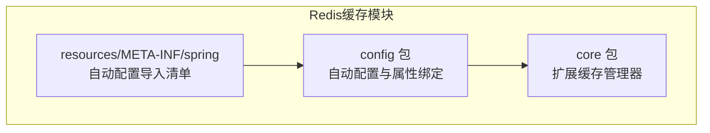
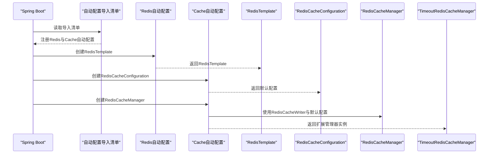
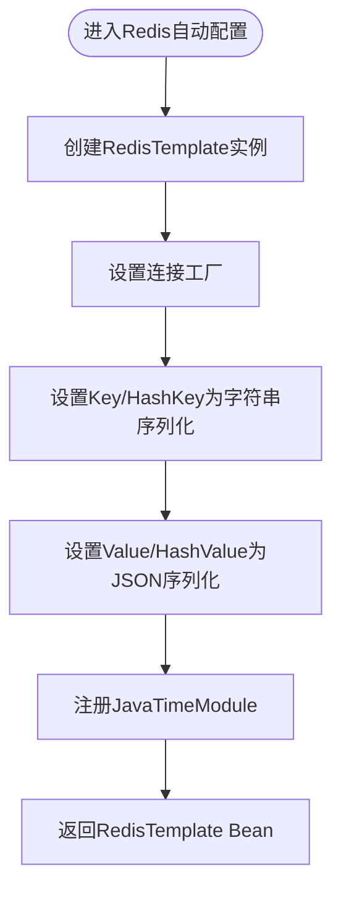
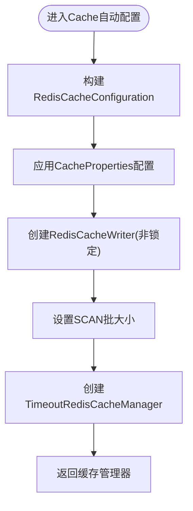
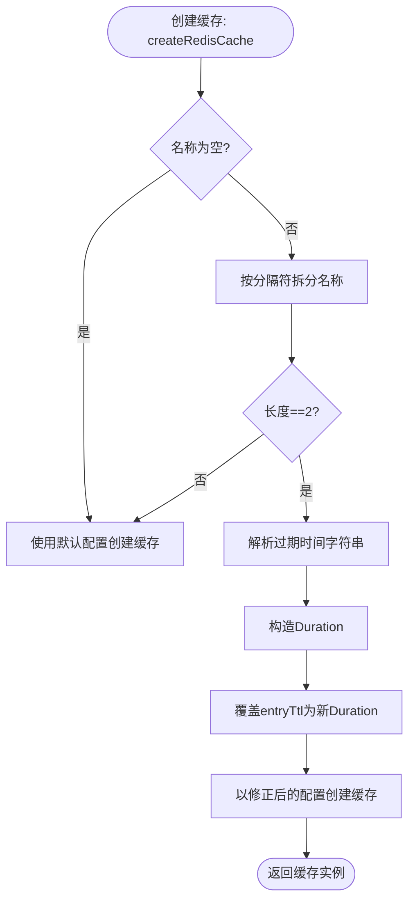
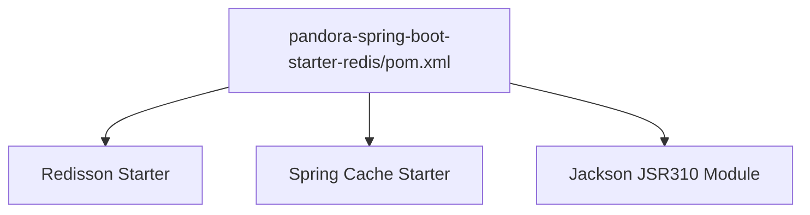

# Redis缓存模块

<cite>
**本文引用的文件**
- [PandoraRedisAutoConfiguration.java](file://pandora-framework/pandora-spring-boot-starter-redis/src/main/java/net/ittimeline/pandora/framework/redis/config/PandoraRedisAutoConfiguration.java)
- [PandoraCacheAutoConfiguration.java](file://pandora-framework/pandora-spring-boot-starter-redis/src/main/java/net/ittimeline/pandora/framework/redis/config/PandoraCacheAutoConfiguration.java)
- [PandoraCacheProperties.java](file://pandora-framework/pandora-spring-boot-starter-redis/src/main/java/net/ittimeline/pandora/framework/redis/config/PandoraCacheProperties.java)
- [TimeoutRedisCacheManager.java](file://pandora-framework/pandora-spring-boot-starter-redis/src/main/java/net/ittimeline/pandora/framework/redis/core/TimeoutRedisCacheManager.java)
- [org.springframework.boot.autoconfigure.AutoConfiguration.imports](file://pandora-framework/pandora-spring-boot-starter-redis/src/main/resources/META-INF/spring/org.springframework.boot.autoconfigure.AutoConfiguration.imports)
- [pandora-spring-boot-starter-redis/pom.xml](file://pandora-framework/pandora-spring-boot-starter-redis/pom.xml)
- [CacheUtils.java](file://pandora-framework/pandora-common/src/main/java/net/ittimeline/pandora/framework/common/util/web/cache/CacheUtils.java)
</cite>

## 目录
1. [简介](#简介)
2. [项目结构](#项目结构)
3. [核心组件](#核心组件)
4. [架构总览](#架构总览)
5. [组件详解](#组件详解)
6. [依赖关系分析](#依赖关系分析)
7. [性能考量](#性能考量)
8. [故障排查指南](#故障排查指南)
9. [结论](#结论)
10. [附录](#附录)

## 简介
本文件面向Pandora Cloud框架的Redis缓存模块，系统性阐述以下主题：
- Redis自动配置机制的实现原理与配置项
- TimeoutRedisCacheManager缓存管理器的设计思路、自定义过期时间实现机制与使用方法
- 缓存配置属性的设置方式、缓存管理器的扩展路径
- 分布式锁的实现原理与使用建议
- 与Spring Cache注解的集成方式及最佳实践
- 在项目中集成与使用的示例路径指引

## 项目结构
Redis缓存模块位于pandora-spring-boot-starter-redis子工程中，采用按职责分层的组织方式：
- config包：负责自动装配与配置属性绑定
- core包：提供扩展的缓存管理器实现
- resources/META-INF/spring：声明自动配置导入清单

**图表来源**
- [PandoraRedisAutoConfiguration.java:19-38](file://pandora-framework/pandora-spring-boot-starter-redis/src/main/java/net/ittimeline/pandora/framework/redis/config/PandoraRedisAutoConfiguration.java#L19-L38)
- [PandoraCacheAutoConfiguration.java:31-83](file://pandora-framework/pandora-spring-boot-starter-redis/src/main/java/net/ittimeline/pandora/framework/redis/config/PandoraCacheAutoConfiguration.java#L31-L83)
- [org.springframework.boot.autoconfigure.AutoConfiguration.imports:1-2](file://pandora-framework/pandora-spring-boot-starter-redis/src/main/resources/META-INF/spring/org.springframework.boot.autoconfigure.AutoConfiguration.imports#L1-L2)

**章节来源**
- [pandora-spring-boot-starter-redis/pom.xml:19-40](file://pandora-framework/pandora-spring-boot-starter-redis/pom.xml#L19-L40)
- [org.springframework.boot.autoconfigure.AutoConfiguration.imports:1-2](file://pandora-framework/pandora-spring-boot-starter-redis/src/main/resources/META-INF/spring/org.springframework.boot.autoconfigure.AutoConfiguration.imports#L1-L2)

## 核心组件
- Redis自动配置类：负责构建RedisTemplate与JSON序列化策略，并注册到容器
- Cache自动配置类：负责构建RedisCacheConfiguration与RedisCacheManager，并注入扩展的TimeoutRedisCacheManager
- 配置属性类：提供pandora.cache.*相关配置项（如扫描批大小）
- 扩展缓存管理器：支持在缓存名称中携带自定义过期时间的语法糖

**章节来源**
- [PandoraRedisAutoConfiguration.java:25-38](file://pandora-framework/pandora-spring-boot-starter-redis/src/main/java/net/ittimeline/pandora/framework/redis/config/PandoraRedisAutoConfiguration.java#L25-L38)
- [PandoraCacheAutoConfiguration.java:40-83](file://pandora-framework/pandora-spring-boot-starter-redis/src/main/java/net/ittimeline/pandora/framework/redis/config/PandoraCacheAutoConfiguration.java#L40-L83)
- [PandoraCacheProperties.java:14-29](file://pandora-framework/pandora-spring-boot-starter-redis/src/main/java/net/ittimeline/pandora/framework/redis/config/PandoraCacheProperties.java#L14-L29)
- [TimeoutRedisCacheManager.java:19-50](file://pandora-framework/pandora-spring-boot-starter-redis/src/main/java/net/ittimeline/pandora/framework/redis/core/TimeoutRedisCacheManager.java#L19-L50)

## 架构总览
Redis缓存模块通过Spring Boot自动装配机制完成初始化，关键流程如下：
- 自动发现并加载自动配置导入清单
- 构建RedisTemplate（JSON序列化）与RedisCacheConfiguration
- 基于RedisCacheWriter与扩展的TimeoutRedisCacheManager创建缓存管理器
- 开启@EnableCaching以启用Spring Cache注解

**图表来源**
- [org.springframework.boot.autoconfigure.AutoConfiguration.imports:1-2](file://pandora-framework/pandora-spring-boot-starter-redis/src/main/resources/META-INF/spring/org.springframework.boot.autoconfigure.AutoConfiguration.imports#L1-L2)
- [PandoraRedisAutoConfiguration.java:25-38](file://pandora-framework/pandora-spring-boot-starter-redis/src/main/java/net/ittimeline/pandora/framework/redis/config/PandoraRedisAutoConfiguration.java#L25-L38)
- [PandoraCacheAutoConfiguration.java:40-83](file://pandora-framework/pandora-spring-boot-starter-redis/src/main/java/net/ittimeline/pandora/framework/redis/config/PandoraCacheAutoConfiguration.java#L40-L83)

## 组件详解

### Redis自动配置机制
- 自动配置类在Redisson自动配置之前执行，确保优先使用自定义的RedisTemplate Bean
- 构建RedisTemplate时：
  - Key与HashKey使用字符串序列化
  - Value与HashValue使用JSON序列化（内置JavaTimeModule以支持时间类型）
- 提供静态工具方法用于构建JSON序列化器，避免时间类型序列化问题

**图表来源**
- [PandoraRedisAutoConfiguration.java:25-46](file://pandora-framework/pandora-spring-boot-starter-redis/src/main/java/net/ittimeline/pandora/framework/redis/config/PandoraRedisAutoConfiguration.java#L25-L46)

**章节来源**
- [PandoraRedisAutoConfiguration.java:19-46](file://pandora-framework/pandora-spring-boot-starter-redis/src/main/java/net/ittimeline/pandora/framework/redis/config/PandoraRedisAutoConfiguration.java#L19-L46)

### Cache自动配置与管理器
- Cache自动配置类：
  - 生成RedisCacheConfiguration，默认使用JSON序列化与缓存前缀策略
  - 从CacheProperties读取TTL、是否缓存null值、是否使用key前缀等配置
  - 基于RedisCacheWriter与默认配置创建RedisCacheManager
  - 注入扩展的TimeoutRedisCacheManager，以支持自定义过期时间
- 关键点：
  - 使用非锁定写入器与SCAN批大小参数，提升批量操作性能
  - 通过@EnableCaching启用Spring Cache注解

**图表来源**
- [PandoraCacheAutoConfiguration.java:40-83](file://pandora-framework/pandora-spring-boot-starter-redis/src/main/java/net/ittimeline/pandora/framework/redis/config/PandoraCacheAutoConfiguration.java#L40-L83)

**章节来源**
- [PandoraCacheAutoConfiguration.java:31-83](file://pandora-framework/pandora-spring-boot-starter-redis/src/main/java/net/ittimeline/pandora/framework/redis/config/PandoraCacheAutoConfiguration.java#L31-L83)

### TimeoutRedisCacheManager：自定义过期时间实现
- 设计思路：
  - 在缓存名称中使用特定分隔符与过期时间语法，运行时解析并动态覆盖默认TTL
  - 保持与Spring Cache标准行为一致，仅在名称满足约定时生效
- 名称约定与解析规则：
  - 使用分隔符拆分名称，长度不等于2则回退到默认配置
  - 从第二段提取过期时间字符串，支持天(d)、小时(h)、分钟(m)、秒(s)、或默认秒
  - 动态构造Duration并更新缓存配置的entryTtl
- 典型用法：
  - 在缓存名称中附加自定义过期时间，例如“用户信息#2h”，即可为该缓存条目设置2小时过期

**图表来源**
- [TimeoutRedisCacheManager.java:27-50](file://pandora-framework/pandora-spring-boot-starter-redis/src/main/java/net/ittimeline/pandora/framework/redis/core/TimeoutRedisCacheManager.java#L27-L50)

**章节来源**
- [TimeoutRedisCacheManager.java:19-85](file://pandora-framework/pandora-spring-boot-starter-redis/src/main/java/net/ittimeline/pandora/framework/redis/core/TimeoutRedisCacheManager.java#L19-L85)

### 配置属性与扩展方式
- 配置属性类提供pandora.cache.*命名空间下的配置项：
  - redisScanBatchSize：控制Redis SCAN批大小，默认值为固定常量
- 扩展方式：
  - 通过实现自定义RedisCacheManager并在Cache自动配置中替换Bean，可进一步扩展过期策略、命名规范等
  - 通过修改RedisCacheConfiguration的entryTtl、序列化策略等，适配不同业务场景

**章节来源**
- [PandoraCacheProperties.java:14-29](file://pandora-framework/pandora-spring-boot-starter-redis/src/main/java/net/ittimeline/pandora/framework/redis/config/PandoraCacheProperties.java#L14-L29)
- [PandoraCacheAutoConfiguration.java:73-83](file://pandora-framework/pandora-spring-boot-starter-redis/src/main/java/net/ittimeline/pandora/framework/redis/config/PandoraCacheAutoConfiguration.java#L73-L83)

### 分布式锁实现原理
- 模块依赖Redisson作为分布式锁能力来源，通过自动配置在Redisson之后进行，确保优先使用自定义RedisTemplate
- 分布式锁的具体实现不在本模块内直接暴露，但可通过引入Redisson Starter获得统一的分布式锁API
- 建议：
  - 在业务层通过Redisson提供的API获取分布式锁，结合本模块的RedisTemplate进行数据一致性保障
  - 锁粒度与超时策略需结合业务场景设计，避免死锁与资源浪费

**章节来源**
- [pandora-spring-boot-starter-redis/pom.xml:27-29](file://pandora-framework/pandora-spring-boot-starter-redis/pom.xml#L27-L29)
- [PandoraRedisAutoConfiguration.java:19](file://pandora-framework/pandora-spring-boot-starter-redis/src/main/java/net/ittimeline/pandora/framework/redis/config/PandoraRedisAutoConfiguration.java#L19)

### 与Spring Cache注解的集成
- 启用方式：
  - Cache自动配置类上标注@EnableCaching，开启基于注解的缓存管理
- 常用注解与行为：
  - @Cacheable：读取缓存；未命中时执行方法并将结果写入缓存
  - @CacheEvict：清空指定缓存
  - @CachePut：更新缓存（不触发方法短路）
  - @Caching/@CacheConfig：组合与全局配置
- 与自定义过期时间结合：
  - 在缓存名称中附加过期时间后缀，即可为特定缓存条目设置独立TTL
  - 适用于热点数据短期缓存、临时数据隔离等场景

**章节来源**
- [PandoraCacheAutoConfiguration.java:32-33](file://pandora-framework/pandora-spring-boot-starter-redis/src/main/java/net/ittimeline/pandora/framework/redis/config/PandoraCacheAutoConfiguration.java#L32-L33)
- [TimeoutRedisCacheManager.java:27-50](file://pandora-framework/pandora-spring-boot-starter-redis/src/main/java/net/ittimeline/pandora/framework/redis/core/TimeoutRedisCacheManager.java#L27-L50)

### 使用示例（路径指引）
- 在应用中引入pandora-spring-boot-starter-redis依赖后，自动配置将生效
- 示例路径（请在实际项目中按需调整）：
  - RedisTemplate使用：参考[Redis模板Bean定义:25-38](file://pandora-framework/pandora-spring-boot-starter-redis/src/main/java/net/ittimeline/pandora/framework/redis/config/PandoraRedisAutoConfiguration.java#L25-L38)
  - 缓存管理器使用：参考[缓存管理器Bean定义:73-83](file://pandora-framework/pandora-spring-boot-starter-redis/src/main/java/net/ittimeline/pandora/framework/redis/config/PandoraCacheAutoConfiguration.java#L73-L83)
  - 自定义过期时间：参考[名称解析与TTL覆盖逻辑:27-50](file://pandora-framework/pandora-spring-boot-starter-redis/src/main/java/net/ittimeline/pandora/framework/redis/core/TimeoutRedisCacheManager.java#L27-L50)
  - 分布式锁：参考[Redisson依赖声明:27-29](file://pandora-framework/pandora-spring-boot-starter-redis/pom.xml#L27-L29)

**章节来源**
- [pandora-spring-boot-starter-redis/pom.xml:19-40](file://pandora-framework/pandora-spring-boot-starter-redis/pom.xml#L19-L40)
- [PandoraRedisAutoConfiguration.java:25-38](file://pandora-framework/pandora-spring-boot-starter-redis/src/main/java/net/ittimeline/pandora/framework/redis/config/PandoraRedisAutoConfiguration.java#L25-L38)
- [PandoraCacheAutoConfiguration.java:73-83](file://pandora-framework/pandora-spring-boot-starter-redis/src/main/java/net/ittimeline/pandora/framework/redis/config/PandoraCacheAutoConfiguration.java#L73-L83)
- [TimeoutRedisCacheManager.java:27-50](file://pandora-framework/pandora-spring-boot-starter-redis/src/main/java/net/ittimeline/pandora/framework/redis/core/TimeoutRedisCacheManager.java#L27-L50)

## 依赖关系分析
- 模块依赖：
  - redisson-spring-boot-starter：提供分布式锁能力
  - spring-boot-starter-cache：提供Spring Cache抽象与自动配置
  - jackson-datatype-jsr310：解决时间类型的JSON序列化
- 自动配置导入：
  - 通过META-INF/spring自动配置导入清单声明两个配置类

**图表来源**
- [pandora-spring-boot-starter-redis/pom.xml:27-39](file://pandora-framework/pandora-spring-boot-starter-redis/pom.xml#L27-L39)

**章节来源**
- [pandora-spring-boot-starter-redis/pom.xml:19-40](file://pandora-framework/pandora-spring-boot-starter-redis/pom.xml#L19-L40)
- [org.springframework.boot.autoconfigure.AutoConfiguration.imports:1-2](file://pandora-framework/pandora-spring-boot-starter-redis/src/main/resources/META-INF/spring/org.springframework.boot.autoconfigure.AutoConfiguration.imports#L1-L2)

## 性能考量
- 序列化策略：
  - 使用JSON序列化VALUE，便于跨语言与调试；注意对象结构稳定性
- 批量操作：
  - RedisCacheWriter采用非锁定模式与SCAN批大小参数，减少阻塞与内存占用
- TTL策略：
  - 通过自定义过期时间实现差异化缓存寿命，降低热点数据长期占用
- 本地缓存补充：
  - 可结合pandora-common中的CacheUtils构建本地LoadingCache，实现热点数据的低延迟访问与异步刷新

**章节来源**
- [PandoraCacheAutoConfiguration.java:78-80](file://pandora-framework/pandora-spring-boot-starter-redis/src/main/java/net/ittimeline/pandora/framework/redis/config/PandoraCacheAutoConfiguration.java#L78-L80)
- [TimeoutRedisCacheManager.java:58-82](file://pandora-framework/pandora-spring-boot-starter-redis/src/main/java/net/ittimeline/pandora/framework/redis/core/TimeoutRedisCacheManager.java#L58-L82)
- [CacheUtils.java:37-59](file://pandora-framework/pandora-common/src/main/java/net/ittimeline/pandora/framework/common/util/web/cache/CacheUtils.java#L37-L59)

## 故障排查指南
- 缓存前缀问题：
  - 若出现KEY前缀不符合预期，检查CacheProperties中redis.key-prefix配置与computePrefixWith逻辑
- 序列化异常：
  - 确认对象包含时间类型时已注册JavaTimeModule；若仍失败，检查JSON序列化器构建逻辑
- 自定义过期时间不生效：
  - 确认缓存名称格式符合“名称#过期时间”的约定；检查过期时间单位后缀与数值格式
- 批量扫描性能：
  - 调整pandora.cache.redisScanBatchSize以平衡吞吐与内存占用
- 分布式锁冲突：
  - 检查Redisson版本与自动配置顺序，确保优先使用自定义RedisTemplate

**章节来源**
- [PandoraCacheAutoConfiguration.java:47-54](file://pandora-framework/pandora-spring-boot-starter-redis/src/main/java/net/ittimeline/pandora/framework/redis/config/PandoraCacheAutoConfiguration.java#L47-L54)
- [PandoraRedisAutoConfiguration.java:40-46](file://pandora-framework/pandora-spring-boot-starter-redis/src/main/java/net/ittimeline/pandora/framework/redis/config/PandoraRedisAutoConfiguration.java#L40-L46)
- [TimeoutRedisCacheManager.java:27-50](file://pandora-framework/pandora-spring-boot-starter-redis/src/main/java/net/ittimeline/pandora/framework/redis/core/TimeoutRedisCacheManager.java#L27-L50)
- [PandoraCacheProperties.java:21](file://pandora-framework/pandora-spring-boot-starter-redis/src/main/java/net/ittimeline/pandora/framework/redis/config/PandoraCacheProperties.java#L21)

## 结论
Pandora Cloud的Redis缓存模块通过简洁而强大的自动配置，提供了：
- 易用的JSON序列化与缓存前缀策略
- 可扩展的缓存管理器与自定义过期时间语法
- 与Spring Cache注解的无缝集成
- 基于Redisson的分布式锁能力
配合合理的TTL策略与本地缓存补充，可在保证一致性的同时显著提升系统性能。

## 附录
- 配置项一览（命名空间：pandora.cache.*）
  - redisScanBatchSize：Redis SCAN批大小，默认值见属性类
- 常用命令与建议
  - 使用@Cacheable时为热点数据设置较短TTL，避免陈旧数据
  - 对于临时数据，结合“名称#过期时间”语法实现精细化生命周期管理
  - 在高并发场景下，优先使用非锁定写入器与合理批大小