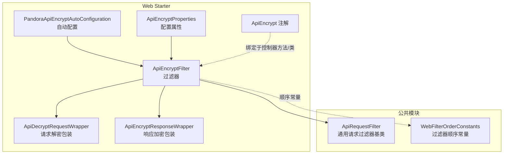
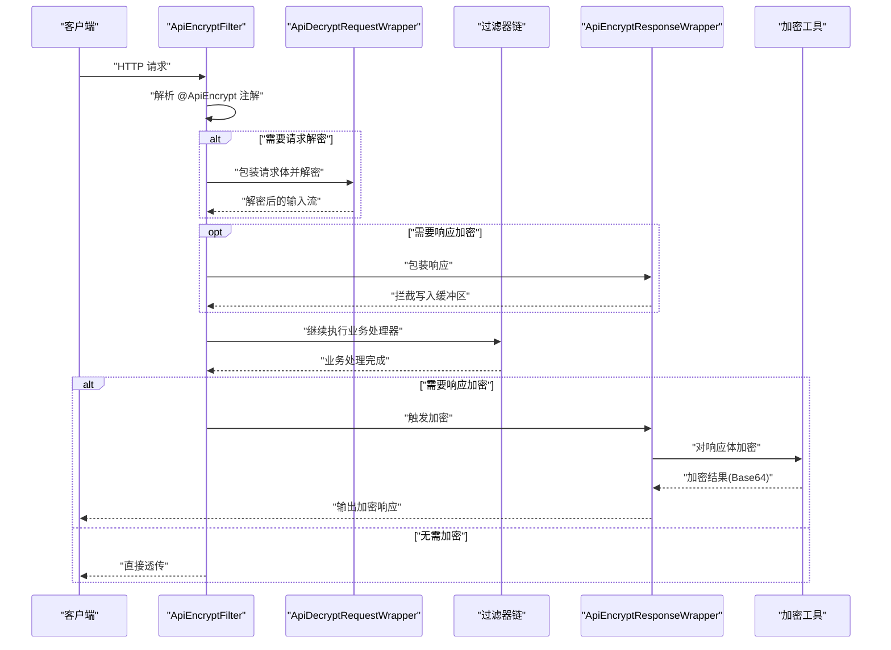
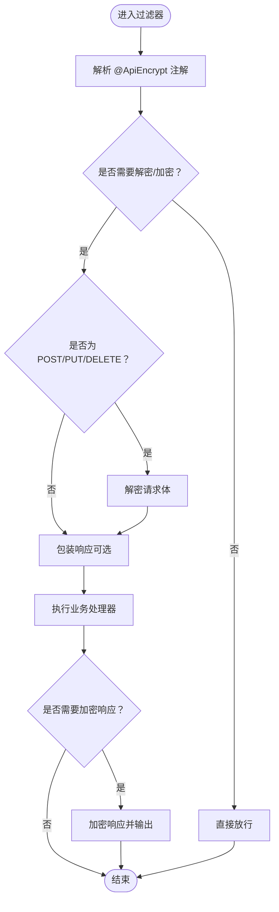
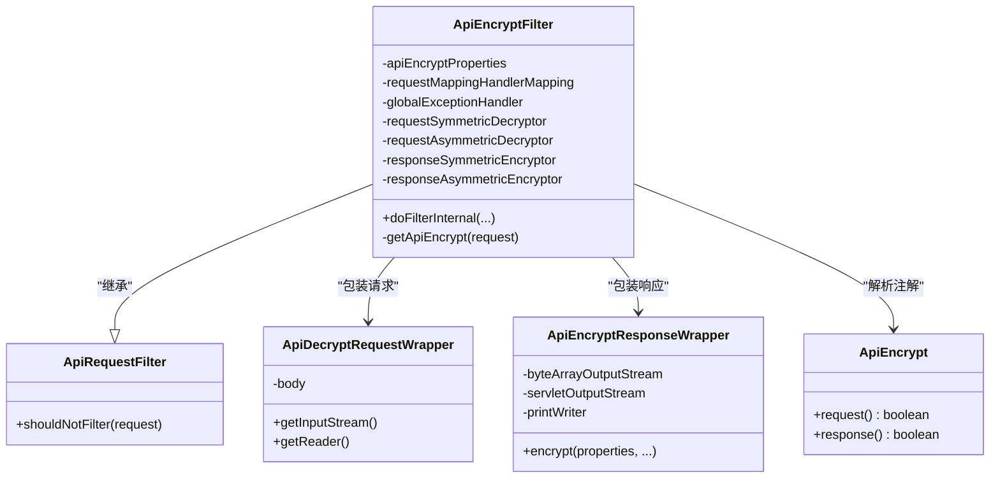
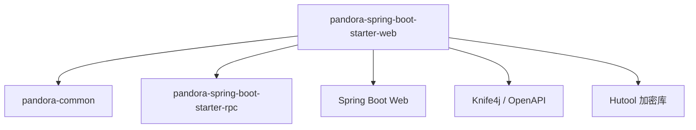

# API加密模块

<cite>
**本文引用的文件**
- [PandoraApiEncryptAutoConfiguration.java](file://pandora-framework/pandora-spring-boot-starter-web/src/main/java/net/ittimeline/pandora/framework/encrypt/config/PandoraApiEncryptAutoConfiguration.java)
- [ApiEncryptProperties.java](file://pandora-framework/pandora-spring-boot-starter-web/src/main/java/net/ittimeline/pandora/framework/encrypt/config/ApiEncryptProperties.java)
- [ApiEncrypt.java](file://pandora-framework/pandora-spring-boot-starter-web/src/main/java/net/ittimeline/pandora/framework/encrypt/core/annotation/ApiEncrypt.java)
- [ApiEncryptFilter.java](file://pandora-framework/pandora-spring-boot-starter-web/src/main/java/net/ittimeline/pandora/framework/encrypt/core/filter/ApiEncryptFilter.java)
- [ApiDecryptRequestWrapper.java](file://pandora-framework/pandora-spring-boot-starter-web/src/main/java/net/ittimeline/pandora/framework/encrypt/core/filter/ApiDecryptRequestWrapper.java)
- [ApiEncryptResponseWrapper.java](file://pandora-framework/pandora-spring-boot-starter-web/src/main/java/net/ittimeline/pandora/framework/encrypt/core/filter/ApiEncryptResponseWrapper.java)
- [ApiRequestFilter.java](file://pandora-framework/pandora-spring-boot-starter-web/src/main/java/net/ittimeline/pandora/framework/web/core/filter/ApiRequestFilter.java)
- [WebFilterOrderConstants.java](file://pandora-framework/pandora-common/src/main/java/net/ittimeline/pandora/framework/common/constants/WebFilterOrderConstants.java)
- [pandora-spring-boot-starter-web/pom.xml](file://pandora-framework/pandora-spring-boot-starter-web/pom.xml)
- [spring-configuration-metadata.json](file://pandora-framework/pandora-spring-boot-starter-web/src/main/resources/META-INF/spring-configuration-metadata.json)
</cite>

## 目录
1. [简介](#简介)
2. [项目结构](#项目结构)
3. [核心组件](#核心组件)
4. [架构总览](#架构总览)
5. [详细组件分析](#详细组件分析)
6. [依赖分析](#依赖分析)
7. [性能考虑](#性能考虑)
8. [故障排查指南](#故障排查指南)
9. [结论](#结论)
10. [附录](#附录)

## 简介
本文件系统性阐述 Pandora Cloud 框架中 API 加密模块的设计与实现，覆盖自动配置机制、加密属性配置、过滤器链路、注解使用以及对称/非对称算法选择与最佳实践。重点解析 ApiEncryptFilter 的工作原理（请求解密、响应加密、密钥管理）、ApiDecryptRequestWrapper 与 ApiEncryptResponseWrapper 的实现机制，并给出性能优化、密钥轮换与安全存储建议。

## 项目结构
API 加密模块位于 Web Starter 中，采用“自动配置 + 属性绑定 + 过滤器 + 包装器”的分层设计：
- 自动配置：基于条件属性启用，注册 ApiEncryptFilter 并设置优先级
- 属性配置：通过配置前缀绑定到 ApiEncryptProperties
- 过滤器链：继承通用请求过滤器，按约定顺序执行
- 包装器：请求体解密包装、响应体加密包装，确保内容可重复读取与输出

图表来源
- [PandoraApiEncryptAutoConfiguration.java:24-39](file://pandora-framework/pandora-spring-boot-starter-web/src/main/java/net/ittimeline/pandora/framework/encrypt/config/PandoraApiEncryptAutoConfiguration.java#L24-L39)
- [ApiEncryptProperties.java:16-72](file://pandora-framework/pandora-spring-boot-starter-web/src/main/java/net/ittimeline/pandora/framework/encrypt/config/ApiEncryptProperties.java#L16-L72)
- [ApiEncryptFilter.java:40-76](file://pandora-framework/pandora-spring-boot-starter-web/src/main/java/net/ittimeline/pandora/framework/encrypt/core/filter/ApiEncryptFilter.java#L40-L76)
- [ApiDecryptRequestWrapper.java:25-40](file://pandora-framework/pandora-spring-boot-starter-web/src/main/java/net/ittimeline/pandora/framework/encrypt/core/filter/ApiDecryptRequestWrapper.java#L25-L40)
- [ApiEncryptResponseWrapper.java:24-57](file://pandora-framework/pandora-spring-boot-starter-web/src/main/java/net/ittimeline/pandora/framework/encrypt/core/filter/ApiEncryptResponseWrapper.java#L24-L57)
- [ApiEncrypt.java:11-26](file://pandora-framework/pandora-spring-boot-starter-web/src/main/java/net/ittimeline/pandora/framework/encrypt/core/annotation/ApiEncrypt.java#L11-L26)
- [ApiRequestFilter.java:15-27](file://pandora-framework/pandora-spring-boot-starter-web/src/main/java/net/ittimeline/pandora/framework/web/core/filter/ApiRequestFilter.java#L15-L27)
- [WebFilterOrderConstants.java:11-38](file://pandora-framework/pandora-common/src/main/java/net/ittimeline/pandora/framework/common/constants/WebFilterOrderConstants.java#L11-L38)

章节来源
- [PandoraApiEncryptAutoConfiguration.java:24-39](file://pandora-framework/pandora-spring-boot-starter-web/src/main/java/net/ittimeline/pandora/framework/encrypt/config/PandoraApiEncryptAutoConfiguration.java#L24-L39)
- [ApiEncryptProperties.java:16-72](file://pandora-framework/pandora-spring-boot-starter-web/src/main/java/net/ittimeline/pandora/framework/encrypt/config/ApiEncryptProperties.java#L16-L72)
- [ApiEncryptFilter.java:40-76](file://pandora-framework/pandora-spring-boot-starter-web/src/main/java/net/ittimeline/pandora/framework/encrypt/core/filter/ApiEncryptFilter.java#L40-L76)
- [ApiEncrypt.java:11-26](file://pandora-framework/pandora-spring-boot-starter-web/src/main/java/net/ittimeline/pandora/framework/encrypt/core/annotation/ApiEncrypt.java#L11-L26)
- [ApiRequestFilter.java:15-27](file://pandora-framework/pandora-spring-boot-starter-web/src/main/java/net/ittimeline/pandora/framework/web/core/filter/ApiRequestFilter.java#L15-L27)
- [WebFilterOrderConstants.java:11-38](file://pandora-framework/pandora-common/src/main/java/net/ittimeline/pandora/framework/common/constants/WebFilterOrderConstants.java#L11-L38)

## 核心组件
- 自动配置类：根据开关属性注册 ApiEncryptFilter，设置过滤器顺序
- 配置属性类：定义开关、请求头标识、算法类型、请求/响应密钥
- 注解：在类或方法上声明是否启用请求解密与响应加密
- 过滤器：解析注解、判断是否需要解密/加密；必要时包装请求/响应
- 包装器：请求体解密包装器、响应体加密包装器

章节来源
- [PandoraApiEncryptAutoConfiguration.java:24-39](file://pandora-framework/pandora-spring-boot-starter-web/src/main/java/net/ittimeline/pandora/framework/encrypt/config/PandoraApiEncryptAutoConfiguration.java#L24-L39)
- [ApiEncryptProperties.java:16-72](file://pandora-framework/pandora-spring-boot-starter-web/src/main/java/net/ittimeline/pandora/framework/encrypt/config/ApiEncryptProperties.java#L16-L72)
- [ApiEncrypt.java:11-26](file://pandora-framework/pandora-spring-boot-starter-web/src/main/java/net/ittimeline/pandora/framework/encrypt/core/annotation/ApiEncrypt.java#L11-L26)
- [ApiEncryptFilter.java:40-158](file://pandora-framework/pandora-spring-boot-starter-web/src/main/java/net/ittimeline/pandora/framework/encrypt/core/filter/ApiEncryptFilter.java#L40-L158)
- [ApiDecryptRequestWrapper.java:25-89](file://pandora-framework/pandora-spring-boot-starter-web/src/main/java/net/ittimeline/pandora/framework/encrypt/core/filter/ApiDecryptRequestWrapper.java#L25-L89)
- [ApiEncryptResponseWrapper.java:24-112](file://pandora-framework/pandora-spring-boot-starter-web/src/main/java/net/ittimeline/pandora/framework/encrypt/core/filter/ApiEncryptResponseWrapper.java#L24-L112)

## 架构总览
下图展示从请求进入至响应返回的完整流程，包括注解解析、请求解密、业务处理、响应加密与输出。

图表来源
- [ApiEncryptFilter.java:78-121](file://pandora-framework/pandora-spring-boot-starter-web/src/main/java/net/ittimeline/pandora/framework/encrypt/core/filter/ApiEncryptFilter.java#L78-L121)
- [ApiDecryptRequestWrapper.java:29-40](file://pandora-framework/pandora-spring-boot-starter-web/src/main/java/net/ittimeline/pandora/framework/encrypt/core/filter/ApiDecryptRequestWrapper.java#L29-L40)
- [ApiEncryptResponseWrapper.java:37-57](file://pandora-framework/pandora-spring-boot-starter-web/src/main/java/net/ittimeline/pandora/framework/encrypt/core/filter/ApiEncryptResponseWrapper.java#L37-L57)

## 详细组件分析

### 自动配置与属性绑定
- 条件启用：当配置前缀 pandora.api-encrypt.enable=true 时，注册 ApiEncryptFilter
- 属性绑定：通过 @ConfigurationProperties(prefix = "pandora.api-encrypt") 绑定开关、请求头名、算法、请求/响应密钥
- 过滤器注册：使用 WebFilterOrderConstants.API_ENCRYPT_FILTER 保证执行顺序在请求体缓存之后、日志与 XSS 之前

章节来源
- [PandoraApiEncryptAutoConfiguration.java:24-39](file://pandora-framework/pandora-spring-boot-starter-web/src/main/java/net/ittimeline/pandora/framework/encrypt/config/PandoraApiEncryptAutoConfiguration.java#L24-L39)
- [ApiEncryptProperties.java:16-72](file://pandora-framework/pandora-spring-boot-starter-web/src/main/java/net/ittimeline/pandora/framework/encrypt/config/ApiEncryptProperties.java#L16-L72)
- [WebFilterOrderConstants.java:11-38](file://pandora-framework/pandora-common/src/main/java/net/ittimeline/pandora/framework/common/constants/WebFilterOrderConstants.java#L11-L38)
- [spring-configuration-metadata.json:39-70](file://pandora-framework/pandora-spring-boot-starter-web/src/main/resources/META-INF/spring-configuration-metadata.json#L39-L70)

### 注解 ApiEncrypt
- 作用范围：类或方法级别
- 参数：
  - request：是否对请求参数进行解密，默认 true
  - response：是否对响应结果进行加密，默认 true
- 解析逻辑：在 ApiEncryptFilter 中通过 RequestMappingHandlerMapping 获取当前处理器，优先方法注解，其次类注解

章节来源
- [ApiEncrypt.java:11-26](file://pandora-framework/pandora-spring-boot-starter-web/src/main/java/net/ittimeline/pandora/framework/encrypt/core/annotation/ApiEncrypt.java#L11-L26)
- [ApiEncryptFilter.java:128-155](file://pandora-framework/pandora-spring-boot-starter-web/src/main/java/net/ittimeline/pandora/framework/encrypt/core/filter/ApiEncryptFilter.java#L128-L155)

### ApiEncryptFilter 工作原理
- 算法与密钥初始化：
  - AES：使用对称解密器解密请求，对称加密器加密响应
  - RSA：使用私钥解密请求，公钥加密响应
  - 其他算法：抛出不支持异常（便于扩展 SM2/SM4）
- 注解与请求头判定：
  - 若注解明确关闭或请求头为空，则跳过加解密
  - 若注解开启但缺少加密头，抛出参数无效异常
- 请求解密：
  - 仅对 POST/PUT/DELETE 方法尝试解密
  - 将原始输入流读取为字节数组，调用对称/非对称解密器
- 响应加密：
  - 仅在 responseEnable 时包装响应
  - 在链路结束后，重置缓冲区、读取缓冲区内容、添加加密头、加密并输出

图表来源
- [ApiEncryptFilter.java:78-121](file://pandora-framework/pandora-spring-boot-starter-web/src/main/java/net/ittimeline/pandora/framework/encrypt/core/filter/ApiEncryptFilter.java#L78-L121)

章节来源
- [ApiEncryptFilter.java:40-76](file://pandora-framework/pandora-spring-boot-starter-web/src/main/java/net/ittimeline/pandora/framework/encrypt/core/filter/ApiEncryptFilter.java#L40-L76)
- [ApiEncryptFilter.java:78-121](file://pandora-framework/pandora-spring-boot-starter-web/src/main/java/net/ittimeline/pandora/framework/encrypt/core/filter/ApiEncryptFilter.java#L78-L121)
- [ApiEncryptFilter.java:128-155](file://pandora-framework/pandora-spring-boot-starter-web/src/main/java/net/ittimeline/pandora/framework/encrypt/core/filter/ApiEncryptFilter.java#L128-L155)

### ApiDecryptRequestWrapper 实现机制
- 读取原始输入流为字节数组
- 使用对称解密器或非对称私钥解密
- 提供新的 ServletInputStream 与 BufferedReader，确保后续参数解析可用

章节来源
- [ApiDecryptRequestWrapper.java:25-89](file://pandora-framework/pandora-spring-boot-starter-web/src/main/java/net/ittimeline/pandora/framework/encrypt/core/filter/ApiDecryptRequestWrapper.java#L25-L89)

### ApiEncryptResponseWrapper 实现机制
- 缓冲响应写入：重写 getOutputStream/getWriter，将内容写入内存缓冲区
- 加密输出：在链路结束后，清空缓冲区、读取字节、加密（Base64），设置响应头并输出
- 跨域暴露头：自动添加 Access-Control-Expose-Headers，确保前端可读取加密标识

章节来源
- [ApiEncryptResponseWrapper.java:24-112](file://pandora-framework/pandora-spring-boot-starter-web/src/main/java/net/ittimeline/pandora/framework/encrypt/core/filter/ApiEncryptResponseWrapper.java#L24-L112)

### 算法选择与配置
- 支持算法：
  - 对称：AES
  - 非对称：RSA
  - 扩展：SM2/SM4（需自行开发与依赖）
- 密钥语义：
  - 对称：请求/响应密钥均为“密钥”
  - 非对称：请求密钥为“私钥”，响应密钥为“公钥”
- 配置项：
  - pandora.api-encrypt.enable：开关
  - pandora.api-encrypt.header：请求/响应头名
  - pandora.api-encrypt.algorithm：算法类型
  - pandora.api-encrypt.request-key：请求解密密钥
  - pandora.api-encrypt.response-key：响应加密密钥

章节来源
- [ApiEncryptProperties.java:16-72](file://pandora-framework/pandora-spring-boot-starter-web/src/main/java/net/ittimeline/pandora/framework/encrypt/config/ApiEncryptProperties.java#L16-L72)
- [spring-configuration-metadata.json:39-70](file://pandora-framework/pandora-spring-boot-starter-web/src/main/resources/META-INF/spring-configuration-metadata.json#L39-L70)

### 类关系图

图表来源
- [ApiRequestFilter.java:15-27](file://pandora-framework/pandora-spring-boot-starter-web/src/main/java/net/ittimeline/pandora/framework/web/core/filter/ApiRequestFilter.java#L15-L27)
- [ApiEncryptFilter.java:40-158](file://pandora-framework/pandora-spring-boot-starter-web/src/main/java/net/ittimeline/pandora/framework/encrypt/core/filter/ApiEncryptFilter.java#L40-L158)
- [ApiDecryptRequestWrapper.java:25-89](file://pandora-framework/pandora-spring-boot-starter-web/src/main/java/net/ittimeline/pandora/framework/encrypt/core/filter/ApiDecryptRequestRequestWrapper.java#L25-L89)
- [ApiEncryptResponseWrapper.java:24-112](file://pandora-framework/pandora-spring-boot-starter-web/src/main/java/net/ittimeline/pandora/framework/encrypt/core/filter/ApiEncryptResponseWrapper.java#L24-L112)
- [ApiEncrypt.java:11-26](file://pandora-framework/pandora-spring-boot-starter-web/src/main/java/net/ittimeline/pandora/framework/encrypt/core/annotation/ApiEncrypt.java#L11-L26)

## 依赖分析
- 模块依赖：Web Starter 依赖 Common 与 RPC Starter，提供通用 Web 能力与异常处理
- 外部依赖：使用 Hutool 加密工具库（对称/非对称）
- 自动装配：通过 META-INF/spring 引入自动配置，Spring Boot 自动发现并加载

图表来源
- [pandora-spring-boot-starter-web/pom.xml:19-88](file://pandora-framework/pandora-spring-boot-starter-web/pom.xml#L19-L88)

章节来源
- [pandora-spring-boot-starter-web/pom.xml:19-88](file://pandora-framework/pandora-spring-boot-starter-web/pom.xml#L19-L88)

## 性能考虑
- 输入流一次性读取：请求解密包装器将输入流读取为字节数组，避免重复读取带来的 IO 开销
- 响应缓冲：响应包装器将输出写入内存缓冲，减少多次 IO 操作
- 算法选择：
  - 对称算法（如 AES）在吞吐量与延迟方面优于非对称算法（如 RSA）
  - 对于大体量数据，建议结合压缩与分片策略
- 过滤器顺序：确保在请求体缓存之后、日志与 XSS 之前执行，避免重复读取与重复处理

章节来源
- [ApiDecryptRequestWrapper.java:33-40](file://pandora-framework/pandora-spring-boot-starter-web/src/main/java/net/ittimeline/pandora/framework/encrypt/core/filter/ApiDecryptRequestWrapper.java#L33-L40)
- [ApiEncryptResponseWrapper.java:30-35](file://pandora-framework/pandora-spring-boot-starter-web/src/main/java/net/ittimeline/pandora/framework/encrypt/core/filter/ApiEncryptResponseWrapper.java#L30-L35)
- [WebFilterOrderConstants.java:11-38](file://pandora-framework/pandora-common/src/main/java/net/ittimeline/pandora/framework/common/constants/WebFilterOrderConstants.java#L11-L38)

## 故障排查指南
- 无法识别注解：
  - 检查请求路径是否已解析（内部已兼容 Spring Boot 2.x 的路径解析问题）
  - 确认控制器方法存在且可被 RequestMappingHandlerMapping 解析
- 参数无效异常：
  - 当注解开启但请求缺少加密头时，会抛出参数无效异常
  - 检查前端是否正确设置请求头与加密格式
- 不支持的算法：
  - 当算法不在支持列表时，构造函数抛出非法参数异常
  - 请确认算法名称大小写与配置一致
- 响应未加密：
  - 确认注解 response=true 或请求头存在
  - 检查跨域暴露头配置是否包含加密头名

章节来源
- [ApiEncryptFilter.java:128-155](file://pandora-framework/pandora-spring-boot-starter-web/src/main/java/net/ittimeline/pandora/framework/encrypt/core/filter/ApiEncryptFilter.java#L128-L155)
- [ApiEncryptFilter.java:95-106](file://pandora-framework/pandora-spring-boot-starter-web/src/main/java/net/ittimeline/pandora/framework/encrypt/core/filter/ApiEncryptFilter.java#L95-L106)
- [ApiEncryptFilter.java:72-75](file://pandora-framework/pandora-spring-boot-starter-web/src/main/java/net/ittimeline/pandora/framework/encrypt/core/filter/ApiEncryptFilter.java#L72-L75)
- [ApiEncryptResponseWrapper.java:47-51](file://pandora-framework/pandora-spring-boot-starter-web/src/main/java/net/ittimeline/pandora/framework/encrypt/core/filter/ApiEncryptResponseWrapper.java#L47-L51)

## 结论
API 加密模块通过自动配置与属性绑定实现开箱即用，借助注解灵活控制加解密范围。其核心在于请求解密包装与响应加密包装的协同，配合合理的算法与密钥管理策略，可在保障安全的同时兼顾性能与易用性。建议在生产环境中结合密钥轮换与安全存储方案，持续提升整体安全性。

## 附录

### 配置项一览
- pandora.api-encrypt.enable：是否启用 API 加密
- pandora.api-encrypt.header：请求/响应头名（默认 X-Api-Encrypt）
- pandora.api-encrypt.algorithm：算法类型（AES/RSA）
- pandora.api-encrypt.request-key：请求解密密钥（对称：密钥；非对称：私钥）
- pandora.api-encrypt.response-key：响应加密密钥（对称：密钥；非对称：公钥）

章节来源
- [ApiEncryptProperties.java:16-72](file://pandora-framework/pandora-spring-boot-starter-web/src/main/java/net/ittimeline/pandora/framework/encrypt/config/ApiEncryptProperties.java#L16-L72)
- [spring-configuration-metadata.json:39-70](file://pandora-framework/pandora-spring-boot-starter-web/src/main/resources/META-INF/spring-configuration-metadata.json#L39-L70)