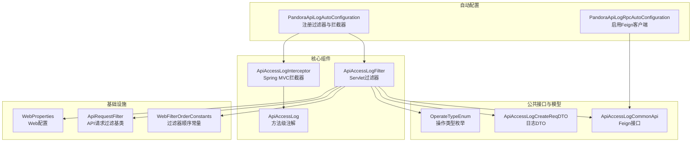
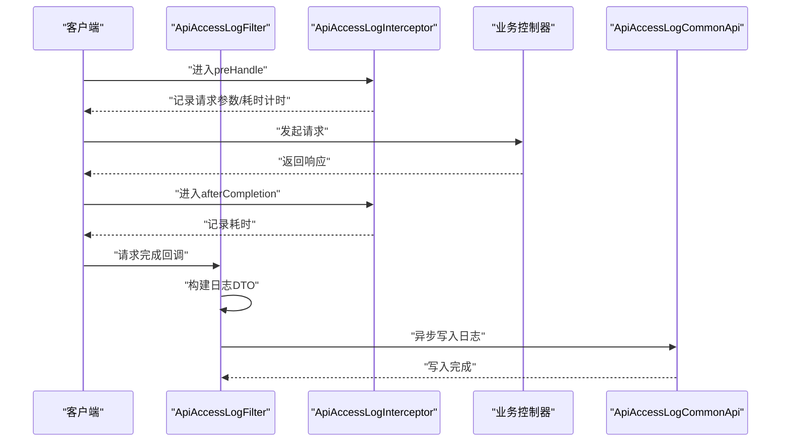
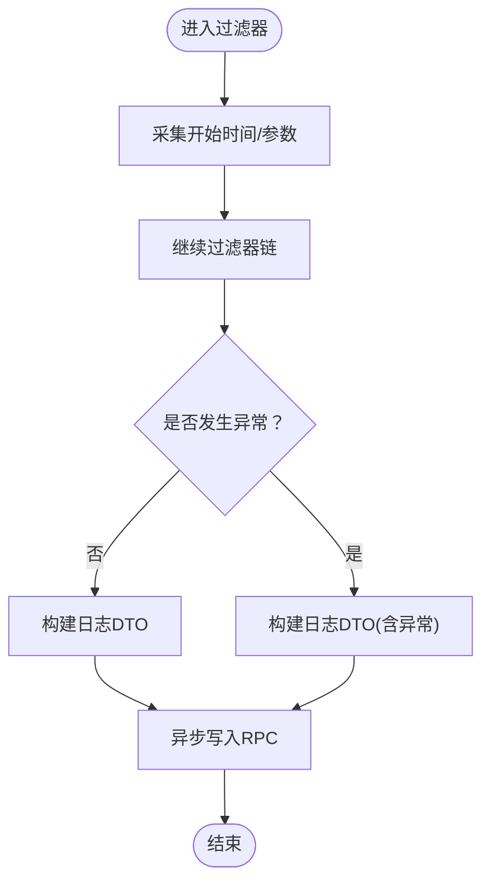
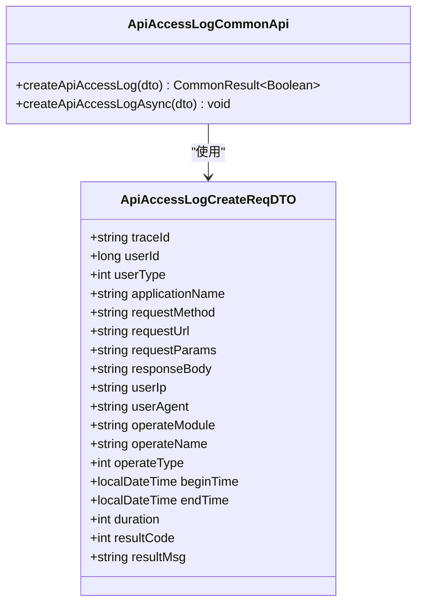
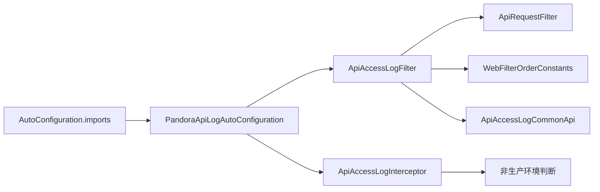

# API日志模块

<cite>
**本文引用的文件**
- [PandoraApiLogAutoConfiguration.java](file://pandora-framework/pandora-spring-boot-starter-web/src/main/java/net/ittimeline/pandora/framework/apilog/config/PandoraApiLogAutoConfiguration.java)
- [ApiAccessLogFilter.java](file://pandora-framework/pandora-spring-boot-starter-web/src/main/java/net/ittimeline/pandora/framework/apilog/core/filter/ApiAccessLogFilter.java)
- [ApiAccessLogInterceptor.java](file://pandora-framework/pandora-spring-boot-starter-web/src/main/java/net/ittimeline/pandora/framework/apilog/core/interceptor/ApiAccessLogInterceptor.java)
- [ApiAccessLog.java](file://pandora-framework/pandora-spring-boot-starter-web/src/main/java/net/ittimeline/pandora/framework/apilog/core/annotation/ApiAccessLog.java)
- [ApiAccessLogCommonApi.java](file://pandora-framework/pandora-common/src/main/java/net/ittimeline/pandora/framework/common/biz/infra/logger/ApiAccessLogCommonApi.java)
- [ApiAccessLogCreateReqDTO.java](file://pandora-framework/pandora-common/src/main/java/net/ittimeline/pandora/framework/common/biz/infra/logger/dto/ApiAccessLogCreateReqDTO.java)
- [OperateTypeEnum.java](file://pandora-framework/pandora-spring-boot-starter-web/src/main/java/net/ittimeline/pandora/framework/apilog/core/enums/OperateTypeEnum.java)
- [WebFilterOrderConstants.java](file://pandora-framework/pandora-common/src/main/java/net/ittimeline/pandora/framework/common/constants/WebFilterOrderConstants.java)
- [ApiRequestFilter.java](file://pandora-framework/pandora-spring-boot-starter-web/src/main/java/net/ittimeline/pandora/framework/web/core/filter/ApiRequestFilter.java)
- [WebProperties.java](file://pandora-framework/pandora-spring-boot-starter-web/src/main/java/net/ittimeline/pandora/framework/web/config/WebProperties.java)
- [org.springframework.boot.autoconfigure.AutoConfiguration.imports](file://pandora-framework/pandora-spring-boot-starter-web/src/main/resources/META-INF/spring/org.springframework.boot.autoconfigure.AutoConfiguration.imports)
- [PandoraApiLogRpcAutoConfiguration.java](file://pandora-framework/pandora-spring-boot-starter-web/src/main/java/net/ittimeline/pandora/framework/apilog/config/PandoraApiLogRpcAutoConfiguration.java)
</cite>

## 目录
1. [简介](#简介)
2. [项目结构](#项目结构)
3. [核心组件](#核心组件)
4. [架构总览](#架构总览)
5. [详细组件分析](#详细组件分析)
6. [依赖分析](#依赖分析)
7. [性能考量](#性能考量)
8. [故障排查指南](#故障排查指南)
9. [结论](#结论)
10. [附录](#附录)

## 简介
本文件系统性阐述Pandora Cloud框架的API日志模块，覆盖自动配置机制、过滤器与拦截器实现、注解使用、日志记录时机与数据采集策略、脱敏与异步写入等关键能力，并给出日志存储与查询的最佳实践建议。目标是帮助开发者快速理解并正确使用API访问日志能力，同时在生产环境中平衡性能与可观测性。

## 项目结构
API日志模块位于web启动器子模块中，采用“自动配置 + 核心组件 + DTO + 枚举”的分层组织方式；公共模块提供日志RPC接口与数据传输对象，确保跨服务调用的一致性。

图表来源
- [PandoraApiLogAutoConfiguration.java:24-50](file://pandora-framework/pandora-spring-boot-starter-web/src/main/java/net/ittimeline/pandora/framework/apilog/config/PandoraApiLogAutoConfiguration.java#L24-L50)
- [PandoraApiLogRpcAutoConfiguration.java:15-18](file://pandora-framework/pandora-spring-boot-starter-web/src/main/java/net/ittimeline/pandora/framework/apilog/config/PandoraApiLogRpcAutoConfiguration.java#L15-L18)
- [ApiAccessLogFilter.java:51-64](file://pandora-framework/pandora-spring-boot-starter-web/src/main/java/net/ittimeline/pandora/framework/apilog/core/filter/ApiAccessLogFilter.java#L51-L64)
- [ApiAccessLogInterceptor.java:31-32](file://pandora-framework/pandora-spring-boot-starter-web/src/main/java/net/ittimeline/pandora/framework/apilog/core/interceptor/ApiAccessLogInterceptor.java#L31-L32)
- [ApiAccessLog.java:16-64](file://pandora-framework/pandora-spring-boot-starter-web/src/main/java/net/ittimeline/pandora/framework/apilog/core/annotation/ApiAccessLog.java#L16-L64)
- [ApiAccessLogCommonApi.java:21-39](file://pandora-framework/pandora-common/src/main/java/net/ittimeline/pandora/framework/common/biz/infra/logger/ApiAccessLogCommonApi.java#L21-L39)
- [ApiAccessLogCreateReqDTO.java:15-105](file://pandora-framework/pandora-common/src/main/java/net/ittimeline/pandora/framework/common/biz/infra/logger/dto/ApiAccessLogCreateReqDTO.java#L15-L105)
- [OperateTypeEnum.java:13-52](file://pandora-framework/pandora-spring-boot-starter-web/src/main/java/net/ittimeline/pandora/framework/apilog/core/enums/OperateTypeEnum.java#L13-L52)
- [WebFilterOrderConstants.java:11-37](file://pandora-framework/pandora-common/src/main/java/net/ittimeline/pandora/framework/common/constants/WebFilterOrderConstants.java#L11-L37)
- [ApiRequestFilter.java:15-26](file://pandora-framework/pandora-spring-boot-starter-web/src/main/java/net/ittimeline/pandora/framework/web/core/filter/ApiRequestFilter.java#L15-L26)
- [WebProperties.java:18-67](file://pandora-framework/pandora-spring-boot-starter-web/src/main/java/net/ittimeline/pandora/framework/web/config/WebProperties.java#L18-L67)

章节来源
- [PandoraApiLogAutoConfiguration.java:24-50](file://pandora-framework/pandora-spring-boot-starter-web/src/main/java/net/ittimeline/pandora/framework/apilog/config/PandoraApiLogAutoConfiguration.java#L24-L50)
- [org.springframework.boot.autoconfigure.AutoConfiguration.imports:1-8](file://pandora-framework/pandora-spring-boot-starter-web/src/main/resources/META-INF/spring/org.springframework.boot.autoconfigure.AutoConfiguration.imports#L1-L8)

## 核心组件
- 自动配置类负责注册过滤器与拦截器，并通过条件属性控制开关。
- 过滤器负责在请求完成后构建日志并异步写入远程服务。
- 拦截器负责在非生产环境打印请求/响应阶段的日志，辅助开发调试。
- 注解提供方法级开关与参数控制，支持模块、名称与类型的标注。
- RPC接口与DTO定义了日志写入的契约与数据结构。

章节来源
- [PandoraApiLogAutoConfiguration.java:24-50](file://pandora-framework/pandora-spring-boot-starter-web/src/main/java/net/ittimeline/pandora/framework/apilog/config/PandoraApiLogAutoConfiguration.java#L24-L50)
- [ApiAccessLogFilter.java:51-64](file://pandora-framework/pandora-spring-boot-starter-web/src/main/java/net/ittimeline/pandora/framework/apilog/core/filter/ApiAccessLogFilter.java#L51-L64)
- [ApiAccessLogInterceptor.java:31-32](file://pandora-framework/pandora-spring-boot-starter-web/src/main/java/net/ittimeline/pandora/framework/apilog/core/interceptor/ApiAccessLogInterceptor.java#L31-L32)
- [ApiAccessLog.java:16-64](file://pandora-framework/pandora-spring-boot-starter-web/src/main/java/net/ittimeline/pandora/framework/apilog/core/annotation/ApiAccessLog.java#L16-L64)
- [ApiAccessLogCommonApi.java:21-39](file://pandora-framework/pandora-common/src/main/java/net/ittimeline/pandora/framework/common/biz/infra/logger/ApiAccessLogCommonApi.java#L21-L39)
- [ApiAccessLogCreateReqDTO.java:15-105](file://pandora-framework/pandora-common/src/main/java/net/ittimeline/pandora/framework/common/biz/infra/logger/dto/ApiAccessLogCreateReqDTO.java#L15-L105)

## 架构总览
API日志模块通过自动配置装配过滤器与拦截器，结合注解与RPC接口，形成“请求完成即记录”的闭环。过滤器在请求结束后收集必要字段并异步写入，拦截器在开发/测试环境输出更详细的本地日志。

图表来源
- [ApiAccessLogFilter.java:66-100](file://pandora-framework/pandora-spring-boot-starter-web/src/main/java/net/ittimeline/pandora/framework/apilog/core/filter/ApiAccessLogFilter.java#L66-L100)
- [ApiAccessLogInterceptor.java:38-75](file://pandora-framework/pandora-spring-boot-starter-web/src/main/java/net/ittimeline/pandora/framework/apilog/core/interceptor/ApiAccessLogInterceptor.java#L38-L75)
- [ApiAccessLogCommonApi.java:35-38](file://pandora-framework/pandora-common/src/main/java/net/ittimeline/pandora/framework/common/biz/infra/logger/ApiAccessLogCommonApi.java#L35-L38)

## 详细组件分析

### 自动配置机制
- 过滤器注册：基于条件属性pandora.access-log.enable，默认开启；通过FilterRegistrationBean设置优先级，确保在合适位置执行。
- 拦截器注册：通过WebMvcConfigurer添加，便于在非生产环境输出本地日志。
- RPC客户端：启用Feign客户端扫描，引入ApiAccessLogCommonApi以进行远程写入。

章节来源
- [PandoraApiLogAutoConfiguration.java:24-50](file://pandora-framework/pandora-spring-boot-starter-web/src/main/java/net/ittimeline/pandora/framework/apilog/config/PandoraApiLogAutoConfiguration.java#L24-L50)
- [PandoraApiLogRpcAutoConfiguration.java:15-18](file://pandora-framework/pandora-spring-boot-starter-web/src/main/java/net/ittimeline/pandora/framework/apilog/config/PandoraApiLogRpcAutoConfiguration.java#L15-L18)
- [WebFilterOrderConstants.java:24-28](file://pandora-framework/pandora-common/src/main/java/net/ittimeline/pandora/framework/common/constants/WebFilterOrderConstants.java#L24-L28)

### 过滤器实现（ApiAccessLogFilter）
- 记录时机：在请求完成后（无论成功或异常）触发，避免阻塞业务线程。
- 数据采集：
  - 用户信息：通过登录上下文获取用户ID与类型。
  - 结果状态：优先从响应封装对象中提取，异常时回退至全局错误码。
  - 请求字段：查询参数与请求体，按需脱敏。
  - 操作信息：从注解或Swagger注解解析模块、名称与类型。
  - 性能指标：开始/结束时间与耗时。
- 脱敏策略：内置敏感键集合，支持方法级自定义敏感键；仅对data字段进行脱敏，避免错误码与消息被误伤。
- 异步写入：通过@Async异步调用远程RPC接口，避免阻塞请求链路。

图表来源
- [ApiAccessLogFilter.java:66-100](file://pandora-framework/pandora-spring-boot-starter-web/src/main/java/net/ittimeline/pandora/framework/apilog/core/filter/ApiAccessLogFilter.java#L66-L100)
- [ApiAccessLogFilter.java:102-162](file://pandora-framework/pandora-spring-boot-starter-web/src/main/java/net/ittimeline/pandora/framework/apilog/core/filter/ApiAccessLogFilter.java#L102-L162)

章节来源
- [ApiAccessLogFilter.java:51-64](file://pandora-framework/pandora-spring-boot-starter-web/src/main/java/net/ittimeline/pandora/framework/apilog/core/filter/ApiAccessLogFilter.java#L51-L64)
- [ApiAccessLogFilter.java:102-162](file://pandora-framework/pandora-spring-boot-starter-web/src/main/java/net/ittimeline/pandora/framework/apilog/core/filter/ApiAccessLogFilter.java#L102-L162)
- [ApiAccessLogFilter.java:185-252](file://pandora-framework/pandora-spring-boot-starter-web/src/main/java/net/ittimeline/pandora/framework/apilog/core/filter/ApiAccessLogFilter.java#L185-L252)

### 拦截器实现（ApiAccessLogInterceptor）
- 记录时机：preHandle记录请求开始与参数，afterCompletion记录耗时。
- 输出策略：仅在非生产环境输出，避免生产日志噪声。
- 辅助信息：尝试定位Controller方法源码行号，便于定位业务实现。

章节来源
- [ApiAccessLogInterceptor.java:31-32](file://pandora-framework/pandora-spring-boot-starter-web/src/main/java/net/ittimeline/pandora/framework/apilog/core/interceptor/ApiAccessLogInterceptor.java#L31-L32)
- [ApiAccessLogInterceptor.java:38-75](file://pandora-framework/pandora-spring-boot-starter-web/src/main/java/net/ittimeline/pandora/framework/apilog/core/interceptor/ApiAccessLogInterceptor.java#L38-L75)
- [ApiAccessLogInterceptor.java:77-103](file://pandora-framework/pandora-spring-boot-starter-web/src/main/java/net/ittimeline/pandora/framework/apilog/core/interceptor/ApiAccessLogInterceptor.java#L77-L103)

### 注解使用（ApiAccessLog）
- 开关与参数控制：
  - enable：是否记录访问日志（默认true）。
  - requestEnable：是否记录请求参数（默认true）。
  - responseEnable：是否记录响应结果（默认false）。
  - sanitizeKeys：方法级敏感键数组。
- 模块与行为标注：
  - operateModule：操作模块（默认空，可从Swagger Tag推断）。
  - operateName：操作名称（默认空，可从Swagger Operation推断）。
  - operateType：操作类型（默认空，将根据HTTP方法推断）。

章节来源
- [ApiAccessLog.java:16-64](file://pandora-framework/pandora-spring-boot-starter-web/src/main/java/net/ittimeline/pandora/framework/apilog/core/annotation/ApiAccessLog.java#L16-L64)

### 数据模型与RPC接口
- DTO字段覆盖：traceId、用户信息、应用名、请求方法、URL、参数、响应、IP、UA、模块、名称、类型、开始/结束时间、耗时、结果码/消息等。
- RPC接口：提供同步与异步写入方法，异步方法内部调用同步方法并校验错误。

图表来源
- [ApiAccessLogCreateReqDTO.java:15-105](file://pandora-framework/pandora-common/src/main/java/net/ittimeline/pandora/framework/common/biz/infra/logger/dto/ApiAccessLogCreateReqDTO.java#L15-L105)
- [ApiAccessLogCommonApi.java:21-39](file://pandora-framework/pandora-common/src/main/java/net/ittimeline/pandora/framework/common/biz/infra/logger/ApiAccessLogCommonApi.java#L21-L39)

章节来源
- [ApiAccessLogCreateReqDTO.java:15-105](file://pandora-framework/pandora-common/src/main/java/net/ittimeline/pandora/framework/common/biz/infra/logger/dto/ApiAccessLogCreateReqDTO.java#L15-L105)
- [ApiAccessLogCommonApi.java:21-39](file://pandora-framework/pandora-common/src/main/java/net/ittimeline/pandora/framework/common/biz/infra/logger/ApiAccessLogCommonApi.java#L21-L39)

### 操作类型映射
- 依据HTTP方法映射为GET/CREATE/UPDATE/DELETE/OTHER，便于统一统计与分析。

章节来源
- [OperateTypeEnum.java:13-52](file://pandora-framework/pandora-spring-boot-starter-web/src/main/java/net/ittimeline/pandora/framework/apilog/core/enums/OperateTypeEnum.java#L13-L52)
- [ApiAccessLogFilter.java:166-183](file://pandora-framework/pandora-spring-boot-starter-web/src/main/java/net/ittimeline/pandora/framework/apilog/core/filter/ApiAccessLogFilter.java#L166-L183)

## 依赖分析
- 自动配置导入：通过Spring Boot自动配置导入文件声明，确保在Web自动配置之后加载API日志配置。
- 过滤器基类：ApiRequestFilter基于WebProperties限定API前缀，仅对/admin-api与/app-api等API路径生效。
- 过滤器顺序：通过WebFilterOrderConstants确保在RequestBodyCacheFilter之后、XSS过滤之前执行，避免参数被提前清理导致日志缺失。

图表来源
- [org.springframework.boot.autoconfigure.AutoConfiguration.imports:1-8](file://pandora-framework/pandora-spring-boot-starter-web/src/main/resources/META-INF/spring/org.springframework.boot.autoconfigure.AutoConfiguration.imports#L1-L8)
- [PandoraApiLogAutoConfiguration.java:24-50](file://pandora-framework/pandora-spring-boot-starter-web/src/main/java/net/ittimeline/pandora/framework/apilog/config/PandoraApiLogAutoConfiguration.java#L24-L50)
- [ApiRequestFilter.java:15-26](file://pandora-framework/pandora-spring-boot-starter-web/src/main/java/net/ittimeline/pandora/framework/web/core/filter/ApiRequestFilter.java#L15-L26)
- [WebFilterOrderConstants.java:24-28](file://pandora-framework/pandora-common/src/main/java/net/ittimeline/pandora/framework/common/constants/WebFilterOrderConstants.java#L24-L28)

章节来源
- [org.springframework.boot.autoconfigure.AutoConfiguration.imports:1-8](file://pandora-framework/pandora-spring-boot-starter-web/src/main/resources/META-INF/spring/org.springframework.boot.autoconfigure.AutoConfiguration.imports#L1-L8)
- [ApiRequestFilter.java:15-26](file://pandora-framework/pandora-spring-boot-starter-web/src/main/java/net/ittimeline/pandora/framework/web/core/filter/ApiRequestFilter.java#L15-L26)
- [WebFilterOrderConstants.java:24-28](file://pandora-framework/pandora-common/src/main/java/net/ittimeline/pandora/framework/common/constants/WebFilterOrderConstants.java#L24-L28)

## 性能考量
- 异步写入：通过@Async异步调用RPC接口，避免阻塞请求线程，降低对业务延迟的影响。
- 条件开关：可通过pandora.access-log.enable全局禁用，减少生产环境开销。
- 参数裁剪：默认记录请求参数，响应参数默认关闭；仅在必要时开启响应记录，避免大响应体带来的序列化与网络开销。
- 脱敏成本：脱敏逻辑对JSON进行遍历处理，建议在高并发场景谨慎开启响应脱敏，或仅对必要字段脱敏。
- 环境差异：拦截器仅在非生产环境输出日志，避免在生产环境产生额外I/O。

章节来源
- [PandoraApiLogAutoConfiguration.java:31-37](file://pandora-framework/pandora-spring-boot-starter-web/src/main/java/net/ittimeline/pandora/framework/apilog/config/PandoraApiLogAutoConfiguration.java#L31-L37)
- [ApiAccessLogFilter.java:132-142](file://pandora-framework/pandora-spring-boot-starter-web/src/main/java/net/ittimeline/pandora/framework/apilog/core/filter/ApiAccessLogFilter.java#L132-L142)
- [ApiAccessLogInterceptor.java:47-74](file://pandora-framework/pandora-spring-boot-starter-web/src/main/java/net/ittimeline/pandora/framework/apilog/core/interceptor/ApiAccessLogInterceptor.java#L47-L74)

## 故障排查指南
- 写入异常：过滤器在异步写入过程中捕获异常并记录错误日志，便于定位具体URL与日志内容。
- 参数缺失：若请求参数被XSS过滤器提前处理，过滤器会在进入链路前缓存参数，确保日志可采集。
- 生产环境无本地日志：拦截器仅在非生产环境输出，属正常行为。
- 操作类型不准确：若未显式设置operateType，将依据HTTP方法推断，必要时请显式标注。

章节来源
- [ApiAccessLogFilter.java:96-99](file://pandora-framework/pandora-spring-boot-starter-web/src/main/java/net/ittimeline/pandora/framework/apilog/core/filter/ApiAccessLogFilter.java#L96-L99)
- [ApiAccessLogInterceptor.java:47-74](file://pandora-framework/pandora-spring-boot-starter-web/src/main/java/net/ittimeline/pandora/framework/apilog/core/interceptor/ApiAccessLogInterceptor.java#L47-L74)
- [ApiAccessLogFilter.java:166-183](file://pandora-framework/pandora-spring-boot-starter-web/src/main/java/net/ittimeline/pandora/framework/apilog/core/filter/ApiAccessLogFilter.java#L166-L183)

## 结论
API日志模块通过自动配置、过滤器与拦截器的协同，实现了对API访问的可观测性增强。其设计兼顾性能与可维护性：异步写入降低对业务的影响，条件开关与参数裁剪满足不同环境需求，注解提供细粒度控制。配合脱敏与RPC接口，可在保障安全的前提下高效记录与查询日志。

## 附录

### 使用示例与最佳实践
- 全局开关：通过pandora.access-log.enable控制是否启用API访问日志。
- 方法级控制：在Controller方法上使用@ApiAccessLog注解，按需开启/关闭请求/响应记录与敏感键脱敏。
- 模块与名称：优先通过Swagger注解提供模块与名称，减少重复配置。
- 生产环境建议：
  - 关闭响应记录（responseEnable=false），避免大响应体带来的性能损耗。
  - 仅在必要时开启响应脱敏，优先对data字段处理。
  - 如需更高吞吐，可临时关闭API访问日志（enable=false）。
- 存储与查询建议：
  - 将日志写入集中式日志系统（如ELK/ClickHouse/OpenSearch），按traceId、applicationName、operateModule、时间范围检索。
  - 对高频接口可做聚合统计（如按URL、方法、类型分组），辅助性能监控与容量规划。

章节来源
- [ApiAccessLog.java:16-64](file://pandora-framework/pandora-spring-boot-starter-web/src/main/java/net/ittimeline/pandora/framework/apilog/core/annotation/ApiAccessLog.java#L16-L64)
- [ApiAccessLogCommonApi.java:35-38](file://pandora-framework/pandora-common/src/main/java/net/ittimeline/pandora/framework/common/biz/infra/logger/ApiAccessLogCommonApi.java#L35-L38)