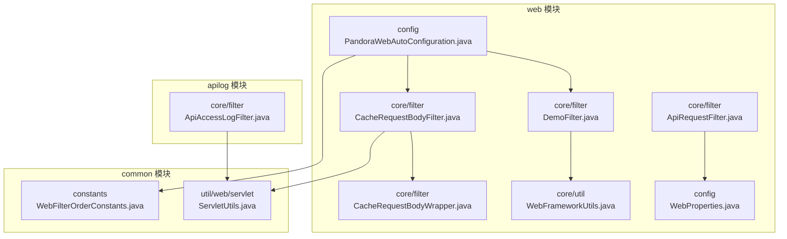
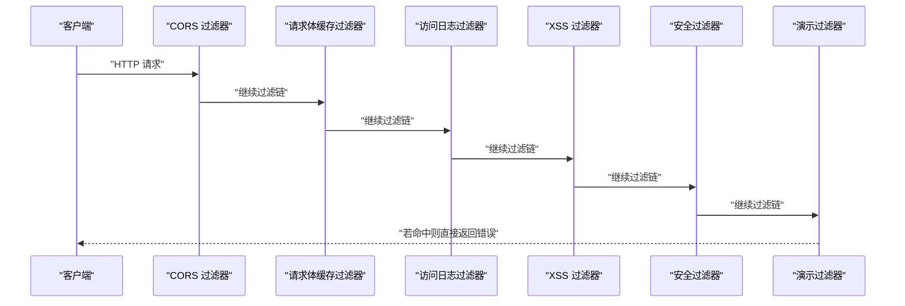
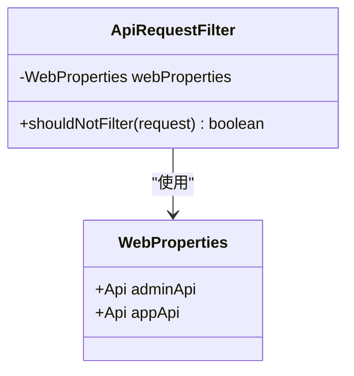
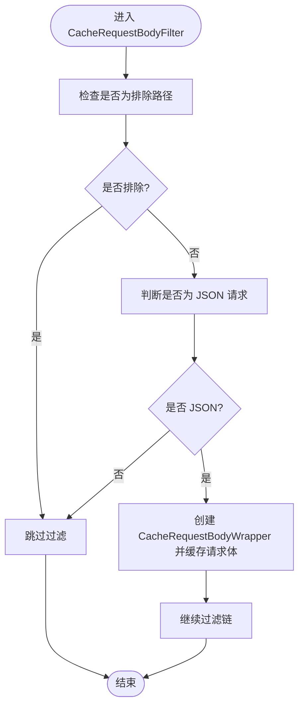
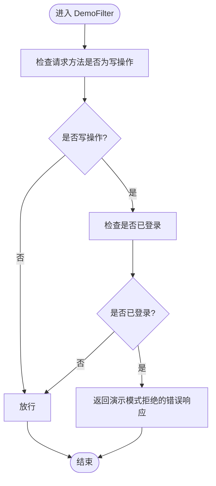
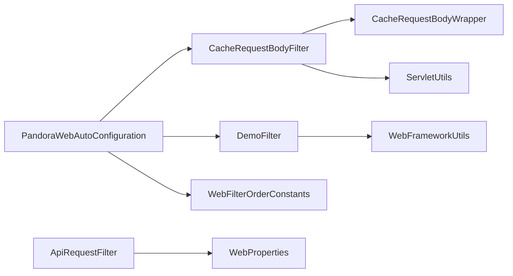

# API请求过滤

<cite>
**本文引用的文件**
- [ApiRequestFilter.java](file://pandora-framework/pandora-spring-boot-starter-web/src/main/java/net/ittimeline/pandora/framework/web/core/filter/ApiRequestFilter.java)
- [CacheRequestBodyFilter.java](file://pandora-framework/pandora-spring-boot-starter-web/src/main/java/net/ittimeline/pandora/framework/web/core/filter/CacheRequestBodyFilter.java)
- [CacheRequestBodyWrapper.java](file://pandora-framework/pandora-spring-boot-starter-web/src/main/java/net/ittimeline/pandora/framework/web/core/filter/CacheRequestBodyWrapper.java)
- [DemoFilter.java](file://pandora-framework/pandora-spring-boot-starter-web/src/main/java/net/ittimeline/pandora/framework/web/core/filter/DemoFilter.java)
- [WebFilterOrderConstants.java](file://pandora-framework/pandora-common/src/main/java/net/ittimeline/pandora/framework/common/constants/WebFilterOrderConstants.java)
- [WebProperties.java](file://pandora-framework/pandora-spring-boot-starter-web/src/main/java/net/ittimeline/pandora/framework/web/config/WebProperties.java)
- [PandoraWebAutoConfiguration.java](file://pandora-framework/pandora-spring-boot-starter-web/src/main/java/net/ittimeline/pandora/framework/web/config/PandoraWebAutoConfiguration.java)
- [ServletUtils.java](file://pandora-framework/pandora-common/src/main/java/net/ittimeline/pandora/framework/common/util/web/servlet/ServletUtils.java)
- [WebFrameworkUtils.java](file://pandora-framework/pandora-spring-boot-starter-web/src/main/java/net/ittimeline/pandora/framework/web/core/util/WebFrameworkUtils.java)
- [ApiAccessLogFilter.java](file://pandora-framework/pandora-spring-boot-starter-web/src/main/java/net/ittimeline/pandora/framework/apilog/core/filter/ApiAccessLogFilter.java)
</cite>

## 目录
1. [简介](#简介)
2. [项目结构](#项目结构)
3. [核心组件](#核心组件)
4. [架构总览](#架构总览)
5. [详细组件分析](#详细组件分析)
6. [依赖分析](#依赖分析)
7. [性能考虑](#性能考虑)
8. [故障排查指南](#故障排查指南)
9. [结论](#结论)
10. [附录](#附录)

## 简介
本文件系统性介绍 Pandora Cloud 框架中的 API 请求过滤能力，重点覆盖以下内容：
- ApiRequestFilter 抽象过滤器的设计与用途
- CacheRequestBodyFilter 请求体缓存机制与可重复读取能力
- DemoFilter 演示模式的启用与限制策略
- 过滤器执行顺序与优先级配置
- 过滤器链调试与性能优化建议
- 自定义过滤器的开发指南与最佳实践

## 项目结构
围绕 Web 过滤器的相关模块与文件组织如下：
- web 核心过滤器位于 web 模块的 core/filter 下
- 过滤器顺序常量位于 common 模块的 constants 下
- Web 配置与自动装配位于 web 模块的 config 下
- Servlet 工具与 Web 框架工具位于 common 与 web 模块 util 下
- 访问日志过滤器位于 apilog 模块，展示对请求体读取的依赖

图表来源
- [PandoraWebAutoConfiguration.java:134-146](file://pandora-framework/pandora-spring-boot-starter-web/src/main/java/net/ittimeline/pandora/framework/web/config/PandoraWebAutoConfiguration.java#L134-L146)
- [CacheRequestBodyFilter.java:20-48](file://pandora-framework/pandora-spring-boot-starter-web/src/main/java/net/ittimeline/pandora/framework/web/core/filter/CacheRequestBodyFilter.java#L20-L48)
- [CacheRequestBodyWrapper.java:20-80](file://pandora-framework/pandora-spring-boot-starter-web/src/main/java/net/ittimeline/pandora/framework/web/core/filter/CacheRequestBodyWrapper.java#L20-L80)
- [DemoFilter.java:21-36](file://pandora-framework/pandora-spring-boot-starter-web/src/main/java/net/ittimeline/pandora/framework/web/core/filter/DemoFilter.java#L21-L36)
- [WebFilterOrderConstants.java:11-37](file://pandora-framework/pandora-common/src/main/java/net/ittimeline/pandora/framework/common/constants/WebFilterOrderConstants.java#L11-L37)
- [ServletUtils.java:22-105](file://pandora-framework/pandora-common/src/main/java/net/ittimeline/pandora/framework/common/util/web/servlet/ServletUtils.java#L22-L105)
- [WebFrameworkUtils.java:22-182](file://pandora-framework/pandora-spring-boot-starter-web/src/main/java/net/ittimeline/pandora/framework/web/core/util/WebFrameworkUtils.java#L22-L182)
- [WebProperties.java:21-68](file://pandora-framework/pandora-spring-boot-starter-web/src/main/java/net/ittimeline/pandora/framework/web/config/WebProperties.java#L21-L68)
- [ApiAccessLogFilter.java:66-86](file://pandora-framework/pandora-spring-boot-starter-web/src/main/java/net/ittimeline/pandora/framework/apilog/core/filter/ApiAccessLogFilter.java#L66-L86)

章节来源
- [PandoraWebAutoConfiguration.java:111-177](file://pandora-framework/pandora-spring-boot-starter-web/src/main/java/net/ittimeline/pandora/framework/web/config/PandoraWebAutoConfiguration.java#L111-L177)
- [WebFilterOrderConstants.java:11-37](file://pandora-framework/pandora-common/src/main/java/net/ittimeline/pandora/framework/common/constants/WebFilterOrderConstants.java#L11-L37)

## 核心组件
- ApiRequestFilter：抽象基类，限定只对 /admin-api、/app-api 等特定前缀的 API 请求生效，便于派生出按业务域过滤的通用逻辑。
- CacheRequestBodyFilter：可重复读取请求体的过滤器，仅对 JSON 请求生效，并排除特定管理端路径，确保后续中间件可多次读取请求体。
- CacheRequestBodyWrapper：包装原始请求，将请求体缓存至内存，提供可重复读取的输入流与字符流。
- DemoFilter：演示模式过滤器，对未登录或写操作请求直接拦截并返回错误响应，避免测试环境被误操作破坏数据。
- WebFilterOrderConstants：集中定义各过滤器的执行顺序，确保关键过滤器（如请求体缓存、访问日志、XSS 等）按预期顺序执行。
- WebProperties：Web 层配置项，包含 API 前缀与控制器包匹配规则，驱动 ApiRequestFilter 的匹配逻辑。
- ServletUtils：提供 JSON 判定、请求体读取、JSON 输出等通用 Servlet 工具方法。
- WebFrameworkUtils：提供登录用户信息、终端类型、RPC 判定等 Web 框架工具方法。

章节来源
- [ApiRequestFilter.java:9-27](file://pandora-framework/pandora-spring-boot-starter-web/src/main/java/net/ittimeline/pandora/framework/web/core/filter/ApiRequestFilter.java#L9-L27)
- [CacheRequestBodyFilter.java:13-48](file://pandora-framework/pandora-spring-boot-starter-web/src/main/java/net/ittimeline/pandora/framework/web/core/filter/CacheRequestBodyFilter.java#L13-L48)
- [CacheRequestBodyWrapper.java:13-80](file://pandora-framework/pandora-spring-boot-starter-web/src/main/java/net/ittimeline/pandora/framework/web/core/filter/CacheRequestBodyWrapper.java#L13-L80)
- [DemoFilter.java:14-36](file://pandora-framework/pandora-spring-boot-starter-web/src/main/java/net/ittimeline/pandora/framework/web/core/filter/DemoFilter.java#L14-L36)
- [WebFilterOrderConstants.java:11-37](file://pandora-framework/pandora-common/src/main/java/net/ittimeline/pandora/framework/common/constants/WebFilterOrderConstants.java#L11-L37)
- [WebProperties.java:21-68](file://pandora-framework/pandora-spring-boot-starter-web/src/main/java/net/ittimeline/pandora/framework/web/config/WebProperties.java#L21-L68)
- [ServletUtils.java:73-91](file://pandora-framework/pandora-common/src/main/java/net/ittimeline/pandora/framework/common/util/web/servlet/ServletUtils.java#L73-L91)
- [WebFrameworkUtils.java:89-120](file://pandora-framework/pandora-spring-boot-starter-web/src/main/java/net/ittimeline/pandora/framework/web/core/util/WebFrameworkUtils.java#L89-L120)

## 架构总览
下图展示了请求进入容器后的典型过滤链路，以及各过滤器的职责与顺序关系：

图表来源
- [PandoraWebAutoConfiguration.java:116-146](file://pandora-framework/pandora-spring-boot-starter-web/src/main/java/net/ittimeline/pandora/framework/web/config/PandoraWebAutoConfiguration.java#L116-L146)
- [WebFilterOrderConstants.java:11-37](file://pandora-framework/pandora-common/src/main/java/net/ittimeline/pandora/framework/common/constants/WebFilterOrderConstants.java#L11-L37)

## 详细组件分析

### ApiRequestFilter 分析
- 设计目的：作为所有面向 /admin-api、/app-api 的过滤器基类，统一限定过滤范围，避免对静态资源或其他非 API 路径生效。
- 关键点：
  - 使用 WebProperties 获取前缀，结合请求 URI 判定是否应过滤。
  - 继承 OncePerRequestFilter，确保一次请求只执行一次。
- 使用场景：派生出鉴权、埋点、审计等针对管理端或会员端的过滤器。

图表来源
- [ApiRequestFilter.java:15-27](file://pandora-framework/pandora-spring-boot-starter-web/src/main/java/net/ittimeline/pandora/framework/web/core/filter/ApiRequestFilter.java#L15-L27)
- [WebProperties.java:21-68](file://pandora-framework/pandora-spring-boot-starter-web/src/main/java/net/ittimeline/pandora/framework/web/config/WebProperties.java#L21-L68)

章节来源
- [ApiRequestFilter.java:9-27](file://pandora-framework/pandora-spring-boot-starter-web/src/main/java/net/ittimeline/pandora/framework/web/core/filter/ApiRequestFilter.java#L9-L27)
- [WebProperties.java:21-68](file://pandora-framework/pandora-spring-boot-starter-web/src/main/java/net/ittimeline/pandora/framework/web/config/WebProperties.java#L21-L68)

### CacheRequestBodyFilter 与 CacheRequestBodyWrapper 分析
- 设计目标：实现请求体的“一次性读取”到“可重复读取”的转换，满足多处中间件（如日志、XSS、加解密、权限校验）对请求体的多次读取需求。
- 关键点：
  - 仅对 JSON 请求生效；对 /admin/、/actuator/ 等管理端路径排除，避免干扰健康检查与监控。
  - 将原始请求体字节缓存到内存，通过包装器提供 ServletInputStream 与 BufferedReader。
  - 依赖 ServletUtils 读取原始请求体字节。
- 性能与限制：
  - 内存占用与请求体大小线性相关，需关注大请求体带来的内存压力。
  - 仅适用于 JSON 请求，其他类型请求不会被缓存。

图表来源
- [CacheRequestBodyFilter.java:30-48](file://pandora-framework/pandora-spring-boot-starter-web/src/main/java/net/ittimeline/pandora/framework/web/core/filter/CacheRequestBodyFilter.java#L30-L48)
- [CacheRequestBodyWrapper.java:20-80](file://pandora-framework/pandora-spring-boot-starter-web/src/main/java/net/ittimeline/pandora/framework/web/core/filter/CacheRequestBodyWrapper.java#L20-L80)
- [ServletUtils.java:73-91](file://pandora-framework/pandora-common/src/main/java/net/ittimeline/pandora/framework/common/util/web/servlet/ServletUtils.java#L73-L91)

章节来源
- [CacheRequestBodyFilter.java:13-48](file://pandora-framework/pandora-spring-boot-starter-web/src/main/java/net/ittimeline/pandora/framework/web/core/filter/CacheRequestBodyFilter.java#L13-L48)
- [CacheRequestBodyWrapper.java:13-80](file://pandora-framework/pandora-spring-boot-starter-web/src/main/java/net/ittimeline/pandora/framework/web/core/filter/CacheRequestBodyWrapper.java#L13-L80)
- [ServletUtils.java:73-91](file://pandora-framework/pandora-common/src/main/java/net/ittimeline/pandora/framework/common/util/web/servlet/ServletUtils.java#L73-L91)

### DemoFilter 分析
- 设计目标：演示模式下禁止未登录用户的写操作（POST/PUT/DELETE），避免测试数据被误改。
- 关键点：
  - 仅对写操作且已登录用户生效；否则放行。
  - 命中时直接输出统一错误响应，不再继续过滤链。
- 启用方式：通过配置开关 pandora.demo=true 动态启用。

图表来源
- [DemoFilter.java:21-36](file://pandora-framework/pandora-spring-boot-starter-web/src/main/java/net/ittimeline/pandora/framework/web/core/filter/DemoFilter.java#L21-L36)
- [WebFrameworkUtils.java:89-94](file://pandora-framework/pandora-spring-boot-starter-web/src/main/java/net/ittimeline/pandora/framework/web/core/util/WebFrameworkUtils.java#L89-L94)

章节来源
- [DemoFilter.java:14-36](file://pandora-framework/pandora-spring-boot-starter-web/src/main/java/net/ittimeline/pandora/framework/web/core/filter/DemoFilter.java#L14-L36)
- [WebFrameworkUtils.java:89-94](file://pandora-framework/pandora-spring-boot-starter-web/src/main/java/net/ittimeline/pandora/framework/web/core/util/WebFrameworkUtils.java#L89-L94)
- [PandoraWebAutoConfiguration.java:142-146](file://pandora-framework/pandora-spring-boot-starter-web/src/main/java/net/ittimeline/pandora/framework/web/config/PandoraWebAutoConfiguration.java#L142-L146)

### 访问日志过滤器与请求体读取
- 访问日志过滤器在执行前后均尝试读取查询参数与请求体，以便完整记录。
- 对于非 JSON 请求，请求体读取会被忽略；对于 JSON 请求，会调用 ServletUtils 读取请求体字符串。
- 该行为与 CacheRequestBodyFilter 的作用相辅相成：前者在日志阶段读取，后者在更早阶段完成缓存，使后续中间件也可读取。

章节来源
- [ApiAccessLogFilter.java:66-86](file://pandora-framework/pandora-spring-boot-starter-web/src/main/java/net/ittimeline/pandora/framework/apilog/core/filter/ApiAccessLogFilter.java#L66-L86)
- [ServletUtils.java:77-83](file://pandora-framework/pandora-common/src/main/java/net/ittimeline/pandora/framework/common/util/web/servlet/ServletUtils.java#L77-L83)

## 依赖分析
- 过滤器注册与顺序：
  - 自动配置类负责注册 CORS、请求体缓存、演示等过滤器，并通过 WebFilterOrderConstants 指定顺序。
  - 请求体缓存过滤器必须在访问日志与 XSS 过滤器之前，以确保这些中间件能读取到请求体。
  - 演示过滤器顺序靠后，确保在其他业务过滤器之后再做演示模式拦截。
- 组件耦合：
  - CacheRequestBodyFilter 依赖 ServletUtils 进行 JSON 判定与请求体读取。
  - DemoFilter 依赖 WebFrameworkUtils 获取登录用户信息。
  - ApiRequestFilter 依赖 WebProperties 进行 API 前缀匹配。

图表来源
- [PandoraWebAutoConfiguration.java:116-146](file://pandora-framework/pandora-spring-boot-starter-web/src/main/java/net/ittimeline/pandora/framework/web/config/PandoraWebAutoConfiguration.java#L116-L146)
- [CacheRequestBodyFilter.java:30-34](file://pandora-framework/pandora-spring-boot-starter-web/src/main/java/net/ittimeline/pandora/framework/web/core/filter/CacheRequestBodyFilter.java#L30-L34)
- [CacheRequestBodyWrapper.java:20-30](file://pandora-framework/pandora-spring-boot-starter-web/src/main/java/net/ittimeline/pandora/framework/web/core/filter/CacheRequestBodyWrapper.java#L20-L30)
- [ServletUtils.java:73-91](file://pandora-framework/pandora-common/src/main/java/net/ittimeline/pandora/framework/common/util/web/servlet/ServletUtils.java#L73-L91)
- [DemoFilter.java:21-36](file://pandora-framework/pandora-spring-boot-starter-web/src/main/java/net/ittimeline/pandora/framework/web/core/filter/DemoFilter.java#L21-L36)
- [WebFrameworkUtils.java:89-94](file://pandora-framework/pandora-spring-boot-starter-web/src/main/java/net/ittimeline/pandora/framework/web/core/util/WebFrameworkUtils.java#L89-L94)
- [ApiRequestFilter.java:20-25](file://pandora-framework/pandora-spring-boot-starter-web/src/main/java/net/ittimeline/pandora/framework/web/core/filter/ApiRequestFilter.java#L20-L25)
- [WebProperties.java:21-68](file://pandora-framework/pandora-spring-boot-starter-web/src/main/java/net/ittimeline/pandora/framework/web/config/WebProperties.java#L21-L68)

章节来源
- [PandoraWebAutoConfiguration.java:116-146](file://pandora-framework/pandora-spring-boot-starter-web/src/main/java/net/ittimeline/pandora/framework/web/config/PandoraWebAutoConfiguration.java#L116-L146)
- [WebFilterOrderConstants.java:11-37](file://pandora-framework/pandora-common/src/main/java/net/ittimeline/pandora/framework/common/constants/WebFilterOrderConstants.java#L11-L37)

## 性能考虑
- 请求体缓存内存占用：CacheRequestBodyWrapper 将整个请求体字节数组缓存至内存，大请求体可能导致内存压力增大。建议：
  - 控制请求体大小上限，必要时在网关或反向代理层限制。
  - 对非关键路径避免启用请求体缓存，或仅对必要接口启用。
- JSON 限定：仅对 JSON 请求启用缓存，减少不必要的内存复制。
- 过滤器顺序：将请求体缓存置于访问日志与 XSS 之前，避免重复读取带来的额外开销。
- 演示模式：仅在测试环境开启 pandora.demo=true，避免生产环境不必要的拦截逻辑。

## 故障排查指南
- 请求体为空或读取失败：
  - 确认请求是否为 JSON 类型，非 JSON 请求不会被缓存。
  - 检查是否命中排除路径（/admin/、/actuator/），这些路径不会被缓存。
  - 确认过滤器顺序是否正确，若缓存过滤器未在日志/XSS 之前执行，会导致读取不到请求体。
- 演示模式误拦截：
  - 确认是否为写操作且已登录用户，DemoFilter 仅对未登录用户的写操作拦截。
  - 检查配置开关 pandora.demo 是否被意外开启。
- 日志记录不完整：
  - 访问日志过滤器仅在 JSON 请求时读取请求体，请确认请求类型与读取逻辑。

章节来源
- [CacheRequestBodyFilter.java:36-46](file://pandora-framework/pandora-spring-boot-starter-web/src/main/java/net/ittimeline/pandora/framework/web/core/filter/CacheRequestBodyFilter.java#L36-L46)
- [ServletUtils.java:73-83](file://pandora-framework/pandora-common/src/main/java/net/ittimeline/pandora/framework/common/util/web/servlet/ServletUtils.java#L73-L83)
- [PandoraWebAutoConfiguration.java:142-146](file://pandora-framework/pandora-spring-boot-starter-web/src/main/java/net/ittimeline/pandora/framework/web/config/PandoraWebAutoConfiguration.java#L142-L146)

## 结论
Pandora Cloud 的 API 请求过滤体系通过明确的过滤器职责划分与严格的顺序控制，实现了：
- 面向 API 域的精准过滤（ApiRequestFilter）
- 请求体可重复读取（CacheRequestBodyFilter + CacheRequestBodyWrapper）
- 测试环境的安全保护（DemoFilter）
- 易扩展的过滤器链与可配置的优先级（WebFilterOrderConstants）

在实际使用中，建议结合业务场景合理启用与调整过滤器，关注请求体缓存的内存与性能影响，并通过配置开关灵活控制演示模式。

## 附录

### 过滤器执行顺序与优先级
- CORS 过滤器：最先执行，确保跨域配置生效
- 请求体缓存过滤器：在访问日志与 XSS 之前，保证后续中间件可读取请求体
- 访问日志过滤器：在请求体缓存之后，记录请求与响应
- XSS 过滤器：在请求体缓存之后，对请求体进行清洗
- 安全过滤器：默认顺序靠前，保障安全策略
- 演示过滤器：最后执行，避免影响其他中间件逻辑

章节来源
- [WebFilterOrderConstants.java:11-37](file://pandora-framework/pandora-common/src/main/java/net/ittimeline/pandora/framework/common/constants/WebFilterOrderConstants.java#L11-L37)
- [PandoraWebAutoConfiguration.java:116-146](file://pandora-framework/pandora-spring-boot-starter-web/src/main/java/net/ittimeline/pandora/framework/web/config/PandoraWebAutoConfiguration.java#L116-L146)

### 演示模式启用与配置
- 开启方式：通过配置开关 pandora.demo=true 启用演示过滤器
- 生效范围：仅对未登录用户的写操作（POST/PUT/DELETE）生效
- 建议：仅在测试环境启用，避免影响生产环境

章节来源
- [PandoraWebAutoConfiguration.java:142-146](file://pandora-framework/pandora-spring-boot-starter-web/src/main/java/net/ittimeline/pandora/framework/web/config/PandoraWebAutoConfiguration.java#L142-L146)
- [DemoFilter.java:21-36](file://pandora-framework/pandora-spring-boot-starter-web/src/main/java/net/ittimeline/pandora/framework/web/core/filter/DemoFilter.java#L21-L36)

### 自定义过滤器开发指南与最佳实践
- 继承 OncePerRequestFilter，确保一次请求只执行一次
- 明确 shouldNotFilter 的判定条件，避免对无关路径生效
- 若需要读取请求体，优先在请求体缓存过滤器之后，或自行实现缓存包装
- 使用 WebFilterOrderConstants 指定合适的执行顺序，避免与其他中间件冲突
- 通过条件注解（如 ConditionalOnProperty）提供可选启用能力
- 在测试环境提供演示模式开关，保障测试数据安全

章节来源
- [PandoraWebAutoConfiguration.java:148-152](file://pandora-framework/pandora-spring-boot-starter-web/src/main/java/net/ittimeline/pandora/framework/web/config/PandoraWebAutoConfiguration.java#L148-L152)
- [WebFilterOrderConstants.java:11-37](file://pandora-framework/pandora-common/src/main/java/net/ittimeline/pandora/framework/common/constants/WebFilterOrderConstants.java#L11-L37)