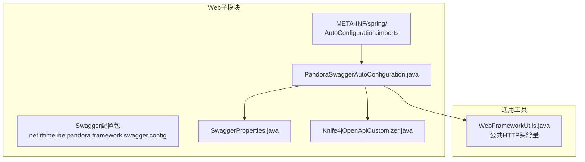
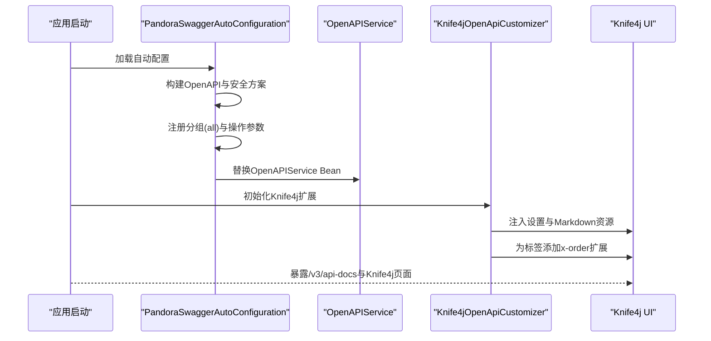
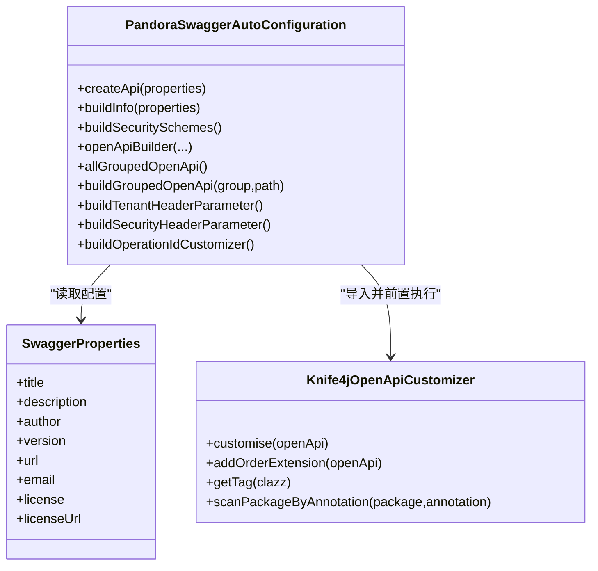
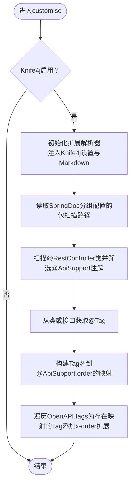
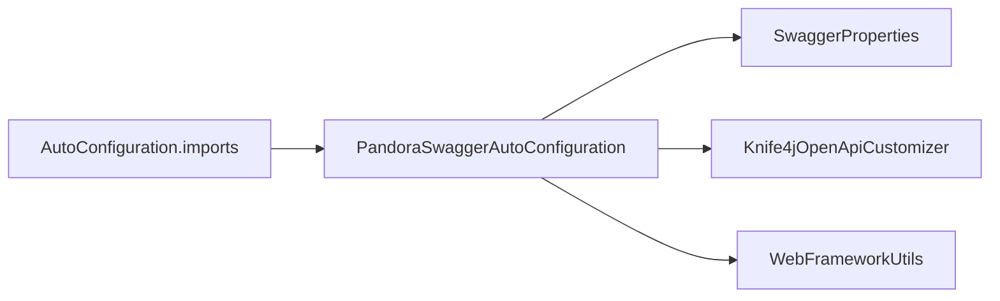

# Swagger文档集成

<cite>
**本文引用的文件**
- [PandoraSwaggerAutoConfiguration.java](file://pandora-framework/pandora-spring-boot-starter-web/src/main/java/net/ittimeline/pandora/framework/swagger/config/PandoraSwaggerAutoConfiguration.java)
- [SwaggerProperties.java](file://pandora-framework/pandora-spring-boot-starter-web/src/main/java/net/ittimeline/pandora/framework/swagger/config/SwaggerProperties.java)
- [Knife4jOpenApiCustomizer.java](file://pandora-framework/pandora-spring-boot-starter-web/src/main/java/net/ittimeline/pandora/framework/swagger/config/Knife4jOpenApiCustomizer.java)
- [org.springframework.boot.autoconfigure.AutoConfiguration.imports](file://pandora-framework/pandora-spring-boot-starter-web/src/main/resources/META-INF/spring/org.springframework.boot.autoconfigure.AutoConfiguration.imports)
- [WebFrameworkUtils.java](file://pandora-framework/pandora-spring-boot-starter-web/src/main/java/net/ittimeline/pandora/framework/web/core/util/WebFrameworkUtils.java)
</cite>

## 目录
1. [简介](#简介)
2. [项目结构](#项目结构)
3. [核心组件](#核心组件)
4. [架构总览](#架构总览)
5. [详细组件分析](#详细组件分析)
6. [依赖关系分析](#依赖关系分析)
7. [性能与可用性考虑](#性能与可用性考虑)
8. [故障排查指南](#故障排查指南)
9. [结论](#结论)
10. [附录](#附录)

## 简介
本文件面向Pandora Cloud框架的Swagger/OpenAPI文档集成功能，系统性阐述以下内容：
- Swagger的自动配置机制与Knife4j的集成实现
- SwaggerProperties配置属性的来源与作用
- Knife4jOpenApiCustomizer的定制化能力与扩展点
- 如何通过配置生成美观的API文档界面（标题、描述、版本等）
- API注解使用指南与文档生成最佳实践
- 多环境配置、安全认证、分组管理等高级功能的实现方法

## 项目结构
Swagger相关能力位于web子模块的swagger配置包内，并通过Spring Boot自动装配机制加载。关键文件如下：
- 自动配置类：负责构建OpenAPI、安全方案、分组与全局参数注入
- 配置属性类：承载pandora.swagger.*配置项
- Knife4j扩展定制器：增强Knife4j的UI体验与标签排序
- 自动装配导入清单：声明启用Swagger自动配置

**图示来源**
- [PandoraSwaggerAutoConfiguration.java:1-190](file://pandora-framework/pandora-spring-boot-starter-web/src/main/java/net/ittimeline/pandora/framework/swagger/config/PandoraSwaggerAutoConfiguration.java#L1-L190)
- [SwaggerProperties.java:1-60](file://pandora-framework/pandora-spring-boot-starter-web/src/main/java/net/ittimeline/pandora/framework/swagger/config/SwaggerProperties.java#L1-L60)
- [Knife4jOpenApiCustomizer.java:1-145](file://pandora-framework/pandora-spring-boot-starter-web/src/main/java/net/ittimeline/pandora/framework/swagger/config/Knife4jOpenApiCustomizer.java#L1-L145)
- [org.springframework.boot.autoconfigure.AutoConfiguration.imports:1-8](file://pandora-framework/pandora-spring-boot-starter-web/src/main/resources/META-INF/spring/org.springframework.boot.autoconfigure.AutoConfiguration.imports#L1-L8)
- [WebFrameworkUtils.java:1-182](file://pandora-framework/pandora-spring-boot-starter-web/src/main/java/net/ittimeline/pandora/framework/web/core/util/WebFrameworkUtils.java#L1-L182)

**章节来源**
- [org.springframework.boot.autoconfigure.AutoConfiguration.imports:1-8](file://pandora-framework/pandora-spring-boot-starter-web/src/main/resources/META-INF/spring/org.springframework.boot.autoconfigure.AutoConfiguration.imports#L1-L8)

## 核心组件
- SwaggerProperties：封装pandora.swagger.*配置项，用于设置文档标题、描述、作者、版本、许可等元信息。
- PandoraSwaggerAutoConfiguration：自动配置类，负责：
  - 构建全局OpenAPI与安全方案（Authorization API Key）
  - 注册分组OpenAPI（all组），匹配/admin-api与/app-api路径
  - 为每个操作注入租户与认证头参数
  - 自定义OperationId生成策略（类名前缀+方法名）
  - 替换OpenAPIService Bean以提升兼容性
- Knife4jOpenApiCustomizer：对Knife4j进行扩展定制，包括：
  - 注入Knife4j设置与Markdown资源
  - 基于@ApiSupport注解为标签添加x-order扩展，控制UI分组顺序
  - 与SpringDoc分组配置联动，扫描包路径并解析Tag

**章节来源**
- [SwaggerProperties.java:1-60](file://pandora-framework/pandora-spring-boot-starter-web/src/main/java/net/ittimeline/pandora/framework/swagger/config/SwaggerProperties.java#L1-L60)
- [PandoraSwaggerAutoConfiguration.java:1-190](file://pandora-framework/pandora-spring-boot-starter-web/src/main/java/net/ittimeline/pandora/framework/swagger/config/PandoraSwaggerAutoConfiguration.java#L1-L190)
- [Knife4jOpenApiCustomizer.java:1-145](file://pandora-framework/pandora-spring-boot-starter-web/src/main/java/net/ittimeline/pandora/framework/swagger/config/Knife4jOpenApiCustomizer.java#L1-L145)
- [WebFrameworkUtils.java:1-182](file://pandora-framework/pandora-spring-boot-starter-web/src/main/java/net/ittimeline/pandora/framework/web/core/util/WebFrameworkUtils.java#L1-L182)

## 架构总览
下图展示Swagger文档生成的整体流程与关键交互：

**图示来源**
- [PandoraSwaggerAutoConfiguration.java:50-112](file://pandora-framework/pandora-spring-boot-starter-web/src/main/java/net/ittimeline/pandora/framework/swagger/config/PandoraSwaggerAutoConfiguration.java#L50-L112)
- [Knife4jOpenApiCustomizer.java:50-63](file://pandora-framework/pandora-spring-boot-starter-web/src/main/java/net/ittimeline/pandora/framework/swagger/config/Knife4jOpenApiCustomizer.java#L50-L63)

## 详细组件分析

### SwaggerProperties配置属性
- 配置前缀：pandora.swagger.*
- 关键字段：
  - 标题、描述、作者、版本、URL、邮箱、许可证名称、许可证链接
- 校验：所有字段均标注非空校验，确保文档元信息完整
- 使用：在自动配置类中读取并填充OpenAPI的Info对象

**章节来源**
- [SwaggerProperties.java:14-59](file://pandora-framework/pandora-spring-boot-starter-web/src/main/java/net/ittimeline/pandora/framework/swagger/config/SwaggerProperties.java#L14-L59)

### PandoraSwaggerAutoConfiguration自动配置
- 条件装配：
  - 存在OpenAPI类
  - springdoc.api-docs.enabled=true（默认启用）
- 主要职责：
  - 构建全局OpenAPI与安全方案（API Key，头名为Authorization）
  - 注册OpenAPIService Bean（@Primary，避免包改名导致冲突）
  - 定义分组OpenAPI（all组），匹配/admin-api/**与/app-api/**
  - 为每个操作注入两个头参数：
    - 租户头：tenant-id（整数，默认1）
    - 认证头：Authorization（字符串，默认Bearer test1）
  - 自定义OperationId生成规则：类名前缀（去除Controller）+下划线+方法名
  - 与Knife4j的执行顺序：在Knife4j自动配置之前，确保自定义的Knife4jOpenApiCustomizer先生效

**图示来源**
- [PandoraSwaggerAutoConfiguration.java:50-186](file://pandora-framework/pandora-spring-boot-starter-web/src/main/java/net/ittimeline/pandora/framework/swagger/config/PandoraSwaggerAutoConfiguration.java#L50-L186)
- [SwaggerProperties.java:14-59](file://pandora-framework/pandora-spring-boot-starter-web/src/main/java/net/ittimeline/pandora/framework/swagger/config/SwaggerProperties.java#L14-L59)
- [Knife4jOpenApiCustomizer.java:38-48](file://pandora-framework/pandora-spring-boot-starter-web/src/main/java/net/ittimeline/pandora/framework/swagger/config/Knife4jOpenApiCustomizer.java#L38-L48)

**章节来源**
- [PandoraSwaggerAutoConfiguration.java:50-186](file://pandora-framework/pandora-spring-boot-starter-web/src/main/java/net/ittimeline/pandora/framework/swagger/config/PandoraSwaggerAutoConfiguration.java#L50-L186)

### Knife4jOpenApiCustomizer定制化
- 功能要点：
  - 当Knife4j启用时，注入Knife4j设置与Markdown资源到OpenAPI扩展
  - 读取SpringDoc分组配置中的包扫描路径，扫描带@RestController与@ApiSupport注解的类
  - 从类或其接口上的@Tag提取标签名，结合@ApiSupport.order为标签添加x-order扩展
  - 将扩展写入OpenAPI的tags，从而影响Knife4j UI的分组顺序

**图示来源**
- [Knife4jOpenApiCustomizer.java:50-109](file://pandora-framework/pandora-spring-boot-starter-web/src/main/java/net/ittimeline/pandora/framework/swagger/config/Knife4jOpenApiCustomizer.java#L50-L109)

**章节来源**
- [Knife4jOpenApiCustomizer.java:50-145](file://pandora-framework/pandora-spring-boot-starter-web/src/main/java/net/ittimeline/pandora/framework/swagger/config/Knife4jOpenApiCustomizer.java#L50-L145)

### 分组与路径匹配
- 分组：all组
- 路径匹配：/admin-api/** 与 /app-api/**
- 每个操作自动注入：
  - 租户头：tenant-id（整数，默认1）
  - 认证头：Authorization（字符串，默认Bearer test1）

**章节来源**
- [PandoraSwaggerAutoConfiguration.java:119-165](file://pandora-framework/pandora-spring-boot-starter-web/src/main/java/net/ittimeline/pandora/framework/swagger/config/PandoraSwaggerAutoConfiguration.java#L119-L165)
- [WebFrameworkUtils.java:28-29](file://pandora-framework/pandora-spring-boot-starter-web/src/main/java/net/ittimeline/pandora/framework/web/core/util/WebFrameworkUtils.java#L28-L29)

### 安全认证与头参数
- 安全方案：API Key（头名为Authorization，位于请求头）
- 自动注入的头参数：
  - 租户头：tenant-id（整数，默认1）
  - 认证头：Authorization（字符串，默认Bearer test1）
- 这些参数会在Knife4j UI中显示，便于测试时直接填写

**章节来源**
- [PandoraSwaggerAutoConfiguration.java:88-96](file://pandora-framework/pandora-spring-boot-starter-web/src/main/java/net/ittimeline/pandora/framework/swagger/config/PandoraSwaggerAutoConfiguration.java#L88-L96)
- [PandoraSwaggerAutoConfiguration.java:144-165](file://pandora-framework/pandora-spring-boot-starter-web/src/main/java/net/ittimeline/pandora/framework/swagger/config/PandoraSwaggerAutoConfiguration.java#L144-L165)

### OperationId自定义规则
- 规则：类名前缀（去除Controller后缀）+下划线+方法名
- 目的：统一命名风格，避免同名方法冲突，便于调试与追踪

**章节来源**
- [PandoraSwaggerAutoConfiguration.java:172-186](file://pandora-framework/pandora-spring-boot-starter-web/src/main/java/net/ittimeline/pandora/framework/swagger/config/PandoraSwaggerAutoConfiguration.java#L172-L186)

## 依赖关系分析
- 自动装配导入：通过AutoConfiguration.imports声明启用Swagger自动配置
- 组件耦合：
  - PandoraSwaggerAutoConfiguration依赖SwaggerProperties与Knife4jOpenApiCustomizer
  - Knife4jOpenApiCustomizer依赖SpringDoc配置与Knife4j属性
  - WebFrameworkUtils提供公共HTTP头常量（tenant-id）

**图示来源**
- [org.springframework.boot.autoconfigure.AutoConfiguration.imports](file://pandora-framework/pandora-spring-boot-starter-web/src/main/resources/META-INF/spring/org.springframework.boot.autoconfigure.AutoConfiguration.imports#L6)
- [PandoraSwaggerAutoConfiguration.java:50-56](file://pandora-framework/pandora-spring-boot-starter-web/src/main/java/net/ittimeline/pandora/framework/swagger/config/PandoraSwaggerAutoConfiguration.java#L50-L56)
- [Knife4jOpenApiCustomizer.java:38-48](file://pandora-framework/pandora-spring-boot-starter-web/src/main/java/net/ittimeline/pandora/framework/swagger/config/Knife4jOpenApiCustomizer.java#L38-L48)
- [WebFrameworkUtils.java](file://pandora-framework/pandora-spring-boot-starter-web/src/main/java/net/ittimeline/pandora/framework/web/core/util/WebFrameworkUtils.java#L28)

**章节来源**
- [org.springframework.boot.autoconfigure.AutoConfiguration.imports](file://pandora-framework/pandora-spring-boot-starter-web/src/main/resources/META-INF/spring/org.springframework.boot.autoconfigure.AutoConfiguration.imports#L6)

## 性能与可用性考虑
- 自动配置条件：仅在springdoc.api-docs.enabled=true时启用，避免生产环境无谓开销
- Bean替换：通过@Primary替换OpenAPIService，降低包改名带来的兼容性风险
- 分组范围：限定/admin-api与/app-api路径，减少扫描与渲染压力
- 头参数默认值：提供合理的默认值，便于本地与联调测试

[本节为通用建议，无需特定文件引用]

## 故障排查指南
- 文档未生成
  - 检查springdoc.api-docs.enabled是否为true
  - 确认已引入web starter，且AutoConfiguration.imports中包含Swagger自动配置
- Knife4j UI未显示或标签顺序异常
  - 确认Knife4j启用且SpringDoc分组配置存在包扫描路径
  - 检查@RestController类是否标注@ApiSupport与@Tag
- 头参数缺失
  - 确认分组操作已注入tenant-id与Authorization头
  - 检查WebFrameworkUtils中的头常量是否与业务一致

**章节来源**
- [PandoraSwaggerAutoConfiguration.java:52-56](file://pandora-framework/pandora-spring-boot-starter-web/src/main/java/net/ittimeline/pandora/framework/swagger/config/PandoraSwaggerAutoConfiguration.java#L52-L56)
- [Knife4jOpenApiCustomizer.java:70-109](file://pandora-framework/pandora-spring-boot-starter-web/src/main/java/net/ittimeline/pandora/framework/swagger/config/Knife4jOpenApiCustomizer.java#L70-L109)
- [WebFrameworkUtils.java](file://pandora-framework/pandora-spring-boot-starter-web/src/main/java/net/ittimeline/pandora/framework/web/core/util/WebFrameworkUtils.java#L28)

## 结论
Pandora Cloud的Swagger集成以Springdoc/OpenAPI为核心，结合Knife4j提供更友好的UI体验。通过SwaggerProperties集中管理文档元信息，PandoraSwaggerAutoConfiguration统一构建OpenAPI、安全方案与分组；Knife4jOpenApiCustomizer进一步增强标签排序与扩展注入。整体设计兼顾可配置性、可维护性与易用性，适合在多环境与多模块场景下稳定运行。

[本节为总结性内容，无需特定文件引用]

## 附录

### API注解使用指南与最佳实践
- 文档元信息
  - 使用pandora.swagger.*配置标题、描述、版本、作者、许可等
- 控制器与分组
  - 控制器方法按/admin-api或/app-api路径组织，自动归入all分组
  - 可根据需要新增分组，复用buildGroupedOpenApi模板
- 安全与头参数
  - 通过API Key（Authorization）头进行认证
  - 租户头（tenant-id）默认注入，便于多租户场景测试
- 标签排序
  - 在@RestController类上使用@ApiSupport(order=...)与@Tag(name=...)，配合Knife4j实现UI标签排序
- OperationId
  - 采用“类名前缀_方法名”的命名规范，避免重复与歧义

**章节来源**
- [SwaggerProperties.java:14-59](file://pandora-framework/pandora-spring-boot-starter-web/src/main/java/net/ittimeline/pandora/framework/swagger/config/SwaggerProperties.java#L14-L59)
- [PandoraSwaggerAutoConfiguration.java:119-186](file://pandora-framework/pandora-spring-boot-starter-web/src/main/java/net/ittimeline/pandora/framework/swagger/config/PandoraSwaggerAutoConfiguration.java#L119-L186)
- [Knife4jOpenApiCustomizer.java:84-109](file://pandora-framework/pandora-spring-boot-starter-web/src/main/java/net/ittimeline/pandora/framework/swagger/config/Knife4jOpenApiCustomizer.java#L84-L109)