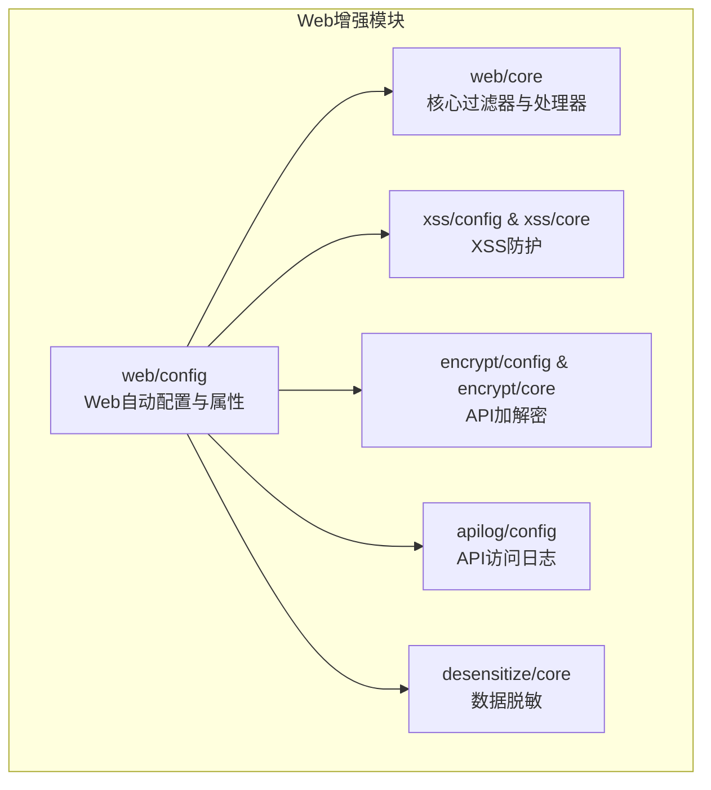
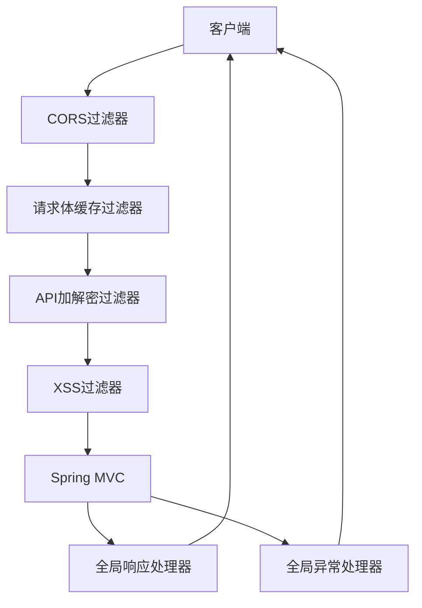
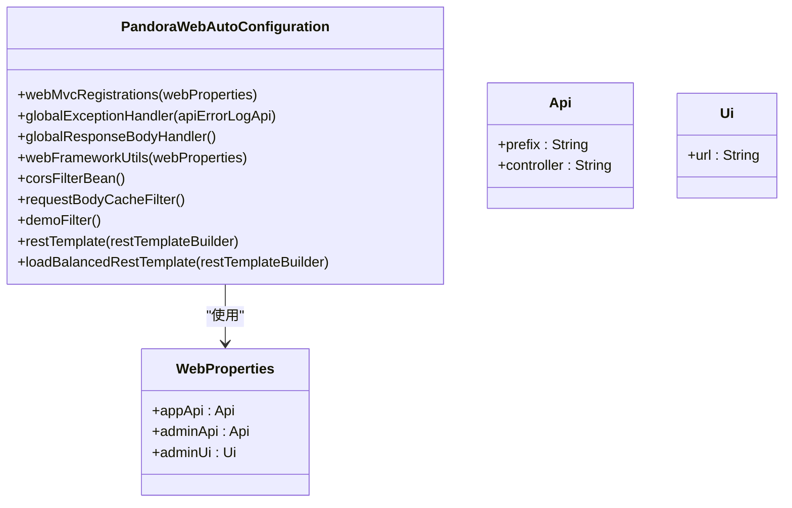
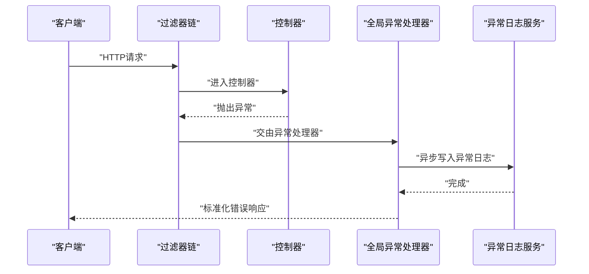
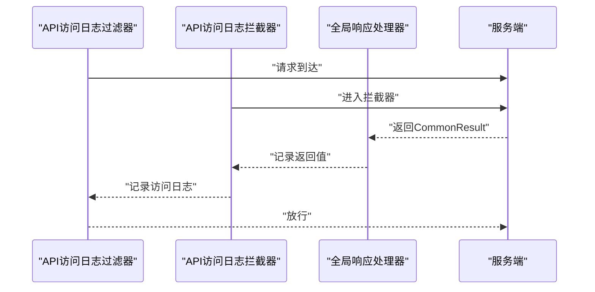
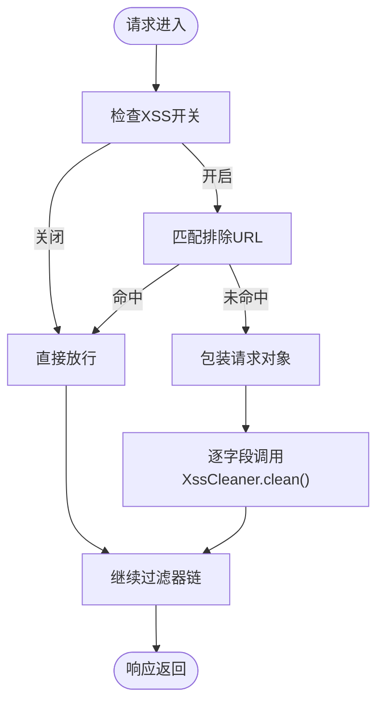
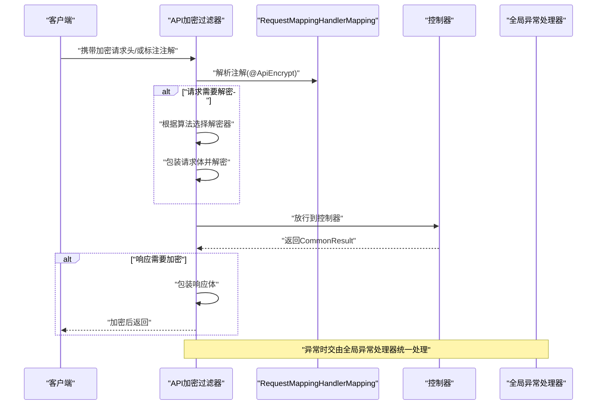
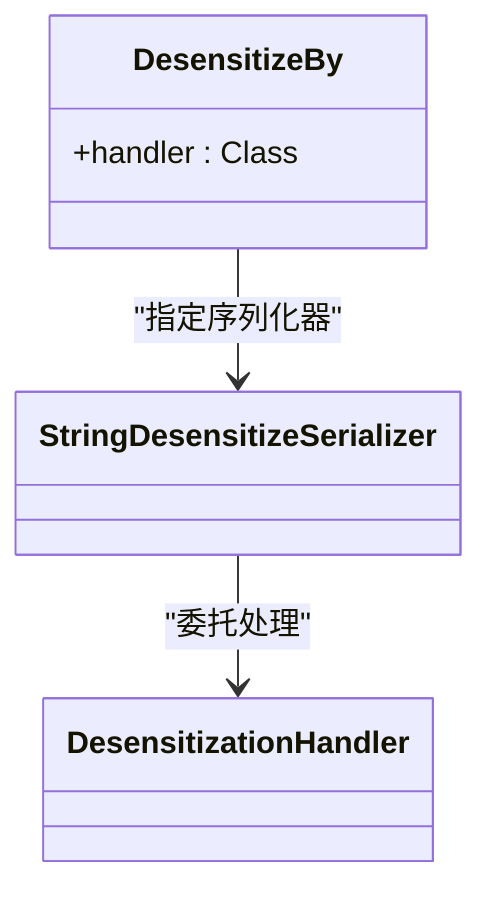
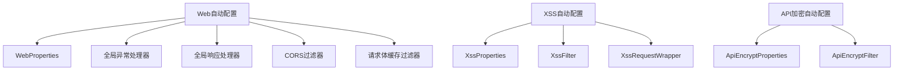

# Web增强模块

<cite>
**本文引用的文件**
- [PandoraWebAutoConfiguration.java](file://pandora-framework/pandora-spring-boot-starter-web/src/main/java/net/ittimeline/pandora/framework/web/config/PandoraWebAutoConfiguration.java)
- [WebProperties.java](file://pandora-framework/pandora-spring-boot-starter-web/src/main/java/net/ittimeline/pandora/framework/web/config/WebProperties.java)
- [ApiRequestFilter.java](file://pandora-framework/pandora-spring-boot-starter-web/src/main/java/net/ittimeline/pandora/framework/web/core/filter/ApiRequestFilter.java)
- [GlobalExceptionHandler.java](file://pandora-framework/pandora-spring-boot-starter-web/src/main/java/net/ittimeline/pandora/framework/web/core/handler/GlobalExceptionHandler.java)
- [GlobalResponseBodyHandler.java](file://pandora-framework/pandora-spring-boot-starter-web/src/main/java/net/ittimeline/pandora/framework/web/core/handler/GlobalResponseBodyHandler.java)
- [PandoraXssAutoConfiguration.java](file://pandora-framework/pandora-spring-boot-starter-web/src/main/java/net/ittimeline/pandora/framework/xss/config/PandoraXssAutoConfiguration.java)
- [XssProperties.java](file://pandora-framework/pandora-spring-boot-starter-web/src/main/java/net/ittimeline/pandora/framework/xss/config/XssProperties.java)
- [XssFilter.java](file://pandora-framework/pandora-spring-boot-starter-web/src/main/java/net/ittimeline/pandora/framework/xss/core/filter/XssFilter.java)
- [XssRequestWrapper.java](file://pandora-framework/pandora-spring-boot-starter-web/src/main/java/net/ittimeline/pandora/framework/xss/core/filter/XssRequestWrapper.java)
- [PandoraApiEncryptAutoConfiguration.java](file://pandora-framework/pandora-spring-boot-starter-web/src/main/java/net/ittimeline/pandora/framework/encrypt/config/PandoraApiEncryptAutoConfiguration.java)
- [ApiEncryptProperties.java](file://pandora-framework/pandora-spring-boot-starter-web/src/main/java/net/ittimeline/pandora/framework/encrypt/config/ApiEncryptProperties.java)
- [ApiEncryptFilter.java](file://pandora-framework/pandora-spring-boot-starter-web/src/main/java/net/ittimeline/pandora/framework/encrypt/core/filter/ApiEncryptFilter.java)
- [PandoraApiLogAutoConfiguration.java](file://pandora-framework/pandora-spring-boot-starter-web/src/main/java/net/ittimeline/pandora/framework/apilog/config/PandoraApiLogAutoConfiguration.java)
- [DesensitizeBy.java](file://pandora-framework/pandora-spring-boot-starter-web/src/main/java/net/ittimeline/pandora/framework/desensitize/core/base/annotation/DesensitizeBy.java)
</cite>

## 目录
1. [简介](#简介)
2. [项目结构](#项目结构)
3. [核心组件](#核心组件)
4. [架构总览](#架构总览)
5. [详细组件分析](#详细组件分析)
6. [依赖分析](#依赖分析)
7. [性能考虑](#性能考虑)
8. [故障排查指南](#故障排查指南)
9. [结论](#结论)
10. [附录](#附录)

## 简介
本文件面向Pandora Cloud框架的Web增强模块，系统性阐述以下能力与机制：
- Web自动配置与路径前缀分发
- 全局异常处理与API异常日志
- API访问日志记录
- XSS防护机制与实现细节
- API请求/响应加/解密过滤器
- 数据脱敏处理（基于Jackson的注解与序列化器）
- 各类过滤器的工作原理与配置方法
- 与Spring Boot自动配置的集成方式及扩展点

目标读者包括后端开发者、安全工程师与运维人员，帮助快速理解并正确使用与扩展Web增强能力。

## 项目结构
Web增强模块位于pandora-spring-boot-starter-web中，采用按功能域分层的组织方式：
- web/config：Web自动配置与属性
- web/core：核心过滤器与处理器
- xss/config、xss/core：XSS防护自动配置与实现
- encrypt/config、encrypt/core：API加解密自动配置与实现
- apilog/config：API访问日志自动配置
- desensitize/core：脱敏注解与序列化器

图表来源
- [PandoraWebAutoConfiguration.java:1-177](file://pandora-framework/pandora-spring-boot-starter-web/src/main/java/net/ittimeline/pandora/framework/web/config/PandoraWebAutoConfiguration.java#L1-L177)
- [PandoraXssAutoConfiguration.java:1-69](file://pandora-framework/pandora-spring-boot-starter-web/src/main/java/net/ittimeline/pandora/framework/xss/config/PandoraXssAutoConfiguration.java#L1-L69)
- [PandoraApiEncryptAutoConfiguration.java:1-40](file://pandora-framework/pandora-spring-boot-starter-web/src/main/java/net/ittimeline/pandora/framework/encrypt/config/PandoraApiEncryptAutoConfiguration.java#L1-L40)
- [PandoraApiLogAutoConfiguration.java:1-51](file://pandora-framework/pandora-spring-boot-starter-web/src/main/java/net/ittimeline/pandora/framework/apilog/config/PandoraApiLogAutoConfiguration.java#L1-L51)
- [DesensitizeBy.java:1-29](file://pandora-framework/pandora-spring-boot-starter-web/src/main/java/net/ittimeline/pandora/framework/desensitize/core/base/annotation/DesensitizeBy.java#L1-L29)

章节来源
- [PandoraWebAutoConfiguration.java:1-177](file://pandora-framework/pandora-spring-boot-starter-web/src/main/java/net/ittimeline/pandora/framework/web/config/PandoraWebAutoConfiguration.java#L1-L177)

## 核心组件
- Web自动配置与路径前缀：通过WebMvcRegistrations动态为指定包下的@RestController添加统一前缀，避免外部直接暴露。
- 全局异常处理：统一捕获各类异常，构造标准化返回，并异步落库API异常日志。
- 全局响应包装处理器：记录Controller返回的CommonResult，供访问日志使用。
- XSS防护：基于HttpServletRequestWrapper与XssCleaner，清洗参数、请求头、属性与查询串。
- API加解密：基于注解定位目标接口，对请求体解密、响应体加密；支持对称与非对称算法。
- API访问日志：过滤器+拦截器双通道记录请求与响应上下文。
- 数据脱敏：基于Jackson注解与序列化器，按处理器策略进行脱敏。

章节来源
- [PandoraWebAutoConfiguration.java:43-91](file://pandora-framework/pandora-spring-boot-starter-web/src/main/java/net/ittimeline/pandora/framework/web/config/PandoraWebAutoConfiguration.java#L43-L91)
- [GlobalExceptionHandler.java:57-120](file://pandora-framework/pandora-spring-boot-starter-web/src/main/java/net/ittimeline/pandora/framework/web/core/handler/GlobalExceptionHandler.java#L57-L120)
- [GlobalResponseBodyHandler.java:25-46](file://pandora-framework/pandora-spring-boot-starter-web/src/main/java/net/ittimeline/pandora/framework/web/core/handler/GlobalResponseBodyHandler.java#L25-L46)
- [PandoraXssAutoConfiguration.java:31-66](file://pandora-framework/pandora-spring-boot-starter-web/src/main/java/net/ittimeline/pandora/framework/xss/config/PandoraXssAutoConfiguration.java#L31-L66)
- [PandoraApiEncryptAutoConfiguration.java:24-38](file://pandora-framework/pandora-spring-boot-starter-web/src/main/java/net/ittimeline/pandora/framework/encrypt/config/PandoraApiEncryptAutoConfiguration.java#L24-L38)
- [PandoraApiLogAutoConfiguration.java:24-48](file://pandora-framework/pandora-spring-boot-starter-web/src/main/java/net/ittimeline/pandora/framework/apilog/config/PandoraApiLogAutoConfiguration.java#L24-L48)
- [DesensitizeBy.java:17-28](file://pandora-framework/pandora-spring-boot-starter-web/src/main/java/net/ittimeline/pandora/framework/desensitize/core/base/annotation/DesensitizeBy.java#L17-L28)

## 架构总览
Web增强模块通过Spring Boot自动配置装配核心组件，形成“过滤器链 + 控制器增强”的整体处理链路。

图表来源
- [PandoraWebAutoConfiguration.java:116-152](file://pandora-framework/pandora-spring-boot-starter-web/src/main/java/net/ittimeline/pandora/framework/web/config/PandoraWebAutoConfiguration.java#L116-L152)
- [ApiEncryptFilter.java:40-121](file://pandora-framework/pandora-spring-boot-starter-web/src/main/java/net/ittimeline/pandora/framework/encrypt/core/filter/ApiEncryptFilter.java#L40-L121)
- [XssFilter.java:23-54](file://pandora-framework/pandora-spring-boot-starter-web/src/main/java/net/ittimeline/pandora/framework/xss/core/filter/XssFilter.java#L23-L54)
- [GlobalResponseBodyHandler.java:25-46](file://pandora-framework/pandora-spring-boot-starter-web/src/main/java/net/ittimeline/pandora/framework/web/core/handler/GlobalResponseBodyHandler.java#L25-L46)
- [GlobalExceptionHandler.java:57-120](file://pandora-framework/pandora-spring-boot-starter-web/src/main/java/net/ittimeline/pandora/framework/web/core/handler/GlobalExceptionHandler.java#L57-L120)

## 详细组件分析

### Web自动配置与路径前缀分发
- 自动配置类负责：
  - 注册WebMvcRegistrations，动态为@RestController所在包设置路径前缀（如/app-api、/admin-api），并限定匹配规则。
  - 注册全局异常处理器、全局响应处理器、Web工具类等。
  - 注册跨域过滤器、请求体缓存过滤器、演示过滤器等。
  - 提供RestTemplate与带负载均衡的RestTemplate Bean。
- 配置属性：
  - WebProperties定义appApi/adminApi的prefix与controller包匹配规则，以及adminUi的访问地址。

图表来源
- [PandoraWebAutoConfiguration.java:47-176](file://pandora-framework/pandora-spring-boot-starter-web/src/main/java/net/ittimeline/pandora/framework/web/config/PandoraWebAutoConfiguration.java#L47-L176)
- [WebProperties.java:21-67](file://pandora-framework/pandora-spring-boot-starter-web/src/main/java/net/ittimeline/pandora/framework/web/config/WebProperties.java#L21-L67)

章节来源
- [PandoraWebAutoConfiguration.java:43-91](file://pandora-framework/pandora-spring-boot-starter-web/src/main/java/net/ittimeline/pandora/framework/web/config/PandoraWebAutoConfiguration.java#L43-L91)
- [WebProperties.java:18-67](file://pandora-framework/pandora-spring-boot-starter-web/src/main/java/net/ittimeline/pandora/framework/web/config/WebProperties.java#L18-L67)

### 全局异常处理机制
- 能力概述：
  - 统一捕获Spring MVC常见异常、参数校验异常、权限不足、系统异常等。
  - 将异常转换为标准化返回格式，并异步写入API异常日志。
  - 对特定异常（如表不存在）进行模块化提示。
- 关键流程：
  - RestControllerAdvice统一入口，按异常类型分支处理。
  - 异常日志构建包含用户信息、请求参数、堆栈信息、追踪ID等。
  - 对ServiceException进行差异化处理，避免噪声日志。

图表来源
- [GlobalExceptionHandler.java:79-120](file://pandora-framework/pandora-spring-boot-starter-web/src/main/java/net/ittimeline/pandora/framework/web/core/handler/GlobalExceptionHandler.java#L79-L120)
- [GlobalExceptionHandler.java:343-384](file://pandora-framework/pandora-spring-boot-starter-web/src/main/java/net/ittimeline/pandora/framework/web/core/handler/GlobalExceptionHandler.java#L343-L384)

章节来源
- [GlobalExceptionHandler.java:57-453](file://pandora-framework/pandora-spring-boot-starter-web/src/main/java/net/ittimeline/pandora/framework/web/core/handler/GlobalExceptionHandler.java#L57-L453)

### API访问日志记录
- 能力概述：
  - 过滤器通道：记录请求开始、结束、耗时、状态码、用户信息、请求参数等。
  - 拦截器通道：补充Controller返回结果（通过全局响应处理器记录的CommonResult）。
- 自动配置：
  - 默认启用，可通过配置项禁用。

图表来源
- [PandoraApiLogAutoConfiguration.java:30-48](file://pandora-framework/pandora-spring-boot-starter-web/src/main/java/net/ittimeline/pandora/framework/apilog/config/PandoraApiLogAutoConfiguration.java#L30-L48)
- [GlobalResponseBodyHandler.java:25-46](file://pandora-framework/pandora-spring-boot-starter-web/src/main/java/net/ittimeline/pandora/framework/web/core/handler/GlobalResponseBodyHandler.java#L25-L46)

章节来源
- [PandoraApiLogAutoConfiguration.java:24-51](file://pandora-framework/pandora-spring-boot-starter-web/src/main/java/net/ittimeline/pandora/framework/apilog/config/PandoraApiLogAutoConfiguration.java#L24-L51)
- [GlobalResponseBodyHandler.java:12-46](file://pandora-framework/pandora-spring-boot-starter-web/src/main/java/net/ittimeline/pandora/framework/web/core/handler/GlobalResponseBodyHandler.java#L12-L46)

### XSS防护机制
- 能力概述：
  - 过滤器基于HttpServletRequestWrapper包装请求，清洗参数、请求头、属性与查询串。
  - Jackson反序列化时通过自定义反序列化器对字符串进行XSS清理。
  - 可配置开关与排除URL列表。
- 自动配置：
  - 条件启用，缺省开启；当检测到XssCleaner Bean时注册过滤器。

图表来源
- [XssFilter.java:36-54](file://pandora-framework/pandora-spring-boot-starter-web/src/main/java/net/ittimeline/pandora/framework/xss/core/filter/XssFilter.java#L36-L54)
- [XssRequestWrapper.java:27-94](file://pandora-framework/pandora-spring-boot-starter-web/src/main/java/net/ittimeline/pandora/framework/xss/core/filter/XssRequestWrapper.java#L27-L94)
- [PandoraXssAutoConfiguration.java:48-57](file://pandora-framework/pandora-spring-boot-starter-web/src/main/java/net/ittimeline/pandora/framework/xss/config/PandoraXssAutoConfiguration.java#L48-L57)

章节来源
- [XssProperties.java:16-30](file://pandora-framework/pandora-spring-boot-starter-web/src/main/java/net/ittimeline/pandora/framework/xss/config/XssProperties.java#L16-L30)
- [XssFilter.java:15-55](file://pandora-framework/pandora-spring-boot-starter-web/src/main/java/net/ittimeline/pandora/framework/xss/core/filter/XssFilter.java#L15-L55)
- [XssRequestWrapper.java:10-94](file://pandora-framework/pandora-spring-boot-starter-web/src/main/java/net/ittimeline/pandora/framework/xss/core/filter/XssRequestWrapper.java#L10-L94)
- [PandoraXssAutoConfiguration.java:27-69](file://pandora-framework/pandora-spring-boot-starter-web/src/main/java/net/ittimeline/pandora/framework/xss/config/PandoraXssAutoConfiguration.java#L27-L69)

### API加/解密过滤器
- 能力概述：
  - 通过注解定位目标接口，支持对请求体解密、响应体加密。
  - 支持对称（如AES）与非对称（如RSA）算法；可扩展至SM2/SM4。
  - 仅对POST/PUT/DELETE方法进行请求解密；响应加密通过包装响应实现可重复读取。
- 自动配置：
  - 条件启用，需显式开启；注册过滤器并注入WebProperties与全局异常处理器。

图表来源
- [ApiEncryptFilter.java:78-121](file://pandora-framework/pandora-spring-boot-starter-web/src/main/java/net/ittimeline/pandora/framework/encrypt/core/filter/ApiEncryptFilter.java#L78-L121)
- [ApiEncryptFilter.java:129-155](file://pandora-framework/pandora-spring-boot-starter-web/src/main/java/net/ittimeline/pandora/framework/encrypt/core/filter/ApiEncryptFilter.java#L129-L155)
- [PandoraApiEncryptAutoConfiguration.java:28-38](file://pandora-framework/pandora-spring-boot-starter-web/src/main/java/net/ittimeline/pandora/framework/encrypt/config/PandoraApiEncryptAutoConfiguration.java#L28-L38)

章节来源
- [ApiEncryptProperties.java:16-73](file://pandora-framework/pandora-spring-boot-starter-web/src/main/java/net/ittimeline/pandora/framework/encrypt/config/ApiEncryptProperties.java#L16-L73)
- [ApiEncryptFilter.java:32-158](file://pandora-framework/pandora-spring-boot-starter-web/src/main/java/net/ittimeline/pandora/framework/encrypt/core/filter/ApiEncryptFilter.java#L32-L158)
- [PandoraApiEncryptAutoConfiguration.java:17-40](file://pandora-framework/pandora-spring-boot-starter-web/src/main/java/net/ittimeline/pandora/framework/encrypt/config/PandoraApiEncryptAutoConfiguration.java#L17-L40)

### 数据脱敏处理
- 能力概述：
  - 基于Jackson注解与序列化器，对字符串字段进行脱敏处理。
  - 顶层注解DesensitizeBy声明序列化器与处理器，具体策略由处理器实现。
- 使用建议：
  - 在实体字段上标注脱敏注解，结合Jackson序列化自动生效。

图表来源
- [DesensitizeBy.java:17-28](file://pandora-framework/pandora-spring-boot-starter-web/src/main/java/net/ittimeline/pandora/framework/desensitize/core/base/annotation/DesensitizeBy.java#L17-L28)

章节来源
- [DesensitizeBy.java:10-29](file://pandora-framework/pandora-spring-boot-starter-web/src/main/java/net/ittimeline/pandora/framework/desensitize/core/base/annotation/DesensitizeBy.java#L10-L29)

## 依赖分析
- Web自动配置依赖：
  - WebProperties：提供路径前缀与包匹配规则。
  - 全局异常处理器依赖异常日志接口与工具类。
  - 过滤器依赖WebFilterOrderConstants定义的执行顺序。
- XSS与API加密：
  - 两者均通过条件注解与属性开关控制启用。
  - XSS依赖XssCleaner与Jackson反序列化器。
  - API加密依赖ApiEncryptProperties与RequestMappingHandlerMapping。

图表来源
- [PandoraWebAutoConfiguration.java:47-176](file://pandora-framework/pandora-spring-boot-starter-web/src/main/java/net/ittimeline/pandora/framework/web/config/PandoraWebAutoConfiguration.java#L47-L176)
- [PandoraXssAutoConfiguration.java:27-69](file://pandora-framework/pandora-spring-boot-starter-web/src/main/java/net/ittimeline/pandora/framework/xss/config/PandoraXssAutoConfiguration.java#L27-L69)
- [PandoraApiEncryptAutoConfiguration.java:24-38](file://pandora-framework/pandora-spring-boot-starter-web/src/main/java/net/ittimeline/pandora/framework/encrypt/config/PandoraApiEncryptAutoConfiguration.java#L24-L38)

章节来源
- [PandoraWebAutoConfiguration.java:1-177](file://pandora-framework/pandora-spring-boot-starter-web/src/main/java/net/ittimeline/pandora/framework/web/config/PandoraWebAutoConfiguration.java#L1-L177)
- [PandoraXssAutoConfiguration.java:1-69](file://pandora-framework/pandora-spring-boot-starter-web/src/main/java/net/ittimeline/pandora/framework/xss/config/PandoraXssAutoConfiguration.java#L1-L69)
- [PandoraApiEncryptAutoConfiguration.java:1-40](file://pandora-framework/pandora-spring-boot-starter-web/src/main/java/net/ittimeline/pandora/framework/encrypt/config/PandoraApiEncryptAutoConfiguration.java#L1-L40)

## 性能考虑
- 过滤器链顺序：通过统一的过滤器序号常量保证执行顺序，避免跨域等配置失效。
- 请求体可重复读取：请求体缓存过滤器允许后续过滤器多次读取请求体，减少IO开销。
- 异步异常日志：异常日志写入采用异步方式，降低对主请求路径的影响。
- XSS与加解密：仅在必要字段与方法上生效，避免全量扫描带来的性能损耗。
- Jackson序列化：脱敏与XSS清理在序列化阶段进行，减少额外遍历成本。

## 故障排查指南
- 跨域不生效：
  - 检查CORS过滤器顺序是否正确；确认跨域配置已在FilterRegistrationBean中设置。
- API异常未记录：
  - 确认全局异常处理器已注册；检查异常日志接口可用性与异步任务队列。
- XSS未生效：
  - 确认XSS开关已开启；核对排除URL是否误匹配；验证XssCleaner Bean是否存在。
- API加解密失败：
  - 检查算法与密钥配置；确认注解位置正确；查看过滤器链是否被提前中断。
- 访问日志缺失：
  - 确认过滤器与拦截器均已启用；检查全局响应处理器是否记录返回值。

章节来源
- [PandoraWebAutoConfiguration.java:116-152](file://pandora-framework/pandora-spring-boot-starter-web/src/main/java/net/ittimeline/pandora/framework/web/config/PandoraWebAutoConfiguration.java#L116-L152)
- [GlobalExceptionHandler.java:343-384](file://pandora-framework/pandora-spring-boot-starter-web/src/main/java/net/ittimeline/pandora/framework/web/core/handler/GlobalExceptionHandler.java#L343-L384)
- [PandoraXssAutoConfiguration.java:27-69](file://pandora-framework/pandora-spring-boot-starter-web/src/main/java/net/ittimeline/pandora/framework/xss/config/PandoraXssAutoConfiguration.java#L27-L69)
- [PandoraApiEncryptAutoConfiguration.java:24-38](file://pandora-framework/pandora-spring-boot-starter-web/src/main/java/net/ittimeline/pandora/framework/encrypt/config/PandoraApiEncryptAutoConfiguration.java#L24-L38)
- [PandoraApiLogAutoConfiguration.java:24-48](file://pandora-framework/pandora-spring-boot-starter-web/src/main/java/net/ittimeline/pandora/framework/apilog/config/PandoraApiLogAutoConfiguration.java#L24-L48)

## 结论
Web增强模块以自动配置为核心，围绕“路径前缀、异常处理、访问日志、XSS防护、加解密、脱敏”六大能力构建了完整的Web安全与可观测性体系。通过清晰的过滤器链与处理器协作，既保证了易用性，也为扩展与定制提供了稳定接口。

## 附录

### 配置项一览（节选）
- Web路径前缀
  - pandora.web.app-api.prefix：APP API前缀
  - pandora.web.app-api.controller：APP API所在包匹配规则
  - pandora.web.admin-api.prefix：管理API前缀
  - pandora.web.admin-api.controller：管理API所在包匹配规则
- XSS
  - pandora.xss.enable：是否启用XSS防护
  - pandora.xss.exclude-urls：排除URL列表
- API加解密
  - pandora.api-encrypt.enable：是否启用
  - pandora.api-encrypt.header：加解密请求/响应头名称
  - pandora.api-encrypt.algorithm：算法（如AES、RSA）
  - pandora.api-encrypt.request-key：请求解密密钥
  - pandora.api-encrypt.response-key：响应加密密钥
- API访问日志
  - pandora.access-log.enable：是否启用访问日志（默认启用）

章节来源
- [WebProperties.java:18-67](file://pandora-framework/pandora-spring-boot-starter-web/src/main/java/net/ittimeline/pandora/framework/web/config/WebProperties.java#L18-L67)
- [XssProperties.java:16-30](file://pandora-framework/pandora-spring-boot-starter-web/src/main/java/net/ittimeline/pandora/framework/xss/config/XssProperties.java#L16-L30)
- [ApiEncryptProperties.java:16-73](file://pandora-framework/pandora-spring-boot-starter-web/src/main/java/net/ittimeline/pandora/framework/encrypt/config/ApiEncryptProperties.java#L16-L73)
- [PandoraApiLogAutoConfiguration.java:30-37](file://pandora-framework/pandora-spring-boot-starter-web/src/main/java/net/ittimeline/pandora/framework/apilog/config/PandoraApiLogAutoConfiguration.java#L30-L37)