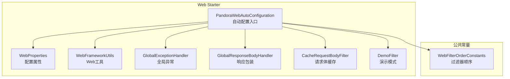
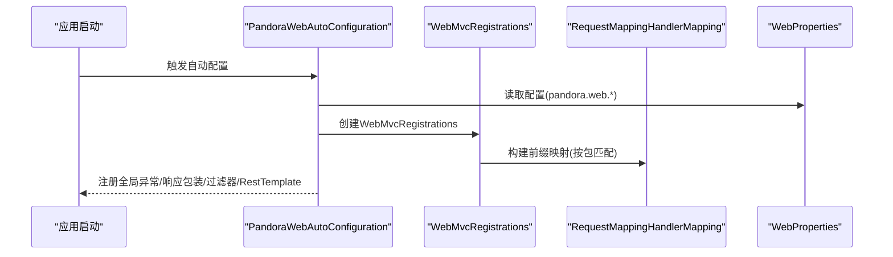
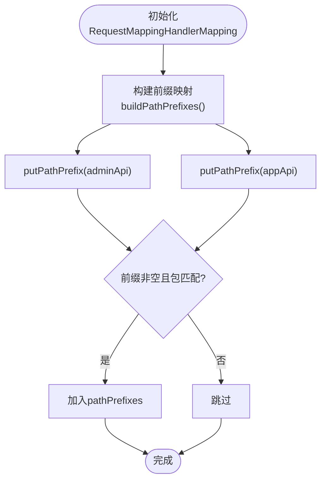
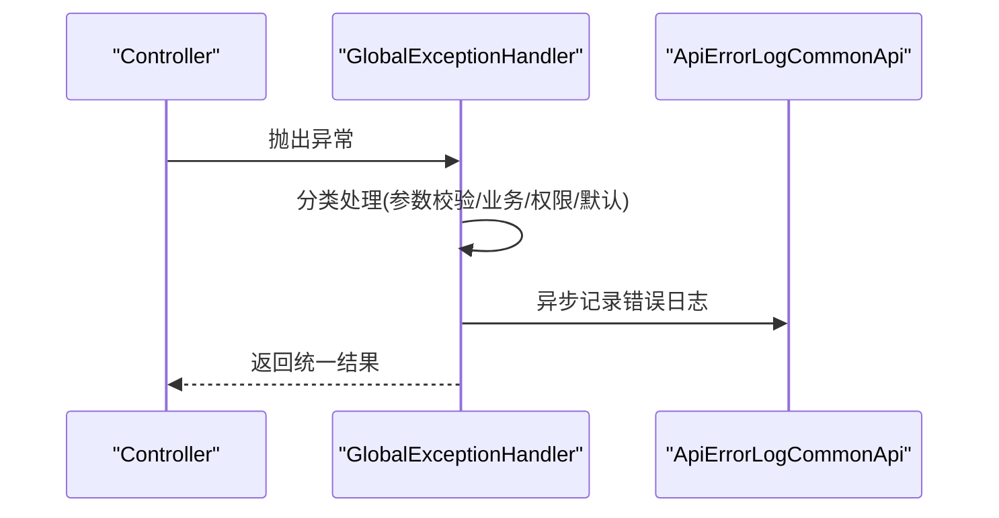
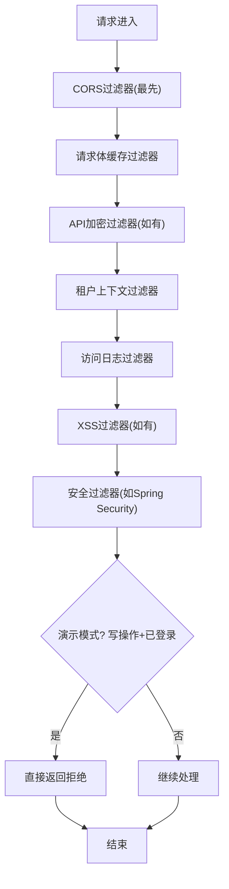
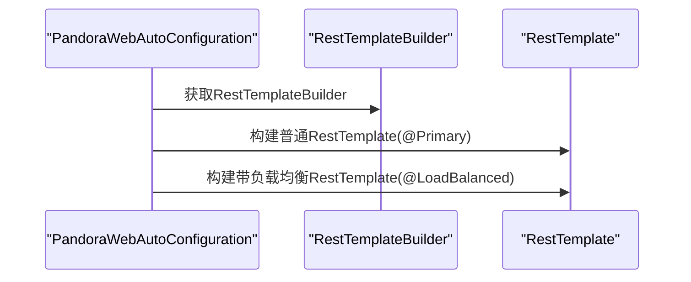
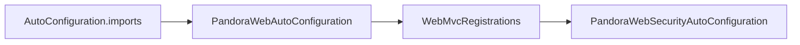

# Web自动配置

<cite>
**本文引用的文件**
- [PandoraWebAutoConfiguration.java](file://pandora-framework/pandora-spring-boot-starter-web/src/main/java/net/ittimeline/pandora/framework/web/config/PandoraWebAutoConfiguration.java)
- [WebProperties.java](file://pandora-framework/pandora-spring-boot-starter-web/src/main/java/net/ittimeline/pandora/framework/web/config/WebProperties.java)
- [WebFrameworkUtils.java](file://pandora-framework/pandora-spring-boot-starter-web/src/main/java/net/ittimeline/pandora/framework/web/core/util/WebFrameworkUtils.java)
- [GlobalExceptionHandler.java](file://pandora-framework/pandora-spring-boot-starter-web/src/main/java/net/ittimeline/pandora/framework/web/core/handler/GlobalExceptionHandler.java)
- [GlobalResponseBodyHandler.java](file://pandora-framework/pandora-spring-boot-starter-web/src/main/java/net/ittimeline/pandora/framework/web/core/handler/GlobalResponseBodyHandler.java)
- [CacheRequestBodyFilter.java](file://pandora-framework/pandora-spring-boot-starter-web/src/main/java/net/ittimeline/pandora/framework/web/core/filter/CacheRequestBodyFilter.java)
- [DemoFilter.java](file://pandora-framework/pandora-spring-boot-starter-web/src/main/java/net/ittimeline/pandora/framework/web/core/filter/DemoFilter.java)
- [WebFilterOrderConstants.java](file://pandora-framework/pandora-common/src/main/java/net/ittimeline/pandora/framework/common/constants/WebFilterOrderConstants.java)
- [org.springframework.boot.autoconfigure.AutoConfiguration.imports](file://pandora-framework/pandora-spring-boot-starter-web/src/main/resources/META-INF/spring/org.springframework.boot.autoconfigure.AutoConfiguration.imports)
- [PandoraWebSecurityAutoConfiguration.java](file://pandora-framework/pandora-spring-boot-starter-security/src/main/java/net/ittimeline/pandora/framework/security/config/PandoraWebSecurityAutoConfiguration.java)
</cite>

## 目录
1. [简介](#简介)
2. [项目结构](#项目结构)
3. [核心组件](#核心组件)
4. [架构总览](#架构总览)
5. [组件详解](#组件详解)
6. [依赖关系分析](#依赖关系分析)
7. [性能考量](#性能考量)
8. [故障排查指南](#故障排查指南)
9. [结论](#结论)
10. [附录](#附录)

## 简介
本文件面向Pandora Cloud框架的Web自动配置能力，重点解析WebMvcRegistrations配置、API路径前缀策略、全局异常与响应包装、跨域与请求体缓存、RestTemplate Bean创建与负载均衡支持等关键特性。同时，结合WebProperties配置属性，说明如何通过配置实现不同模块（如管理端与应用端）的API前缀管理，并给出配置示例与最佳实践，明确自动配置与手动配置的优先级关系。

## 项目结构
Web自动配置位于web starter模块，通过Spring Boot的自动配置机制集成到应用中。其核心入口为自动配置类，负责注册Web相关的Bean与过滤器，并读取WebProperties中的配置项以决定行为。

图示来源
- [PandoraWebAutoConfiguration.java:43-46](file://pandora-framework/pandora-spring-boot-starter-web/src/main/java/net/ittimeline/pandora/framework/web/config/PandoraWebAutoConfiguration.java#L43-L46)
- [WebProperties.java:18-21](file://pandora-framework/pandora-spring-boot-starter-web/src/main/java/net/ittimeline/pandora/framework/web/config/WebProperties.java#L18-L21)
- [WebFrameworkUtils.java:40-42](file://pandora-framework/pandora-spring-boot-starter-web/src/main/java/net/ittimeline/pandora/framework/web/core/util/WebFrameworkUtils.java#L40-L42)
- [GlobalExceptionHandler.java:57-69](file://pandora-framework/pandora-spring-boot-starter-web/src/main/java/net/ittimeline/pandora/framework/web/core/handler/GlobalExceptionHandler.java#L57-L69)
- [GlobalResponseBodyHandler.java:25-46](file://pandora-framework/pandora-spring-boot-starter-web/src/main/java/net/ittimeline/pandora/framework/web/core/handler/GlobalResponseBodyHandler.java#L25-L46)
- [CacheRequestBodyFilter.java:20-48](file://pandora-framework/pandora-spring-boot-starter-web/src/main/java/net/ittimeline/pandora/framework/web/core/filter/CacheRequestBodyFilter.java#L20-L48)
- [DemoFilter.java:21-36](file://pandora-framework/pandora-spring-boot-starter-web/src/main/java/net/ittimeline/pandora/framework/web/core/filter/DemoFilter.java#L21-L36)
- [WebFilterOrderConstants.java:11-37](file://pandora-framework/pandora-common/src/main/java/net/ittimeline/pandora/framework/common/constants/WebFilterOrderConstants.java#L11-L37)

章节来源
- [org.springframework.boot.autoconfigure.AutoConfiguration.imports:1-8](file://pandora-framework/pandora-spring-boot-starter-web/src/main/resources/META-INF/spring/org.springframework.boot.autoconfigure.AutoConfiguration.imports#L1-L8)

## 核心组件
- WebMvcRegistrations配置：通过覆写RequestMappingHandlerMapping，动态为控制器方法设置前缀映射，实现按包匹配的多前缀分发。
- WebProperties配置属性：定义appApi/adminApi前缀与包匹配规则，以及UI访问地址。
- 全局异常处理：统一捕获各类异常并转换为标准返回结构，同时异步记录错误日志。
- 全局响应包装：拦截返回类型为统一结果类型的响应，便于后续日志记录与审计。
- 过滤器体系：跨域、请求体缓存、演示模式等过滤器按序执行，保障安全与可调试性。
- RestTemplate Bean：提供普通与带负载均衡的RestTemplate实例，满足HTTP调用需求。

章节来源
- [PandoraWebAutoConfiguration.java:55-91](file://pandora-framework/pandora-spring-boot-starter-web/src/main/java/net/ittimeline/pandora/framework/web/config/PandoraWebAutoConfiguration.java#L55-L91)
- [WebProperties.java:18-67](file://pandora-framework/pandora-spring-boot-starter-web/src/main/java/net/ittimeline/pandora/framework/web/config/WebProperties.java#L18-L67)
- [GlobalExceptionHandler.java:57-120](file://pandora-framework/pandora-spring-boot-starter-web/src/main/java/net/ittimeline/pandora/framework/web/core/handler/GlobalExceptionHandler.java#L57-L120)
- [GlobalResponseBodyHandler.java:25-46](file://pandora-framework/pandora-spring-boot-starter-web/src/main/java/net/ittimeline/pandora/framework/web/core/handler/GlobalResponseBodyHandler.java#L25-L46)
- [CacheRequestBodyFilter.java:20-48](file://pandora-framework/pandora-spring-boot-starter-web/src/main/java/net/ittimeline/pandora/framework/web/core/filter/CacheRequestBodyFilter.java#L20-L48)
- [DemoFilter.java:21-36](file://pandora-framework/pandora-spring-boot-starter-web/src/main/java/net/ittimeline/pandora/framework/web/core/filter/DemoFilter.java#L21-L36)
- [WebFilterOrderConstants.java:11-37](file://pandora-framework/pandora-common/src/main/java/net/ittimeline/pandora/framework/common/constants/WebFilterOrderConstants.java#L11-L37)

## 架构总览
Web自动配置在应用启动时生效，读取WebProperties，构建WebMvcRegistrations以设置API前缀；注册全局异常与响应包装处理器；注册过滤器链；创建RestTemplate Bean。整体遵循“先自动配置，再手动配置”的原则，手动配置可通过覆盖Bean或禁用自动配置来实现。

图示来源
- [PandoraWebAutoConfiguration.java:43-91](file://pandora-framework/pandora-spring-boot-starter-web/src/main/java/net/ittimeline/pandora/framework/web/config/PandoraWebAutoConfiguration.java#L43-L91)
- [WebProperties.java:18-67](file://pandora-framework/pandora-spring-boot-starter-web/src/main/java/net/ittimeline/pandora/framework/web/config/WebProperties.java#L18-L67)

## 组件详解

### WebMvcRegistrations与API路径前缀
- 动态前缀映射：通过覆写RequestMappingHandlerMapping，在实例化阶段即设置pathPrefixes，实现对不同包下的控制器统一加前缀。
- 包匹配策略：使用Ant风格的包路径匹配，仅对标注@RestController且属于指定包的类生效。
- 多前缀支持：默认同时支持管理端与应用端两套前缀，可按需扩展更多模块前缀。

图示来源
- [PandoraWebAutoConfiguration.java:55-91](file://pandora-framework/pandora-spring-boot-starter-web/src/main/java/net/ittimeline/pandora/framework/web/config/PandoraWebAutoConfiguration.java#L55-L91)
- [WebProperties.java:22-28](file://pandora-framework/pandora-spring-boot-starter-web/src/main/java/net/ittimeline/pandora/framework/web/config/WebProperties.java#L22-L28)

章节来源
- [PandoraWebAutoConfiguration.java:55-91](file://pandora-framework/pandora-spring-boot-starter-web/src/main/java/net/ittimeline/pandora/framework/web/config/PandoraWebAutoConfiguration.java#L55-L91)
- [WebProperties.java:22-28](file://pandora-framework/pandora-spring-boot-starter-web/src/main/java/net/ittimeline/pandora/framework/web/config/WebProperties.java#L22-L28)

### WebProperties配置属性
- appApi/adminApi：分别定义模块API前缀与对应控制器包的Ant匹配规则，默认值分别为“/app-api”与“/admin-api”，并限定包路径模式。
- adminUi：管理端UI访问地址，用于统一管理界面的对外暴露策略。
- 验证约束：前缀与包路径均要求非空，确保配置的强制性与一致性。

章节来源
- [WebProperties.java:18-67](file://pandora-framework/pandora-spring-boot-starter-web/src/main/java/net/ittimeline/pandora/framework/web/config/WebProperties.java#L18-L67)

### 全局异常处理与响应包装
- 全局异常处理：统一捕获常见异常（参数缺失、类型不匹配、参数校验失败、资源不存在、方法不支持、媒体类型不支持、权限不足、业务异常等），并转换为统一返回结构；同时异步记录错误日志，包含请求上下文、异常堆栈等。
- 响应包装：拦截返回类型为统一结果类型的响应，将结果写入请求属性，供后续访问日志等组件使用。

图示来源
- [GlobalExceptionHandler.java:57-120](file://pandora-framework/pandora-spring-boot-starter-web/src/main/java/net/ittimeline/pandora/framework/web/core/handler/GlobalExceptionHandler.java#L57-L120)
- [GlobalExceptionHandler.java:343-384](file://pandora-framework/pandora-spring-boot-starter-web/src/main/java/net/ittimeline/pandora/framework/web/core/handler/GlobalExceptionHandler.java#L343-L384)

章节来源
- [GlobalExceptionHandler.java:57-120](file://pandora-framework/pandora-spring-boot-starter-web/src/main/java/net/ittimeline/pandora/framework/web/core/handler/GlobalExceptionHandler.java#L57-L120)
- [GlobalResponseBodyHandler.java:25-46](file://pandora-framework/pandora-spring-boot-starter-web/src/main/java/net/ittimeline/pandora/framework/web/core/handler/GlobalResponseBodyHandler.java#L25-L46)

### 过滤器体系与执行顺序
- 跨域过滤器：开启允许凭证、通配源、通配头与方法，注册为最低优先级，确保最先执行。
- 请求体缓存过滤器：对JSON请求进行一次性的请求体缓存包装，支持重复读取；排除特定管理端URI。
- 演示模式过滤器：仅对POST/PUT/DELETE且已登录用户生效，直接返回拒绝写入的结果，防止测试环境数据污染。
- 顺序常量：通过统一的WebFilterOrderConstants保证各过滤器的执行顺序，避免相互干扰。

图示来源
- [PandoraWebAutoConfiguration.java:116-146](file://pandora-framework/pandora-spring-boot-starter-web/src/main/java/net/ittimeline/pandora/framework/web/config/PandoraWebAutoConfiguration.java#L116-L146)
- [CacheRequestBodyFilter.java:20-48](file://pandora-framework/pandora-spring-boot-starter-web/src/main/java/net/ittimeline/pandora/framework/web/core/filter/CacheRequestBodyFilter.java#L20-L48)
- [DemoFilter.java:21-36](file://pandora-framework/pandora-spring-boot-starter-web/src/main/java/net/ittimeline/pandora/framework/web/core/filter/DemoFilter.java#L21-L36)
- [WebFilterOrderConstants.java:11-37](file://pandora-framework/pandora-common/src/main/java/net/ittimeline/pandora/framework/common/constants/WebFilterOrderConstants.java#L11-L37)

章节来源
- [PandoraWebAutoConfiguration.java:116-146](file://pandora-framework/pandora-spring-boot-starter-web/src/main/java/net/ittimeline/pandora/framework/web/config/PandoraWebAutoConfiguration.java#L116-L146)
- [CacheRequestBodyFilter.java:20-48](file://pandora-framework/pandora-spring-boot-starter-web/src/main/java/net/ittimeline/pandora/framework/web/core/filter/CacheRequestBodyFilter.java#L20-L48)
- [DemoFilter.java:21-36](file://pandora-framework/pandora-spring-boot-starter-web/src/main/java/net/ittimeline/pandora/framework/web/core/filter/DemoFilter.java#L21-L36)
- [WebFilterOrderConstants.java:11-37](file://pandora-framework/pandora-common/src/main/java/net/ittimeline/pandora/framework/common/constants/WebFilterOrderConstants.java#L11-L37)

### RestTemplate Bean创建与负载均衡
- 普通RestTemplate：当容器中无其他RestTemplate Bean时，创建一个默认实例，作为Primary Bean。
- 负载均衡RestTemplate：通过注解启用服务发现与轮询策略，适合微服务间调用。
- 自动配置前置：在特定第三方配置之前生效，避免RestTemplate初始化冲突。

图示来源
- [PandoraWebAutoConfiguration.java:155-175](file://pandora-framework/pandora-spring-boot-starter-web/src/main/java/net/ittimeline/pandora/framework/web/config/PandoraWebAutoConfiguration.java#L155-L175)

章节来源
- [PandoraWebAutoConfiguration.java:155-175](file://pandora-framework/pandora-spring-boot-starter-web/src/main/java/net/ittimeline/pandora/framework/web/config/PandoraWebAutoConfiguration.java#L155-L175)

### WebFrameworkUtils与前缀联动
- 登录用户类型判定：根据请求URI前缀判断当前请求属于管理端还是应用端，从而确定用户类型。
- 其他常用能力：租户ID/访问租户ID获取、终端类型识别、RPC请求判断等。

章节来源
- [WebFrameworkUtils.java:112-125](file://pandora-framework/pandora-spring-boot-starter-web/src/main/java/net/ittimeline/pandora/framework/web/core/util/WebFrameworkUtils.java#L112-L125)

## 依赖关系分析
- 自动配置导入：Web starter通过AutoConfiguration.imports文件声明自动配置类，确保在应用启动时被加载。
- 与安全配置的关系：WebSecurity自动配置会读取RequestMappingHandlerMapping中的URL映射，以支持基于注解的免登录白名单等功能。

图示来源
- [org.springframework.boot.autoconfigure.AutoConfiguration.imports:1-8](file://pandora-framework/pandora-spring-boot-starter-web/src/main/resources/META-INF/spring/org.springframework.boot.autoconfigure.AutoConfiguration.imports#L1-L8)
- [PandoraWebSecurityAutoConfiguration.java:161-222](file://pandora-framework/pandora-spring-boot-starter-security/src/main/java/net/ittimeline/pandora/framework/security/config/PandoraWebSecurityAutoConfiguration.java#L161-L222)

章节来源
- [org.springframework.boot.autoconfigure.AutoConfiguration.imports:1-8](file://pandora-framework/pandora-spring-boot-starter-web/src/main/resources/META-INF/spring/org.springframework.boot.autoconfigure.AutoConfiguration.imports#L1-L8)
- [PandoraWebSecurityAutoConfiguration.java:161-222](file://pandora-framework/pandora-spring-boot-starter-security/src/main/java/net/ittimeline/pandora/framework/security/config/PandoraWebSecurityAutoConfiguration.java#L161-L222)

## 性能考量
- 过滤器顺序：通过统一常量保证跨域与请求体缓存等关键过滤器的执行顺序，减少不必要的重复处理与异常开销。
- 全局异常处理：异步记录错误日志，避免阻塞主线程；对常见异常进行快速分类处理，降低异常传播成本。
- RestTemplate：普通与负载均衡两种实例分离，按需选择，避免不必要的网络开销。

## 故障排查指南
- 跨域不生效：确认跨域过滤器顺序为最低优先级，且未被其他过滤器覆盖。
- 请求体重复读取失败：检查是否命中JSON请求与排除的管理端URI，必要时调整CacheRequestBodyFilter的匹配范围。
- 演示模式误伤：确认演示模式开关与写操作判定逻辑，避免对GET等只读请求产生影响。
- 异常未被捕获：检查全局异常处理器是否生效，以及具体异常类型是否在处理范围内。
- 前缀不生效：核对WebProperties中的前缀与包匹配规则，确保控制器类位于指定包下并标注@RestController。

章节来源
- [PandoraWebAutoConfiguration.java:116-146](file://pandora-framework/pandora-spring-boot-starter-web/src/main/java/net/ittimeline/pandora/framework/web/config/PandoraWebAutoConfiguration.java#L116-L146)
- [CacheRequestBodyFilter.java:20-48](file://pandora-framework/pandora-spring-boot-starter-web/src/main/java/net/ittimeline/pandora/framework/web/core/filter/CacheRequestBodyFilter.java#L20-L48)
- [DemoFilter.java:21-36](file://pandora-framework/pandora-spring-boot-starter-web/src/main/java/net/ittimeline/pandora/framework/web/core/filter/DemoFilter.java#L21-L36)
- [GlobalExceptionHandler.java:57-120](file://pandora-framework/pandora-spring-boot-starter-web/src/main/java/net/ittimeline/pandora/framework/web/core/handler/GlobalExceptionHandler.java#L57-L120)
- [WebProperties.java:22-28](file://pandora-framework/pandora-spring-boot-starter-web/src/main/java/net/ittimeline/pandora/framework/web/config/WebProperties.java#L22-L28)

## 结论
Pandora Cloud的Web自动配置通过WebMvcRegistrations实现灵活的API前缀管理，配合WebProperties的模块化配置，能够轻松实现管理端与应用端的隔离与安全暴露。全局异常与响应包装提升了系统的可观测性与一致性，过滤器体系与RestTemplate Bean进一步完善了Web层的基础设施。建议在实际项目中结合业务场景合理配置前缀与包匹配规则，并通过开关与顺序常量确保运行时行为符合预期。

## 附录

### 配置示例与最佳实践
- 基础前缀配置
  - 管理端前缀：在配置文件中设置pandora.web.admin-api.prefix与admin-api.controller的包匹配规则。
  - 应用端前缀：在配置文件中设置pandora.web.app-api.prefix与app-api.controller的包匹配规则。
- 多模块扩展
  - 可在WebMvcRegistrations中扩展更多前缀映射，或通过新增Api对象扩展更多模块的前缀与包匹配规则。
- 演示模式
  - 通过开关启用演示模式过滤器，限制写操作，保护测试数据。
- 自动配置与手动配置优先级
  - 自动配置在应用启动时优先执行；若需覆盖默认行为，可通过手动配置Bean或禁用自动配置类实现。

章节来源
- [WebProperties.java:22-28](file://pandora-framework/pandora-spring-boot-starter-web/src/main/java/net/ittimeline/pandora/framework/web/config/WebProperties.java#L22-L28)
- [PandoraWebAutoConfiguration.java:142-146](file://pandora-framework/pandora-spring-boot-starter-web/src/main/java/net/ittimeline/pandora/framework/web/config/PandoraWebAutoConfiguration.java#L142-L146)
- [PandoraWebAutoConfiguration.java:43-45](file://pandora-framework/pandora-spring-boot-starter-web/src/main/java/net/ittimeline/pandora/framework/web/config/PandoraWebAutoConfiguration.java#L43-L45)