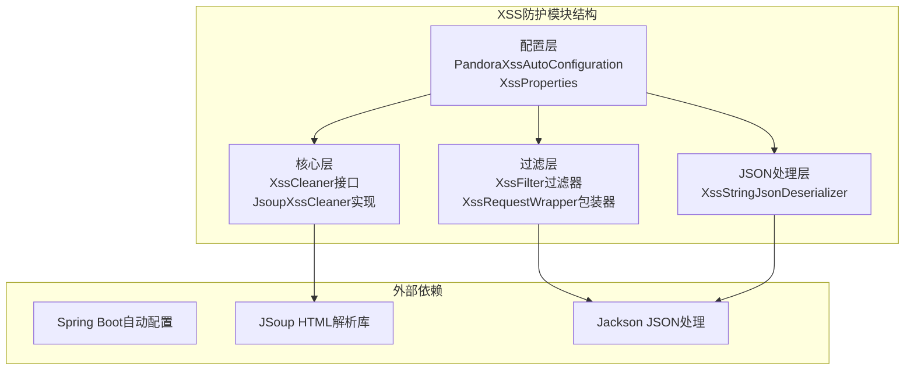
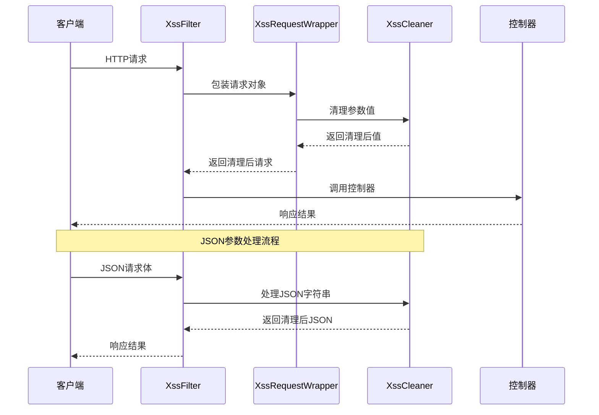
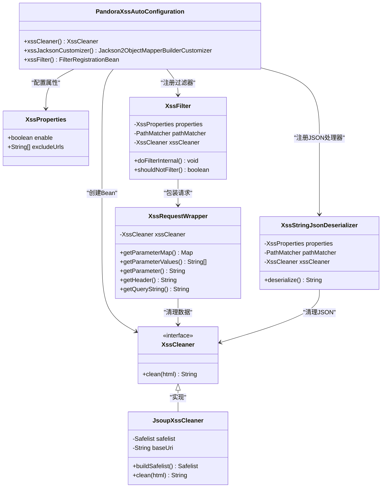
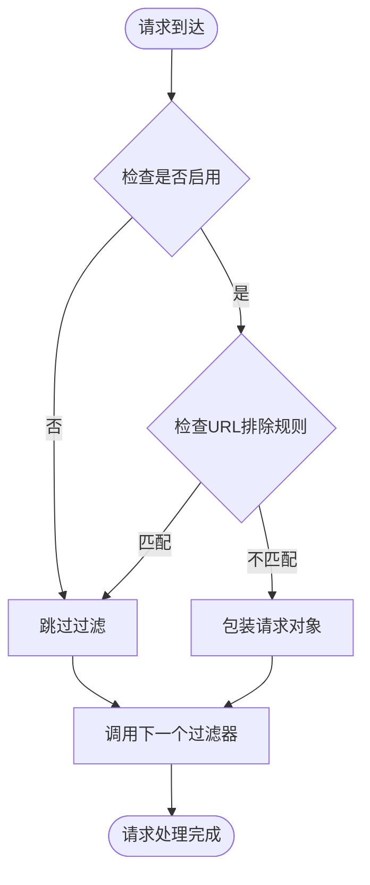
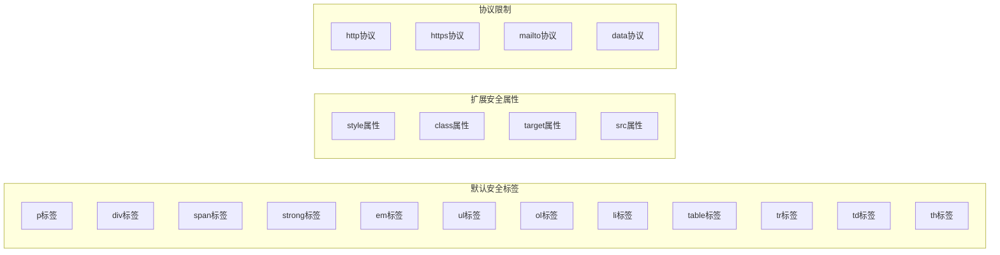
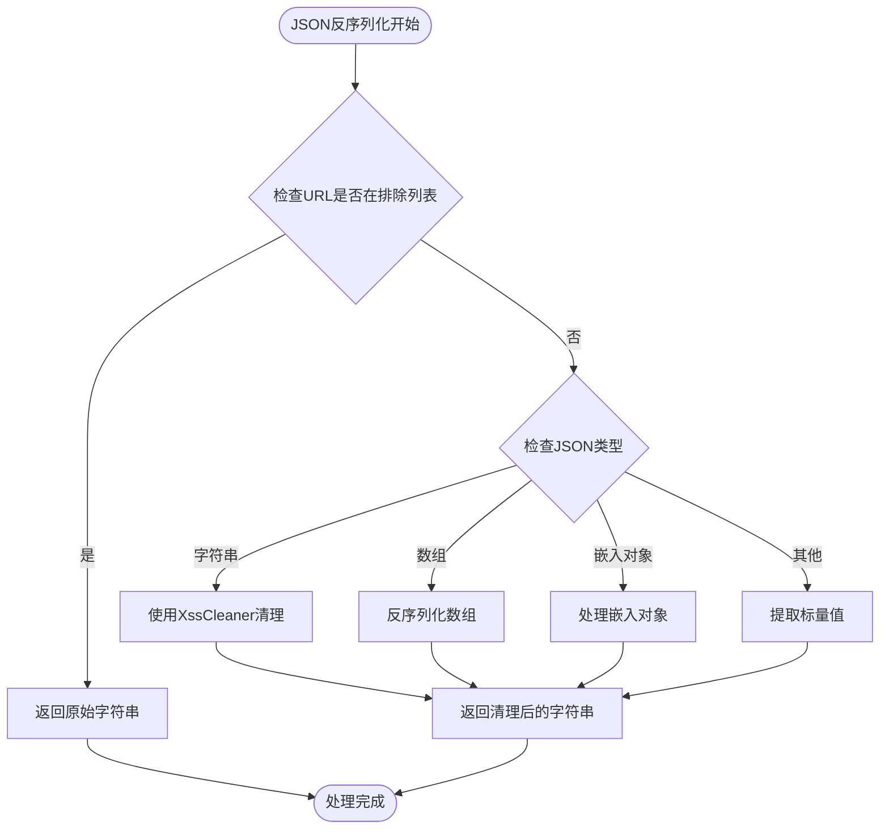
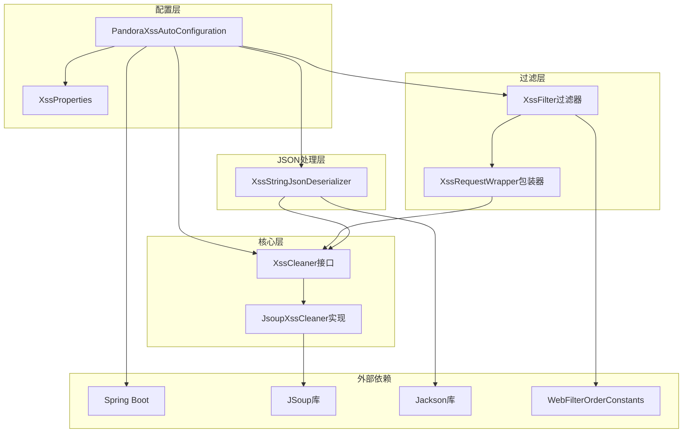

# XSS防护模块

<cite>
**本文档引用的文件**
- [PandoraXssAutoConfiguration.java](file://pandora-framework/pandora-spring-boot-starter-web/src/main/java/net/ittimeline/pandora/framework/xss/config/PandoraXssAutoConfiguration.java)
- [XssProperties.java](file://pandora-framework/pandora-spring-boot-starter-web/src/main/java/net/ittimeline/pandora/framework/xss/config/XssProperties.java)
- [XssFilter.java](file://pandora-framework/pandora-spring-boot-starter-web/src/main/java/net/ittimeline/pandora/framework/xss/core/filter/XssFilter.java)
- [XssRequestWrapper.java](file://pandora-framework/pandora-spring-boot-starter-web/src/main/java/net/ittimeline/pandora/framework/xss/core/filter/XssRequestWrapper.java)
- [XssCleaner.java](file://pandora-framework/pandora-spring-boot-starter-web/src/main/java/net/ittimeline/pandora/framework/xss/core/clean/XssCleaner.java)
- [JsoupXssCleaner.java](file://pandora-framework/pandora-spring-boot-starter-web/src/main/java/net/ittimeline/pandora/framework/xss/core/clean/JsoupXssCleaner.java)
- [XssStringJsonDeserializer.java](file://pandora-framework/pandora-spring-boot-starter-web/src/main/java/net/ittimeline/pandora/framework/xss/core/json/XssStringJsonDeserializer.java)
- [WebFilterOrderConstants.java](file://pandora-framework/pandora-common/src/main/java/net/ittimeline/pandora/framework/common/constants/WebFilterOrderConstants.java)
- [PandoraWebAutoConfiguration.java](file://pandora-framework/pandora-spring-boot-starter-web/src/main/java/net/ittimeline/pandora/framework/web/config/PandoraWebAutoConfiguration.java)
</cite>

## 目录
1. [简介](#简介)
2. [项目结构](#项目结构)
3. [核心组件](#核心组件)
4. [架构概览](#架构概览)
5. [详细组件分析](#详细组件分析)
6. [依赖关系分析](#依赖关系分析)
7. [性能考虑](#性能考虑)
8. [故障排查指南](#故障排查指南)
9. [结论](#结论)

## 简介

Pandora Cloud框架的XSS防护模块是一个基于Spring Boot自动配置的安全组件，专门用于防止跨站脚本攻击(XSS)。该模块通过多层次的防护机制，包括HTTP请求过滤、JSON参数处理和HTML内容清理，为应用程序提供全面的XSS保护。

XSS防护模块的核心设计目标是在不影响用户体验的前提下，有效拦截恶意脚本注入，同时保持系统的高性能和易维护性。模块采用可插拔的清理器设计，允许开发者根据具体需求选择不同的清理策略。

## 项目结构

XSS防护模块位于pandora-framework的web启动器中，采用清晰的分层架构组织：

**图表来源**
- [PandoraXssAutoConfiguration.java:1-69](file://pandora-framework/pandora-spring-boot-starter-web/src/main/java/net/ittimeline/pandora/framework/xss/config/PandoraXssAutoConfiguration.java#L1-L69)
- [XssProperties.java:1-30](file://pandora-framework/pandora-spring-boot-starter-web/src/main/java/net/ittimeline/pandora/framework/xss/config/XssProperties.java#L1-L30)

**章节来源**
- [PandoraXssAutoConfiguration.java:1-69](file://pandora-framework/pandora-spring-boot-starter-web/src/main/java/net/ittimeline/pandora/framework/xss/config/PandoraXssAutoConfiguration.java#L1-L69)
- [XssProperties.java:1-30](file://pandora-framework/pandora-spring-boot-starter-web/src/main/java/net/ittimeline/pandora/framework/xss/config/XssProperties.java#L1-L30)

## 核心组件

XSS防护模块由四个核心组件构成，每个组件都有明确的职责分工：

### 接口层
- **XssCleaner接口**: 定义统一的清理器规范，提供clean()方法用于清理XSS风险内容

### 实现层
- **JsoupXssCleaner**: 基于JSoup库的HTML清理器，提供强大的HTML标签和属性验证功能

### 过滤层
- **XssFilter**: HTTP请求过滤器，拦截并处理所有进入系统的HTTP请求
- **XssRequestWrapper**: 请求包装器，重写参数、头部和查询字符串的获取方法

### 配置层
- **XssProperties**: 配置属性类，支持启用/禁用和URL排除规则
- **PandoraXssAutoConfiguration**: 自动配置类，负责组件的装配和初始化

**章节来源**
- [XssCleaner.java:1-20](file://pandora-framework/pandora-spring-boot-starter-web/src/main/java/net/ittimeline/pandora/framework/xss/core/clean/XssCleaner.java#L1-L20)
- [JsoupXssCleaner.java:1-67](file://pandora-framework/pandora-spring-boot-starter-web/src/main/java/net/ittimeline/pandora/framework/xss/core/clean/JsoupXssCleaner.java#L1-L67)
- [XssFilter.java:1-55](file://pandora-framework/pandora-spring-boot-starter-web/src/main/java/net/ittimeline/pandora/framework/xss/core/filter/XssFilter.java#L1-L55)
- [XssRequestWrapper.java:1-94](file://pandora-framework/pandora-spring-boot-starter-web/src/main/java/net/ittimeline/pandora/framework/xss/core/filter/XssRequestWrapper.java#L1-L94)

## 架构概览

XSS防护模块采用多层防护架构，确保从不同维度拦截潜在的XSS攻击：

**图表来源**
- [XssFilter.java:36-40](file://pandora-framework/pandora-spring-boot-starter-web/src/main/java/net/ittimeline/pandora/framework/xss/core/filter/XssFilter.java#L36-L40)
- [XssRequestWrapper.java:27-62](file://pandora-framework/pandora-spring-boot-starter-web/src/main/java/net/ittimeline/pandora/framework/xss/core/filter/XssRequestWrapper.java#L27-L62)
- [XssStringJsonDeserializer.java:42-55](file://pandora-framework/pandora-spring-boot-starter-web/src/main/java/net/ittimeline/pandora/framework/xss/core/json/XssStringJsonDeserializer.java#L42-L55)

## 详细组件分析

### 自动配置机制

PandoraXssAutoConfiguration是整个XSS防护模块的核心配置类，它实现了Spring Boot的自动配置机制：

**图表来源**
- [PandoraXssAutoConfiguration.java:31-66](file://pandora-framework/pandora-spring-boot-starter-web/src/main/java/net/ittimeline/pandora/framework/xss/config/PandoraXssAutoConfiguration.java#L31-L66)
- [XssProperties.java:19-29](file://pandora-framework/pandora-spring-boot-starter-web/src/main/java/net/ittimeline/pandora/framework/xss/config/XssProperties.java#L19-L29)
- [JsoupXssCleaner.java:14-67](file://pandora-framework/pandora-spring-boot-starter-web/src/main/java/net/ittimeline/pandora/framework/xss/core/clean/JsoupXssCleaner.java#L14-L67)
- [XssFilter.java:23-54](file://pandora-framework/pandora-spring-boot-starter-web/src/main/java/net/ittimeline/pandora/framework/xss/core/filter/XssFilter.java#L23-L54)
- [XssRequestWrapper.java:17-94](file://pandora-framework/pandora-spring-boot-starter-web/src/main/java/net/ittimeline/pandora/framework/xss/core/filter/XssRequestWrapper.java#L17-L94)
- [XssStringJsonDeserializer.java:28-84](file://pandora-framework/pandora-spring-boot-starter-web/src/main/java/net/ittimeline/pandora/framework/xss/core/json/XssStringJsonDeserializer.java#L28-L84)

### XssFilter过滤器

XssFilter是HTTP请求的入口过滤器，负责拦截所有进入系统的HTTP请求：

#### 核心功能特性
- **条件过滤**: 支持基于配置的启用/禁用控制
- **URL排除**: 允许指定不需要过滤的URL模式
- **一次性过滤**: 继承OncePerRequestFilter，确保每个请求只处理一次
- **链式调用**: 将请求传递给后续过滤器链

#### 过滤逻辑流程

**图表来源**
- [XssFilter.java:42-52](file://pandora-framework/pandora-spring-boot-starter-web/src/main/java/net/ittimeline/pandora/framework/xss/core/filter/XssFilter.java#L42-L52)

**章节来源**
- [XssFilter.java:1-55](file://pandora-framework/pandora-spring-boot-starter-web/src/main/java/net/ittimeline/pandora/framework/xss/core/filter/XssFilter.java#L1-L55)

### XssRequestWrapper请求包装器

XssRequestWrapper通过装饰器模式重写了HttpServletRequest的关键方法，实现对请求数据的自动清理：

#### 数据清理范围
- **参数映射**: 清理所有表单参数
- **参数数组**: 清理参数数组中的每个元素
- **单个参数**: 清理指定名称的参数值
- **请求属性**: 清理请求属性中的字符串值
- **HTTP头部**: 清理所有HTTP头部值
- **查询字符串**: 清理URL查询参数

#### 清理策略
包装器采用统一的清理策略，对所有字符串类型的输入数据进行XSS清理，确保数据在进入业务逻辑之前已经被净化。

**章节来源**
- [XssRequestWrapper.java:1-94](file://pandora-framework/pandora-spring-boot-starter-web/src/main/java/net/ittimeline/pandora/framework/xss/core/filter/XssRequestWrapper.java#L1-L94)

### XssCleaner清理器接口

XssCleaner定义了统一的清理器规范，为不同的清理策略提供抽象接口：

#### 设计原则
- **接口隔离**: 仅定义必要的clean()方法
- **简单职责**: 专注于单一的清理功能
- **可扩展性**: 支持多种清理器实现

#### 清理要求
- **输入验证**: 接受原始HTML或字符串输入
- **输出保证**: 返回经过清理的安全内容
- **性能考虑**: 在保证安全的前提下尽量减少处理开销

**章节来源**
- [XssCleaner.java:1-20](file://pandora-framework/pandora-spring-boot-starter-web/src/main/java/net/ittimeline/pandora/framework/xss/core/clean/XssCleaner.java#L1-L20)

### JsoupXssCleaner清理器

JsoupXssCleaner是XSS防护的核心实现，基于JSoup库的强大HTML处理能力：

#### 安全白名单配置

**图表来源**
- [JsoupXssCleaner.java:40-60](file://pandora-framework/pandora-spring-boot-starter-web/src/main/java/net/ittimeline/pandora/framework/xss/core/clean/JsoupXssCleaner.java#L40-L60)

#### 核心清理算法

1. **HTML解析**: 使用JSoup解析输入的HTML内容
2. **白名单验证**: 基于预定义的安全白名单验证标签和属性
3. **协议过滤**: 严格限制危险协议的使用
4. **内容清理**: 移除或转义潜在的恶意内容
5. **输出生成**: 生成安全的HTML输出

#### 安全特性
- **标签白名单**: 仅允许预定义的安全HTML标签
- **属性白名单**: 仅允许安全的HTML属性
- **协议限制**: 严格限制危险协议如javascript:
- **内容转义**: 自动转义潜在的恶意字符

**章节来源**
- [JsoupXssCleaner.java:1-67](file://pandora-framework/pandora-spring-boot-starter-web/src/main/java/net/ittimeline/pandora/framework/xss/core/clean/JsoupXssCleaner.java#L1-L67)

### JSON参数处理

XssStringJsonDeserializer专门处理JSON格式的请求参数，提供额外的XSS防护层：

#### 处理流程

**图表来源**
- [XssStringJsonDeserializer.java:42-83](file://pandora-framework/pandora-spring-boot-starter-web/src/main/java/net/ittimeline/pandora/framework/xss/core/json/XssStringJsonDeserializer.java#L42-L83)

#### 支持的JSON类型
- **字符串类型**: 直接进行XSS清理
- **数组类型**: 递归处理数组元素
- **嵌入对象**: 处理字节数组等特殊类型
- **标量类型**: 提取并清理标量值

**章节来源**
- [XssStringJsonDeserializer.java:1-84](file://pandora-framework/pandora-spring-boot-starter-web/src/main/java/net/ittimeline/pandora/framework/xss/core/json/XssStringJsonDeserializer.java#L1-L84)

## 依赖关系分析

XSS防护模块的依赖关系体现了清晰的分层架构和松耦合设计：

**图表来源**
- [PandoraXssAutoConfiguration.java:3-7](file://pandora-framework/pandora-spring-boot-starter-web/src/main/java/net/ittimeline/pandora/framework/xss/config/PandoraXssAutoConfiguration.java#L3-L7)
- [WebFilterOrderConstants.java:11-37](file://pandora-framework/pandora-common/src/main/java/net/ittimeline/pandora/framework/common/constants/WebFilterOrderConstants.java#L11-L37)

### 关键依赖特性

1. **条件装配**: 使用@ConditionalOnProperty和@ConditionalOnBean实现智能装配
2. **接口抽象**: 通过XssCleaner接口实现清理策略的可插拔性
3. **装饰器模式**: XssRequestWrapper采用装饰器模式增强请求对象功能
4. **自动配置**: 完全基于Spring Boot的自动配置机制

**章节来源**
- [PandoraXssAutoConfiguration.java:27-66](file://pandora-framework/pandora-spring-boot-starter-web/src/main/java/net/ittimeline/pandora/framework/xss/config/PandoraXssAutoConfiguration.java#L27-L66)

## 性能考虑

XSS防护模块在设计时充分考虑了性能优化，采用多种策略确保系统在高并发场景下的稳定性：

### 性能优化策略

#### 1. 懒加载机制
- 清理器实例在首次使用时创建，避免不必要的内存占用
- JSON反序列化器按需注册，减少启动时间

#### 2. 缓存友好的设计
- 使用静态白名单配置，避免运行时动态构建
- 参数清理结果不缓存，确保每次请求都获得最新的清理结果

#### 3. 流水线处理
- 过滤器链式调用，每个组件只负责特定的处理任务
- 异常快速失败，避免无效的处理尝试

#### 4. 内存管理
- 使用LinkedHashMap保持参数顺序
- 及时释放临时对象，避免内存泄漏

### 性能监控建议

1. **过滤器性能**: 监控XssFilter的处理时间和错误率
2. **清理器性能**: 跟踪JsoupXssCleaner的处理效率
3. **内存使用**: 监控请求包装器的内存占用情况
4. **并发处理**: 分析高并发场景下的系统表现

## 故障排查指南

### 常见问题及解决方案

#### 1. 过滤器未生效
**症状**: XSS防护不起作用
**可能原因**:
- 配置属性pandora.xss.enable设置为false
- URL被排除在过滤范围之外
- 过滤器注册顺序不正确

**解决方案**:
- 检查配置属性设置
- 验证excludeUrls配置
- 确认过滤器顺序

#### 2. 正常内容被误判
**症状**: 用户输入的合法HTML标签被移除
**可能原因**:
- 白名单配置过于严格
- 特定标签或属性被误判为危险

**解决方案**:
- 检查JsoupXssCleaner的白名单配置
- 考虑自定义清理器实现
- 调整安全级别

#### 3. JSON参数处理异常
**症状**: JSON请求处理失败或数据丢失
**可能原因**:
- JSON反序列化器配置错误
- 特殊数据类型处理不当

**解决方案**:
- 检查XssStringJsonDeserializer的配置
- 验证PathMatcher的匹配规则
- 测试各种JSON数据类型的处理

### 调试技巧

1. **日志记录**: 启用详细的日志记录来跟踪清理过程
2. **单元测试**: 编写针对各种XSS攻击向量的测试用例
3. **性能测试**: 使用压力测试工具验证系统的稳定性
4. **安全审计**: 定期进行安全审计和漏洞扫描

**章节来源**
- [XssFilter.java:42-52](file://pandora-framework/pandora-spring-boot-starter-web/src/main/java/net/ittimeline/pandora/framework/xss/core/filter/XssFilter.java#L42-L52)
- [XssStringJsonDeserializer.java:42-50](file://pandora-framework/pandora-spring-boot-starter-web/src/main/java/net/ittimeline/pandora/framework/xss/core/json/XssStringJsonDeserializer.java#L42-L50)

## 结论

Pandora Cloud框架的XSS防护模块通过精心设计的多层防护架构，为现代Web应用提供了全面而高效的XSS保护。模块的主要优势包括：

### 技术优势
- **多层次防护**: 从HTTP请求到JSON参数的全方位保护
- **可插拔设计**: 支持自定义清理器实现
- **智能配置**: 基于Spring Boot的自动配置机制
- **性能优化**: 采用多种策略确保高并发场景下的稳定性

### 最佳实践建议
1. **合理配置**: 根据业务需求调整安全级别和排除规则
2. **定期更新**: 及时更新JSoup库和清理策略
3. **监控告警**: 建立完善的监控和告警机制
4. **安全测试**: 定期进行渗透测试和安全评估

### 扩展性考虑
模块设计充分考虑了未来的扩展需求，开发者可以根据具体业务场景：
- 自定义清理器实现
- 扩展过滤规则
- 集成其他安全组件
- 优化性能配置

通过这些设计，XSS防护模块不仅能够有效防范当前已知的XSS攻击，还能够适应未来可能出现的新威胁，为Pandora Cloud框架提供长期可靠的安全保障。