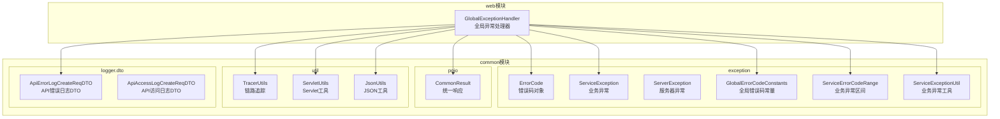
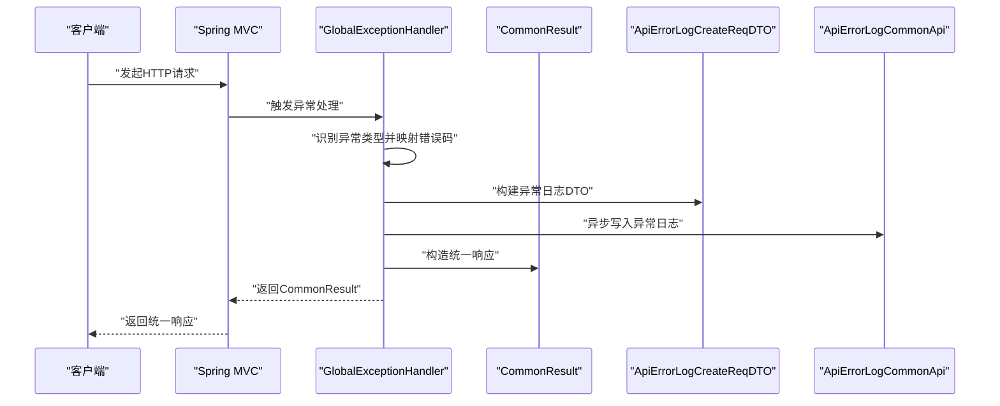
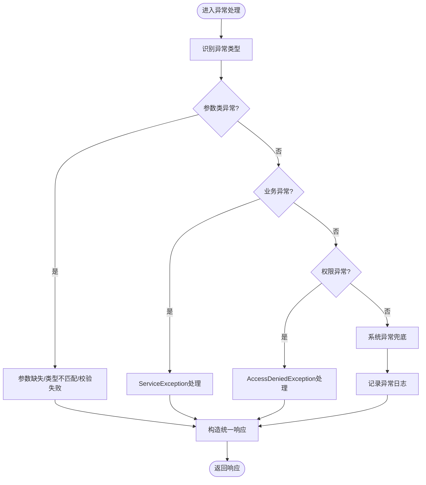
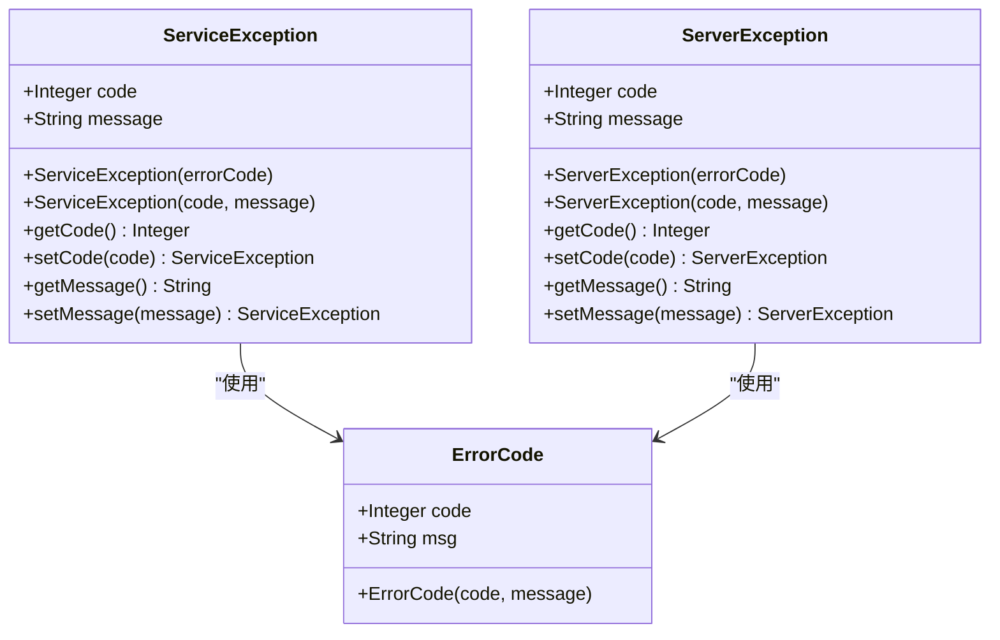
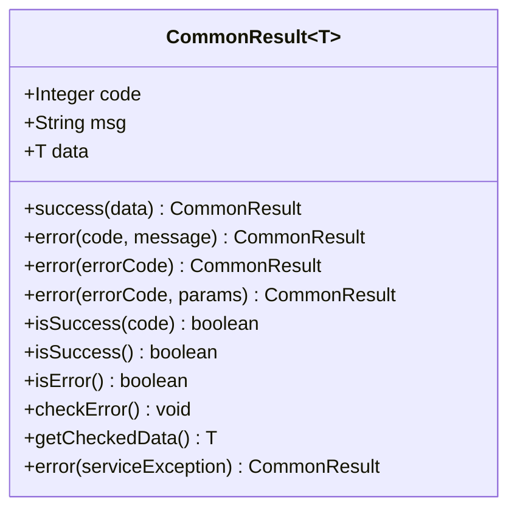
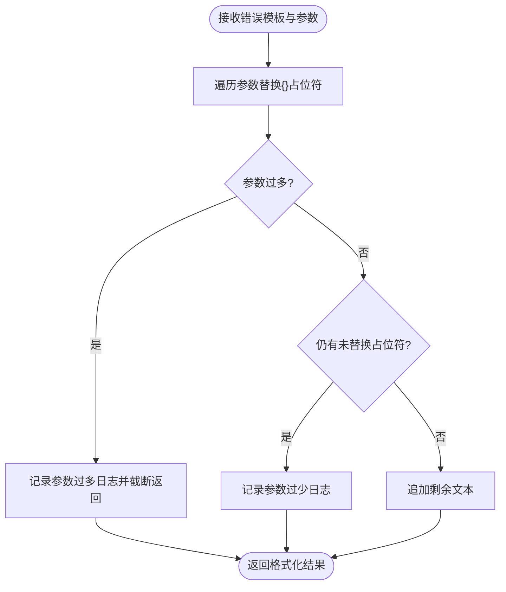
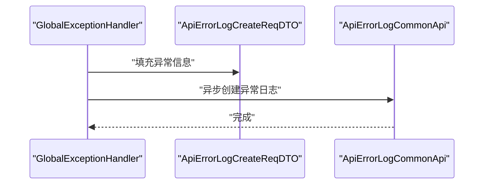
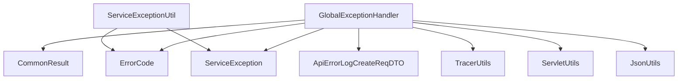

# 全局异常处理

<cite>
**本文引用的文件**
- [GlobalExceptionHandler.java](file://pandora-framework/pandora-spring-boot-starter-web/src/main/java/net/ittimeline/pandora/framework/web/core/handler/GlobalExceptionHandler.java)
- [ErrorCode.java](file://pandora-framework/pandora-common/src/main/java/net/ittimeline/pandora/framework/common/exception/ErrorCode.java)
- [ServiceException.java](file://pandora-framework/pandora-common/src/main/java/net/ittimeline/pandora/framework/common/exception/ServiceException.java)
- [ServerException.java](file://pandora-framework/pandora-common/src/main/java/net/ittimeline/pandora/framework/common/exception/ServerException.java)
- [GlobalErrorCodeConstants.java](file://pandora-framework/pandora-common/src/main/java/net/ittimeline/pandora/framework/common/exception/enums/GlobalErrorCodeConstants.java)
- [ServiceErrorCodeRange.java](file://pandora-framework/pandora-common/src/main/java/net/ittimeline/pandora/framework/common/exception/enums/ServiceErrorCodeRange.java)
- [ServiceExceptionUtil.java](file://pandora-framework/pandora-common/src/main/java/net/ittimeline/pandora/framework/common/exception/util/ServiceExceptionUtil.java)
- [CommonResult.java](file://pandora-framework/pandora-common/src/main/java/net/ittimeline/pandora/framework/common/pojo/CommonResult.java)
- [ApiErrorLogCreateReqDTO.java](file://pandora-framework/pandora-common/src/main/java/net/ittimeline/pandora/framework/common/biz/infra/logger/dto/ApiErrorLogCreateReqDTO.java)
- [ApiAccessLogCreateReqDTO.java](file://pandora-framework/pandora-common/src/main/java/net/ittimeline/pandora/framework/common/biz/infra/logger/dto/ApiAccessLogCreateReqDTO.java)
- [TracerUtils.java](file://pandora-framework/pandora-common/src/main/java/net/ittimeline/pandora/framework/common/util/web/monitor/TracerUtils.java)
- [ServletUtils.java](file://pandora-framework/pandora-common/src/main/java/net/ittimeline/pandora/framework/common/util/web/servlet/ServletUtils.java)
- [JsonUtils.java](file://pandora-framework/pandora-common/src/main/java/net/ittimeline/pandora/framework/common/util/web/json/JsonUtils.java)
</cite>

## 目录
1. [简介](#简介)
2. [项目结构](#项目结构)
3. [核心组件](#核心组件)
4. [架构总览](#架构总览)
5. [详细组件分析](#详细组件分析)
6. [依赖分析](#依赖分析)
7. [性能考虑](#性能考虑)
8. [故障排查指南](#故障排查指南)
9. [结论](#结论)
10. [附录](#附录)

## 简介
本文件面向Pandora Cloud框架的全局异常处理能力，围绕GlobalExceptionHandler类展开，系统性阐述异常捕获、错误码映射、统一响应格式化、异常日志记录与错误信息返回的最佳实践，并提供自定义异常处理器的扩展方法。同时，文档解释如何通过ErrorCode定义业务异常，ServiceException的使用场景与参数配置，以及常见异常类型的处理示例。

## 项目结构
全局异常处理相关代码主要分布在以下模块与包中：
- web模块：提供@RestControllerAdvice全局异常处理入口与Web上下文工具
- common模块exception子包：提供异常体系、错误码与统一响应
- common模块util子包：提供Web工具、链路追踪、JSON序列化等支撑能力
- common模块logger子包：提供API访问日志与API错误日志的数据传输对象

图表来源
- [GlobalExceptionHandler.java:57-69](file://pandora-framework/pandora-spring-boot-starter-web/src/main/java/net/ittimeline/pandora/framework/web/core/handler/GlobalExceptionHandler.java#L57-L69)
- [ErrorCode.java:18-32](file://pandora-framework/pandora-common/src/main/java/net/ittimeline/pandora/framework/common/exception/ErrorCode.java#L18-L32)
- [ServiceException.java:15-63](file://pandora-framework/pandora-common/src/main/java/net/ittimeline/pandora/framework/common/exception/ServiceException.java#L15-L63)
- [ServerException.java:16-64](file://pandora-framework/pandora-common/src/main/java/net/ittimeline/pandora/framework/common/exception/ServerException.java#L16-L64)
- [GlobalErrorCodeConstants.java:16-41](file://pandora-framework/pandora-common/src/main/java/net/ittimeline/pandora/framework/common/exception/enums/GlobalErrorCodeConstants.java#L16-L41)
- [ServiceErrorCodeRange.java:31-47](file://pandora-framework/pandora-common/src/main/java/net/ittimeline/pandora/framework/common/exception/enums/ServiceErrorCodeRange.java#L31-L47)
- [ServiceExceptionUtil.java:19-84](file://pandora-framework/pandora-common/src/main/java/net/ittimeline/pandora/framework/common/exception/util/ServiceExceptionUtil.java#L19-L84)
- [CommonResult.java:22-122](file://pandora-framework/pandora-common/src/main/java/net/ittimeline/pandora/framework/common/pojo/CommonResult.java#L22-L122)
- [ApiErrorLogCreateReqDTO.java:18-73](file://pandora-framework/pandora-common/src/main/java/net/ittimeline/pandora/framework/common/biz/infra/logger/dto/ApiErrorLogCreateReqDTO.java#L18-L73)
- [ApiAccessLogCreateReqDTO.java:16-105](file://pandora-framework/pandora-common/src/main/java/net/ittimeline/pandora/framework/common/biz/infra/logger/dto/ApiAccessLogCreateReqDTO.java#L16-L105)
- [TracerUtils.java:26-28](file://pandora-framework/pandora-common/src/main/java/net/ittimeline/pandora/framework/common/util/web/monitor/TracerUtils.java#L26-L28)
- [ServletUtils.java:49-99](file://pandora-framework/pandora-common/src/main/java/net/ittimeline/pandora/framework/common/util/web/servlet/ServletUtils.java#L49-L99)
- [JsonUtils.java:61-68](file://pandora-framework/pandora-common/src/main/java/net/ittimeline/pandora/framework/common/util/web/json/JsonUtils.java#L61-L68)

章节来源
- [GlobalExceptionHandler.java:57-69](file://pandora-framework/pandora-spring-boot-starter-web/src/main/java/net/ittimeline/pandora/framework/web/core/handler/GlobalExceptionHandler.java#L57-L69)
- [CommonResult.java:22-122](file://pandora-framework/pandora-common/src/main/java/net/ittimeline/pandora/framework/common/pojo/CommonResult.java#L22-L122)

## 核心组件
- 全局异常处理器：负责捕获各类异常，映射到统一错误码与响应格式，并记录异常日志。
- 错误码体系：ErrorCode封装错误码与消息；GlobalErrorCodeConstants提供全局错误码常量；ServiceErrorCodeRange定义业务异常区间规范。
- 业务异常：ServiceException承载业务错误码与消息；ServerException用于服务器级异常。
- 统一响应：CommonResult提供统一的code/msg/data结构，支持success/error/checkError等便捷方法。
- 异常工具：ServiceExceptionUtil提供消息格式化与快速构造业务异常的能力。
- 日志与工具：ApiErrorLogCreateReqDTO记录异常详情；TracerUtils/ServletUtils/JsonUtils提供链路追踪、请求上下文与JSON序列化支持。

章节来源
- [GlobalExceptionHandler.java:57-69](file://pandora-framework/pandora-spring-boot-starter-web/src/main/java/net/ittimeline/pandora/framework/web/core/handler/GlobalExceptionHandler.java#L57-L69)
- [ErrorCode.java:18-32](file://pandora-framework/pandora-common/src/main/java/net/ittimeline/pandora/framework/common/exception/ErrorCode.java#L18-L32)
- [ServiceException.java:15-63](file://pandora-framework/pandora-common/src/main/java/net/ittimeline/pandora/framework/common/exception/ServiceException.java#L15-L63)
- [ServerException.java:16-64](file://pandora-framework/pandora-common/src/main/java/net/ittimeline/pandora/framework/common/exception/ServerException.java#L16-L64)
- [GlobalErrorCodeConstants.java:16-41](file://pandora-framework/pandora-common/src/main/java/net/ittimeline/pandora/framework/common/exception/enums/GlobalErrorCodeConstants.java#L16-L41)
- [ServiceErrorCodeRange.java:31-47](file://pandora-framework/pandora-common/src/main/java/net/ittimeline/pandora/framework/common/exception/enums/ServiceErrorCodeRange.java#L31-L47)
- [ServiceExceptionUtil.java:19-84](file://pandora-framework/pandora-common/src/main/java/net/ittimeline/pandora/framework/common/exception/util/ServiceExceptionUtil.java#L19-L84)
- [CommonResult.java:22-122](file://pandora-framework/pandora-common/src/main/java/net/ittimeline/pandora/framework/common/pojo/CommonResult.java#L22-L122)
- [ApiErrorLogCreateReqDTO.java:18-73](file://pandora-framework/pandora-common/src/main/java/net/ittimeline/pandora/framework/common/biz/infra/logger/dto/ApiErrorLogCreateReqDTO.java#L18-L73)
- [TracerUtils.java:26-28](file://pandora-framework/pandora-common/src/main/java/net/ittimeline/pandora/framework/common/util/web/monitor/TracerUtils.java#L26-L28)
- [ServletUtils.java:49-99](file://pandora-framework/pandora-common/src/main/java/net/ittimeline/pandora/framework/common/util/web/servlet/ServletUtils.java#L49-L99)
- [JsonUtils.java:61-68](file://pandora-framework/pandora-common/src/main/java/net/ittimeline/pandora/framework/common/util/web/json/JsonUtils.java#L61-L68)

## 架构总览
全局异常处理采用Spring MVC的@RestControllerAdvice机制，结合Web工具与日志组件，形成从异常捕获到统一响应与异常日志记录的闭环。

图表来源
- [GlobalExceptionHandler.java:79-120](file://pandora-framework/pandora-spring-boot-starter-web/src/main/java/net/ittimeline/pandora/framework/web/core/handler/GlobalExceptionHandler.java#L79-L120)
- [GlobalExceptionHandler.java:343-354](file://pandora-framework/pandora-spring-boot-starter-web/src/main/java/net/ittimeline/pandora/framework/web/core/handler/GlobalExceptionHandler.java#L343-L354)
- [ApiErrorLogCreateReqDTO.java:18-73](file://pandora-framework/pandora-common/src/main/java/net/ittimeline/pandora/framework/common/biz/infra/logger/dto/ApiErrorLogCreateReqDTO.java#L18-L73)

## 详细组件分析

### GlobalExceptionHandler：全局异常处理机制
- 角色定位：基于@RestControllerAdvice，统一捕获并处理各类异常，输出统一响应。
- 关键职责：
  - 异常类型识别与映射：针对参数缺失、类型不匹配、参数校验失败、资源不存在、方法不支持、媒体类型不支持、权限不足、Guava异步异常、业务异常、系统异常等进行专门处理。
  - 统一响应生成：通过CommonResult.error(...)输出统一响应，确保code/msg/data结构一致。
  - 异常日志记录：构建ApiErrorLogCreateReqDTO，异步写入异常日志，便于后续审计与定位。
  - 表结构缺失特判：对数据库表不存在的根因进行模块化提示，引导用户导入对应模块的表结构。
  - 性能与可观测性：利用TracerUtils注入TraceId，结合ServletUtils获取请求上下文，保证日志可追踪。
- 扩展点：
  - 新增异常类型：在allExceptionHandler或新增@ExceptionHandler中添加分支，映射到相应错误码。
  - 自定义忽略策略：通过IGNORE_ERROR_MESSAGES集合控制特定业务提示的打印频率。
  - 异步日志：apiErrorLogApi.createApiErrorLogAsync保证不影响主流程响应。

图表来源
- [GlobalExceptionHandler.java:79-120](file://pandora-framework/pandora-spring-boot-starter-web/src/main/java/net/ittimeline/pandora/framework/web/core/handler/GlobalExceptionHandler.java#L79-L120)
- [GlobalExceptionHandler.java:298-341](file://pandora-framework/pandora-spring-boot-starter-web/src/main/java/net/ittimeline/pandora/framework/web/core/handler/GlobalExceptionHandler.java#L298-L341)
- [GlobalExceptionHandler.java:343-384](file://pandora-framework/pandora-spring-boot-starter-web/src/main/java/net/ittimeline/pandora/framework/web/core/handler/GlobalExceptionHandler.java#L343-L384)

章节来源
- [GlobalExceptionHandler.java:57-69](file://pandora-framework/pandora-spring-boot-starter-web/src/main/java/net/ittimeline/pandora/framework/web/core/handler/GlobalExceptionHandler.java#L57-L69)
- [GlobalExceptionHandler.java:79-120](file://pandora-framework/pandora-spring-boot-starter-web/src/main/java/net/ittimeline/pandora/framework/web/core/handler/GlobalExceptionHandler.java#L79-L120)
- [GlobalExceptionHandler.java:298-341](file://pandora-framework/pandora-spring-boot-starter-web/src/main/java/net/ittimeline/pandora/framework/web/core/handler/GlobalExceptionHandler.java#L298-L341)
- [GlobalExceptionHandler.java:343-384](file://pandora-framework/pandora-spring-boot-starter-web/src/main/java/net/ittimeline/pandora/framework/web/core/handler/GlobalExceptionHandler.java#L343-L384)

### 错误码与异常类型：ErrorCode、ServiceException、ServerException
- ErrorCode：封装错误码与消息，作为全局与业务异常的载体。
- ServiceException：业务异常，携带业务错误码与消息，由业务层主动抛出。
- ServerException：服务器异常，通常用于框架或基础设施层面的异常。
- 错误码常量：GlobalErrorCodeConstants提供HTTP语义化的全局错误码；ServiceErrorCodeRange定义业务异常的区间规范，避免冲突。

图表来源
- [ErrorCode.java:18-32](file://pandora-framework/pandora-common/src/main/java/net/ittimeline/pandora/framework/common/exception/ErrorCode.java#L18-L32)
- [ServiceException.java:15-63](file://pandora-framework/pandora-common/src/main/java/net/ittimeline/pandora/framework/common/exception/ServiceException.java#L15-L63)
- [ServerException.java:16-64](file://pandora-framework/pandora-common/src/main/java/net/ittimeline/pandora/framework/common/exception/ServerException.java#L16-L64)

章节来源
- [ErrorCode.java:18-32](file://pandora-framework/pandora-common/src/main/java/net/ittimeline/pandora/framework/common/exception/ErrorCode.java#L18-L32)
- [ServiceException.java:15-63](file://pandora-framework/pandora-common/src/main/java/net/ittimeline/pandora/framework/common/exception/ServiceException.java#L15-L63)
- [ServerException.java:16-64](file://pandora-framework/pandora-common/src/main/java/net/ittimeline/pandora/framework/common/exception/ServerException.java#L16-L64)
- [GlobalErrorCodeConstants.java:16-41](file://pandora-framework/pandora-common/src/main/java/net/ittimeline/pandora/framework/common/exception/enums/GlobalErrorCodeConstants.java#L16-L41)
- [ServiceErrorCodeRange.java:31-47](file://pandora-framework/pandora-common/src/main/java/net/ittimeline/pandora/framework/common/exception/enums/ServiceErrorCodeRange.java#L31-L47)

### 统一响应：CommonResult
- 结构：code、msg、data三段式，支持静态工厂方法快速构造成功/错误响应。
- 集成：与异常体系无缝衔接，checkError用于将错误结果转换为ServiceException以便继续传播。
- 成功判断：isSuccess/isError辅助判断响应状态。

图表来源
- [CommonResult.java:22-122](file://pandora-framework/pandora-common/src/main/java/net/ittimeline/pandora/framework/common/pojo/CommonResult.java#L22-L122)

章节来源
- [CommonResult.java:22-122](file://pandora-framework/pandora-common/src/main/java/net/ittimeline/pandora/framework/common/pojo/CommonResult.java#L22-L122)

### 异常工具：ServiceExceptionUtil
- 功能：提供doFormat实现安全的消息格式化，避免String.format的参数不匹配风险；提供exception/invalidParamException等便捷方法。
- 设计：使用{}作为占位符，遍历参数逐个替换，多余/缺少参数均进行日志告警。

图表来源
- [ServiceExceptionUtil.java:50-82](file://pandora-framework/pandora-common/src/main/java/net/ittimeline/pandora/framework/common/exception/util/ServiceExceptionUtil.java#L50-L82)

章节来源
- [ServiceExceptionUtil.java:19-84](file://pandora-framework/pandora-common/src/main/java/net/ittimeline/pandora/framework/common/exception/util/ServiceExceptionUtil.java#L19-L84)

### 异常日志：ApiErrorLogCreateReqDTO与异步记录
- DTO字段覆盖：链路ID、用户信息、请求方法/URL/参数、异常类名/方法/行号、异常栈、根因消息、异常时间等。
- 记录流程：GlobalExceptionHandler在defaultExceptionHandler中构建DTO并通过apiErrorLogApi异步写入，避免阻塞主流程。
- 工具配合：TracerUtils获取TraceId；ServletUtils获取UA/IP/Body/参数；JsonUtils序列化请求参数。

图表来源
- [GlobalExceptionHandler.java:343-384](file://pandora-framework/pandora-spring-boot-starter-web/src/main/java/net/ittimeline/pandora/framework/web/core/handler/GlobalExceptionHandler.java#L343-L384)
- [ApiErrorLogCreateReqDTO.java:18-73](file://pandora-framework/pandora-common/src/main/java/net/ittimeline/pandora/framework/common/biz/infra/logger/dto/ApiErrorLogCreateReqDTO.java#L18-L73)
- [TracerUtils.java:26-28](file://pandora-framework/pandora-common/src/main/java/net/ittimeline/pandora/framework/common/util/web/monitor/TracerUtils.java#L26-L28)
- [ServletUtils.java:77-99](file://pandora-framework/pandora-common/src/main/java/net/ittimeline/pandora/framework/common/util/web/servlet/ServletUtils.java#L77-L99)
- [JsonUtils.java:61-68](file://pandora-framework/pandora-common/src/main/java/net/ittimeline/pandora/framework/common/util/web/json/JsonUtils.java#L61-L68)

章节来源
- [GlobalExceptionHandler.java:343-384](file://pandora-framework/pandora-spring-boot-starter-web/src/main/java/net/ittimeline/pandora/framework/web/core/handler/GlobalExceptionHandler.java#L343-L384)
- [ApiErrorLogCreateReqDTO.java:18-73](file://pandora-framework/pandora-common/src/main/java/net/ittimeline/pandora/framework/common/biz/infra/logger/dto/ApiErrorLogCreateReqDTO.java#L18-L73)
- [TracerUtils.java:26-28](file://pandora-framework/pandora-common/src/main/java/net/ittimeline/pandora/framework/common/util/web/monitor/TracerUtils.java#L26-L28)
- [ServletUtils.java:77-99](file://pandora-framework/pandora-common/src/main/java/net/ittimeline/pandora/framework/common/util/web/servlet/ServletUtils.java#L77-L99)
- [JsonUtils.java:61-68](file://pandora-framework/pandora-common/src/main/java/net/ittimeline/pandora/framework/common/util/web/json/JsonUtils.java#L61-L68)

### 各类异常处理示例与最佳实践
- 参数缺失：MissingServletRequestParameterException → 映射至全局错误码，返回缺失参数名。
- 参数类型不匹配：MethodArgumentTypeMismatchException → 映射至全局错误码，返回类型错误信息。
- 参数校验失败：MethodArgumentNotValidException/BindException → 提取首个错误消息，返回“请求参数不正确”+具体提示。
- 请求体解析失败：HttpMessageNotReadableException → 若为InvalidFormatException，返回类型错误；若缺失body，返回缺失提示。
- 参数校验注解异常：ConstraintViolationException → 返回“请求参数不正确”+具体提示。
- 验证异常：ValidationException（如Dubbo Consumer）→ 返回“请求参数不正确”，避免不可读的原始字符串。
- 上传过大：MaxUploadSizeExceededException → 返回“上传文件过大，请调整后重试”。
- 资源不存在：NoHandlerFoundException/NoResourceFoundException → 返回“请求地址不存在”+路径。
- 方法不支持：HttpRequestMethodNotSupportedException → 返回“请求方法不正确”+消息。
- 媒体类型不支持：HttpMediaTypeNotSupportedException → 返回“请求类型不正确”+消息。
- 权限不足：AccessDeniedException → 返回“没有该操作权限”，并记录登录用户信息。
- 业务异常：ServiceException → 仅记录一次关键堆栈，避免重复日志；返回业务错误码与消息。
- 系统异常兜底：Exception → 记录异常日志并返回“系统异常”。

最佳实践要点：
- 使用ServiceExceptionUtil进行消息格式化，避免String.format的参数不匹配风险。
- 对于可预期的业务异常，优先抛出ServiceException并携带业务错误码。
- 对于权限不足等敏感场景，记录登录用户信息以便审计。
- 异常日志异步写入，避免阻塞主流程。
- 对于重复提示的业务异常，可通过IGNORE_ERROR_MESSAGES进行忽略打印，降低日志噪声。

章节来源
- [GlobalExceptionHandler.java:127-131](file://pandora-framework/pandora-spring-boot-starter-web/src/main/java/net/ittimeline/pandora/framework/web/core/handler/GlobalExceptionHandler.java#L127-L131)
- [GlobalExceptionHandler.java:138-142](file://pandora-framework/pandora-spring-boot-starter-web/src/main/java/net/ittimeline/pandora/framework/web/core/handler/GlobalExceptionHandler.java#L138-L142)
- [GlobalExceptionHandler.java:147-167](file://pandora-framework/pandora-spring-boot-starter-web/src/main/java/net/ittimeline/pandora/framework/web/core/handler/GlobalExceptionHandler.java#L147-L167)
- [GlobalExceptionHandler.java:172-178](file://pandora-framework/pandora-spring-boot-starter-web/src/main/java/net/ittimeline/pandora/framework/web/core/handler/GlobalExceptionHandler.java#L172-L178)
- [GlobalExceptionHandler.java:185-197](file://pandora-framework/pandora-spring-boot-starter-web/src/main/java/net/ittimeline/pandora/framework/web/core/handler/GlobalExceptionHandler.java#L185-L197)
- [GlobalExceptionHandler.java:202-207](file://pandora-framework/pandora-spring-boot-starter-web/src/main/java/net/ittimeline/pandora/framework/web/core/handler/GlobalExceptionHandler.java#L202-L207)
- [GlobalExceptionHandler.java:212-217](file://pandora-framework/pandora-spring-boot-starter-web/src/main/java/net/ittimeline/pandora/framework/web/core/handler/GlobalExceptionHandler.java#L212-L217)
- [GlobalExceptionHandler.java:222-225](file://pandora-framework/pandora-spring-boot-starter-web/src/main/java/net/ittimeline/pandora/framework/web/core/handler/GlobalExceptionHandler.java#L222-L225)
- [GlobalExceptionHandler.java:234-238](file://pandora-framework/pandora-spring-boot-starter-web/src/main/java/net/ittimeline/pandora/framework/web/core/handler/GlobalExceptionHandler.java#L234-L238)
- [GlobalExceptionHandler.java:243-247](file://pandora-framework/pandora-spring-boot-starter-web/src/main/java/net/ittimeline/pandora/framework/web/core/handler/GlobalExceptionHandler.java#L243-L247)
- [GlobalExceptionHandler.java:254-258](file://pandora-framework/pandora-spring-boot-starter-web/src/main/java/net/ittimeline/pandora/framework/web/core/handler/GlobalExceptionHandler.java#L254-L258)
- [GlobalExceptionHandler.java:265-269](file://pandora-framework/pandora-spring-boot-starter-web/src/main/java/net/ittimeline/pandora/framework/web/core/handler/GlobalExceptionHandler.java#L265-L269)
- [GlobalExceptionHandler.java:276-281](file://pandora-framework/pandora-spring-boot-starter-web/src/main/java/net/ittimeline/pandora/framework/web/core/handler/GlobalExceptionHandler.java#L276-L281)
- [GlobalExceptionHandler.java:298-316](file://pandora-framework/pandora-spring-boot-starter-web/src/main/java/net/ittimeline/pandora/framework/web/core/handler/GlobalExceptionHandler.java#L298-L316)
- [GlobalExceptionHandler.java:321-341](file://pandora-framework/pandora-spring-boot-starter-web/src/main/java/net/ittimeline/pandora/framework/web/core/handler/GlobalExceptionHandler.java#L321-L341)

### 自定义异常处理器扩展方法
- 新增异常类型处理：
  - 在GlobalExceptionHandler中新增@ExceptionHandler或在allExceptionHandler中添加分支，映射到相应错误码。
  - 对于非Spring MVC流程（如Filter），可调用allExceptionHandler(request, ex)统一处理。
- 自定义错误码：
  - 业务异常使用ServiceException并携带业务错误码；全局异常使用GlobalErrorCodeConstants中的HTTP语义化错误码。
  - 业务错误码区间遵循ServiceErrorCodeRange的规范，避免冲突。
- 自定义忽略策略：
  - 通过修改IGNORE_ERROR_MESSAGES集合，控制特定业务提示的打印频率，减少日志噪声。
- 自定义日志字段：
  - 在buildExceptionLog中扩展ApiErrorLogCreateReqDTO字段，满足审计需求。

章节来源
- [GlobalExceptionHandler.java:79-120](file://pandora-framework/pandora-spring-boot-starter-web/src/main/java/net/ittimeline/pandora/framework/web/core/handler/GlobalExceptionHandler.java#L79-L120)
- [GlobalExceptionHandler.java:343-384](file://pandora-framework/pandora-spring-boot-starter-web/src/main/java/net/ittimeline/pandora/framework/web/core/handler/GlobalExceptionHandler.java#L343-L384)
- [ServiceErrorCodeRange.java:31-47](file://pandora-framework/pandora-common/src/main/java/net/ittimeline/pandora/framework/common/exception/enums/ServiceErrorCodeRange.java#L31-L47)
- [GlobalErrorCodeConstants.java:16-41](file://pandora-framework/pandora-common/src/main/java/net/ittimeline/pandora/framework/common/exception/enums/GlobalErrorCodeConstants.java#L16-L41)

## 依赖分析
- 组件耦合：
  - GlobalExceptionHandler依赖CommonResult、ErrorCode、ServiceException、ApiErrorLogCreateReqDTO、TracerUtils、ServletUtils、JsonUtils等。
  - ServiceExceptionUtil与ServiceException紧密协作，提供消息格式化能力。
- 外部依赖：
  - Spring MVC异常处理机制（@RestControllerAdvice/@ExceptionHandler）、Spring Security（AccessDeniedException）。
  - Hutool工具库（异常信息提取、Map/IO工具）。
  - Jackson（JSON序列化）。
- 潜在循环依赖：
  - 异常处理与日志之间为单向依赖，无循环。

图表来源
- [GlobalExceptionHandler.java:57-69](file://pandora-framework/pandora-spring-boot-starter-web/src/main/java/net/ittimeline/pandora/framework/web/core/handler/GlobalExceptionHandler.java#L57-L69)
- [CommonResult.java:22-122](file://pandora-framework/pandora-common/src/main/java/net/ittimeline/pandora/framework/common/pojo/CommonResult.java#L22-L122)
- [ErrorCode.java:18-32](file://pandora-framework/pandora-common/src/main/java/net/ittimeline/pandora/framework/common/exception/ErrorCode.java#L18-L32)
- [ServiceException.java:15-63](file://pandora-framework/pandora-common/src/main/java/net/ittimeline/pandora/framework/common/exception/ServiceException.java#L15-L63)
- [ServiceExceptionUtil.java:19-84](file://pandora-framework/pandora-common/src/main/java/net/ittimeline/pandora/framework/common/exception/util/ServiceExceptionUtil.java#L19-L84)
- [ApiErrorLogCreateReqDTO.java:18-73](file://pandora-framework/pandora-common/src/main/java/net/ittimeline/pandora/framework/common/biz/infra/logger/dto/ApiErrorLogCreateReqDTO.java#L18-L73)
- [TracerUtils.java:26-28](file://pandora-framework/pandora-common/src/main/java/net/ittimeline/pandora/framework/common/util/web/monitor/TracerUtils.java#L26-L28)
- [ServletUtils.java:49-99](file://pandora-framework/pandora-common/src/main/java/net/ittimeline/pandora/framework/common/util/web/servlet/ServletUtils.java#L49-L99)
- [JsonUtils.java:61-68](file://pandora-framework/pandora-common/src/main/java/net/ittimeline/pandora/framework/common/util/web/json/JsonUtils.java#L61-L68)

章节来源
- [GlobalExceptionHandler.java:57-69](file://pandora-framework/pandora-spring-boot-starter-web/src/main/java/net/ittimeline/pandora/framework/web/core/handler/GlobalExceptionHandler.java#L57-L69)
- [ServiceExceptionUtil.java:19-84](file://pandora-framework/pandora-common/src/main/java/net/ittimeline/pandora/framework/common/exception/util/ServiceExceptionUtil.java#L19-L84)

## 性能考虑
- 异常日志异步化：通过异步接口写入异常日志，避免阻塞主请求线程。
- 格式化优化：ServiceExceptionUtil预分配StringBuilder容量，减少扩容开销。
- 日志降噪：通过IGNORE_ERROR_MESSAGES避免重复业务异常的堆栈打印，降低日志体积。
- JSON序列化：JsonUtils统一配置ObjectMapper，避免重复初始化带来的性能损耗。

## 故障排查指南
- 业务异常未按预期返回：检查ServiceException构造时的错误码与消息是否正确，确认ServiceExceptionUtil的格式化参数数量与占位符匹配。
- 统一响应未返回：确认异常是否被GlobalExceptionHandler捕获，检查@ExceptionHandler映射是否覆盖该异常类型。
- 异常日志缺失：检查apiErrorLogApi是否可用，确认buildExceptionLog中字段填充逻辑是否异常。
- 权限不足仍返回404：确认NoHandlerFoundException配置与路由是否正确，避免误判为资源不存在。
- 重复请求日志噪声：根据业务需要调整IGNORE_ERROR_MESSAGES集合，减少特定提示的打印。

章节来源
- [ServiceExceptionUtil.java:49-82](file://pandora-framework/pandora-common/src/main/java/net/ittimeline/pandora/framework/common/exception/util/ServiceExceptionUtil.java#L49-L82)
- [GlobalExceptionHandler.java:300-316](file://pandora-framework/pandora-spring-boot-starter-web/src/main/java/net/ittimeline/pandora/framework/web/core/handler/GlobalExceptionHandler.java#L300-L316)
- [GlobalExceptionHandler.java:343-384](file://pandora-framework/pandora-spring-boot-starter-web/src/main/java/net/ittimeline/pandora/framework/web/core/handler/GlobalExceptionHandler.java#L343-L384)

## 结论
Pandora Cloud的全局异常处理通过GlobalExceptionHandler实现了对各类异常的统一捕获与响应，结合ErrorCode与ServiceException的错误码体系、ServiceExceptionUtil的安全消息格式化、以及ApiErrorLogCreateReqDTO的异步日志记录，形成了高可用、可观测、易扩展的异常处理闭环。遵循本文的最佳实践与扩展方法，可在保证系统稳定性的同时，提升开发效率与运维体验。

## 附录
- 业务异常定义建议：
  - 使用ServiceExceptionUtil快速构造业务异常，确保消息格式化安全。
  - 业务错误码遵循ServiceErrorCodeRange的区间规范，避免冲突。
- 常见异常映射参考：
  - 参数缺失：400
  - 参数类型不匹配：400
  - 参数校验失败：400
  - 资源不存在：404
  - 方法不支持：405
  - 媒体类型不支持：400
  - 权限不足：403
  - 系统异常：500