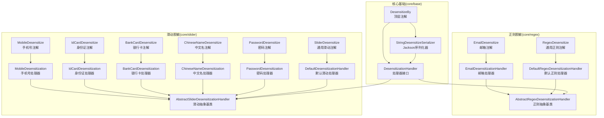
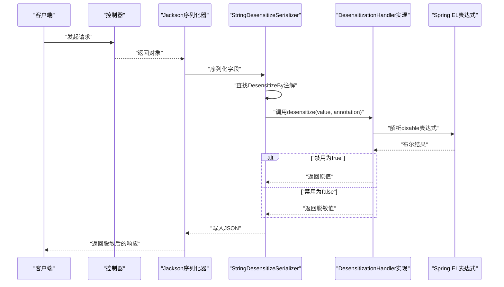
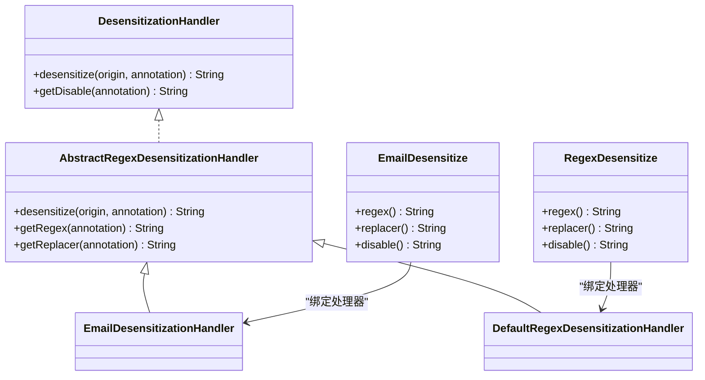
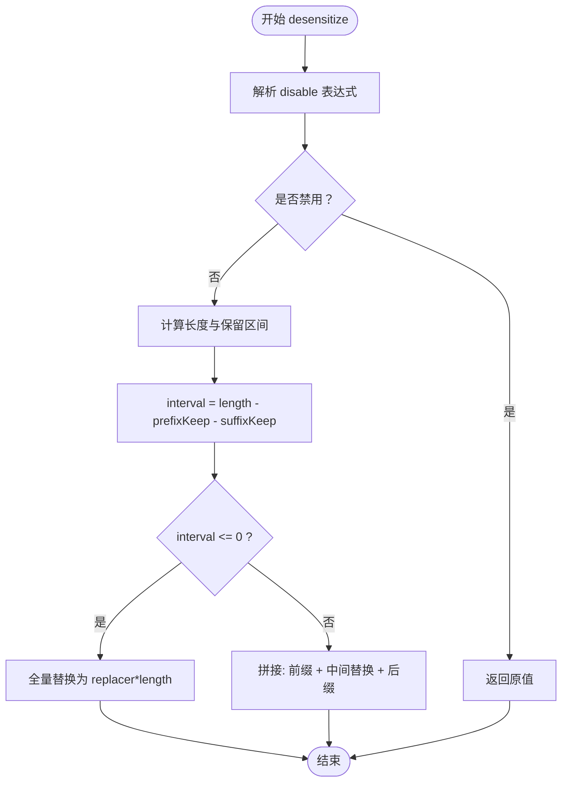
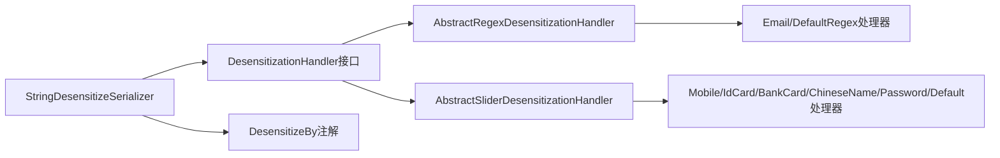

# 数据脱敏模块

<cite>
**本文引用的文件**
- [DesensitizationHandler.java](file://pandora-framework/pandora-spring-boot-starter-web/src/main/java/net/ittimeline/pandora/framework/desensitize/core/base/handler/DesensitizationHandler.java)
- [DesensitizeBy.java](file://pandora-framework/pandora-spring-boot-starter-web/src/main/java/net/ittimeline/pandora/framework/desensitize/core/base/annotation/DesensitizeBy.java)
- [StringDesensitizeSerializer.java](file://pandora-framework/pandora-spring-boot-starter-web/src/main/java/net/ittimeline/pandora/framework/desensitize/core/base/serializer/StringDesensitizeSerializer.java)
- [AbstractRegexDesensitizationHandler.java](file://pandora-framework/pandora-spring-boot-starter-web/src/main/java/net/ittimeline/pandora/framework/desensitize/core/regex/handler/AbstractRegexDesensitizationHandler.java)
- [DefaultRegexDesensitizationHandler.java](file://pandora-framework/pandora-spring-boot-starter-web/src/main/java/net/ittimeline/pandora/framework/desensitize/core/regex/handler/DefaultRegexDesensitizationHandler.java)
- [EmailDesensitizationHandler.java](file://pandora-framework/pandora-spring-boot-starter-web/src/main/java/net/ittimeline/pandora/framework/desensitize/core/regex/handler/EmailDesensitizationHandler.java)
- [EmailDesensitize.java](file://pandora-framework/pandora-spring-boot-starter-web/src/main/java/net/ittimeline/pandora/framework/desensitize/core/regex/annotation/EmailDesensitize.java)
- [RegexDesensitize.java](file://pandora-framework/pandora-spring-boot-starter-web/src/main/java/net/ittimeline/pandora/framework/desensitize/core/regex/annotation/RegexDesensitize.java)
- [AbstractSliderDesensitizationHandler.java](file://pandora-framework/pandora-spring-boot-starter-web/src/main/java/net/ittimeline/pandora/framework/desensitize/core/slider/handler/AbstractSliderDesensitizationHandler.java)
- [DefaultDesensitizationHandler.java](file://pandora-framework/pandora-spring-boot-starter-web/src/main/java/net/ittimeline/pandora/framework/desensitize/core/slider/handler/DefaultDesensitizationHandler.java)
- [BankCardDesensitization.java](file://pandora-framework/pandora-spring-boot-starter-web/src/main/java/net/ittimeline/pandora/framework/desensitize/core/slider/handler/BankCardDesensitization.java)
- [ChineseNameDesensitization.java](file://pandora-framework/pandora-spring-boot-starter-web/src/main/java/net/ittimeline/pandora/framework/desensitize/core/slider/handler/ChineseNameDesensitization.java)
- [IdCardDesensitization.java](file://pandora-framework/pandora-spring-boot-starter-web/src/main/java/net/ittimeline/pandora/framework/desensitize/core/slider/handler/IdCardDesensitization.java)
- [MobileDesensitization.java](file://pandora-framework/pandora-spring-boot-starter-web/src/main/java/net/ittimeline/pandora/framework/desensitize/core/slider/handler/MobileDesensitization.java)
- [PasswordDesensitization.java](file://pandora-framework/pandora-spring-boot-starter-web/src/main/java/net/ittimeline/pandora/framework/desensitize/core/slider/handler/PasswordDesensitization.java)
- [BankCardDesensitize.java](file://pandora-framework/pandora-spring-boot-starter-web/src/main/java/net/ittimeline/pandora/framework/desensitize/core/slider/annotation/BankCardDesensitize.java)
- [ChineseNameDesensitize.java](file://pandora-framework/pandora-spring-boot-starter-web/src/main/java/net/ittimeline/pandora/framework/desensitize/core/slider/annotation/ChineseNameDesensitize.java)
- [IdCardDesensitize.java](file://pandora-framework/pandora-spring-boot-starter-web/src/main/java/net/ittimeline/pandora/framework/desensitize/core/slider/annotation/IdCardDesensitize.java)
- [MobileDesensitize.java](file://pandora-framework/pandora-spring-boot-starter-web/src/main/java/net/ittimeline/pandora/framework/desensitize/core/slider/annotation/MobileDesensitize.java)
- [PasswordDesensitize.java](file://pandora-framework/pandora-spring-boot-starter-web/src/main/java/net/ittimeline/pandora/framework/desensitize/core/slider/annotation/PasswordDesensitize.java)
- [SliderDesensitize.java](file://pandora-framework/pandora-spring-boot-starter-web/src/main/java/net/ittimeline/pandora/framework/desensitize/core/slider/annotation/SliderDesensitize.java)
</cite>

## 目录
1. [简介](#简介)
2. [项目结构](#项目结构)
3. [核心组件](#核心组件)
4. [架构总览](#架构总览)
5. [详细组件分析](#详细组件分析)
6. [依赖关系分析](#依赖关系分析)
7. [性能考量](#性能考量)
8. [故障排查指南](#故障排查指南)
9. [结论](#结论)
10. [附录](#附录)

## 简介
本文件系统性阐述 Pandora Cloud 框架中的数据脱敏模块，覆盖以下方面：
- 架构设计与核心流程：基于 Jackson 序列化链路，通过注解驱动的处理器机制实现运行期脱敏。
- 处理器类型：正则表达式脱敏与滑动窗口脱敏两类实现，分别适用于模式化替换与区间保留型脱敏。
- 注解体系：统一的顶层注解与多种具体注解（如邮箱、手机号、银行卡号、中文名、身份证、密码等）。
- 接口与扩展：DesensitizationHandler 接口及自定义处理器开发方法。
- 场景策略与最佳实践：在不同业务场景下的脱敏策略、配置要点、性能优化与扩展建议。

## 项目结构
脱敏模块位于 web 启动器工程中，采用按功能域分层的组织方式：
- core/base：脱敏基础设施（注解、处理器接口、序列化器）
- core/regex：基于正则表达式的脱敏实现与注解
- core/slider：基于滑动窗口的脱敏实现与注解

图表来源
- [DesensitizeBy.java:17-28](file://pandora-framework/pandora-spring-boot-starter-web/src/main/java/net/ittimeline/pandora/framework/desensitize/core/base/annotation/DesensitizeBy.java#L17-L28)
- [DesensitizationHandler.java:14-40](file://pandora-framework/pandora-spring-boot-starter-web/src/main/java/net/ittimeline/pandora/framework/desensitize/core/base/handler/DesensitizationHandler.java#L14-L40)
- [StringDesensitizeSerializer.java:32-92](file://pandora-framework/pandora-spring-boot-starter-web/src/main/java/net/ittimeline/pandora/framework/desensitize/core/base/serializer/StringDesensitizeSerializer.java#L32-L92)
- [AbstractRegexDesensitizationHandler.java:16-47](file://pandora-framework/pandora-spring-boot-starter-web/src/main/java/net/ittimeline/pandora/framework/desensitize/core/regex/handler/AbstractRegexDesensitizationHandler.java#L16-L47)
- [AbstractSliderDesensitizationHandler.java:15-78](file://pandora-framework/pandora-spring-boot-starter-web/src/main/java/net/ittimeline/pandora/framework/desensitize/core/slider/handler/AbstractSliderDesensitizationHandler.java#L15-L78)

章节来源
- [DesensitizeBy.java:17-28](file://pandora-framework/pandora-spring-boot-starter-web/src/main/java/net/ittimeline/pandora/framework/desensitize/core/base/annotation/DesensitizeBy.java#L17-L28)
- [StringDesensitizeSerializer.java:32-92](file://pandora-framework/pandora-spring-boot-starter-web/src/main/java/net/ittimeline/pandora/framework/desensitize/core/base/serializer/StringDesensitizeSerializer.java#L32-L92)

## 核心组件
- 统一注解与序列化链路
  - 顶层注解：通过 DesensitizeBy 将字段标记为脱敏，并绑定指定处理器与 Jackson 序列化器。
  - 序列化器：StringDesensitizeSerializer 在 Jackson 序列化阶段根据字段注解选择对应处理器执行脱敏。
- 处理器接口
  - DesensitizationHandler 定义统一的脱敏入口与可选的禁用表达式解析能力。
- 抽象基类
  - 正则抽象：AbstractRegexDesensitizationHandler 提供禁用判断、正则匹配与替换的通用逻辑。
  - 滑动抽象：AbstractSliderDesensitizationHandler 提供禁用判断、前后缀保留长度与中间区段替换的通用逻辑。

章节来源
- [DesensitizeBy.java:17-28](file://pandora-framework/pandora-spring-boot-starter-web/src/main/java/net/ittimeline/pandora/framework/desensitize/core/base/annotation/DesensitizeBy.java#L17-L28)
- [DesensitizationHandler.java:14-40](file://pandora-framework/pandora-spring-boot-starter-web/src/main/java/net/ittimeline/pandora/framework/desensitize/core/base/handler/DesensitizationHandler.java#L14-L40)
- [StringDesensitizeSerializer.java:32-92](file://pandora-framework/pandora-spring-boot-starter-web/src/main/java/net/ittimeline/pandora/framework/desensitize/core/base/serializer/StringDesensitizeSerializer.java#L32-L92)
- [AbstractRegexDesensitizationHandler.java:16-47](file://pandora-framework/pandora-spring-boot-starter-web/src/main/java/net/ittimeline/pandora/framework/desensitize/core/regex/handler/AbstractRegexDesensitizationHandler.java#L16-L47)
- [AbstractSliderDesensitizationHandler.java:15-78](file://pandora-framework/pandora-spring-boot-starter-web/src/main/java/net/ittimeline/pandora/framework/desensitize/core/slider/handler/AbstractSliderDesensitizationHandler.java#L15-L78)

## 架构总览
脱敏在响应序列化阶段生效，整体流程如下：
- Jackson 序列化器在遇到被 DesensitizeBy 标记的字段时，动态选择对应的处理器。
- 处理器先评估禁用条件（支持 Spring EL），若禁用则直接返回原值。
- 否则进入具体脱敏算法：正则或滑动窗口，生成脱敏结果并写入 JSON 输出。

图表来源
- [StringDesensitizeSerializer.java:43-78](file://pandora-framework/pandora-spring-boot-starter-web/src/main/java/net/ittimeline/pandora/framework/desensitize/core/base/serializer/StringDesensitizeSerializer.java#L43-L78)
- [DesensitizationHandler.java:32-39](file://pandora-framework/pandora-spring-boot-starter-web/src/main/java/net/ittimeline/pandora/framework/desensitize/core/base/handler/DesensitizationHandler.java#L32-L39)
- [AbstractRegexDesensitizationHandler.java:18-30](file://pandora-framework/pandora-spring-boot-starter-web/src/main/java/net/ittimeline/pandora/framework/desensitize/core/regex/handler/AbstractRegexDesensitizationHandler.java#L18-L30)
- [AbstractSliderDesensitizationHandler.java:18-42](file://pandora-framework/pandora-spring-boot-starter-web/src/main/java/net/ittimeline/pandora/framework/desensitize/core/slider/handler/AbstractSliderDesensitizationHandler.java#L18-L42)

## 详细组件分析

### 正则表达式脱敏
- 设计要点
  - 通过 EmailDesensitize 或 RegexDesensitize 等注解声明正则与替换规则。
  - DefaultRegexDesensitizationHandler 与 EmailDesensitizationHandler 分别从注解读取 regex 与 replacer。
  - AbstractRegexDesensitizationHandler 统一处理禁用判断与正则替换。
- 使用场景
  - 邮箱地址脱敏（如保留首字母与后缀域名）。
  - 任意符合正则模式的文本脱敏（如固定格式的编号、编码等）。
- 关键参数
  - regex：用于匹配待替换片段的正则表达式。
  - replacer：替换模板，支持捕获组占位。
  - disable：Spring EL 表达式，决定是否跳过脱敏。

图表来源
- [DesensitizationHandler.java:14-40](file://pandora-framework/pandora-spring-boot-starter-web/src/main/java/net/ittimeline/pandora/framework/desensitize/core/base/handler/DesensitizationHandler.java#L14-L40)
- [AbstractRegexDesensitizationHandler.java:16-47](file://pandora-framework/pandora-spring-boot-starter-web/src/main/java/net/ittimeline/pandora/framework/desensitize/core/regex/handler/AbstractRegexDesensitizationHandler.java#L16-L47)
- [EmailDesensitizationHandler.java:12-24](file://pandora-framework/pandora-spring-boot-starter-web/src/main/java/net/ittimeline/pandora/framework/desensitize/core/regex/handler/EmailDesensitizationHandler.java#L12-L24)
- [DefaultRegexDesensitizationHandler.java:11-28](file://pandora-framework/pandora-spring-boot-starter-web/src/main/java/net/ittimeline/pandora/framework/desensitize/core/regex/handler/DefaultRegexDesensitizationHandler.java#L11-L28)
- [EmailDesensitize.java:21-40](file://pandora-framework/pandora-spring-boot-starter-web/src/main/java/net/ittimeline/pandora/framework/desensitize/core/regex/annotation/EmailDesensitize.java#L21-L40)
- [RegexDesensitize.java](file://pandora-framework/pandora-spring-boot-starter-web/src/main/java/net/ittimeline/pandora/framework/desensitize/core/regex/annotation/RegexDesensitize.java)

章节来源
- [EmailDesensitize.java:21-40](file://pandora-framework/pandora-spring-boot-starter-web/src/main/java/net/ittimeline/pandora/framework/desensitize/core/regex/annotation/EmailDesensitize.java#L21-L40)
- [EmailDesensitizationHandler.java:12-24](file://pandora-framework/pandora-spring-boot-starter-web/src/main/java/net/ittimeline/pandora/framework/desensitize/core/regex/handler/EmailDesensitizationHandler.java#L12-L24)
- [DefaultRegexDesensitizationHandler.java:11-28](file://pandora-framework/pandora-spring-boot-starter-web/src/main/java/net/ittimeline/pandora/framework/desensitize/core/regex/handler/DefaultRegexDesensitizationHandler.java#L11-L28)
- [AbstractRegexDesensitizationHandler.java:16-47](file://pandora-framework/pandora-spring-boot-starter-web/src/main/java/net/ittimeline/pandora/framework/desensitize/core/regex/handler/AbstractRegexDesensitizationHandler.java#L16-L47)

### 滑动窗口脱敏
- 设计要点
  - 通过 MobileDesensitize、IdCardDesensitize、BankCardDesensitization、ChineseNameDesensitize、PasswordDesensitize 等注解声明前后缀保留长度与替换字符。
  - DefaultDesensitizationHandler 与各具体处理器从注解读取 prefixKeep、suffixKeep、replacer。
  - AbstractSliderDesensitizationHandler 统一处理禁用判断与中间区段替换逻辑。
- 使用场景
  - 手机号：保留前3位与后4位。
  - 身份证：保留前6位与后2位。
  - 银行卡：保留前6位与后2位。
  - 中文名：保留首字。
  - 密码：全量替换。
- 边界处理
  - 当总长度小于等于保留长度之和时，整段替换以避免泄露信息。

图表来源
- [AbstractSliderDesensitizationHandler.java:18-42](file://pandora-framework/pandora-spring-boot-starter-web/src/main/java/net/ittimeline/pandora/framework/desensitize/core/slider/handler/AbstractSliderDesensitizationHandler.java#L18-L42)

章节来源
- [MobileDesensitize.java:21-43](file://pandora-framework/pandora-spring-boot-starter-web/src/main/java/net/ittimeline/pandora/framework/desensitize/core/slider/annotation/MobileDesensitize.java#L21-L43)
- [IdCardDesensitize.java:20-44](file://pandora-framework/pandora-spring-boot-starter-web/src/main/java/net/ittimeline/pandora/framework/desensitize/core/slider/annotation/IdCardDesensitize.java#L20-L44)
- [BankCardDesensitize.java:15-43](file://pandora-framework/pandora-spring-boot-starter-web/src/main/java/net/ittimeline/pandora/framework/desensitize/core/slider/annotation/BankCardDesensitize.java#L15-L43)
- [ChineseNameDesensitize.java:15-43](file://pandora-framework/pandora-spring-boot-starter-web/src/main/java/net/ittimeline/pandora/framework/desensitize/core/slider/annotation/ChineseNameDesensitize.java#L15-L43)
- [PasswordDesensitize.java:19-45](file://pandora-framework/pandora-spring-boot-starter-web/src/main/java/net/ittimeline/pandora/framework/desensitize/core/slider/annotation/PasswordDesensitize.java#L19-L45)
- [DefaultDesensitizationHandler.java:11-28](file://pandora-framework/pandora-spring-boot-starter-web/src/main/java/net/ittimeline/pandora/framework/desensitize/core/slider/handler/DefaultDesensitizationHandler.java#L11-L28)
- [AbstractSliderDesensitizationHandler.java:15-78](file://pandora-framework/pandora-spring-boot-starter-web/src/main/java/net/ittimeline/pandora/framework/desensitize/core/slider/handler/AbstractSliderDesensitizationHandler.java#L15-L78)

### 注解体系与使用方法
- 顶层注解 DesensitizeBy
  - 作用：将任意自定义注解标记为“脱敏注解”，并绑定处理器与 Jackson 序列化器。
  - 关键属性：handler（处理器类）。
- 具体注解
  - 邮箱：EmailDesensitize（支持 regex、replacer、disable）。
  - 正则：RegexDesensitize（通用正则脱敏）。
  - 手机号：MobileDesensitize（prefixKeep=3，suffixKeep=4）。
  - 身份证：IdCardDesensitize（prefixKeep=6，suffixKeep=2）。
  - 银行卡：BankCardDesensitize（prefixKeep=6，suffixKeep=2）。
  - 中文名：ChineseNameDesensitize（prefixKeep=1，suffixKeep=0）。
  - 密码：PasswordDesensitize（prefixKeep=0，suffixKeep=0）。
  - 通用滑动：SliderDesensitize（用于自定义滑动策略）。
- 使用步骤
  - 在实体字段上添加目标脱敏注解。
  - Jackson 序列化时自动触发 StringDesensitizeSerializer。
  - 序列化器根据 DesensitizeBy.handler 选择处理器执行脱敏。

章节来源
- [DesensitizeBy.java:17-28](file://pandora-framework/pandora-spring-boot-starter-web/src/main/java/net/ittimeline/pandora/framework/desensitize/core/base/annotation/DesensitizeBy.java#L17-L28)
- [EmailDesensitize.java:21-40](file://pandora-framework/pandora-spring-boot-starter-web/src/main/java/net/ittimeline/pandora/framework/desensitize/core/regex/annotation/EmailDesensitize.java#L21-L40)
- [RegexDesensitize.java](file://pandora-framework/pandora-spring-boot-starter-web/src/main/java/net/ittimeline/pandora/framework/desensitize/core/regex/annotation/RegexDesensitize.java)
- [MobileDesensitize.java:21-43](file://pandora-framework/pandora-spring-boot-starter-web/src/main/java/net/ittimeline/pandora/framework/desensitize/core/slider/annotation/MobileDesensitize.java#L21-L43)
- [IdCardDesensitize.java:20-44](file://pandora-framework/pandora-spring-boot-starter-web/src/main/java/net/ittimeline/pandora/framework/desensitize/core/slider/annotation/IdCardDesensitize.java#L20-L44)
- [BankCardDesensitize.java:15-43](file://pandora-framework/pandora-spring-boot-starter-web/src/main/java/net/ittimeline/pandora/framework/desensitize/core/slider/annotation/BankCardDesensitize.java#L15-L43)
- [ChineseNameDesensitize.java:15-43](file://pandora-framework/pandora-spring-boot-starter-web/src/main/java/net/ittimeline/pandora/framework/desensitize/core/slider/annotation/ChineseNameDesensitize.java#L15-L43)
- [PasswordDesensitize.java:19-45](file://pandora-framework/pandora-spring-boot-starter-web/src/main/java/net/ittimeline/pandora/framework/desensitize/core/slider/annotation/PasswordDesensitize.java#L19-L45)
- [SliderDesensitize.java](file://pandora-framework/pandora-spring-boot-starter-web/src/main/java/net/ittimeline/pandora/framework/desensitize/core/slider/annotation/SliderDesensitize.java)

### DesensitizationHandler 接口与自定义处理器
- 接口职责
  - desensitize：对原始字符串执行脱敏。
  - getDisable：默认通过反射读取注解的 disable 属性（支持 Spring EL）。
- 自定义处理器开发步骤
  - 选择继承路径：正则或滑动抽象类，复用禁用判断与通用替换逻辑。
  - 实现注解到参数的映射：如 getRegex/getReplacer 或 getPrefixKeep/getSuffixKeep/getReplacer。
  - 在注解上使用 @DesensitizeBy(handler = YourHandler.class) 绑定处理器。
  - 若需覆盖禁用行为，可重写 getDisable。

章节来源
- [DesensitizationHandler.java:14-40](file://pandora-framework/pandora-spring-boot-starter-web/src/main/java/net/ittimeline/pandora/framework/desensitize/core/base/handler/DesensitizationHandler.java#L14-L40)
- [AbstractRegexDesensitizationHandler.java:16-47](file://pandora-framework/pandora-spring-boot-starter-web/src/main/java/net/ittimeline/pandora/framework/desensitize/core/regex/handler/AbstractRegexDesensitizationHandler.java#L16-L47)
- [AbstractSliderDesensitizationHandler.java:15-78](file://pandora-framework/pandora-spring-boot-starter-web/src/main/java/net/ittimeline/pandora/framework/desensitize/core/slider/handler/AbstractSliderDesensitizationHandler.java#L15-L78)
- [DesensitizeBy.java:17-28](file://pandora-framework/pandora-spring-boot-starter-web/src/main/java/net/ittimeline/pandora/framework/desensitize/core/base/annotation/DesensitizeBy.java#L17-L28)

## 依赖关系分析
- 组件耦合
  - StringDesensitizeSerializer 强依赖 DesensitizeBy 注解与处理器单例缓存。
  - 处理器实现依赖注解提供的参数与 Spring EL 表达式工具。
- 可能的循环依赖
  - 无直接循环：注解仅持有处理器类，序列化器持有处理器实例，方向单一。
- 外部依赖
  - Jackson 序列化链路、Hutool 反射与注解工具、Spring EL 表达式解析。

图表来源
- [StringDesensitizeSerializer.java:32-92](file://pandora-framework/pandora-spring-boot-starter-web/src/main/java/net/ittimeline/pandora/framework/desensitize/core/base/serializer/StringDesensitizeSerializer.java#L32-L92)
- [DesensitizationHandler.java:14-40](file://pandora-framework/pandora-spring-boot-starter-web/src/main/java/net/ittimeline/pandora/framework/desensitize/core/base/handler/DesensitizationHandler.java#L14-L40)
- [AbstractRegexDesensitizationHandler.java:16-47](file://pandora-framework/pandora-spring-boot-starter-web/src/main/java/net/ittimeline/pandora/framework/desensitize/core/regex/handler/AbstractRegexDesensitizationHandler.java#L16-L47)
- [AbstractSliderDesensitizationHandler.java:15-78](file://pandora-framework/pandora-spring-boot-starter-web/src/main/java/net/ittimeline/pandora/framework/desensitize/core/slider/handler/AbstractSliderDesensitizationHandler.java#L15-L78)

章节来源
- [StringDesensitizeSerializer.java:32-92](file://pandora-framework/pandora-spring-boot-starter-web/src/main/java/net/ittimeline/pandora/framework/desensitize/core/base/serializer/StringDesensitizeSerializer.java#L32-L92)
- [DesensitizationHandler.java:14-40](file://pandora-framework/pandora-spring-boot-starter-web/src/main/java/net/ittimeline/pandora/framework/desensitize/core/base/handler/DesensitizationHandler.java#L14-L40)

## 性能考量
- 序列化阶段开销
  - 脱敏发生在 Jackson 序列化阶段，对响应体积与网络传输有直接影响。
  - 建议仅对必要字段启用脱敏，避免对大对象全量脱敏。
- 处理器选择
  - 正则脱敏适合模式化替换；滑动脱敏适合固定长度且有明确前后缀保留需求的场景。
  - 对高频字段优先使用简单处理器（如滑动脱敏），减少正则匹配成本。
- 禁用表达式
  - 使用 disable 表达式在运行期动态控制脱敏开关，避免不必要的处理。
- 缓存与反射
  - 处理器通过单例缓存获取，减少反射与实例化开销。
- 字符串操作
  - 滑动脱敏通过 substring 与 repeat 构造替换串，注意超长字符串的内存占用。

## 故障排查指南
- 未生效
  - 检查字段是否标注了 DesensitizeBy 或其派生注解。
  - 确认 Jackson 序列化器链路是否正确加载 StringDesensitizeSerializer。
- 脱敏异常
  - 正则注解：确认 regex 与 replacer 合法，避免捕获组越界。
  - 滑动注解：确认 prefixKeep + suffixKeep 不超过字符串长度。
- 禁用无效
  - 检查 disable 表达式是否正确，确保 Spring EL 可解析。
- 性能问题
  - 大对象频繁脱敏：考虑移除不必要的字段脱敏或拆分响应结构。
  - 正则复杂度过高：简化正则或改用滑动脱敏。

## 结论
该脱敏模块以注解驱动与 Jackson 序列化为核心，结合正则与滑动两种策略，提供了灵活、可扩展的运行期数据脱敏能力。通过统一的处理器接口与序列化器，开发者可以快速为新字段添加脱敏策略，并通过自定义处理器满足更复杂的业务需求。在实际应用中，应结合业务场景选择合适的脱敏策略与参数，并关注序列化阶段的性能影响。

## 附录
- 常见注解一览
  - 邮箱：EmailDesensitize
  - 正则：RegexDesensitize
  - 手机号：MobileDesensitize
  - 身份证：IdCardDesensitize
  - 银行卡：BankCardDesensitize
  - 中文名：ChineseNameDesensitize
  - 密码：PasswordDesensitize
  - 通用滑动：SliderDesensitize
- 处理器一览
  - 正则：EmailDesensitizationHandler、DefaultRegexDesensitizationHandler
  - 滑动：MobileDesensitization、IdCardDesensitization、BankCardDesensitization、ChineseNameDesensitization、PasswordDesensitization、DefaultDesensitizationHandler