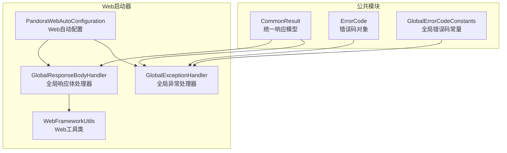
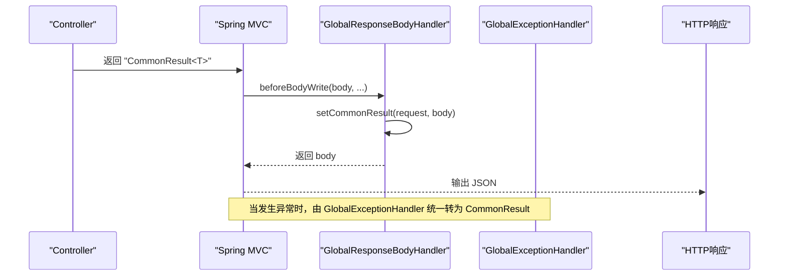
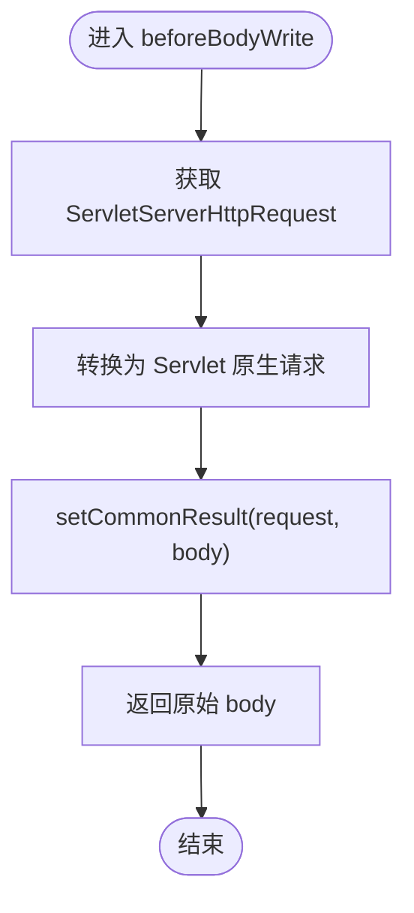
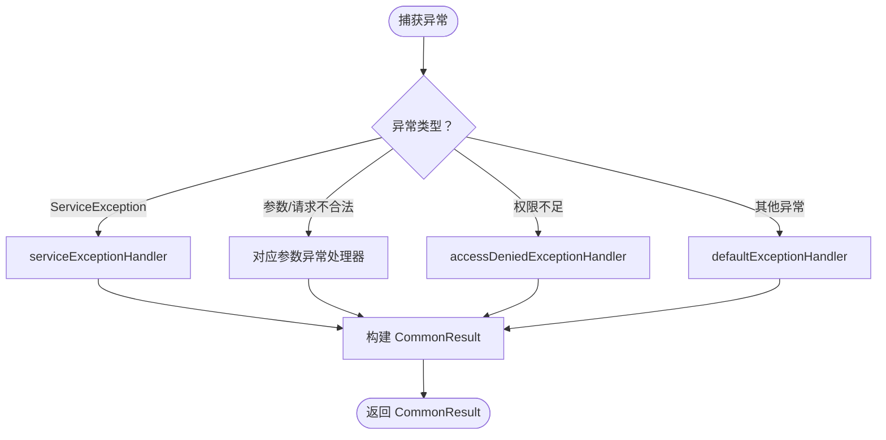
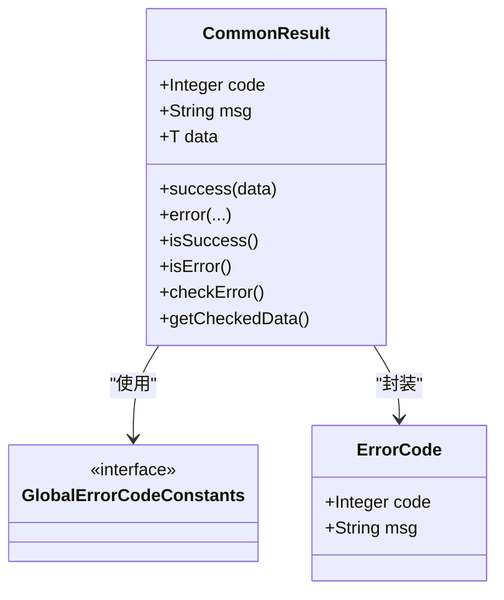
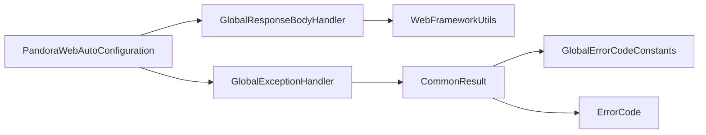

# 统一响应处理

<cite>
**本文引用的文件**
- [CommonResult.java](file://pandora-framework/pandora-common/src/main/java/net/ittimeline/pandora/framework/common/pojo/CommonResult.java)
- [GlobalResponseBodyHandler.java](file://pandora-framework/pandora-spring-boot-starter-web/src/main/java/net/ittimeline/pandora/framework/web/core/handler/GlobalResponseBodyHandler.java)
- [GlobalExceptionHandler.java](file://pandora-framework/pandora-spring-boot-starter-web/src/main/java/net/ittimeline/pandora/framework/web/core/handler/GlobalExceptionHandler.java)
- [WebFrameworkUtils.java](file://pandora-framework/pandora-spring-boot-starter-web/src/main/java/net/ittimeline/pandora/framework/web/core/util/WebFrameworkUtils.java)
- [PandoraWebAutoConfiguration.java](file://pandora-framework/pandora-spring-boot-starter-web/src/main/java/net/ittimeline/pandora/framework/web/config/PandoraWebAutoConfiguration.java)
- [GlobalErrorCodeConstants.java](file://pandora-framework/pandora-common/src/main/java/net/ittimeline/pandora/framework/common/exception/enums/GlobalErrorCodeConstants.java)
- [ErrorCode.java](file://pandora-framework/pandora-common/src/main/java/net/ittimeline/pandora/framework/common/exception/ErrorCode.java)
- [org.springframework.boot.autoconfigure.AutoConfiguration.imports](file://pandora-framework/pandora-spring-boot-starter-web/src/main/resources/META-INF/spring/org.springframework.boot.autoconfigure.AutoConfiguration.imports)
</cite>

## 目录
1. [简介](#简介)
2. [项目结构](#项目结构)
3. [核心组件](#核心组件)
4. [架构总览](#架构总览)
5. [详细组件分析](#详细组件分析)
6. [依赖关系分析](#依赖关系分析)
7. [性能考量](#性能考量)
8. [故障排查指南](#故障排查指南)
9. [结论](#结论)
10. [附录](#附录)

## 简介
本文件聚焦 Pandora Cloud 框架的统一响应处理能力，系统性阐述 GlobalResponseBodyHandler 的工作机制与职责边界，说明其与全局异常处理 GlobalExceptionHandler 的协作关系；同时详解 CommonResult 统一响应格式的设计理念、成功/失败响应的封装策略以及与 HTTP 状态码的映射关系。文档旨在帮助开发者快速理解并正确使用统一响应体系，确保所有 Controller 的响应在格式、语义与可观测性上保持一致。

## 项目结构
围绕统一响应处理的关键文件分布于公共模块与 Web 启动器模块中：
- 公共模块提供统一响应模型与错误码常量
- Web 启动器模块提供全局异常处理与响应体增强处理器，并通过自动装配完成注册

**图表来源**
- [CommonResult.java:22-122](file://pandora-framework/pandora-common/src/main/java/net/ittimeline/pandora/framework/common/pojo/CommonResult.java#L22-L122)
- [GlobalExceptionHandler.java:57-454](file://pandora-framework/pandora-spring-boot-starter-web/src/main/java/net/ittimeline/pandora/framework/web/core/handler/GlobalExceptionHandler.java#L57-L454)
- [GlobalResponseBodyHandler.java:25-47](file://pandora-framework/pandora-spring-boot-starter-web/src/main/java/net/ittimeline/pandora/framework/web/core/handler/GlobalResponseBodyHandler.java#L25-L47)
- [WebFrameworkUtils.java:22-182](file://pandora-framework/pandora-spring-boot-starter-web/src/main/java/net/ittimeline/pandora/framework/web/core/util/WebFrameworkUtils.java#L22-L182)
- [PandoraWebAutoConfiguration.java:47-177](file://pandora-framework/pandora-spring-boot-starter-web/src/main/java/net/ittimeline/pandora/framework/web/config/PandoraWebAutoConfiguration.java#L47-L177)
- [GlobalErrorCodeConstants.java:16-42](file://pandora-framework/pandora-common/src/main/java/net/ittimeline/pandora/framework/common/exception/enums/GlobalErrorCodeConstants.java#L16-L42)
- [ErrorCode.java:17-33](file://pandora-framework/pandora-common/src/main/java/net/ittimeline/pandora/framework/common/exception/ErrorCode.java#L17-L33)

**章节来源**
- [PandoraWebAutoConfiguration.java:47-177](file://pandora-framework/pandora-spring-boot-starter-web/src/main/java/net/ittimeline/pandora/framework/web/config/PandoraWebAutoConfiguration.java#L47-L177)
- [org.springframework.boot.autoconfigure.AutoConfiguration.imports:1-8](file://pandora-framework/pandora-spring-boot-starter-web/src/main/resources/META-INF/spring/org.springframework.boot.autoconfigure.AutoConfiguration.imports#L1-L8)

## 核心组件
- CommonResult：统一响应载体，包含 code、msg、data 字段，提供 success/error 工厂方法与异常检查能力
- GlobalExceptionHandler：将各类异常翻译为 CommonResult，统一错误语义与错误码
- GlobalResponseBodyHandler：对返回类型为 CommonResult 的响应进行“增强”，用于后续日志采集等场景
- WebFrameworkUtils：提供请求上下文中的通用结果存储与读取能力
- GlobalErrorCodeConstants：定义全局错误码常量，覆盖客户端错误、服务端错误与自定义错误区间
- ErrorCode：错误码对象抽象，承载 code 与 msg

**章节来源**
- [CommonResult.java:22-122](file://pandora-framework/pandora-common/src/main/java/net/ittimeline/pandora/framework/common/pojo/CommonResult.java#L22-L122)
- [GlobalExceptionHandler.java:57-454](file://pandora-framework/pandora-spring-boot-starter-web/src/main/java/net/ittimeline/pandora/framework/web/core/handler/GlobalExceptionHandler.java#L57-L454)
- [GlobalResponseBodyHandler.java:25-47](file://pandora-framework/pandora-spring-boot-starter-web/src/main/java/net/ittimeline/pandora/framework/web/core/handler/GlobalResponseBodyHandler.java#L25-L47)
- [WebFrameworkUtils.java:22-182](file://pandora-framework/pandora-spring-boot-starter-web/src/main/java/net/ittimeline/pandora/framework/web/core/util/WebFrameworkUtils.java#L22-L182)
- [GlobalErrorCodeConstants.java:16-42](file://pandora-framework/pandora-common/src/main/java/net/ittimeline/pandora/framework/common/exception/enums/GlobalErrorCodeConstants.java#L16-L42)
- [ErrorCode.java:17-33](file://pandora-framework/pandora-common/src/main/java/net/ittimeline/pandora/framework/common/exception/ErrorCode.java#L17-L33)

## 架构总览
统一响应处理在 Spring MVC 生命周期内的协作关系如下：

**图表来源**
- [GlobalResponseBodyHandler.java:27-44](file://pandora-framework/pandora-spring-boot-starter-web/src/main/java/net/ittimeline/pandora/framework/web/core/handler/GlobalResponseBodyHandler.java#L27-L44)
- [WebFrameworkUtils.java:141-147](file://pandora-framework/pandora-spring-boot-starter-web/src/main/java/net/ittimeline/pandora/framework/web/core/util/WebFrameworkUtils.java#L141-L147)
- [GlobalExceptionHandler.java:57-120](file://pandora-framework/pandora-spring-boot-starter-web/src/main/java/net/ittimeline/pandora/framework/web/core/handler/GlobalExceptionHandler.java#L57-L120)

## 详细组件分析

### GlobalResponseBodyHandler：响应体增强与日志采集
- 职责边界
  - 仅对返回类型为 CommonResult 的方法进行拦截
  - 在响应写出前，将 CommonResult 写入请求上下文，供后续过滤器或拦截器使用（如访问日志）
  - 不改变响应体结构，避免侵入 Controller 的返回值设计
- 关键行为
  - supports：判断返回类型是否为 CommonResult
  - beforeBodyWrite：将 CommonResult 存入请求属性，再原样返回

**图表来源**
- [GlobalResponseBodyHandler.java:37-44](file://pandora-framework/pandora-spring-boot-starter-web/src/main/java/net/ittimeline/pandora/framework/web/core/handler/GlobalResponseBodyHandler.java#L37-L44)
- [WebFrameworkUtils.java:141-147](file://pandora-framework/pandora-spring-boot-starter-web/src/main/java/net/ittimeline/pandora/framework/web/core/util/WebFrameworkUtils.java#L141-L147)

**章节来源**
- [GlobalResponseBodyHandler.java:25-47](file://pandora-framework/pandora-spring-boot-starter-web/src/main/java/net/ittimeline/pandora/framework/web/core/handler/GlobalResponseBodyHandler.java#L25-L47)
- [WebFrameworkUtils.java:141-147](file://pandora-framework/pandora-spring-boot-starter-web/src/main/java/net/ittimeline/pandora/framework/web/core/util/WebFrameworkUtils.java#L141-L147)

### GlobalExceptionHandler：异常到统一响应的翻译器
- 职责
  - 将各类运行期异常（参数校验、请求不合法、业务异常、系统异常等）统一翻译为 CommonResult
  - 对 ServiceException 进行特殊处理，保留其错误码与消息
  - 对系统异常进行兜底，记录异常日志并返回统一错误码
- 关键点
  - 通过 @ExceptionHandler 分别处理不同异常类型
  - 对部分常见异常构造明确的错误提示，提升可读性
  - 对数据库“表不存在”等特定异常进行模块化提示

**图表来源**
- [GlobalExceptionHandler.java:57-120](file://pandora-framework/pandora-spring-boot-starter-web/src/main/java/net/ittimeline/pandora/framework/web/core/handler/GlobalExceptionHandler.java#L57-L120)
- [GlobalExceptionHandler.java:298-341](file://pandora-framework/pandora-spring-boot-starter-web/src/main/java/net/ittimeline/pandora/framework/web/core/handler/GlobalExceptionHandler.java#L298-L341)

**章节来源**
- [GlobalExceptionHandler.java:57-454](file://pandora-framework/pandora-spring-boot-starter-web/src/main/java/net/ittimeline/pandora/framework/web/core/handler/GlobalExceptionHandler.java#L57-L454)

### CommonResult：统一响应格式与状态码
- 数据结构
  - code：错误码，0 表示成功，非 0 表示失败
  - msg：用户可读的提示信息
  - data：返回数据
- 成功/失败工厂方法
  - success(data)：封装成功响应
  - error(...)：封装失败响应，支持多种重载（错误码对象、错误码+消息、ServiceException 等）
- 与异常体系集成
  - checkError()/getCheckedData()：将响应结果与 ServiceException 集成，便于在调用链中直接抛出或提取数据
- 与 HTTP 状态码映射
  - 全局错误码常量覆盖客户端错误（400/401/403/404/405/423/429）、服务端错误（500/501/502）与自定义错误（900/901/999）

**图表来源**
- [CommonResult.java:22-122](file://pandora-framework/pandora-common/src/main/java/net/ittimeline/pandora/framework/common/pojo/CommonResult.java#L22-L122)
- [GlobalErrorCodeConstants.java:16-42](file://pandora-framework/pandora-common/src/main/java/net/ittimeline/pandora/framework/common/exception/enums/GlobalErrorCodeConstants.java#L16-L42)
- [ErrorCode.java:17-33](file://pandora-framework/pandora-common/src/main/java/net/ittimeline/pandora/framework/common/exception/ErrorCode.java#L17-L33)

**章节来源**
- [CommonResult.java:22-122](file://pandora-framework/pandora-common/src/main/java/net/ittimeline/pandora/framework/common/pojo/CommonResult.java#L22-L122)
- [GlobalErrorCodeConstants.java:16-42](file://pandora-framework/pandora-common/src/main/java/net/ittimeline/pandora/framework/common/exception/enums/GlobalErrorCodeConstants.java#L16-L42)
- [ErrorCode.java:17-33](file://pandora-framework/pandora-common/src/main/java/net/ittimeline/pandora/framework/common/exception/ErrorCode.java#L17-L33)

### WebFrameworkUtils：请求上下文中的统一结果存储
- 提供 setCommonResult/getCommonResult，用于在响应增强阶段将 CommonResult 存储到请求属性中
- 提供 getLoginUserId/getLoginUserType 等常用上下文信息读取能力，便于日志与审计

**章节来源**
- [WebFrameworkUtils.java:141-147](file://pandora-framework/pandora-spring-boot-starter-web/src/main/java/net/ittimeline/pandora/framework/web/core/util/WebFrameworkUtils.java#L141-L147)

### 自动装配与注册
- PandoraWebAutoConfiguration 将 GlobalExceptionHandler 与 GlobalResponseBodyHandler 注册为 Spring Bean
- 通过 @AutoConfiguration 导入，确保在 Web 启动时自动生效

**章节来源**
- [PandoraWebAutoConfiguration.java:93-109](file://pandora-framework/pandora-spring-boot-starter-web/src/main/java/net/ittimeline/pandora/framework/web/config/PandoraWebAutoConfiguration.java#L93-L109)
- [org.springframework.boot.autoconfigure.AutoConfiguration.imports:1-8](file://pandora-framework/pandora-spring-boot-starter-web/src/main/resources/META-INF/spring/org.springframework.boot.autoconfigure.AutoConfiguration.imports#L1-L8)

## 依赖关系分析
- GlobalResponseBodyHandler 依赖 WebFrameworkUtils 存储统一结果
- GlobalExceptionHandler 依赖 CommonResult/ErrorCode/GlobalErrorCodeConstants 构建统一响应
- CommonResult 依赖 GlobalErrorCodeConstants 与 ServiceExceptionUtil 进行格式化与异常集成
- 自动配置类负责装配上述组件

**图表来源**
- [GlobalResponseBodyHandler.java:25-47](file://pandora-framework/pandora-spring-boot-starter-web/src/main/java/net/ittimeline/pandora/framework/web/core/handler/GlobalResponseBodyHandler.java#L25-L47)
- [WebFrameworkUtils.java:22-182](file://pandora-framework/pandora-spring-boot-starter-web/src/main/java/net/ittimeline/pandora/framework/web/core/util/WebFrameworkUtils.java#L22-L182)
- [GlobalExceptionHandler.java:57-454](file://pandora-framework/pandora-spring-boot-starter-web/src/main/java/net/ittimeline/pandora/framework/web/core/handler/GlobalExceptionHandler.java#L57-L454)
- [CommonResult.java:22-122](file://pandora-framework/pandora-common/src/main/java/net/ittimeline/pandora/framework/common/pojo/CommonResult.java#L22-L122)
- [GlobalErrorCodeConstants.java:16-42](file://pandora-framework/pandora-common/src/main/java/net/ittimeline/pandora/framework/common/exception/enums/GlobalErrorCodeConstants.java#L16-L42)
- [ErrorCode.java:17-33](file://pandora-framework/pandora-common/src/main/java/net/ittimeline/pandora/framework/common/exception/ErrorCode.java#L17-L33)
- [PandoraWebAutoConfiguration.java:47-177](file://pandora-framework/pandora-spring-boot-starter-web/src/main/java/net/ittimeline/pandora/framework/web/config/PandoraWebAutoConfiguration.java#L47-L177)

**章节来源**
- [PandoraWebAutoConfiguration.java:47-177](file://pandora-framework/pandora-spring-boot-starter-web/src/main/java/net/ittimeline/pandora/framework/web/config/PandoraWebAutoConfiguration.java#L47-L177)

## 性能考量
- GlobalResponseBodyHandler 仅在返回类型为 CommonResult 时拦截，避免对普通对象序列化的额外开销
- GlobalExceptionHandler 在异常路径上进行日志异步落库，降低对主请求线程的影响
- CommonResult 的字段序列化采用 Jackson 默认策略，建议在高频接口中避免返回超大对象，减少序列化成本

[本节为通用指导，无需列出具体文件来源]

## 故障排查指南
- 控制器未按统一格式返回
  - 症状：响应未被增强或日志采集不到
  - 排查：确认返回类型是否为 CommonResult<T>，并确保 GlobalResponseBodyHandler 已注册
- 异常未被统一翻译
  - 症状：出现未捕获异常或响应格式不一致
  - 排查：确认 GlobalExceptionHandler 是否生效，检查异常是否被特定处理器捕获
- 错误码不符合预期
  - 症状：错误码与 HTTP 状态码不一致
  - 排查：核对 GlobalErrorCodeConstants 的定义与业务错误码范围

**章节来源**
- [GlobalResponseBodyHandler.java:27-44](file://pandora-framework/pandora-spring-boot-starter-web/src/main/java/net/ittimeline/pandora/framework/web/core/handler/GlobalResponseBodyHandler.java#L27-L44)
- [GlobalExceptionHandler.java:57-120](file://pandora-framework/pandora-spring-boot-starter-web/src/main/java/net/ittimeline/pandora/framework/web/core/handler/GlobalExceptionHandler.java#L57-L120)
- [GlobalErrorCodeConstants.java:16-42](file://pandora-framework/pandora-common/src/main/java/net/ittimeline/pandora/framework/common/exception/enums/GlobalErrorCodeConstants.java#L16-L42)

## 结论
Pandora Cloud 的统一响应处理通过 CommonResult 规范化了响应结构，借助 GlobalExceptionHandler 将异常统一翻译为结构化错误，配合 GlobalResponseBodyHandler 在不改变 Controller 返回值的前提下完成增强与日志采集。该方案实现了“成功响应与异常响应的统一格式化、错误码与语义的一致性、以及可观测性的可追溯性”。

[本节为总结性内容，无需列出具体文件来源]

## 附录

### 响应数据转换示例与配置方法
- 成功响应
  - 使用工厂方法封装数据，确保返回类型为 CommonResult<T>
  - 示例路径参考：[CommonResult.success:74-80](file://pandora-framework/pandora-common/src/main/java/net/ittimeline/pandora/framework/common/pojo/CommonResult.java#L74-L80)
- 失败响应
  - 使用错误码常量与错误信息封装
  - 示例路径参考：[GlobalExceptionHandler 参数/请求不合法处理:127-167](file://pandora-framework/pandora-spring-boot-starter-web/src/main/java/net/ittimeline/pandora/framework/web/core/handler/GlobalExceptionHandler.java#L127-L167)
- 统一增强
  - 确保 GlobalResponseBodyHandler 生效，以便后续日志采集
  - 示例路径参考：[GlobalResponseBodyHandler.beforeBodyWrite:37-44](file://pandora-framework/pandora-spring-boot-starter-web/src/main/java/net/ittimeline/pandora/framework/web/core/handler/GlobalResponseBodyHandler.java#L37-L44)
- 配置生效
  - 自动配置类负责注册处理器，无需手动装配
  - 示例路径参考：[PandoraWebAutoConfiguration:93-109](file://pandora-framework/pandora-spring-boot-starter-web/src/main/java/net/ittimeline/pandora/framework/web/config/PandoraWebAutoConfiguration.java#L93-L109)

**章节来源**
- [CommonResult.java:74-80](file://pandora-framework/pandora-common/src/main/java/net/ittimeline/pandora/framework/common/pojo/CommonResult.java#L74-L80)
- [GlobalExceptionHandler.java:127-167](file://pandora-framework/pandora-spring-boot-starter-web/src/main/java/net/ittimeline/pandora/framework/web/core/handler/GlobalExceptionHandler.java#L127-L167)
- [GlobalResponseBodyHandler.java:37-44](file://pandora-framework/pandora-spring-boot-starter-web/src/main/java/net/ittimeline/pandora/framework/web/core/handler/GlobalResponseBodyHandler.java#L37-L44)
- [PandoraWebAutoConfiguration.java:93-109](file://pandora-framework/pandora-spring-boot-starter-web/src/main/java/net/ittimeline/pandora/framework/web/config/PandoraWebAutoConfiguration.java#L93-L109)