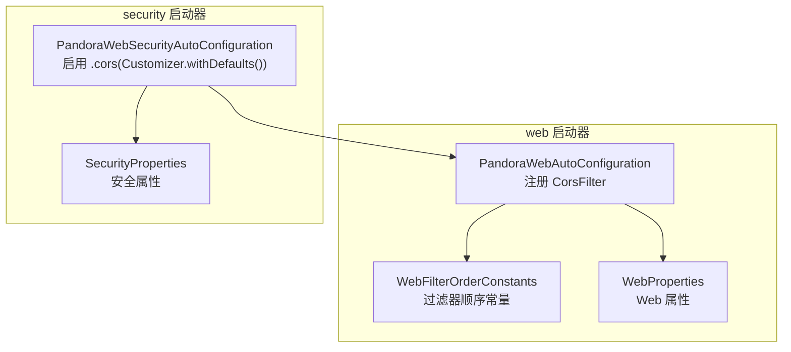
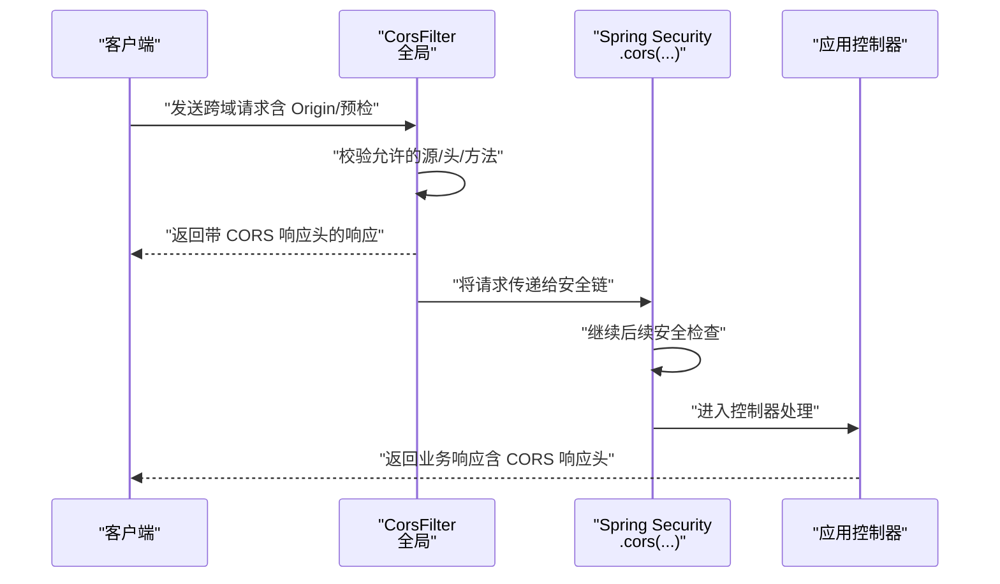
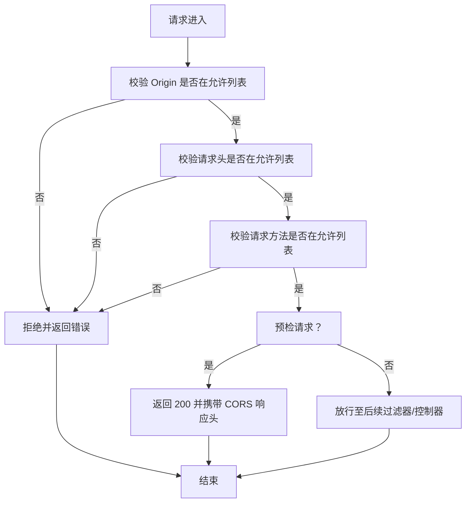
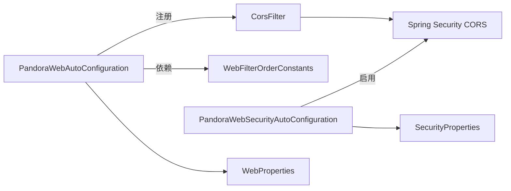

# 跨域处理

<cite>
**本文引用的文件**
- [PandoraWebAutoConfiguration.java](file://pandora-framework/pandora-spring-boot-starter-web/src/main/java/net/ittimeline/pandora/framework/web/config/PandoraWebAutoConfiguration.java)
- [WebFilterOrderConstants.java](file://pandora-framework/pandora-common/src/main/java/net/ittimeline/pandora/framework/common/constants/WebFilterOrderConstants.java)
- [PandoraWebSecurityAutoConfiguration.java](file://pandora-framework/pandora-spring-boot-starter-security/src/main/java/net/ittimeline/pandora/framework/security/config/PandoraWebSecurityAutoConfiguration.java)
- [WebProperties.java](file://pandora-framework/pandora-spring-boot-starter-web/src/main/java/net/ittimeline/pandora/framework/web/config/WebProperties.java)
- [SecurityProperties.java](file://pandora-framework/pandora-spring-boot-starter-security/src/main/java/net/ittimeline/pandora/framework/security/config/SecurityProperties.java)
</cite>

## 目录
1. [简介](#简介)
2. [项目结构](#项目结构)
3. [核心组件](#核心组件)
4. [架构总览](#架构总览)
5. [组件详解](#组件详解)
6. [依赖关系分析](#依赖关系分析)
7. [性能考量](#性能考量)
8. [故障排查指南](#故障排查指南)
9. [结论](#结论)
10. [附录](#附录)

## 简介
本章节面向使用 Pandora Cloud 框架的开发者，系统性阐述框架内置的跨域处理能力与最佳实践。重点覆盖以下方面：
- CorsFilter 的配置与实现原理：允许的源、请求头、请求方法的设置策略
- 生产与开发环境的 CORS 安全配置建议
- 不同业务场景下的配置示例与注意事项
- 跨域请求处理流程与常见问题的定位与解决
- 性能优化与安全加固要点

## 项目结构
围绕跨域处理的相关模块与文件如下：
- web 自动配置：负责注册全局 CORS 过滤器
- 安全自动配置：启用 Spring Security 的 CORS 支持
- 过滤器顺序常量：确保 CORS 在正确的执行阶段生效
- Web 与安全配置属性：为扩展与定制提供基础

图表来源
- [PandoraWebAutoConfiguration.java:116-129](file://pandora-framework/pandora-spring-boot-starter-web/src/main/java/net/ittimeline/pandora/framework/web/config/PandoraWebAutoConfiguration.java#L116-L129)
- [WebFilterOrderConstants.java:11-37](file://pandora-framework/pandora-common/src/main/java/net/ittimeline/pandora/framework/common/constants/WebFilterOrderConstants.java#L11-L37)
- [PandoraWebSecurityAutoConfiguration.java:112-116](file://pandora-framework/pandora-spring-boot-starter-security/src/main/java/net/ittimeline/pandora/framework/security/config/PandoraWebSecurityAutoConfiguration.java#L112-L116)
- [WebProperties.java:18-68](file://pandora-framework/pandora-spring-boot-starter-web/src/main/java/net/ittimeline/pandora/framework/web/config/WebProperties.java#L18-L68)
- [SecurityProperties.java:19-58](file://pandora-framework/pandora-spring-boot-starter-security/src/main/java/net/ittimeline/pandora/framework/security/config/SecurityProperties.java#L19-L58)

章节来源
- [PandoraWebAutoConfiguration.java:116-129](file://pandora-framework/pandora-spring-boot-starter-web/src/main/java/net/ittimeline/pandora/framework/web/config/PandoraWebAutoConfiguration.java#L116-L129)
- [WebFilterOrderConstants.java:11-37](file://pandora-framework/pandora-common/src/main/java/net/ittimeline/pandora/framework/common/constants/WebFilterOrderConstants.java#L11-L37)
- [PandoraWebSecurityAutoConfiguration.java:112-116](file://pandora-framework/pandora-spring-boot-starter-security/src/main/java/net/ittimeline/pandora/framework/security/config/PandoraWebSecurityAutoConfiguration.java#L112-L116)
- [WebProperties.java:18-68](file://pandora-framework/pandora-spring-boot-starter-web/src/main/java/net/ittimeline/pandora/framework/web/config/WebProperties.java#L18-L68)
- [SecurityProperties.java:19-58](file://pandora-framework/pandora-spring-boot-starter-security/src/main/java/net/ittimeline/pandora/framework/security/config/SecurityProperties.java#L19-L58)

## 核心组件
- 全局 CORS 过滤器（CorsFilter）：由 web 自动配置注册，作为第一个执行的过滤器，确保跨域预检与实际请求均能正确处理
- Spring Security CORS 支持：通过启用 .cors(Customizer.withDefaults())，与 Spring Security 的过滤链协同工作
- 过滤器顺序控制：通过 WebFilterOrderConstants 将 CORS 过滤器置于极靠前的位置，避免被其他过滤器覆盖或干扰
- 配置属性基座：WebProperties 与 SecurityProperties 提供了扩展与定制的基础

章节来源
- [PandoraWebAutoConfiguration.java:116-129](file://pandora-framework/pandora-spring-boot-starter-web/src/main/java/net/ittimeline/pandora/framework/web/config/PandoraWebAutoConfiguration.java#L116-L129)
- [PandoraWebSecurityAutoConfiguration.java:112-116](file://pandora-framework/pandora-spring-boot-starter-security/src/main/java/net/ittimeline/pandora/framework/security/config/PandoraWebSecurityAutoConfiguration.java#L112-L116)
- [WebFilterOrderConstants.java:11-37](file://pandora-framework/pandora-common/src/main/java/net/ittimeline/pandora/framework/common/constants/WebFilterOrderConstants.java#L11-L37)
- [WebProperties.java:18-68](file://pandora-framework/pandora-spring-boot-starter-web/src/main/java/net/ittimeline/pandora/framework/web/config/WebProperties.java#L18-L68)
- [SecurityProperties.java:19-58](file://pandora-framework/pandora-spring-boot-starter-security/src/main/java/net/ittimeline/pandora/framework/security/config/SecurityProperties.java#L19-L58)

## 架构总览
下图展示了跨域处理在请求生命周期中的位置与作用范围：

图表来源
- [PandoraWebAutoConfiguration.java:116-129](file://pandora-framework/pandora-spring-boot-starter-web/src/main/java/net/ittimeline/pandora/framework/web/config/PandoraWebAutoConfiguration.java#L116-L129)
- [PandoraWebSecurityAutoConfiguration.java:112-116](file://pandora-framework/pandora-spring-boot-starter-security/src/main/java/net/ittimeline/pandora/framework/security/config/PandoraWebSecurityAutoConfiguration.java#L112-L116)

## 组件详解

### CorsFilter 的配置与实现原理
- 注册位置与顺序
  - 通过自动配置类注册 CorsFilter，并设置其执行顺序为最小值，确保在请求处理链最前端生效
  - 与 WebFilterOrderConstants 中的 CORS_FILTER 常量保持一致，避免与其他过滤器产生顺序冲突
- 允许的源、请求头、请求方法
  - 当前实现采用通配符策略：允许任意源、任意请求头、任意请求方法
  - 该策略便于开发调试，但在生产环境中存在安全风险，需按需收紧
- 配置对象与注册范围
  - 使用 CorsConfiguration 构建跨域规则，并通过 UrlBasedCorsConfigurationSource 注册到 “/**” 路径范围

章节来源
- [PandoraWebAutoConfiguration.java:116-129](file://pandora-framework/pandora-spring-boot-starter-web/src/main/java/net/ittimeline/pandora/framework/web/config/PandoraWebAutoConfiguration.java#L116-L129)
- [WebFilterOrderConstants.java:11-12](file://pandora-framework/pandora-common/src/main/java/net/ittimeline/pandora/framework/common/constants/WebFilterOrderConstants.java#L11-L12)

### Spring Security 的 CORS 协同
- 启用方式
  - 在安全配置中调用 .cors(Customizer.withDefaults())，以启用基于 Spring Security 的 CORS 支持
- 协同关系
  - CorsFilter 与 Spring Security 的 CORS 支持共同作用，前者负责通用跨域头处理，后者负责与认证授权等安全逻辑的集成
- 适用场景
  - 在需要结合鉴权、放行白名单等安全策略时，推荐同时启用两者

章节来源
- [PandoraWebSecurityAutoConfiguration.java:112-116](file://pandora-framework/pandora-spring-boot-starter-security/src/main/java/net/ittimeline/pandora/framework/security/config/PandoraWebSecurityAutoConfiguration.java#L112-L116)

### 跨域请求处理流程（算法流程）

图表来源
- [PandoraWebAutoConfiguration.java:116-129](file://pandora-framework/pandora-spring-boot-starter-web/src/main/java/net/ittimeline/pandora/framework/web/config/PandoraWebAutoConfiguration.java#L116-L129)

### 最佳实践：生产环境与开发环境
- 开发环境（宽松）
  - 允许任意源、任意头、任意方法，便于联调与测试
  - 适合本地开发与内网联调
- 生产环境（严格）
  - 明确列出允许的源（Origin），避免使用通配符
  - 仅允许必要的请求头与方法，减少攻击面
  - 如需携带凭据，务必明确 Allow-Credentials 与允许源的对应关系（不允许与通配符同时使用）

说明：当前仓库中的默认实现为宽松策略，生产部署时请根据上述原则进行定制。

章节来源
- [PandoraWebAutoConfiguration.java:116-129](file://pandora-framework/pandora-spring-boot-starter-web/src/main/java/net/ittimeline/pandora/framework/web/config/PandoraWebAutoConfiguration.java#L116-L129)

### 不同场景下的配置示例（说明性）
- 单页应用前后端分离
  - 允许前端域名（如 http(s)://localhost:port 或生产域名），允许必要头（如 Content-Type、Authorization），允许常用方法（GET/POST/PUT/DELETE/HEAD/OPTIONS）
- 移动端直连服务端
  - 通常不涉及跨域（同源），如需跨域仅限于特定中转服务，应精确限定允许源
- 第三方开放平台对接
  - 仅允许已知的第三方域名，限制请求头与方法，开启凭据时需与允许源一一对应

注意：以上为通用实践说明，具体实现需结合业务与安全策略进行调整。

## 依赖关系分析
- 过滤器顺序耦合
  - CORS 过滤器顺序固定为最小值，确保在任何其他过滤器之前执行
- 自动配置依赖
  - web 自动配置负责注册 CorsFilter；security 自动配置负责启用 .cors(...)，二者共同构成完整的跨域处理链
- 配置属性依赖
  - WebProperties 与 SecurityProperties 提供扩展点，但当前默认实现未直接读取它们来生成 CORS 规则

图表来源
- [PandoraWebAutoConfiguration.java:116-129](file://pandora-framework/pandora-spring-boot-starter-web/src/main/java/net/ittimeline/pandora/framework/web/config/PandoraWebAutoConfiguration.java#L116-L129)
- [WebFilterOrderConstants.java:11-37](file://pandora-framework/pandora-common/src/main/java/net/ittimeline/pandora/framework/common/constants/WebFilterOrderConstants.java#L11-L37)
- [PandoraWebSecurityAutoConfiguration.java:112-116](file://pandora-framework/pandora-spring-boot-starter-security/src/main/java/net/ittimeline/pandora/framework/security/config/PandoraWebSecurityAutoConfiguration.java#L112-L116)
- [WebProperties.java:18-68](file://pandora-framework/pandora-spring-boot-starter-web/src/main/java/net/ittimeline/pandora/framework/web/config/WebProperties.java#L18-L68)
- [SecurityProperties.java:19-58](file://pandora-framework/pandora-spring-boot-starter-security/src/main/java/net/ittimeline/pandora/framework/security/config/SecurityProperties.java#L19-L58)

章节来源
- [PandoraWebAutoConfiguration.java:116-129](file://pandora-framework/pandora-spring-boot-starter-web/src/main/java/net/ittimeline/pandora/framework/web/config/PandoraWebAutoConfiguration.java#L116-L129)
- [WebFilterOrderConstants.java:11-37](file://pandora-framework/pandora-common/src/main/java/net/ittimeline/pandora/framework/common/constants/WebFilterOrderConstants.java#L11-L37)
- [PandoraWebSecurityAutoConfiguration.java:112-116](file://pandora-framework/pandora-spring-boot-starter-security/src/main/java/net/ittimeline/pandora/framework/security/config/PandoraWebSecurityAutoConfiguration.java#L112-L116)
- [WebProperties.java:18-68](file://pandora-framework/pandora-spring-boot-starter-web/src/main/java/net/ittimeline/pandora/framework/web/config/WebProperties.java#L18-L68)
- [SecurityProperties.java:19-58](file://pandora-framework/pandora-spring-boot-starter-security/src/main/java/net/ittimeline/pandora/framework/security/config/SecurityProperties.java#L19-L58)

## 性能考量
- 过滤器顺序前置
  - CORS 过滤器位于执行序列最前端，避免后续过滤器对跨域响应造成干扰，同时减少不必要的处理开销
- 通配符策略的影响
  - 通配符允许的源/头/方法会简化配置，但可能增加浏览器与服务器侧的校验负担；在高并发场景建议收敛允许范围
- 预检缓存
  - 浏览器对 OPTIONS 预检请求的缓存时间受 Access-Control-Max-Age 影响，合理设置可降低重复预检次数

## 故障排查指南
- 现象：浏览器报跨域错误
  - 检查是否正确注册了 CorsFilter 且顺序在最前端
  - 确认允许的源/头/方法是否与前端请求一致
- 现象：携带 Cookie/凭据失败
  - 若允许凭据，必须明确指定允许源，不可使用通配符
  - 确认前端请求是否包含 withCredentials
- 现象：OPTIONS 预检未命中
  - 确认请求方法与头是否在允许列表
  - 检查是否存在更严格的上游网关或代理拦截了预检请求
- 现象：与 Spring Security 冲突
  - 确保已启用 .cors(Customizer.withDefaults())，并与 CorsFilter 协同工作

章节来源
- [PandoraWebAutoConfiguration.java:116-129](file://pandora-framework/pandora-spring-boot-starter-web/src/main/java/net/ittimeline/pandora/framework/web/config/PandoraWebAutoConfiguration.java#L116-L129)
- [PandoraWebSecurityAutoConfiguration.java:112-116](file://pandora-framework/pandora-spring-boot-starter-security/src/main/java/net/ittimeline/pandora/framework/security/config/PandoraWebSecurityAutoConfiguration.java#L112-L116)

## 结论
- 当前框架默认提供宽松的跨域策略，便于开发与联调
- 生产环境应收紧允许的源、头与方法，并谨慎使用凭据
- 通过合理的过滤器顺序与 Spring Security 的 CORS 协同，可获得稳定可靠的跨域处理能力
- 建议在上线前完成跨域策略评审与压测验证

## 附录
- 关键实现参考路径
  - [CorsFilter 注册与配置:116-129](file://pandora-framework/pandora-spring-boot-starter-web/src/main/java/net/ittimeline/pandora/framework/web/config/PandoraWebAutoConfiguration.java#L116-L129)
  - [过滤器顺序常量:11-37](file://pandora-framework/pandora-common/src/main/java/net/ittimeline/pandora/framework/common/constants/WebFilterOrderConstants.java#L11-L37)
  - [Spring Security CORS 启用:112-116](file://pandora-framework/pandora-spring-boot-starter-security/src/main/java/net/ittimeline/pandora/framework/security/config/PandoraWebSecurityAutoConfiguration.java#L112-L116)
  - [Web 属性定义:18-68](file://pandora-framework/pandora-spring-boot-starter-web/src/main/java/net/ittimeline/pandora/framework/web/config/WebProperties.java#L18-L68)
  - [安全属性定义:19-58](file://pandora-framework/pandora-spring-boot-starter-security/src/main/java/net/ittimeline/pandora/framework/security/config/SecurityProperties.java#L19-L58)