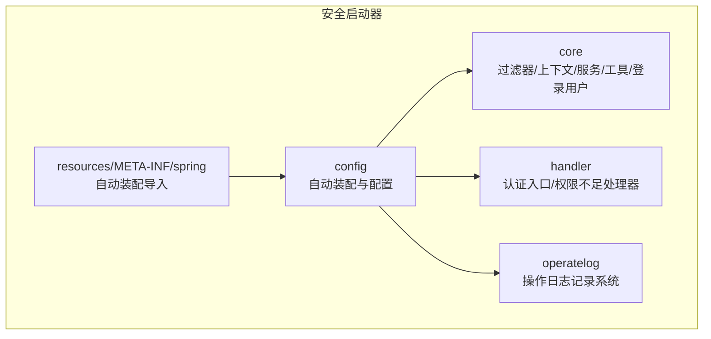
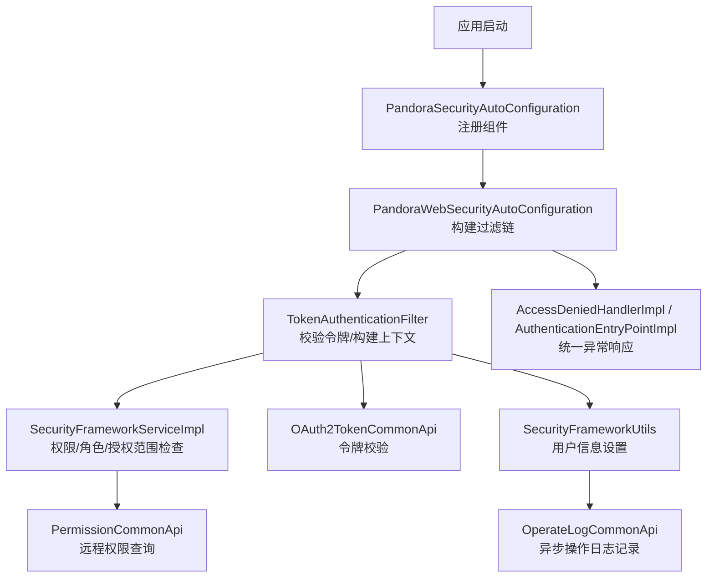
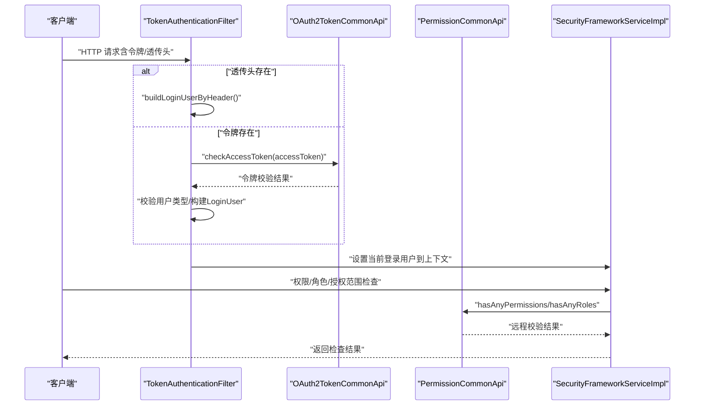
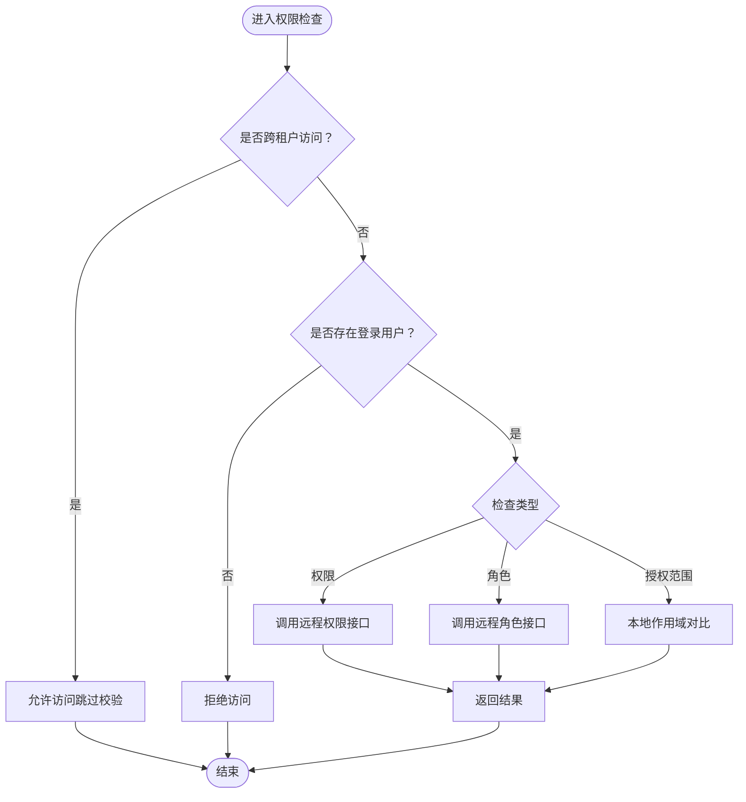
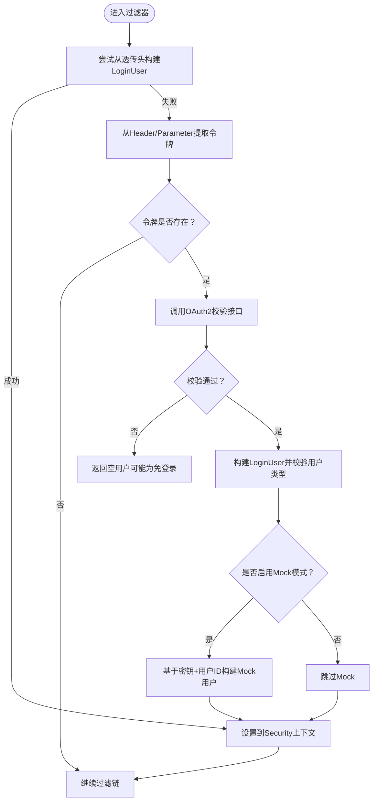
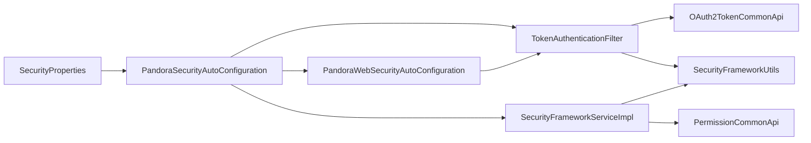

# 安全认证模块

<cite>
**本文引用的文件**
- [PandoraSecurityAutoConfiguration.java](file://pandora-framework/pandora-spring-boot-starter-security/src/main/java/net/ittimeline/pandora/framework/security/config/PandoraSecurityAutoConfiguration.java)
- [SecurityProperties.java](file://pandora-framework/pandora-spring-boot-starter-security/src/main/java/net/ittimeline/pandora/framework/security/config/SecurityProperties.java)
- [PandoraWebSecurityAutoConfiguration.java](file://pandora-framework/pandora-spring-boot-starter-security/src/main/java/net/ittimeline/pandora/framework/security/config/PandoraWebSecurityAutoConfiguration.java)
- [AuthorizeRequestsCustomizer.java](file://pandora-framework/pandora-spring-boot-starter-security/src/main/java/net/ittimeline/pandora/framework/security/config/AuthorizeRequestsCustomizer.java)
- [TokenAuthenticationFilter.java](file://pandora-framework/pandora-spring-boot-starter-security/src/main/java/net/ittimeline/pandora/framework/security/core/filter/TokenAuthenticationFilter.java)
- [SecurityFrameworkService.java](file://pandora-framework/pandora-spring-boot-starter-security/src/main/java/net/ittimeline/pandora/framework/security/core/service/SecurityFrameworkService.java)
- [SecurityFrameworkServiceImpl.java](file://pandora-framework/pandora-spring-boot-starter-security/src/main/java/net/ittimeline/pandora/framework/security/core/service/SecurityFrameworkServiceImpl.java)
- [LoginUser.java](file://pandora-framework/pandora-spring-boot-starter-security/src/main/java/net/ittimeline/pandora/framework/security/core/LoginUser.java)
- [SecurityFrameworkUtils.java](file://pandora-framework/pandora-spring-boot-starter-security/src/main/java/net/ittimeline/pandora/framework/security/core/util/SecurityFrameworkUtils.java)
- [TransmittableThreadLocalSecurityContextHolderStrategy.java](file://pandora-framework/pandora-spring-boot-starter-security/src/main/java/net/ittimeline/pandora/framework/security/core/context/TransmittableThreadLocalSecurityContextHolderStrategy.java)
- [AccessDeniedHandlerImpl.java](file://pandora-framework/pandora-spring-boot-starter-security/src/main/java/net/ittimeline/pandora/framework/security/core/handler/AccessDeniedHandlerImpl.java)
- [AuthenticationEntryPointImpl.java](file://pandora-framework/pandora-spring-boot-starter-security/src/main/java/net/ittimeline/pandora/framework/security/core/handler/AuthenticationEntryPointImpl.java)
- [OAuth2TokenCommonApi.java](file://pandora-framework/pandora-common/src/main/java/net/ittimeline/pandora/framework/common/biz/system/oauth2/OAuth2TokenCommonApi.java)
- [PermissionCommonApi.java](file://pandora-framework/pandora-common/src/main/java/net/ittimeline/pandora/framework/common/biz/system/permission/PermissionCommonApi.java)
- [OAuth2AccessTokenCheckRespDTO.java](file://pandora-framework/pandora-common/src/main/java/net/ittimeline/pandora/framework/common/biz/system/oauth2/dto/OAuth2AccessTokenCheckRespDTO.java)
- [OperateLogCommonApi.java](file://pandora-framework/pandora-common/src/main/java/net/ittimeline/pandora/framework/common/biz/system/logger/OperateLogCommonApi.java)
- [OperateLogCreateReqDTO.java](file://pandora-framework/pandora-common/src/main/java/net/ittimeline/pandora/framework/common/biz/system/logger/dto/OperateLogCreateReqDTO.java)
- [org.springframework.boot.autoconfigure.AutoConfiguration.imports](file://pandora-framework/pandora-spring-boot-starter-security/src/main/resources/META-INF/spring/org.springframework.boot.autoconfigure.AutoConfiguration.imports)
</cite>

## 更新摘要
**所做更改**
- 新增操作日志记录系统的详细实现说明
- 完善OAuth2.0认证流程的技术细节
- 增强权限管理系统的架构分析
- 补充安全框架服务的完整实现机制
- 更新Token认证过滤器的工作原理
- 新增跨租户访问的特殊处理逻辑

## 目录
1. [简介](#简介)
2. [项目结构](#项目结构)
3. [核心组件](#核心组件)
4. [架构总览](#架构总览)
5. [详细组件分析](#详细组件分析)
6. [依赖分析](#依赖分析)
7. [性能考量](#性能考量)
8. [故障排查指南](#故障排查指南)
9. [结论](#结论)
10. [附录](#附录)

## 简介
本文件系统性阐述 Pandora Cloud 框架的安全认证模块，覆盖以下主题：
- OAuth2.0 认证流程的实现机制与配置要点
- 权限管理（权限检查、角色管理、资源授权）的设计与实现
- 操作日志记录机制与安全框架服务的实现细节
- Token 认证过滤器的工作原理
- 与 Spring Security 的集成方式
- 安全模块与 Web 模块的协作关系及扩展点
- 跨租户访问的特殊处理机制

## 项目结构
安全模块位于 pandora-spring-boot-starter-security，核心目录组织如下：
- config：自动装配与配置类（含安全属性、Web 安全配置、RPC 自动装配）
- core：安全核心能力（过滤器、上下文策略、服务、工具类、登录用户模型）
- handler：认证入口与权限不足处理器
- operatelog：操作日志记录系统
- resources/META-INF/spring：Spring Boot 自动装配导入清单

**图表来源**
- [PandoraSecurityAutoConfiguration.java:1-99](file://pandora-framework/pandora-spring-boot-starter-security/src/main/java/net/ittimeline/pandora/framework/security/config/PandoraSecurityAutoConfiguration.java#L1-L99)
- [PandoraWebSecurityAutoConfiguration.java:1-223](file://pandora-framework/pandora-spring-boot-starter-security/src/main/java/net/ittimeline/pandora/framework/security/config/PandoraWebSecurityAutoConfiguration.java#L1-L223)
- [org.springframework.boot.autoconfigure.AutoConfiguration.imports:1-6](file://pandora-framework/pandora-spring-boot-starter-security/src/main/resources/META-INF/spring/org.springframework.boot.autoconfigure.AutoConfiguration.imports#L1-L6)

**章节来源**
- [PandoraSecurityAutoConfiguration.java:1-99](file://pandora-framework/pandora-spring-boot-starter-security/src/main/java/net/ittimeline/pandora/framework/security/config/PandoraSecurityAutoConfiguration.java#L1-L99)
- [PandoraWebSecurityAutoConfiguration.java:1-223](file://pandora-framework/pandora-spring-boot-starter-security/src/main/java/net/ittimeline/pandora/framework/security/config/PandoraWebSecurityAutoConfiguration.java#L1-L223)
- [org.springframework.boot.autoconfigure.AutoConfiguration.imports:1-6](file://pandora-framework/pandora-spring-boot-starter-security/src/main/resources/META-INF/spring/org.springframework.boot.autoconfigure.AutoConfiguration.imports#L1-L6)

## 核心组件
- 安全属性与自动装配：负责加载配置、注册密码编码器、认证入口与权限不足处理器、Token 过滤器、安全框架服务、SecurityContextHolder 策略等。
- Web 安全配置：基于 Spring Security 配置过滤链、免登录 URL 规则、异常处理、会话策略、以及 Token 过滤器的插入位置。
- Token 认证过滤器：从请求中提取令牌或透传头，校验令牌有效性，构建登录用户上下文，支持 Mock 模式与用户类型校验。
- 权限框架服务：封装权限、角色、授权范围的检查逻辑，内置缓存优化远程调用。
- 工具类与上下文策略：提供获取/设置当前登录用户、跳过权限校验的判定、基于 TransmittableThreadLocal 的上下文策略。
- OAuth2 与权限 RPC 接口：通过 Feign 调用系统服务完成令牌校验与权限/角色查询。
- 操作日志记录系统：提供异步操作日志记录功能，支持跨模块的日志统一管理。

**章节来源**
- [SecurityProperties.java:1-58](file://pandora-framework/pandora-spring-boot-starter-security/src/main/java/net/ittimeline/pandora/framework/security/config/SecurityProperties.java#L1-L58)
- [PandoraSecurityAutoConfiguration.java:1-99](file://pandora-framework/pandora-spring-boot-starter-security/src/main/java/net/ittimeline/pandora/framework/security/config/PandoraSecurityAutoConfiguration.java#L1-L99)
- [PandoraWebSecurityAutoConfiguration.java:1-223](file://pandora-framework/pandora-spring-boot-starter-security/src/main/java/net/ittimeline/pandora/framework/security/config/PandoraWebSecurityAutoConfiguration.java#L1-L223)
- [TokenAuthenticationFilter.java:1-157](file://pandora-framework/pandora-spring-boot-starter-security/src/main/java/net/ittimeline/pandora/framework/security/core/filter/TokenAuthenticationFilter.java#L1-L157)
- [SecurityFrameworkService.java:1-61](file://pandora-framework/pandora-spring-boot-starter-security/src/main/java/net/ittimeline/pandora/framework/security/core/service/SecurityFrameworkService.java#L1-L61)
- [SecurityFrameworkServiceImpl.java:1-124](file://pandora-framework/pandora-spring-boot-starter-security/src/main/java/net/ittimeline/pandora/framework/security/core/service/SecurityFrameworkServiceImpl.java#L1-L124)
- [SecurityFrameworkUtils.java:1-163](file://pandora-framework/pandora-spring-boot-starter-security/src/main/java/net/ittimeline/pandora/framework/security/core/util/SecurityFrameworkUtils.java#L1-L163)
- [TransmittableThreadLocalSecurityContextHolderStrategy.java:1-50](file://pandora-framework/pandora-spring-boot-starter-security/src/main/java/net/ittimeline/pandora/framework/security/core/context/TransmittableThreadLocalSecurityContextHolderStrategy.java#L1-L50)
- [OAuth2TokenCommonApi.java:1-34](file://pandora-framework/pandora-common/src/main/java/net/ittimeline/pandora/framework/common/biz/system/oauth2/OAuth2TokenCommonApi.java#L1-L34)
- [PermissionCommonApi.java:1-46](file://pandora-framework/pandora-common/src/main/java/net/ittimeline/pandora/framework/common/biz/system/permission/PermissionCommonApi.java#L1-L46)
- [OperateLogCommonApi.java:1-41](file://pandora-framework/pandora-common/src/main/java/net/ittimeline/pandora/framework/common/biz/system/logger/OperateLogCommonApi.java#L1-L41)

## 架构总览
安全模块通过自动装配在应用启动时完成以下装配：
- 注册密码编码器、认证入口处理器、权限不足处理器、Token 认证过滤器、安全框架服务、SecurityContextHolder 策略
- 在 Web 安全配置中禁用 CSRF 与 Session，开启跨域，配置异常处理，按顺序插入 Token 过滤器，并根据注解与配置确定免登录 URL
- 集成操作日志记录系统，支持异步日志处理

**图表来源**
- [PandoraSecurityAutoConfiguration.java:1-99](file://pandora-framework/pandora-spring-boot-starter-security/src/main/java/net/ittimeline/pandora/framework/security/config/PandoraSecurityAutoConfiguration.java#L1-L99)
- [PandoraWebSecurityAutoConfiguration.java:1-223](file://pandora-framework/pandora-spring-boot-starter-security/src/main/java/net/ittimeline/pandora/framework/security/config/PandoraWebSecurityAutoConfiguration.java#L1-L223)
- [TokenAuthenticationFilter.java:1-157](file://pandora-framework/pandora-spring-boot-starter-security/src/main/java/net/ittimeline/pandora/framework/security/core/filter/TokenAuthenticationFilter.java#L1-L157)
- [SecurityFrameworkServiceImpl.java:1-124](file://pandora-framework/pandora-spring-boot-starter-security/src/main/java/net/ittimeline/pandora/framework/security/core/service/SecurityFrameworkServiceImpl.java#L1-L124)
- [AccessDeniedHandlerImpl.java:1-44](file://pandora-framework/pandora-spring-boot-starter-security/src/main/java/net/ittimeline/pandora/framework/security/core/handler/AccessDeniedHandlerImpl.java#L1-L44)
- [AuthenticationEntryPointImpl.java:1-38](file://pandora-framework/pandora-spring-boot-starter-security/src/main/java/net/ittimeline/pandora/framework/security/core/handler/AuthenticationEntryPointImpl.java#L1-L38)

## 详细组件分析

### OAuth2.0 认证流程与配置
- 令牌来源与提取
  - 支持从请求头与请求参数读取令牌，默认头名为配置项，参数名为配置项；若存在"Bearer "前缀，会自动去除。
- 令牌校验
  - 通过 OAuth2TokenCommonApi 远程调用系统服务进行校验，返回包含用户标识、用户类型、租户、作用域与过期时间的数据对象。
- 用户类型校验
  - 对于特定前缀的接口（如管理端/应用端），若请求中携带用户类型，需与令牌中的用户类型一致，否则拒绝访问。
- Mock 模式
  - 开发调试可用，要求令牌以配置的密钥开头，随后拼接用户编号；生产环境务必关闭。
- 跨租户访问
  - 若访问租户与当前租户不一致，将跳过权限校验，避免跨租户的权限判断失效。

**图表来源**
- [TokenAuthenticationFilter.java:1-157](file://pandora-framework/pandora-spring-boot-starter-security/src/main/java/net/ittimeline/pandora/framework/security/core/filter/TokenAuthenticationFilter.java#L1-L157)
- [OAuth2TokenCommonApi.java:1-34](file://pandora-framework/pandora-common/src/main/java/net/ittimeline/pandora/framework/common/biz/system/oauth2/OAuth2TokenCommonApi.java#L1-L34)
- [SecurityFrameworkServiceImpl.java:1-124](file://pandora-framework/pandora-spring-boot-starter-security/src/main/java/net/ittimeline/pandora/framework/security/core/service/SecurityFrameworkServiceImpl.java#L1-L124)
- [PermissionCommonApi.java:1-46](file://pandora-framework/pandora-common/src/main/java/net/ittimeline/pandora/framework/common/biz/system/permission/PermissionCommonApi.java#L1-L46)

**章节来源**
- [TokenAuthenticationFilter.java:1-157](file://pandora-framework/pandora-spring-boot-starter-security/src/main/java/net/ittimeline/pandora/framework/security/core/filter/TokenAuthenticationFilter.java#L1-L157)
- [OAuth2TokenCommonApi.java:1-34](file://pandora-framework/pandora-common/src/main/java/net/ittimeline/pandora/framework/common/biz/system/oauth2/OAuth2TokenCommonApi.java#L1-L34)
- [SecurityFrameworkUtils.java:1-163](file://pandora-framework/pandora-spring-boot-starter-security/src/main/java/net/ittimeline/pandora/framework/security/core/util/SecurityFrameworkUtils.java#L1-L163)

### 权限管理系统设计
- 权限检查
  - hasPermission/hasAnyPermissions：基于用户 ID 与权限集合进行远程校验，使用本地缓存减少重复调用。
- 角色管理
  - hasRole/hasAnyRoles：基于用户 ID 与角色集合进行远程校验，同样使用缓存。
- 资源授权
  - hasScope/hasAnyScopes：基于登录用户的作用域列表进行本地判断。
- 跳过校验
  - 当访问租户与当前租户不一致时，直接跳过权限校验，避免跨租户场景下的权限判断异常。

**图表来源**
- [SecurityFrameworkServiceImpl.java:1-124](file://pandora-framework/pandora-spring-boot-starter-security/src/main/java/net/ittimeline/pandora/framework/security/core/service/SecurityFrameworkServiceImpl.java#L1-L124)
- [SecurityFrameworkUtils.java:1-163](file://pandora-framework/pandora-spring-boot-starter-security/src/main/java/net/ittimeline/pandora/framework/security/core/util/SecurityFrameworkUtils.java#L1-L163)

**章节来源**
- [SecurityFrameworkService.java:1-61](file://pandora-framework/pandora-spring-boot-starter-security/src/main/java/net/ittimeline/pandora/framework/security/core/service/SecurityFrameworkService.java#L1-L61)
- [SecurityFrameworkServiceImpl.java:1-124](file://pandora-framework/pandora-spring-boot-starter-security/src/main/java/net/ittimeline/pandora/framework/security/core/service/SecurityFrameworkServiceImpl.java#L1-L124)

### Token 认证过滤器工作原理
- 优先从请求头读取透传的登录用户信息，构造 LoginUser 并设置到上下文
- 若无透传头，则从请求头或参数提取令牌，调用 OAuth2 校验接口
- 校验通过后，构建 LoginUser（包含用户 ID、类型、租户、作用域、过期时间），并设置到上下文
- 支持 Mock 模式，便于开发调试
- 若出现异常，交由全局异常处理器统一输出 JSON

**图表来源**
- [TokenAuthenticationFilter.java:1-157](file://pandora-framework/pandora-spring-boot-starter-security/src/main/java/net/ittimeline/pandora/framework/security/core/filter/TokenAuthenticationFilter.java#L1-L157)

**章节来源**
- [TokenAuthenticationFilter.java:1-157](file://pandora-framework/pandora-spring-boot-starter-security/src/main/java/net/ittimeline/pandora/framework/security/core/filter/TokenAuthenticationFilter.java#L1-L157)

### 安全框架服务实现细节
- 接口职责
  - hasPermission/hasAnyPermissions：权限校验
  - hasRole/hasAnyRoles：角色校验
  - hasScope/hasAnyScopes：授权范围校验
- 缓存策略
  - 基于 Guava Cache，键为用户 ID + 权限/角色集合，过期时间 1 分钟，降低远程调用压力
- 跳过校验
  - 通过工具类判定跨租户访问场景，直接放行

**章节来源**
- [SecurityFrameworkService.java:1-61](file://pandora-framework/pandora-spring-boot-starter-security/src/main/java/net/ittimeline/pandora/framework/security/core/service/SecurityFrameworkService.java#L1-L61)
- [SecurityFrameworkServiceImpl.java:1-124](file://pandora-framework/pandora-spring-boot-starter-security/src/main/java/net/ittimeline/pandora/framework/security/core/service/SecurityFrameworkServiceImpl.java#L1-L124)

### 操作日志记录机制
- 日志记录在 Web 层完成，安全层通过工具类将当前用户 ID 与用户类型写入请求上下文，供日志过滤器/拦截器使用
- 这样即使 Spring Security 的过滤器链在日志之后执行，也能正确获取用户信息
- 支持异步日志记录，通过 @Async 注解实现非阻塞的日志处理
- 提供同步和异步两种日志记录方式，满足不同场景需求

**章节来源**
- [SecurityFrameworkUtils.java:1-163](file://pandora-framework/pandora-spring-boot-starter-security/src/main/java/net/ittimeline/pandora/framework/security/core/util/SecurityFrameworkUtils.java#L1-L163)
- [OperateLogCommonApi.java:1-41](file://pandora-framework/pandora-common/src/main/java/net/ittimeline/pandora/framework/common/biz/system/logger/OperateLogCommonApi.java#L1-L41)

### Spring Security 集成与配置
- 自动装配
  - 通过 AutoConfiguration 导入安全相关组件，确保在 Spring Security 自动配置之前生效
- Web 安全配置
  - 禁用 CSRF 与 Session，开启跨域与 CORS
  - 统一异常处理：未登录返回 401，权限不足返回 403
  - 免登录 URL 来源：
    - 注解扫描：遍历所有控制器方法，收集标注 @PermitAll 的接口
    - 配置项：pandora.security.permit-all-urls
  - 过滤链插入：在用户名密码过滤器之前插入 TokenAuthenticationFilter
- 方法级安全
  - 启用 @Secured 等方法级安全注解

**章节来源**
- [PandoraWebSecurityAutoConfiguration.java:1-223](file://pandora-framework/pandora-spring-boot-starter-security/src/main/java/net/ittimeline/pandora/framework/security/config/PandoraWebSecurityAutoConfiguration.java#L1-L223)
- [AuthorizeRequestsCustomizer.java:1-38](file://pandora-framework/pandora-spring-boot-starter-security/src/main/java/net/ittimeline/pandora/framework/security/config/AuthorizeRequestsCustomizer.java#L1-L38)

### 安全模块与 Web 模块协作
- Web 层提供请求上下文工具，安全层通过 setLoginUserId/setLoginUserType 将用户信息写入请求，供日志与后续处理使用
- 安全层负责认证与鉴权，Web 层负责请求处理与异常统一输出
- 操作日志系统通过 WebFrameworkUtils 获取用户信息，确保日志记录的准确性

**章节来源**
- [SecurityFrameworkUtils.java:1-163](file://pandora-framework/pandora-spring-boot-starter-security/src/main/java/net/ittimeline/pandora/framework/security/core/util/SecurityFrameworkUtils.java#L1-L163)

### 扩展自定义安全功能
- 自定义 URL 安全规则
  - 实现 AuthorizeRequestsCustomizer 接口，通过 buildAdminApi/buildAppApi 构建前缀，返回授权规则
- 自定义免登录接口
  - 在控制器上使用 @PermitAll 注解，Web 安全配置会自动收集并放行
- 自定义异常处理
  - 可替换 AuthenticationEntryPoint 与 AccessDeniedHandler 的实现

**章节来源**
- [AuthorizeRequestsCustomizer.java:1-38](file://pandora-framework/pandora-spring-boot-starter-security/src/main/java/net/ittimeline/pandora/framework/security/config/AuthorizeRequestsCustomizer.java#L1-L38)
- [PandoraWebSecurityAutoConfiguration.java:1-223](file://pandora-framework/pandora-spring-boot-starter-security/src/main/java/net/ittimeline/pandora/framework/security/config/PandoraWebSecurityAutoConfiguration.java#L1-L223)

## 依赖分析
- 组件耦合
  - TokenAuthenticationFilter 依赖 SecurityProperties、GlobalExceptionHandler、OAuth2TokenCommonApi
  - SecurityFrameworkServiceImpl 依赖 PermissionCommonApi，并使用工具类获取当前用户
  - Web 安全配置依赖 TokenAuthenticationFilter、AuthenticationEntryPoint、AccessDeniedHandler、SecurityProperties、WebProperties
- 外部依赖
  - Spring Security、Feign、BCryptPasswordEncoder、Guava Cache、TransmittableThreadLocal

**图表来源**
- [PandoraSecurityAutoConfiguration.java:1-99](file://pandora-framework/pandora-spring-boot-starter-security/src/main/java/net/ittimeline/pandora/framework/security/config/PandoraSecurityAutoConfiguration.java#L1-L99)
- [PandoraWebSecurityAutoConfiguration.java:1-223](file://pandora-framework/pandora-spring-boot-starter-security/src/main/java/net/ittimeline/pandora/framework/security/config/PandoraWebSecurityAutoConfiguration.java#L1-L223)
- [TokenAuthenticationFilter.java:1-157](file://pandora-framework/pandora-spring-boot-starter-security/src/main/java/net/ittimeline/pandora/framework/security/core/filter/TokenAuthenticationFilter.java#L1-L157)
- [SecurityFrameworkServiceImpl.java:1-124](file://pandora-framework/pandora-spring-boot-starter-security/src/main/java/net/ittimeline/pandora/framework/security/core/service/SecurityFrameworkServiceImpl.java#L1-L124)
- [OAuth2TokenCommonApi.java:1-34](file://pandora-framework/pandora-common/src/main/java/net/ittimeline/pandora/framework/common/biz/system/oauth2/OAuth2TokenCommonApi.java#L1-L34)
- [PermissionCommonApi.java:1-46](file://pandora-framework/pandora-common/src/main/java/net/ittimeline/pandora/framework/common/biz/system/permission/PermissionCommonApi.java#L1-L46)

**章节来源**
- [PandoraSecurityAutoConfiguration.java:1-99](file://pandora-framework/pandora-spring-boot-starter-security/src/main/java/net/ittimeline/pandora/framework/security/config/PandoraSecurityAutoConfiguration.java#L1-L99)
- [PandoraWebSecurityAutoConfiguration.java:1-223](file://pandora-framework/pandora-spring-boot-starter-security/src/main/java/net/ittimeline/pandora/framework/security/config/PandoraWebSecurityAutoConfiguration.java#L1-L223)

## 性能考量
- 缓存优化
  - 权限/角色检查使用本地缓存，过期时间 1 分钟，显著降低远程调用次数
- 令牌校验
  - 仅在存在令牌时触发远程校验；透传头场景无需远程调用
- 会话策略
  - 无状态设计，禁用 Session，降低服务器内存占用
- 异步场景
  - 使用 TransmittableThreadLocal 保障异步任务中的安全上下文传递
- 操作日志异步处理
  - 通过 @Async 注解实现异步日志记录，避免阻塞主业务流程

**章节来源**
- [SecurityFrameworkServiceImpl.java:1-124](file://pandora-framework/pandora-spring-boot-starter-security/src/main/java/net/ittimeline/pandora/framework/security/core/service/SecurityFrameworkServiceImpl.java#L1-L124)
- [TransmittableThreadLocalSecurityContextHolderStrategy.java:1-50](file://pandora-framework/pandora-spring-boot-starter-security/src/main/java/net/ittimeline/pandora/framework/security/core/context/TransmittableThreadLocalSecurityContextHolderStrategy.java#L1-L50)
- [OperateLogCommonApi.java:1-41](file://pandora-framework/pandora-common/src/main/java/net/ittimeline/pandora/framework/common/biz/system/logger/OperateLogCommonApi.java#L1-L41)

## 故障排查指南
- 未登录访问
  - 现象：返回 401
  - 原因：访问受保护资源但未提供有效令牌或未通过认证
  - 处理：在请求中提供正确的令牌或完成登录流程
- 权限不足
  - 现象：返回 403
  - 原因：已登录但不具备所需权限/角色/授权范围
  - 处理：确认用户权限、角色或授权范围是否正确
- 令牌无效或过期
  - 现象：远程校验失败，返回空用户
  - 处理：重新获取令牌或检查系统时间与令牌有效期
- 用户类型不匹配
  - 现象：抛出权限不足异常
  - 处理：确认请求的用户类型与令牌中的用户类型一致
- Mock 模式误用
  - 现象：生产环境出现 Mock 用户
  - 处理：关闭 mockEnable，确保 mockSecret 正确配置且不泄露
- 跨租户访问异常
  - 现象：权限校验失败
  - 处理：确认访问租户与当前租户一致性，必要时调整业务逻辑
- 操作日志记录失败
  - 现象：日志未记录或记录异常
  - 处理：检查 OperateLogCommonApi 配置，确认异步线程池配置正确

**章节来源**
- [AuthenticationEntryPointImpl.java:1-38](file://pandora-framework/pandora-spring-boot-starter-security/src/main/java/net/ittimeline/pandora/framework/security/core/handler/AuthenticationEntryPointImpl.java#L1-L38)
- [AccessDeniedHandlerImpl.java:1-44](file://pandora-framework/pandora-spring-boot-starter-security/src/main/java/net/ittimeline/pandora/framework/security/core/handler/AccessDeniedHandlerImpl.java#L1-L44)
- [TokenAuthenticationFilter.java:1-157](file://pandora-framework/pandora-spring-boot-starter-security/src/main/java/net/ittimeline/pandora/framework/security/core/filter/TokenAuthenticationFilter.java#L1-L157)

## 结论
Pandora Cloud 安全认证模块通过无状态的 OAuth2.0 令牌校验、灵活的权限/角色/授权范围检查、完善的异常处理与缓存优化，提供了高可用、易扩展的安全基础设施。结合 Spring Security 的自动装配与 Web 层的协作，开发者可快速集成并定制化安全策略。新增的操作日志记录系统进一步完善了安全监控能力，为系统审计和问题追踪提供了有力支撑。

## 附录

### 配置示例（基于属性）
- 令牌请求头与参数
  - pandora.security.token-header=Authorization
  - pandora.security.token-parameter=token
- Mock 模式
  - pandora.security.mock-enable=false
  - pandora.security.mock-secret=your-secret-key
- 免登录 URL
  - pandora.security.permit-all-urls[0]=/api/public/**
- 密码编码器复杂度
  - pandora.security.password-encoder-length=4

**章节来源**
- [SecurityProperties.java:1-58](file://pandora-framework/pandora-spring-boot-starter-security/src/main/java/net/ittimeline/pandora/framework/security/config/SecurityProperties.java#L1-L58)

### 使用场景
- 管理端与应用端分离
  - 通过用户类型校验确保不同端口的用户类型一致
- 微服务网关直连
  - 支持透传头 login-user，避免二次校验
- 开发调试
  - 使用 Mock 模式快速切换用户身份
- 跨租户访问
  - 在特定场景下跳过权限校验，保证业务可用性
- 操作审计
  - 通过异步日志记录系统实现完整的操作审计跟踪

**章节来源**
- [TokenAuthenticationFilter.java:1-157](file://pandora-framework/pandora-spring-boot-starter-security/src/main/java/net/ittimeline/pandora/framework/security/core/filter/TokenAuthenticationFilter.java#L1-L157)
- [SecurityFrameworkUtils.java:1-163](file://pandora-framework/pandora-spring-boot-starter-security/src/main/java/net/ittimeline/pandora/framework/security/core/util/SecurityFrameworkUtils.java#L1-L163)
- [OperateLogCommonApi.java:1-41](file://pandora-framework/pandora-common/src/main/java/net/ittimeline/pandora/framework/common/biz/system/logger/OperateLogCommonApi.java#L1-L41)