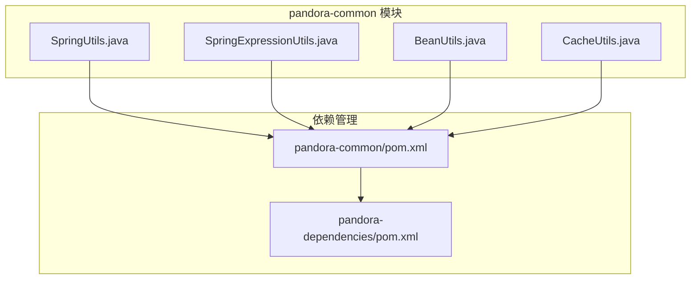
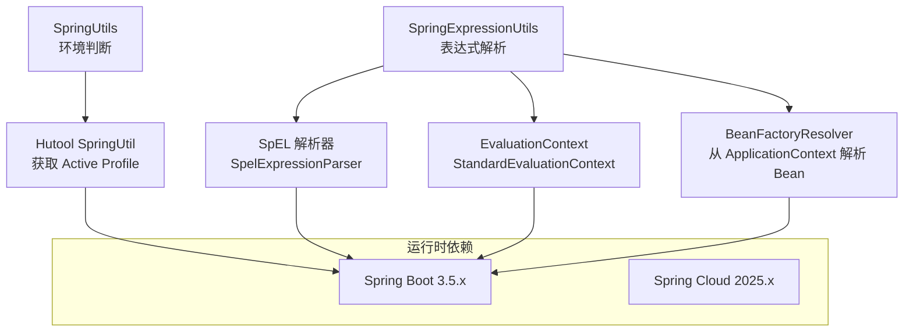
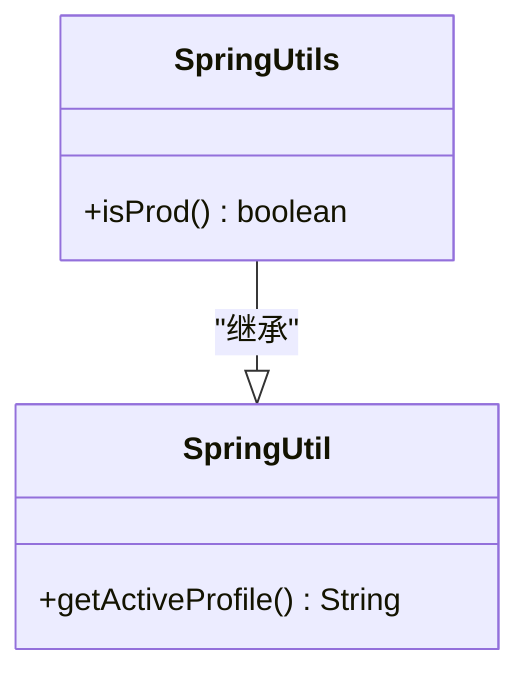
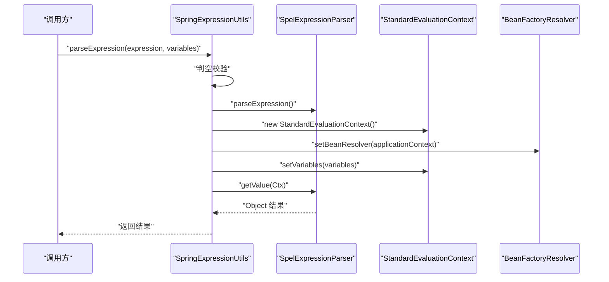
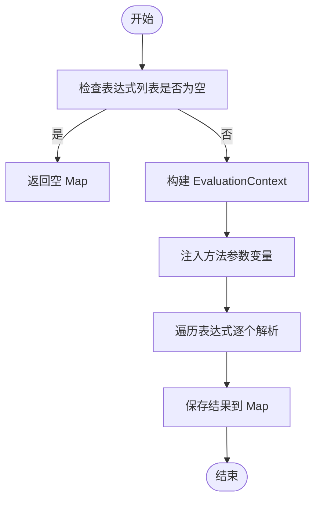
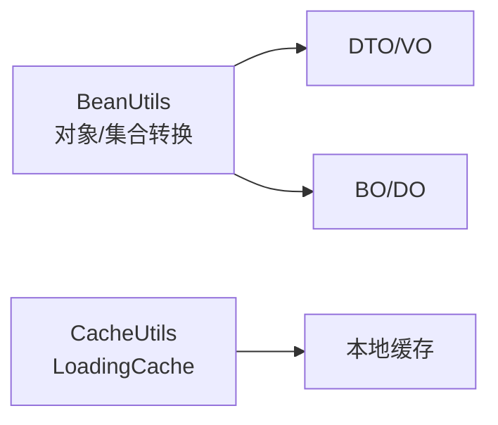
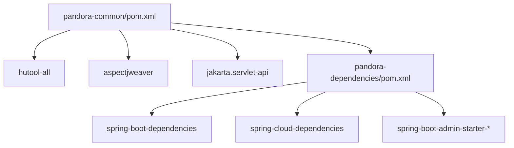

# Spring 工具类

<cite>
**本文引用的文件**
- [SpringUtils.java](file://pandora-framework/pandora-common/src/main/java/net/ittimeline/pandora/framework/common/util/web/spring/SpringUtils.java)
- [SpringExpressionUtils.java](file://pandora-framework/pandora-common/src/main/java/net/ittimeline/pandora/framework/common/util/web/spring/SpringExpressionUtils.java)
- [pandora-common/pom.xml](file://pandora-framework/pandora-common/pom.xml)
- [pandora-dependencies/pom.xml](file://pandora-dependencies/pom.xml)
- [BeanUtils.java](file://pandora-framework/pandora-common/src/main/java/net/ittimeline/pandora/framework/common/util/foundational/object/BeanUtils.java)
- [CacheUtils.java](file://pandora-framework/pandora-common/src/main/java/net/ittimeline/pandora/framework/common/util/web/cache/CacheUtils.java)
</cite>

## 目录
1. [引言](#引言)
2. [项目结构](#项目结构)
3. [核心组件](#核心组件)
4. [架构总览](#架构总览)
5. [详细组件分析](#详细组件分析)
6. [依赖分析](#依赖分析)
7. [性能考虑](#性能考虑)
8. [故障排除指南](#故障排除指南)
9. [结论](#结论)
10. [附录](#附录)

## 引言
本文件面向微服务与企业级应用开发场景，系统性梳理并讲解两类 Spring 工具类的设计与实践要点：
- SpringUtils：基于 Hutool 的 Spring 上下文工具扩展，提供环境判断等便捷能力。
- SpringExpressionUtils：基于 Spring Expression Language（SpEL）的表达式求值工具，支持切面与 Bean 工厂两种上下文，具备变量绑定与动态计算能力。

文档将结合微服务架构下的上下文管理、表达式语言安全使用、Bean 生命周期管理与性能优化策略，给出 Spring Boot 与 Spring Cloud 环境下的落地建议与排障指引。

## 项目结构
围绕 Spring 工具类所在模块，关键目录与职责如下：
- pandora-common：通用工具与基础能力所在模块，包含 SpringUtils、SpringExpressionUtils、BeanUtils、CacheUtils 等工具类。
- pandora-dependencies：统一管理依赖版本，明确 Spring Boot 与 Spring Cloud 的版本坐标，确保工具类运行时依赖的一致性。

图表来源
- [SpringUtils.java:1-24](file://pandora-framework/pandora-common/src/main/java/net/ittimeline/pandora/framework/common/util/web/spring/SpringUtils.java#L1-L24)
- [SpringExpressionUtils.java:1-124](file://pandora-framework/pandora-common/src/main/java/net/ittimeline/pandora/framework/common/util/web/spring/SpringExpressionUtils.java#L1-L124)
- [BeanUtils.java:1-69](file://pandora-framework/pandora-common/src/main/java/net/ittimeline/pandora/framework/common/util/foundational/object/BeanUtils.java#L1-L69)
- [CacheUtils.java:1-60](file://pandora-framework/pandora-common/src/main/java/net/ittimeline/pandora/framework/common/util/web/cache/CacheUtils.java#L1-L60)
- [pandora-common/pom.xml:1-101](file://pandora-framework/pandora-common/pom.xml#L1-L101)
- [pandora-dependencies/pom.xml:117-145](file://pandora-dependencies/pom.xml#L117-L145)

章节来源
- [pandora-common/pom.xml:1-101](file://pandora-framework/pandora-common/pom.xml#L1-L101)
- [pandora-dependencies/pom.xml:117-145](file://pandora-dependencies/pom.xml#L117-L145)

## 核心组件
- SpringUtils：继承自 Hutool 的 SpringUtil，提供环境判断能力（如是否为生产环境），便于在运行时根据激活的 profile 做差异化行为控制。
- SpringExpressionUtils：提供两类表达式解析入口：
  - 基于切面 JoinPoint 的解析：自动从方法签名提取参数名与实参，构建 EvaluationContext 并执行表达式。
  - 基于 Bean 工厂的解析：通过 BeanFactoryResolver 解析容器内 Bean，并支持传入额外变量上下文。

章节来源
- [SpringUtils.java:13-24](file://pandora-framework/pandora-common/src/main/java/net/ittimeline/pandora/framework/common/util/web/spring/SpringUtils.java#L13-L24)
- [SpringExpressionUtils.java:31-123](file://pandora-framework/pandora-common/src/main/java/net/ittimeline/pandora/framework/common/util/web/spring/SpringExpressionUtils.java#L31-L123)

## 架构总览
从模块与依赖视角看，Spring 工具类的运行时依赖由依赖管理模块统一约束，确保与 Spring Boot 3 与 Spring Cloud 的兼容性；工具类本身通过 Hutool 与 Spring 的标准 API 协作，形成“轻量、稳定、可复用”的基础设施层。

图表来源
- [SpringExpressionUtils.java:35-122](file://pandora-framework/pandora-common/src/main/java/net/ittimeline/pandora/framework/common/util/web/spring/SpringExpressionUtils.java#L35-L122)
- [SpringUtils.java:13-22](file://pandora-framework/pandora-common/src/main/java/net/ittimeline/pandora/framework/common/util/web/spring/SpringUtils.java#L13-L22)
- [pandora-dependencies/pom.xml:21-23](file://pandora-dependencies/pom.xml#L21-L23)

## 详细组件分析

### SpringUtils 组件分析
- 设计要点
  - 继承 Hutool 的 SpringUtil，复用其上下文获取能力。
  - 提供 isProd 判断，基于 active profile 值进行环境判定。
- 使用建议
  - 在配置开关、日志级别、限流阈值等场景按环境差异化配置。
  - 与 Spring Cloud Config 或环境变量配合，确保 profile 与部署环境一致。

图表来源
- [SpringUtils.java:13-24](file://pandora-framework/pandora-common/src/main/java/net/ittimeline/pandora/framework/common/util/web/spring/SpringUtils.java#L13-L24)

章节来源
- [SpringUtils.java:13-24](file://pandora-framework/pandora-common/src/main/java/net/ittimeline/pandora/framework/common/util/web/spring/SpringUtils.java#L13-L24)

### SpringExpressionUtils 组件分析
- 设计要点
  - 静态解析器与参数名发现器：减少重复创建开销，提升批量解析效率。
  - 两种解析入口：
    - 切面解析：从 JoinPoint 获取方法签名与参数，自动注入上下文变量。
    - Bean 工厂解析：通过 BeanFactoryResolver 解析容器 Bean，支持外部变量注入。
- 安全与性能
  - 表达式输入校验：判空保护，避免无效表达式导致异常。
  - 上下文隔离：分别针对切面与 Bean 工厂构建独立 EvaluationContext，降低耦合。
  - 变量命名：优先使用方法参数名，避免硬编码键名，提高可读性与安全性。

图表来源
- [SpringExpressionUtils.java:111-122](file://pandora-framework/pandora-common/src/main/java/net/ittimeline/pandora/framework/common/util/web/spring/SpringExpressionUtils.java#L111-L122)

图表来源
- [SpringExpressionUtils.java:63-92](file://pandora-framework/pandora-common/src/main/java/net/ittimeline/pandora/framework/common/util/web/spring/SpringExpressionUtils.java#L63-L92)

章节来源
- [SpringExpressionUtils.java:31-123](file://pandora-framework/pandora-common/src/main/java/net/ittimeline/pandora/framework/common/util/web/spring/SpringExpressionUtils.java#L31-L123)

### BeanUtils 与 CacheUtils 的协同
- BeanUtils：提供对象与集合的转换、复制等基础能力，常用于 DTO/BO 转换与分页结果转换。
- CacheUtils：提供基于 Guava 的 LoadingCache 构建能力，支持同步与异步刷新，适合热点数据的本地缓存。

图表来源
- [BeanUtils.java:19-68](file://pandora-framework/pandora-common/src/main/java/net/ittimeline/pandora/framework/common/util/foundational/object/BeanUtils.java#L19-L68)
- [CacheUtils.java:37-59](file://pandora-framework/pandora-common/src/main/java/net/ittimeline/pandora/framework/common/util/web/cache/CacheUtils.java#L37-L59)

章节来源
- [BeanUtils.java:19-68](file://pandora-framework/pandora-common/src/main/java/net/ittimeline/pandora/framework/common/util/foundational/object/BeanUtils.java#L19-L68)
- [CacheUtils.java:16-60](file://pandora-framework/pandora-common/src/main/java/net/ittimeline/pandora/framework/common/util/web/cache/CacheUtils.java#L16-L60)

## 依赖分析
- 依赖来源
  - Hutool：提供 Spring 上下文工具、集合/字符串/IO 等常用能力。
  - Spring 生态：Spring Boot 3 与 Spring Cloud 2025，确保与 Jakarta Servlet、AspectJ、WebMvc 等生态兼容。
- 版本约束
  - 依赖管理模块统一声明 Spring Boot 与 Spring Cloud 版本，避免工具类运行时出现版本冲突。

图表来源
- [pandora-common/pom.xml:26-98](file://pandora-framework/pandora-common/pom.xml#L26-L98)
- [pandora-dependencies/pom.xml:117-145](file://pandora-dependencies/pom.xml#L117-L145)

章节来源
- [pandora-common/pom.xml:26-98](file://pandora-framework/pandora-common/pom.xml#L26-L98)
- [pandora-dependencies/pom.xml:117-145](file://pandora-dependencies/pom.xml#L117-L145)

## 性能考虑
- 表达式解析
  - 复用静态解析器与参数名发现器，避免频繁创建实例。
  - 批量解析时，统一构建 EvaluationContext 并复用，减少上下文初始化成本。
- 上下文隔离
  - 切面解析与 Bean 工厂解析分别构建独立上下文，避免相互污染。
- 缓存策略
  - 对热点表达式或频繁访问的 Bean 属性，结合本地缓存（LoadingCache）降低重复解析与查询开销。
- 线程模型
  - 异步刷新的 LoadingCache 适合高并发场景，注意与线程上下文的兼容性问题。

章节来源
- [SpringExpressionUtils.java:35-39](file://pandora-framework/pandora-common/src/main/java/net/ittimeline/pandora/framework/common/util/web/spring/SpringExpressionUtils.java#L35-L39)
- [CacheUtils.java:37-59](file://pandora-framework/pandora-common/src/main/java/net/ittimeline/pandora/framework/common/util/web/cache/CacheUtils.java#L37-L59)

## 故障排除指南
- 表达式为空或格式错误
  - 现象：解析返回空或抛出异常。
  - 排查：确认表达式字符串非空且符合 SpEL 语法；必要时开启调试日志定位具体表达式。
- 参数名不可用
  - 现象：切面解析无法注入方法参数变量。
  - 排查：确认编译时保留参数名（如启用 debug 信息），或在方法上显式声明参数名。
- Bean 解析失败
  - 现象：通过 Bean 工厂解析表达式时找不到 Bean。
  - 排查：确认 ApplicationContext 已初始化，Bean 名称正确，且表达式中引用的 Bean 已注册。
- 环境判断异常
  - 现象：isProd 返回不符合预期。
  - 排查：确认 active profile 配置正确，部署环境与 profile 一致。

章节来源
- [SpringExpressionUtils.java:63-92](file://pandora-framework/pandora-common/src/main/java/net/ittimeline/pandora/framework/common/util/web/spring/SpringExpressionUtils.java#L63-L92)
- [SpringUtils.java:19-22](file://pandora-framework/pandora-common/src/main/java/net/ittimeline/pandora/framework/common/util/web/spring/SpringUtils.java#L19-L22)

## 结论
SpringUtils 与 SpringExpressionUtils 作为通用工具类，提供了环境判断与表达式求值两大核心能力。在微服务架构中，建议：
- 将环境判断与配置开关解耦，通过 profile 与外部配置中心协同。
- 在切面与 Bean 工厂两种上下文中谨慎选择表达式解析入口，确保上下文隔离与变量可见性。
- 结合本地缓存与性能监控，持续优化热点表达式与 Bean 访问的性能表现。

## 附录
- 实际应用示例（思路与步骤）
  - 环境差异化配置：在启动参数或配置中心设置 active profile，使用 isProd 控制日志级别或限流策略。
  - 动态计算：在业务方法上使用注解触发切面，利用 parseExpression/parseExpressions 对输入参数进行动态计算与校验。
  - Bean 访问：在表达式中通过 BeanFactoryResolver 访问容器内的服务 Bean，实现动态路由或策略选择。
- 最佳实践
  - 表达式最小化：仅在必要时使用 SpEL，避免复杂逻辑下沉到表达式。
  - 变量命名规范：统一使用方法参数名，减少硬编码键名。
  - 缓存命中率：对热点表达式结果进行缓存，降低重复解析成本。