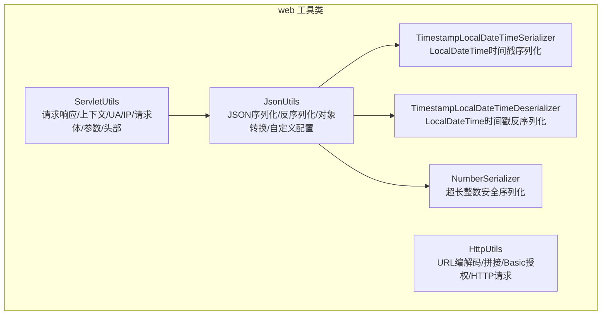
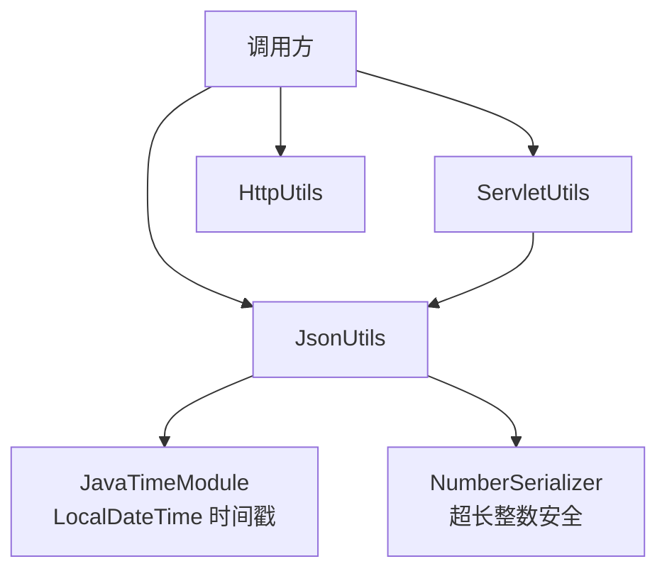
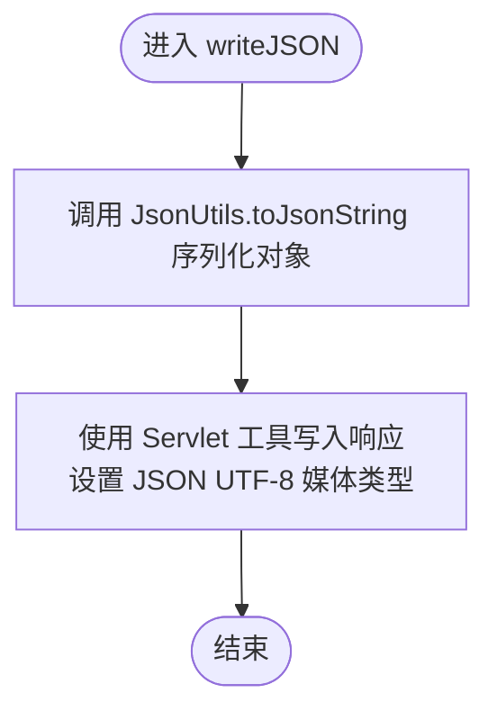
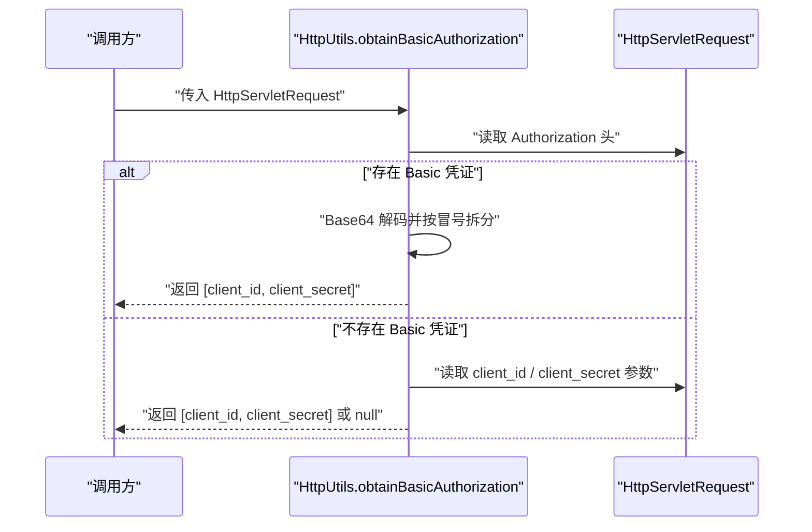
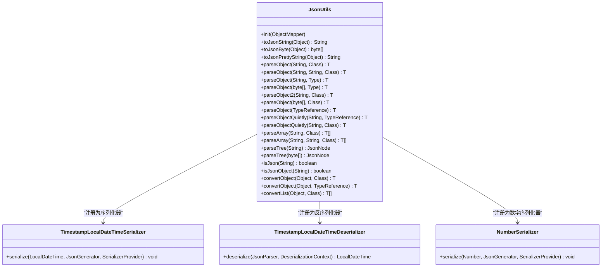
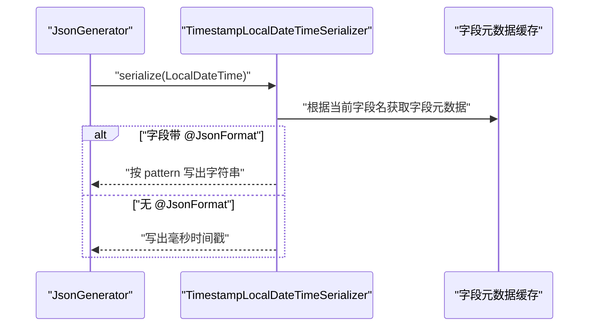
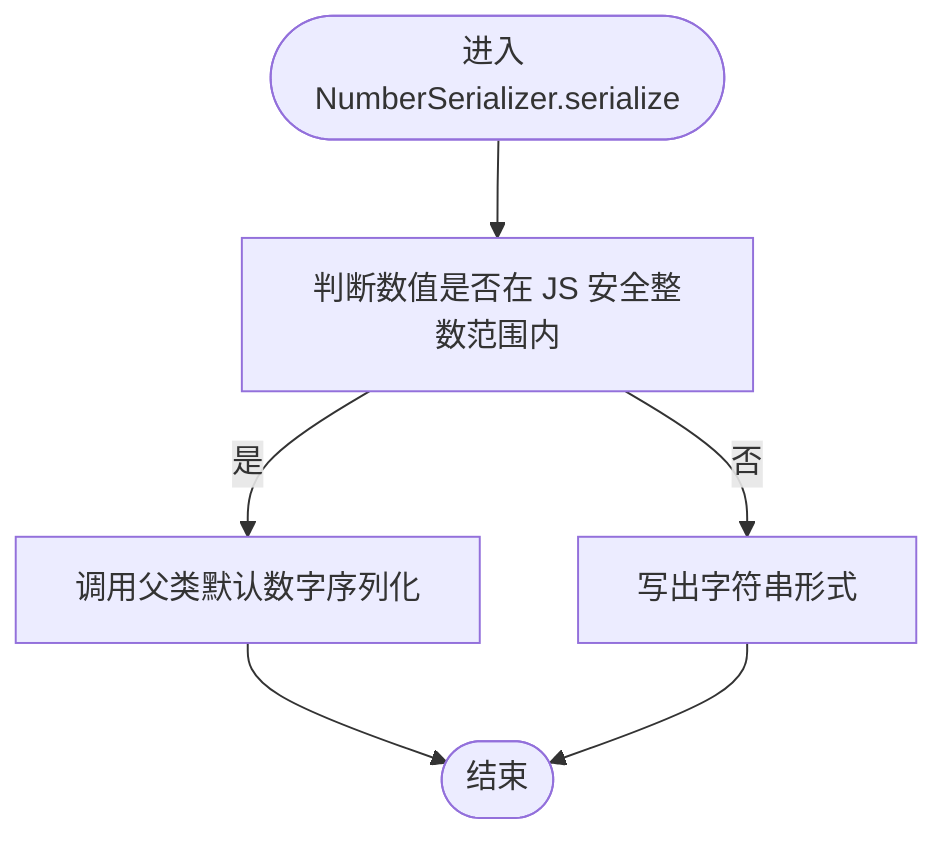
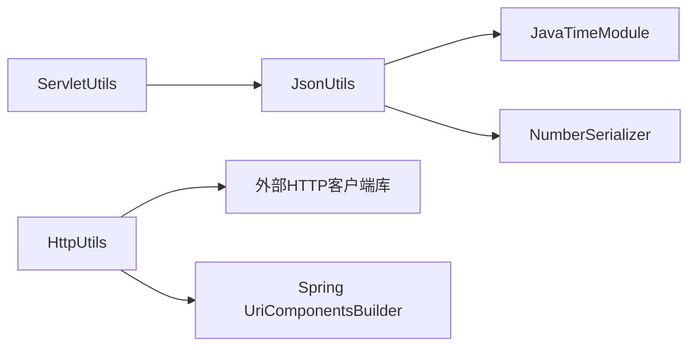

# Web 工具类

<cite>
**本文引用的文件**
- [ServletUtils.java](file://pandora-framework/pandora-common/src/main/java/net/ittimeline/pandora/framework/common/util/web/servlet/ServletUtils.java)
- [HttpUtils.java](file://pandora-framework/pandora-common/src/main/java/net/ittimeline/pandora/framework/common/util/web/http/HttpUtils.java)
- [JsonUtils.java](file://pandora-framework/pandora-common/src/main/java/net/ittimeline/pandora/framework/common/util/web/json/JsonUtils.java)
- [TimestampLocalDateTimeSerializer.java](file://pandora-framework/pandora-common/src/main/java/net/ittimeline/pandora/framework/common/util/web/json/databind/TimestampLocalDateTimeSerializer.java)
- [TimestampLocalDateTimeDeserializer.java](file://pandora-framework/pandora-common/src/main/java/net/ittimeline/pandora/framework/common/util/web/json/databind/TimestampLocalDateTimeDeserializer.java)
- [NumberSerializer.java](file://pandora-framework/pandora-common/src/main/java/net/ittimeline/pandora/framework/common/util/web/json/databind/NumberSerializer.java)
</cite>

## 目录
1. [简介](#简介)
2. [项目结构](#项目结构)
3. [核心组件](#核心组件)
4. [架构总览](#架构总览)
5. [详细组件分析](#详细组件分析)
6. [依赖分析](#依赖分析)
7. [性能考量](#性能考量)
8. [故障排查指南](#故障排查指南)
9. [结论](#结论)
10. [附录](#附录)

## 简介
本文件面向 Web 开发中的常用工具类，系统性梳理以下能力：
- ServletUtils：请求响应处理、会话与上下文获取、UA 识别、客户端 IP 获取、请求体读取、参数与头部映射。
- HttpUtils：URL 编解码、查询参数替换与移除、URL 拼接、Basic 授权提取、HTTP GET/POST 请求封装。
- JsonUtils：统一的 JSON 序列化与反序列化入口，包含时间戳与 LocalDateTime 的定制处理、数字序列化器的精度控制、对象转换与自定义配置。

同时给出典型使用场景、性能优化建议与常见问题排查要点，帮助开发者在实际项目中高效、稳定地使用这些工具。

## 项目结构
Web 工具类位于通用模块的 web 子包下，分别覆盖 servlet、http、json 三个维度，并在 json 子包内提供针对时间戳与 LocalDateTime 的序列化/反序列化器以及数字序列化器。

图表来源
- [ServletUtils.java:1-105](file://pandora-framework/pandora-common/src/main/java/net/ittimeline/pandora/framework/common/util/web/servlet/ServletUtils.java#L1-L105)
- [HttpUtils.java:1-204](file://pandora-framework/pandora-common/src/main/java/net/ittimeline/pandora/framework/common/util/web/http/HttpUtils.java#L1-L204)
- [JsonUtils.java:1-305](file://pandora-framework/pandora-common/src/main/java/net/ittimeline/pandora/framework/common/util/web/json/JsonUtils.java#L1-L305)
- [TimestampLocalDateTimeSerializer.java:1-86](file://pandora-framework/pandora-common/src/main/java/net/ittimeline/pandora/framework/common/util/web/json/databind/TimestampLocalDateTimeSerializer.java#L1-L86)
- [TimestampLocalDateTimeDeserializer.java:1-30](file://pandora-framework/pandora-common/src/main/java/net/ittimeline/pandora/framework/common/util/web/json/databind/TimestampLocalDateTimeDeserializer.java#L1-L30)
- [NumberSerializer.java:1-39](file://pandora-framework/pandora-common/src/main/java/net/ittimeline/pandora/framework/common/util/web/json/databind/NumberSerializer.java#L1-L39)

章节来源
- [ServletUtils.java:1-105](file://pandora-framework/pandora-common/src/main/java/net/ittimeline/pandora/framework/common/util/web/servlet/ServletUtils.java#L1-L105)
- [HttpUtils.java:1-204](file://pandora-framework/pandora-common/src/main/java/net/ittimeline/pandora/framework/common/util/web/http/HttpUtils.java#L1-L204)
- [JsonUtils.java:1-305](file://pandora-framework/pandora-common/src/main/java/net/ittimeline/pandora/framework/common/util/web/json/JsonUtils.java#L1-L305)

## 核心组件
- ServletUtils：提供写入 JSON 响应、获取当前线程绑定的 HttpServletRequest、获取 UA、客户端 IP、判断 JSON 请求、读取请求体与字节数组、获取参数与头部映射。
- HttpUtils：提供 UTF-8 编解码、URL 路径解码、替换/移除查询参数、拼接 URL（支持 fragment）、提取 Basic 授权凭据、发起 HTTP GET/POST 请求。
- JsonUtils：提供 ObjectMapper 单例与初始化、字符串/字节/树节点解析、路径解析、对象转换、数组解析、类型引用解析、静默解析、JSON 类型判定、对象与列表转换。

章节来源
- [ServletUtils.java:22-105](file://pandora-framework/pandora-common/src/main/java/net/ittimeline/pandora/framework/common/util/web/servlet/ServletUtils.java#L22-L105)
- [HttpUtils.java:26-204](file://pandora-framework/pandora-common/src/main/java/net/ittimeline/pandora/framework/common/util/web/http/HttpUtils.java#L26-L204)
- [JsonUtils.java:34-305](file://pandora-framework/pandora-common/src/main/java/net/ittimeline/pandora/framework/common/util/web/json/JsonUtils.java#L34-L305)

## 架构总览
整体采用“工具类 + Jackson ObjectMapper”的设计：JsonUtils 统一持有 ObjectMapper 并注册 JavaTimeModule 与自定义序列化器；ServletUtils 在输出 JSON 时委托 JsonUtils；HttpUtils 提供 HTTP 交互能力，内部使用第三方 HTTP 客户端库。

图表来源
- [ServletUtils.java:30-33](file://pandora-framework/pandora-common/src/main/java/net/ittimeline/pandora/framework/common/util/web/servlet/ServletUtils.java#L30-L33)
- [JsonUtils.java:35-47](file://pandora-framework/pandora-common/src/main/java/net/ittimeline/pandora/framework/common/util/web/json/JsonUtils.java#L35-L47)
- [TimestampLocalDateTimeSerializer.java:29-62](file://pandora-framework/pandora-common/src/main/java/net/ittimeline/pandora/framework/common/util/web/json/databind/TimestampLocalDateTimeSerializer.java#L29-L62)
- [NumberSerializer.java:18-38](file://pandora-framework/pandora-common/src/main/java/net/ittimeline/pandora/framework/common/util/web/json/databind/NumberSerializer.java#L18-L38)

## 详细组件分析

### ServletUtils 组件分析
职责与能力
- 写 JSON 响应：将任意对象交由 JsonUtils 序列化为字符串后写入响应，确保 UTF-8 JSON 响应类型。
- 上下文与请求：通过 RequestContextHolder 获取当前线程绑定的 HttpServletRequest；若非 Servlet 上下文则返回空。
- 用户代理与客户端 IP：支持从请求或上下文中获取 UA 与客户端 IP。
- 请求体读取：仅对 JSON 请求进行读取，借助底层工具支持重复读取。
- 参数与头部映射：提供参数 Map 与头部 Map 的便捷获取。

关键流程图（写 JSON 响应）

图表来源
- [ServletUtils.java:29-33](file://pandora-framework/pandora-common/src/main/java/net/ittimeline/pandora/framework/common/util/web/servlet/ServletUtils.java#L29-L33)
- [JsonUtils.java:60-63](file://pandora-framework/pandora-common/src/main/java/net/ittimeline/pandora/framework/common/util/web/json/JsonUtils.java#L60-L63)

章节来源
- [ServletUtils.java:22-105](file://pandora-framework/pandora-common/src/main/java/net/ittimeline/pandora/framework/common/util/web/servlet/ServletUtils.java#L22-L105)

### HttpUtils 组件分析
职责与能力
- URL 编解码：UTF-8 编码与解码，区分 query 解码与 URL 路径解码。
- 查询参数管理：替换与移除查询参数，支持移除 fragment。
- URL 拼接：基于模板构建，支持 fragment 与 query 参数扩展与编码。
- Basic 授权：优先从 Authorization 头解析，其次从表单参数获取 client_id/client_secret。
- HTTP 请求：封装 GET/POST，支持自定义 headers 与请求体。

序列图（Basic 授权提取）

图表来源
- [HttpUtils.java:144-165](file://pandora-framework/pandora-common/src/main/java/net/ittimeline/pandora/framework/common/util/web/http/HttpUtils.java#L144-L165)

章节来源
- [HttpUtils.java:26-204](file://pandora-framework/pandora-common/src/main/java/net/ittimeline/pandora/framework/common/util/web/http/HttpUtils.java#L26-L204)

### JsonUtils 组件分析
职责与能力
- ObjectMapper 初始化：静态配置、模块注册与包含策略。
- 序列化：字符串、字节数组、美化字符串。
- 反序列化：多种输入形式（字符串/字节数组/树节点）与多种目标类型（Class/Type/TypeReference）。
- 路径解析：支持从 JSON 字符串中按路径提取节点并反序列化。
- 对象转换：避免中间字符串开销的 convertValue 能力，支持泛型与列表转换。
- 类型判定：快速判断字符串是否为 JSON 或 JSON 对象。
- 自定义配置：提供 init 方法以注入外部 Spring 管理的 ObjectMapper。

类图（核心类与关系）

图表来源
- [JsonUtils.java:34-305](file://pandora-framework/pandora-common/src/main/java/net/ittimeline/pandora/framework/common/util/web/json/JsonUtils.java#L34-L305)
- [TimestampLocalDateTimeSerializer.java:28-86](file://pandora-framework/pandora-common/src/main/java/net/ittimeline/pandora/framework/common/util/web/json/databind/TimestampLocalDateTimeSerializer.java#L28-L86)
- [TimestampLocalDateTimeDeserializer.java:19-30](file://pandora-framework/pandora-common/src/main/java/net/ittimeline/pandora/framework/common/util/web/json/databind/TimestampLocalDateTimeDeserializer.java#L19-L30)
- [NumberSerializer.java:18-39](file://pandora-framework/pandora-common/src/main/java/net/ittimeline/pandora/framework/common/util/web/json/databind/NumberSerializer.java#L18-L39)

章节来源
- [JsonUtils.java:34-305](file://pandora-framework/pandora-common/src/main/java/net/ittimeline/pandora/framework/common/util/web/json/JsonUtils.java#L34-L305)

### 时间戳与 LocalDateTime 的序列化/反序列化
- 序列化：默认将 LocalDateTime 输出为毫秒级时间戳；若字段声明了 @JsonFormat 注解，则按注解 pattern 输出字符串。
- 反序列化：将毫秒级时间戳解析为 LocalDateTime。
- 性能与兼容性：序列化器内置字段元数据缓存，减少反射开销；当 @JsonFormat pattern 异常时回退到时间戳输出。

序列图（LocalDateTime 序列化流程）

图表来源
- [TimestampLocalDateTimeSerializer.java:35-62](file://pandora-framework/pandora-common/src/main/java/net/ittimeline/pandora/framework/common/util/web/json/databind/TimestampLocalDateTimeSerializer.java#L35-L62)

章节来源
- [TimestampLocalDateTimeSerializer.java:19-86](file://pandora-framework/pandora-common/src/main/java/net/ittimeline/pandora/framework/common/util/web/json/databind/TimestampLocalDateTimeSerializer.java#L19-L86)
- [TimestampLocalDateTimeDeserializer.java:19-30](file://pandora-framework/pandora-common/src/main/java/net/ittimeline/pandora/framework/common/util/web/json/databind/TimestampLocalDateTimeDeserializer.java#L19-L30)

### 数字序列化器与精度控制
- 目标：解决前端 JavaScript 安全整数范围限制（±2^53−1），对超出范围的 long 值序列化为字符串。
- 触发条件：当数值超出安全范围时，强制以字符串输出；否则沿用默认数字输出。
- 使用场景：ID、版本号、计数器等可能超过 JS 安全整数的数值字段。

流程图（数字序列化决策）

图表来源
- [NumberSerializer.java:29-37](file://pandora-framework/pandora-common/src/main/java/net/ittimeline/pandora/framework/common/util/web/json/databind/NumberSerializer.java#L29-L37)

章节来源
- [NumberSerializer.java:18-39](file://pandora-framework/pandora-common/src/main/java/net/ittimeline/pandora/framework/common/util/web/json/databind/NumberSerializer.java#L18-L39)

### 实际应用示例与最佳实践
- 在控制器中输出统一 JSON 响应：使用 ServletUtils.writeJSON 将业务对象直接写出，无需手动序列化。
- 处理 JSON 请求体：通过 ServletUtils.isJsonRequest 判断请求类型，再用 getBody/getBodyBytes 读取，避免非 JSON 请求误读。
- 构造对外跳转 URL：使用 HttpUtils.append 拼接带参数或 fragment 的重定向地址，自动编码与扩展。
- 提取 Basic 授权：使用 HttpUtils.obtainBasicAuthorization 从请求中提取 client_id/client_secret，兼容头与参数两种来源。
- 时间字段输出策略：在实体上对需要人类可读格式的 LocalDateTime 字段标注 @JsonFormat；未标注时默认输出毫秒时间戳。
- 超长整数安全：对可能越界的数值字段使用 NumberSerializer，确保前后端一致解析。

## 依赖分析
- JsonUtils 依赖 Jackson ObjectMapper 与 JavaTimeModule，并注册自定义序列化器与反序列化器。
- ServletUtils 依赖 JsonUtils 与 Servlet 工具库，用于响应写出与请求上下文访问。
- HttpUtils 依赖第三方 HTTP 客户端库与 Spring UriComponentsBuilder，用于 URL 构建与 HTTP 请求。

图表来源
- [ServletUtils.java:30-33](file://pandora-framework/pandora-common/src/main/java/net/ittimeline/pandora/framework/common/util/web/servlet/ServletUtils.java#L30-L33)
- [JsonUtils.java:35-47](file://pandora-framework/pandora-common/src/main/java/net/ittimeline/pandora/framework/common/util/web/json/JsonUtils.java#L35-L47)
- [HttpUtils.java:177-201](file://pandora-framework/pandora-common/src/main/java/net/ittimeline/pandora/framework/common/util/web/http/HttpUtils.java#L177-L201)

章节来源
- [ServletUtils.java:1-105](file://pandora-framework/pandora-common/src/main/java/net/ittimeline/pandora/framework/common/util/web/servlet/ServletUtils.java#L1-L105)
- [HttpUtils.java:1-204](file://pandora-framework/pandora-common/src/main/java/net/ittimeline/pandora/framework/common/util/web/http/HttpUtils.java#L1-L204)
- [JsonUtils.java:1-305](file://pandora-framework/pandora-common/src/main/java/net/ittimeline/pandora/framework/common/util/web/json/JsonUtils.java#L1-L305)

## 性能考量
- 避免中间字符串：优先使用 JsonUtils.convertObject/convertList，绕过序列化-反序列化链路，降低内存与 CPU 开销。
- 字段元数据缓存：LocalDateTime 序列化器对字段元数据进行缓存，减少反射查找成本。
- 请求体读取条件：仅在 JSON 请求时读取请求体，避免对非 JSON 请求做无谓 IO。
- ObjectMapper 复用：通过 JsonUtils.init 注入 Spring 管理的 ObjectMapper，避免重复创建带来的初始化成本。
- URL 构建编码：使用 Spring UriComponentsBuilder 与第三方 UrlBuilder，统一编码策略，减少手工拼接导致的错误与二次编码。

## 故障排查指南
- JSON 解析异常
  - 现象：反序列化抛出运行时异常或返回空。
  - 排查：确认输入文本非空；使用 parseObjectQuietly 进行静默解析定位问题；检查 JSON 结构与字段类型匹配。
  - 参考
    - [JsonUtils.java:75-114](file://pandora-framework/pandora-common/src/main/java/net/ittimeline/pandora/framework/common/util/web/json/JsonUtils.java#L75-L114)
    - [JsonUtils.java:172-196](file://pandora-framework/pandora-common/src/main/java/net/ittimeline/pandora/framework/common/util/web/json/JsonUtils.java#L172-L196)
- LocalDateTime 输出不符合预期
  - 现象：字段未按 @JsonFormat 指定格式输出。
  - 排查：确认字段注解正确；检查序列化器缓存是否命中；若 pattern 异常会回退到时间戳输出。
  - 参考
    - [TimestampLocalDateTimeSerializer.java:35-62](file://pandora-framework/pandora-common/src/main/java/net/ittimeline/pandora/framework/common/util/web/json/databind/TimestampLocalDateTimeSerializer.java#L35-L62)
- 超长整数在前端显示为科学计数
  - 现象：数值被解析为科学计数或精度丢失。
  - 排查：确认使用 NumberSerializer；确保前后端均按字符串处理该字段。
  - 参考
    - [NumberSerializer.java:29-37](file://pandora-framework/pandora-common/src/main/java/net/ittimeline/pandora/framework/common/util/web/json/databind/NumberSerializer.java#L29-L37)
- Basic 授权提取失败
  - 现象：无法从请求中获取 client_id/client_secret。
  - 排查：确认 Authorization 头格式为 Basic Base64(client_id:client_secret)；或检查表单参数是否存在。
  - 参考
    - [HttpUtils.java:144-165](file://pandora-framework/pandora-common/src/main/java/net/ittimeline/pandora/framework/common/util/web/http/HttpUtils.java#L144-L165)
- JSON 请求体读取为空
  - 现象：getBody/getBodyBytes 返回空。
  - 排查：确认请求 Content-Type 为 JSON；仅在 JSON 请求时读取；检查过滤器是否缓存了请求体。
  - 参考
    - [ServletUtils.java:77-91](file://pandora-framework/pandora-common/src/main/java/net/ittimeline/pandora/framework/common/util/web/servlet/ServletUtils.java#L77-L91)

## 结论
本套 Web 工具类围绕“统一 JSON 处理 + Servlet/HTTP 辅助”展开，既保证了开发效率，又兼顾了性能与稳定性。通过合理使用 JsonUtils 的对象转换、时间戳序列化策略与数字安全序列化器，结合 ServletUtils 的上下文与请求体读取能力，以及 HttpUtils 的 URL 与 HTTP 请求封装，可在大多数 Web 场景中获得一致、可靠的体验。

## 附录
- 常用 API 速查
  - ServletUtils
    - 写 JSON 响应：[ServletUtils.java:29-33](file://pandora-framework/pandora-common/src/main/java/net/ittimeline/pandora/framework/common/util/web/servlet/ServletUtils.java#L29-L33)
    - 获取请求：[ServletUtils.java:49-55](file://pandora-framework/pandora-common/src/main/java/net/ittimeline/pandora/framework/common/util/web/servlet/ServletUtils.java#L49-L55)
    - 获取 UA/IP/请求体/参数/头部：[ServletUtils.java:57-103](file://pandora-framework/pandora-common/src/main/java/net/ittimeline/pandora/framework/common/util/web/servlet/ServletUtils.java#L57-L103)
  - HttpUtils
    - URL 编解码/替换/移除/拼接：[HttpUtils.java:33-142](file://pandora-framework/pandora-common/src/main/java/net/ittimeline/pandora/framework/common/util/web/http/HttpUtils.java#L33-L142)
    - Basic 授权提取：[HttpUtils.java:144-165](file://pandora-framework/pandora-common/src/main/java/net/ittimeline/pandora/framework/common/util/web/http/HttpUtils.java#L144-L165)
    - HTTP GET/POST：[HttpUtils.java:177-201](file://pandora-framework/pandora-common/src/main/java/net/ittimeline/pandora/framework/common/util/web/http/HttpUtils.java#L177-L201)
  - JsonUtils
    - 序列化/反序列化/转换/类型判定：[JsonUtils.java:60-305](file://pandora-framework/pandora-common/src/main/java/net/ittimeline/pandora/framework/common/util/web/json/JsonUtils.java#L60-L305)
  - 时间戳 LocalDateTime
    - 序列化器：[TimestampLocalDateTimeSerializer.java:29-62](file://pandora-framework/pandora-common/src/main/java/net/ittimeline/pandora/framework/common/util/web/json/databind/TimestampLocalDateTimeSerializer.java#L29-L62)
    - 反序列化器：[TimestampLocalDateTimeDeserializer.java:24-26](file://pandora-framework/pandora-common/src/main/java/net/ittimeline/pandora/framework/common/util/web/json/databind/TimestampLocalDateTimeDeserializer.java#L24-L26)
  - 数字序列化器
    - 超长整数安全：[NumberSerializer.java:29-37](file://pandora-framework/pandora-common/src/main/java/net/ittimeline/pandora/framework/common/util/web/json/databind/NumberSerializer.java#L29-L37)