# 基础工具类

<cite>
**本文档引用的文件**
- [ArrayUtils.java](file://pandora-framework/pandora-common/src/main/java/net/ittimeline/pandora/framework/common/util/foundational/collection/ArrayUtils.java)
- [CollectionUtils.java](file://pandora-framework/pandora-common/src/main/java/net/ittimeline/pandora/framework/common/util/foundational/collection/CollectionUtils.java)
- [MapUtils.java](file://pandora-framework/pandora-common/src/main/java/net/ittimeline/pandora/framework/common/util/foundational/collection/MapUtils.java)
- [SetUtils.java](file://pandora-framework/pandora-common/src/main/java/net/ittimeline/pandora/framework/common/util/foundational/collection/SetUtils.java)
- [ObjectUtils.java](file://pandora-framework/pandora-common/src/main/java/net/ittimeline/pandora/framework/common/util/foundational/object/ObjectUtils.java)
- [StrUtils.java](file://pandora-framework/pandora-common/src/main/java/net/ittimeline/pandora/framework/common/util/foundational/string/StrUtils.java)
- [NumberUtils.java](file://pandora-framework/pandora-common/src/main/java/net/ittimeline/pandora/framework/common/util/foundational/number/NumberUtils.java)
- [MoneyUtils.java](file://pandora-framework/pandora-common/src/main/java/net/ittimeline/pandora/framework/common/util/foundational/number/MoneyUtils.java)
- [BeanUtils.java](file://pandora-framework/pandora-common/src/main/java/net/ittimeline/pandora/framework/common/util/foundational/object/BeanUtils.java)
- [PageUtils.java](file://pandora-framework/pandora-common/src/main/java/net/ittimeline/pandora/framework/common/util/foundational/object/PageUtils.java)
</cite>

## 目录
1. [简介](#简介)
2. [项目结构](#项目结构)
3. [核心组件](#核心组件)
4. [架构概览](#架构概览)
5. [详细组件分析](#详细组件分析)
6. [依赖分析](#依赖分析)
7. [性能考虑](#性能考虑)
8. [故障排除指南](#故障排除指南)
9. [结论](#结论)

## 简介

Pandora Cloud 框架的基础工具类库提供了开发中最常用的数据处理和转换功能。这些工具类基于 Hutool 和 Guava 等成熟库构建，专注于简化常见的编程任务，包括数组操作、集合转换、对象处理、字符串处理、数字计算和金额处理等。

本套工具类的设计理念是：
- **简洁易用**：提供直观的方法签名和明确的语义
- **类型安全**：充分利用 Java 泛型系统
- **性能优化**：针对常见场景进行性能优化
- **错误处理**：提供健壮的空值检查和异常处理

## 项目结构

基础工具类位于 `pandora-framework/pandora-common/src/main/java/.../util/foundational/` 目录下，按照功能域进行组织：

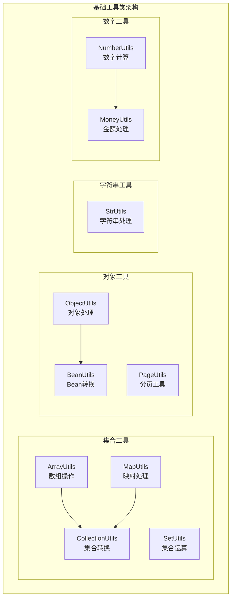

**图表来源**
- [ArrayUtils.java:1-59](file://pandora-framework/pandora-common/src/main/java/net/ittimeline/pandora/framework/common/util/foundational/collection/ArrayUtils.java#L1-L59)
- [CollectionUtils.java:1-375](file://pandora-framework/pandora-common/src/main/java/net/ittimeline/pandora/framework/common/util/foundational/collection/CollectionUtils.java#L1-L375)
- [MapUtils.java:1-113](file://pandora-framework/pandora-common/src/main/java/net/ittimeline/pandora/framework/common/util/foundational/collection/MapUtils.java#L1-L113)
- [SetUtils.java:1-21](file://pandora-framework/pandora-common/src/main/java/net/ittimeline/pandora/framework/common/util/foundational/collection/SetUtils.java#L1-L21)
- [ObjectUtils.java:1-75](file://pandora-framework/pandora-common/src/main/java/net/ittimeline/pandora/framework/common/util/foundational/object/ObjectUtils.java#L1-L75)
- [StrUtils.java:1-108](file://pandora-framework/pandora-common/src/main/java/net/ittimeline/pandora/framework/common/util/foundational/string/StrUtils.java#L1-L108)
- [NumberUtils.java:1-79](file://pandora-framework/pandora-common/src/main/java/net/ittimeline/pandora/framework/common/util/foundational/number/NumberUtils.java#L1-L79)
- [MoneyUtils.java:1-133](file://pandora-framework/pandora-common/src/main/java/net/ittimeline/pandora/framework/common/util/foundational/number/MoneyUtils.java#L1-L133)

**章节来源**
- [ArrayUtils.java:1-59](file://pandora-framework/pandora-common/src/main/java/net/ittimeline/pandora/framework/common/util/foundational/collection/ArrayUtils.java#L1-L59)
- [CollectionUtils.java:1-375](file://pandora-framework/pandora-common/src/main/java/net/ittimeline/pandora/framework/common/util/foundational/collection/CollectionUtils.java#L1-L375)

## 核心组件

### 数组工具类 - ArrayUtils

ArrayUtils 提供了数组的基本操作功能，主要包含以下特性：

- **数组追加**：支持可变参数的数组合并
- **类型转换**：将集合转换为数组
- **安全访问**：提供边界检查的安全访问方法

### 集合工具类 - CollectionUtils

CollectionUtils 是最强大的工具类，提供了丰富的集合操作功能：

- **集合转换**：支持多种类型的集合转换
- **过滤操作**：基于谓词的条件过滤
- **去重操作**：支持自定义比较器的去重
- **映射转换**：复杂映射关系的转换
- **分页处理**：PageResult 的转换支持
- **聚合操作**：最大值、最小值、求和等
- **差异比较**：两个集合的差异分析

### 映射工具类 - MapUtils

MapUtils 专注于 Map 类型的操作：

- **多值映射**：处理 Multimap 的值提取
- **安全查找**：findAndThen 方法提供链式操作
- **类型转换**：将 KeyValue 列表转换为 Map
- **数值解析**：安全的 BigDecimal 解析

### 集合工具类 - SetUtils

SetUtils 提供了简单的集合操作：

- **快速创建**：从可变参数创建 Set
- **类型安全**：确保元素类型的一致性

### 对象工具类 - ObjectUtils

ObjectUtils 提供了对象级别的操作：

- **对象克隆**：支持忽略特定字段的克隆
- **比较操作**：安全的比较和默认值处理
- **空值检查**：灵活的空值判断

### 字符串工具类 - StrUtils

StrUtils 专注于字符串处理：

- **长度控制**：智能的字符串截断
- **前缀匹配**：批量前缀检查
- **数据解析**：字符串到数字的转换
- **日志处理**：方法参数的序列化

### 数字工具类 - NumberUtils

NumberUtils 扩展了 Hutool 的数字处理能力：

- **类型转换**：安全的字符串到数字转换
- **验证功能**：批量数字验证
- **地理计算**：两点间距离计算
- **精确乘法**：支持空值的乘法运算

### 金额工具类 - MoneyUtils

MoneyUtils 专门处理金额相关的计算：

- **百分比计算**：精确的百分比金额计算
- **价格计算**：商品价格和折扣计算
- **货币转换**：分到元的转换
- **精度控制**：统一的价格精度标准

**章节来源**
- [ArrayUtils.java:20-58](file://pandora-framework/pandora-common/src/main/java/net/ittimeline/pandora/framework/common/util/foundational/collection/ArrayUtils.java#L20-L58)
- [CollectionUtils.java:23-375](file://pandora-framework/pandora-common/src/main/java/net/ittimeline/pandora/framework/common/util/foundational/collection/CollectionUtils.java#L23-L375)
- [MapUtils.java:24-113](file://pandora-framework/pandora-common/src/main/java/net/ittimeline/pandora/framework/common/util/foundational/collection/MapUtils.java#L24-L113)
- [SetUtils.java:14-21](file://pandora-framework/pandora-common/src/main/java/net/ittimeline/pandora/framework/common/util/foundational/collection/SetUtils.java#L14-L21)
- [ObjectUtils.java:17-75](file://pandora-framework/pandora-common/src/main/java/net/ittimeline/pandora/framework/common/util/foundational/object/ObjectUtils.java#L17-L75)
- [StrUtils.java:20-108](file://pandora-framework/pandora-common/src/main/java/net/ittimeline/pandora/framework/common/util/foundational/string/StrUtils.java#L20-L108)
- [NumberUtils.java:17-79](file://pandora-framework/pandora-common/src/main/java/net/ittimeline/pandora/framework/common/util/foundational/number/NumberUtils.java#L17-L79)
- [MoneyUtils.java:16-133](file://pandora-framework/pandora-common/src/main/java/net/ittimeline/pandora/framework/common/util/foundational/number/MoneyUtils.java#L16-L133)

## 架构概览

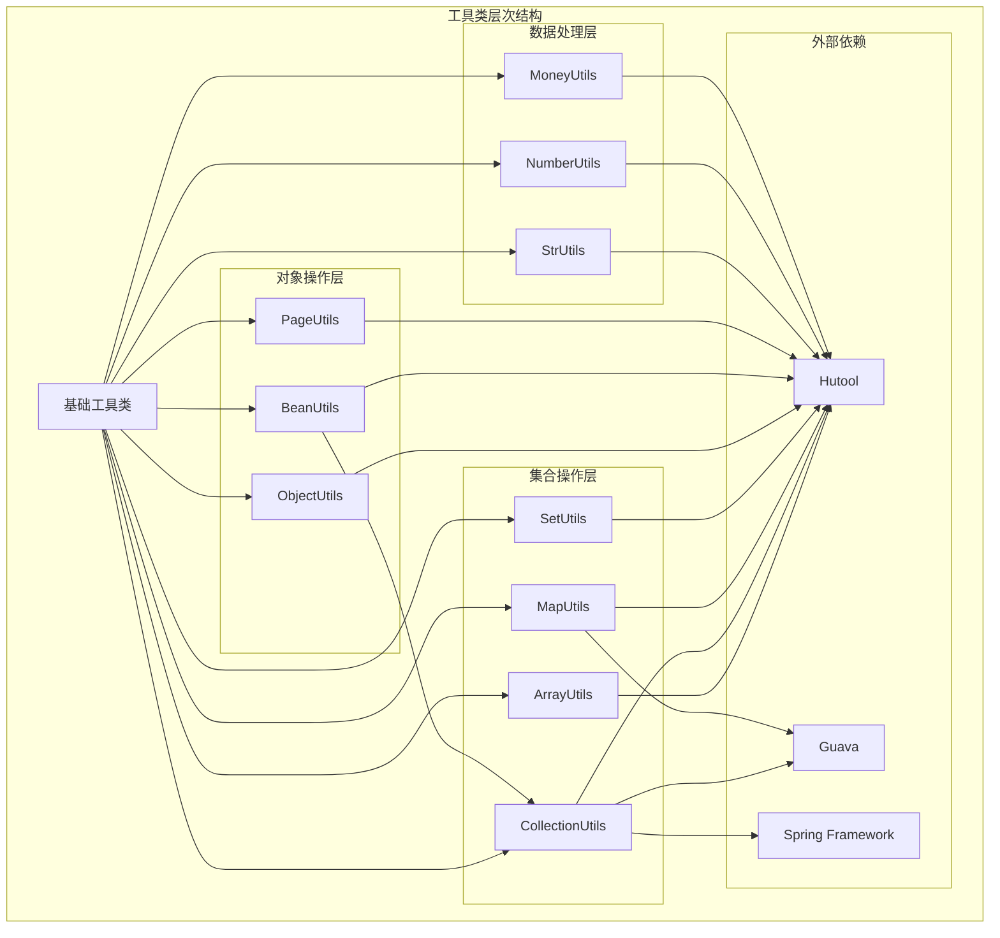

**图表来源**
- [CollectionUtils.java:1-15](file://pandora-framework/pandora-common/src/main/java/net/ittimeline/pandora/framework/common/util/foundational/collection/CollectionUtils.java#L1-L15)
- [MapUtils.java:3-8](file://pandora-framework/pandora-common/src/main/java/net/ittimeline/pandora/framework/common/util/foundational/collection/MapUtils.java#L3-L8)
- [BeanUtils.java:3-5](file://pandora-framework/pandora-common/src/main/java/net/ittimeline/pandora/framework/common/util/foundational/object/BeanUtils.java#L3-L5)

### 依赖关系图

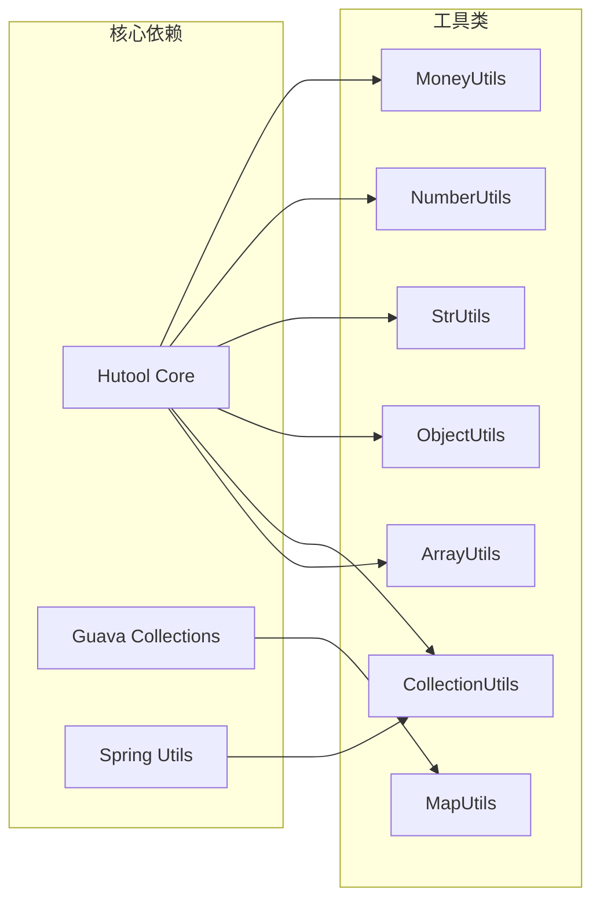

**图表来源**
- [ArrayUtils.java:3-5](file://pandora-framework/pandora-common/src/main/java/net/ittimeline/pandora/framework/common/util/foundational/collection/ArrayUtils.java#L3-L5)
- [CollectionUtils.java:3-7](file://pandora-framework/pandora-common/src/main/java/net/ittimeline/pandora/framework/common/util/foundational/collection/CollectionUtils.java#L3-L7)
- [MapUtils.java:3-8](file://pandora-framework/pandora-common/src/main/java/net/ittimeline/pandora/framework/common/util/foundational/collection/MapUtils.java#L3-L8)

## 详细组件分析

### ArrayUtils - 数组操作工具

ArrayUtils 提供了三个核心功能：

#### 主要方法分析

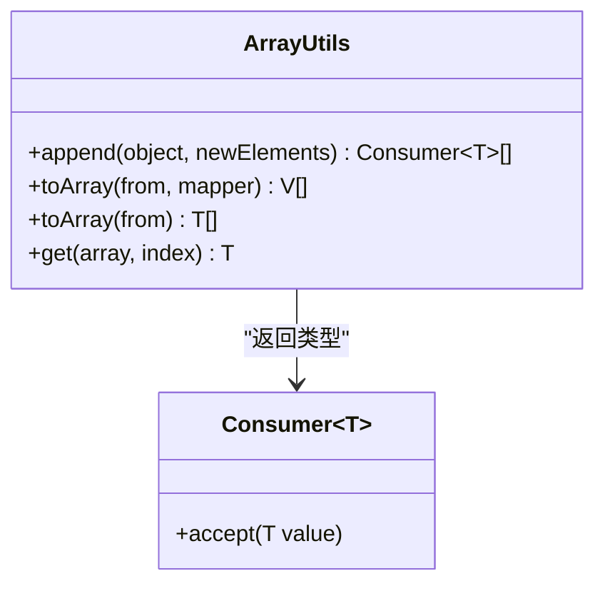

**图表来源**
- [ArrayUtils.java:29-57](file://pandora-framework/pandora-common/src/main/java/net/ittimeline/pandora/framework/common/util/foundational/collection/ArrayUtils.java#L29-L57)

#### 使用场景
- **事件处理器管理**：动态添加监听器
- **泛型数组转换**：从集合创建数组
- **安全索引访问**：避免数组越界异常

**章节来源**
- [ArrayUtils.java:29-57](file://pandora-framework/pandora-common/src/main/java/net/ittimeline/pandora/framework/common/util/foundational/collection/ArrayUtils.java#L29-L57)

### CollectionUtils - 集合转换工具

CollectionUtils 是最复杂的工具类，提供了超过30个静态方法：

#### 核心功能分类

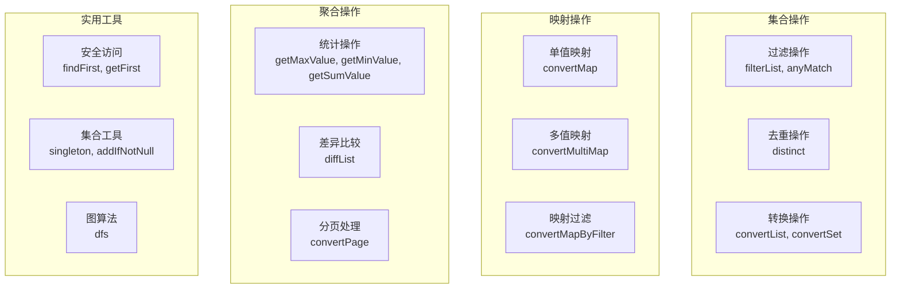

**图表来源**
- [CollectionUtils.java:32-322](file://pandora-framework/pandora-common/src/main/java/net/ittimeline/pandora/framework/common/util/foundational/collection/CollectionUtils.java#L32-L322)

#### 关键算法流程

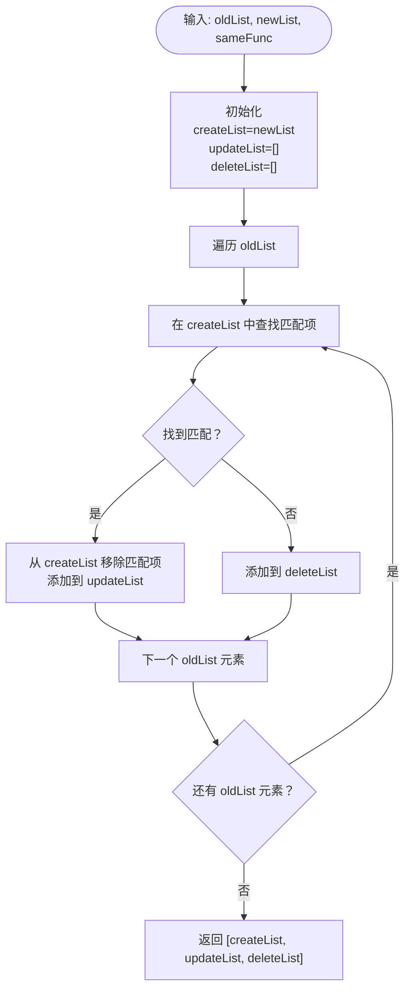

**图表来源**
- [CollectionUtils.java:234-263](file://pandora-framework/pandora-common/src/main/java/net/ittimeline/pandora/framework/common/util/foundational/collection/CollectionUtils.java#L234-L263)

**章节来源**
- [CollectionUtils.java:234-263](file://pandora-framework/pandora-common/src/main/java/net/ittimeline/pandora/framework/common/util/foundational/collection/CollectionUtils.java#L234-L263)

### MapUtils - 映射处理工具

MapUtils 提供了三种核心功能：

#### 安全查找流程

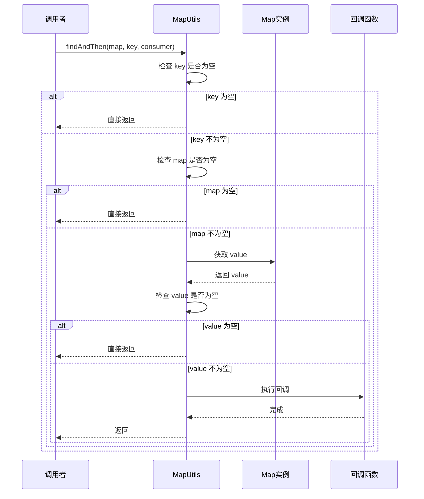

**图表来源**
- [MapUtils.java:53-62](file://pandora-framework/pandora-common/src/main/java/net/ittimeline/pandora/framework/common/util/foundational/collection/MapUtils.java#L53-L62)

**章节来源**
- [MapUtils.java:53-62](file://pandora-framework/pandora-common/src/main/java/net/ittimeline/pandora/framework/common/util/foundational/collection/MapUtils.java#L53-L62)

### ObjectUtils - 对象处理工具

ObjectUtils 提供了对象级别的操作功能：

#### 克隆流程

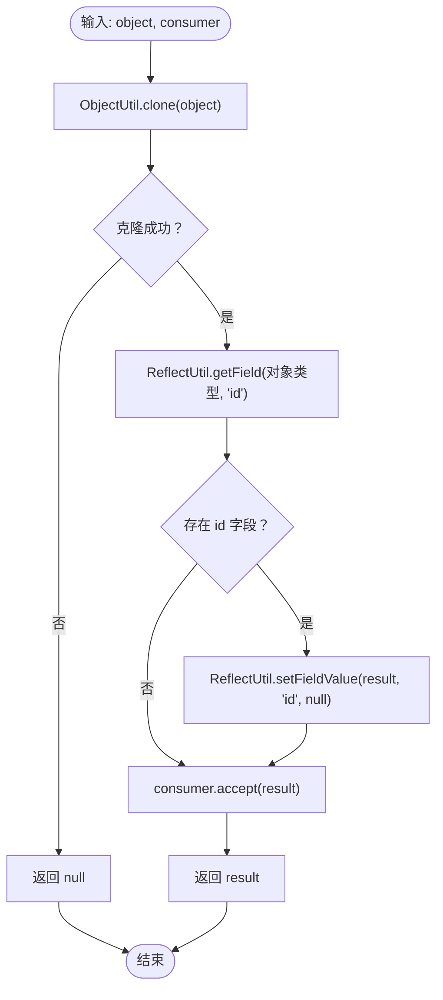

**图表来源**
- [ObjectUtils.java:25-37](file://pandora-framework/pandora-common/src/main/java/net/ittimeline/pandora/framework/common/util/foundational/object/ObjectUtils.java#L25-L37)

**章节来源**
- [ObjectUtils.java:25-37](file://pandora-framework/pandora-common/src/main/java/net/ittimeline/pandora/framework/common/util/foundational/object/ObjectUtils.java#L25-L37)

### StrUtils - 字符串处理工具

StrUtils 提供了字符串处理的核心功能：

#### 参数序列化流程

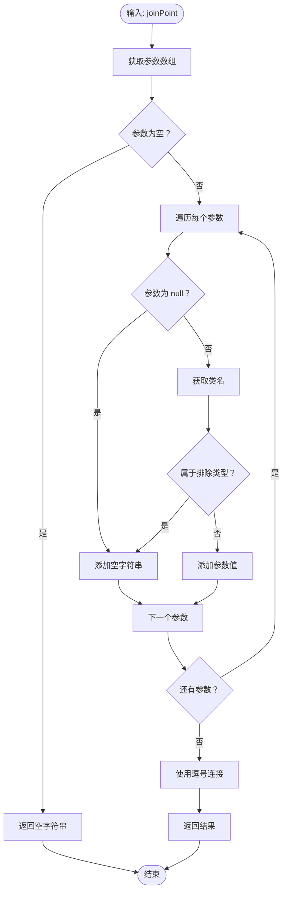

**图表来源**
- [StrUtils.java:89-105](file://pandora-framework/pandora-common/src/main/java/net/ittimeline/pandora/framework/common/util/foundational/string/StrUtils.java#L89-L105)

**章节来源**
- [StrUtils.java:89-105](file://pandora-framework/pandora-common/src/main/java/net/ittimeline/pandora/framework/common/util/foundational/string/StrUtils.java#L89-L105)

### MoneyUtils - 金额处理工具

MoneyUtils 提供了精确的金额计算功能：

#### 百分比计算流程

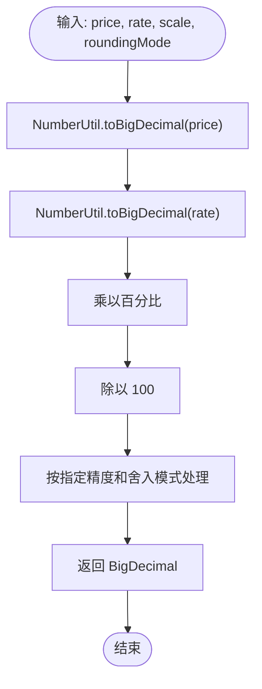

**图表来源**
- [MoneyUtils.java:73-76](file://pandora-framework/pandora-common/src/main/java/net/ittimeline/pandora/framework/common/util/foundational/number/MoneyUtils.java#L73-L76)

**章节来源**
- [MoneyUtils.java:73-76](file://pandora-framework/pandora-common/src/main/java/net/ittimeline/pandora/framework/common/util/foundational/number/MoneyUtils.java#L73-L76)

## 依赖分析

### 外部依赖关系

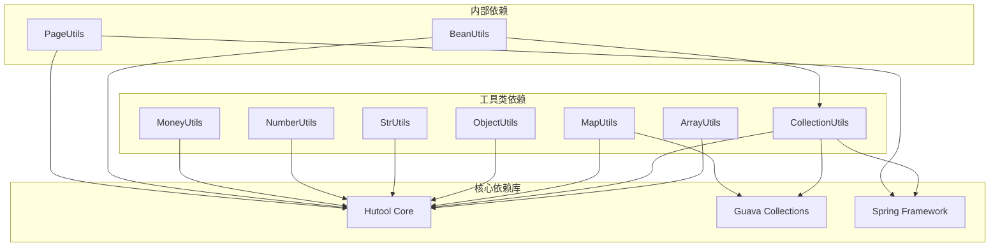

**图表来源**
- [CollectionUtils.java:3-7](file://pandora-framework/pandora-common/src/main/java/net/ittimeline/pandora/framework/common/util/foundational/collection/CollectionUtils.java#L3-L7)
- [MapUtils.java:3-8](file://pandora-framework/pandora-common/src/main/java/net/ittimeline/pandora/framework/common/util/foundational/collection/MapUtils.java#L3-L8)
- [BeanUtils.java:3-5](file://pandora-framework/pandora-common/src/main/java/net/ittimeline/pandora/framework/common/util/foundational/object/BeanUtils.java#L3-L5)

### 内部依赖关系

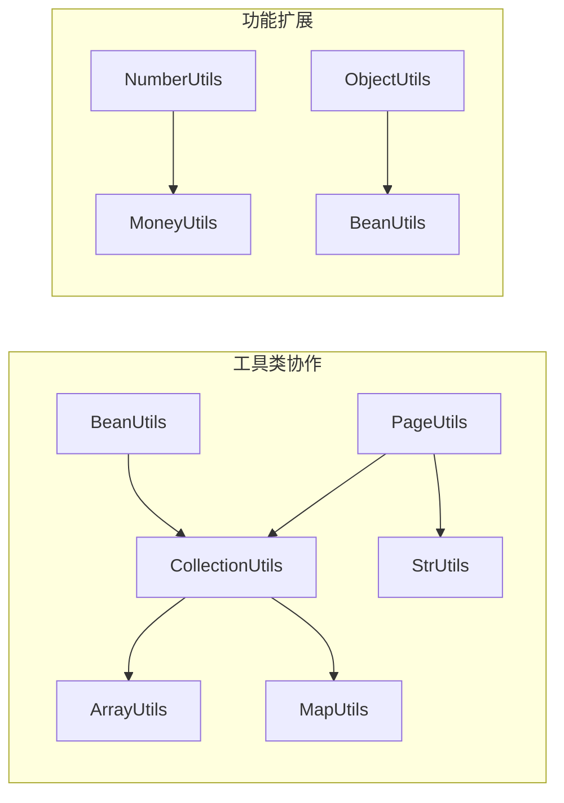

**图表来源**
- [ArrayUtils.java:11](file://pandora-framework/pandora-common/src/main/java/net/ittimeline/pandora/framework/common/util/foundational/collection/ArrayUtils.java#L11)
- [BeanUtils.java:5](file://pandora-framework/pandora-common/src/main/java/net/ittimeline/pandora/framework/common/util/foundational/object/BeanUtils.java#L5)

**章节来源**
- [ArrayUtils.java:11](file://pandora-framework/pandora-common/src/main/java/net/ittimeline/pandora/framework/common/util/foundational/collection/ArrayUtils.java#L11)
- [BeanUtils.java:5](file://pandora-framework/pandora-common/src/main/java/net/ittimeline/pandora/framework/common/util/foundational/object/BeanUtils.java#L5)

## 性能考虑

### 时间复杂度分析

| 工具类 | 主要方法 | 时间复杂度 | 空间复杂度 |
|--------|----------|------------|------------|
| ArrayUtils | append | O(n) | O(n) |
| ArrayUtils | toArray | O(n) | O(n) |
| CollectionUtils | filterList | O(n) | O(n) |
| CollectionUtils | distinct | O(n) | O(n) |
| CollectionUtils | convertMap | O(n) | O(n) |
| CollectionUtils | diffList | O(n*m) | O(n+m) |
| MapUtils | findAndThen | O(1) | O(1) |
| ObjectUtils | cloneIgnoreId | O(k) | O(k) |
| StrUtils | joinMethodArgs | O(n*m) | O(n*m) |
| NumberUtils | getDistance | O(1) | O(1) |
| MoneyUtils | calculateRatePrice | O(1) | O(1) |

### 性能优化建议

1. **避免重复转换**：尽量在数据流的早期进行转换，减少中间步骤
2. **合理使用缓存**：对于重复计算的结果，考虑使用缓存机制
3. **批量操作优先**：使用集合操作而不是逐个元素处理
4. **内存管理**：注意大集合的内存使用，及时释放不需要的对象

### 最佳实践

1. **空值检查**：始终检查输入参数的有效性
2. **类型安全**：充分利用泛型系统，避免类型转换错误
3. **异常处理**：为可能失败的操作提供适当的异常处理
4. **代码复用**：优先使用工具类提供的方法，避免重复实现

## 故障排除指南

### 常见问题及解决方案

#### 空指针异常
- **问题**：调用工具类方法时出现 NullPointerException
- **原因**：未正确检查输入参数
- **解决方案**：使用工具类提供的空值检查方法，或在调用前进行显式检查

#### 类型转换异常
- **问题**：在类型转换过程中出现 ClassCastException
- **原因**：输入数据类型与期望类型不匹配
- **解决方案**：使用工具类提供的安全转换方法，或在转换前进行类型验证

#### 性能问题
- **问题**：大量数据处理时性能不佳
- **原因**：使用了低效的算法或数据结构
- **解决方案**：优化算法选择，考虑使用更合适的数据结构

### 调试技巧

1. **日志记录**：在关键节点添加详细的日志信息
2. **单元测试**：为每个工具方法编写单元测试
3. **边界测试**：特别测试空集合、null 值等边界情况
4. **性能监控**：使用性能分析工具监控方法执行时间

**章节来源**
- [CollectionUtils.java:324-329](file://pandora-framework/pandora-common/src/main/java/net/ittimeline/pandora/framework/common/util/foundational/collection/CollectionUtils.java#L324-L329)
- [ObjectUtils.java:49-67](file://pandora-framework/pandora-common/src/main/java/net/ittimeline/pandora/framework/common/util/foundational/object/ObjectUtils.java#L49-L67)

## 结论

Pandora Cloud 的基础工具类库为开发者提供了强大而易用的数据处理能力。通过精心设计的 API 和完善的错误处理机制，这些工具类能够显著提高开发效率并减少代码中的常见错误。

### 主要优势

1. **功能完整性**：覆盖了大多数常见的数据处理需求
2. **类型安全**：充分利用 Java 泛型系统
3. **性能优化**：针对常见场景进行了性能优化
4. **易于使用**：提供直观的方法签名和明确的语义

### 发展方向

1. **扩展功能**：根据实际使用反馈增加新的工具方法
2. **性能优化**：持续改进现有方法的性能表现
3. **文档完善**：为每个方法提供更详细的使用示例
4. **测试覆盖**：增加更多的单元测试和集成测试

这些工具类为 Pandora Cloud 框架提供了坚实的基础，使得开发者能够专注于业务逻辑的实现，而不必担心底层的数据处理细节。