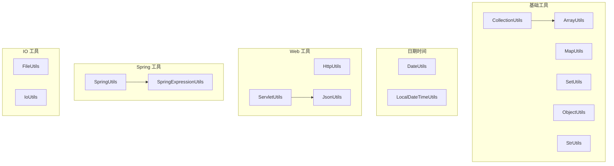
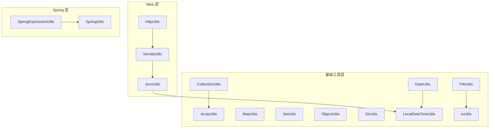
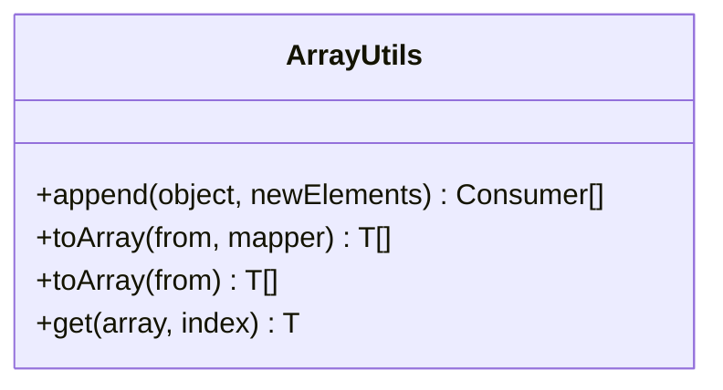
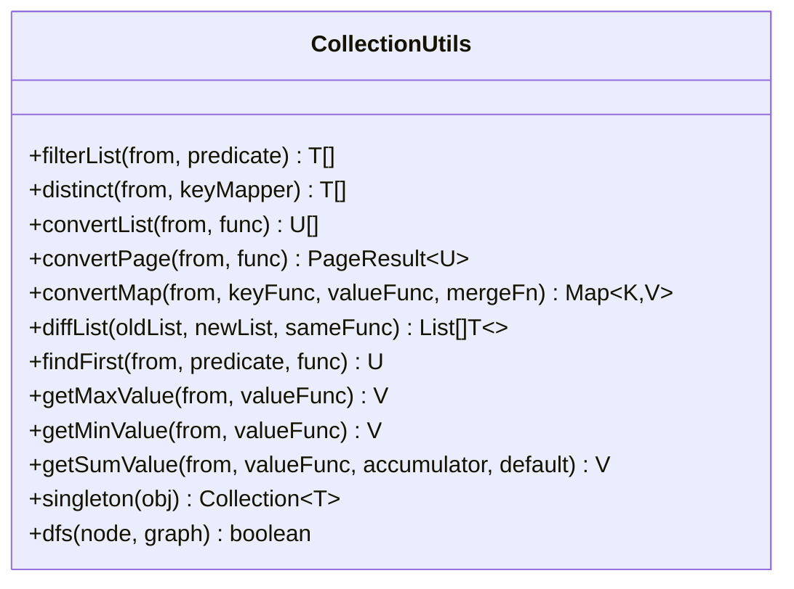
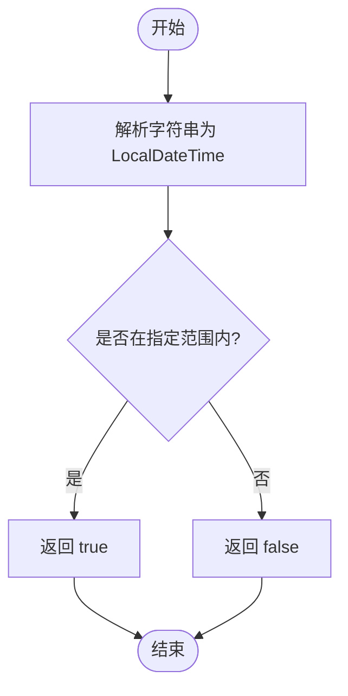
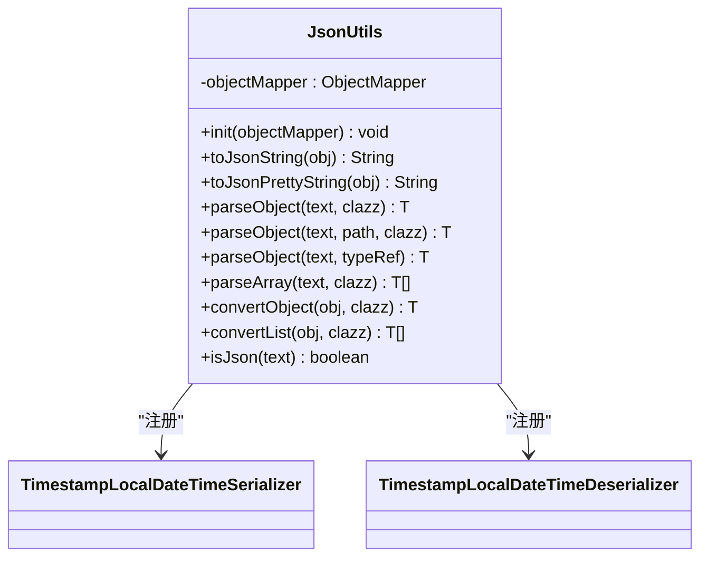
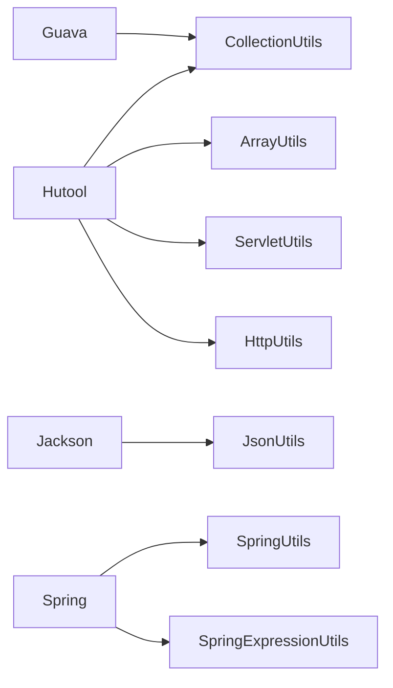

# 工具类库

<cite>
**本文档引用的文件**
- [ArrayUtils.java](file://pandora-framework/pandora-common/src/main/java/net/ittimeline/pandora/framework/common/util/foundational/collection/ArrayUtils.java)
- [CollectionUtils.java](file://pandora-framework/pandora-common/src/main/java/net/ittimeline/pandora/framework/common/util/foundational/collection/CollectionUtils.java)
- [MapUtils.java](file://pandora-framework/pandora-common/src/main/java/net/ittimeline/pandora/framework/common/util/foundational/collection/MapUtils.java)
- [SetUtils.java](file://pandora-framework/pandora-common/src/main/java/net/ittimeline/pandora/framework/common/util/foundational/collection/SetUtils.java)
- [ObjectUtils.java](file://pandora-framework/pandora-common/src/main/java/net/ittimeline/pandora/framework/common/util/foundational/object/ObjectUtils.java)
- [StrUtils.java](file://pandora-framework/pandora-common/src/main/java/net/ittimeline/pandora/framework/common/util/foundational/string/StrUtils.java)
- [DateUtils.java](file://pandora-framework/pandora-common/src/main/java/net/ittimeline/pandora/framework/common/util/foundational/date/DateUtils.java)
- [LocalDateTimeUtils.java](file://pandora-framework/pandora-common/src/main/java/net/ittimeline/pandora/framework/common/util/foundational/date/LocalDateTimeUtils.java)
- [HttpUtils.java](file://pandora-framework/pandora-common/src/main/java/net/ittimeline/pandora/framework/common/util/web/http/HttpUtils.java)
- [ServletUtils.java](file://pandora-framework/pandora-common/src/main/java/net/ittimeline/pandora/framework/common/util/web/servlet/ServletUtils.java)
- [JsonUtils.java](file://pandora-framework/pandora-common/src/main/java/net/ittimeline/pandora/framework/common/util/web/json/JsonUtils.java)
- [SpringUtils.java](file://pandora-framework/pandora-common/src/main/java/net/ittimeline/pandora/framework/common/util/web/spring/SpringUtils.java)
- [SpringExpressionUtils.java](file://pandora-framework/pandora-common/src/main/java/net/ittimeline/pandora/framework/common/util/web/spring/SpringExpressionUtils.java)
- [TimestampLocalDateTimeSerializer.java](file://pandora-framework/pandora-common/src/main/java/net/ittimeline/pandora/framework/common/util/web/json/databind/TimestampLocalDateTimeSerializer.java)
- [TimestampLocalDateTimeDeserializer.java](file://pandora-framework/pandora-common/src/main/java/net/ittimeline/pandora/framework/common/util/web/json/databind/TimestampLocalDateTimeDeserializer.java)
- [NumberSerializer.java](file://pandora-framework/pandora-common/src/main/java/net/ittimeline/pandora/framework/common/util/web/json/databind/NumberSerializer.java)
- [FileUtils.java](file://pandora-framework/pandora-common/src/main/java/net/ittimeline/pandora/framework/common/util/foundational/io/FileUtils.java)
- [IoUtils.java](file://pandora-framework/pandora-common/src/main/java/net/ittimeline/pandora/framework/common/util/foundational/io/IoUtils.java)
</cite>

## 目录
1. [简介](#简介)
2. [项目结构](#项目结构)
3. [核心组件](#核心组件)
4. [架构总览](#架构总览)
5. [详细组件分析](#详细组件分析)
6. [依赖分析](#依赖分析)
7. [性能考虑](#性能考虑)
8. [故障排查指南](#故障排查指南)
9. [结论](#结论)
10. [附录](#附录)

## 简介
本参考文档面向工具类库，系统性梳理并说明以下工具模块的职责、使用方法与最佳实践：
- 基础工具类：数组(ArrayUtils)、集合(CollectionUtils/MapUtils/SetUtils)、对象(ObjectUtils)、字符串(StrUtils)
- 日期时间：DateUtils、LocalDateTimeUtils（时区与格式化）
- Web 工具：HTTP(HttpUtils)、Servlet(ServletUtils)、JSON(JsonUtils)
- Spring 工具：Spring 上下文(SpringUtils)、Spring EL(SpringExpressionUtils)
- IO 工具：文件(FileUtils)、IO(IoUtils)

文档同时提供架构图、流程图、类图与常见问题排查建议，帮助开发者在工程中高效、安全地使用这些工具。

## 项目结构
工具类集中位于 common 模块的 util 子包下，按功能域划分：
- foundation/collection：数组、集合、映射、集合扩展
- foundation/object：对象克隆、比较、默认值等
- foundation/string：字符串处理、参数拼接
- foundation/date：日期与 LocalDateTime 工具
- web/http：HTTP 请求、URL 编解码、认证提取
- web/servlet：Web 请求上下文、JSON 输出、请求体读取
- web/json：Jackson ObjectMapper 初始化、序列化/反序列化、时间模块注册
- web/json/databind：时间序列化/反序列化适配器
- web/spring：Spring 上下文与 EL 表达式
- foundation/io：文件与 IO 辅助

**图表来源**
- [ArrayUtils.java:1-59](file://pandora-framework/pandora-common/src/main/java/net/ittimeline/pandora/framework/common/util/foundational/collection/ArrayUtils.java#L1-L59)
- [CollectionUtils.java:1-375](file://pandora-framework/pandora-common/src/main/java/net/ittimeline/pandora/framework/common/util/foundational/collection/CollectionUtils.java#L1-L375)
- [MapUtils.java:1-113](file://pandora-framework/pandora-common/src/main/java/net/ittimeline/pandora/framework/common/util/foundational/collection/MapUtils.java#L1-L113)
- [SetUtils.java:1-21](file://pandora-framework/pandora-common/src/main/java/net/ittimeline/pandora/framework/common/util/foundational/collection/SetUtils.java#L1-L21)
- [ObjectUtils.java:1-75](file://pandora-framework/pandora-common/src/main/java/net/ittimeline/pandora/framework/common/util/foundational/object/ObjectUtils.java#L1-L75)
- [StrUtils.java:1-108](file://pandora-framework/pandora-common/src/main/java/net/ittimeline/pandora/framework/common/util/foundational/string/StrUtils.java#L1-L108)
- [DateUtils.java:1-151](file://pandora-framework/pandora-common/src/main/java/net/ittimeline/pandora/framework/common/util/foundational/date/DateUtils.java#L1-L151)
- [LocalDateTimeUtils.java:1-374](file://pandora-framework/pandora-common/src/main/java/net/ittimeline/pandora/framework/common/util/foundational/date/LocalDateTimeUtils.java#L1-L374)
- [HttpUtils.java:1-204](file://pandora-framework/pandora-common/src/main/java/net/ittimeline/pandora/framework/common/util/web/http/HttpUtils.java#L1-L204)
- [ServletUtils.java:1-105](file://pandora-framework/pandora-common/src/main/java/net/ittimeline/pandora/framework/common/util/web/servlet/ServletUtils.java#L1-L105)
- [JsonUtils.java:1-305](file://pandora-framework/pandora-common/src/main/java/net/ittimeline/pandora/framework/common/util/web/json/JsonUtils.java#L1-L305)
- [SpringUtils.java:1-25](file://pandora-framework/pandora-common/src/main/java/net/ittimeline/pandora/framework/common/util/web/spring/SpringUtils.java#L1-L25)
- [SpringExpressionUtils.java:1-124](file://pandora-framework/pandora-common/src/main/java/net/ittimeline/pandora/framework/common/util/web/spring/SpringExpressionUtils.java#L1-L124)
- [FileUtils.java:1-61](file://pandora-framework/pandora-common/src/main/java/net/ittimeline/pandora/framework/common/util/foundational/io/FileUtils.java#L1-L61)
- [IoUtils.java:1-30](file://pandora-framework/pandora-common/src/main/java/net/ittimeline/pandora/framework/common/util/foundational/io/IoUtils.java#L1-L30)

**章节来源**
- [ArrayUtils.java:1-59](file://pandora-framework/pandora-common/src/main/java/net/ittimeline/pandora/framework/common/util/foundational/collection/ArrayUtils.java#L1-L59)
- [CollectionUtils.java:1-375](file://pandora-framework/pandora-common/src/main/java/net/ittimeline/pandora/framework/common/util/foundational/collection/CollectionUtils.java#L1-L375)
- [MapUtils.java:1-113](file://pandora-framework/pandora-common/src/main/java/net/ittimeline/pandora/framework/common/util/foundational/collection/MapUtils.java#L1-L113)
- [SetUtils.java:1-21](file://pandora-framework/pandora-common/src/main/java/net/ittimeline/pandora/framework/common/util/foundational/collection/SetUtils.java#L1-L21)
- [ObjectUtils.java:1-75](file://pandora-framework/pandora-common/src/main/java/net/ittimeline/pandora/framework/common/util/foundational/object/ObjectUtils.java#L1-L75)
- [StrUtils.java:1-108](file://pandora-framework/pandora-common/src/main/java/net/ittimeline/pandora/framework/common/util/foundational/string/StrUtils.java#L1-L108)
- [DateUtils.java:1-151](file://pandora-framework/pandora-common/src/main/java/net/ittimeline/pandora/framework/common/util/foundational/date/DateUtils.java#L1-L151)
- [LocalDateTimeUtils.java:1-374](file://pandora-framework/pandora-common/src/main/java/net/ittimeline/pandora/framework/common/util/foundational/date/LocalDateTimeUtils.java#L1-L374)
- [HttpUtils.java:1-204](file://pandora-framework/pandora-common/src/main/java/net/ittimeline/pandora/framework/common/util/web/http/HttpUtils.java#L1-L204)
- [ServletUtils.java:1-105](file://pandora-framework/pandora-common/src/main/java/net/ittimeline/pandora/framework/common/util/web/servlet/ServletUtils.java#L1-L105)
- [JsonUtils.java:1-305](file://pandora-framework/pandora-common/src/main/java/net/ittimeline/pandora/framework/common/util/web/json/JsonUtils.java#L1-L305)
- [SpringUtils.java:1-25](file://pandora-framework/pandora-common/src/main/java/net/ittimeline/pandora/framework/common/util/web/spring/SpringUtils.java#L1-L25)
- [SpringExpressionUtils.java:1-124](file://pandora-framework/pandora-common/src/main/java/net/ittimeline/pandora/framework/common/util/web/spring/SpringExpressionUtils.java#L1-L124)
- [FileUtils.java:1-61](file://pandora-framework/pandora-common/src/main/java/net/ittimeline/pandora/framework/common/util/foundational/io/FileUtils.java#L1-L61)
- [IoUtils.java:1-30](file://pandora-framework/pandora-common/src/main/java/net/ittimeline/pandora/framework/common/util/foundational/io/IoUtils.java#L1-L30)

## 核心组件
- 数组工具 ArrayUtils：数组追加、集合转数组、安全取值
- 集合工具 CollectionUtils：过滤、去重、分页转换、多值映射、差异对比、最大/最小/求和、深度优先搜索等
- 映射工具 MapUtils：Multimap 扩展、键值对转换、BigDecimal 安全解析
- 集合扩展 SetUtils：便捷构造不可变集合
- 对象工具 ObjectUtils：克隆忽略主键、比较、默认值、相等性判断
- 字符串工具 StrUtils：截断、前缀匹配、拆分转数字集合、移除含特定子串的行、拼接方法参数（排除敏感类型）
- 日期工具 DateUtils：Date 与 LocalDateTime 相互转换、时区策略、时间构建、到期判断、今日/昨日判断
- LocalDateTime 工具 LocalDateTimeUtils：解析、区间判断、范围切分、格式化范围、季度/周起始、秒级时间戳转换
- HTTP 工具 HttpUtils：URL 编解码、查询参数替换/移除、URL 拼接、Basic 认证提取、GET/POST 请求
- Servlet 工具 ServletUtils：JSON 输出、UA/IP 获取、请求上下文获取、请求体读取、参数/头映射
- JSON 工具 JsonUtils：Jackson ObjectMapper 初始化、序列化/反序列化、路径解析、类型转换、静默解析、校验
- Spring 工具 SpringUtils：环境判断（生产/非生产）
- Spring EL 工具 SpringExpressionUtils：切面与 Bean 工厂中的表达式解析
- IO 工具 FileUtils：临时文件创建（JVM 退出清理）、写入内容
- IO 工具 IoUtils：UTF-8 流读取

**章节来源**
- [ArrayUtils.java:20-58](file://pandora-framework/pandora-common/src/main/java/net/ittimeline/pandora/framework/common/util/foundational/collection/ArrayUtils.java#L20-L58)
- [CollectionUtils.java:23-375](file://pandora-framework/pandora-common/src/main/java/net/ittimeline/pandora/framework/common/util/foundational/collection/CollectionUtils.java#L23-L375)
- [MapUtils.java:24-113](file://pandora-framework/pandora-common/src/main/java/net/ittimeline/pandora/framework/common/util/foundational/collection/MapUtils.java#L24-L113)
- [SetUtils.java:14-21](file://pandora-framework/pandora-common/src/main/java/net/ittimeline/pandora/framework/common/util/foundational/collection/SetUtils.java#L14-L21)
- [ObjectUtils.java:17-75](file://pandora-framework/pandora-common/src/main/java/net/ittimeline/pandora/framework/common/util/foundational/object/ObjectUtils.java#L17-L75)
- [StrUtils.java:20-108](file://pandora-framework/pandora-common/src/main/java/net/ittimeline/pandora/framework/common/util/foundational/string/StrUtils.java#L20-L108)
- [DateUtils.java:16-151](file://pandora-framework/pandora-common/src/main/java/net/ittimeline/pandora/framework/common/util/foundational/date/DateUtils.java#L16-L151)
- [LocalDateTimeUtils.java:30-374](file://pandora-framework/pandora-common/src/main/java/net/ittimeline/pandora/framework/common/util/foundational/date/LocalDateTimeUtils.java#L30-L374)
- [HttpUtils.java:26-204](file://pandora-framework/pandora-common/src/main/java/net/ittimeline/pandora/framework/common/util/web/http/HttpUtils.java#L26-L204)
- [ServletUtils.java:22-105](file://pandora-framework/pandora-common/src/main/java/net/ittimeline/pandora/framework/common/util/web/servlet/ServletUtils.java#L22-L105)
- [JsonUtils.java:34-305](file://pandora-framework/pandora-common/src/main/java/net/ittimeline/pandora/framework/common/util/web/json/JsonUtils.java#L34-L305)
- [SpringUtils.java:13-25](file://pandora-framework/pandora-common/src/main/java/net/ittimeline/pandora/framework/common/util/web/spring/SpringUtils.java#L13-L25)
- [SpringExpressionUtils.java:31-124](file://pandora-framework/pandora-common/src/main/java/net/ittimeline/pandora/framework/common/util/web/spring/SpringExpressionUtils.java#L31-L124)
- [FileUtils.java:15-61](file://pandora-framework/pandora-common/src/main/java/net/ittimeline/pandora/framework/common/util/foundational/io/FileUtils.java#L15-L61)
- [IoUtils.java:16-30](file://pandora-framework/pandora-common/src/main/java/net/ittimeline/pandora/framework/common/util/foundational/io/IoUtils.java#L16-L30)

## 架构总览
工具类整体采用“功能域分层 + 轻量封装”的设计，统一依赖 Hutool 与 Jackson，确保跨模块一致性与易用性。Web 工具与 Spring 工具通过静态方法暴露能力，便于在任意上下文中调用。

**图表来源**
- [ServletUtils.java:22-105](file://pandora-framework/pandora-common/src/main/java/net/ittimeline/pandora/framework/common/util/web/servlet/ServletUtils.java#L22-L105)
- [HttpUtils.java:26-204](file://pandora-framework/pandora-common/src/main/java/net/ittimeline/pandora/framework/common/util/web/http/HttpUtils.java#L26-L204)
- [JsonUtils.java:34-305](file://pandora-framework/pandora-common/src/main/java/net/ittimeline/pandora/framework/common/util/web/json/JsonUtils.java#L34-L305)
- [SpringUtils.java:13-25](file://pandora-framework/pandora-common/src/main/java/net/ittimeline/pandora/framework/common/util/web/spring/SpringUtils.java#L13-L25)
- [SpringExpressionUtils.java:31-124](file://pandora-framework/pandora-common/src/main/java/net/ittimeline/pandora/framework/common/util/web/spring/SpringExpressionUtils.java#L31-L124)
- [ArrayUtils.java:20-58](file://pandora-framework/pandora-common/src/main/java/net/ittimeline/pandora/framework/common/util/foundational/collection/ArrayUtils.java#L20-L58)
- [CollectionUtils.java:23-375](file://pandora-framework/pandora-common/src/main/java/net/ittimeline/pandora/framework/common/util/foundational/collection/CollectionUtils.java#L23-L375)
- [MapUtils.java:24-113](file://pandora-framework/pandora-common/src/main/java/net/ittimeline/pandora/framework/common/util/foundational/collection/MapUtils.java#L24-L113)
- [SetUtils.java:14-21](file://pandora-framework/pandora-common/src/main/java/net/ittimeline/pandora/framework/common/util/foundational/collection/SetUtils.java#L14-L21)
- [ObjectUtils.java:17-75](file://pandora-framework/pandora-common/src/main/java/net/ittimeline/pandora/framework/common/util/foundational/object/ObjectUtils.java#L17-L75)
- [StrUtils.java:20-108](file://pandora-framework/pandora-common/src/main/java/net/ittimeline/pandora/framework/common/util/foundational/string/StrUtils.java#L20-L108)
- [DateUtils.java:16-151](file://pandora-framework/pandora-common/src/main/java/net/ittimeline/pandora/framework/common/util/foundational/date/DateUtils.java#L16-L151)
- [LocalDateTimeUtils.java:30-374](file://pandora-framework/pandora-common/src/main/java/net/ittimeline/pandora/framework/common/util/foundational/date/LocalDateTimeUtils.java#L30-L374)
- [FileUtils.java:15-61](file://pandora-framework/pandora-common/src/main/java/net/ittimeline/pandora/framework/common/util/foundational/io/FileUtils.java#L15-L61)
- [IoUtils.java:16-30](file://pandora-framework/pandora-common/src/main/java/net/ittimeline/pandora/framework/common/util/foundational/io/IoUtils.java#L16-L30)

## 详细组件分析

### 数组工具 ArrayUtils
- 主要能力
  - 追加 Consumer 数组，支持可变参数合并
  - 集合到数组转换，自动推断元素类型
  - 安全取值，越界返回 null
- 最佳实践
  - 使用泛型与安全数组长度计算，避免 ClassCastException
  - 与 CollectionUtils 配合进行集合到数组的链式转换
- 性能提示
  - 追加操作为 O(n)；若频繁追加，考虑使用列表后一次性转数组

**图表来源**
- [ArrayUtils.java:20-58](file://pandora-framework/pandora-common/src/main/java/net/ittimeline/pandora/framework/common/util/foundational/collection/ArrayUtils.java#L20-L58)

**章节来源**
- [ArrayUtils.java:20-58](file://pandora-framework/pandora-common/src/main/java/net/ittimeline/pandora/framework/common/util/foundational/collection/ArrayUtils.java#L20-L58)

### 集合工具 CollectionUtils
- 主要能力
  - 过滤、去重（支持覆盖策略）、扁平映射
  - 列表/分页转换、多值映射（List/Set）
  - 不可变 Map 构建、差异对比（新增/修改/删除）
  - 最大/最小值、求和、首元素获取、查找首个满足条件元素
  - 深度优先搜索（图检测）
- 最佳实践
  - 使用 BinaryOperator 控制重复键合并策略
  - 分页转换时保留总数，避免二次查询
  - 差异对比需提供稳定的“相同”判定函数
- 性能提示
  - 大集合过滤与映射建议使用并行流（注意无序性）
  - 去重与分组使用 groupingBy/Collectors.toMap 更高效

**图表来源**
- [CollectionUtils.java:23-375](file://pandora-framework/pandora-common/src/main/java/net/ittimeline/pandora/framework/common/util/foundational/collection/CollectionUtils.java#L23-L375)

**章节来源**
- [CollectionUtils.java:23-375](file://pandora-framework/pandora-common/src/main/java/net/ittimeline/pandora/framework/common/util/foundational/collection/CollectionUtils.java#L23-L375)

### 映射工具 MapUtils
- 主要能力
  - Multimap 批量取值、findAndThen 条件处理
  - KeyValue 列表转 Map、BigDecimal 安全解析（支持 Number/String）
- 最佳实践
  - 使用 LinkedHash 构建有序 Map，便于日志与调试
  - BigDecimal 解析时提供默认值，避免异常传播

**章节来源**
- [MapUtils.java:24-113](file://pandora-framework/pandora-common/src/main/java/net/ittimeline/pandora/framework/common/util/foundational/collection/MapUtils.java#L24-L113)

### 集合扩展 SetUtils
- 主要能力
  - 快速构造 Set，避免样板代码
- 最佳实践
  - 与 CollectionUtils 的去重配合，快速构建候选集

**章节来源**
- [SetUtils.java:14-21](file://pandora-framework/pandora-common/src/main/java/net/ittimeline/pandora/framework/common/util/foundational/collection/SetUtils.java#L14-L21)

### 对象工具 ObjectUtils
- 主要能力
  - 克隆并忽略主键字段（反射）
  - 比较与默认值、相等性判断、非全空判断
- 最佳实践
  - 仅对存在 id 字段的对象使用“忽略主键克隆”
  - equalsAny/notEqualsAny 适合枚举/白名单场景

**章节来源**
- [ObjectUtils.java:17-75](file://pandora-framework/pandora-common/src/main/java/net/ittimeline/pandora/framework/common/util/foundational/object/ObjectUtils.java#L17-L75)

### 字符串工具 StrUtils
- 主要能力
  - 截断并补省略号、前缀匹配、拆分转数字集合
  - 移除包含特定子串的行
  - 拼接方法参数（自动排除 Servlet/上传等敏感类型）
- 最佳实践
  - 在日志与审计场景使用 joinMethodArgs 排除敏感参数
  - 使用 splitToLong/splitToInteger 统一解析分隔符

**章节来源**
- [StrUtils.java:20-108](file://pandora-framework/pandora-common/src/main/java/net/ittimeline/pandora/framework/common/util/foundational/string/StrUtils.java#L20-L108)

### 日期时间工具 DateUtils
- 主要能力
  - Date 与 LocalDateTime 相互转换（系统时区）
  - 时间构建、比较、到期判断、今日/昨日判断
- 时区与格式化
  - 使用系统默认时区；如需固定时区，建议结合 ZoneId 使用
- 最佳实践
  - 业务时间统一使用 LocalDateTime；持久化前转换为 Date 或 Timestamp

**章节来源**
- [DateUtils.java:16-151](file://pandora-framework/pandora-common/src/main/java/net/ittimeline/pandora/framework/common/util/foundational/date/DateUtils.java#L16-L151)

### LocalDateTime 工具 LocalDateTimeUtils
- 主要能力
  - 解析（兼容多种模式）、时间加减、区间判断、范围切分、格式化范围
  - 月/季度/周起始、秒级时间戳转换
- 时区与格式化
  - 基于 Hutool 的 DateTimeFormatter 与 TemporalAdjusters
  - 提供 UTC 毫秒带偏移格式器
- 最佳实践
  - 跨时区展示前显式转换至目标 ZoneId
  - 范围切分使用枚举控制粒度，避免边界溢出

**图表来源**
- [LocalDateTimeUtils.java:46-146](file://pandora-framework/pandora-common/src/main/java/net/ittimeline/pandora/framework/common/util/foundational/date/LocalDateTimeUtils.java#L46-L146)

**章节来源**
- [LocalDateTimeUtils.java:30-374](file://pandora-framework/pandora-common/src/main/java/net/ittimeline/pandora/framework/common/util/foundational/date/LocalDateTimeUtils.java#L30-L374)

### HTTP 工具 HttpUtils
- 主要能力
  - URL 参数编解码、URL 路径解码（区分 + 处理）
  - 查询参数替换/移除、URL 拼接（支持 fragment）
  - Basic 认证提取（Header 与 Query 优先级）
  - GET/POST 请求（支持自定义 Headers）
- 最佳实践
  - 拼接回调地址时使用 append 并传入 keys 映射
  - Basic 认证优先从 Authorization 头获取，其次从参数

**章节来源**
- [HttpUtils.java:26-204](file://pandora-framework/pandora-common/src/main/java/net/ittimeline/pandora/framework/common/util/web/http/HttpUtils.java#L26-L204)

### Servlet 工具 ServletUtils
- 主要能力
  - JSON 输出（自动序列化）
  - UA/IP 获取、请求上下文获取
  - JSON 请求体读取（仅限 JSON 请求）
  - 参数/头映射
- 最佳实践
  - 输出响应时统一走 writeJSON，避免手动设置编码
  - 读取请求体前先判断 isJsonRequest

**章节来源**
- [ServletUtils.java:22-105](file://pandora-framework/pandora-common/src/main/java/net/ittimeline/pandora/framework/common/util/web/servlet/ServletUtils.java#L22-L105)

### JSON 工具 JsonUtils
- 主要能力
  - ObjectMapper 初始化（禁用空属性、未知属性、JavaTimeModule 注册）
  - 序列化/反序列化、路径解析、类型转换、静默解析、数组解析
  - isJson/isJsonObject 校验
- 时间模块
  - 注册 TimestampLocalDateTimeSerializer/Deserializer，支持时间戳 LocalDateTime
- 最佳实践
  - 优先使用 convertObject 避免中间字符串开销
  - 静默解析用于降级场景，避免异常传播

**图表来源**
- [JsonUtils.java:34-305](file://pandora-framework/pandora-common/src/main/java/net/ittimeline/pandora/framework/common/util/web/json/JsonUtils.java#L34-L305)
- [TimestampLocalDateTimeSerializer.java](file://pandora-framework/pandora-common/src/main/java/net/ittimeline/pandora/framework/common/util/web/json/databind/TimestampLocalDateTimeSerializer.java)
- [TimestampLocalDateTimeDeserializer.java](file://pandora-framework/pandora-common/src/main/java/net/ittimeline/pandora/framework/common/util/web/json/databind/TimestampLocalDateTimeDeserializer.java)

**章节来源**
- [JsonUtils.java:34-305](file://pandora-framework/pandora-common/src/main/java/net/ittimeline/pandora/framework/common/util/web/json/JsonUtils.java#L34-L305)

### Spring 工具 SpringUtils 与 SpringExpressionUtils
- SpringUtils
  - 继承自 Hutool 的 SpringUtil，提供环境判断（生产/非生产）
- SpringExpressionUtils
  - 从切面批量解析 EL 表达式，支持 Bean 工厂解析
  - 自动注入方法参数名与变量上下文
- 最佳实践
  - 在配置类或拦截器中使用 EL 动态计算条件
  - 切面解析时传入表达式列表，减少重复解析

**章节来源**
- [SpringUtils.java:13-25](file://pandora-framework/pandora-common/src/main/java/net/ittimeline/pandora/framework/common/util/web/spring/SpringUtils.java#L13-L25)
- [SpringExpressionUtils.java:31-124](file://pandora-framework/pandora-common/src/main/java/net/ittimeline/pandora/framework/common/util/web/spring/SpringExpressionUtils.java#L31-L124)

### IO 工具 FileUtils 与 IoUtils
- FileUtils
  - 创建临时文件（JVM 退出自动删除），支持写入字符串/字节
- IoUtils
  - 从 InputStream 读取 UTF-8 文本（自动关闭/不关闭）
- 最佳实践
  - 临时文件用于中间产物，避免磁盘污染
  - 流读取时根据场景选择是否关闭

**章节来源**
- [FileUtils.java:15-61](file://pandora-framework/pandora-common/src/main/java/net/ittimeline/pandora/framework/common/util/foundational/io/FileUtils.java#L15-L61)
- [IoUtils.java:16-30](file://pandora-framework/pandora-common/src/main/java/net/ittimeline/pandora/framework/common/util/foundational/io/IoUtils.java#L16-L30)

## 依赖分析
- 外部依赖
  - Hutool：集合、字符串、HTTP、Servlet、时间、Assert 等
  - Jackson：JSON 序列化/反序列化、JavaTimeModule、类型引用
  - Spring：SpringUtil、Web MVC/WebFlux、EL 表达式
  - Guava：ImmutableMap、Multimap
- 内部耦合
  - CollectionUtils 依赖 ArrayUtils 进行集合转数组
  - ServletUtils 依赖 JsonUtils 进行 JSON 输出
  - JsonUtils 依赖时间模块适配器进行 LocalDateTime 处理
  - SpringExpressionUtils 依赖 SpringUtil 获取 ApplicationContext

**图表来源**
- [CollectionUtils.java:3-16](file://pandora-framework/pandora-common/src/main/java/net/ittimeline/pandora/framework/common/util/foundational/collection/CollectionUtils.java#L3-L16)
- [ArrayUtils.java:3-11](file://pandora-framework/pandora-common/src/main/java/net/ittimeline/pandora/framework/common/util/foundational/collection/ArrayUtils.java#L3-L11)
- [ServletUtils.java:3-12](file://pandora-framework/pandora-common/src/main/java/net/ittimeline/pandora/framework/common/util/web/servlet/ServletUtils.java#L3-L12)
- [HttpUtils.java:3-18](file://pandora-framework/pandora-common/src/main/java/net/ittimeline/pandora/framework/common/util/web/http/HttpUtils.java#L3-L18)
- [JsonUtils.java:3-18](file://pandora-framework/pandora-common/src/main/java/net/ittimeline/pandora/framework/common/util/web/json/JsonUtils.java#L3-L18)
- [SpringUtils.java](file://pandora-framework/pandora-common/src/main/java/net/ittimeline/pandora/framework/common/util/web/spring/SpringUtils.java#L3)
- [SpringExpressionUtils.java:3-17](file://pandora-framework/pandora-common/src/main/java/net/ittimeline/pandora/framework/common/util/web/spring/SpringExpressionUtils.java#L3-L17)

**章节来源**
- [CollectionUtils.java:3-16](file://pandora-framework/pandora-common/src/main/java/net/ittimeline/pandora/framework/common/util/foundational/collection/CollectionUtils.java#L3-L16)
- [ArrayUtils.java:3-11](file://pandora-framework/pandora-common/src/main/java/net/ittimeline/pandora/framework/common/util/foundational/collection/ArrayUtils.java#L3-L11)
- [ServletUtils.java:3-12](file://pandora-framework/pandora-common/src/main/java/net/ittimeline/pandora/framework/common/util/web/servlet/ServletUtils.java#L3-L12)
- [HttpUtils.java:3-18](file://pandora-framework/pandora-common/src/main/java/net/ittimeline/pandora/framework/common/util/web/http/HttpUtils.java#L3-L18)
- [JsonUtils.java:3-18](file://pandora-framework/pandora-common/src/main/java/net/ittimeline/pandora/framework/common/util/web/json/JsonUtils.java#L3-L18)
- [SpringUtils.java](file://pandora-framework/pandora-common/src/main/java/net/ittimeline/pandora/framework/common/util/web/spring/SpringUtils.java#L3)
- [SpringExpressionUtils.java:3-17](file://pandora-framework/pandora-common/src/main/java/net/ittimeline/pandora/framework/common/util/web/spring/SpringExpressionUtils.java#L3-L17)

## 性能考虑
- 避免不必要的字符串中间态
  - 使用 JsonUtils.convertObject/convertList 直接转换，减少序列化/反序列化成本
- 合理使用并行流
  - 大集合过滤/映射时启用并行流，但注意无序性与装箱开销
- 减少反射与动态解析
  - ObjectUtils 克隆忽略主键使用反射，仅在必要时调用
  - SpringExpressionUtils 解析表达式可复用上下文，避免重复构建
- I/O 优化
  - 临时文件用于短生命周期数据，及时释放资源
  - 流读取时根据场景选择是否关闭，避免阻塞

## 故障排查指南
- JSON 解析失败
  - 使用 parseObjectQuietly 进行静默解析，定位问题输入
  - 检查 isJson/isJsonObject，确认输入格式
- 时间解析异常
  - LocalDateTimeUtils.parse 提供回退解析，仍失败时检查输入格式
  - 跨时区展示前显式转换至目标 ZoneId
- Servlet 请求体为空
  - 确认 isJsonRequest 为真后再读取 body
  - 检查过滤器是否正确缓存了请求体
- Spring EL 表达式未解析
  - 确认方法参数名可用（启用参数名发现器）
  - Bean 工厂解析时提供 BeanResolver 与变量上下文

**章节来源**
- [JsonUtils.java:172-196](file://pandora-framework/pandora-common/src/main/java/net/ittimeline/pandora/framework/common/util/web/json/JsonUtils.java#L172-L196)
- [LocalDateTimeUtils.java:46-52](file://pandora-framework/pandora-common/src/main/java/net/ittimeline/pandora/framework/common/util/foundational/date/LocalDateTimeUtils.java#L46-L52)
- [ServletUtils.java:73-91](file://pandora-framework/pandora-common/src/main/java/net/ittimeline/pandora/framework/common/util/web/servlet/ServletUtils.java#L73-L91)
- [SpringExpressionUtils.java:73-91](file://pandora-framework/pandora-common/src/main/java/net/ittimeline/pandora/framework/common/util/web/spring/SpringExpressionUtils.java#L73-L91)

## 结论
本工具类库以 Hutool 与 Jackson 为核心，围绕 Web、Spring、集合、对象、字符串、日期时间与 IO 提供高内聚、低耦合的工具能力。通过统一的初始化与封装，显著降低重复代码与潜在风险。建议在团队内推广统一使用，配合本文的最佳实践与故障排查指南，提升开发效率与系统稳定性。

## 附录
- 常用 API 路径索引（用于快速定位实现）
  - [数组追加:29-38](file://pandora-framework/pandora-common/src/main/java/net/ittimeline/pandora/framework/common/util/foundational/collection/ArrayUtils.java#L29-L38)
  - [集合过滤/去重:36-55](file://pandora-framework/pandora-common/src/main/java/net/ittimeline/pandora/framework/common/util/foundational/collection/CollectionUtils.java#L36-L55)
  - [分页转换:78-83](file://pandora-framework/pandora-common/src/main/java/net/ittimeline/pandora/framework/common/util/foundational/collection/CollectionUtils.java#L78-L83)
  - [多值映射:193-214](file://pandora-framework/pandora-common/src/main/java/net/ittimeline/pandora/framework/common/util/foundational/collection/CollectionUtils.java#L193-L214)
  - [差异对比:234-263](file://pandora-framework/pandora-common/src/main/java/net/ittimeline/pandora/framework/common/util/foundational/collection/CollectionUtils.java#L234-L263)
  - [对象克隆忽略主键:25-37](file://pandora-framework/pandora-common/src/main/java/net/ittimeline/pandora/framework/common/util/foundational/object/ObjectUtils.java#L25-L37)
  - [字符串前缀匹配:33-44](file://pandora-framework/pandora-common/src/main/java/net/ittimeline/pandora/framework/common/util/foundational/string/StrUtils.java#L33-L44)
  - [拆分为 Long 集合:51-58](file://pandora-framework/pandora-common/src/main/java/net/ittimeline/pandora/framework/common/util/foundational/string/StrUtils.java#L51-L58)
  - [Date 与 LocalDateTime 转换:37-63](file://pandora-framework/pandora-common/src/main/java/net/ittimeline/pandora/framework/common/util/foundational/date/DateUtils.java#L37-L63)
  - [LocalDateTime 解析:46-52](file://pandora-framework/pandora-common/src/main/java/net/ittimeline/pandora/framework/common/util/foundational/date/LocalDateTimeUtils.java#L46-L52)
  - [范围切分:241-306](file://pandora-framework/pandora-common/src/main/java/net/ittimeline/pandora/framework/common/util/foundational/date/LocalDateTimeUtils.java#L241-L306)
  - [URL 拼接:93-142](file://pandora-framework/pandora-common/src/main/java/net/ittimeline/pandora/framework/common/util/web/http/HttpUtils.java#L93-L142)
  - [Basic 认证提取:144-165](file://pandora-framework/pandora-common/src/main/java/net/ittimeline/pandora/framework/common/util/web/http/HttpUtils.java#L144-L165)
  - [JSON 输出:29-33](file://pandora-framework/pandora-common/src/main/java/net/ittimeline/pandora/framework/common/util/web/servlet/ServletUtils.java#L29-L33)
  - [请求体读取:77-91](file://pandora-framework/pandora-common/src/main/java/net/ittimeline/pandora/framework/common/util/web/servlet/ServletUtils.java#L77-L91)
  - [Jackson ObjectMapper 初始化:35-47](file://pandora-framework/pandora-common/src/main/java/net/ittimeline/pandora/framework/common/util/web/json/JsonUtils.java#L35-L47)
  - [时间模块注册:42-46](file://pandora-framework/pandora-common/src/main/java/net/ittimeline/pandora/framework/common/util/web/json/JsonUtils.java#L42-L46)
  - [EL 表达式解析:63-92](file://pandora-framework/pandora-common/src/main/java/net/ittimeline/pandora/framework/common/util/web/spring/SpringExpressionUtils.java#L63-L92)