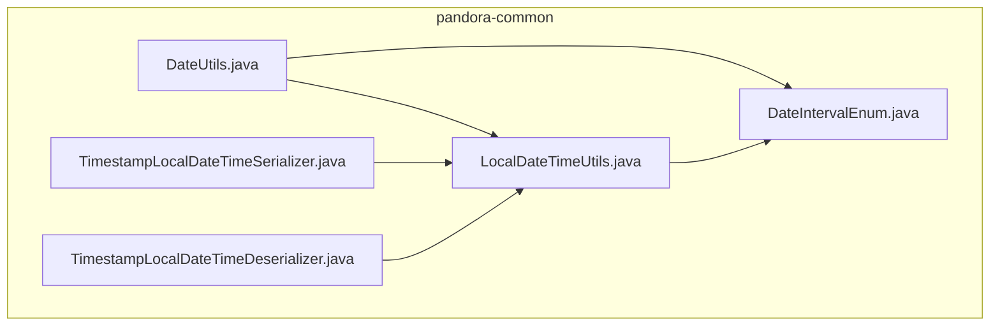
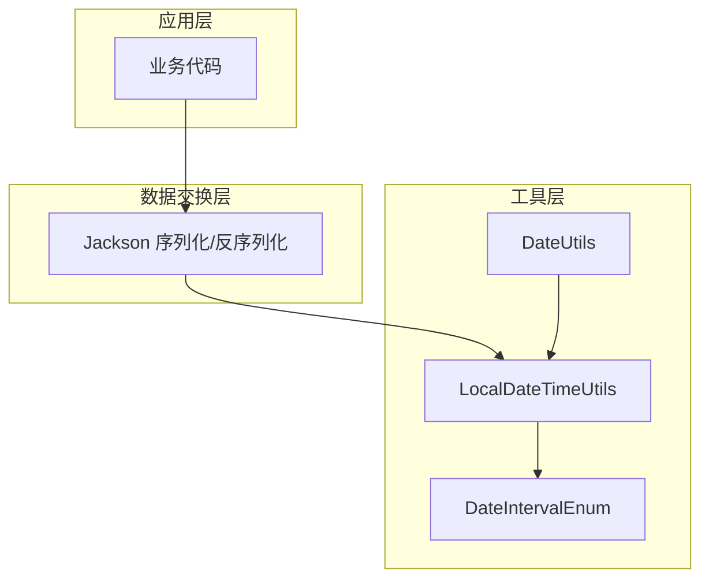
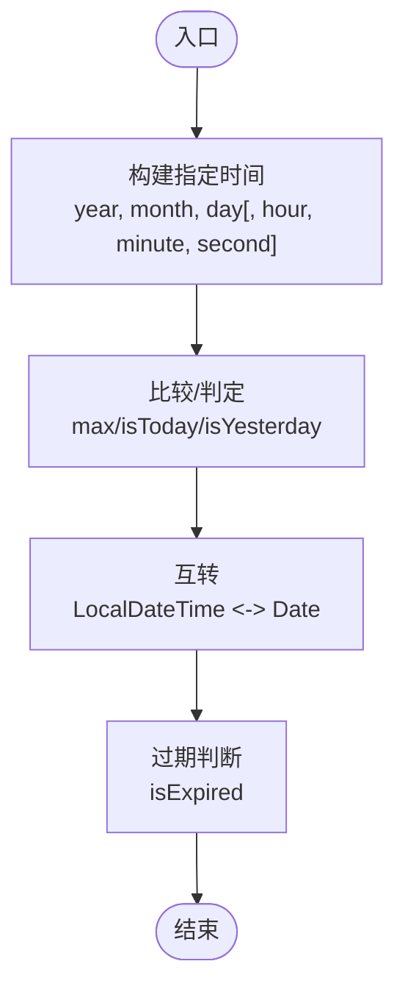
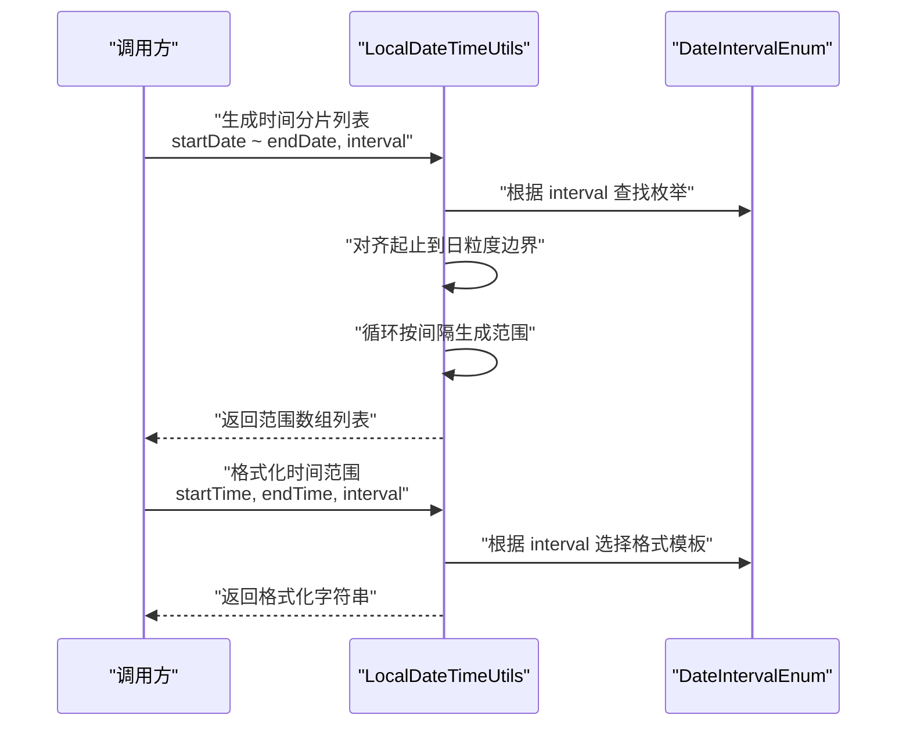
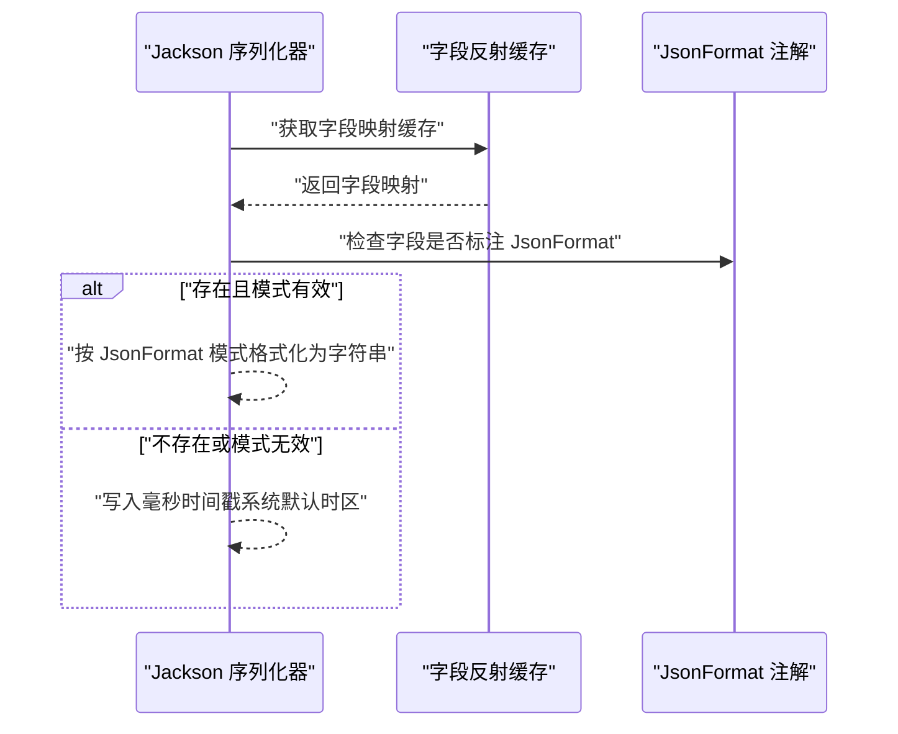
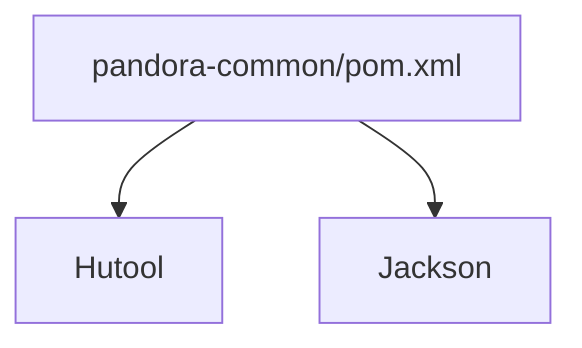

# 日期时间工具

<cite>
**本文引用的文件**
- [DateUtils.java](file://pandora-framework/pandora-common/src/main/java/net/ittimeline/pandora/framework/common/util/foundational/date/DateUtils.java)
- [LocalDateTimeUtils.java](file://pandora-framework/pandora-common/src/main/java/net/ittimeline/pandora/framework/common/util/foundational/date/LocalDateTimeUtils.java)
- [TimestampLocalDateTimeDeserializer.java](file://pandora-framework/pandora-common/src/main/java/net/ittimeline/pandora/framework/common/util/web/json/databind/TimestampLocalDateTimeDeserializer.java)
- [TimestampLocalDateTimeSerializer.java](file://pandora-framework/pandora-common/src/main/java/net/ittimeline/pandora/framework/common/util/web/json/databind/TimestampLocalDateTimeSerializer.java)
- [DateIntervalEnum.java](file://pandora-framework/pandora-common/src/main/java/net/ittimeline/pandora/framework/common/enums/DateIntervalEnum.java)
- [pandora-common/pom.xml](file://pandora-framework/pandora-common/pom.xml)
- [README.md](file://README.md)
</cite>

## 目录
1. [简介](#简介)
2. [项目结构](#项目结构)
3. [核心组件](#核心组件)
4. [架构总览](#架构总览)
5. [详细组件分析](#详细组件分析)
6. [依赖分析](#依赖分析)
7. [性能考虑](#性能考虑)
8. [故障排查指南](#故障排查指南)
9. [结论](#结论)
10. [附录](#附录)

## 简介
本技术文档聚焦于日期时间工具模块，系统性介绍两类工具类的功能与使用方式：
- 传统日期工具：DateUtils，覆盖格式化、解析、计算与比较等能力，并提供与 Date/LocalDateTime 的互转。
- Java 8+ 时间工具：LocalDateTimeUtils，提供时区处理、格式转换、时间运算、区间判断、时间分片与格式化等高级能力。

同时，文档总结时区转换最佳实践、日期格式化模板、时间精度处理与性能优化建议，并给出跨时区应用、夏令时处理与日期时间计算的实际场景示例。

## 项目结构
该模块位于框架公共包中，采用“按功能域分层”的组织方式，日期时间工具位于工具类目录下，配合 JSON 序列化适配器与枚举类型共同构成完整的日期时间处理体系。

图表来源
- [DateUtils.java:1-151](file://pandora-framework/pandora-common/src/main/java/net/ittimeline/pandora/framework/common/util/foundational/date/DateUtils.java#L1-L151)
- [LocalDateTimeUtils.java:1-374](file://pandora-framework/pandora-common/src/main/java/net/ittimeline/pandora/framework/common/util/foundational/date/LocalDateTimeUtils.java#L1-L374)
- [DateIntervalEnum.java:1-47](file://pandora-framework/pandora-common/src/main/java/net/ittimeline/pandora/framework/common/enums/DateIntervalEnum.java#L1-L47)
- [TimestampLocalDateTimeSerializer.java:1-86](file://pandora-framework/pandora-common/src/main/java/net/ittimeline/pandora/framework/common/util/web/json/databind/TimestampLocalDateTimeSerializer.java#L1-L86)
- [TimestampLocalDateTimeDeserializer.java:1-30](file://pandora-framework/pandora-common/src/main/java/net/ittimeline/pandora/framework/common/util/web/json/databind/TimestampLocalDateTimeDeserializer.java#L1-L30)

章节来源
- [README.md:1-15](file://README.md#L1-L15)

## 核心组件
- DateUtils：面向传统 Date/Calendar 的工具集，提供默认时区常量、时间构建、比较、过期判断、与 LocalDateTime 的互转等。
- LocalDateTimeUtils：面向 Java 8+ 的时间工具，提供解析、加减、区间判断、时间分片、格式化、季度/周起始计算、Unix 秒转换等。
- JSON 序列化适配器：基于 Jackson 的 LocalDateTime 序列化/反序列化器，统一时间戳与格式化输出策略。
- DateIntervalEnum：时间间隔枚举，支持小时、天、周、月、季度、年等，用于时间分片与格式化模板选择。

章节来源
- [DateUtils.java:1-151](file://pandora-framework/pandora-common/src/main/java/net/ittimeline/pandora/framework/common/util/foundational/date/DateUtils.java#L1-L151)
- [LocalDateTimeUtils.java:1-374](file://pandora-framework/pandora-common/src/main/java/net/ittimeline/pandora/framework/common/util/foundational/date/LocalDateTimeUtils.java#L1-L374)
- [TimestampLocalDateTimeSerializer.java:1-86](file://pandora-framework/pandora-common/src/main/java/net/ittimeline/pandora/framework/common/util/web/json/databind/TimestampLocalDateTimeSerializer.java#L1-L86)
- [TimestampLocalDateTimeDeserializer.java:1-30](file://pandora-framework/pandora-common/src/main/java/net/ittimeline/pandora/framework/common/util/web/json/databind/TimestampLocalDateTimeDeserializer.java#L1-L30)
- [DateIntervalEnum.java:1-47](file://pandora-framework/pandora-common/src/main/java/net/ittimeline/pandora/framework/common/enums/DateIntervalEnum.java#L1-L47)

## 架构总览
以下图展示日期时间工具在系统中的角色与交互关系：工具类负责业务无关的时间计算与格式化；JSON 序列化器负责与外部接口的数据交换；枚举为时间分片与格式化提供统一的间隔语义。

图表来源
- [LocalDateTimeUtils.java:1-374](file://pandora-framework/pandora-common/src/main/java/net/ittimeline/pandora/framework/common/util/foundational/date/LocalDateTimeUtils.java#L1-L374)
- [DateUtils.java:1-151](file://pandora-framework/pandora-common/src/main/java/net/ittimeline/pandora/framework/common/util/foundational/date/DateUtils.java#L1-L151)
- [DateIntervalEnum.java:1-47](file://pandora-framework/pandora-common/src/main/java/net/ittimeline/pandora/framework/common/enums/DateIntervalEnum.java#L1-L47)
- [TimestampLocalDateTimeSerializer.java:1-86](file://pandora-framework/pandora-common/src/main/java/net/ittimeline/pandora/framework/common/util/web/json/databind/TimestampLocalDateTimeSerializer.java#L1-L86)
- [TimestampLocalDateTimeDeserializer.java:1-30](file://pandora-framework/pandora-common/src/main/java/net/ittimeline/pandora/framework/common/util/web/json/databind/TimestampLocalDateTimeDeserializer.java#L1-L30)

## 详细组件分析

### DateUtils 组件分析
- 默认时区与常量
  - 提供默认时区常量，便于在工具方法中统一使用系统默认时区进行转换。
- 传统时间互转
  - 支持将 LocalDateTime 转为 Date，以及将 Date 转为 LocalDateTime，底层均基于系统默认时区与瞬时时间线进行转换。
- 时间构建与比较
  - 提供按年月日（可带时分秒）构建时间的方法；提供最大值比较，支持 Date 与 LocalDateTime 的比较。
- 过期判断与相对时间
  - 提供“是否已过期”“相对时间加法”等便捷方法，便于业务侧快速判断有效期与时间推进。
- 日期判定
  - 提供“是否今天”“是否昨天”等常用日期判定逻辑，内部使用 Hutool 的同日判断工具。

图表来源
- [DateUtils.java:78-108](file://pandora-framework/pandora-common/src/main/java/net/ittimeline/pandora/framework/common/util/foundational/date/DateUtils.java#L78-L108)
- [DateUtils.java:110-128](file://pandora-framework/pandora-common/src/main/java/net/ittimeline/pandora/framework/common/util/foundational/date/DateUtils.java#L110-L128)
- [DateUtils.java:37-63](file://pandora-framework/pandora-common/src/main/java/net/ittimeline/pandora/framework/common/util/foundational/date/DateUtils.java#L37-L63)
- [DateUtils.java:136-148](file://pandora-framework/pandora-common/src/main/java/net/ittimeline/pandora/framework/common/util/foundational/date/DateUtils.java#L136-L148)

章节来源
- [DateUtils.java:1-151](file://pandora-framework/pandora-common/src/main/java/net/ittimeline/pandora/framework/common/util/foundational/date/DateUtils.java#L1-L151)

### LocalDateTimeUtils 组件分析
- 解析与格式化
  - 提供宽松解析 LocalDateTime 的方法，优先尝试标准日期模式，失败则回退至通用解析；内置 UTC 毫秒带偏移量格式化器。
- 时间运算
  - 提供“当前时间加/减 Duration”“指定时间前/后判断”等运算，便于业务侧进行时间推进与相对时间判断。
- 区间判断与重叠检测
  - 支持指定时间与时间范围的包含判断，支持字符串时间的解析与判定；支持两个时间段的重叠检测。
- 时间分片与格式化
  - 支持按小时、天、周、月、季度、年生成时间范围列表；根据间隔类型返回对应格式化字符串（如“yyyy-MM”“yyyy-Qq”等）。
- 季度/周起始与基准时间
  - 提供季度计算、季度第一天、周一开始等辅助方法；提供今日/昨日/本月/本年开始时间等常用基准时间。
- 精度转换
  - 提供将 LocalDateTime 转换为 Unix 秒的便捷方法，便于与数据库或外部系统对接。

图表来源
- [LocalDateTimeUtils.java:241-306](file://pandora-framework/pandora-common/src/main/java/net/ittimeline/pandora/framework/common/util/foundational/date/LocalDateTimeUtils.java#L241-L306)
- [LocalDateTimeUtils.java:316-339](file://pandora-framework/pandora-common/src/main/java/net/ittimeline/pandora/framework/common/util/foundational/date/LocalDateTimeUtils.java#L316-L339)
- [DateIntervalEnum.java:19-46](file://pandora-framework/pandora-common/src/main/java/net/ittimeline/pandora/framework/common/enums/DateIntervalEnum.java#L19-L46)

章节来源
- [LocalDateTimeUtils.java:1-374](file://pandora-framework/pandora-common/src/main/java/net/ittimeline/pandora/framework/common/util/foundational/date/LocalDateTimeUtils.java#L1-L374)
- [DateIntervalEnum.java:1-47](file://pandora-framework/pandora-common/src/main/java/net/ittimeline/pandora/framework/common/enums/DateIntervalEnum.java#L1-L47)

### JSON 序列化适配器分析
- 序列化策略
  - 优先检查字段上的 JsonFormat 注解，若存在且模式有效则按模式格式化为字符串；否则默认输出为毫秒级时间戳（基于系统默认时区转换）。
- 反序列化策略
  - 将毫秒时间戳解析为 LocalDateTime，使用系统默认时区进行转换，确保与序列化端一致。
- 性能与容错
  - 通过反射缓存字段映射提升序列化性能；当 JsonFormat 模式无效时记录告警并回退到默认策略。

图表来源
- [TimestampLocalDateTimeSerializer.java:35-62](file://pandora-framework/pandora-common/src/main/java/net/ittimeline/pandora/framework/common/util/web/json/databind/TimestampLocalDateTimeSerializer.java#L35-L62)
- [TimestampLocalDateTimeDeserializer.java:23-27](file://pandora-framework/pandora-common/src/main/java/net/ittimeline/pandora/framework/common/util/web/json/databind/TimestampLocalDateTimeDeserializer.java#L23-L27)

章节来源
- [TimestampLocalDateTimeSerializer.java:1-86](file://pandora-framework/pandora-common/src/main/java/net/ittimeline/pandora/framework/common/util/web/json/databind/TimestampLocalDateTimeSerializer.java#L1-L86)
- [TimestampLocalDateTimeDeserializer.java:1-30](file://pandora-framework/pandora-common/src/main/java/net/ittimeline/pandora/framework/common/util/web/json/databind/TimestampLocalDateTimeDeserializer.java#L1-L30)

## 依赖分析
- 外部依赖
  - Hutool：提供日期解析、格式化、时间区间判断、时间对齐等工具方法，显著简化了 LocalDateTimeUtils 的实现复杂度。
  - Jackson：用于 LocalDateTime 的序列化与反序列化，结合 JsonFormat 注解实现灵活的输出格式。
- 内部耦合
  - DateUtils 与 LocalDateTimeUtils 在“互转”与“默认时区”上存在间接耦合（均使用系统默认时区）。
  - LocalDateTimeUtils 与 DateIntervalEnum 强耦合，用于时间分片与格式化模板选择。

图表来源
- [pandora-common/pom.xml:26-50](file://pandora-framework/pandora-common/pom.xml#L26-L50)

章节来源
- [pandora-common/pom.xml:1-101](file://pandora-framework/pandora-common/pom.xml#L1-L101)

## 性能考虑
- 时区与默认时区
  - 工具类普遍使用系统默认时区进行转换，避免频繁创建 ZoneId 实例带来的开销；在高并发场景建议明确传入目标时区，减少系统默认时区切换成本。
- 解析与格式化
  - 解析采用“先严格后宽松”的策略，减少异常回退次数；格式化器可复用（如 UTC_MS_WITH_XXX_OFFSET_FORMATTER），避免重复构造。
- 字段缓存
  - Jackson 序列化器通过并发映射缓存字段信息，降低反射开销；建议在对象结构稳定时启用该策略。
- 时间分片
  - 时间分片算法按固定间隔迭代，注意大跨度时间范围可能导致大量中间对象；建议在业务侧控制分片粒度与数量。

[本节为通用性能建议，不直接分析具体文件]

## 故障排查指南
- 解析失败
  - 若字符串时间解析抛出异常，LocalDateTimeUtils 的解析方法会回退到通用解析；建议检查输入字符串格式是否符合预期。
- 时区偏差
  - 当前后端部署在不同区域或使用不同默认时区时，可能出现显示偏差；建议在序列化/反序列化时显式指定时区，或统一使用 UTC。
- 格式化异常
  - 当 JsonFormat 模式无效时，序列化器会记录告警并回退到默认时间戳；请检查注解模式字符串的有效性。
- 区间边界
  - 时间分片与格式化在边界对齐时可能与期望不一致；建议在业务侧确认起止时间是否已对齐到日/时等粒度。

章节来源
- [LocalDateTimeUtils.java:46-52](file://pandora-framework/pandora-common/src/main/java/net/ittimeline/pandora/framework/common/util/foundational/date/LocalDateTimeUtils.java#L46-L52)
- [TimestampLocalDateTimeSerializer.java:52-56](file://pandora-framework/pandora-common/src/main/java/net/ittimeline/pandora/framework/common/util/web/json/databind/TimestampLocalDateTimeSerializer.java#L52-L56)

## 结论
- DateUtils 适合与传统 Date/Calendar 共存的遗留系统，提供简洁的互转、构建与比较能力。
- LocalDateTimeUtils 面向现代 Java 应用，提供更丰富的区间判断、时间分片与格式化能力，配合 Hutool 与枚举实现高内聚低耦合的设计。
- JSON 序列化适配器保证了与外部系统的稳定交互，兼顾灵活性与性能。
- 建议在跨时区与高并发场景中明确时区策略、合理选择时间精度与格式化模板，并通过缓存与批量处理优化性能。

[本节为总结性内容，不直接分析具体文件]

## 附录

### 时区转换最佳实践
- 统一使用 UTC 存储与传输，前端/客户端按用户时区格式化显示。
- 明确指定 ZoneId，避免依赖系统默认时区导致的差异。
- 在序列化/反序列化时显式处理时区，防止默认时区造成的误解。

[本节为通用实践建议，不直接分析具体文件]

### 日期格式化模板
- 年-月-日：yyyy-MM-dd
- 年-月-日 时:分:秒：yyyy-MM-dd HH:mm:ss
- 月-年：yyyy-MM
- 年：yyyy
- 季度：yyyy-Qq（如 2023-Q2）

章节来源
- [LocalDateTimeUtils.java:324-335](file://pandora-framework/pandora-common/src/main/java/net/ittimeline/pandora/framework/common/util/foundational/date/LocalDateTimeUtils.java#L324-L335)

### 时间精度处理
- 毫秒时间戳：适用于数据库存储与跨系统交互。
- 秒级时间戳：适用于与外部系统对接或日志统计。
- 字符串格式化：根据前端展示需求选择合适模板。

章节来源
- [TimestampLocalDateTimeSerializer.java:48-61](file://pandora-framework/pandora-common/src/main/java/net/ittimeline/pandora/framework/common/util/web/json/databind/TimestampLocalDateTimeSerializer.java#L48-L61)

### 夏令时处理方案
- 使用 ZoneId.of("Region/City") 明确定义时区，避免系统默认时区的夏令时变化影响。
- 在涉及跨时区的报表与统计场景，建议将时间对齐到 UTC 或固定偏移量，减少夏令时切换带来的波动。

[本节为通用方案建议，不直接分析具体文件]

### 日期时间计算实际应用场景
- 订单有效期校验：使用 DateUtils 的过期判断与时间构建，快速判定订单状态。
- 报表时间分片：使用 LocalDateTimeUtils 的时间分片与格式化，生成天/周/月/季度维度的统计区间。
- 接口时间字段：通过 Jackson 序列化器统一输出毫秒时间戳或指定格式字符串，保证前后端一致性。

[本节为通用场景建议，不直接分析具体文件]