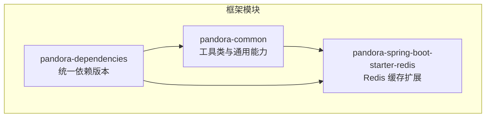
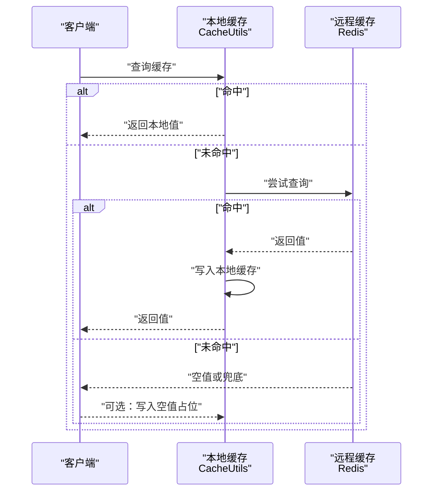
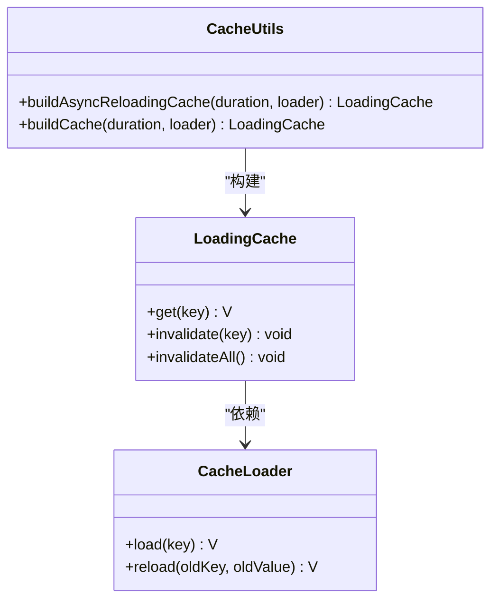
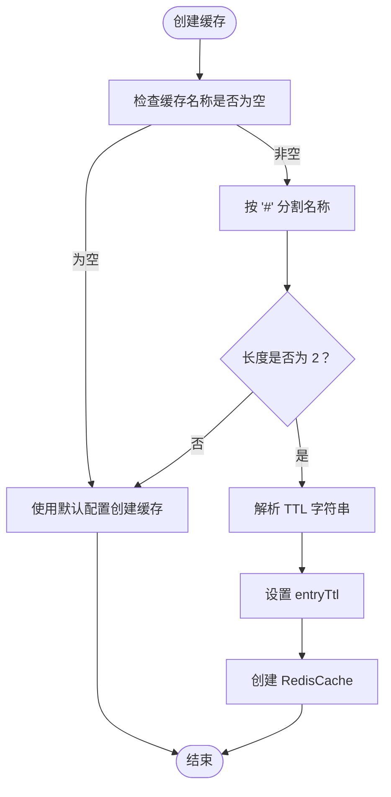
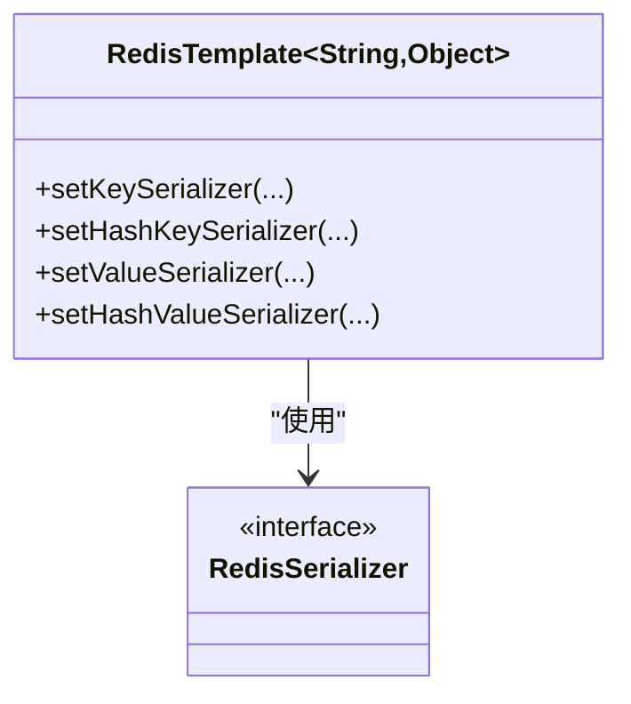
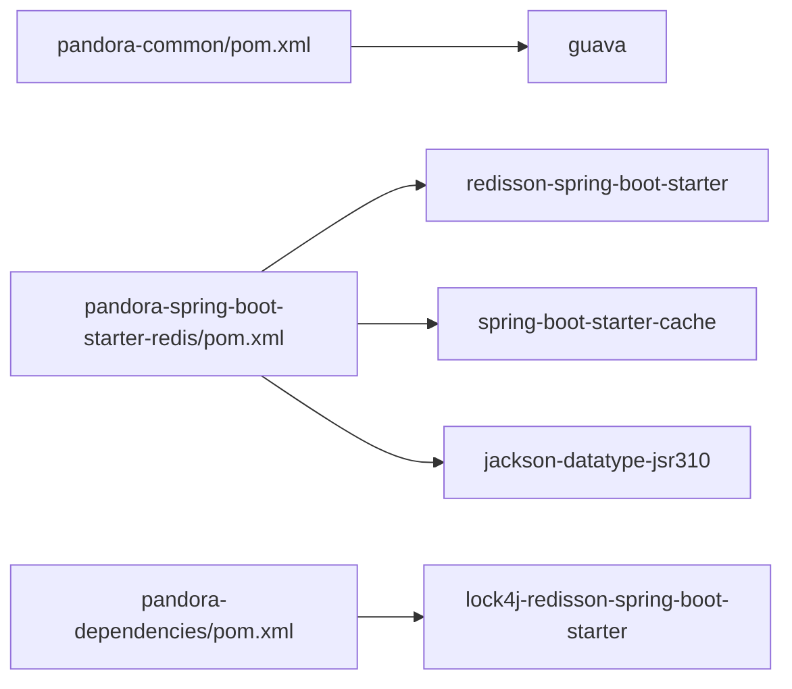

# 缓存工具类

<cite>
**本文引用的文件**
- [CacheUtils.java](file://pandora-framework/pandora-common/src/main/java/net/ittimeline/pandora/framework/common/util/web/cache/CacheUtils.java)
- [TimeoutRedisCacheManager.java](file://pandora-framework/pandora-spring-boot-starter-redis/src/main/java/net/ittimeline/pandora/framework/redis/core/TimeoutRedisCacheManager.java)
- [PandoraRedisAutoConfiguration.java](file://pandora-framework/pandora-spring-boot-starter-redis/src/main/java/net/ittimeline/pandora/framework/redis/config/PandoraRedisAutoConfiguration.java)
- [pandora-spring-boot-starter-redis/pom.xml](file://pandora-framework/pandora-spring-boot-starter-redis/pom.xml)
- [pandora-common/pom.xml](file://pandora-framework/pandora-common/pom.xml)
- [pandora-dependencies/pom.xml](file://pandora-dependencies/pom.xml)
- [README.md](file://README.md)
</cite>

## 目录
1. [简介](#简介)
2. [项目结构](#项目结构)
3. [核心组件](#核心组件)
4. [架构总览](#架构总览)
5. [详细组件分析](#详细组件分析)
6. [依赖分析](#依赖分析)
7. [性能考虑](#性能考虑)
8. [故障排查指南](#故障排查指南)
9. [结论](#结论)
10. [附录](#附录)

## 简介
本文件面向缓存工具类 CacheUtils 的专业级技术文档，聚焦于本地缓存构建与过期刷新机制，并结合框架内 Redis 缓存扩展能力，系统阐述分布式缓存的实现策略、缓存穿透防护、缓存雪崩预防与缓存一致性保障。同时提供 Redis 集成示例、本地缓存与远程缓存的协同使用建议，以及缓存性能监控的最佳实践。

## 项目结构
本项目采用多模块结构，缓存工具类位于通用模块 pandora-common 中，Redis 缓存扩展位于 pandora-spring-boot-starter-redis 模块。依赖管理由顶层依赖聚合模块统一维护。

图表来源
- [README.md:1-15](file://README.md#L1-L15)

章节来源
- [README.md:1-15](file://README.md#L1-L15)

## 核心组件
- CacheUtils：提供基于 Google Guava 的本地 LoadingCache 构建能力，支持同步与异步刷新两种模式，统一最大容量与过期刷新策略。
- TimeoutRedisCacheManager：基于 Spring Data Redis 的 RedisCacheManager 扩展，支持在缓存名称中携带自定义过期时间，按命名约定动态解析并应用 TTL。
- PandoraRedisAutoConfiguration：提供 JSON 序列化的 RedisTemplate Bean，确保键值序列化一致，便于跨模块复用。

章节来源
- [CacheUtils.java:16-60](file://pandora-framework/pandora-common/src/main/java/net/ittimeline/pandora/framework/common/util/web/cache/CacheUtils.java#L16-L60)
- [TimeoutRedisCacheManager.java:19-85](file://pandora-framework/pandora-spring-boot-starter-redis/src/main/java/net/ittimeline/pandora/framework/redis/core/TimeoutRedisCacheManager.java#L19-L85)
- [PandoraRedisAutoConfiguration.java:25-46](file://pandora-framework/pandora-spring-boot-starter-redis/src/main/java/net/ittimeline/pandora/framework/redis/config/PandoraRedisAutoConfiguration.java#L25-L46)

## 架构总览
本地缓存与远程缓存的协同工作流如下：

图表来源
- [CacheUtils.java:37-59](file://pandora-framework/pandora-common/src/main/java/net/ittimeline/pandora/framework/common/util/web/cache/CacheUtils.java#L37-L59)
- [TimeoutRedisCacheManager.java:28-50](file://pandora-framework/pandora-spring-boot-starter-redis/src/main/java/net/ittimeline/pandora/framework/redis/core/TimeoutRedisCacheManager.java#L28-L50)

## 详细组件分析

### CacheUtils 组件分析
- 设计要点
  - 提供两种 LoadingCache 构建方法：
    - 同步刷新：refreshAfterWrite 控制过期，仅当前加载线程阻塞，其他线程返回旧值。
    - 异步刷新：基于 CacheLoader.asyncReloading 与线程池实现全异步刷新，进一步降低抖动。
  - 统一最大容量与过期刷新策略，便于在不同业务场景复用。
  - 注释明确区分“人相关”与“全局/系统相关”的缓存构建选择，避免 ThreadLocal 传递问题。

图表来源
- [CacheUtils.java:37-59](file://pandora-framework/pandora-common/src/main/java/net/ittimeline/pandora/framework/common/util/web/cache/CacheUtils.java#L37-L59)

章节来源
- [CacheUtils.java:16-60](file://pandora-framework/pandora-common/src/main/java/net/ittimeline/pandora/framework/common/util/web/cache/CacheUtils.java#L16-L60)

### TimeoutRedisCacheManager 组件分析
- 设计要点
  - 通过缓存名称约定实现动态 TTL：名称格式为“缓存名#TTL规则”，解析 TTL 规则并覆盖默认 entryTtl。
  - 支持 d/h/m/s 等单位，兼容无单位秒数，默认按秒处理。
  - 在 createRedisCache 钩子中完成 TTL 解析与配置，不影响缓存键名。

图表来源
- [TimeoutRedisCacheManager.java:28-50](file://pandora-framework/pandora-spring-boot-starter-redis/src/main/java/net/ittimeline/pandora/framework/redis/core/TimeoutRedisCacheManager.java#L28-L50)
- [TimeoutRedisCacheManager.java:58-82](file://pandora-framework/pandora-spring-boot-starter-redis/src/main/java/net/ittimeline/pandora/framework/redis/core/TimeoutRedisCacheManager.java#L58-L82)

章节来源
- [TimeoutRedisCacheManager.java:19-85](file://pandora-framework/pandora-spring-boot-starter-redis/src/main/java/net/ittimeline/pandora/framework/redis/core/TimeoutRedisCacheManager.java#L19-L85)

### RedisTemplate 序列化配置
- 设计要点
  - 键使用字符串序列化，哈希键同样使用字符串序列化，保证键空间清晰。
  - 值使用 JSON 序列化（Jackson），并通过注册 JavaTimeModule 解决 LocalDateTime 等 JSR-310 类型序列化问题。
  - 通过自定义 Bean 优先于第三方自动配置，确保序列化策略一致。

图表来源
- [PandoraRedisAutoConfiguration.java:25-46](file://pandora-framework/pandora-spring-boot-starter-redis/src/main/java/net/ittimeline/pandora/framework/redis/config/PandoraRedisAutoConfiguration.java#L25-L46)

章节来源
- [PandoraRedisAutoConfiguration.java:25-46](file://pandora-framework/pandora-spring-boot-starter-redis/src/main/java/net/ittimeline/pandora/framework/redis/config/PandoraRedisAutoConfiguration.java#L25-L46)

## 依赖分析
- 本地缓存依赖
  - guava：提供 CacheBuilder、LoadingCache、CacheLoader 等核心能力。
- Redis 缓存扩展依赖
  - redisson-spring-boot-starter：提供 Redisson 客户端与分布式能力。
  - spring-boot-starter-cache：启用 Spring Cache 自动装配。
  - jackson-datatype-jsr310：增强 JSON 序列化对 JSR-310 时间类型的支持。
- 依赖聚合
  - lock4j-redisson-spring-boot-starter：提供分布式锁能力，可用于缓存更新时的一致性控制。

图表来源
- [pandora-common/pom.xml:40-43](file://pandora-framework/pandora-common/pom.xml#L40-L43)
- [pandora-spring-boot-starter-redis/pom.xml:27-39](file://pandora-framework/pandora-spring-boot-starter-redis/pom.xml#L27-L39)
- [pandora-dependencies/pom.xml:264-272](file://pandora-dependencies/pom.xml#L264-L272)

章节来源
- [pandora-common/pom.xml:26-101](file://pandora-framework/pandora-common/pom.xml#L26-L101)
- [pandora-spring-boot-starter-redis/pom.xml:19-43](file://pandora-framework/pandora-spring-boot-starter-redis/pom.xml#L19-L43)
- [pandora-dependencies/pom.xml:261-272](file://pandora-dependencies/pom.xml#L261-L272)

## 性能考虑
- 本地缓存
  - 通过 maximumSize 限制内存占用，避免无限增长。
  - refreshAfterWrite 结合异步刷新，减少请求线程阻塞，提升热点数据的可用性。
  - 建议针对高并发场景优先使用异步刷新构建方法，降低抖动。
- 远程缓存
  - 使用 JSON 序列化时注意对象结构稳定性，避免频繁变更导致反序列化失败。
  - TTL 策略应结合业务访问特征设计，避免集中过期引发雪崩。
- 一致性与锁
  - 更新缓存时可结合分布式锁，防止缓存击穿与脏读。
  - 对于热点键，可采用双写或延迟双删策略，降低不一致窗口。

## 故障排查指南
- 缓存未生效
  - 检查 CacheUtils 构建方法是否正确传入 CacheLoader，确认 refreshAfterWrite 是否按预期设置。
  - 检查 Redis 缓存名称是否遵循“缓存名#TTL规则”，TTL 单位与格式是否正确。
- 序列化异常
  - 确认 RedisTemplate 的值序列化器已注册 JavaTimeModule，避免时间类型序列化失败。
- 过期时间不生效
  - 确认使用了 TimeoutRedisCacheManager 并正确传入带“#TTL规则”的缓存名称。
- 性能抖动
  - 若使用同步刷新，观察是否存在大量并发加载导致主线程阻塞；建议切换为异步刷新。

章节来源
- [PandoraRedisAutoConfiguration.java:40-46](file://pandora-framework/pandora-spring-boot-starter-redis/src/main/java/net/ittimeline/pandora/framework/redis/config/PandoraRedisAutoConfiguration.java#L40-L46)
- [TimeoutRedisCacheManager.java:28-50](file://pandora-framework/pandora-spring-boot-starter-redis/src/main/java/net/ittimeline/pandora/framework/redis/core/TimeoutRedisCacheManager.java#L28-L50)

## 结论
CacheUtils 提供了简洁高效的本地缓存构建能力，结合 TimeoutRedisCacheManager 与 RedisTemplate 序列化配置，形成“本地 + 远程”的两级缓存体系。通过合理的 TTL 策略、异步刷新与分布式锁配合，可在保证一致性的同时显著提升系统吞吐与稳定性。

## 附录
- 使用建议
  - 本地缓存优先用于“全局/系统相关”的稳定数据，避免与 ThreadLocal 绑定。
  - 远程缓存用于跨节点共享的数据，结合 TTL 与命名约定实现灵活过期。
  - 对热点数据采用异步刷新与分布式锁，兼顾性能与一致性。
- 监控建议
  - 关注本地缓存命中率、淘汰率与平均加载耗时。
  - 关注远程缓存命中率、网络延迟与序列化开销。
  - 对关键业务缓存建立告警阈值，及时发现异常波动。