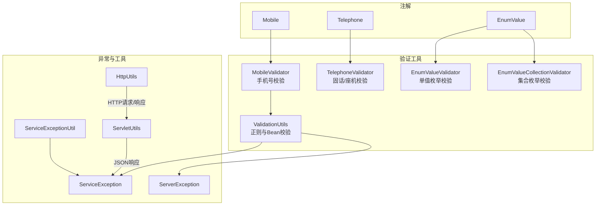
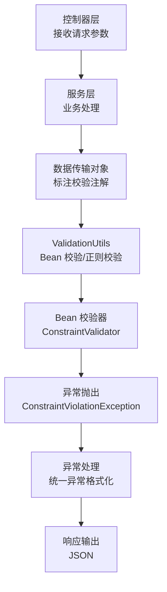
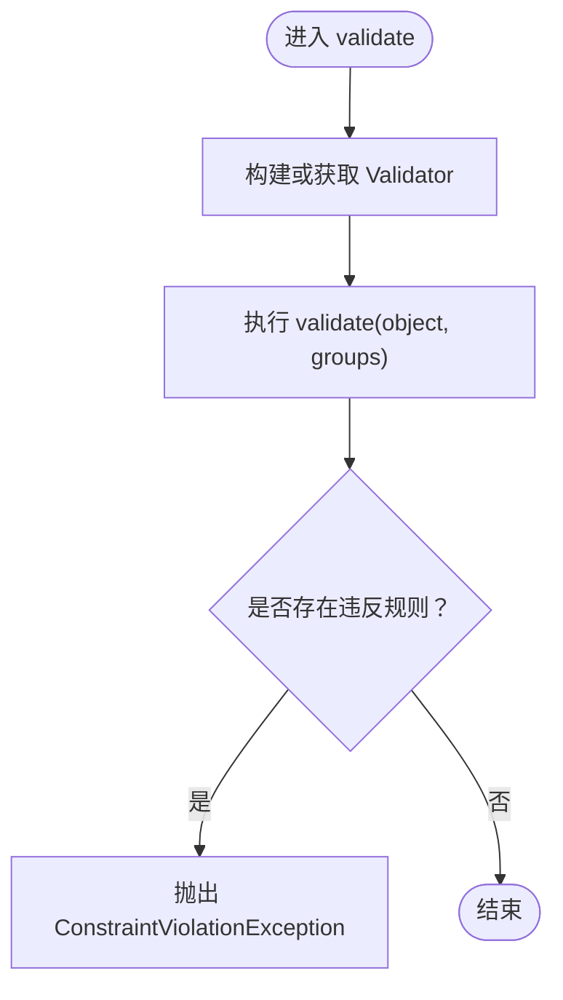
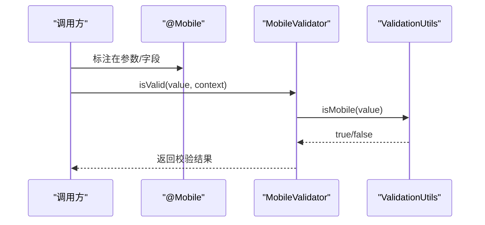
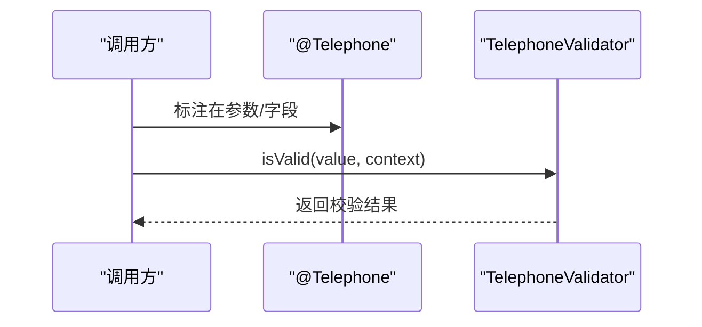
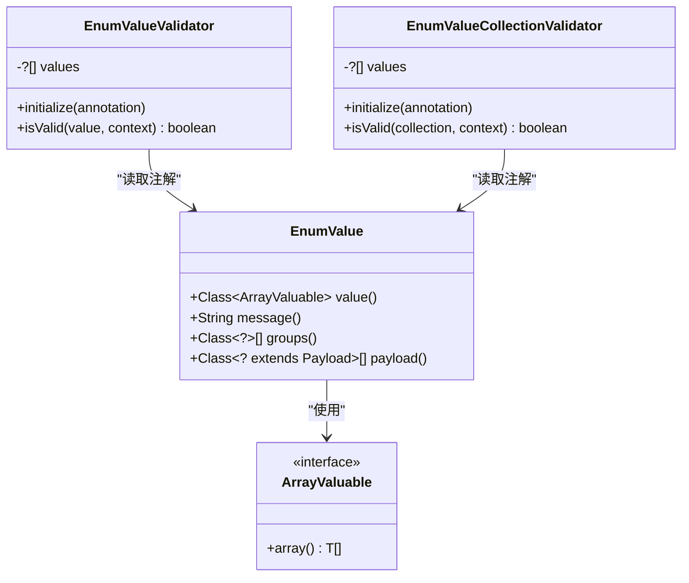
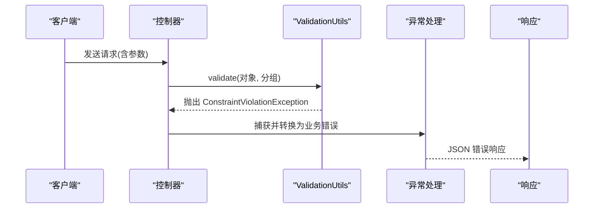
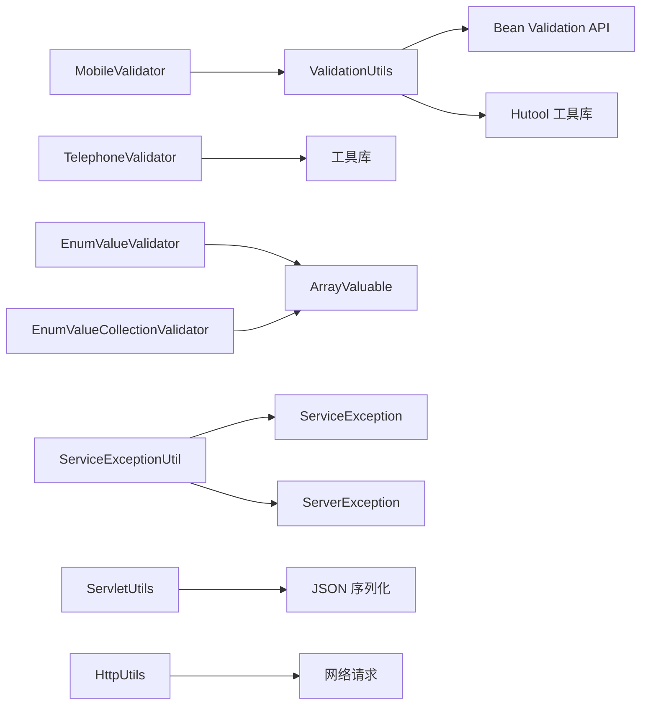

# 验证工具类

<cite>
**本文引用的文件**
- [ValidationUtils.java](file://pandora-framework/pandora-common/src/main/java/net/ittimeline/pandora/framework/common/util/web/validation/ValidationUtils.java)
- [Mobile.java](file://pandora-framework/pandora-common/src/main/java/net/ittimeline/pandora/framework/common/validation/Mobile.java)
- [MobileValidator.java](file://pandora-framework/pandora-common/src/main/java/net/ittimeline/pandora/framework/common/validation/MobileValidator.java)
- [Telephone.java](file://pandora-framework/pandora-common/src/main/java/net/ittimeline/pandora/framework/common/validation/Telephone.java)
- [TelephoneValidator.java](file://pandora-framework/pandora-common/src/main/java/net/ittimeline/pandora/framework/common/validation/TelephoneValidator.java)
- [EnumValue.java](file://pandora-framework/pandora-common/src/main/java/net/ittimeline/pandora/framework/common/validation/EnumValue.java)
- [EnumValueValidator.java](file://pandora-framework/pandora-common/src/main/java/net/ittimeline/pandora/framework/common/validation/EnumValueValidator.java)
- [EnumValueCollectionValidator.java](file://pandora-framework/pandora-common/src/main/java/net/ittimeline/pandora/framework/common/validation/EnumValueCollectionValidator.java)
- [ArrayValuable.java](file://pandora-framework/pandora-common/src/main/java/net/ittimeline/pandora/framework/common/core/ArrayValuable.java)
- [ServiceException.java](file://pandora-framework/pandora-common/src/main/java/net/ittimeline/pandora/framework/common/exception/ServiceException.java)
- [ServerException.java](file://pandora-framework/pandora-common/src/main/java/net/ittimeline/pandora/framework/common/exception/ServerException.java)
- [ServiceExceptionUtil.java](file://pandora-framework/pandora-common/src/main/java/net/ittimeline/pandora/framework/common/exception/util/ServiceExceptionUtil.java)
- [ServletUtils.java](file://pandora-framework/pandora-common/src/main/java/net/ittimeline/pandora/framework/common/util/web/servlet/ServletUtils.java)
- [HttpUtils.java](file://pandora-framework/pandora-common/src/main/java/net/ittimeline/pandora/framework/common/util/web/http/HttpUtils.java)
</cite>

## 目录
1. [简介](#简介)
2. [项目结构](#项目结构)
3. [核心组件](#核心组件)
4. [架构总览](#架构总览)
5. [详细组件分析](#详细组件分析)
6. [依赖分析](#依赖分析)
7. [性能考虑](#性能考虑)
8. [故障排查指南](#故障排查指南)
9. [结论](#结论)
10. [附录](#附录)

## 简介
本文件为验证工具类的权威参考文档，聚焦于 ValidationUtils 参数验证工具的校验规则、错误收集与异常处理机制，系统阐述其在控制器层、服务层与数据传输对象中的使用模式、自定义验证器的实现方法以及批量验证的最佳实践。同时提供 RESTful API 中的参数验证示例思路、国际化错误消息处理建议与性能优化策略。

## 项目结构
验证相关能力主要分布在以下模块：
- 核心验证工具：ValidationUtils 提供正则校验与 Bean 校验入口
- 注解与校验器：手机号、固话/座机、枚举值等自定义校验注解及其实现
- 异常体系：统一的业务异常与服务器异常，配合异常工具进行格式化输出
- Web 工具：ServletUtils 与 HttpUtils 提供请求/响应与 HTTP 操作辅助

图表来源
- [ValidationUtils.java:1-56](file://pandora-framework/pandora-common/src/main/java/net/ittimeline/pandora/framework/common/util/web/validation/ValidationUtils.java#L1-L56)
- [MobileValidator.java:1-30](file://pandora-framework/pandora-common/src/main/java/net/ittimeline/pandora/framework/common/validation/MobileValidator.java#L1-L30)
- [TelephoneValidator.java:1-31](file://pandora-framework/pandora-common/src/main/java/net/ittimeline/pandora/framework/common/validation/TelephoneValidator.java#L1-L31)
- [EnumValueValidator.java:1-49](file://pandora-framework/pandora-common/src/main/java/net/ittimeline/pandora/framework/common/validation/EnumValueValidator.java#L1-L49)
- [EnumValueCollectionValidator.java:1-50](file://pandora-framework/pandora-common/src/main/java/net/ittimeline/pandora/framework/common/validation/EnumValueCollectionValidator.java#L1-L50)
- [ServiceException.java:1-64](file://pandora-framework/pandora-common/src/main/java/net/ittimeline/pandora/framework/common/exception/ServiceException.java#L1-L64)
- [ServerException.java:1-65](file://pandora-framework/pandora-common/src/main/java/net/ittimeline/pandora/framework/common/exception/ServerException.java#L1-L65)
- [ServiceExceptionUtil.java:1-85](file://pandora-framework/pandora-common/src/main/java/net/ittimeline/pandora/framework/common/exception/util/ServiceExceptionUtil.java#L1-L85)
- [ServletUtils.java:1-105](file://pandora-framework/pandora-common/src/main/java/net/ittimeline/pandora/framework/common/util/web/servlet/ServletUtils.java#L1-L105)
- [HttpUtils.java:1-204](file://pandora-framework/pandora-common/src/main/java/net/ittimeline/pandora/framework/common/util/web/http/HttpUtils.java#L1-L204)

章节来源
- [ValidationUtils.java:1-56](file://pandora-framework/pandora-common/src/main/java/net/ittimeline/pandora/framework/common/util/web/validation/ValidationUtils.java#L1-L56)
- [Mobile.java:1-35](file://pandora-framework/pandora-common/src/main/java/net/ittimeline/pandora/framework/common/validation/Mobile.java#L1-L35)
- [MobileValidator.java:1-30](file://pandora-framework/pandora-common/src/main/java/net/ittimeline/pandora/framework/common/validation/MobileValidator.java#L1-L30)
- [Telephone.java:1-35](file://pandora-framework/pandora-common/src/main/java/net/ittimeline/pandora/framework/common/validation/Telephone.java#L1-L35)
- [TelephoneValidator.java:1-31](file://pandora-framework/pandora-common/src/main/java/net/ittimeline/pandora/framework/common/validation/TelephoneValidator.java#L1-L31)
- [EnumValue.java:1-40](file://pandora-framework/pandora-common/src/main/java/net/ittimeline/pandora/framework/common/validation/EnumValue.java#L1-L40)
- [EnumValueValidator.java:1-49](file://pandora-framework/pandora-common/src/main/java/net/ittimeline/pandora/framework/common/validation/EnumValueValidator.java#L1-L49)
- [EnumValueCollectionValidator.java:1-50](file://pandora-framework/pandora-common/src/main/java/net/ittimeline/pandora/framework/common/validation/EnumValueCollectionValidator.java#L1-L50)
- [ArrayValuable.java:1-16](file://pandora-framework/pandora-common/src/main/java/net/ittimeline/pandora/framework/common/core/ArrayValuable.java#L1-L16)
- [ServiceException.java:1-64](file://pandora-framework/pandora-common/src/main/java/net/ittimeline/pandora/framework/common/exception/ServiceException.java#L1-L64)
- [ServerException.java:1-65](file://pandora-framework/pandora-common/src/main/java/net/ittimeline/pandora/framework/common/exception/ServerException.java#L1-L65)
- [ServiceExceptionUtil.java:1-85](file://pandora-framework/pandora-common/src/main/java/net/ittimeline/pandora/framework/common/exception/util/ServiceExceptionUtil.java#L1-L85)
- [ServletUtils.java:1-105](file://pandora-framework/pandora-common/src/main/java/net/ittimeline/pandora/framework/common/util/web/servlet/ServletUtils.java#L1-L105)
- [HttpUtils.java:1-204](file://pandora-framework/pandora-common/src/main/java/net/ittimeline/pandora/framework/common/util/web/http/HttpUtils.java#L1-L204)

## 核心组件
- ValidationUtils：提供手机号、URL、XML NCName 等正则校验，以及基于 Bean Validation 的批量校验与异常抛出
- 自定义注解与校验器：Mobile、Telephone、EnumValue，配套对应的 ConstraintValidator 实现
- 异常体系：ServiceException/ServerException 与 ServiceExceptionUtil 统一异常格式化
- Web 工具：ServletUtils 与 HttpUtils 支持 JSON 输出与 HTTP 操作

章节来源
- [ValidationUtils.java:14-56](file://pandora-framework/pandora-common/src/main/java/net/ittimeline/pandora/framework/common/util/web/validation/ValidationUtils.java#L14-L56)
- [Mobile.java:8-35](file://pandora-framework/pandora-common/src/main/java/net/ittimeline/pandora/framework/common/validation/Mobile.java#L8-L35)
- [Telephone.java:8-35](file://pandora-framework/pandora-common/src/main/java/net/ittimeline/pandora/framework/common/validation/Telephone.java#L8-L35)
- [EnumValue.java:9-40](file://pandora-framework/pandora-common/src/main/java/net/ittimeline/pandora/framework/common/validation/EnumValue.java#L9-L40)
- [ServiceException.java:13-64](file://pandora-framework/pandora-common/src/main/java/net/ittimeline/pandora/framework/common/exception/ServiceException.java#L13-L64)
- [ServerException.java:14-65](file://pandora-framework/pandora-common/src/main/java/net/ittimeline/pandora/framework/common/exception/ServerException.java#L14-L65)
- [ServiceExceptionUtil.java:18-85](file://pandora-framework/pandora-common/src/main/java/net/ittimeline/pandora/framework/common/exception/util/ServiceExceptionUtil.java#L18-L85)
- [ServletUtils.java:22-105](file://pandora-framework/pandora-common/src/main/java/net/ittimeline/pandora/framework/common/util/web/servlet/ServletUtils.java#L22-L105)
- [HttpUtils.java:26-204](file://pandora-framework/pandora-common/src/main/java/net/ittimeline/pandora/framework/common/util/web/http/HttpUtils.java#L26-L204)

## 架构总览
下图展示验证工具在系统中的角色与交互：

图表来源
- [ValidationUtils.java:43-54](file://pandora-framework/pandora-common/src/main/java/net/ittimeline/pandora/framework/common/util/web/validation/ValidationUtils.java#L43-L54)
- [MobileValidator.java:20-28](file://pandora-framework/pandora-common/src/main/java/net/ittimeline/pandora/framework/common/validation/MobileValidator.java#L20-L28)
- [EnumValueValidator.java:32-47](file://pandora-framework/pandora-common/src/main/java/net/ittimeline/pandora/framework/common/validation/EnumValueValidator.java#L32-L47)
- [ServiceExceptionUtil.java:22-37](file://pandora-framework/pandora-common/src/main/java/net/ittimeline/pandora/framework/common/exception/util/ServiceExceptionUtil.java#L22-L37)
- [ServletUtils.java:29-33](file://pandora-framework/pandora-common/src/main/java/net/ittimeline/pandora/framework/common/util/web/servlet/ServletUtils.java#L29-L33)

## 详细组件分析

### ValidationUtils：参数验证与异常处理
- 正则校验
  - isMobile：基于预编译正则判断手机号格式
  - isURL：校验 URL 合法性
  - isXmlNCName：校验 XML NCName 规范
- Bean 校验
  - validate(Object, groups...)：构建默认 Validator，执行校验，若存在违反规则则抛出 ConstraintViolationException
  - validate(Validator, Object, groups...)：复用传入 Validator，行为一致
- 错误收集与异常
  - 使用 Bean Validation 的 ConstraintViolation 集合收集错误
  - 抛出 ConstraintViolationException，便于上层统一捕获与处理

图表来源
- [ValidationUtils.java:43-54](file://pandora-framework/pandora-common/src/main/java/net/ittimeline/pandora/framework/common/util/web/validation/ValidationUtils.java#L43-L54)

章节来源
- [ValidationUtils.java:28-41](file://pandora-framework/pandora-common/src/main/java/net/ittimeline/pandora/framework/common/util/web/validation/ValidationUtils.java#L28-L41)
- [ValidationUtils.java:43-54](file://pandora-framework/pandora-common/src/main/java/net/ittimeline/pandora/framework/common/util/web/validation/ValidationUtils.java#L43-L54)

### 自定义注解与校验器

#### 手机号校验：Mobile 与 MobileValidator
- 注解 Mobile：声明校验逻辑由 MobileValidator 执行，支持分组与负载
- 校验逻辑：空值默认通过；非空时委托 ValidationUtils.isMobile 判断
- 适用场景：控制器/服务层参数、DTO 字段标注

图表来源
- [Mobile.java:24-26](file://pandora-framework/pandora-common/src/main/java/net/ittimeline/pandora/framework/common/validation/Mobile.java#L24-L26)
- [MobileValidator.java:20-28](file://pandora-framework/pandora-common/src/main/java/net/ittimeline/pandora/framework/common/validation/MobileValidator.java#L20-L28)
- [ValidationUtils.java:28-31](file://pandora-framework/pandora-common/src/main/java/net/ittimeline/pandora/framework/common/util/web/validation/ValidationUtils.java#L28-L31)

章节来源
- [Mobile.java:14-35](file://pandora-framework/pandora-common/src/main/java/net/ittimeline/pandora/framework/common/validation/Mobile.java#L14-L35)
- [MobileValidator.java:14-30](file://pandora-framework/pandora-common/src/main/java/net/ittimeline/pandora/framework/common/validation/MobileValidator.java#L14-L30)
- [ValidationUtils.java:28-31](file://pandora-framework/pandora-common/src/main/java/net/ittimeline/pandora/framework/common/util/web/validation/ValidationUtils.java#L28-L31)

#### 固话/座机校验：Telephone 与 TelephoneValidator
- 注解 Telephone：声明校验逻辑由 TelephoneValidator 执行
- 校验逻辑：空值默认通过；非空时使用工具库判断固话/座机格式
- 适用场景：与移动通信相关的参数校验

图表来源
- [Telephone.java:24-26](file://pandora-framework/pandora-common/src/main/java/net/ittimeline/pandora/framework/common/validation/Telephone.java#L24-L26)
- [TelephoneValidator.java:20-28](file://pandora-framework/pandora-common/src/main/java/net/ittimeline/pandora/framework/common/validation/TelephoneValidator.java#L20-L28)

章节来源
- [Telephone.java:14-35](file://pandora-framework/pandora-common/src/main/java/net/ittimeline/pandora/framework/common/validation/Telephone.java#L14-L35)
- [TelephoneValidator.java:14-31](file://pandora-framework/pandora-common/src/main/java/net/ittimeline/pandora/framework/common/validation/TelephoneValidator.java#L14-L31)

#### 枚举值校验：EnumValue 与双校验器
- 注解 EnumValue：通过 value 指定实现 ArrayValuable 的枚举类，自动提取可选值集合
- 单值校验器 EnumValueValidator：校验单个值是否在枚举范围内
- 集合校验器 EnumValueCollectionValidator：校验集合中每个元素均在枚举范围内
- 错误消息定制：当校验失败时禁用默认消息，使用模板替换后的自定义消息

图表来源
- [EnumValue.java:25-39](file://pandora-framework/pandora-common/src/main/java/net/ittimeline/pandora/framework/common/validation/EnumValue.java#L25-L39)
- [EnumValueValidator.java:18-47](file://pandora-framework/pandora-common/src/main/java/net/ittimeline/pandora/framework/common/validation/EnumValueValidator.java#L18-L47)
- [EnumValueCollectionValidator.java:19-47](file://pandora-framework/pandora-common/src/main/java/net/ittimeline/pandora/framework/common/validation/EnumValueCollectionValidator.java#L19-L47)
- [ArrayValuable.java:10-16](file://pandora-framework/pandora-common/src/main/java/net/ittimeline/pandora/framework/common/core/ArrayValuable.java#L10-L16)

章节来源
- [EnumValue.java:15-40](file://pandora-framework/pandora-common/src/main/java/net/ittimeline/pandora/framework/common/validation/EnumValue.java#L15-L40)
- [EnumValueValidator.java:18-49](file://pandora-framework/pandora-common/src/main/java/net/ittimeline/pandora/framework/common/validation/EnumValueValidator.java#L18-L49)
- [EnumValueCollectionValidator.java:19-50](file://pandora-framework/pandora-common/src/main/java/net/ittimeline/pandora/framework/common/validation/EnumValueCollectionValidator.java#L19-L50)
- [ArrayValuable.java:10-16](file://pandora-framework/pandora-common/src/main/java/net/ittimeline/pandora/framework/common/core/ArrayValuable.java#L10-L16)

### 使用模式与最佳实践

#### 控制器层
- 在控制器方法参数上直接标注校验注解，如 @Mobile、@Telephone、@EnumValue
- 对复杂对象使用 ValidationUtils.validate 或 Bean Validation 的标准校验流程
- 将 ConstraintViolationException 映射为统一的业务错误响应

图表来源
- [ValidationUtils.java:43-54](file://pandora-framework/pandora-common/src/main/java/net/ittimeline/pandora/framework/common/util/web/validation/ValidationUtils.java#L43-L54)
- [ServletUtils.java:29-33](file://pandora-framework/pandora-common/src/main/java/net/ittimeline/pandora/framework/common/util/web/servlet/ServletUtils.java#L29-L33)

#### 服务层
- 对输入参数进行前置校验，尽早失败
- 使用 ValidationUtils.validate 批量校验对象，确保数据一致性
- 结合 ServiceExceptionUtil 格式化错误消息，便于前端展示

章节来源
- [ValidationUtils.java:43-54](file://pandora-framework/pandora-common/src/main/java/net/ittimeline/pandora/framework/common/util/web/validation/ValidationUtils.java#L43-L54)
- [ServiceExceptionUtil.java:22-37](file://pandora-framework/pandora-common/src/main/java/net/ittimeline/pandora/framework/common/exception/util/ServiceExceptionUtil.java#L22-L37)

#### 数据传输对象（DTO）
- 在 DTO 字段上标注 @Mobile/@Telephone/@EnumValue 等注解
- 使用 @NotBlank、@NotNull、@Size 等标准注解完善约束
- 通过分组（groups）区分不同场景下的校验规则

章节来源
- [Mobile.java:14-35](file://pandora-framework/pandora-common/src/main/java/net/ittimeline/pandora/framework/common/validation/Mobile.java#L14-L35)
- [Telephone.java:14-35](file://pandora-framework/pandora-common/src/main/java/net/ittimeline/pandora/framework/common/validation/Telephone.java#L14-L35)
- [EnumValue.java:15-40](file://pandora-framework/pandora-common/src/main/java/net/ittimeline/pandora/framework/common/validation/EnumValue.java#L15-L40)

#### 自定义验证器实现方法
- 实现 ConstraintValidator 接口，重写 initialize 与 isValid
- 在 isValid 中处理空值默认通过的约定
- 失败时可通过 context 禁用默认消息并构建自定义模板消息
- 若需要支持集合校验，实现 Collection<?> 的校验器变体

章节来源
- [EnumValueValidator.java:18-47](file://pandora-framework/pandora-common/src/main/java/net/ittimeline/pandora/framework/common/validation/EnumValueValidator.java#L18-L47)
- [EnumValueCollectionValidator.java:19-47](file://pandora-framework/pandora-common/src/main/java/net/ittimeline/pandora/framework/common/validation/EnumValueCollectionValidator.java#L19-L47)

#### 批量验证最佳实践
- 使用 ValidationUtils.validate 或 Bean Validation 的 validate 方法一次性校验整个对象树
- 合理划分校验分组，减少不必要的校验开销
- 对高频参数优先使用正则快速通道（如 isMobile），再进行 Bean 校验

章节来源
- [ValidationUtils.java:43-54](file://pandora-framework/pandora-common/src/main/java/net/ittimeline/pandora/framework/common/util/web/validation/ValidationUtils.java#L43-L54)

#### RESTful API 参数验证示例（思路）
- 控制器：在方法签名上使用 @Valid 或对对象调用 ValidationUtils.validate
- 异常映射：捕获 ConstraintViolationException，使用 ServiceExceptionUtil 格式化为统一错误结构
- 响应：通过 ServletUtils.writeJSON 输出标准化的错误响应

章节来源
- [ValidationUtils.java:43-54](file://pandora-framework/pandora-common/src/main/java/net/ittimeline/pandora/framework/common/util/web/validation/ValidationUtils.java#L43-L54)
- [ServiceExceptionUtil.java:22-37](file://pandora-framework/pandora-common/src/main/java/net/ittimeline/pandora/framework/common/exception/util/ServiceExceptionUtil.java#L22-L37)
- [ServletUtils.java:29-33](file://pandora-framework/pandora-common/src/main/java/net/ittimeline/pandora/framework/common/util/web/servlet/ServletUtils.java#L29-L33)

#### 国际化错误消息处理建议
- 使用注解的 message 属性提供默认本地化键或模板
- 在异常处理阶段结合消息源（MessageSource）解析本地化消息
- 对枚举校验器，可在模板中注入可选值列表，提升用户可读性

章节来源
- [EnumValue.java:34](file://pandora-framework/pandora-common/src/main/java/net/ittimeline/pandora/framework/common/validation/EnumValue.java#L34)
- [EnumValueValidator.java:43-46](file://pandora-framework/pandora-common/src/main/java/net/ittimeline/pandora/framework/common/validation/EnumValueValidator.java#L43-L46)
- [EnumValueCollectionValidator.java:43-46](file://pandora-framework/pandora-common/src/main/java/net/ittimeline/pandora/framework/common/validation/EnumValueCollectionValidator.java#L43-L46)

## 依赖分析
- ValidationUtils 依赖 Bean Validation 标准 API 与 Hutool 的正则与断言工具
- 自定义校验器依赖 ValidationUtils（如手机号）、工具库（如固话/座机）与 ArrayValuable 接口
- 异常工具 ServiceExceptionUtil 与异常类型 ServiceException/ServerException 配合使用
- Web 工具 ServletUtils 与 HttpUtils 为验证结果的响应与 HTTP 操作提供支撑

图表来源
- [ValidationUtils.java:3-12](file://pandora-framework/pandora-common/src/main/java/net/ittimeline/pandora/framework/common/util/web/validation/ValidationUtils.java#L3-L12)
- [MobileValidator.java:3-6](file://pandora-framework/pandora-common/src/main/java/net/ittimeline/pandora/framework/common/validation/MobileValidator.java#L3-L6)
- [TelephoneValidator.java:3-5](file://pandora-framework/pandora-common/src/main/java/net/ittimeline/pandora/framework/common/validation/TelephoneValidator.java#L3-L5)
- [EnumValueValidator.java:5](file://pandora-framework/pandora-common/src/main/java/net/ittimeline/pandora/framework/common/validation/EnumValueValidator.java#L5)
- [EnumValueCollectionValidator.java:6](file://pandora-framework/pandora-common/src/main/java/net/ittimeline/pandora/framework/common/validation/EnumValueCollectionValidator.java#L6)
- [ServiceExceptionUtil.java:5-8](file://pandora-framework/pandora-common/src/main/java/net/ittimeline/pandora/framework/common/exception/util/ServiceExceptionUtil.java#L5-L8)
- [ServletUtils.java:8](file://pandora-framework/pandora-common/src/main/java/net/ittimeline/pandora/framework/common/util/web/servlet/ServletUtils.java#L8)
- [HttpUtils.java:3-8](file://pandora-framework/pandora-common/src/main/java/net/ittimeline/pandora/framework/common/util/web/http/HttpUtils.java#L3-L8)

章节来源
- [ValidationUtils.java:3-12](file://pandora-framework/pandora-common/src/main/java/net/ittimeline/pandora/framework/common/util/web/validation/ValidationUtils.java#L3-L12)
- [MobileValidator.java:3-6](file://pandora-framework/pandora-common/src/main/java/net/ittimeline/pandora/framework/common/validation/MobileValidator.java#L3-L6)
- [TelephoneValidator.java:3-5](file://pandora-framework/pandora-common/src/main/java/net/ittimeline/pandora/framework/common/validation/TelephoneValidator.java#L3-L5)
- [EnumValueValidator.java:5](file://pandora-framework/pandora-common/src/main/java/net/ittimeline/pandora/framework/common/validation/EnumValueValidator.java#L5)
- [EnumValueCollectionValidator.java:6](file://pandora-framework/pandora-common/src/main/java/net/ittimeline/pandora/framework/common/validation/EnumValueCollectionValidator.java#L6)
- [ServiceExceptionUtil.java:5-8](file://pandora-framework/pandora-common/src/main/java/net/ittimeline/pandora/framework/common/exception/util/ServiceExceptionUtil.java#L5-L8)
- [ServletUtils.java:8](file://pandora-framework/pandora-common/src/main/java/net/ittimeline/pandora/framework/common/util/web/servlet/ServletUtils.java#L8)
- [HttpUtils.java:3-8](file://pandora-framework/pandora-common/src/main/java/net/ittimeline/pandora/framework/common/util/web/http/HttpUtils.java#L3-L8)

## 性能考虑
- 正则预编译：ValidationUtils 中的 Pattern 已预编译，避免重复编译开销
- 空值短路：手机号/固话等校验器对空值直接返回通过，减少无效计算
- 集合校验：枚举集合校验使用包含关系检查，建议在注解初始化时缓存可选值列表
- Bean 校验批量化：尽量一次 validate 整个对象，减少多次校验的重复成本
- 异常抛出：ConstraintViolationException 仅在存在违反规则时抛出，避免无谓异常开销

章节来源
- [ValidationUtils.java:22-41](file://pandora-framework/pandora-common/src/main/java/net/ittimeline/pandora/framework/common/util/web/validation/ValidationUtils.java#L22-L41)
- [MobileValidator.java:22-27](file://pandora-framework/pandora-common/src/main/java/net/ittimeline/pandora/framework/common/validation/MobileValidator.java#L22-L27)
- [TelephoneValidator.java:21-27](file://pandora-framework/pandora-common/src/main/java/net/ittimeline/pandora/framework/common/validation/TelephoneValidator.java#L21-L27)
- [EnumValueValidator.java:33-46](file://pandora-framework/pandora-common/src/main/java/net/ittimeline/pandora/framework/common/validation/EnumValueValidator.java#L33-L46)
- [EnumValueCollectionValidator.java:33-46](file://pandora-framework/pandora-common/src/main/java/net/ittimeline/pandora/framework/common/validation/EnumValueCollectionValidator.java#L33-L46)

## 故障排查指南
- 现象：参数未触发校验
  - 检查注解是否正确标注在参数或字段上
  - 确认空值是否符合“默认通过”的约定
- 现象：错误消息不符合预期
  - 检查注解 message 属性与校验器自定义消息构建逻辑
  - 使用 ServiceExceptionUtil 格式化消息时核对占位符数量与顺序
- 现象：异常未被捕获
  - 确保在控制器层或全局异常处理器中捕获 ConstraintViolationException 并转换为业务错误
  - 使用 ServletUtils.writeJSON 输出统一的 JSON 错误响应

章节来源
- [EnumValueValidator.java:43-46](file://pandora-framework/pandora-common/src/main/java/net/ittimeline/pandora/framework/common/validation/EnumValueValidator.java#L43-L46)
- [EnumValueCollectionValidator.java:43-46](file://pandora-framework/pandora-common/src/main/java/net/ittimeline/pandora/framework/common/validation/EnumValueCollectionValidator.java#L43-L46)
- [ServiceExceptionUtil.java:49-82](file://pandora-framework/pandora-common/src/main/java/net/ittimeline/pandora/framework/common/exception/util/ServiceExceptionUtil.java#L49-L82)
- [ServletUtils.java:29-33](file://pandora-framework/pandora-common/src/main/java/net/ittimeline/pandora/framework/common/util/web/servlet/ServletUtils.java#L29-L33)

## 结论
ValidationUtils 与配套的自定义注解/校验器提供了覆盖常见业务场景的参数验证能力。通过正则快速通道与 Bean 校验相结合、统一异常处理与响应输出，能够在控制器层、服务层与 DTO 中实现一致、高效且可维护的参数校验方案。结合枚举校验器与国际化消息策略，可进一步提升用户体验与可维护性。

## 附录
- 常用校验注解速览
  - @Mobile：手机号格式校验
  - @Telephone：固话/座机格式校验
  - @EnumValue：枚举值范围校验（支持单值与集合）
- 关键工具类速览
  - ValidationUtils：正则与 Bean 校验入口
  - ServiceExceptionUtil：异常消息格式化
  - ServletUtils：JSON 响应输出
  - HttpUtils：HTTP 请求/响应辅助

章节来源
- [Mobile.java:24-35](file://pandora-framework/pandora-common/src/main/java/net/ittimeline/pandora/framework/common/validation/Mobile.java#L24-L35)
- [Telephone.java:24-35](file://pandora-framework/pandora-common/src/main/java/net/ittimeline/pandora/framework/common/validation/Telephone.java#L24-L35)
- [EnumValue.java:25-39](file://pandora-framework/pandora-common/src/main/java/net/ittimeline/pandora/framework/common/validation/EnumValue.java#L25-L39)
- [ValidationUtils.java:28-54](file://pandora-framework/pandora-common/src/main/java/net/ittimeline/pandora/framework/common/util/web/validation/ValidationUtils.java#L28-L54)
- [ServiceExceptionUtil.java:22-37](file://pandora-framework/pandora-common/src/main/java/net/ittimeline/pandora/framework/common/exception/util/ServiceExceptionUtil.java#L22-L37)
- [ServletUtils.java:29-33](file://pandora-framework/pandora-common/src/main/java/net/ittimeline/pandora/framework/common/util/web/servlet/ServletUtils.java#L29-L33)
- [HttpUtils.java:177-201](file://pandora-framework/pandora-common/src/main/java/net/ittimeline/pandora/framework/common/util/web/http/HttpUtils.java#L177-L201)