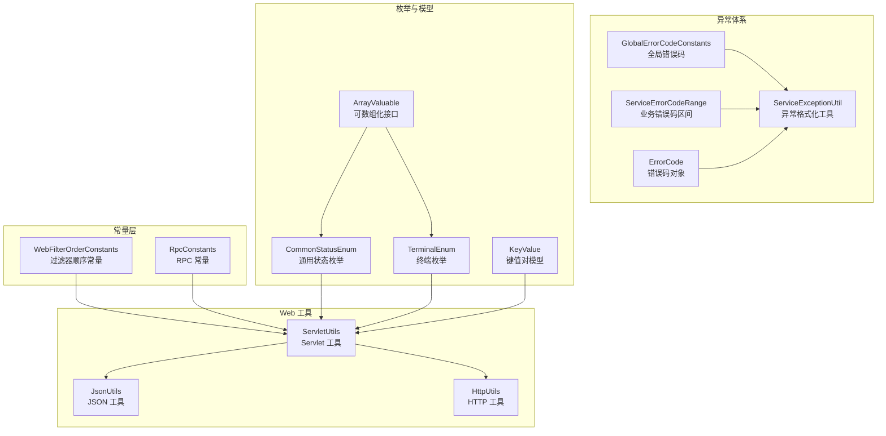
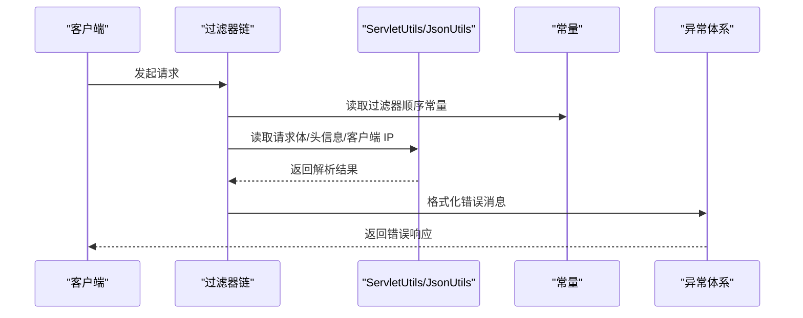
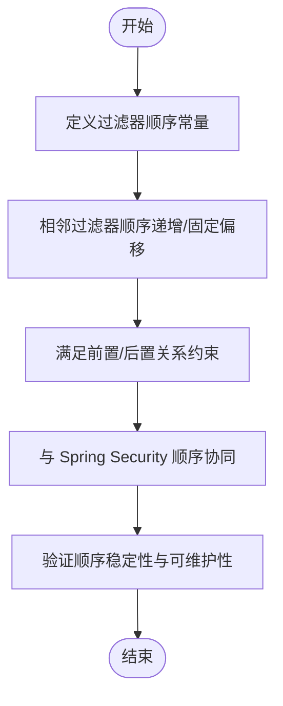
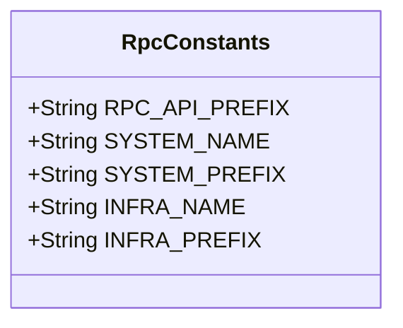
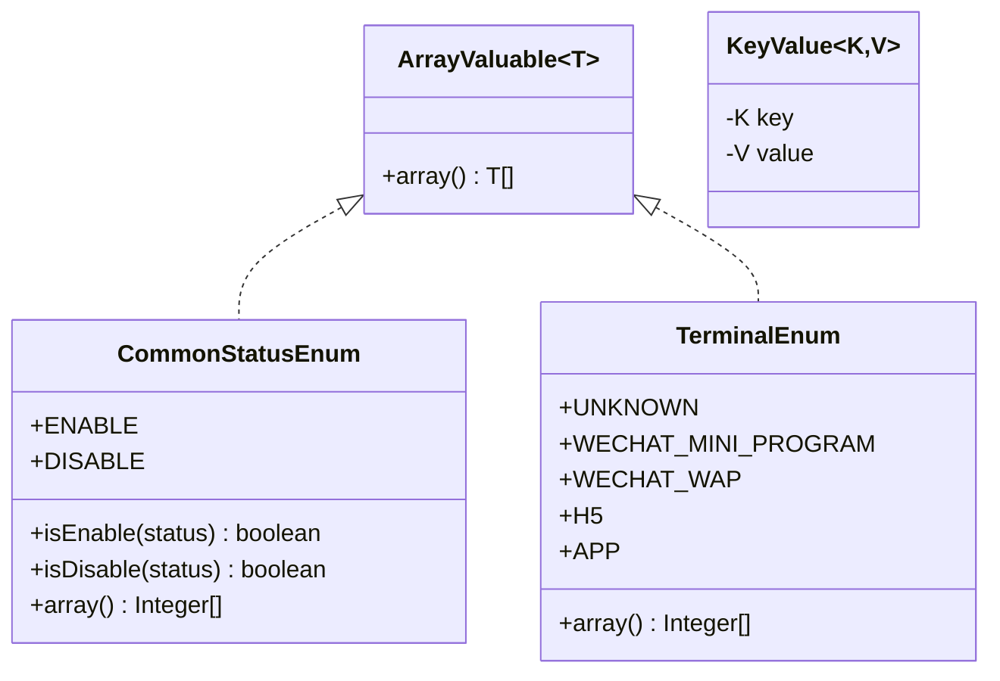
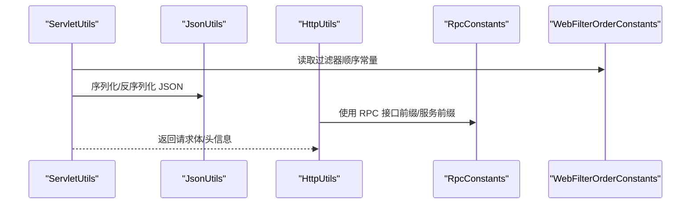
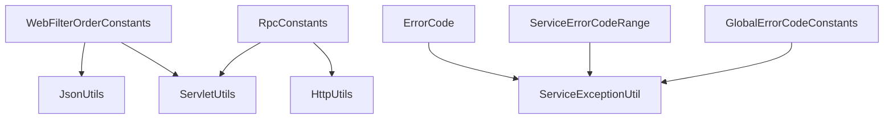

# 常量管理系统

<cite>
**本文档引用的文件**
- [WebFilterOrderConstants.java](file://pandora-framework/pandora-common/src/main/java/net/ittimeline/pandora/framework/common/constants/WebFilterOrderConstants.java)
- [RpcConstants.java](file://pandora-framework/pandora-common/src/main/java/net/ittimeline/pandora/framework/common/constants/RpcConstants.java)
- [GlobalErrorCodeConstants.java](file://pandora-framework/pandora-common/src/main/java/net/ittimeline/pandora/framework/common/exception/enums/GlobalErrorCodeConstants.java)
- [ServiceErrorCodeRange.java](file://pandora-framework/pandora-common/src/main/java/net/ittimeline/pandora/framework/common/exception/enums/ServiceErrorCodeRange.java)
- [ErrorCode.java](file://pandora-framework/pandora-common/src/main/java/net/ittimeline/pandora/framework/common/exception/ErrorCode.java)
- [ServiceExceptionUtil.java](file://pandora-framework/pandora-common/src/main/java/net/ittimeline/pandora/framework/common/exception/util/ServiceExceptionUtil.java)
- [CommonStatusEnum.java](file://pandora-framework/pandora-common/src/main/java/net/ittimeline/pandora/framework/common/enums/CommonStatusEnum.java)
- [TerminalEnum.java](file://pandora-framework/pandora-common/src/main/java/net/ittimeline/pandora/framework/common/enums/TerminalEnum.java)
- [ArrayValuable.java](file://pandora-framework/pandora-common/src/main/java/net/ittimeline/pandora/framework/common/core/ArrayValuable.java)
- [KeyValue.java](file://pandora-framework/pandora-common/src/main/java/net/ittimeline/pandora/framework/common/core/KeyValue.java)
- [ServletUtils.java](file://pandora-framework/pandora-common/src/main/java/net/ittimeline/pandora/framework/common/util/web/servlet/ServletUtils.java)
- [JsonUtils.java](file://pandora-framework/pandora-common/src/main/java/net/ittimeline/pandora/framework/common/util/web/json/JsonUtils.java)
- [HttpUtils.java](file://pandora-framework/pandora-common/src/main/java/net/ittimeline/pandora/framework/common/util/web/http/HttpUtils.java)
</cite>

## 目录
1. [简介](#简介)
2. [项目结构](#项目结构)
3. [核心组件](#核心组件)
4. [架构总览](#架构总览)
5. [详细组件分析](#详细组件分析)
6. [依赖分析](#依赖分析)
7. [性能考量](#性能考量)
8. [故障排查指南](#故障排查指南)
9. [结论](#结论)
10. [附录](#附录)

## 简介
本文件面向常量管理系统，重点围绕以下目标展开：
- 深入解释 WebFilterOrderConstants 中 Web 过滤器顺序常量的设计目的与配置方法，确保过滤器执行顺序的正确性与可维护性。
- 详细说明 RpcConstants 中 RPC 相关常量的定义与使用场景，包括服务调用前缀、服务名与前缀的约定，以及与系统配置的关联。
- 阐述常量管理的最佳实践，包括命名规范、分类组织与版本兼容性考虑。
- 提供常量扩展与自定义的指导原则，确保系统配置的一致性与可追踪性。

## 项目结构
常量管理主要位于公共模块的 constants 包中，同时配合异常体系、枚举与工具类形成统一的配置与使用生态。关键文件分布如下：
- constants：WebFilterOrderConstants、RpcConstants
- exception/enums：全局错误码与业务错误码区间
- exception/util：异常格式化工具
- enums：通用状态与终端枚举
- core：可数组化接口与键值对模型
- util/web：Servlet、JSON、HTTP 工具



图表来源
- [WebFilterOrderConstants.java:1-38](file://pandora-framework/pandora-common/src/main/java/net/ittimeline/pandora/framework/common/constants/WebFilterOrderConstants.java#L1-L38)
- [RpcConstants.java:1-42](file://pandora-framework/pandora-common/src/main/java/net/ittimeline/pandora/framework/common/constants/RpcConstants.java#L1-L42)
- [GlobalErrorCodeConstants.java:1-42](file://pandora-framework/pandora-common/src/main/java/net/ittimeline/pandora/framework/common/exception/enums/GlobalErrorCodeConstants.java#L1-L42)
- [ServiceErrorCodeRange.java:1-48](file://pandora-framework/pandora-common/src/main/java/net/ittimeline/pandora/framework/common/exception/enums/ServiceErrorCodeRange.java#L1-L48)
- [ErrorCode.java:1-33](file://pandora-framework/pandora-common/src/main/java/net/ittimeline/pandora/framework/common/exception/ErrorCode.java#L1-L33)
- [ServiceExceptionUtil.java:1-85](file://pandora-framework/pandora-common/src/main/java/net/ittimeline/pandora/framework/common/exception/util/ServiceExceptionUtil.java#L1-L85)
- [CommonStatusEnum.java:1-48](file://pandora-framework/pandora-common/src/main/java/net/ittimeline/pandora/framework/common/enums/CommonStatusEnum.java#L1-L48)
- [TerminalEnum.java:1-43](file://pandora-framework/pandora-common/src/main/java/net/ittimeline/pandora/framework/common/enums/TerminalEnum.java#L1-L43)
- [ArrayValuable.java:1-16](file://pandora-framework/pandora-common/src/main/java/net/ittimeline/pandora/framework/common/core/ArrayValuable.java#L1-L16)
- [KeyValue.java:1-25](file://pandora-framework/pandora-common/src/main/java/net/ittimeline/pandora/framework/common/core/KeyValue.java#L1-L25)
- [ServletUtils.java:1-105](file://pandora-framework/pandora-common/src/main/java/net/ittimeline/pandora/framework/common/util/web/servlet/ServletUtils.java#L1-L105)
- [JsonUtils.java:1-305](file://pandora-framework/pandora-common/src/main/java/net/ittimeline/pandora/framework/common/util/web/json/JsonUtils.java#L1-L305)
- [HttpUtils.java:1-204](file://pandora-framework/pandora-common/src/main/java/net/ittimeline/pandora/framework/common/util/web/http/HttpUtils.java#L1-L204)

章节来源
- [WebFilterOrderConstants.java:1-38](file://pandora-framework/pandora-common/src/main/java/net/ittimeline/pandora/framework/common/constants/WebFilterOrderConstants.java#L1-L38)
- [RpcConstants.java:1-42](file://pandora-framework/pandora-common/src/main/java/net/ittimeline/pandora/framework/common/constants/RpcConstants.java#L1-L42)

## 核心组件
本节聚焦两类核心常量组件及其职责边界与协作方式。

- WebFilterOrderConstants：定义 Web 过滤器的执行顺序常量，确保跨 starter 的一致性与可维护性。
- RpcConstants：定义 RPC 接口前缀、服务名与服务前缀，支撑跨模块的服务调用与路由。

章节来源
- [WebFilterOrderConstants.java:11-37](file://pandora-framework/pandora-common/src/main/java/net/ittimeline/pandora/framework/common/constants/WebFilterOrderConstants.java#L11-L37)
- [RpcConstants.java:12-41](file://pandora-framework/pandora-common/src/main/java/net/ittimeline/pandora/framework/common/constants/RpcConstants.java#L12-L41)

## 架构总览
常量系统与 Web 工具、异常体系、枚举与模型之间的交互关系如下：



图表来源
- [WebFilterOrderConstants.java:11-37](file://pandora-framework/pandora-common/src/main/java/net/ittimeline/pandora/framework/common/constants/WebFilterOrderConstants.java#L11-L37)
- [ServletUtils.java:65-95](file://pandora-framework/pandora-common/src/main/java/net/ittimeline/pandora/framework/common/util/web/servlet/ServletUtils.java#L65-L95)
- [JsonUtils.java:60-88](file://pandora-framework/pandora-common/src/main/java/net/ittimeline/pandora/framework/common/util/web/json/JsonUtils.java#L60-L88)
- [ServiceExceptionUtil.java:30-37](file://pandora-framework/pandora-common/src/main/java/net/ittimeline/pandora/framework/common/exception/util/ServiceExceptionUtil.java#L30-L37)

## 详细组件分析

### WebFilterOrderConstants 组件分析
设计目的与配置方法
- 设计目的：统一 Web 过滤器的执行顺序，避免不同 starter 或第三方库引入的过滤器破坏既定的处理流程（如跨域、请求体缓存、加密、日志、安全、租户上下文等）。
- 配置方法：通过整型常量定义各过滤器的顺序值，采用递增或固定偏移策略，确保相邻过滤器的相对顺序稳定且可预测。

关键点与约束
- 与 Spring Security 的默认顺序保持协同：文档注释明确指出 Spring Security 的默认顺序，避免冲突。
- 与特定过滤器的前后置关系：如租户上下文需在访问日志之前，XSS 过滤需在请求体缓存之后等，这些关系通过常量值的相对大小体现。
- 与常见过滤器的预留位置：如最小/最大值边界与中间预留位置，便于扩展而不影响既有顺序。



图表来源
- [WebFilterOrderConstants.java:11-37](file://pandora-framework/pandora-common/src/main/java/net/ittimeline/pandora/framework/common/constants/WebFilterOrderConstants.java#L11-L37)

章节来源
- [WebFilterOrderConstants.java:3-37](file://pandora-framework/pandora-common/src/main/java/net/ittimeline/pandora/framework/common/constants/WebFilterOrderConstants.java#L3-L37)

### RpcConstants 组件分析
定义与使用场景
- RPC 接口前缀：统一对外 RPC 接口的前缀，便于路由与网关聚合。
- 服务名与服务前缀：为 system 与 infra 服务分别定义服务名与服务前缀，确保跨模块调用的一致性与可追踪性。

与系统配置的关联
- 服务名需与应用配置中的服务名称保持一致，避免调用失败或路由错误。
- 服务前缀与接口前缀共同构成完整的 RPC 路由路径，便于统一管理与扩展。



图表来源
- [RpcConstants.java:12-41](file://pandora-framework/pandora-common/src/main/java/net/ittimeline/pandora/framework/common/constants/RpcConstants.java#L12-L41)

章节来源
- [RpcConstants.java:12-41](file://pandora-framework/pandora-common/src/main/java/net/ittimeline/pandora/framework/common/constants/RpcConstants.java#L12-L41)

### 异常常量与工具链
全局错误码与业务错误码区间
- 全局错误码：覆盖客户端错误（如 400、401、403 等）、服务端错误（如 500、501、502 等）与自定义错误（如 900、901、999），统一错误表达与响应。
- 业务错误码区间：采用 10 位编号，按“类型-系统-模块-错误码”分段，避免重复并支持模块内自增。

异常格式化工具
- 提供统一的错误消息格式化方法，支持占位符替换与日志记录，增强错误信息的可读性与可观测性。

```mermaid
classDiagram
class GlobalErrorCodeConstants {
+ErrorCode SUCCESS
+ErrorCode BAD_REQUEST
+ErrorCode UNAUTHORIZED
+ErrorCode FORBIDDEN
+ErrorCode NOT_FOUND
+ErrorCode METHOD_NOT_ALLOWED
+ErrorCode LOCKED
+ErrorCode TOO_MANY_REQUESTS
+ErrorCode INTERNAL_SERVER_ERROR
+ErrorCode NOT_IMPLEMENTED
+ErrorCode ERROR_CONFIGURATION
+ErrorCode REPEATED_REQUESTS
+ErrorCode DEMO_DENY
+ErrorCode UNKNOWN
}
class ServiceErrorCodeRange {
+[1-001-000-000 ~ 1-002-000-000) infra
+[1-002-000-000 ~ 1-003-000-000) system
+...
}
class ErrorCode {
-Integer code
-String msg
+ErrorCode(code, msg)
}
class ServiceExceptionUtil {
+exception(errorCode)
+exception(errorCode, params)
+invalidParamException(pattern, params)
+doFormat(code, pattern, params) String
}
GlobalErrorCodeConstants --> ErrorCode : "构造"
ServiceErrorCodeRange --> ErrorCode : "区间约束"
ServiceExceptionUtil --> ErrorCode : "使用"
```

图表来源
- [GlobalErrorCodeConstants.java:16-41](file://pandora-framework/pandora-common/src/main/java/net/ittimeline/pandora/framework/common/exception/enums/GlobalErrorCodeConstants.java#L16-L41)
- [ServiceErrorCodeRange.java:31-47](file://pandora-framework/pandora-common/src/main/java/net/ittimeline/pandora/framework/common/exception/enums/ServiceErrorCodeRange.java#L31-L47)
- [ErrorCode.java:18-32](file://pandora-framework/pandora-common/src/main/java/net/ittimeline/pandora/framework/common/exception/ErrorCode.java#L18-L32)
- [ServiceExceptionUtil.java:22-37](file://pandora-framework/pandora-common/src/main/java/net/ittimeline/pandora/framework/common/exception/util/ServiceExceptionUtil.java#L22-L37)

章节来源
- [GlobalErrorCodeConstants.java:16-41](file://pandora-framework/pandora-common/src/main/java/net/ittimeline/pandora/framework/common/exception/enums/GlobalErrorCodeConstants.java#L16-L41)
- [ServiceErrorCodeRange.java:31-47](file://pandora-framework/pandora-common/src/main/java/net/ittimeline/pandora/framework/common/exception/enums/ServiceErrorCodeRange.java#L31-L47)
- [ErrorCode.java:18-32](file://pandora-framework/pandora-common/src/main/java/net/ittimeline/pandora/framework/common/exception/ErrorCode.java#L18-L32)
- [ServiceExceptionUtil.java:30-82](file://pandora-framework/pandora-common/src/main/java/net/ittimeline/pandora/framework/common/exception/util/ServiceExceptionUtil.java#L30-L82)

### 枚举与模型
通用状态与终端枚举
- 通用状态枚举：提供启用/禁用两种状态，支持数组化输出与便捷判断。
- 终端枚举：覆盖未知、微信小程序、微信公众号、H5、App 等终端类型，支持数组化输出与便捷判断。

可数组化接口与键值对模型
- 可数组化接口：为枚举提供统一的数组化能力，便于批量处理与校验。
- 键值对模型：提供通用的键值对封装，便于配置与传输。



图表来源
- [ArrayValuable.java:10-15](file://pandora-framework/pandora-common/src/main/java/net/ittimeline/pandora/framework/common/core/ArrayValuable.java#L10-L15)
- [CommonStatusEnum.java:18-47](file://pandora-framework/pandora-common/src/main/java/net/ittimeline/pandora/framework/common/enums/CommonStatusEnum.java#L18-L47)
- [TerminalEnum.java:18-42](file://pandora-framework/pandora-common/src/main/java/net/ittimeline/pandora/framework/common/enums/TerminalEnum.java#L18-L42)
- [KeyValue.java:19-24](file://pandora-framework/pandora-common/src/main/java/net/ittimeline/pandora/framework/common/core/KeyValue.java#L19-L24)

章节来源
- [CommonStatusEnum.java:18-47](file://pandora-framework/pandora-common/src/main/java/net/ittimeline/pandora/framework/common/enums/CommonStatusEnum.java#L18-L47)
- [TerminalEnum.java:18-42](file://pandora-framework/pandora-common/src/main/java/net/ittimeline/pandora/framework/common/enums/TerminalEnum.java#L18-L42)
- [ArrayValuable.java:10-15](file://pandora-framework/pandora-common/src/main/java/net/ittimeline/pandora/framework/common/core/ArrayValuable.java#L10-L15)
- [KeyValue.java:19-24](file://pandora-framework/pandora-common/src/main/java/net/ittimeline/pandora/framework/common/core/KeyValue.java#L19-L24)

### Web 工具与常量的协同
ServletUtils、JsonUtils、HttpUtils 与常量的协作
- ServletUtils：提供请求体读取、客户端 IP 获取、JSON 请求识别等功能，常量用于控制过滤器行为（如请求体缓存、日志记录等）。
- JsonUtils：提供 JSON 序列化与反序列化能力，常量用于统一接口前缀与服务前缀，便于路由与聚合。
- HttpUtils：提供 URL 编解码、URL 拼接、Basic 认证提取等能力，常量用于统一接口前缀与服务前缀，便于跨模块调用。



图表来源
- [ServletUtils.java:65-95](file://pandora-framework/pandora-common/src/main/java/net/ittimeline/pandora/framework/common/util/web/servlet/ServletUtils.java#L65-L95)
- [JsonUtils.java:60-88](file://pandora-framework/pandora-common/src/main/java/net/ittimeline/pandora/framework/common/util/web/json/JsonUtils.java#L60-L88)
- [HttpUtils.java:177-201](file://pandora-framework/pandora-common/src/main/java/net/ittimeline/pandora/framework/common/util/web/http/HttpUtils.java#L177-L201)
- [RpcConstants.java:16-41](file://pandora-framework/pandora-common/src/main/java/net/ittimeline/pandora/framework/common/constants/RpcConstants.java#L16-L41)
- [WebFilterOrderConstants.java:11-37](file://pandora-framework/pandora-common/src/main/java/net/ittimeline/pandora/framework/common/constants/WebFilterOrderConstants.java#L11-L37)

章节来源
- [ServletUtils.java:65-95](file://pandora-framework/pandora-common/src/main/java/net/ittimeline/pandora/framework/common/util/web/servlet/ServletUtils.java#L65-L95)
- [JsonUtils.java:60-88](file://pandora-framework/pandora-common/src/main/java/net/ittimeline/pandora/framework/common/util/web/json/JsonUtils.java#L60-L88)
- [HttpUtils.java:177-201](file://pandora-framework/pandora-common/src/main/java/net/ittimeline/pandora/framework/common/util/web/http/HttpUtils.java#L177-L201)
- [RpcConstants.java:16-41](file://pandora-framework/pandora-common/src/main/java/net/ittimeline/pandora/framework/common/constants/RpcConstants.java#L16-L41)
- [WebFilterOrderConstants.java:11-37](file://pandora-framework/pandora-common/src/main/java/net/ittimeline/pandora/framework/common/constants/WebFilterOrderConstants.java#L11-L37)

## 依赖分析
常量系统与其他模块的耦合关系
- WebFilterOrderConstants 与 Web 工具：通过过滤器顺序常量影响请求处理链路，间接影响 JSON 解析、请求体读取等行为。
- RpcConstants 与 Web 工具：通过接口前缀与服务前缀影响 HTTP 请求构建与路由，与 HttpUtils、ServletUtils 协作。
- 异常体系：全局错误码与业务错误码区间为异常处理提供统一的错误标识，ServiceExceptionUtil 提供格式化能力。



图表来源
- [WebFilterOrderConstants.java:11-37](file://pandora-framework/pandora-common/src/main/java/net/ittimeline/pandora/framework/common/constants/WebFilterOrderConstants.java#L11-L37)
- [RpcConstants.java:16-41](file://pandora-framework/pandora-common/src/main/java/net/ittimeline/pandora/framework/common/constants/RpcConstants.java#L16-L41)
- [GlobalErrorCodeConstants.java:16-41](file://pandora-framework/pandora-common/src/main/java/net/ittimeline/pandora/framework/common/exception/enums/GlobalErrorCodeConstants.java#L16-L41)
- [ServiceErrorCodeRange.java:31-47](file://pandora-framework/pandora-common/src/main/java/net/ittimeline/pandora/framework/common/exception/enums/ServiceErrorCodeRange.java#L31-L47)
- [ErrorCode.java:18-32](file://pandora-framework/pandora-common/src/main/java/net/ittimeline/pandora/framework/common/exception/ErrorCode.java#L18-L32)
- [ServiceExceptionUtil.java:30-37](file://pandora-framework/pandora-common/src/main/java/net/ittimeline/pandora/framework/common/exception/util/ServiceExceptionUtil.java#L30-L37)
- [ServletUtils.java:65-95](file://pandora-framework/pandora-common/src/main/java/net/ittimeline/pandora/framework/common/util/web/servlet/ServletUtils.java#L65-L95)
- [JsonUtils.java:60-88](file://pandora-framework/pandora-common/src/main/java/net/ittimeline/pandora/framework/common/util/web/json/JsonUtils.java#L60-L88)
- [HttpUtils.java:177-201](file://pandora-framework/pandora-common/src/main/java/net/ittimeline/pandora/framework/common/util/web/http/HttpUtils.java#L177-L201)

章节来源
- [WebFilterOrderConstants.java:11-37](file://pandora-framework/pandora-common/src/main/java/net/ittimeline/pandora/framework/common/constants/WebFilterOrderConstants.java#L11-L37)
- [RpcConstants.java:16-41](file://pandora-framework/pandora-common/src/main/java/net/ittimeline/pandora/framework/common/constants/RpcConstants.java#L16-L41)
- [ServiceExceptionUtil.java:30-37](file://pandora-framework/pandora-common/src/main/java/net/ittimeline/pandora/framework/common/exception/util/ServiceExceptionUtil.java#L30-L37)

## 性能考量
- 常量访问成本极低：常量为编译时常量，访问开销几乎为零。
- 过滤器顺序优化：通过合理的顺序常量配置，减少重复读取与重复处理，提升整体吞吐。
- JSON 处理优化：结合请求体缓存与 JSON 工具的高效序列化/反序列化，降低 CPU 与内存压力。
- 错误格式化优化：使用预分配容量与占位符替换，减少字符串拼接与异常栈开销。

## 故障排查指南
常见问题与定位思路
- 过滤器顺序冲突：若出现鉴权、日志或安全相关异常，检查 WebFilterOrderConstants 中相关常量的相对大小与注释约束。
- RPC 调用失败：核对 RpcConstants 中的服务名与前缀是否与配置一致，确认 HttpUtils/ServletUtils 的使用是否正确。
- 错误信息格式异常：检查 ServiceExceptionUtil 的格式化方法与占位符数量是否匹配，关注日志中的参数过多/过少提示。

章节来源
- [WebFilterOrderConstants.java:22-36](file://pandora-framework/pandora-common/src/main/java/net/ittimeline/pandora/framework/common/constants/WebFilterOrderConstants.java#L22-L36)
- [RpcConstants.java:16-41](file://pandora-framework/pandora-common/src/main/java/net/ittimeline/pandora/framework/common/constants/RpcConstants.java#L16-L41)
- [ServiceExceptionUtil.java:49-82](file://pandora-framework/pandora-common/src/main/java/net/ittimeline/pandora/framework/common/exception/util/ServiceExceptionUtil.java#L49-L82)

## 结论
常量管理系统通过 WebFilterOrderConstants 与 RpcConstants 两大核心常量，为过滤器顺序与 RPC 调用提供了稳定、可维护的配置基础。配合异常体系、枚举与工具类，形成从配置到执行再到可观测性的完整闭环。遵循本文档的最佳实践与扩展指导，可在保证一致性与可追踪性的前提下，灵活扩展新的常量与配置。

## 附录
最佳实践与扩展指导
- 命名规范
  - 常量采用全大写与下划线组合，语义清晰，避免缩写歧义。
  - 过滤器顺序常量使用具有描述性的前缀（如 CORS、TRACE、ENV_TAG、REQUEST_BODY_CACHE、API_ENCRYPT、API_ACCESS_LOG、XSS、TENANT_CONTEXT、TENANT_SECURITY、FLOWABLE、DEMO）。
  - RPC 常量使用语义化的前缀（如 RPC_API_PREFIX、SYSTEM_NAME、SYSTEM_PREFIX、INFRA_NAME、INFRA_PREFIX）。
- 分类组织
  - 按功能域分类：Web 过滤器顺序、RPC 常量、错误码、枚举与模型等。
  - 按依赖关系组织：常量 -> 工具/服务 -> 上层使用方。
- 版本兼容性
  - 新增常量时，优先选择预留位置或边界值，避免破坏既有顺序。
  - 修改现有常量值时，必须同步更新所有使用方，并进行回归测试。
- 扩展与自定义
  - 扩展过滤器顺序：在预留位置插入新常量，确保相邻常量的相对顺序稳定。
  - 扩展 RPC 常量：新增服务名与前缀，确保与配置保持一致。
  - 异常常量：遵循全局错误码与业务错误码区间的命名与分段规则，避免冲突。
- 可追踪性
  - 为每个常量添加必要的注释，说明用途、约束与依赖关系。
  - 在变更日志中记录常量的修改原因与影响范围，便于审计与回溯。