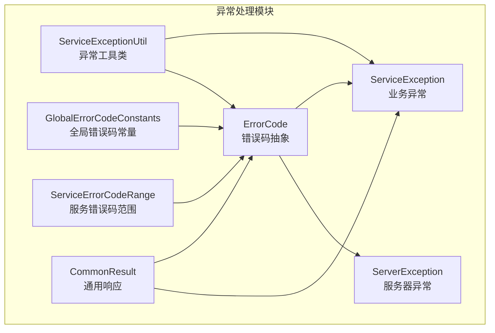
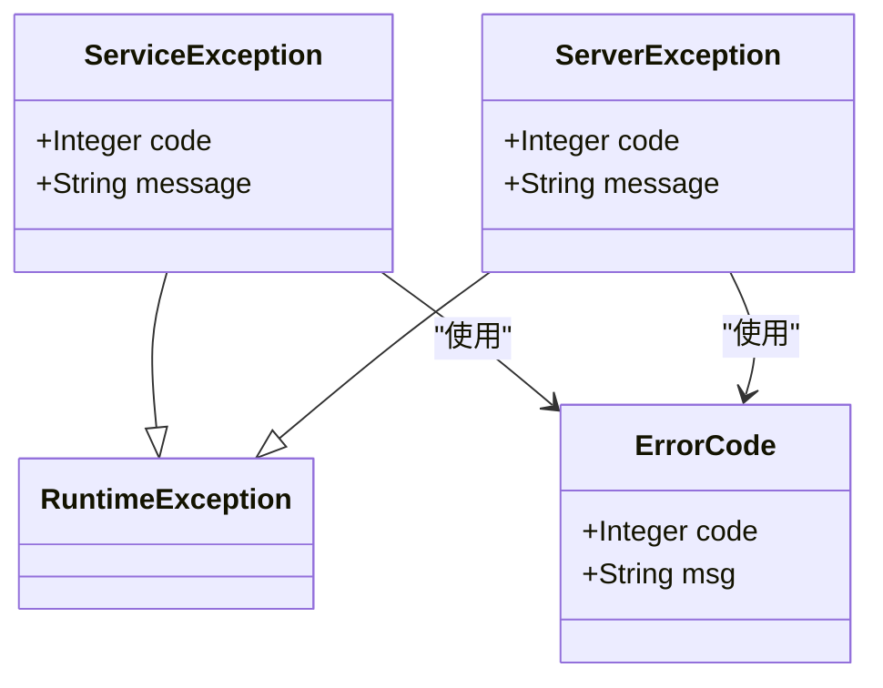
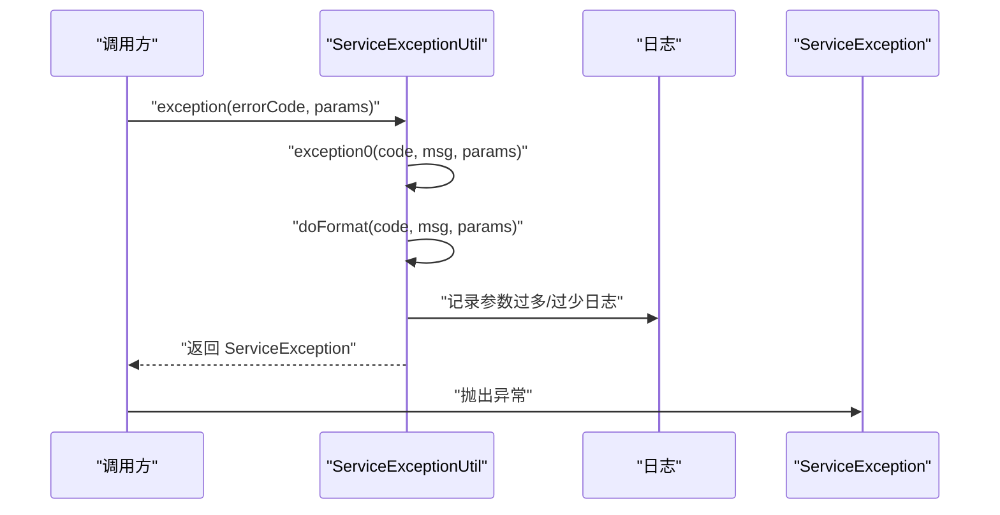
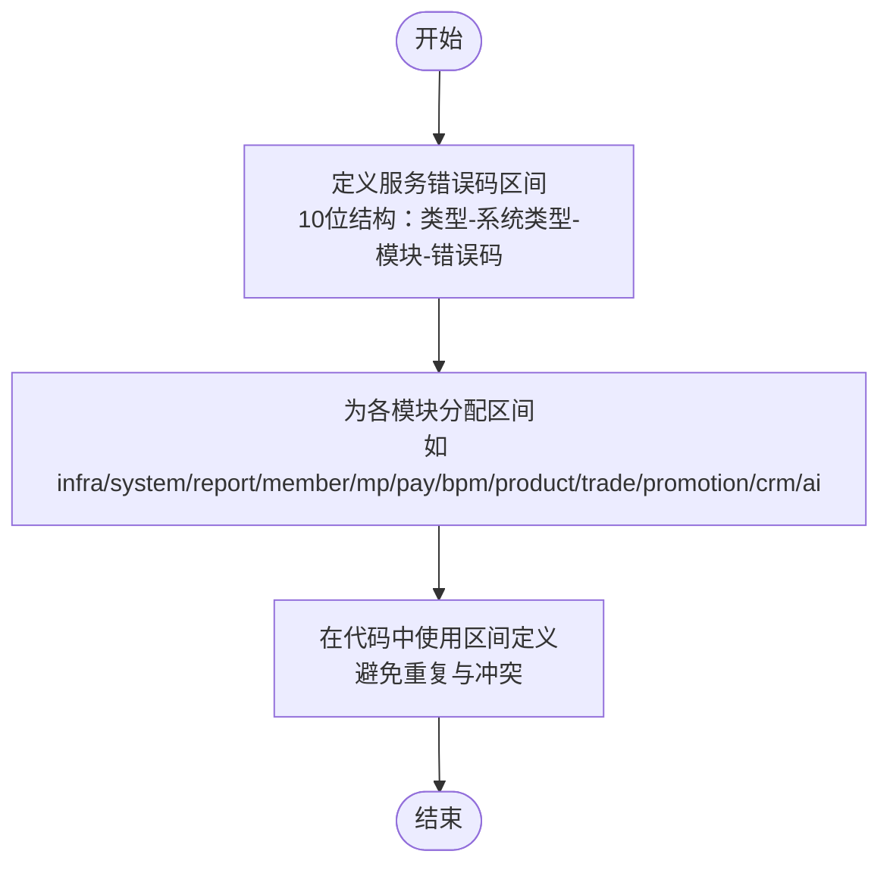
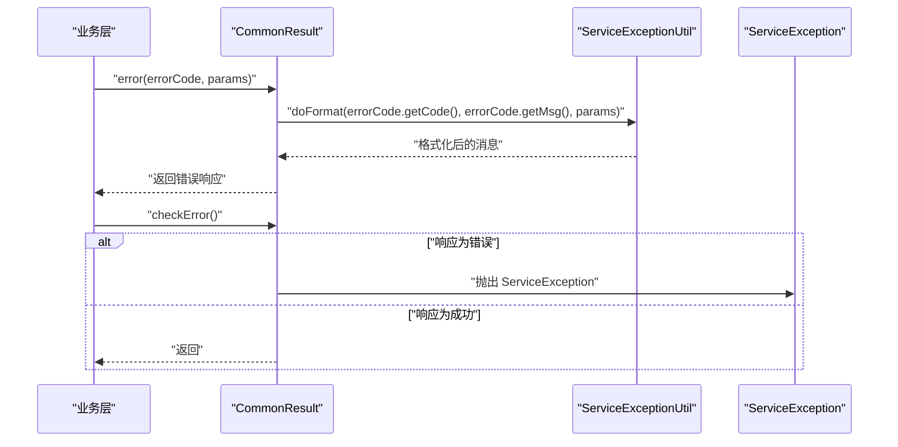
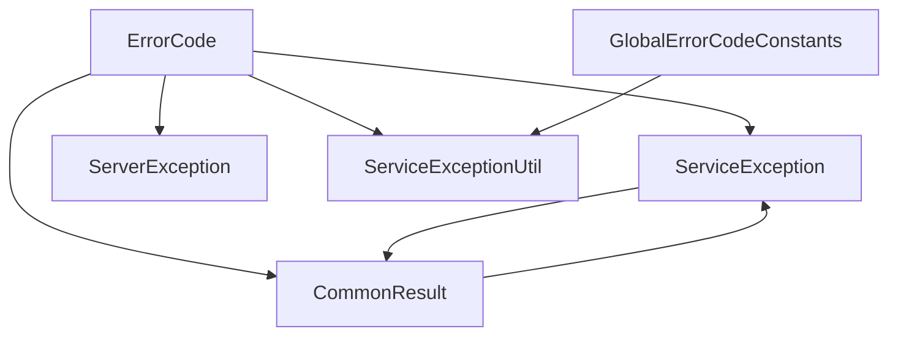

# 异常处理系统

<cite>
**本文档引用的文件**
- [ErrorCode.java](file://pandora-framework/pandora-common/src/main/java/net/ittimeline/pandora/framework/common/exception/ErrorCode.java)
- [ServiceException.java](file://pandora-framework/pandora-common/src/main/java/net/ittimeline/pandora/framework/common/exception/ServiceException.java)
- [ServerException.java](file://pandora-framework/pandora-common/src/main/java/net/ittimeline/pandora/framework/common/exception/ServerException.java)
- [ServiceExceptionUtil.java](file://pandora-framework/pandora-common/src/main/java/net/ittimeline/pandora/framework/common/exception/util/ServiceExceptionUtil.java)
- [GlobalErrorCodeConstants.java](file://pandora-framework/pandora-common/src/main/java/net/ittimeline/pandora/framework/common/exception/enums/GlobalErrorCodeConstants.java)
- [ServiceErrorCodeRange.java](file://pandora-framework/pandora-common/src/main/java/net/ittimeline/pandora/framework/common/exception/enums/ServiceErrorCodeRange.java)
- [CommonResult.java](file://pandora-framework/pandora-common/src/main/java/net/ittimeline/pandora/framework/common/pojo/CommonResult.java)
</cite>

## 目录
1. [简介](#简介)
2. [项目结构](#项目结构)
3. [核心组件](#核心组件)
4. [架构总览](#架构总览)
5. [详细组件分析](#详细组件分析)
6. [依赖关系分析](#依赖关系分析)
7. [性能考虑](#性能考虑)
8. [故障排查指南](#故障排查指南)
9. [结论](#结论)
10. [附录](#附录)

## 简介
本异常处理系统旨在提供统一、可扩展、可维护的异常与错误码管理方案。通过 ErrorCode 抽象、ServiceException 业务异常、ServerException 服务器异常的分层设计，结合 ServiceExceptionUtil 工具类的参数化消息格式化能力，以及 GlobalErrorCodeConstants 全局错误码常量与 ServiceErrorCodeRange 服务错误码范围管理，形成一套标准化的异常处理流程。系统还提供了与通用响应对象 CommonResult 的无缝集成，确保异常信息能够被一致地传递给客户端或上层调用者。

## 项目结构
异常处理系统位于框架模块的公共包中，采用按职责分层的组织方式：
- exception：异常类型定义（ErrorCode、ServiceException、ServerException）
- exception/enums：错误码常量与范围定义（GlobalErrorCodeConstants、ServiceErrorCodeRange）
- exception/util：异常处理工具（ServiceExceptionUtil）
- pojo：通用响应对象（CommonResult），用于承载错误码与消息



图表来源
- [ErrorCode.java:1-33](file://pandora-framework/pandora-common/src/main/java/net/ittimeline/pandora/framework/common/exception/ErrorCode.java#L1-L33)
- [ServiceException.java:1-64](file://pandora-framework/pandora-common/src/main/java/net/ittimeline/pandora/framework/common/exception/ServiceException.java#L1-L64)
- [ServerException.java:1-65](file://pandora-framework/pandora-common/src/main/java/net/ittimeline/pandora/framework/common/exception/ServerException.java#L1-L65)
- [ServiceExceptionUtil.java:1-85](file://pandora-framework/pandora-common/src/main/java/net/ittimeline/pandora/framework/common/exception/util/ServiceExceptionUtil.java#L1-L85)
- [GlobalErrorCodeConstants.java:1-42](file://pandora-framework/pandora-common/src/main/java/net/ittimeline/pandora/framework/common/exception/enums/GlobalErrorCodeConstants.java#L1-L42)
- [ServiceErrorCodeRange.java:1-48](file://pandora-framework/pandora-common/src/main/java/net/ittimeline/pandora/framework/common/exception/enums/ServiceErrorCodeRange.java#L1-L48)
- [CommonResult.java:1-123](file://pandora-framework/pandora-common/src/main/java/net/ittimeline/pandora/framework/common/pojo/CommonResult.java#L1-L123)

章节来源
- [ErrorCode.java:1-33](file://pandora-framework/pandora-common/src/main/java/net/ittimeline/pandora/framework/common/exception/ErrorCode.java#L1-L33)
- [ServiceException.java:1-64](file://pandora-framework/pandora-common/src/main/java/net/ittimeline/pandora/framework/common/exception/ServiceException.java#L1-L64)
- [ServerException.java:1-65](file://pandora-framework/pandora-common/src/main/java/net/ittimeline/pandora/framework/common/exception/ServerException.java#L1-L65)
- [ServiceExceptionUtil.java:1-85](file://pandora-framework/pandora-common/src/main/java/net/ittimeline/pandora/framework/common/exception/util/ServiceExceptionUtil.java#L1-L85)
- [GlobalErrorCodeConstants.java:1-42](file://pandora-framework/pandora-common/src/main/java/net/ittimeline/pandora/framework/common/exception/enums/GlobalErrorCodeConstants.java#L1-L42)
- [ServiceErrorCodeRange.java:1-48](file://pandora-framework/pandora-common/src/main/java/net/ittimeline/pandora/framework/common/exception/enums/ServiceErrorCodeRange.java#L1-L48)
- [CommonResult.java:1-123](file://pandora-framework/pandora-common/src/main/java/net/ittimeline/pandora/framework/common/pojo/CommonResult.java#L1-L123)

## 核心组件
- ErrorCode：统一的错误码对象，包含 code 与 msg 字段，用于承载全局或业务错误码及其提示信息。
- ServiceException：业务异常类型，继承自 RuntimeException，携带业务错误码与消息，便于在业务层直接抛出。
- ServerException：服务器异常类型，同样继承自 RuntimeException，用于系统级或不可预期的异常场景。
- ServiceExceptionUtil：异常工具类，提供基于 {} 占位符的消息格式化能力，避免 String.format 的参数不匹配风险，并记录日志。
- GlobalErrorCodeConstants：全局错误码常量接口，覆盖客户端错误（400-429）、服务端错误（500-502）与自定义错误（900-901）等区间。
- ServiceErrorCodeRange：服务错误码范围定义，采用 10 位错误码结构，划分类型、系统类型、模块与错误码段，避免冲突并支持模块化扩展。
- CommonResult：通用响应对象，与异常体系集成，支持从错误码生成响应、检查错误并抛出 ServiceException，以及将异常转换为响应。

章节来源
- [ErrorCode.java:17-32](file://pandora-framework/pandora-common/src/main/java/net/ittimeline/pandora/framework/common/exception/ErrorCode.java#L17-L32)
- [ServiceException.java:13-63](file://pandora-framework/pandora-common/src/main/java/net/ittimeline/pandora/framework/common/exception/ServiceException.java#L13-L63)
- [ServerException.java:14-64](file://pandora-framework/pandora-common/src/main/java/net/ittimeline/pandora/framework/common/exception/ServerException.java#L14-L64)
- [ServiceExceptionUtil.java:18-84](file://pandora-framework/pandora-common/src/main/java/net/ittimeline/pandora/framework/common/exception/util/ServiceExceptionUtil.java#L18-L84)
- [GlobalErrorCodeConstants.java:16-41](file://pandora-framework/pandora-common/src/main/java/net/ittimeline/pandora/framework/common/exception/enums/GlobalErrorCodeConstants.java#L16-L41)
- [ServiceErrorCodeRange.java:31-47](file://pandora-framework/pandora-common/src/main/java/net/ittimeline/pandora/framework/common/exception/enums/ServiceErrorCodeRange.java#L31-L47)
- [CommonResult.java:21-122](file://pandora-framework/pandora-common/src/main/java/net/ittimeline/pandora/framework/common/pojo/CommonResult.java#L21-L122)

## 架构总览
异常处理系统采用“错误码抽象 + 异常类型分层 + 工具类格式化 + 响应集成”的架构设计，确保异常信息的一致性与可维护性。

```mermaid
classDiagram
class ErrorCode {
+Integer code
+String msg
+ErrorCode(code, message)
}
class ServiceException {
+Integer code
+String message
+ServiceException()
+ServiceException(errorCode)
+ServiceException(code, message)
+getCode() Integer
+setCode(code) ServiceException
+getMessage() String
+setMessage(message) ServiceException
}
class ServerException {
+Integer code
+String message
+ServerException()
+ServerException(errorCode)
+ServerException(code, message)
+getCode() Integer
+setCode(code) ServerException
+getMessage() String
+setMessage(message) ServerException
}
class ServiceExceptionUtil {
+exception(errorCode) ServiceException
+exception(errorCode, params) ServiceException
+exception0(code, messagePattern, params) ServiceException
+invalidParamException(messagePattern, params) ServiceException
+doFormat(code, messagePattern, params) String
}
class GlobalErrorCodeConstants {
<<interface>>
+SUCCESS
+BAD_REQUEST
+UNAUTHORIZED
+FORBIDDEN
+NOT_FOUND
+METHOD_NOT_ALLOWED
+LOCKED
+TOO_MANY_REQUESTS
+INTERNAL_SERVER_ERROR
+NOT_IMPLEMENTED
+ERROR_CONFIGURATION
+REPEATED_REQUESTS
+DEMO_DENY
+UNKNOWN
}
class ServiceErrorCodeRange {
<<class>>
+[1-001-000-000 ~ 1-002-000-000)
+[1-002-000-000 ~ 1-003-000-000)
+[1-003-000-000 ~ 1-004-000-000)
+...
}
class CommonResult {
+Integer code
+String msg
+T data
+success(data) CommonResult
+error(code, message) CommonResult
+error(errorCode) CommonResult
+error(errorCode, params) CommonResult
+checkError() void
+getCheckedData() T
+isSuccess(code) boolean
+isSuccess() boolean
+isError() boolean
+error(serviceException) CommonResult
}
ServiceException --> ErrorCode : "使用"
ServerException --> ErrorCode : "使用"
ServiceExceptionUtil --> ErrorCode : "使用"
ServiceExceptionUtil --> GlobalErrorCodeConstants : "使用"
CommonResult --> ErrorCode : "使用"
CommonResult --> ServiceException : "抛出"
```

图表来源
- [ErrorCode.java:17-32](file://pandora-framework/pandora-common/src/main/java/net/ittimeline/pandora/framework/common/exception/ErrorCode.java#L17-L32)
- [ServiceException.java:13-63](file://pandora-framework/pandora-common/src/main/java/net/ittimeline/pandora/framework/common/exception/ServiceException.java#L13-L63)
- [ServerException.java:14-64](file://pandora-framework/pandora-common/src/main/java/net/ittimeline/pandora/framework/common/exception/ServerException.java#L14-L64)
- [ServiceExceptionUtil.java:18-84](file://pandora-framework/pandora-common/src/main/java/net/ittimeline/pandora/framework/common/exception/util/ServiceExceptionUtil.java#L18-L84)
- [GlobalErrorCodeConstants.java:16-41](file://pandora-framework/pandora-common/src/main/java/net/ittimeline/pandora/framework/common/exception/enums/GlobalErrorCodeConstants.java#L16-L41)
- [ServiceErrorCodeRange.java:31-47](file://pandora-framework/pandora-common/src/main/java/net/ittimeline/pandora/framework/common/exception/enums/ServiceErrorCodeRange.java#L31-L47)
- [CommonResult.java:21-122](file://pandora-framework/pandora-common/src/main/java/net/ittimeline/pandora/framework/common/pojo/CommonResult.java#L21-L122)

## 详细组件分析

### 错误码抽象与分层设计
- ErrorCode：提供统一的错误码载体，包含 code 与 msg，支持全局错误码与业务错误码的抽象。
- ServiceException：业务异常，携带业务错误码与消息，便于在业务层直接抛出，避免将业务错误混同于系统异常。
- ServerException：服务器异常，用于系统级或不可预期的异常场景，通常映射到全局错误码。



图表来源
- [ErrorCode.java:17-32](file://pandora-framework/pandora-common/src/main/java/net/ittimeline/pandora/framework/common/exception/ErrorCode.java#L17-L32)
- [ServiceException.java:13-63](file://pandora-framework/pandora-common/src/main/java/net/ittimeline/pandora/framework/common/exception/ServiceException.java#L13-L63)
- [ServerException.java:14-64](file://pandora-framework/pandora-common/src/main/java/net/ittimeline/pandora/framework/common/exception/ServerException.java#L14-L64)

章节来源
- [ErrorCode.java:17-32](file://pandora-framework/pandora-common/src/main/java/net/ittimeline/pandora/framework/common/exception/ErrorCode.java#L17-L32)
- [ServiceException.java:13-63](file://pandora-framework/pandora-common/src/main/java/net/ittimeline/pandora/framework/common/exception/ServiceException.java#L13-L63)
- [ServerException.java:14-64](file://pandora-framework/pandora-common/src/main/java/net/ittimeline/pandora/framework/common/exception/ServerException.java#L14-L64)

### ServiceExceptionUtil 工具类
- 设计目标：提供安全的消息格式化，避免 String.format 的参数不匹配问题；统一异常信息的生成与日志记录。
- 关键能力：
  - exception(errorCode) 与 exception(errorCode, params)：根据错误码与参数生成 ServiceException。
  - exception0(code, messagePattern, params)：内部格式化并构造 ServiceException。
  - invalidParamException(messagePattern, params)：快速生成“请求参数不正确”的业务异常。
  - doFormat(code, messagePattern, params)：基于 {} 占位符的安全格式化，记录参数过多或过少的日志。



图表来源
- [ServiceExceptionUtil.java:22-37](file://pandora-framework/pandora-common/src/main/java/net/ittimeline/pandora/framework/common/exception/util/ServiceExceptionUtil.java#L22-L37)
- [ServiceExceptionUtil.java:30-33](file://pandora-framework/pandora-common/src/main/java/net/ittimeline/pandora/framework/common/exception/util/ServiceExceptionUtil.java#L30-L33)
- [ServiceExceptionUtil.java:49-82](file://pandora-framework/pandora-common/src/main/java/net/ittimeline/pandora/framework/common/exception/util/ServiceExceptionUtil.java#L49-L82)

章节来源
- [ServiceExceptionUtil.java:18-84](file://pandora-framework/pandora-common/src/main/java/net/ittimeline/pandora/framework/common/exception/util/ServiceExceptionUtil.java#L18-L84)

### 全局错误码常量与服务错误码范围
- GlobalErrorCodeConstants：定义全局错误码常量，覆盖客户端错误（400-429）、服务端错误（500-502）与自定义错误（900-901），并以 HTTP 状态码为参考，保持语义一致性。
- ServiceErrorCodeRange：定义服务错误码的区间规划，采用 10 位结构，分为类型、系统类型、模块与错误码段，确保各模块错误码不冲突且具备扩展性。



图表来源
- [ServiceErrorCodeRange.java:31-47](file://pandora-framework/pandora-common/src/main/java/net/ittimeline/pandora/framework/common/exception/enums/ServiceErrorCodeRange.java#L31-L47)
- [GlobalErrorCodeConstants.java:16-41](file://pandora-framework/pandora-common/src/main/java/net/ittimeline/pandora/framework/common/exception/enums/GlobalErrorCodeConstants.java#L16-L41)

章节来源
- [GlobalErrorCodeConstants.java:16-41](file://pandora-framework/pandora-common/src/main/java/net/ittimeline/pandora/framework/common/exception/enums/GlobalErrorCodeConstants.java#L16-L41)
- [ServiceErrorCodeRange.java:31-47](file://pandora-framework/pandora-common/src/main/java/net/ittimeline/pandora/framework/common/exception/enums/ServiceErrorCodeRange.java#L31-L47)

### 与通用响应对象的集成
- CommonResult 提供统一的响应结构，包含 code、msg、data，并与异常体系紧密集成：
  - error(errorCode, params)：根据错误码与参数生成带格式化消息的错误响应。
  - checkError()：若响应为错误，抛出 ServiceException，便于上层统一捕获。
  - getCheckedData()：若响应为错误，抛出 ServiceException；否则返回 data。
  - error(ServiceException)：将异常转换为响应。



图表来源
- [CommonResult.java:50-68](file://pandora-framework/pandora-common/src/main/java/net/ittimeline/pandora/framework/common/pojo/CommonResult.java#L50-L68)
- [CommonResult.java:96-117](file://pandora-framework/pandora-common/src/main/java/net/ittimeline/pandora/framework/common/pojo/CommonResult.java#L96-L117)
- [ServiceExceptionUtil.java:49-82](file://pandora-framework/pandora-common/src/main/java/net/ittimeline/pandora/framework/common/exception/util/ServiceExceptionUtil.java#L49-L82)

章节来源
- [CommonResult.java:21-122](file://pandora-framework/pandora-common/src/main/java/net/ittimeline/pandora/framework/common/pojo/CommonResult.java#L21-L122)

## 依赖关系分析
- ServiceException 与 ServerException 依赖 ErrorCode 以携带错误码与消息。
- ServiceExceptionUtil 依赖 GlobalErrorCodeConstants 与 ErrorCode，用于生成与格式化异常。
- CommonResult 依赖 ErrorCode、ServiceExceptionUtil 与 GlobalErrorCodeConstants，用于构建统一响应与异常转换。
- ServiceErrorCodeRange 仅作为区间规划的声明，不直接参与运行时依赖。



图表来源
- [ErrorCode.java:17-32](file://pandora-framework/pandora-common/src/main/java/net/ittimeline/pandora/framework/common/exception/ErrorCode.java#L17-L32)
- [ServiceException.java:13-63](file://pandora-framework/pandora-common/src/main/java/net/ittimeline/pandora/framework/common/exception/ServiceException.java#L13-L63)
- [ServerException.java:14-64](file://pandora-framework/pandora-common/src/main/java/net/ittimeline/pandora/framework/common/exception/ServerException.java#L14-L64)
- [ServiceExceptionUtil.java:18-84](file://pandora-framework/pandora-common/src/main/java/net/ittimeline/pandora/framework/common/exception/util/ServiceExceptionUtil.java#L18-L84)
- [CommonResult.java:21-122](file://pandora-framework/pandora-common/src/main/java/net/ittimeline/pandora/framework/common/pojo/CommonResult.java#L21-L122)

章节来源
- [ErrorCode.java:17-32](file://pandora-framework/pandora-common/src/main/java/net/ittimeline/pandora/framework/common/exception/ErrorCode.java#L17-L32)
- [ServiceException.java:13-63](file://pandora-framework/pandora-common/src/main/java/net/ittimeline/pandora/framework/common/exception/ServiceException.java#L13-L63)
- [ServerException.java:14-64](file://pandora-framework/pandora-common/src/main/java/net/ittimeline/pandora/framework/common/exception/ServerException.java#L14-L64)
- [ServiceExceptionUtil.java:18-84](file://pandora-framework/pandora-common/src/main/java/net/ittimeline/pandora/framework/common/exception/util/ServiceExceptionUtil.java#L18-L84)
- [CommonResult.java:21-122](file://pandora-framework/pandora-common/src/main/java/net/ittimeline/pandora/framework/common/pojo/CommonResult.java#L21-L122)

## 性能考虑
- ServiceExceptionUtil.doFormat 使用预分配容量的 StringBuilder，减少字符串拼接时的扩容开销，提升格式化性能。
- 占位符替换采用单次遍历，避免多次字符串查找与复制。
- 日志记录仅在参数数量不匹配时触发，降低正常路径的性能影响。

章节来源
- [ServiceExceptionUtil.java:49-82](file://pandora-framework/pandora-common/src/main/java/net/ittimeline/pandora/framework/common/exception/util/ServiceExceptionUtil.java#L49-L82)

## 故障排查指南
- 参数数量不匹配：
  - 现象：日志记录“参数过多”或“参数过少”，返回已处理部分或完整模板。
  - 处理：核对错误码模板中的 {} 数量与传入参数数量，确保一一对应。
- 反序列化问题：
  - 现象：异常对象反序列化失败。
  - 处理：确保异常类提供空构造函数（已内置），并在序列化时注意字段的可见性与类型。
- 错误码冲突：
  - 现象：不同模块使用相同错误码导致歧义。
  - 处理：遵循 ServiceErrorCodeRange 的区间规划，为模块分配独立区间，避免重复。
- 响应与异常不一致：
  - 现象：响应为错误但未抛出异常，或反之。
  - 处理：使用 CommonResult.checkError() 或 getCheckedData() 统一处理，确保错误路径一致。

章节来源
- [ServiceExceptionUtil.java:49-82](file://pandora-framework/pandora-common/src/main/java/net/ittimeline/pandora/framework/common/exception/util/ServiceExceptionUtil.java#L49-L82)
- [ServiceErrorCodeRange.java:31-47](file://pandora-framework/pandora-common/src/main/java/net/ittimeline/pandora/framework/common/exception/enums/ServiceErrorCodeRange.java#L31-L47)
- [CommonResult.java:96-117](file://pandora-framework/pandora-common/src/main/java/net/ittimeline/pandora/framework/common/pojo/CommonResult.java#L96-L117)

## 结论
该异常处理系统通过清晰的分层设计与标准化流程，实现了错误码的统一抽象、异常的类型化管理、消息的安全格式化以及与通用响应对象的无缝集成。配合全局错误码常量与服务错误码范围管理，系统具备良好的可维护性与扩展性，适合在大型分布式应用中推广使用。

## 附录

### 异常处理标准化流程
- 业务层：使用 ServiceExceptionUtil 生成 ServiceException，携带业务错误码与格式化消息。
- 通用层：通过 CommonResult.error(...) 生成统一响应，必要时调用 checkError() 抛出 ServiceException。
- 服务器层：对于系统级异常，使用 ServerException 或 GlobalErrorCodeConstants 中的错误码。

章节来源
- [ServiceExceptionUtil.java:22-37](file://pandora-framework/pandora-common/src/main/java/net/ittimeline/pandora/framework/common/exception/util/ServiceExceptionUtil.java#L22-L37)
- [CommonResult.java:50-68](file://pandora-framework/pandora-common/src/main/java/net/ittimeline/pandora/framework/common/pojo/CommonResult.java#L50-L68)
- [GlobalErrorCodeConstants.java:16-41](file://pandora-framework/pandora-common/src/main/java/net/ittimeline/pandora/framework/common/exception/enums/GlobalErrorCodeConstants.java#L16-L41)

### 错误码命名规范与最佳实践
- 全局错误码：遵循 HTTP 状态码语义，使用 GlobalErrorCodeConstants 中的常量，避免自定义重复。
- 业务错误码：采用 10 位结构，按类型-系统类型-模块-错误码段划分，确保模块内自增，避免冲突。
- 消息模板：使用 {} 占位符，避免硬编码，便于国际化与本地化扩展。
- 异常抛出：优先在业务层抛出 ServiceException，避免吞掉异常导致信息丢失。

章节来源
- [GlobalErrorCodeConstants.java:16-41](file://pandora-framework/pandora-common/src/main/java/net/ittimeline/pandora/framework/common/exception/enums/GlobalErrorCodeConstants.java#L16-L41)
- [ServiceErrorCodeRange.java:31-47](file://pandora-framework/pandora-common/src/main/java/net/ittimeline/pandora/framework/common/exception/enums/ServiceErrorCodeRange.java#L31-L47)
- [ServiceExceptionUtil.java:49-82](file://pandora-framework/pandora-common/src/main/java/net/ittimeline/pandora/framework/common/exception/util/ServiceExceptionUtil.java#L49-L82)

### 自定义异常扩展指南
- 扩展 ServiceException：新增业务异常类型时，建议复用 ErrorCode 与 ServiceExceptionUtil，保持错误码与消息格式的一致性。
- 新增全局错误码：在 GlobalErrorCodeConstants 中添加常量，确保与 HTTP 语义一致。
- 新增服务错误码区间：在 ServiceErrorCodeRange 中为新模块分配区间，遵循 10 位结构规划。
- 国际化支持：在消息模板中使用占位符，结合国际化资源文件加载，实现多语言提示。

章节来源
- [ServiceException.java:13-63](file://pandora-framework/pandora-common/src/main/java/net/ittimeline/pandora/framework/common/exception/ServiceException.java#L13-L63)
- [GlobalErrorCodeConstants.java:16-41](file://pandora-framework/pandora-common/src/main/java/net/ittimeline/pandora/framework/common/exception/enums/GlobalErrorCodeConstants.java#L16-L41)
- [ServiceErrorCodeRange.java:31-47](file://pandora-framework/pandora-common/src/main/java/net/ittimeline/pandora/framework/common/exception/enums/ServiceErrorCodeRange.java#L31-L47)
- [ServiceExceptionUtil.java:49-82](file://pandora-framework/pandora-common/src/main/java/net/ittimeline/pandora/framework/common/exception/util/ServiceExceptionUtil.java#L49-L82)