# 枚举定义系统

<cite>
**本文引用的文件**
- [ArrayValuable.java](file://pandora-framework/pandora-common/src/main/java/net/ittimeline/pandora/framework/common/core/ArrayValuable.java)
- [KeyValue.java](file://pandora-framework/pandora-common/src/main/java/net/ittimeline/pandora/framework/common/core/KeyValue.java)
- [UserTypeEnum.java](file://pandora-framework/pandora-common/src/main/java/net/ittimeline/pandora/framework/common/enums/UserTypeEnum.java)
- [TerminalEnum.java](file://pandora-framework/pandora-common/src/main/java/net/ittimeline/pandora/framework/common/enums/TerminalEnum.java)
- [DocumentEnum.java](file://pandora-framework/pandora-common/src/main/java/net/ittimeline/pandora/framework/common/enums/DocumentEnum.java)
- [CommonStatusEnum.java](file://pandora-framework/pandora-common/src/main/java/net/ittimeline/pandora/framework/common/enums/CommonStatusEnum.java)
- [DateIntervalEnum.java](file://pandora-framework/pandora-common/src/main/java/net/ittimeline/pandora/framework/common/enums/DateIntervalEnum.java)
- [EnumValue.java](file://pandora-framework/pandora-common/src/main/java/net/ittimeline/pandora/framework/common/validation/EnumValue.java)
- [EnumValueValidator.java](file://pandora-framework/pandora-common/src/main/java/net/ittimeline/pandora/framework/common/validation/EnumValueValidator.java)
- [EnumValueCollectionValidator.java](file://pandora-framework/pandora-common/src/main/java/net/ittimeline/pandora/framework/common/validation/EnumValueCollectionValidator.java)
</cite>

## 目录
1. [简介](#简介)
2. [项目结构](#项目结构)
3. [核心组件](#核心组件)
4. [架构总览](#架构总览)
5. [详细组件分析](#详细组件分析)
6. [依赖分析](#依赖分析)
7. [性能考虑](#性能考虑)
8. [故障排查指南](#故障排查指南)
9. [结论](#结论)
10. [附录](#附录)

## 简介
本文件为“枚举定义系统”的完整参考文档，覆盖以下内容：
- 各类枚举的设计原则与使用场景：用户类型、终端类型、文档类型、通用状态、日期间隔
- ArrayValuable 接口的枚举值扩展机制
- KeyValue 键值对数据结构的使用场景
- 枚举使用的最佳实践：命名规范、扩展方法、国际化支持
- 基于注解的枚举值校验机制（EnumValue、EnumValueValidator、EnumValueCollectionValidator）

## 项目结构
该系统位于框架公共模块中，采用按功能域分层组织：
- core 层：定义可扩展的枚举基线能力（ArrayValuable、KeyValue）
- enums 层：定义业务枚举（用户类型、终端类型、文档类型、通用状态、日期间隔）
- validation 层：定义基于注解的枚举值校验能力（EnumValue 及其两个校验器）

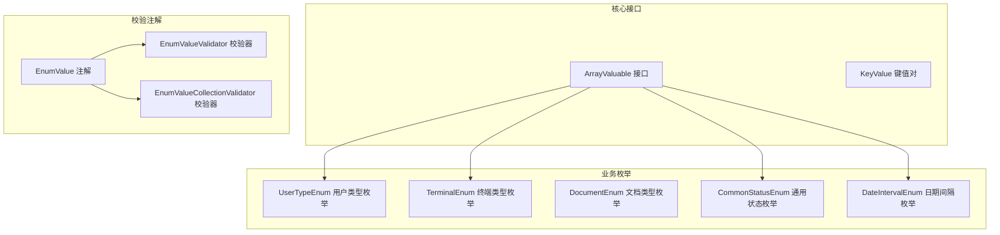

图表来源
- [ArrayValuable.java:1-16](file://pandora-framework/pandora-common/src/main/java/net/ittimeline/pandora/framework/common/core/ArrayValuable.java#L1-L16)
- [KeyValue.java:1-25](file://pandora-framework/pandora-common/src/main/java/net/ittimeline/pandora/framework/common/core/KeyValue.java#L1-L25)
- [UserTypeEnum.java:1-48](file://pandora-framework/pandora-common/src/main/java/net/ittimeline/pandora/framework/common/enums/UserTypeEnum.java#L1-L48)
- [TerminalEnum.java:1-43](file://pandora-framework/pandora-common/src/main/java/net/ittimeline/pandora/framework/common/enums/TerminalEnum.java#L1-L43)
- [DocumentEnum.java:1-27](file://pandora-framework/pandora-common/src/main/java/net/ittimeline/pandora/framework/common/enums/DocumentEnum.java#L1-L27)
- [CommonStatusEnum.java:1-48](file://pandora-framework/pandora-common/src/main/java/net/ittimeline/pandora/framework/common/enums/CommonStatusEnum.java#L1-L48)
- [DateIntervalEnum.java:1-47](file://pandora-framework/pandora-common/src/main/java/net/ittimeline/pandora/framework/common/enums/DateIntervalEnum.java#L1-L47)
- [EnumValue.java:1-40](file://pandora-framework/pandora-common/src/main/java/net/ittimeline/pandora/framework/common/validation/EnumValue.java#L1-L40)
- [EnumValueValidator.java:1-49](file://pandora-framework/pandora-common/src/main/java/net/ittimeline/pandora/framework/common/validation/EnumValueValidator.java#L1-L49)
- [EnumValueCollectionValidator.java:1-50](file://pandora-framework/pandora-common/src/main/java/net/ittimeline/pandora/framework/common/validation/EnumValueCollectionValidator.java#L1-L50)

章节来源
- [ArrayValuable.java:1-16](file://pandora-framework/pandora-common/src/main/java/net/ittimeline/pandora/framework/common/core/ArrayValuable.java#L1-L16)
- [KeyValue.java:1-25](file://pandora-framework/pandora-common/src/main/java/net/ittimeline/pandora/framework/common/core/KeyValue.java#L1-L25)
- [UserTypeEnum.java:1-48](file://pandora-framework/pandora-common/src/main/java/net/ittimeline/pandora/framework/common/enums/UserTypeEnum.java#L1-L48)
- [TerminalEnum.java:1-43](file://pandora-framework/pandora-common/src/main/java/net/ittimeline/pandora/framework/common/enums/TerminalEnum.java#L1-L43)
- [DocumentEnum.java:1-27](file://pandora-framework/pandora-common/src/main/java/net/ittimeline/pandora/framework/common/enums/DocumentEnum.java#L1-L27)
- [CommonStatusEnum.java:1-48](file://pandora-framework/pandora-common/src/main/java/net/ittimeline/pandora/framework/common/enums/CommonStatusEnum.java#L1-L48)
- [DateIntervalEnum.java:1-47](file://pandora-framework/pandora-common/src/main/java/net/ittimeline/pandora/framework/common/enums/DateIntervalEnum.java#L1-L47)
- [EnumValue.java:1-40](file://pandora-framework/pandora-common/src/main/java/net/ittimeline/pandora/framework/common/validation/EnumValue.java#L1-L40)
- [EnumValueValidator.java:1-49](file://pandora-framework/pandora-common/src/main/java/net/ittimeline/pandora/framework/common/validation/EnumValueValidator.java#L1-L49)
- [EnumValueCollectionValidator.java:1-50](file://pandora-framework/pandora-common/src/main/java/net/ittimeline/pandora/framework/common/validation/EnumValueCollectionValidator.java#L1-L50)

## 核心组件
- ArrayValuable 接口：为枚举提供统一的数组化能力，便于批量校验、序列化、缓存等场景复用
- KeyValue 键值对：通用的数据容器，常用于返回值、配置项、映射表等场景
- 枚举族：围绕用户类型、终端类型、文档类型、通用状态、日期间隔构建的标准枚举集合
- 枚举值校验注解：通过 EnumValue 注解及其校验器，实现对单值与集合值的统一约束

章节来源
- [ArrayValuable.java:1-16](file://pandora-framework/pandora-common/src/main/java/net/ittimeline/pandora/framework/common/core/ArrayValuable.java#L1-L16)
- [KeyValue.java:1-25](file://pandora-framework/pandora-common/src/main/java/net/ittimeline/pandora/framework/common/core/KeyValue.java#L1-L25)
- [EnumValue.java:1-40](file://pandora-framework/pandora-common/src/main/java/net/ittimeline/pandora/framework/common/validation/EnumValue.java#L1-L40)
- [EnumValueValidator.java:1-49](file://pandora-framework/pandora-common/src/main/java/net/ittimeline/pandora/framework/common/validation/EnumValueValidator.java#L1-L49)
- [EnumValueCollectionValidator.java:1-50](file://pandora-framework/pandora-common/src/main/java/net/ittimeline/pandora/framework/common/validation/EnumValueCollectionValidator.java#L1-L50)

## 架构总览
系统以“接口能力 + 枚举实现 + 注解校验”三层协同的方式工作：
- 接口层：ArrayValuable 提供统一数组化能力
- 实现层：各业务枚举实现 ArrayValuable 并暴露静态数组常量
- 校验层：EnumValue 注解绑定枚举类，由两个校验器分别处理单值与集合值

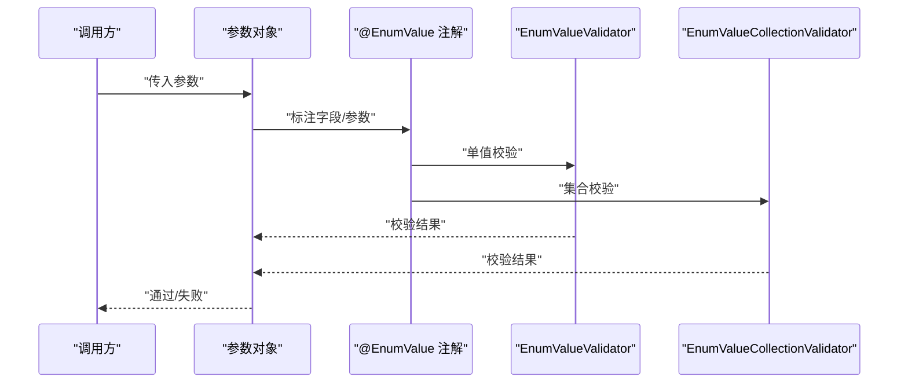

图表来源
- [EnumValue.java:1-40](file://pandora-framework/pandora-common/src/main/java/net/ittimeline/pandora/framework/common/validation/EnumValue.java#L1-L40)
- [EnumValueValidator.java:1-49](file://pandora-framework/pandora-common/src/main/java/net/ittimeline/pandora/framework/common/validation/EnumValueValidator.java#L1-L49)
- [EnumValueCollectionValidator.java:1-50](file://pandora-framework/pandora-common/src/main/java/net/ittimeline/pandora/framework/common/validation/EnumValueCollectionValidator.java#L1-L50)

## 详细组件分析

### ArrayValuable 接口与扩展机制
- 设计目标：为枚举提供统一的数组化输出能力，便于：
  - 校验器读取可用值集合
  - 序列化/反序列化时的值集导出
  - 缓存与索引构建
- 扩展方式：各枚举实现该接口并提供 array() 返回值数组；同时通常提供静态数组常量以避免重复计算
- 使用建议：
  - 保持值数组稳定且与枚举常量一一对应
  - 在 array() 中返回不可变或受控副本，避免外部修改

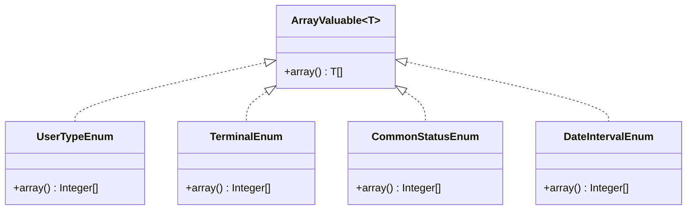

图表来源
- [ArrayValuable.java:1-16](file://pandora-framework/pandora-common/src/main/java/net/ittimeline/pandora/framework/common/core/ArrayValuable.java#L1-L16)
- [UserTypeEnum.java:1-48](file://pandora-framework/pandora-common/src/main/java/net/ittimeline/pandora/framework/common/enums/UserTypeEnum.java#L1-L48)
- [TerminalEnum.java:1-43](file://pandora-framework/pandora-common/src/main/java/net/ittimeline/pandora/framework/common/enums/TerminalEnum.java#L1-L43)
- [CommonStatusEnum.java:1-48](file://pandora-framework/pandora-common/src/main/java/net/ittimeline/pandora/framework/common/enums/CommonStatusEnum.java#L1-L48)
- [DateIntervalEnum.java:1-47](file://pandora-framework/pandora-common/src/main/java/net/ittimeline/pandora/framework/common/enums/DateIntervalEnum.java#L1-L47)

章节来源
- [ArrayValuable.java:1-16](file://pandora-framework/pandora-common/src/main/java/net/ittimeline/pandora/framework/common/core/ArrayValuable.java#L1-L16)
- [UserTypeEnum.java:1-48](file://pandora-framework/pandora-common/src/main/java/net/ittimeline/pandora/framework/common/enums/UserTypeEnum.java#L1-L48)
- [TerminalEnum.java:1-43](file://pandora-framework/pandora-common/src/main/java/net/ittimeline/pandora/framework/common/enums/TerminalEnum.java#L1-L43)
- [CommonStatusEnum.java:1-48](file://pandora-framework/pandora-common/src/main/java/net/ittimeline/pandora/framework/common/enums/CommonStatusEnum.java#L1-L48)
- [DateIntervalEnum.java:1-47](file://pandora-framework/pandora-common/src/main/java/net/ittimeline/pandora/framework/common/enums/DateIntervalEnum.java#L1-L47)

### KeyValue 键值对数据结构
- 设计目标：提供通用的键值对封装，便于：
  - 返回值包装（如字典、映射表）
  - 配置项与动态参数传递
  - 轻量级序列化/反序列化
- 使用建议：
  - 明确键值类型，避免使用 Object 导致的类型安全问题
  - 对外暴露只读访问，必要时提供不可变副本

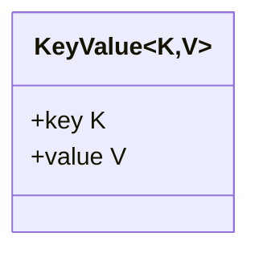

图表来源
- [KeyValue.java:1-25](file://pandora-framework/pandora-common/src/main/java/net/ittimeline/pandora/framework/common/core/KeyValue.java#L1-L25)

章节来源
- [KeyValue.java:1-25](file://pandora-framework/pandora-common/src/main/java/net/ittimeline/pandora/framework/common/core/KeyValue.java#L1-L25)

### UserTypeEnum 用户类型枚举
- 设计原则：
  - 以业务角色为核心区分维度（C端会员、B端管理员）
  - 通过实现 ArrayValuable 提供统一数组化能力
  - 提供静态工厂方法按值查找
- 使用场景：
  - 权限控制与访问策略
  - 用户画像与行为分析
  - 日志与审计追踪
- 最佳实践：
  - 新增类型时同步更新数组常量与查找逻辑
  - 与权限框架集成时，优先使用枚举而非原始值

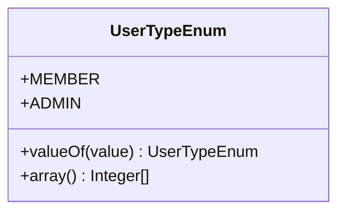

图表来源
- [UserTypeEnum.java:1-48](file://pandora-framework/pandora-common/src/main/java/net/ittimeline/pandora/framework/common/enums/UserTypeEnum.java#L1-L48)

章节来源
- [UserTypeEnum.java:1-48](file://pandora-framework/pandora-common/src/main/java/net/ittimeline/pandora/framework/common/enums/UserTypeEnum.java#L1-L48)

### TerminalEnum 终端类型枚举
- 设计原则：
  - 覆盖主流终端形态（微信小程序、H5、App等）
  - 提供默认“未知”终端以兜底
  - 通过实现 ArrayValuable 提供统一数组化能力
- 使用场景：
  - 登录/注册渠道识别
  - 推送与通知适配
  - 统计与分析维度
- 最佳实践：
  - 新增终端类型时，确保值唯一且预留扩展空间
  - 与前端/移动端约定一致的枚举值映射

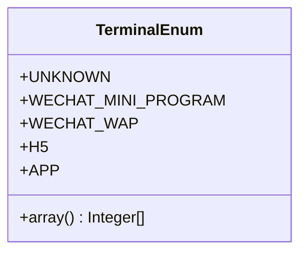

图表来源
- [TerminalEnum.java:1-43](file://pandora-framework/pandora-common/src/main/java/net/ittimeline/pandora/framework/common/enums/TerminalEnum.java#L1-L43)

章节来源
- [TerminalEnum.java:1-43](file://pandora-framework/pandora-common/src/main/java/net/ittimeline/pandora/framework/common/enums/TerminalEnum.java#L1-L43)

### DocumentEnum 文档类型枚举
- 设计原则：
  - 以文档链接与说明为主，不强制实现 ArrayValuable
  - 适合静态文档目录与指引场景
- 使用场景：
  - 帮助文档与指引跳转
  - SaaS 多租户与平台文档入口
- 最佳实践：
  - URL 与 memo 字段保持简洁明确
  - 与前端路由或外部文档平台对接时保持一致性

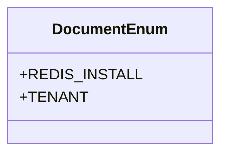

图表来源
- [DocumentEnum.java:1-27](file://pandora-framework/pandora-common/src/main/java/net/ittimeline/pandora/framework/common/enums/DocumentEnum.java#L1-L27)

章节来源
- [DocumentEnum.java:1-27](file://pandora-framework/pandora-common/src/main/java/net/ittimeline/pandora/framework/common/enums/DocumentEnum.java#L1-L27)

### CommonStatusEnum 通用状态枚举
- 设计原则：
  - 提供启用/禁用两类状态，典型业务开关
  - 实现 ArrayValuable 并提供工具方法判断状态
- 使用场景：
  - 功能开关、资源状态、配置项开关
  - 列表过滤与筛选
- 最佳实践：
  - 状态值应具备幂等性与可逆性
  - 与业务流程结合时，提供清晰的转换规则

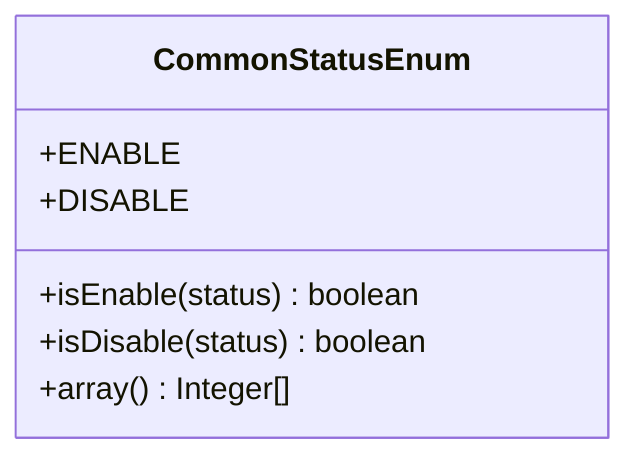

图表来源
- [CommonStatusEnum.java:1-48](file://pandora-framework/pandora-common/src/main/java/net/ittimeline/pandora/framework/common/enums/CommonStatusEnum.java#L1-L48)

章节来源
- [CommonStatusEnum.java:1-48](file://pandora-framework/pandora-common/src/main/java/net/ittimeline/pandora/framework/common/enums/CommonStatusEnum.java#L1-L48)

### DateIntervalEnum 日期间隔枚举
- 设计原则：
  - 支持小时至年的常见统计粒度
  - 提供统一数组化能力与按值查找
- 使用场景：
  - 报表与趋势分析的时间维度
  - 缓存与数据聚合的时间窗口
- 最佳实践：
  - 与时间工具库配合使用，避免边界问题
  - 在跨时区场景下注意夏令时与本地化

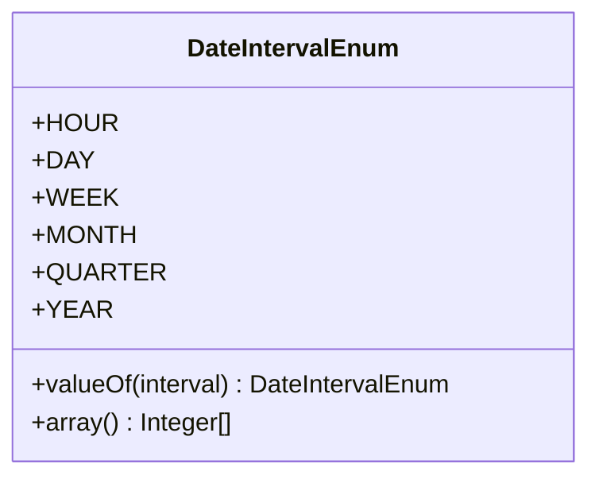

图表来源
- [DateIntervalEnum.java:1-47](file://pandora-framework/pandora-common/src/main/java/net/ittimeline/pandora/framework/common/enums/DateIntervalEnum.java#L1-L47)

章节来源
- [DateIntervalEnum.java:1-47](file://pandora-framework/pandora-common/src/main/java/net/ittimeline/pandora/framework/common/enums/DateIntervalEnum.java#L1-L47)

### 枚举值校验注解与机制
- EnumValue 注解：
  - 通过 value 参数绑定实现 ArrayValuable 的枚举类
  - 支持字段、参数、构造器等多种目标类型
- 校验器：
  - EnumValueValidator：校验单个值是否在枚举数组内
  - EnumValueCollectionValidator：校验集合中的每个元素均在枚举数组内
- 行为特性：
  - 空值默认放行（不触发校验）
  - 校验失败时可定制错误消息模板

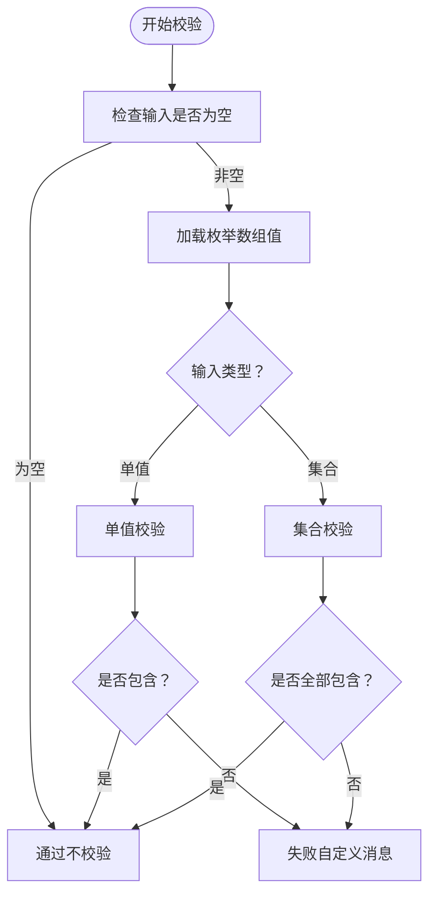

图表来源
- [EnumValue.java:1-40](file://pandora-framework/pandora-common/src/main/java/net/ittimeline/pandora/framework/common/validation/EnumValue.java#L1-L40)
- [EnumValueValidator.java:1-49](file://pandora-framework/pandora-common/src/main/java/net/ittimeline/pandora/framework/common/validation/EnumValueValidator.java#L1-L49)
- [EnumValueCollectionValidator.java:1-50](file://pandora-framework/pandora-common/src/main/java/net/ittimeline/pandora/framework/common/validation/EnumValueCollectionValidator.java#L1-L50)

章节来源
- [EnumValue.java:1-40](file://pandora-framework/pandora-common/src/main/java/net/ittimeline/pandora/framework/common/validation/EnumValue.java#L1-L40)
- [EnumValueValidator.java:1-49](file://pandora-framework/pandora-common/src/main/java/net/ittimeline/pandora/framework/common/validation/EnumValueValidator.java#L1-L49)
- [EnumValueCollectionValidator.java:1-50](file://pandora-framework/pandora-common/src/main/java/net/ittimeline/pandora/framework/common/validation/EnumValueCollectionValidator.java#L1-L50)

## 依赖分析
- 枚举与 ArrayValuable 的耦合：
  - 所有实现 ArrayValuable 的枚举均可被 EnumValue 注解直接使用
  - 通过 getEnumConstants 与 array() 方法建立运行时契约
- 校验器与注解的耦合：
  - 两个校验器共享相同的初始化逻辑（加载枚举数组）
  - 通过 ConstraintValidator 接口实现统一校验协议
- 外部依赖：
  - 使用工具库进行数组与集合操作（如首次匹配、包含判断）
  - 使用 Lombok 简化 POJO 结构

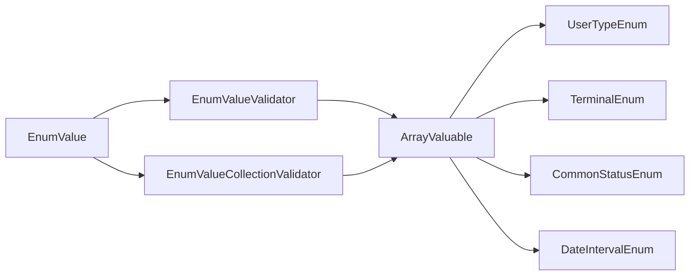

图表来源
- [ArrayValuable.java:1-16](file://pandora-framework/pandora-common/src/main/java/net/ittimeline/pandora/framework/common/core/ArrayValuable.java#L1-L16)
- [UserTypeEnum.java:1-48](file://pandora-framework/pandora-common/src/main/java/net/ittimeline/pandora/framework/common/enums/UserTypeEnum.java#L1-L48)
- [TerminalEnum.java:1-43](file://pandora-framework/pandora-common/src/main/java/net/ittimeline/pandora/framework/common/enums/TerminalEnum.java#L1-L43)
- [CommonStatusEnum.java:1-48](file://pandora-framework/pandora-common/src/main/java/net/ittimeline/pandora/framework/common/enums/CommonStatusEnum.java#L1-L48)
- [DateIntervalEnum.java:1-47](file://pandora-framework/pandora-common/src/main/java/net/ittimeline/pandora/framework/common/enums/DateIntervalEnum.java#L1-L47)
- [EnumValue.java:1-40](file://pandora-framework/pandora-common/src/main/java/net/ittimeline/pandora/framework/common/validation/EnumValue.java#L1-L40)
- [EnumValueValidator.java:1-49](file://pandora-framework/pandora-common/src/main/java/net/ittimeline/pandora/framework/common/validation/EnumValueValidator.java#L1-L49)
- [EnumValueCollectionValidator.java:1-50](file://pandora-framework/pandora-common/src/main/java/net/ittimeline/pandora/framework/common/validation/EnumValueCollectionValidator.java#L1-L50)

章节来源
- [ArrayValuable.java:1-16](file://pandora-framework/pandora-common/src/main/java/net/ittimeline/pandora/framework/common/core/ArrayValuable.java#L1-L16)
- [UserTypeEnum.java:1-48](file://pandora-framework/pandora-common/src/main/java/net/ittimeline/pandora/framework/common/enums/UserTypeEnum.java#L1-L48)
- [TerminalEnum.java:1-43](file://pandora-framework/pandora-common/src/main/java/net/ittimeline/pandora/framework/common/enums/TerminalEnum.java#L1-L43)
- [CommonStatusEnum.java:1-48](file://pandora-framework/pandora-common/src/main/java/net/ittimeline/pandora/framework/common/enums/CommonStatusEnum.java#L1-L48)
- [DateIntervalEnum.java:1-47](file://pandora-framework/pandora-common/src/main/java/net/ittimeline/pandora/framework/common/enums/DateIntervalEnum.java#L1-L47)
- [EnumValue.java:1-40](file://pandora-framework/pandora-common/src/main/java/net/ittimeline/pandora/framework/common/validation/EnumValue.java#L1-L40)
- [EnumValueValidator.java:1-49](file://pandora-framework/pandora-common/src/main/java/net/ittimeline/pandora/framework/common/validation/EnumValueValidator.java#L1-L49)
- [EnumValueCollectionValidator.java:1-50](file://pandora-framework/pandora-common/src/main/java/net/ittimeline/pandora/framework/common/validation/EnumValueCollectionValidator.java#L1-L50)

## 性能考虑
- 枚举数组常量复用：通过静态数组常量避免每次调用 array() 时的流式转换开销
- 校验器初始化：在校验器初始化阶段一次性加载枚举数组，后续校验直接使用内存中的列表
- 空值短路：空值不触发校验，减少不必要的比较
- 建议：
  - 在高频校验场景下，优先使用单例校验器实例
  - 对超大枚举集合，考虑分片或索引优化

## 故障排查指南
- 常见问题
  - 校验失败但提示不明确：检查注解 message 是否被覆盖或模板变量未替换
  - 集合校验误判：确认集合元素类型与枚举值类型一致
  - 空值异常：确认业务层是否允许空值，以及是否需要显式校验
- 排查步骤
  - 打印当前绑定的枚举类与数组值
  - 对比输入值与枚举数组，定位差异
  - 在单元测试中模拟边界值（空、null、越界）

章节来源
- [EnumValueValidator.java:1-49](file://pandora-framework/pandora-common/src/main/java/net/ittimeline/pandora/framework/common/validation/EnumValueValidator.java#L1-L49)
- [EnumValueCollectionValidator.java:1-50](file://pandora-framework/pandora-common/src/main/java/net/ittimeline/pandora/framework/common/validation/EnumValueCollectionValidator.java#L1-L50)

## 结论
该枚举定义系统通过统一的 ArrayValuable 接口与注解校验机制，实现了业务枚举的标准化、可扩展与强约束。结合 KeyValue 键值对结构，能够高效支撑权限、终端、状态、时间等多维业务场景。遵循本文的最佳实践与排错建议，可在保证类型安全的同时提升开发效率与系统稳定性。

## 附录

### 最佳实践清单
- 命名规范
  - 枚举类名使用名词或复合词，体现业务含义
  - 枚举常量使用全大写与下划线风格，清晰表达取值
- 扩展方法
  - 新增枚举值时，同步维护数组常量与查找方法
  - 对外暴露只读访问，避免内部状态被修改
- 国际化支持
  - 将名称字段纳入国际化资源，按语言环境动态渲染
  - 对于校验错误消息，支持多语言模板与占位符替换